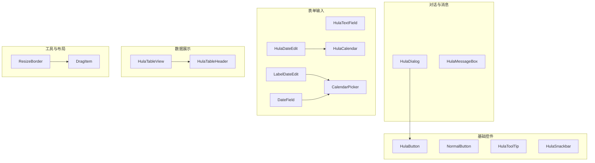
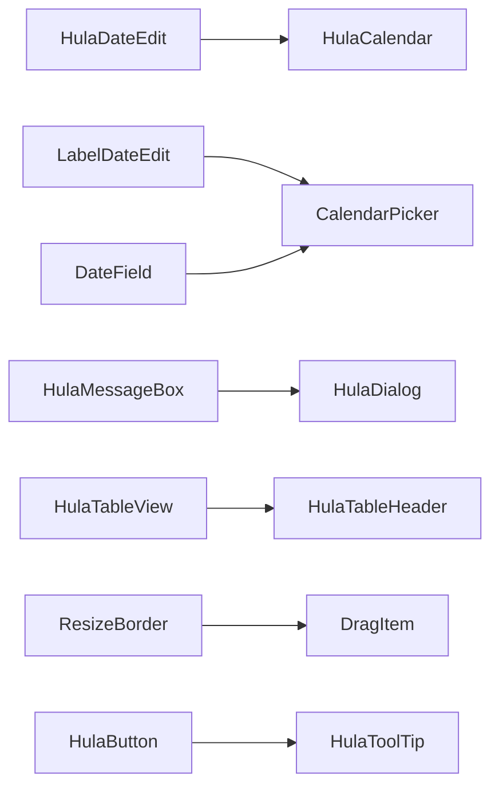
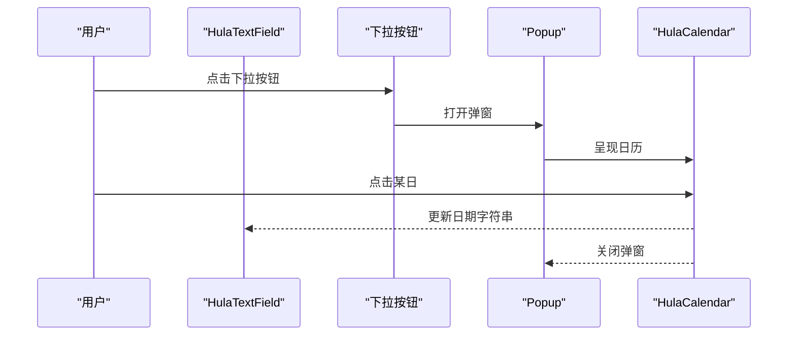
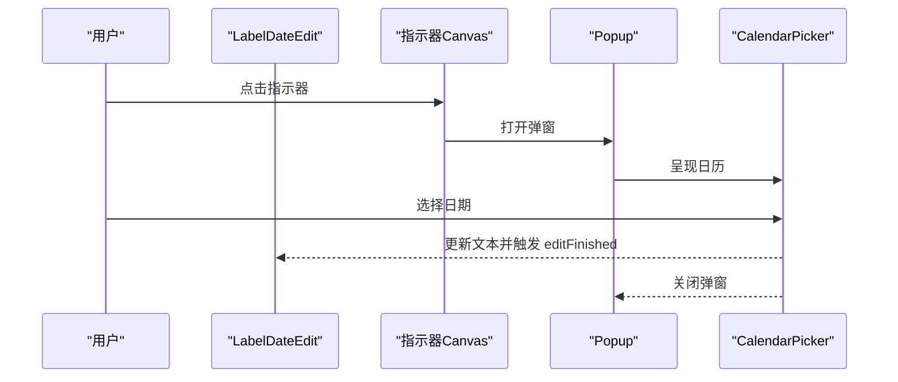
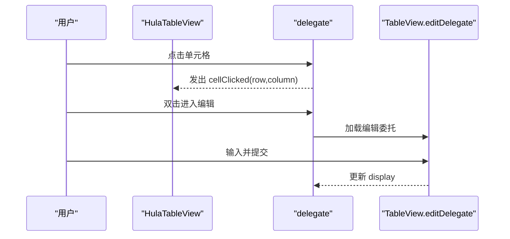
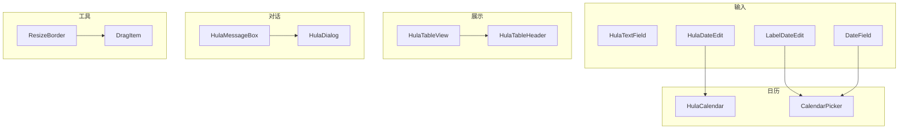

# UI组件库

<cite>
**本文档引用的文件**
- [HulaButton.qml](file://src/HulaUI/HulaButton.qml)
- [HulaDialog.qml](file://src/HulaUI/HulaDialog.qml)
- [HulaToolTip.qml](file://src/HulaUI/HulaToolTip.qml)
- [HulaTextField.qml](file://src/HulaUI/HulaTextField.qml)
- [HulaDateEdit.qml](file://src/HulaUI/HulaDateEdit.qml)
- [HulaCalendar.qml](file://src/HulaUI/HulaCalendar.qml)
- [CalendarPicker.qml](file://src/HulaUI/CalendarPicker.qml)
- [DateField.qml](file://src/HulaUI/DateField.qml)
- [LabelDateEdit.qml](file://src/HulaUI/LabelDateEdit.qml)
- [HulaTableView.qml](file://src/HulaUI/HulaTableView.qml)
- [HulaTableHeader.qml](file://src/HulaUI/HulaTableHeader.qml)
- [DragItem.qml](file://src/HulaUI/DragItem.qml)
- [ResizeBorder.qml](file://src/HulaUI/ResizeBorder.qml)
- [NormalButton.qml](file://src/HulaUI/NormalButton.qml)
- [HulaMessageBox.qml](file://src/HulaUI/HulaMessageBox.qml)
- [HulaSnackbar.qml](file://src/HulaUI/HulaSnackbar.qml)
</cite>

## 目录
1. [简介](#简介)
2. [项目结构](#项目结构)
3. [核心组件](#核心组件)
4. [架构总览](#架构总览)
5. [组件详解](#组件详解)
6. [依赖关系分析](#依赖关系分析)
7. [性能考量](#性能考量)
8. [故障排查指南](#故障排查指南)
9. [结论](#结论)
10. [附录](#附录)

## 简介
本文件为 QmlPlugins 项目中 HulaUI 组件库的系统化组件文档，覆盖基础组件（按钮、对话框、工具提示）、表单组件（文本框、日期编辑器、日历）、数据展示组件（表格视图、表头组件）以及工具组件（拖拽元素、标签编辑器）。文档从设计理念、属性与信号、样式定制、交互流程、响应式特性与可访问性支持等方面进行说明，并提供使用示例与最佳实践，帮助开发者快速理解与集成。

## 项目结构
HulaUI 组件集中于 src/HulaUI 目录，按功能域划分为：
- 基础控件：HulaButton、NormalButton、HulaToolTip、HulaSnackbar
- 对话与消息：HulaDialog、HulaMessageBox
- 表单输入：HulaTextField、HulaDateEdit、LabelDateEdit、DateField、CalendarPicker、HulaCalendar
- 数据展示：HulaTableView、HulaTableHeader
- 工具与布局：DragItem、ResizeBorder

图表来源
- [HulaButton.qml:1-81](file://src/HulaUI/HulaButton.qml#L1-L81)
- [HulaDialog.qml:1-383](file://src/HulaUI/HulaDialog.qml#L1-L383)
- [HulaTextField.qml:1-45](file://src/HulaUI/HulaTextField.qml#L1-L45)
- [HulaDateEdit.qml:1-108](file://src/HulaUI/HulaDateEdit.qml#L1-L108)
- [LabelDateEdit.qml:1-127](file://src/HulaUI/LabelDateEdit.qml#L1-L127)
- [DateField.qml:1-38](file://src/HulaUI/DateField.qml#L1-L38)
- [CalendarPicker.qml:1-166](file://src/HulaUI/CalendarPicker.qml#L1-L166)
- [HulaCalendar.qml:1-269](file://src/HulaUI/HulaCalendar.qml#L1-L269)
- [HulaTableView.qml:1-415](file://src/HulaUI/HulaTableView.qml#L1-L415)
- [HulaTableHeader.qml:1-203](file://src/HulaUI/HulaTableHeader.qml#L1-L203)
- [DragItem.qml:1-46](file://src/HulaUI/DragItem.qml#L1-L46)
- [ResizeBorder.qml:1-130](file://src/HulaUI/ResizeBorder.qml#L1-L130)

章节来源
- [HulaButton.qml:1-81](file://src/HulaUI/HulaButton.qml#L1-L81)
- [HulaDialog.qml:1-383](file://src/HulaUI/HulaDialog.qml#L1-L383)
- [HulaTextField.qml:1-45](file://src/HulaUI/HulaTextField.qml#L1-L45)
- [HulaDateEdit.qml:1-108](file://src/HulaUI/HulaDateEdit.qml#L1-L108)
- [LabelDateEdit.qml:1-127](file://src/HulaUI/LabelDateEdit.qml#L1-L127)
- [DateField.qml:1-38](file://src/HulaUI/DateField.qml#L1-L38)
- [CalendarPicker.qml:1-166](file://src/HulaUI/CalendarPicker.qml#L1-L166)
- [HulaCalendar.qml:1-269](file://src/HulaUI/HulaCalendar.qml#L1-L269)
- [HulaTableView.qml:1-415](file://src/HulaUI/HulaTableView.qml#L1-L415)
- [HulaTableHeader.qml:1-203](file://src/HulaUI/HulaTableHeader.qml#L1-L203)
- [DragItem.qml:1-46](file://src/HulaUI/DragItem.qml#L1-L46)
- [ResizeBorder.qml:1-130](file://src/HulaUI/ResizeBorder.qml#L1-L130)

## 核心组件
- 按钮系列：HulaButton 支持图标、悬停态、选中态、圆角与多态色彩；NormalButton 提供主题色与按下事件信号。
- 文本输入：HulaTextField 提供 Material 风格边框与焦点过渡动画；DateField/LabelDateEdit/HulaDateEdit 提供日历选择弹窗。
- 日历体系：CalendarPicker 与 HulaCalendar 提供年/月导航、今日高亮、选中态与自绘委托。
- 表格体系：HulaTableView 支持行列宽、交替行色、表头、滚动条、单元格编辑与信号；HulaTableHeader 仅渲染表头。
- 对话与消息：HulaDialog 提供多种入场/出场动画与自动销毁；HulaMessageBox 提供确认/取消回调与倒计时自动关闭。
- 工具组件：DragItem 提供拖拽光标与位移信号；ResizeBorder 将拖拽映射为四角/四边缩放。

章节来源
- [HulaButton.qml:1-81](file://src/HulaUI/HulaButton.qml#L1-L81)
- [NormalButton.qml:1-36](file://src/HulaUI/NormalButton.qml#L1-L36)
- [HulaTextField.qml:1-45](file://src/HulaUI/HulaTextField.qml#L1-L45)
- [HulaDateEdit.qml:1-108](file://src/HulaUI/HulaDateEdit.qml#L1-L108)
- [LabelDateEdit.qml:1-127](file://src/HulaUI/LabelDateEdit.qml#L1-L127)
- [DateField.qml:1-38](file://src/HulaUI/DateField.qml#L1-L38)
- [CalendarPicker.qml:1-166](file://src/HulaUI/CalendarPicker.qml#L1-L166)
- [HulaCalendar.qml:1-269](file://src/HulaUI/HulaCalendar.qml#L1-L269)
- [HulaTableView.qml:1-415](file://src/HulaUI/HulaTableView.qml#L1-L415)
- [HulaTableHeader.qml:1-203](file://src/HulaUI/HulaTableHeader.qml#L1-L203)
- [HulaDialog.qml:1-383](file://src/HulaUI/HulaDialog.qml#L1-L383)
- [HulaMessageBox.qml:1-128](file://src/HulaUI/HulaMessageBox.qml#L1-L128)
- [DragItem.qml:1-46](file://src/HulaUI/DragItem.qml#L1-L46)
- [ResizeBorder.qml:1-130](file://src/HulaUI/ResizeBorder.qml#L1-L130)

## 架构总览
HulaUI 以 Qt Quick Controls 为基础，通过组合与委托实现统一风格与可扩展性。组件间常见依赖关系如下：

图表来源
- [HulaDateEdit.qml:1-108](file://src/HulaUI/HulaDateEdit.qml#L1-L108)
- [HulaCalendar.qml:1-269](file://src/HulaUI/HulaCalendar.qml#L1-L269)
- [LabelDateEdit.qml:1-127](file://src/HulaUI/LabelDateEdit.qml#L1-L127)
- [CalendarPicker.qml:1-166](file://src/HulaUI/CalendarPicker.qml#L1-L166)
- [DateField.qml:1-38](file://src/HulaUI/DateField.qml#L1-L38)
- [HulaMessageBox.qml:1-128](file://src/HulaUI/HulaMessageBox.qml#L1-L128)
- [HulaDialog.qml:1-383](file://src/HulaUI/HulaDialog.qml#L1-L383)
- [HulaTableView.qml:1-415](file://src/HulaUI/HulaTableView.qml#L1-L415)
- [HulaTableHeader.qml:1-203](file://src/HulaUI/HulaTableHeader.qml#L1-L203)
- [ResizeBorder.qml:1-130](file://src/HulaUI/ResizeBorder.qml#L1-L130)
- [DragItem.qml:1-46](file://src/HulaUI/DragItem.qml#L1-L46)
- [HulaButton.qml:1-81](file://src/HulaUI/HulaButton.qml#L1-L81)
- [HulaToolTip.qml:1-19](file://src/HulaUI/HulaToolTip.qml#L1-L19)

## 组件详解

### 基础组件

#### HulaButton（按钮）
- 设计理念：支持图标、文字、悬停/按下/禁用态与圆角背景；可切换“选中/未选中”状态，适合工具栏与开关类按钮。
- 关键属性
  - tag、strTag：附加标识
  - textColor、iconImage、iconHovered、iconWidth、iconHeight：图标与文字样式
  - useState：是否启用选中态
  - radius、colorNormal/colorHovered/colorPressed/colorDisabled：多态色彩
- 关键信号/槽：onClicked（在 useState 启用时切换 checked/unchecked）
- 样式定制：通过 states 与 background 中的 Rectangle 实现不同状态背景与圆角
- 使用建议：hoverEnabled 开启；合理设置 iconWidth/Height 与 text 颜色以适配主题

章节来源
- [HulaButton.qml:1-81](file://src/HulaUI/HulaButton.qml#L1-L81)

#### NormalButton（普通按钮）
- 设计理念：基于 Fusion 主题，根据 hover/presse 状态应用主题色，提供鼠标按下坐标信号
- 关键属性：radius、mousePressed(x,y,obj)
- 样式定制：background 为圆角矩形，contentItem 为居中文本
- 使用建议：结合 Themer 主题色实现一致视觉

章节来源
- [NormalButton.qml:1-36](file://src/HulaUI/NormalButton.qml#L1-L36)

#### HulaToolTip（工具提示）
- 设计理念：随父级 hover 显示，文本非空时可见，浅灰背景与白色文字
- 关键属性：font.pixelSize、contentItem、background
- 使用建议：作为按钮等控件的 tipText 代理

章节来源
- [HulaToolTip.qml:1-19](file://src/HulaUI/HulaToolTip.qml#L1-L19)

#### HulaSnackbar（消息条）
- 设计理念：底部弹出式通知，支持停留时间、拖拽移动、悬停暂停与自动销毁
- 关键属性：text、duration、autoDestroy、deltaY
- 关键方法：openText(text)
- 使用建议：多条消息时通过 deltaY 垂直堆叠，避免遮挡

章节来源
- [HulaSnackbar.qml:1-94](file://src/HulaUI/HulaSnackbar.qml#L1-L94)

### 对话与消息

#### HulaDialog（对话框）
- 设计理念：模态对话框，支持标题栏、关闭按钮、阴影与多种动画入场/出场（fade/size/滑入等），可自动销毁
- 关键属性：defaultButton、formTitle、titlePixelSize、titleBar、animationType、duration、easingType、titleUseGradient、autoDestroy、backColor
- 关键信号：showForm、hideForm
- 关键方法：show()、hide()、getOkButton()
- 使用建议：在 visible 变化时触发 showForm/hideForm；根据需要设置 autoDestroy

章节来源
- [HulaDialog.qml:1-383](file://src/HulaUI/HulaDialog.qml#L1-L383)

#### HulaMessageBox（消息框）
- 设计理念：继承 HulaDialog，内置消息文本区与左右按钮，支持取消/确认回调与自动关闭倒计时
- 关键属性：messageText、buttonOkText、buttonCancelText、callbackOnCancel、callbackOnOK、autoClose、normalColor/hoveredColor/pressedColor
- 关键方法：Timer 控制倒计时
- 使用建议：autoClose 用于轻提示；回调函数处理业务逻辑

章节来源
- [HulaMessageBox.qml:1-128](file://src/HulaUI/HulaMessageBox.qml#L1-L128)

### 表单组件

#### HulaTextField（文本框）
- 设计理念：Material 风格边框，聚焦时边框颜色变化，提供过渡动画与内边距
- 关键属性：placeholderText、font.pixelSize、background（圆角+边框）、states/focus 切换
- 使用建议：与 Themer 主题联动，保持全局一致性

章节来源
- [HulaTextField.qml:1-45](file://src/HulaUI/HulaTextField.qml#L1-L45)

#### HulaDateEdit（日期编辑器）
- 设计理念：基于 HulaTextField，右侧提供下拉按钮，点击打开日历选择器，支持是否包含时间
- 关键属性：dateValue、useTime、editable
- 关键行为：点击下拉按钮或不可编辑时点击打开日历；选中日期后更新文本与日期值
- 使用建议：editable=false 时仅展示不可编辑状态

章节来源
- [HulaDateEdit.qml:1-108](file://src/HulaUI/HulaDateEdit.qml#L1-L108)

#### LabelDateEdit（带标签的日期编辑器）
- 设计理念：左侧/上方显示标签，点击指示器弹出日历，支持格式化输出
- 关键属性：labelPosition、labelSpacing、accentColor、dateFormat、labelText
- 关键行为：编辑完成触发 editFinished；指示器绘制为上下箭头
- 使用建议：labelPosition 与 padding 协同布局

章节来源
- [LabelDateEdit.qml:1-127](file://src/HulaUI/LabelDateEdit.qml#L1-L127)

#### DateField（下拉日历）
- 设计理念：ComboBox 形式的日期选择，弹出 CalendarPicker
- 关键属性：popupX/popupY、dateFormat
- 关键行为：选中日期后写回 editText 并关闭弹窗
- 使用建议：与本地化语言配合显示年/月导航

章节来源
- [DateField.qml:1-38](file://src/HulaUI/DateField.qml#L1-L38)

#### CalendarPicker（日历选择器）
- 设计理念：顶部年/月导航，中间星期行，底部月网格；今日高亮、选中态、半径圆点装饰
- 关键属性：accentColor、dateFormat、selectedDate、font、locale
- 关键行为：点击网格日期更新 selectedDate 并发出 clicked
- 使用建议：与 LabelDateEdit 或 DateField 组合使用

章节来源
- [CalendarPicker.qml:1-166](file://src/HulaUI/CalendarPicker.qml#L1-L166)

#### HulaCalendar（日历样式）
- 设计理念：自定义 CalendarStyle，支持导航箭头 Canvas、标题与星期委托、日期委托的多态颜色与字体
- 关键属性：normalBgColor/selectBgColor/outBgColor/disableBgColor/gridColor、darkTextColor/lightTextColor/outTextColor/disableTextColor
- 关键行为：通过 Canvas 绘制箭头，响应上一年/下一年、上一月/下一月
- 使用建议：与 HulaDateEdit 组合实现原生风格日历

章节来源
- [HulaCalendar.qml:1-269](file://src/HulaUI/HulaCalendar.qml#L1-L269)

### 数据展示组件

#### HulaTableView（表格视图）
- 设计理念：封装 TableView，提供表头、交替行色、滚动条、单元格编辑、按钮/复选框、信号与选择模型
- 关键属性：colModel、buttonColumns、rows/columns/view、selectionMode、useCellCheckbox/useCellButton/useCheckBox/useSelection、rowBorderWidth/columnBorderWidth、itemBorderColor、highlightColor、rowColor/alternatingRow/headerColor、rowHeight/verHeaderWidth/horHeaderHeight/columnsWidth/headerTitles、model/selectionModel/editTriggers、alternatingRows/currentRow/displayRowNo、headerUseGradient/headerGradient
- 关键信号：cellClicked(row,column)、cellDoubleClicked(row,column)、btnClicked(sender)、rowCountChanged、itemReused
- 关键方法：itemAtIndex(row,column)、checkBoxAt(index)、uncheckAll()、selectRow(row)
- 使用建议：合理设置 columnsWidth 与 headerTitles；使用 delegate 自定义单元格内容与交互

章节来源
- [HulaTableView.qml:1-415](file://src/HulaUI/HulaTableView.qml#L1-L415)

#### HulaTableHeader（表头组件）
- 设计理念：仅渲染表头区域，支持列宽拖拽、渐变背景与边框
- 关键属性：useCellCheckbox/useCellButton/useCheckBox/useSelection、rowBorderWidth/columnBorderWidth、itemBorderColor、highlightColor、rowColor/alternatingRow/headerColor、rowHeight/verHeaderWidth/horHeaderHeight、displayRowNo、headerUseGradient/headerGradient、view（绑定外部 TableView）
- 关键行为：列宽拖拽更新 view.columnsWidth 并强制布局
- 使用建议：与 HulaTableView 的 view 引用配合使用

章节来源
- [HulaTableHeader.qml:1-203](file://src/HulaUI/HulaTableHeader.qml#L1-L203)

### 工具组件

#### DragItem（拖拽元素）
- 设计理念：提供 8 个方向的拖拽手柄与光标类型，发射 posChange(xOffset,yOffset)
- 关键属性：containsMouse、posType、posLeftTop/posLeft/posLeftBottom/posTop/posBottom/posRightTop/posRight/posRightBottom
- 使用建议：与 ResizeBorder 组合实现四角/四边缩放

章节来源
- [DragItem.qml:1-46](file://src/HulaUI/DragItem.qml#L1-L46)

#### ResizeBorder（可调整边框）
- 设计理念：在 Item 四角/四边放置 DragItem，将拖拽转换为对目标对象 x/y/width/height 的修改
- 关键属性：control（默认 parent）、borderWidth
- 使用建议：确保 control 具备 x/y/width/height 属性；边界检查保证尺寸大于 0

章节来源
- [ResizeBorder.qml:1-130](file://src/HulaUI/ResizeBorder.qml#L1-L130)

### 组件交互序列图

#### HulaDateEdit 打开日历并选择日期

图表来源
- [HulaDateEdit.qml:1-108](file://src/HulaUI/HulaDateEdit.qml#L1-L108)
- [HulaCalendar.qml:1-269](file://src/HulaUI/HulaCalendar.qml#L1-L269)

#### LabelDateEdit 打开日历并完成编辑

图表来源
- [LabelDateEdit.qml:1-127](file://src/HulaUI/LabelDateEdit.qml#L1-L127)
- [CalendarPicker.qml:1-166](file://src/HulaUI/CalendarPicker.qml#L1-L166)

#### HulaTableView 单元格点击与编辑

图表来源
- [HulaTableView.qml:1-415](file://src/HulaUI/HulaTableView.qml#L1-L415)

### 类图（组件关系）

```mermaid
classDiagram
class HulaButton {
+property int tag
+property string textColor
+property string iconImage
+property bool useState
+property int radius
+onClicked()
}
class NormalButton {
+property int radius
+signal mousePressed(x,y,obj)
}
class HulaToolTip {
+property int font.pixelSize
}
class HulaSnackbar {
+property string text
+property int duration
+function openText(text)
}
class HulaDialog {
+property string formTitle
+property string animationType
+signal showForm()
+signal hideForm()
+function show()
+function hide()
}
class HulaMessageBox {
+property string messageText
+property string buttonOkText
+property string buttonCancelText
+property bool autoClose
}
class HulaTextField {
+property string placeholderText
}
class HulaDateEdit {
+property string dateValue
+property bool useTime
+property bool editable
}
class LabelDateEdit {
+property int labelPosition
+property color accentColor
+property string dateFormat
+signal editFinished
}
class DateField {
+property int popupX
+property int popupY
+property string dateFormat
}
class CalendarPicker {
+property color accentColor
+property string dateFormat
+property date selectedDate
+signal clicked
}
class HulaCalendar {
+property color gridColor
+property color darkTextColor
}
class HulaTableView {
+property var columnsWidth
+property var headerTitles
+signal cellClicked(row,column)
+signal cellDoubleClicked(row,column)
+function selectRow(row)
}
class HulaTableHeader {
+property bool headerUseGradient
+property int horHeaderHeight
}
class DragItem {
+signal posChange(xOffset,yOffset)
+property int posType
}
class ResizeBorder {
+property var control
+property int borderWidth
}
HulaDialog <|-- HulaMessageBox
HulaDateEdit --> HulaCalendar : "使用"
LabelDateEdit --> CalendarPicker : "使用"
DateField --> CalendarPicker : "使用"
HulaTableView --> HulaTableHeader : "表头"
ResizeBorder --> DragItem : "组合"
HulaButton --> HulaToolTip : "提示"
```

图表来源
- [HulaButton.qml:1-81](file://src/HulaUI/HulaButton.qml#L1-L81)
- [NormalButton.qml:1-36](file://src/HulaUI/NormalButton.qml#L1-L36)
- [HulaToolTip.qml:1-19](file://src/HulaUI/HulaToolTip.qml#L1-L19)
- [HulaSnackbar.qml:1-94](file://src/HulaUI/HulaSnackbar.qml#L1-L94)
- [HulaDialog.qml:1-383](file://src/HulaUI/HulaDialog.qml#L1-L383)
- [HulaMessageBox.qml:1-128](file://src/HulaUI/HulaMessageBox.qml#L1-L128)
- [HulaTextField.qml:1-45](file://src/HulaUI/HulaTextField.qml#L1-L45)
- [HulaDateEdit.qml:1-108](file://src/HulaUI/HulaDateEdit.qml#L1-L108)
- [LabelDateEdit.qml:1-127](file://src/HulaUI/LabelDateEdit.qml#L1-L127)
- [DateField.qml:1-38](file://src/HulaUI/DateField.qml#L1-L38)
- [CalendarPicker.qml:1-166](file://src/HulaUI/CalendarPicker.qml#L1-L166)
- [HulaCalendar.qml:1-269](file://src/HulaUI/HulaCalendar.qml#L1-L269)
- [HulaTableView.qml:1-415](file://src/HulaUI/HulaTableView.qml#L1-L415)
- [HulaTableHeader.qml:1-203](file://src/HulaUI/HulaTableHeader.qml#L1-L203)
- [DragItem.qml:1-46](file://src/HulaUI/DragItem.qml#L1-L46)
- [ResizeBorder.qml:1-130](file://src/HulaUI/ResizeBorder.qml#L1-L130)

## 依赖关系分析
- 组件内聚：各组件职责单一，如 HulaDateEdit 仅负责日期输入，日历由 HulaCalendar/CalendarPicker 提供
- 组件耦合：HulaDialog 作为容器型组件被 HulaMessageBox 继承；HulaTableView 与 HulaTableHeader 通过 view 引用解耦
- 外部依赖：大量使用 Qt Quick Controls、Fusion、Material、Labs QMLModels 与 GraphicalEffects
- 循环依赖：未发现循环导入；Popup/CalendarPicker 与 TextField/Dialog 之间为单向依赖

图表来源
- [HulaDateEdit.qml:1-108](file://src/HulaUI/HulaDateEdit.qml#L1-L108)
- [HulaCalendar.qml:1-269](file://src/HulaUI/HulaCalendar.qml#L1-L269)
- [LabelDateEdit.qml:1-127](file://src/HulaUI/LabelDateEdit.qml#L1-L127)
- [CalendarPicker.qml:1-166](file://src/HulaUI/CalendarPicker.qml#L1-L166)
- [DateField.qml:1-38](file://src/HulaUI/DateField.qml#L1-L38)
- [HulaMessageBox.qml:1-128](file://src/HulaUI/HulaMessageBox.qml#L1-L128)
- [HulaDialog.qml:1-383](file://src/HulaUI/HulaDialog.qml#L1-L383)
- [HulaTableView.qml:1-415](file://src/HulaUI/HulaTableView.qml#L1-L415)
- [HulaTableHeader.qml:1-203](file://src/HulaUI/HulaTableHeader.qml#L1-L203)
- [ResizeBorder.qml:1-130](file://src/HulaUI/ResizeBorder.qml#L1-L130)
- [DragItem.qml:1-46](file://src/HulaUI/DragItem.qml#L1-L46)

## 性能考量
- 委托与重用：HulaTableView 使用 delegate 渲染单元格，合理设置 reuseItems 与 forceLayout 可减少重绘
- 滚动与裁剪：开启 clip 与 boundsBehavior，避免超大模型导致的过度绘制
- 动画与阴影：HulaDialog 的多种动画与 RectangularGlow 在低端设备上可能带来开销，建议按需启用
- 字体与颜色：批量使用 Material/Themer 主题色，减少动态计算与频繁变更
- 弹窗与日历：CalendarPicker/HulaCalendar 在频繁打开时应避免重复创建，优先复用

## 故障排查指南
- 日期选择无效
  - 检查 HulaDateEdit 的 editable 与点击区域；确认日历 onReleased 是否触发
  - 参考：[HulaDateEdit.qml:1-108](file://src/HulaUI/HulaDateEdit.qml#L1-L108)
- 表头宽度拖拽异常
  - 确认 columnsWidth 数组长度与列数匹配；检查 MouseArea 的 lastX 与 width 计算
  - 参考：[HulaTableView.qml:1-415](file://src/HulaUI/HulaTableView.qml#L1-L415)
- 对话框动画不生效
  - 检查 animationType 与对应 PropertyAnimation 是否正确；确认 show()/hide() 分支
  - 参考：[HulaDialog.qml:1-383](file://src/HulaUI/HulaDialog.qml#L1-L383)
- Snackbar 不显示或过早消失
  - 检查 openText 调用与 duration；确认定时器与透明度动画
  - 参考：[HulaSnackbar.qml:1-94](file://src/HulaUI/HulaSnackbar.qml#L1-L94)
- ResizeBorder 缩放越界
  - 确保对 control.width/height/x/y 的边界检查；避免负尺寸
  - 参考：[ResizeBorder.qml:1-130](file://src/HulaUI/ResizeBorder.qml#L1-L130)

## 结论
HulaUI 组件库以统一风格与清晰职责划分构建，覆盖基础控件、表单输入、数据展示与工具辅助。通过合理的属性与信号设计、样式定制与动画支持，满足桌面应用的常用 UI 场景。建议在实际项目中遵循主题色与布局规范，结合本指南的最佳实践提升开发效率与用户体验。

## 附录
- 最佳实践
  - 使用 HulaDialog 作为通用容器，HulaMessageBox 作为确认类消息
  - 表格列宽与表头标题通过 columnsWidth/headerTitles 统一管理
  - 日历组件与国际化语言配合，确保年/月/日显示符合本地习惯
  - 对复杂交互使用委托与信号分离逻辑，保持组件简洁
- 集成指南
  - 在主窗口中通过 Loader 动态加载 HulaDialog 子页面，利用 autoDestroy 与 hideForm 生命周期管理
  - 将 HulaTableView 与数据模型解耦，通过 model/selectionModel 与外部业务层交互
  - 使用 ResizeBorder 快速实现可调整尺寸的面板或视图