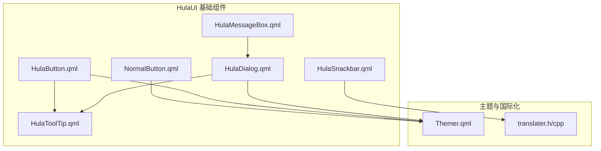
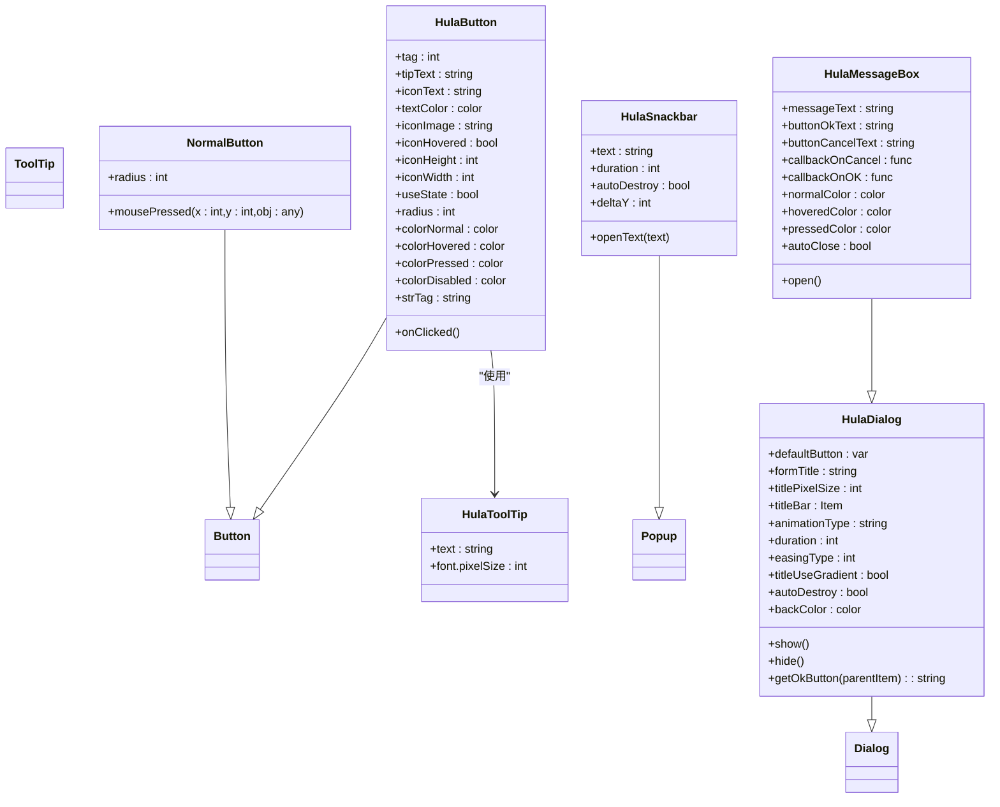
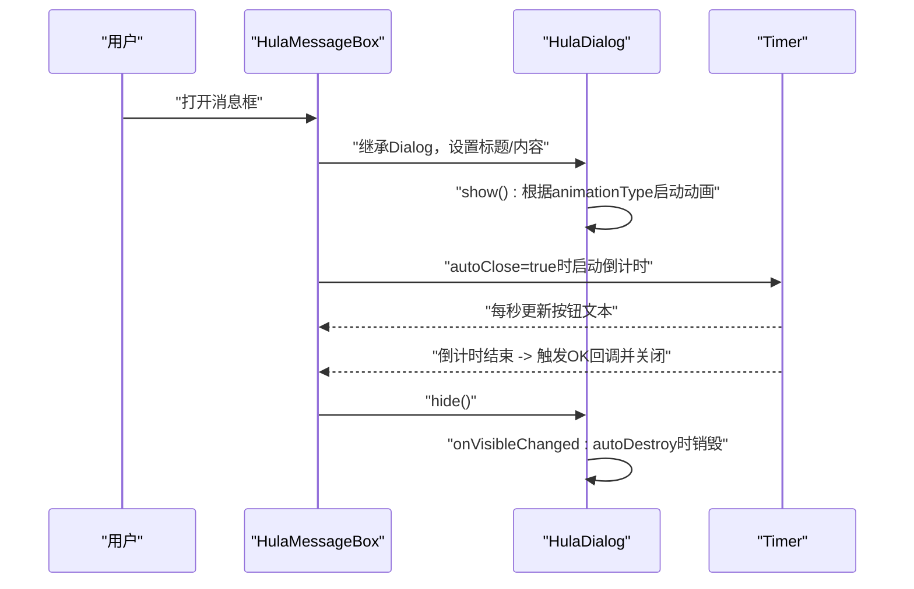
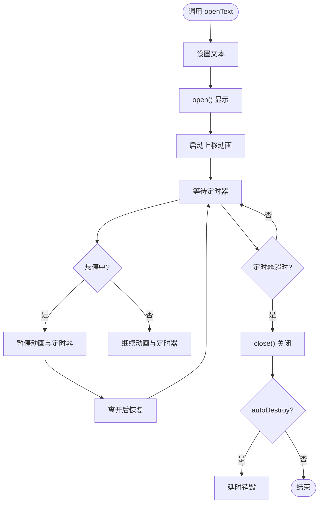
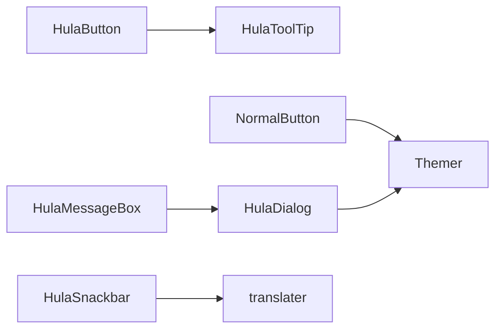

# 基础组件

<cite>
**本文引用的文件**
- [HulaButton.qml](file://src/HulaUI/HulaButton.qml)
- [NormalButton.qml](file://src/HulaUI/NormalButton.qml)
- [HulaDialog.qml](file://src/HulaUI/HulaDialog.qml)
- [HulaMessageBox.qml](file://src/HulaUI/HulaMessageBox.qml)
- [HulaSnackbar.qml](file://src/HulaUI/HulaSnackbar.qml)
- [HulaToolTip.qml](file://src/HulaUI/HulaToolTip.qml)
- [Themer.qml](file://src/QmlUI/Themer.qml)
- [translater.h](file://src/translater.h)
- [translater.cpp](file://src/translater.cpp)
</cite>

## 目录
1. [引言](#引言)
2. [项目结构](#项目结构)
3. [核心组件](#核心组件)
4. [架构总览](#架构总览)
5. [详细组件分析](#详细组件分析)
6. [依赖分析](#依赖分析)
7. [性能考虑](#性能考虑)
8. [故障排查指南](#故障排查指南)
9. [结论](#结论)
10. [附录](#附录)

## 引言
本文件面向HulaUI基础组件的使用者与维护者，系统梳理按钮、对话框、消息提示与工具提示四大类组件的设计与使用要点。重点覆盖：
- 组件属性与样式定制
- 事件与信号机制
- 模态显示、布局与交互模式
- 自动消失与动画策略
- 继承关系与扩展路径
- 样式覆盖与主题集成
- 性能优化与常见问题排查

## 项目结构
HulaUI基础组件位于src/HulaUI目录下，围绕Qt Quick Controls 2进行封装，统一通过主题系统与国际化模块实现外观与文案的一致性。

图示来源
- [HulaButton.qml](file://src/HulaUI/HulaButton.qml)
- [NormalButton.qml](file://src/HulaUI/NormalButton.qml)
- [HulaDialog.qml](file://src/HulaUI/HulaDialog.qml)
- [HulaMessageBox.qml](file://src/HulaUI/HulaMessageBox.qml)
- [HulaSnackbar.qml](file://src/HulaUI/HulaSnackbar.qml)
- [HulaToolTip.qml](file://src/HulaUI/HulaToolTip.qml)
- [Themer.qml](file://src/QmlUI/Themer.qml)
- [translater.h](file://src/translater.h)
- [translater.cpp](file://src/translater.cpp)

章节来源
- [HulaButton.qml](file://src/HulaUI/HulaButton.qml)
- [NormalButton.qml](file://src/HulaUI/NormalButton.qml)
- [HulaDialog.qml](file://src/HulaUI/HulaDialog.qml)
- [HulaMessageBox.qml](file://src/HulaUI/HulaMessageBox.qml)
- [HulaSnackbar.qml](file://src/HulaUI/HulaSnackbar.qml)
- [HulaToolTip.qml](file://src/HulaUI/HulaToolTip.qml)
- [Themer.qml](file://src/QmlUI/Themer.qml)
- [translater.h](file://src/translater.h)
- [translater.cpp](file://src/translater.cpp)

## 核心组件
本节对四大基础组件进行属性与行为概览，便于快速查阅与对比。

- 按钮组件
  - HulaButton：支持图标、文本、悬停/按下/禁用状态色、圆角半径、选中态切换等；内置工具提示；可绑定主题色。
  - NormalButton：基于主题色的普通按钮，提供鼠标按下坐标信号，便于上层实现点击反馈或拖拽逻辑。

- 对话框组件
  - HulaDialog：模态弹窗容器，支持标题栏拖拽、关闭按钮、多类型动画进入/退出、自动销毁、标准按钮检索等。
  - HulaMessageBox：在HulaDialog基础上封装确认/取消消息框，支持自动关闭倒计时、键盘回车响应、回调函数执行。

- 消息提示组件
  - HulaSnackbar：通知气泡，支持文本、停留时长、自动销毁、悬停暂停、拖拽移动、多条叠加位置计算。

- 工具提示组件
  - HulaToolTip：轻量悬浮提示，随父控件hover状态显示，支持自定义背景与文字颜色。

章节来源
- [HulaButton.qml](file://src/HulaUI/HulaButton.qml)
- [NormalButton.qml](file://src/HulaUI/NormalButton.qml)
- [HulaDialog.qml](file://src/HulaUI/HulaDialog.qml)
- [HulaMessageBox.qml](file://src/HulaUI/HulaMessageBox.qml)
- [HulaSnackbar.qml](file://src/HulaUI/HulaSnackbar.qml)
- [HulaToolTip.qml](file://src/HulaUI/HulaToolTip.qml)

## 架构总览
组件间存在清晰的继承与组合关系：HulaMessageBox继承HulaDialog，HulaButton内部复用HulaToolTip；主题与国际化分别通过Themer与translater注入。

图示来源
- [HulaButton.qml](file://src/HulaUI/HulaButton.qml)
- [NormalButton.qml](file://src/HulaUI/NormalButton.qml)
- [HulaDialog.qml](file://src/HulaUI/HulaDialog.qml)
- [HulaMessageBox.qml](file://src/HulaUI/HulaMessageBox.qml)
- [HulaSnackbar.qml](file://src/HulaUI/HulaSnackbar.qml)
- [HulaToolTip.qml](file://src/HulaUI/HulaToolTip.qml)

## 详细组件分析

### 按钮组件：HulaButton 与 NormalButton

- 设计要点
  - 状态管理：通过states与PropertyChanges实现“选中/未选中”切换，支持useState开关。
  - 视觉层次：background为Rectangle，内部包含图标与文本，支持图标悬停透明度变化。
  - 主题集成：NormalButton直接从主题色表读取正常/悬停/按下颜色；HulaButton支持自定义四态颜色与圆角。
  - 事件联动：HulaButton内置ToolTip，随父级hover状态显示；NormalButton发出mousePressed信号，便于上层处理。

- 关键属性与行为
  - HulaButton
    - 状态与外观：useState、radius、colorNormal/Hovered/Pressed/Disabled
    - 图标与文本：iconImage/iconWidth/iconHeight/iconHovered、textColor、tipText、iconText
    - 行为：onClicked切换选中态
  - NormalButton
    - 外观：radius
    - 事件：mousePressed(x, y, obj)

- 使用场景
  - HulaButton适用于需要“单选/复选”状态反馈的按钮组，如功能开关、过滤器等。
  - NormalButton适用于通用操作按钮，结合mousePressed实现点击波纹或拖拽。

章节来源
- [HulaButton.qml](file://src/HulaUI/HulaButton.qml)
- [NormalButton.qml](file://src/HulaUI/NormalButton.qml)
- [Themer.qml](file://src/QmlUI/Themer.qml)

### 对话框组件：HulaDialog 与 HulaMessageBox

- 设计要点
  - HulaDialog
    - 模态与关闭策略：modal/ApplicationModal、CloseOnEscape、autoDestroy
    - 标题栏：可拖拽、关闭按钮、渐变/背景色、字体大小
    - 动画系统：多种进入/退出动画（淡入、尺寸放大、飞入/飞出方向），通过PropertyAnimation与Easing组合
    - 内容组织：contentChildren递归查找默认按钮文本
  - HulaMessageBox
    - 文案与布局：消息文本区域、右侧按钮栏、左右布局
    - 交互：OK/Cancel回调、autoClose倒计时、键盘回车响应
    - 样式：Material风格按钮配色、背景色、标题栏隐藏

- 关键流程
  - 显示/隐藏：show()/hide()根据animationType选择对应动画序列
  - 默认按钮解析：getOkButton遍历contentChildren查找标记按钮
  - 自动关闭：Timer驱动倒计时，到达0触发OK回调并关闭

图示来源
- [HulaMessageBox.qml](file://src/HulaUI/HulaMessageBox.qml)
- [HulaDialog.qml](file://src/HulaUI/HulaDialog.qml)

章节来源
- [HulaDialog.qml](file://src/HulaUI/HulaDialog.qml)
- [HulaMessageBox.qml](file://src/HulaUI/HulaMessageBox.qml)

### 消息提示组件：HulaSnackbar

- 设计要点
  - 定位与层级：固定在父窗口右下角附近，y按deltaY累加以支持多条叠加
  - 动画与交互：NumberAnimation上移、鼠标悬停暂停、拖拽移动
  - 生命周期：定时器到期后关闭，autoDestroy=true时延时销毁
  - 文本适配：多行自动左对齐，单行居中对齐，最大宽度限制

- 关键流程
  - 打开：openText(text)设置文本、启动上移动画与定时器
  - 暂停/恢复：MouseArea onEntered/onExited暂停/恢复动画与定时器
  - 关闭：定时器触发close()，必要时destroy()

图示来源
- [HulaSnackbar.qml](file://src/HulaUI/HulaSnackbar.qml)

章节来源
- [HulaSnackbar.qml](file://src/HulaUI/HulaSnackbar.qml)

### 工具提示组件：HulaToolTip

- 设计要点
  - 条件显示：仅当父控件hover且text非空时可见
  - 内容渲染：纯文本，白色字体，深灰半透明背景，圆角矩形
  - 集成方式：HulaButton内部直接复用，无需额外绑定

章节来源
- [HulaToolTip.qml](file://src/HulaUI/HulaToolTip.qml)
- [HulaButton.qml](file://src/HulaUI/HulaButton.qml)

## 依赖分析
- 组件耦合
  - HulaMessageBox强依赖HulaDialog，复用其模态与动画能力
  - HulaButton内聚ToolTip，减少外部耦合
  - NormalButton与HulaButton均依赖主题系统，保证视觉一致性
- 外部依赖
  - 国际化：各组件通过translater.change实现动态语言切换
  - 主题：Themer提供统一的颜色与字体方案
  - 控件基类：Button/Dialog/Popup/ToolTip作为基类，确保行为一致

图示来源
- [HulaButton.qml](file://src/HulaUI/HulaButton.qml)
- [NormalButton.qml](file://src/HulaUI/NormalButton.qml)
- [HulaDialog.qml](file://src/HulaUI/HulaDialog.qml)
- [HulaMessageBox.qml](file://src/HulaUI/HulaMessageBox.qml)
- [HulaSnackbar.qml](file://src/HulaUI/HulaSnackbar.qml)
- [HulaToolTip.qml](file://src/HulaUI/HulaToolTip.qml)
- [Themer.qml](file://src/QmlUI/Themer.qml)
- [translater.h](file://src/translater.h)
- [translater.cpp](file://src/translater.cpp)

章节来源
- [HulaButton.qml](file://src/HulaUI/HulaButton.qml)
- [NormalButton.qml](file://src/HulaUI/NormalButton.qml)
- [HulaDialog.qml](file://src/HulaUI/HulaDialog.qml)
- [HulaMessageBox.qml](file://src/HulaUI/HulaMessageBox.qml)
- [HulaSnackbar.qml](file://src/HulaUI/HulaSnackbar.qml)
- [HulaToolTip.qml](file://src/HulaUI/HulaToolTip.qml)
- [Themer.qml](file://src/QmlUI/Themer.qml)
- [translater.h](file://src/translater.h)
- [translater.cpp](file://src/translater.cpp)

## 性能考虑
- 动画与重绘
  - 合理设置duration与easing，避免过多同时运行的动画造成卡顿
  - HulaSnackbar在悬停时暂停动画与定时器，降低CPU占用
- 资源加载
  - HulaButton图标通过file:前缀加载，注意路径有效性与缓存策略
- 内存管理
  - HulaDialog在autoDestroy=true时自动销毁，避免Loader持有残留
  - HulaSnackbar关闭后按需延时销毁，释放内存
- 主题与国际化
  - 通过Themer集中管理颜色，减少重复声明；translater.change触发局部刷新，避免全量重建

## 故障排查指南
- 按钮无状态切换
  - 检查HulaButton的useState是否开启，onClicked逻辑是否被外部拦截
- 图标不显示
  - 确认iconImage路径有效，file:前缀正确；检查source赋值与hover状态
- 对话框无法拖拽
  - 确认标题栏MouseArea未被遮挡；检查getRoot递归逻辑与父级尺寸
- 消息框不自动关闭
  - 检查HulaMessageBox的autoClose与Timer配置；确认回调未阻塞主线程
- Snackbar不消失
  - 检查duration与Timer间隔；确认autoDestroy与destroy时机
- 国际化文本未更新
  - 确认translater.change已连接到组件；检查qsTr与+ translater.change拼接

章节来源
- [HulaButton.qml](file://src/HulaUI/HulaButton.qml)
- [HulaDialog.qml](file://src/HulaUI/HulaDialog.qml)
- [HulaMessageBox.qml](file://src/HulaUI/HulaMessageBox.qml)
- [HulaSnackbar.qml](file://src/HulaUI/HulaSnackbar.qml)
- [translater.h](file://src/translater.h)
- [translater.cpp](file://src/translater.cpp)

## 结论
HulaUI基础组件以简洁的API与稳定的扩展点，提供了统一的视觉与交互体验。通过主题与国际化模块的解耦，组件具备良好的可维护性与可定制性。建议在复杂业务中优先复用现有组件，并遵循本文的属性与流程规范，以获得更佳的开发效率与用户体验。

## 附录

### 属性与信号参考（摘要）
- HulaButton
  - 属性：tag、tipText、iconText、textColor、iconImage、iconHovered、iconHeight、iconWidth、useState、radius、colorNormal/Hovered/Pressed/Disabled、strTag
  - 事件：onClicked
- NormalButton
  - 属性：radius
  - 信号：mousePressed(x, y, obj)
- HulaDialog
  - 属性：defaultButton、formTitle、titlePixelSize、titleBar、animationType、duration、easingType、titleUseGradient、autoDestroy、backColor
  - 方法：show()、hide()、getOkButton()
- HulaMessageBox
  - 属性：messageText、buttonOkText、buttonCancelText、callbackOnCancel、callbackOnOK、normalColor、hoveredColor、pressedColor、autoClose
- HulaSnackbar
  - 属性：text、duration、autoDestroy、deltaY
  - 方法：openText(text)
- HulaToolTip
  - 属性：text、font.pixelSize

章节来源
- [HulaButton.qml](file://src/HulaUI/HulaButton.qml)
- [NormalButton.qml](file://src/HulaUI/NormalButton.qml)
- [HulaDialog.qml](file://src/HulaUI/HulaDialog.qml)
- [HulaMessageBox.qml](file://src/HulaUI/HulaMessageBox.qml)
- [HulaSnackbar.qml](file://src/HulaUI/HulaSnackbar.qml)
- [HulaToolTip.qml](file://src/HulaUI/HulaToolTip.qml)