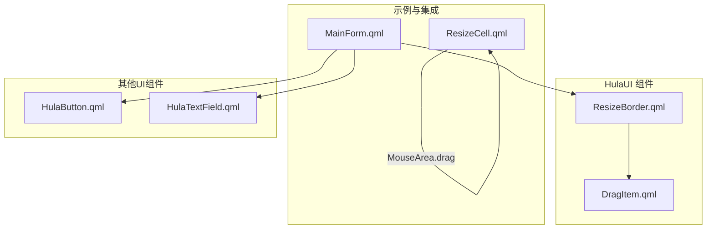
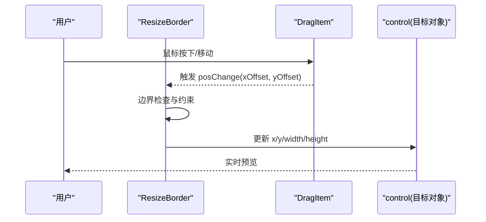
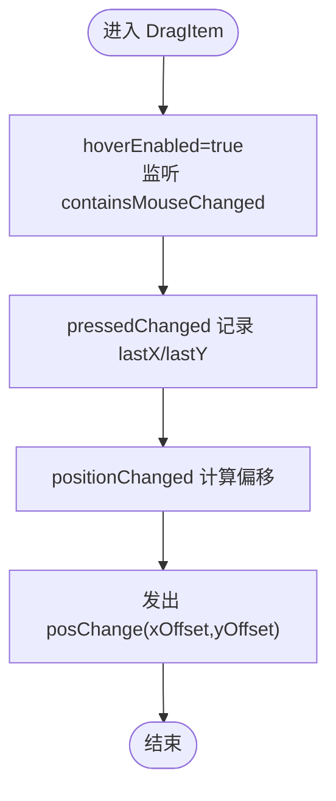
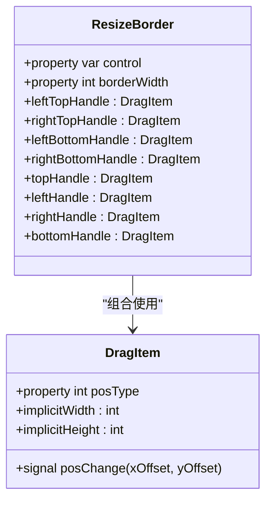
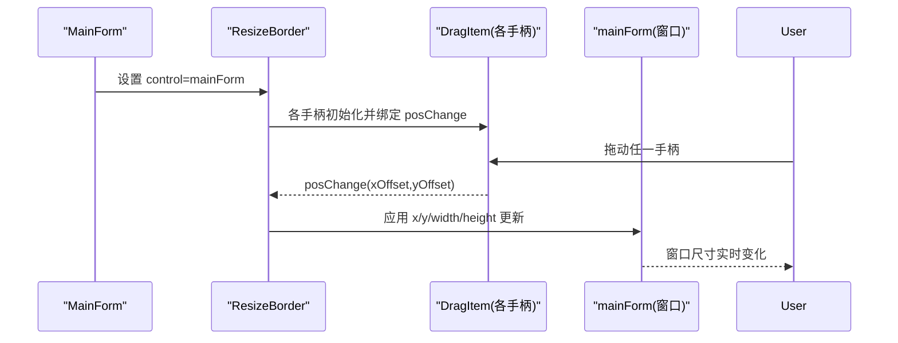
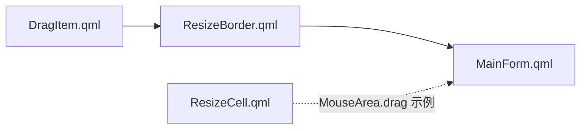

# 工具组件

<cite>
**本文引用的文件**
- [DragItem.qml](file://src/HulaUI/DragItem.qml)
- [ResizeBorder.qml](file://src/HulaUI/ResizeBorder.qml)
- [MainForm.qml](file://src/QmlUI/MainForm.qml)
- [ResizeCell.qml](file://src/QmlUI/ResizeCell.qml)
- [HulaButton.qml](file://src/HulaUI/HulaButton.qml)
- [HulaTextField.qml](file://src/HulaUI/HulaTextField.qml)
- [README.md](file://README.md)
</cite>

## 目录
1. [简介](#简介)
2. [项目结构](#项目结构)
3. [核心组件](#核心组件)
4. [架构总览](#架构总览)
5. [详细组件分析](#详细组件分析)
6. [依赖关系分析](#依赖关系分析)
7. [性能考量](#性能考量)
8. [故障排除指南](#故障排除指南)
9. [结论](#结论)
10. [附录](#附录)

## 简介
本文件面向HulaUI工具组件，聚焦两个关键能力：
- 拖拽元素：DragItem 的拖拽行为、视觉反馈、数据传输与放置检测
- 尺寸调整：ResizeBorder 的四角/四边拖拽、边界约束与实时预览

文档将从实现原理、事件处理机制、状态管理、可配置参数、样式定制、性能优化、典型应用场景到故障排除与最佳实践进行系统化说明，并通过图示帮助读者快速理解组件交互与数据流。

## 项目结构
HulaUI工具组件位于 src/HulaUI 目录，其中 DragItem 和 ResizeBorder 是本次文档关注的核心。MainForm.qml 展示了 ResizeBorder 在主窗口中的集成方式；ResizeCell.qml 提供了另一种基于 MouseArea 的简单拖拽示例，便于对比理解。

图表来源
- [DragItem.qml:1-46](file://src/HulaUI/DragItem.qml#L1-L46)
- [ResizeBorder.qml:1-130](file://src/HulaUI/ResizeBorder.qml#L1-L130)
- [MainForm.qml:66-70](file://src/QmlUI/MainForm.qml#L66-L70)
- [ResizeCell.qml:32-38](file://src/QmlUI/ResizeCell.qml#L32-L38)

章节来源
- [README.md:36-45](file://README.md#L36-L45)

## 核心组件
- DragItem：提供鼠标悬停光标提示、按下记录初始位置、拖动时计算位移并发出 posChange 信号，用于上层容器接收偏移量并更新目标对象的位置或尺寸。
- ResizeBorder：在父容器四周布置八个拖拽手柄（四角+四边），每个手柄内部复用 DragItem 并在 posChange 回调中执行边界检查与尺寸/位置更新，最终作用于 control 指定的目标对象。

章节来源
- [DragItem.qml:1-46](file://src/HulaUI/DragItem.qml#L1-L46)
- [ResizeBorder.qml:1-130](file://src/HulaUI/ResizeBorder.qml#L1-L130)

## 架构总览
ResizeBorder 作为容器级尺寸调整工具，内部组合多个 DragItem 手柄，形成“手柄-拖拽-约束-应用”的完整链路。DragItem 本身不关心目标对象类型，仅负责产生相对位移，由 ResizeBorder 决策如何应用到 control 上。

图表来源
- [ResizeBorder.qml:16-26](file://src/HulaUI/ResizeBorder.qml#L16-L26)
- [ResizeBorder.qml:35-43](file://src/HulaUI/ResizeBorder.qml#L35-L43)
- [ResizeBorder.qml:52-59](file://src/HulaUI/ResizeBorder.qml#L52-L59)
- [ResizeBorder.qml:69-74](file://src/HulaUI/ResizeBorder.qml#L69-L74)
- [ResizeBorder.qml:82-87](file://src/HulaUI/ResizeBorder.qml#L82-L87)
- [ResizeBorder.qml:97-102](file://src/HulaUI/ResizeBorder.qml#L97-L102)
- [ResizeBorder.qml:112-115](file://src/HulaUI/ResizeBorder.qml#L112-L115)
- [ResizeBorder.qml:124-127](file://src/HulaUI/ResizeBorder.qml#L124-L127)

## 详细组件分析

### DragItem 组件
- 作用域与职责
  - 提供鼠标悬停光标变化与按下记录 lastX/lastY
  - 在拖动过程中计算相对位移并发出 posChange 信号
  - 通过 posType 控制不同方向的光标形状
- 关键属性
  - containsMouse：透传 MouseArea 的 hover 状态
  - posType：当前手柄的光标类型（支持八方向）
  - posLeftTop/posLeft/posLeftBottom/posTop/posBottom/posRightTop/posRight/posRightBottom：八方向光标常量映射
- 事件处理机制
  - containsMouseChanged：进入时设置光标为 posType，离开恢复箭头
  - pressedChanged：按下时记录初始鼠标坐标
  - positionChanged：拖动时计算偏移并触发 posChange
- 数据传输
  - posChange 信号携带 (xOffset, yOffset)，上层组件据此更新目标对象
- 可配置参数
  - posType：决定光标形态
  - implicitWidth/implicitHeight：手柄尺寸（影响命中区域）
- 性能与可用性
  - 事件处理逻辑轻量，避免在高频拖动中做昂贵运算
  - hoverEnabled=true 提升交互反馈

图表来源
- [DragItem.qml:20-44](file://src/HulaUI/DragItem.qml#L20-L44)

章节来源
- [DragItem.qml:1-46](file://src/HulaUI/DragItem.qml#L1-L46)

### ResizeBorder 组件
- 作用域与职责
  - 在父容器四周布置八个手柄，分别对应四角与四边
  - 基于 DragItem 的 posChange 回调，执行边界约束与尺寸/位置更新
  - 通过 control 属性指定目标对象，默认为父对象
- 关键属性
  - control：被控制的目标对象（需具备 x/y/width/height 等属性）
  - borderWidth：手柄尺寸
- 八个手柄的行为
  - 左上/右上/左下/右下：同时更新 x/y/width/height，确保不越界
  - 上/左/右/下：仅更新对应维度，保持另一维不变
- 边界约束策略
  - 对每个维度进行“新值必须大于0”的最小尺寸校验
  - 对于 x/y 的更新，确保不会越过对角方向的最大范围
- 实时预览
  - 每次 posChange 回调即刻应用到 control，实现拖动即见的效果

图表来源
- [ResizeBorder.qml:4-130](file://src/HulaUI/ResizeBorder.qml#L4-L130)
- [DragItem.qml:1-46](file://src/HulaUI/DragItem.qml#L1-L46)

章节来源
- [ResizeBorder.qml:1-130](file://src/HulaUI/ResizeBorder.qml#L1-L130)

### 实际使用场景与集成
- 主窗口尺寸调整
  - 在 MainForm 中，ResizeBorder 通过 anchors.fill 覆盖整个窗口，control 指向 mainForm，实现窗口的可拖拽调整
- 表格列宽调整
  - ResizeCell 提供了基于 MouseArea.drag 的简单拖拽示例，可作为列宽调整的参考模式（注意：该示例未使用 DragItem）

图表来源
- [MainForm.qml:66-70](file://src/QmlUI/MainForm.qml#L66-L70)
- [ResizeBorder.qml:16-26](file://src/HulaUI/ResizeBorder.qml#L16-L26)

章节来源
- [MainForm.qml:66-70](file://src/QmlUI/MainForm.qml#L66-L70)
- [ResizeCell.qml:32-38](file://src/QmlUI/ResizeCell.qml#L32-L38)

## 依赖关系分析
- 组件内聚与耦合
  - DragItem 低耦合：仅依赖 MouseArea，输出 posChange 信号，适合复用
  - ResizeBorder 高内聚：集中处理边界约束与目标应用，便于统一行为
- 外部依赖
  - 无外部第三方依赖，纯 QML 实现，跨平台友好
- 潜在循环依赖
  - 无循环依赖风险

图表来源
- [DragItem.qml:1-46](file://src/HulaUI/DragItem.qml#L1-L46)
- [ResizeBorder.qml:1-130](file://src/HulaUI/ResizeBorder.qml#L1-L130)
- [MainForm.qml:66-70](file://src/QmlUI/MainForm.qml#L66-L70)
- [ResizeCell.qml:32-38](file://src/QmlUI/ResizeCell.qml#L32-L38)

章节来源
- [DragItem.qml:1-46](file://src/HulaUI/DragItem.qml#L1-L46)
- [ResizeBorder.qml:1-130](file://src/HulaUI/ResizeBorder.qml#L1-L130)
- [MainForm.qml:66-70](file://src/QmlUI/MainForm.qml#L66-L70)
- [ResizeCell.qml:32-38](file://src/QmlUI/ResizeCell.qml#L32-L38)

## 性能考量
- 事件处理开销
  - DragItem 的事件处理逻辑极轻量，仅在 positionChanged 中计算偏移并发射信号，避免在拖动过程中执行昂贵操作
- 边界检查复杂度
  - ResizeBorder 的约束为 O(1) 判断，按需更新 x/y/width/height，整体复杂度低
- 渲染与预览
  - 每次 posChange 即刻应用到 control，保证实时预览体验；若目标对象层级较深，建议避免在回调中触发布局重排
- 建议
  - 将 control 设为最近的可直接修改 x/y/width/height 的对象，减少中间层的属性转发
  - 如需动画过渡，可在上层容器统一添加过渡效果，而非在 ResizeBorder 的回调中频繁创建动画

## 故障排除指南
- 拖拽无效或无响应
  - 检查 DragItem 的 hoverEnabled 是否开启，以及 posType 是否正确设置
  - 确认 MouseArea 的 anchors.fill 是否覆盖整个手柄区域
- 尺寸异常或越界
  - 检查 ResizeBorder 的边界约束逻辑，确保最小尺寸校验有效
  - 确保 control 具备 x/y/width/height 属性且可写
- 预览不及时
  - 确认 posChange 回调中已将偏移应用到 control
  - 若存在上层容器，确认其未阻止或重置属性变更
- 光标不匹配
  - 检查 posType 与手柄位置是否一致（例如左上角应使用左上光标类型）

章节来源
- [DragItem.qml:20-44](file://src/HulaUI/DragItem.qml#L20-L44)
- [ResizeBorder.qml:16-26](file://src/HulaUI/ResizeBorder.qml#L16-L26)
- [ResizeBorder.qml:35-43](file://src/HulaUI/ResizeBorder.qml#L35-L43)
- [ResizeBorder.qml:52-59](file://src/HulaUI/ResizeBorder.qml#L52-L59)
- [ResizeBorder.qml:69-74](file://src/HulaUI/ResizeBorder.qml#L69-L74)
- [ResizeBorder.qml:82-87](file://src/HulaUI/ResizeBorder.qml#L82-L87)
- [ResizeBorder.qml:97-102](file://src/HulaUI/ResizeBorder.qml#L97-L102)
- [ResizeBorder.qml:112-115](file://src/HulaUI/ResizeBorder.qml#L112-L115)
- [ResizeBorder.qml:124-127](file://src/HulaUI/ResizeBorder.qml#L124-L127)

## 结论
DragItem 与 ResizeBorder 以简洁的事件驱动模型实现了高效的拖拽与尺寸调整能力。DragItem 负责产生位移信号，ResizeBorder 负责边界约束与目标应用，二者配合可轻松构建窗口、表格列宽、面板布局等多类可调整界面。通过合理的参数配置与约束策略，既能满足交互体验，又能兼顾性能与稳定性。

## 附录

### 可配置参数一览
- DragItem
  - posType：光标类型（八方向）
  - implicitWidth/implicitHeight：手柄尺寸
  - containsMouse：透传 hover 状态
- ResizeBorder
  - control：目标对象（需具备 x/y/width/height）
  - borderWidth：手柄尺寸

章节来源
- [DragItem.qml:5-19](file://src/HulaUI/DragItem.qml#L5-L19)
- [ResizeBorder.qml:8-9](file://src/HulaUI/ResizeBorder.qml#L8-L9)

### 典型应用场景
- 可调整布局：在容器中嵌入 ResizeBorder，通过 control 指向子项，实现子项的拖拽调整
- 拖拽排序：结合列表项与 DragItem，通过 posChange 更新数据源顺序
- 动态组件重组：在复杂布局中，利用 ResizeBorder 的实时预览快速微调组件尺寸与位置

### 最佳实践建议
- 明确 control 的选择：尽量指向可直接修改几何属性的对象，减少中间层转发
- 合理设置 borderWidth：确保手柄易于点击，同时避免遮挡内容
- 统一约束策略：在上层容器集中处理最小尺寸与最大范围限制，避免重复逻辑
- 光标一致性：确保 posType 与手柄位置匹配，提升用户预期
- 性能优先：避免在 posChange 回调中执行昂贵操作，必要时延迟或节流