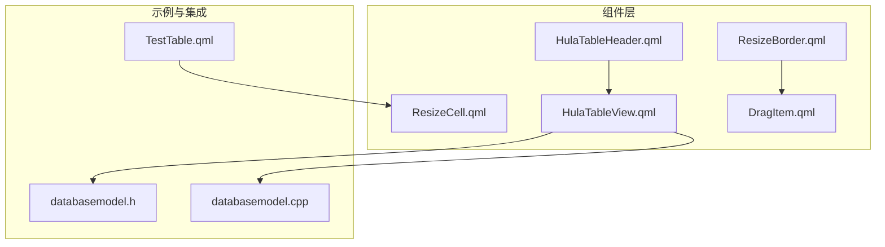
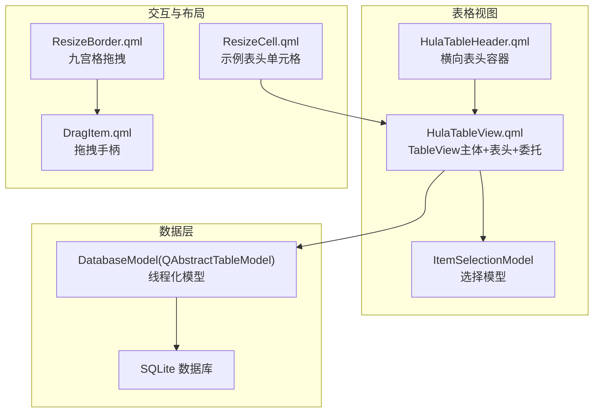
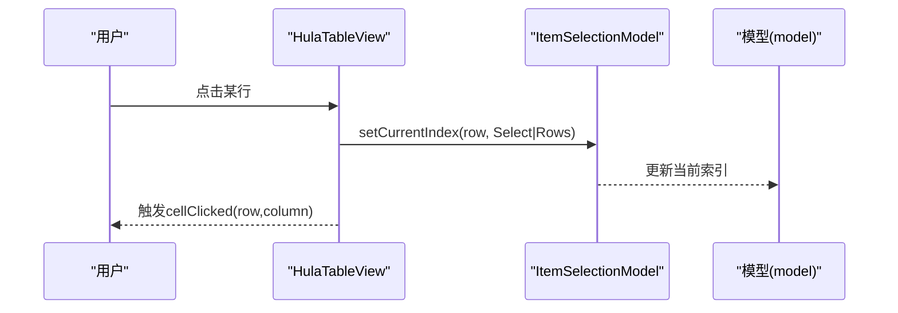
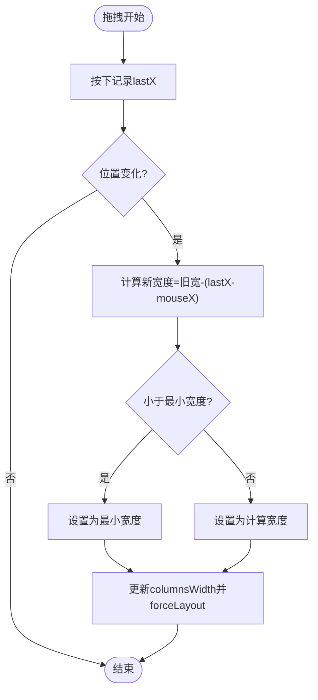
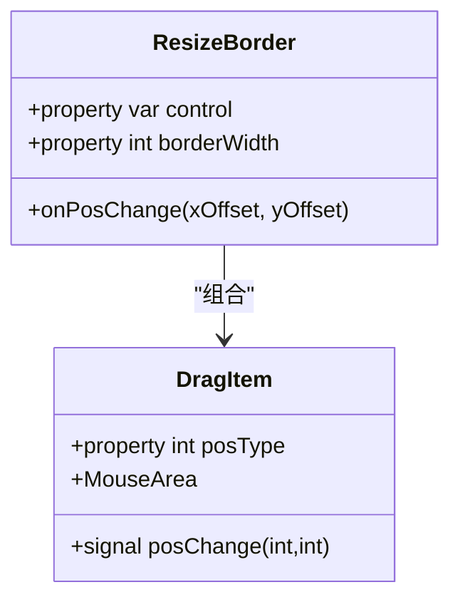
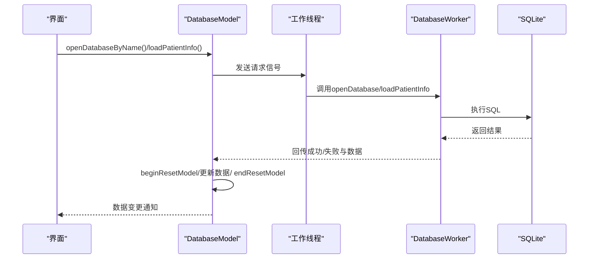
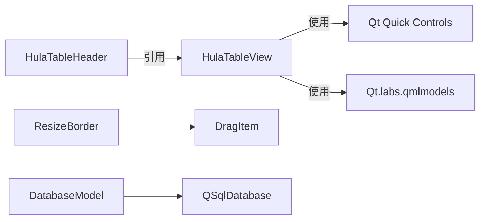

# 数据展示组件

<cite>
**本文引用的文件**
- [HulaTableView.qml](file://src/HulaUI/HulaTableView.qml)
- [HulaTableHeader.qml](file://src/HulaUI/HulaTableHeader.qml)
- [ResizeBorder.qml](file://src/HulaUI/ResizeBorder.qml)
- [DragItem.qml](file://src/HulaUI/DragItem.qml)
- [ResizeCell.qml](file://src/QmlUI/ResizeCell.qml)
- [TestTable.qml](file://src/QmlUI/TestTable.qml)
- [databasemodel.h](file://src/databasemodel.h)
- [databasemodel.cpp](file://src/databasemodel.cpp)
</cite>

## 目录
1. [简介](#简介)
2. [项目结构](#项目结构)
3. [核心组件](#核心组件)
4. [架构总览](#架构总览)
5. [详细组件分析](#详细组件分析)
6. [依赖关系分析](#依赖关系分析)
7. [性能考虑](#性能考虑)
8. [故障排查指南](#故障排查指南)
9. [结论](#结论)
10. [附录](#附录)

## 简介
本文件面向HulaUI数据展示组件，系统性讲解表格视图（HulaTableView）、表头组件（HulaTableHeader）与调整边框（ResizeBorder）的设计与实现要点，覆盖数据绑定、列配置、排序筛选、分页处理、列宽调整、拖拽交互、边界约束、大数据量优化、虚拟滚动与内存管理策略，并提供与数据库模型的集成模式与性能调优建议。

## 项目结构
围绕数据展示的核心文件组织如下：
- 组件层：HulaTableView、HulaTableHeader、ResizeBorder、DragItem、ResizeCell
- 示例与集成：TestTable演示列宽调整与筛选流程；数据库模型通过QAbstractTableModel与SQLite交互
- 数据模型：databasemodel.h/.cpp 提供线程化的数据库访问与模型更新机制

图表来源
- [HulaTableView.qml:1-415](file://src/HulaUI/HulaTableView.qml#L1-L415)
- [HulaTableHeader.qml:1-203](file://src/HulaUI/HulaTableHeader.qml#L1-L203)
- [ResizeBorder.qml:1-130](file://src/HulaUI/ResizeBorder.qml#L1-L130)
- [DragItem.qml:1-46](file://src/HulaUI/DragItem.qml#L1-L46)
- [ResizeCell.qml:1-40](file://src/QmlUI/ResizeCell.qml#L1-L40)
- [TestTable.qml:1-136](file://src/QmlUI/TestTable.qml#L1-L136)
- [databasemodel.h:1-97](file://src/databasemodel.h#L1-L97)
- [databasemodel.cpp:1-380](file://src/databasemodel.cpp#L1-L380)

章节来源
- [HulaTableView.qml:1-415](file://src/HulaUI/HulaTableView.qml#L1-L415)
- [HulaTableHeader.qml:1-203](file://src/HulaUI/HulaTableHeader.qml#L1-L203)
- [ResizeBorder.qml:1-130](file://src/HulaUI/ResizeBorder.qml#L1-L130)
- [DragItem.qml:1-46](file://src/HulaUI/DragItem.qml#L1-L46)
- [ResizeCell.qml:1-40](file://src/QmlUI/ResizeCell.qml#L1-L40)
- [TestTable.qml:1-136](file://src/QmlUI/TestTable.qml#L1-L136)
- [databasemodel.h:1-97](file://src/databasemodel.h#L1-L97)
- [databasemodel.cpp:1-380](file://src/databasemodel.cpp#L1-L380)

## 核心组件
- HulaTableView：封装TableView主体、表头、行选择、单元格编辑委托、滚动条与边框样式，支持列宽数组与首尾可见列计算
- HulaTableHeader：独立表头容器，复用列宽与标题数组，提供横向列宽拖拽调整能力
- ResizeBorder：通用九宫格拖拽调整器，支持八方向与四边拖拽，内置边界约束
- DragItem：拖拽手柄基元，提供光标形状切换与位置变更信号
- ResizeCell：示例表头单元格，演示列宽拖拽与宽度变更事件绑定
- 数据库模型：基于QAbstractTableModel的线程化模型，使用QThread与QMutex保护共享数据，提供打开数据库、加载数据、增删改回调

章节来源
- [HulaTableView.qml:1-415](file://src/HulaUI/HulaTableView.qml#L1-L415)
- [HulaTableHeader.qml:1-203](file://src/HulaUI/HulaTableHeader.qml#L1-L203)
- [ResizeBorder.qml:1-130](file://src/HulaUI/ResizeBorder.qml#L1-L130)
- [DragItem.qml:1-46](file://src/HulaUI/DragItem.qml#L1-L46)
- [ResizeCell.qml:1-40](file://src/QmlUI/ResizeCell.qml#L1-L40)
- [databasemodel.h:1-97](file://src/databasemodel.h#L1-L97)
- [databasemodel.cpp:1-380](file://src/databasemodel.cpp#L1-L380)

## 架构总览
HulaTableView以TableView为核心，横向表头与纵向表头分别独立渲染，列宽由columnsWidth数组统一维护；HulaTableHeader作为外部表头容器，直接引用同一view对象；ResizeBorder通过DragItem在九宫格区域提供拖拽调整，约束目标元素尺寸与位置；数据库模型通过线程分离I/O与主线程模型更新，保证界面流畅。

图表来源
- [HulaTableView.qml:1-415](file://src/HulaUI/HulaTableView.qml#L1-L415)
- [HulaTableHeader.qml:1-203](file://src/HulaUI/HulaTableHeader.qml#L1-L203)
- [ResizeBorder.qml:1-130](file://src/HulaUI/ResizeBorder.qml#L1-L130)
- [DragItem.qml:1-46](file://src/HulaUI/DragItem.qml#L1-L46)
- [ResizeCell.qml:1-40](file://src/QmlUI/ResizeCell.qml#L1-L40)
- [databasemodel.h:1-97](file://src/databasemodel.h#L1-L97)
- [databasemodel.cpp:1-380](file://src/databasemodel.cpp#L1-L380)

## 详细组件分析

### HulaTableView：表格视图与数据绑定
- 数据绑定与模型
  - 直接暴露model与selectionModel，支持外部传入任意QAbstractItemModel或Qt.labs.qmlmodels的ListModel
  - 通过columnWidthProvider与rowHeightProvider实现列宽与行高的动态配置
- 表头与边框
  - 横向表头与纵向表头独立Item容器，使用Repeater按列/行数量渲染
  - 通过gradient与颜色属性统一表头样式，支持交替行色与边框宽度
- 单元格委托与编辑
  - 委托内含文本、可选复选框与按钮，支持TableView.editDelegate进行就地编辑
  - 编辑提交后通过display赋值回写到模型对应角色
- 选择与滚动
  - 使用ItemSelectionModel绑定选择行为，支持当前行高亮与交替行色
  - 配置ScrollBar与clip/boundsBehavior提升滚动体验
- 可见列计算与延迟选择
  - 提供calcFirstLastColumn用于计算首尾可见列索引
  - selectRow配合Timer确保模型就绪后再执行选择，避免rowCount不匹配导致的异常

图表来源
- [HulaTableView.qml:114-117](file://src/HulaUI/HulaTableView.qml#L114-L117)
- [HulaTableView.qml:134-142](file://src/HulaUI/HulaTableView.qml#L134-L142)
- [HulaTableView.qml:403-413](file://src/HulaUI/HulaTableView.qml#L403-L413)

章节来源
- [HulaTableView.qml:1-415](file://src/HulaUI/HulaTableView.qml#L1-L415)

### HulaTableHeader：表头组件与列宽拖拽
- 列标题渲染
  - 通过view.columns与headerTitles数组渲染横向表头文本
  - 支持headerUseGradient与headerGradient实现渐变背景
- 列宽拖拽
  - 在表头右侧边缘添加MouseArea，按下记录lastX，移动时根据差值调整列宽
  - 更新view.columnsWidth并强制布局，使宽度变化立即生效
- 与表格视图的关系
  - HulaTableHeader可独立存在，仅引用外部view对象，实现“表头与内容解耦”

图表来源
- [HulaTableHeader.qml:97-115](file://src/HulaUI/HulaTableHeader.qml#L97-L115)

章节来源
- [HulaTableHeader.qml:1-203](file://src/HulaUI/HulaTableHeader.qml#L1-L203)

### ResizeBorder：列宽调整与拖拽交互
- 拖拽手柄布局
  - 左上、右上、左下、右下四角手柄，以及上、左、右、下三边手柄，共九个拖拽点
  - 每个手柄通过DragItem的posType映射不同光标形状
- 边界约束
  - 在每次posChange中检查目标尺寸与位置是否越界，确保width/height>0且不会超出父容器范围
- 控制目标
  - 通过control属性指定被控制的Item或View，通常指向父级或目标矩形区域

图表来源
- [ResizeBorder.qml:1-130](file://src/HulaUI/ResizeBorder.qml#L1-L130)
- [DragItem.qml:1-46](file://src/HulaUI/DragItem.qml#L1-L46)

章节来源
- [ResizeBorder.qml:1-130](file://src/HulaUI/ResizeBorder.qml#L1-L130)
- [DragItem.qml:1-46](file://src/HulaUI/DragItem.qml#L1-L46)

### 列宽调整与示例：ResizeCell
- ResizeCell提供简单表头单元格，右侧拖动线触发拖拽
- 在示例TestTable中，表头header使用ResizeCell并通过onWidthChanged将宽度回填至列宽属性，形成双向绑定效果

章节来源
- [ResizeCell.qml:1-40](file://src/QmlUI/ResizeCell.qml#L1-L40)
- [TestTable.qml:80-102](file://src/QmlUI/TestTable.qml#L80-L102)

### 数据库模型集成：QAbstractTableModel + 线程
- 线程模型
  - DatabaseModel在主线程持有DatabaseWorker实例，通过QThread与信号槽将数据库操作调度到工作线程
  - 使用QMutex保护共享数据（m_headers与m_data），避免竞态
- 数据访问
  - data/headerData提供显示角色数据；getData/getHeader提供安全访问接口
  - 打开数据库、加载数据、插入/更新/删除均通过请求信号触发，完成后重置模型并刷新
- 性能与一致性
  - beginResetModel/endResetModel成批通知模型变更，减少多次重绘
  - 错误通过errorOccurred信号上报，便于UI层提示

图表来源
- [databasemodel.h:49-94](file://src/databasemodel.h#L49-L94)
- [databasemodel.cpp:181-202](file://src/databasemodel.cpp#L181-L202)
- [databasemodel.cpp:286-300](file://src/databasemodel.cpp#L286-L300)

章节来源
- [databasemodel.h:1-97](file://src/databasemodel.h#L1-L97)
- [databasemodel.cpp:1-380](file://src/databasemodel.cpp#L1-L380)

## 依赖关系分析
- 组件内聚与耦合
  - HulaTableView内部高度内聚，但与外部模型强耦合（依赖QAbstractItemModel接口）
  - HulaTableHeader与HulaTableView通过view属性弱耦合，便于替换或扩展
  - ResizeBorder与DragItem低耦合，可复用到其他布局控件
- 外部依赖
  - Qt Quick Controls与Qt.labs.qmlmodels提供基础控件与模型抽象
  - SQLite驱动用于数据持久化，DatabaseModel负责线程与锁管理

图表来源
- [HulaTableView.qml:1-4](file://src/HulaUI/HulaTableView.qml#L1-L4)
- [HulaTableHeader.qml:1-4](file://src/HulaUI/HulaTableHeader.qml#L1-L4)
- [ResizeBorder.qml:1-2](file://src/HulaUI/ResizeBorder.qml#L1-L2)
- [databasemodel.h:10-14](file://src/databasemodel.h#L10-L14)

章节来源
- [HulaTableView.qml:1-4](file://src/HulaUI/HulaTableView.qml#L1-L4)
- [HulaTableHeader.qml:1-4](file://src/HulaUI/HulaTableHeader.qml#L1-L4)
- [ResizeBorder.qml:1-2](file://src/HulaUI/ResizeBorder.qml#L1-L2)
- [databasemodel.h:10-14](file://src/databasemodel.h#L10-L14)

## 性能考虑
- 大数据量处理与虚拟滚动
  - 使用TableView的内置复用与clip/boundsBehavior减少绘制开销
  - 通过columnWidthProvider/rowHeightProvider集中管理列宽与行高，避免频繁计算
  - 对于超大数据集，建议采用分页或懒加载策略（例如按需加载页码区间数据）
- 内存管理
  - DatabaseModel使用QMutex保护共享数据，避免多线程竞争
  - 使用beginResetModel/endResetModel一次性刷新，降低频繁重绘成本
- 渲染优化
  - 表头与内容分离，减少不必要的重排
  - 通过gradient与固定颜色减少复杂渐变计算
- 编辑与选择
  - 仅在需要时启用编辑委托，避免无谓的文本输入控件创建
  - 选择模型与当前行高亮在大量行时应谨慎使用，必要时关闭交替行色

## 故障排查指南
- 行选择异常
  - 若出现“行数不匹配”导致无法选择，检查selectRow前是否等待模型rowCount与tableView.rows一致；可参考定时器重试逻辑
- 列宽拖拽无效
  - 确认columnsWidth数组长度与列数一致，且拖拽区域位于表头右侧边缘
  - 检查forceLayout是否被调用以刷新布局
- 数据库线程问题
  - 若出现数据库未打开或查询失败，检查openDatabaseRequested与loadPatientInfoRequested是否正确发出
  - 查看errorOccurred信号输出，定位具体错误信息
- 编辑回写失败
  - 确保TableView.editDelegate的onCommit正确更新display，或显式调用setData写回模型

章节来源
- [HulaTableView.qml:384-413](file://src/HulaUI/HulaTableView.qml#L384-L413)
- [HulaTableHeader.qml:97-115](file://src/HulaUI/HulaTableHeader.qml#L97-L115)
- [databasemodel.cpp:276-335](file://src/databasemodel.cpp#L276-L335)

## 结论
HulaUI数据展示组件以模块化设计实现了表格视图、表头与列宽调整的完整闭环，结合线程化的数据库模型，满足从数据绑定到交互优化的全链路需求。通过合理的虚拟滚动与内存管理策略，可在大数据场景下保持良好性能；通过清晰的信号与属性接口，便于扩展排序筛选与分页功能。

## 附录
- 与数据库模型的集成要点
  - 将DatabaseModel作为TableView的model，或通过代理模型包装
  - 使用QThread隔离数据库操作，主线程仅做模型刷新与UI更新
  - 通过beginResetModel与QMutex保证线程安全与界面一致性
- 自定义渲染与单元格编辑
  - 在delegate中根据字段类型选择Text、CheckBox、Button或自定义组件
  - 使用TableView.editDelegate实现就地编辑，注意onCommit回写时机
- 批量操作
  - 借助ItemSelectionModel获取选中集合，批量执行插入/更新/删除
  - 对于大量数据，采用事务或批量提交减少数据库往返