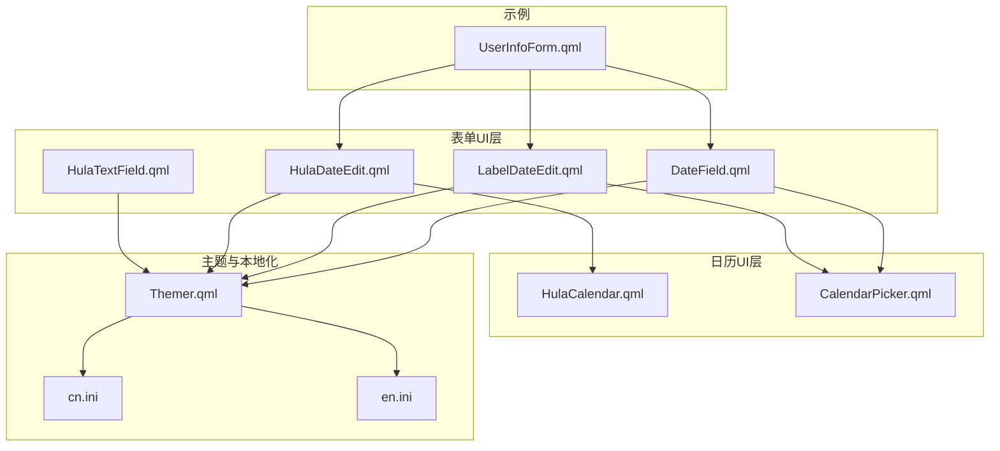
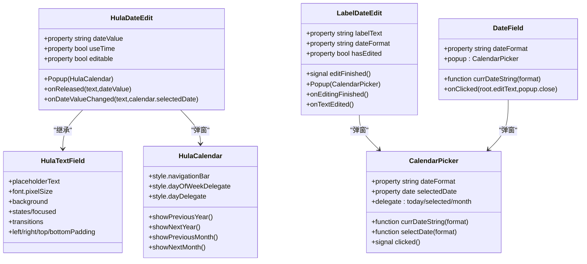
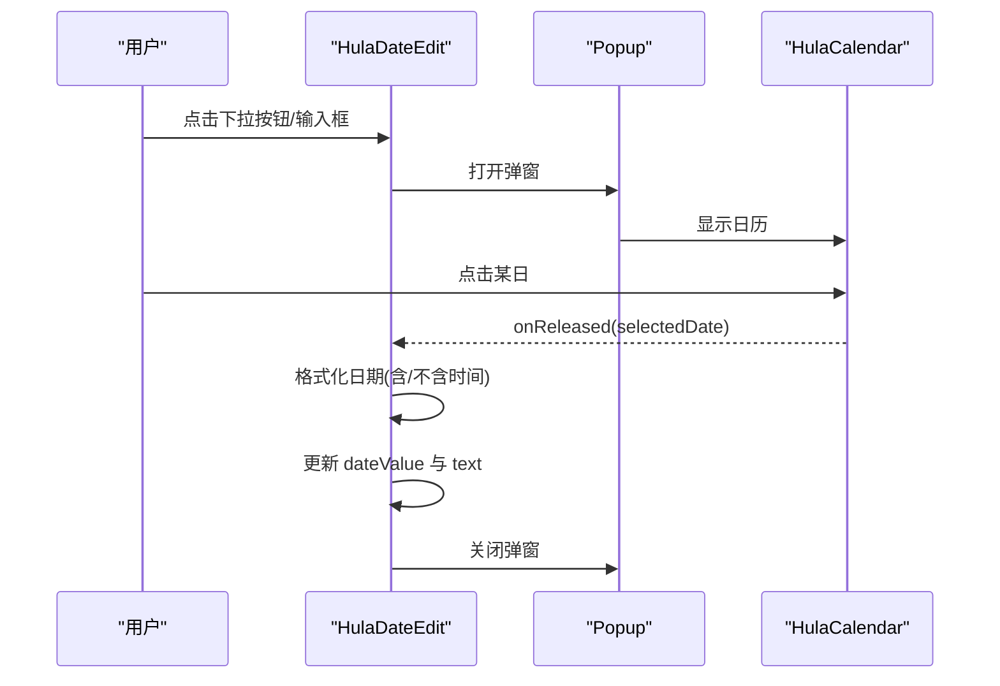
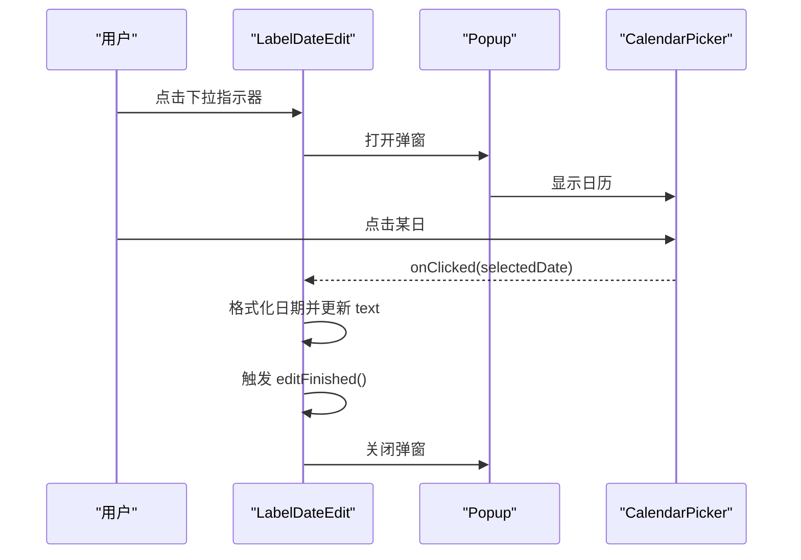
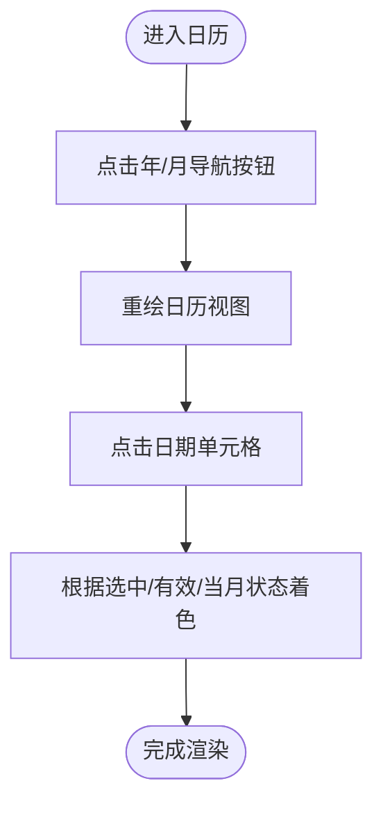
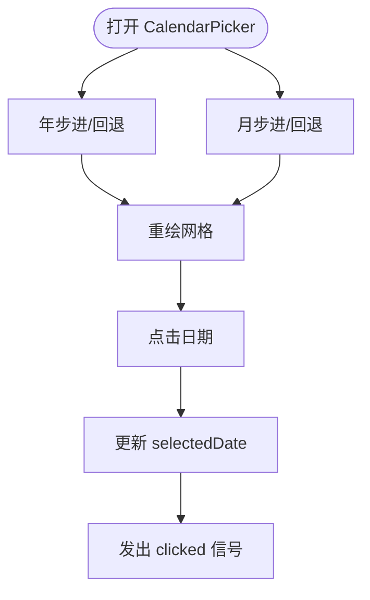
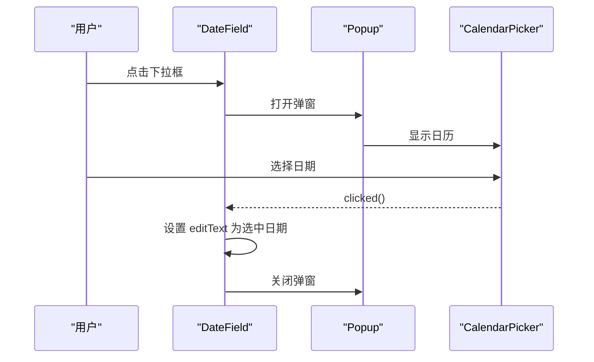
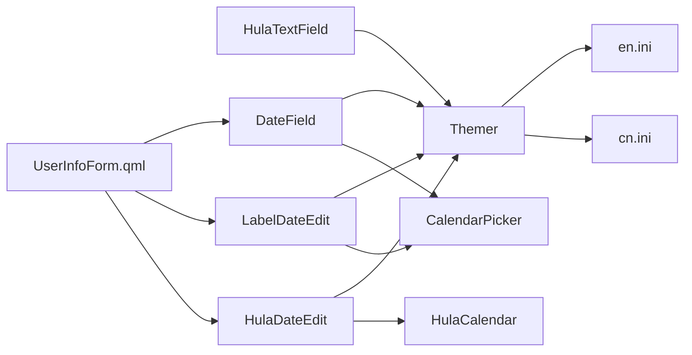

# 表单组件

<cite>
**本文引用的文件**
- [HulaTextField.qml](file://src/HulaUI/HulaTextField.qml)
- [HulaDateEdit.qml](file://src/HulaUI/HulaDateEdit.qml)
- [LabelDateEdit.qml](file://src/HulaUI/LabelDateEdit.qml)
- [HulaCalendar.qml](file://src/HulaUI/HulaCalendar.qml)
- [CalendarPicker.qml](file://src/HulaUI/CalendarPicker.qml)
- [DateField.qml](file://src/HulaUI/DateField.qml)
- [Themer.qml](file://src/QmlUI/Themer.qml)
- [cn.ini](file://resources/Languages/cn.ini)
- [en.ini](file://resources/Languages/en.ini)
- [UserInfoForm.qml](file://src/QmlUI/UserInfoForm.qml)
</cite>

## 目录
1. [简介](#简介)
2. [项目结构](#项目结构)
3. [核心组件](#核心组件)
4. [架构总览](#架构总览)
5. [详细组件分析](#详细组件分析)
6. [依赖关系分析](#依赖关系分析)
7. [性能考量](#性能考量)
8. [故障排查指南](#故障排查指南)
9. [结论](#结论)
10. [附录](#附录)

## 简介
本文件面向HulaUI表单组件，围绕以下目标展开：文本输入框（HulaTextField）、日期编辑器（HulaDateEdit、LabelDateEdit）、日历组件（HulaCalendar、CalendarPicker）以及日期字段（DateField）。内容涵盖输入验证、占位符、密码模式与字符限制；日期格式化、验证规则与本地化支持；日历渲染、日期选择事件与范围限制；日期字段的数据绑定与格式转换。同时提供表单验证最佳实践、用户体验优化与无障碍访问建议，并给出组件组合使用示例与常见问题解决方案。

## 项目结构
- 组件位于 src/HulaUI 下，采用按功能模块划分的组织方式，便于复用与维护。
- 主题与外观通过 Themer 单例注入，确保统一风格。
- 本地化资源位于 resources/Languages，支持简体中文与英文切换。
- 示例表单（如 UserInfoForm.qml）展示了组件在实际业务中的组合使用。

图表来源
- [HulaTextField.qml:1-45](file://src/HulaUI/HulaTextField.qml#L1-L45)
- [HulaDateEdit.qml:1-108](file://src/HulaUI/HulaDateEdit.qml#L1-L108)
- [LabelDateEdit.qml:1-127](file://src/HulaUI/LabelDateEdit.qml#L1-L127)
- [HulaCalendar.qml:1-269](file://src/HulaUI/HulaCalendar.qml#L1-L269)
- [CalendarPicker.qml:1-166](file://src/HulaUI/CalendarPicker.qml#L1-L166)
- [DateField.qml:1-38](file://src/HulaUI/DateField.qml#L1-L38)
- [Themer.qml:1-26](file://src/QmlUI/Themer.qml#L1-L26)
- [cn.ini:1-300](file://resources/Languages/cn.ini#L1-L300)
- [en.ini:1-298](file://resources/Languages/en.ini#L1-L298)
- [UserInfoForm.qml:1-397](file://src/QmlUI/UserInfoForm.qml#L1-L397)

章节来源
- [HulaTextField.qml:1-45](file://src/HulaUI/HulaTextField.qml#L1-L45)
- [HulaDateEdit.qml:1-108](file://src/HulaUI/HulaDateEdit.qml#L1-L108)
- [LabelDateEdit.qml:1-127](file://src/HulaUI/LabelDateEdit.qml#L1-L127)
- [HulaCalendar.qml:1-269](file://src/HulaUI/HulaCalendar.qml#L1-L269)
- [CalendarPicker.qml:1-166](file://src/HulaUI/CalendarPicker.qml#L1-L166)
- [DateField.qml:1-38](file://src/HulaUI/DateField.qml#L1-L38)
- [Themer.qml:1-26](file://src/QmlUI/Themer.qml#L1-L26)
- [cn.ini:1-300](file://resources/Languages/cn.ini#L1-L300)
- [en.ini:1-298](file://resources/Languages/en.ini#L1-L298)
- [UserInfoForm.qml:1-397](file://src/QmlUI/UserInfoForm.qml#L1-L397)

## 核心组件
- 文本输入框（HulaTextField）
  - 支持占位符、聚焦态样式变化、内边距与字体像素大小等基础UI能力。
  - 通过 Themer 注入主题色，实现背景与边框颜色的统一。
- 日期编辑器（HulaDateEdit）
  - 在 HulaTextField 基础上扩展弹窗日历选择，支持是否带时间、可编辑性等行为开关。
  - 选择日期后回填文本与内部 dateValue。
- 标签式日期编辑器（LabelDateEdit）
  - 自绘标签与下拉指示器，Popup 内嵌 CalendarPicker，支持本地化日期格式字符串。
  - 选中日期后触发 editFinished 信号，便于外部监听。
- 日历组件（HulaCalendar）
  - 自定义导航栏、星期与日期单元格样式，支持前后年/月切换、选中态与禁用态视觉区分。
- 月份网格日历（CalendarPicker）
  - 使用 MonthGrid 渲染日历，支持年/月步进与点击选择，暴露 clicked 信号。
- 日期字段（DateField）
  - 基于 ComboBox 的可编辑下拉日历选择，弹窗内嵌 CalendarPicker，支持自定义日期格式与定位。

章节来源
- [HulaTextField.qml:6-44](file://src/HulaUI/HulaTextField.qml#L6-L44)
- [HulaDateEdit.qml:8-107](file://src/HulaUI/HulaDateEdit.qml#L8-L107)
- [LabelDateEdit.qml:4-126](file://src/HulaUI/LabelDateEdit.qml#L4-L126)
- [HulaCalendar.qml:9-268](file://src/HulaUI/HulaCalendar.qml#L9-L268)
- [CalendarPicker.qml:5-165](file://src/HulaUI/CalendarPicker.qml#L5-L165)
- [DateField.qml:4-37](file://src/HulaUI/DateField.qml#L4-L37)

## 架构总览
组件间关系以“输入控件 + 日历选择器”为主线，日历选择器又分为“内置日历（HulaCalendar）”与“月份网格（CalendarPicker）”。主题通过 Themer 单例注入，本地化由 cn.ini/en.ini 提供。

图表来源
- [HulaTextField.qml:6-44](file://src/HulaUI/HulaTextField.qml#L6-L44)
- [HulaDateEdit.qml:8-107](file://src/HulaUI/HulaDateEdit.qml#L8-L107)
- [LabelDateEdit.qml:4-126](file://src/HulaUI/LabelDateEdit.qml#L4-L126)
- [HulaCalendar.qml:9-268](file://src/HulaUI/HulaCalendar.qml#L9-L268)
- [CalendarPicker.qml:5-165](file://src/HulaUI/CalendarPicker.qml#L5-L165)
- [DateField.qml:4-37](file://src/HulaUI/DateField.qml#L4-L37)

## 详细组件分析

### 文本输入框（HulaTextField）
- 输入验证
  - 仓库未提供内置验证逻辑，建议在业务层通过 onEditingFinished 或 textChanged 监听进行校验。
- 占位符
  - 默认占位符为“请输入”，可通过 placeholderText 属性覆盖。
- 密码模式
  - 可通过 echoMode 属性启用密码输入（例如 TextInput.Password），在示例表单中可见该用法。
- 字符限制
  - 未内置 maxLength，可在业务层结合 Qt 的长度限制策略实现。
- 焦点与样式
  - activeFocus 时边框颜色与宽度变化，配合过渡动画提升交互反馈。

章节来源
- [HulaTextField.qml:6-44](file://src/HulaUI/HulaTextField.qml#L6-L44)
- [UserInfoForm.qml:106-136](file://src/QmlUI/UserInfoForm.qml#L106-L136)

### 日期编辑器（HulaDateEdit）
- 日期格式化
  - 选择日期后根据 Qt.locale() 与固定格式“yyyy-MM-dd”生成文本；若启用 useTime，则附加当前时间。
- 验证规则
  - 仓库未内置日期有效性校验，建议在 onReleased 中追加范围与合法性判断。
- 本地化支持
  - 通过 Qt.locale() 实现本地化显示，具体格式字符串在组件内部硬编码。
- 交互流程
  - 点击下拉按钮或在不可编辑状态下点击输入框打开弹窗；选中日期后回填并关闭弹窗。

图表来源
- [HulaDateEdit.qml:47-56](file://src/HulaUI/HulaDateEdit.qml#L47-L56)
- [HulaDateEdit.qml:88-90](file://src/HulaUI/HulaDateEdit.qml#L88-L90)
- [HulaCalendar.qml:10-268](file://src/HulaUI/HulaCalendar.qml#L10-L268)

章节来源
- [HulaDateEdit.qml:8-107](file://src/HulaUI/HulaDateEdit.qml#L8-L107)
- [HulaCalendar.qml:10-268](file://src/HulaUI/HulaCalendar.qml#L10-L268)

### 标签式日期编辑器（LabelDateEdit）
- 日期格式化
  - 通过 dateFormat 属性控制显示格式，默认“yyyy-MM-dd”。
- 验证规则
  - 未内置校验，建议在 editFinished 信号中进行业务校验。
- 本地化支持
  - 通过 Qt.locale() 与 dateFormat 实现本地化展示。
- 交互流程
  - 点击标签右侧指示器打开 Popup，内部 CalendarPicker 选中日期后回填文本并触发 editFinished。

图表来源
- [LabelDateEdit.qml:94-104](file://src/HulaUI/LabelDateEdit.qml#L94-L104)
- [LabelDateEdit.qml:54-55](file://src/HulaUI/LabelDateEdit.qml#L54-L55)
- [CalendarPicker.qml:160-164](file://src/HulaUI/CalendarPicker.qml#L160-L164)

章节来源
- [LabelDateEdit.qml:4-126](file://src/HulaUI/LabelDateEdit.qml#L4-L126)
- [CalendarPicker.qml:5-165](file://src/HulaUI/CalendarPicker.qml#L5-L165)

### 日历组件（HulaCalendar）
- 日历渲染
  - 自定义导航栏（前后年/月按钮与年月标签）、星期标题与日期单元格样式。
  - 选中态、当月/非当月、禁用态分别使用不同颜色与文字色。
- 日期选择事件
  - 通过 showPreviousYear/showNextYear/showPreviousMonth/showNextMonth 控制视图。
- 范围限制
  - 通过 styleData.valid 控制有效/无效日期的视觉表现，可用于范围限制提示。

图表来源
- [HulaCalendar.qml:45-241](file://src/HulaUI/HulaCalendar.qml#L45-L241)
- [HulaCalendar.qml:255-266](file://src/HulaUI/HulaCalendar.qml#L255-L266)

章节来源
- [HulaCalendar.qml:9-268](file://src/HulaUI/HulaCalendar.qml#L9-L268)

### 月份网格日历（CalendarPicker）
- 日历渲染
  - 使用 MonthGrid 渲染，委托绘制今日、选中与非当月日期。
- 日期选择事件
  - onClicked 回调返回所选日期，触发 clicked 信号。
- 范围限制
  - 通过 model.today 与 model.month 判断今日与当月高亮，业务侧可结合外部规则实现范围限制。

图表来源
- [CalendarPicker.qml:57-104](file://src/HulaUI/CalendarPicker.qml#L57-L104)
- [CalendarPicker.qml:127-164](file://src/HulaUI/CalendarPicker.qml#L127-L164)

章节来源
- [CalendarPicker.qml:5-165](file://src/HulaUI/CalendarPicker.qml#L5-L165)

### 日期字段（DateField）
- 数据绑定与格式转换
  - 通过 ComboBox.editText 与 CalendarPicker.selectedDate 实现双向绑定。
  - currDateString/selectDate 支持按 dateFormat 输出当前/选中日期字符串。
- 弹窗与定位
  - popup 作为 CalendarPicker 的容器，支持自定义 x/y 坐标定位。

图表来源
- [DateField.qml:16-36](file://src/HulaUI/DateField.qml#L16-L36)
- [CalendarPicker.qml:160-164](file://src/HulaUI/CalendarPicker.qml#L160-L164)

章节来源
- [DateField.qml:4-37](file://src/HulaUI/DateField.qml#L4-L37)
- [CalendarPicker.qml:5-165](file://src/HulaUI/CalendarPicker.qml#L5-L165)

## 依赖关系分析
- 组件耦合
  - HulaDateEdit 依赖 HulaCalendar；LabelDateEdit 依赖 CalendarPicker；DateField 依赖 CalendarPicker。
  - HulaTextField 与 LabelDateEdit 通过 Themer 获取主题色，保持视觉一致性。
- 外部依赖
  - 本地化依赖 Qt.locale() 与资源文件（cn.ini/en.ini）。
  - 示例表单（UserInfoForm.qml）展示了文本输入与密码模式的典型用法。

图表来源
- [HulaTextField.qml:6-44](file://src/HulaUI/HulaTextField.qml#L6-L44)
- [HulaDateEdit.qml:8-107](file://src/HulaUI/HulaDateEdit.qml#L8-L107)
- [LabelDateEdit.qml:4-126](file://src/HulaUI/LabelDateEdit.qml#L4-L126)
- [HulaCalendar.qml:9-268](file://src/HulaUI/HulaCalendar.qml#L9-L268)
- [CalendarPicker.qml:5-165](file://src/HulaUI/CalendarPicker.qml#L5-L165)
- [DateField.qml:4-37](file://src/HulaUI/DateField.qml#L4-L37)
- [Themer.qml:14-24](file://src/QmlUI/Themer.qml#L14-L24)
- [cn.ini:1-300](file://resources/Languages/cn.ini#L1-L300)
- [en.ini:1-298](file://resources/Languages/en.ini#L1-L298)
- [UserInfoForm.qml:68-136](file://src/QmlUI/UserInfoForm.qml#L68-L136)

章节来源
- [Themer.qml:14-24](file://src/QmlUI/Themer.qml#L14-L24)
- [cn.ini:1-300](file://resources/Languages/cn.ini#L1-L300)
- [en.ini:1-298](file://resources/Languages/en.ini#L1-L298)
- [UserInfoForm.qml:68-136](file://src/QmlUI/UserInfoForm.qml#L68-L136)

## 性能考量
- 渲染优化
  - 日历组件使用 Canvas 绘制导航箭头，减少复杂图形开销。
  - 通过 styleData 控制视觉状态，避免频繁创建对象。
- 事件与动画
  - 焦点边框过渡动画时长适中，避免影响滚动与交互流畅性。
- 本地化
  - 日期格式化基于 Qt.locale()，避免重复计算，提高多语言环境下的渲染效率。

## 故障排查指南
- 日期格式异常
  - 现象：显示日期不符合预期。
  - 排查：确认 dateFormat 与 Qt.locale() 的组合；检查 HulaDateEdit/LabelDateEdit/DateField 的格式参数。
- 无法选择日期
  - 现象：点击日历无响应。
  - 排查：确认日历组件的 activeFocusOnTab 与鼠标区域设置；检查 onReleased/onClicked 事件链路。
- 弹窗位置偏移
  - 现象：日历弹窗不在输入框下方。
  - 排查：检查 HulaDateEdit 的 y: underlineY 与 DateField 的 popupX/popupY 定位逻辑。
- 主题色不生效
  - 现象：输入框边框颜色未随主题变化。
  - 排查：确认 Themer 单例初始化与 HulaTextField.states/transitions 的绑定。

章节来源
- [HulaDateEdit.qml:14-56](file://src/HulaUI/HulaDateEdit.qml#L14-L56)
- [DateField.qml:16-36](file://src/HulaUI/DateField.qml#L16-L36)
- [Themer.qml:14-24](file://src/QmlUI/Themer.qml#L14-L24)

## 结论
HulaUI 表单组件以简洁的继承与组合实现了从基础文本输入到复杂日期选择的完整链路。通过 Themer 与本地化资源，组件具备良好的主题一致性与国际化能力。建议在业务层补充输入验证与范围限制逻辑，并结合示例表单的最佳实践提升用户体验与可访问性。

## 附录

### 表单验证最佳实践
- 必填校验
  - 在 onEditingFinished 或提交时检查空值，结合本地化提示文案。
- 格式校验
  - 对日期类输入，使用组件提供的格式化函数进行比对，确保输入与输出格式一致。
- 范围校验
  - 在日历组件层面利用 styleData.valid 标识无效日期；在业务层对起止日期范围进行约束。
- 密码输入
  - 使用 echoMode: TextInput.Password，避免明文存储与传输。

章节来源
- [UserInfoForm.qml:285-374](file://src/QmlUI/UserInfoForm.qml#L285-L374)
- [HulaTextField.qml:10-10](file://src/HulaUI/HulaTextField.qml#L10-L10)

### 用户体验优化
- 焦点反馈
  - 利用 HulaTextField 的 focused 状态与过渡动画，增强输入反馈。
- 弹窗定位
  - 根据屏幕尺寸动态调整 DateField 的 popupX/popupY，确保弹窗不溢出。
- 无障碍支持
  - 为日历按钮提供可访问名称与描述；保证键盘可操作性（Tab/Enter/Escape）。

### 无障碍访问建议
- 键盘导航
  - 确保日历弹窗可被 Tab 键聚焦，Esc 关闭，方向键在日历网格内移动。
- 屏幕阅读器
  - 为下拉指示器与导航按钮提供语义化标签，说明其功能与当前状态。

### 组件组合使用示例
- 用户信息表单（UserInfoForm.qml）
  - 文本输入与密码输入的组合，展示 echoMode 与必填校验。
- 日期编辑器组合
  - HulaDateEdit 用于出生日期、入职日期等场景；LabelDateEdit 用于需要标签提示的日期输入；DateField 用于下拉快速选择。

章节来源
- [UserInfoForm.qml:68-136](file://src/QmlUI/UserInfoForm.qml#L68-L136)
- [HulaDateEdit.qml:8-107](file://src/HulaUI/HulaDateEdit.qml#L8-L107)
- [LabelDateEdit.qml:4-126](file://src/HulaUI/LabelDateEdit.qml#L4-L126)
- [DateField.qml:4-37](file://src/HulaUI/DateField.qml#L4-L37)