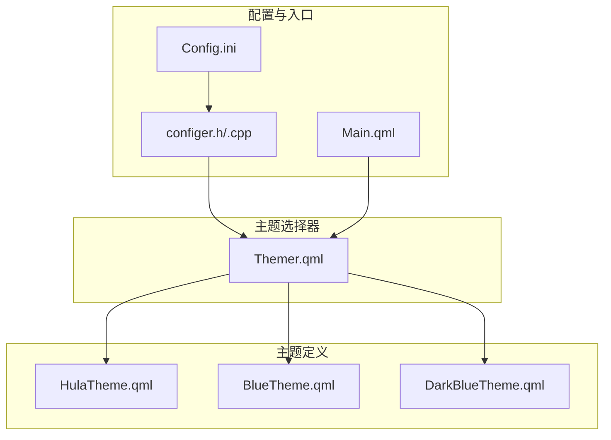
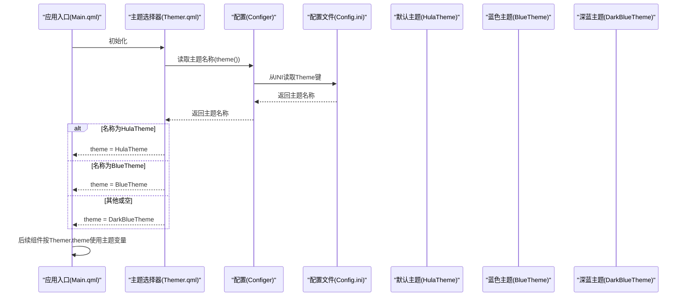
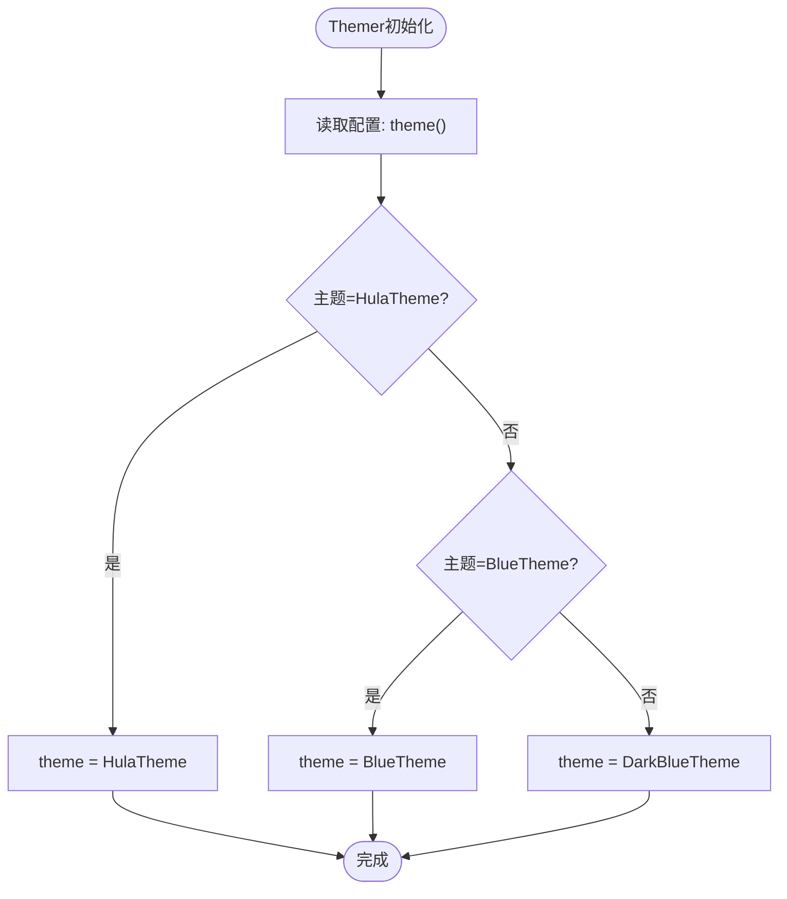
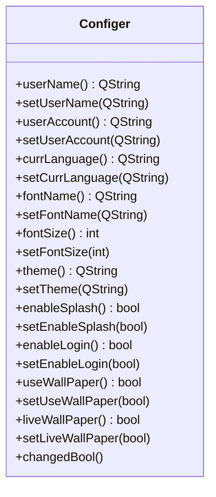

# 主题系统

<cite>
**本文引用的文件**
- [HulaTheme.qml](file://src/QmlUI/HulaTheme.qml)
- [BlueTheme.qml](file://src/QmlUI/BlueTheme.qml)
- [DarkBlueTheme.qml](file://src/QmlUI/DarkBlueTheme.qml)
- [Themer.qml](file://src/QmlUI/Themer.qml)
- [configer.h](file://src/configer.h)
- [configer.cpp](file://src/configer.cpp)
- [Config.ini](file://resources/Config.ini)
- [Main.qml](file://src/QmlUI/Main.qml)
</cite>

## 目录
1. [简介](#简介)
2. [项目结构](#项目结构)
3. [核心组件](#核心组件)
4. [架构总览](#架构总览)
5. [详细组件分析](#详细组件分析)
6. [依赖关系分析](#依赖关系分析)
7. [性能考量](#性能考量)
8. [故障排查指南](#故障排查指南)
9. [结论](#结论)
10. [附录](#附录)

## 简介
本文件面向QmlPlugins项目的主题系统，系统性阐述主题架构、主题切换机制与自定义主题实现方法。重点覆盖默认主题（HulaTheme）、蓝色主题（BlueTheme）与深蓝主题（DarkBlueTheme）的设计理念、配色体系与适用场景；解释主题变量的命名与使用规范、颜色体系与字体配置；提供主题扩展指南，包括新增主题、修改现有主题与实现动态主题切换；同时给出兼容性与性能优化建议。

## 项目结构
主题系统由三类文件协同构成：
- 主题定义：HulaTheme.qml、BlueTheme.qml、DarkBlueTheme.qml
- 主题选择器：Themer.qml
- 配置与入口：Configer（C++单例，暴露QML接口）、Config.ini（INI配置）、Main.qml（应用入口）



图示来源
- [Themer.qml:1-26](file://src/QmlUI/Themer.qml#L1-L26)
- [configer.h:98-120](file://src/configer.h#L98-L120)
- [configer.cpp:82-90](file://src/configer.cpp#L82-L90)
- [Config.ini:8](file://resources/Config.ini#L8)
- [Main.qml:1-41](file://src/QmlUI/Main.qml#L1-L41)

章节来源
- [Themer.qml:1-26](file://src/QmlUI/Themer.qml#L1-L26)
- [configer.h:98-120](file://src/configer.h#L98-L120)
- [configer.cpp:82-90](file://src/configer.cpp#L82-L90)
- [Config.ini:8](file://resources/Config.ini#L8)
- [Main.qml:1-41](file://src/QmlUI/Main.qml#L1-L41)

## 核心组件
- 主题对象（Singleton）
  - HulaTheme：默认主题，强调主色与工作区背景的协调，适合通用办公与数据密集型界面。
  - BlueTheme：以蓝色为主导，强调标题栏与工具条的视觉统一，适合科技感与专业感较强的场景。
  - DarkBlueTheme：深色背景与明亮元素对比，强调可读性与现代感，适合长时间使用或夜间模式偏好。
- 主题选择器（Singleton）
  - Themer：根据配置动态选择当前主题对象，支持在运行时切换主题。
- 配置中心（Configer）
  - 提供QML可用的配置接口，其中 theme()/setTheme() 控制主题名称。
- 应用入口（Main）
  - 通过Loader加载不同阶段界面，主题在界面初始化时生效。

章节来源
- [HulaTheme.qml:1-85](file://src/QmlUI/HulaTheme.qml#L1-L85)
- [BlueTheme.qml:1-72](file://src/QmlUI/BlueTheme.qml#L1-L72)
- [DarkBlueTheme.qml:1-82](file://src/QmlUI/DarkBlueTheme.qml#L1-L82)
- [Themer.qml:1-26](file://src/QmlUI/Themer.qml#L1-L26)
- [configer.h:148-150](file://src/configer.h#L148-L150)
- [configer.cpp:82-90](file://src/configer.cpp#L82-L90)
- [Main.qml:1-41](file://src/QmlUI/Main.qml#L1-L41)

## 架构总览
主题系统采用“主题对象 + 选择器 + 配置”的分层设计：
- 主题对象：集中定义颜色、渐变、字号等视觉变量。
- 主题选择器：依据配置决定当前主题对象，并向UI组件暴露统一访问入口。
- 配置中心：持久化主题名称，支持运行时修改后触发主题切换。
- UI组件：通过Themer.theme访问主题变量，无需感知具体主题实现细节。



图示来源
- [Themer.qml:16-24](file://src/QmlUI/Themer.qml#L16-L24)
- [configer.h:148-150](file://src/configer.h#L148-L150)
- [configer.cpp:82-90](file://src/configer.cpp#L82-L90)
- [Config.ini:8](file://resources/Config.ini#L8)
- [HulaTheme.qml:1-85](file://src/QmlUI/HulaTheme.qml#L1-L85)
- [BlueTheme.qml:1-72](file://src/QmlUI/BlueTheme.qml#L1-L72)
- [DarkBlueTheme.qml:1-82](file://src/QmlUI/DarkBlueTheme.qml#L1-L82)

## 详细组件分析

### 主题对象：HulaTheme、BlueTheme、DarkBlueTheme
- 设计要点
  - 单例模式：每个主题以QtObject形式声明，作为全局可访问的主题对象。
  - 变量命名：采用语义化命名，如主色、背景色、悬停色、按下色、渐变色、标题字体色等，便于UI组件直接引用。
  - 渐变：提供标题栏、标题、视图区域等多处Gradient对象，统一风格。
  - 字号：提供编辑器与按钮的字号属性，便于统一排版。
- 颜色体系
  - 主色与辅助色：通过theme1Color~theme5Color与mainColor/normalColor/gradientColor1/gradientColor2形成主色系。
  - 状态色：hoveredColor、pressedColor基于主色进行明暗处理，保证交互一致性。
  - 背景色：backColor、workBackColor、workFormColor、viewColor等区分容器、工作区与视图背景。
  - 边框与线条：lineColor、borderColor用于表格、分割线等边界。
  - 标题与图标：titleFontColor、leftTitleColor、iconHoveredColor确保标题与操作反馈的高可读性。
- 适用场景
  - HulaTheme：通用办公、数据展示类界面，强调中性与可读性。
  - BlueTheme：科技、金融、专业工具类界面，强调蓝色系的专业感。
  - DarkBlueTheme：夜间模式、长时工作、深色偏好用户，强调对比度与护眼。

章节来源
- [HulaTheme.qml:9-36](file://src/QmlUI/HulaTheme.qml#L9-L36)
- [HulaTheme.qml:38-83](file://src/QmlUI/HulaTheme.qml#L38-L83)
- [BlueTheme.qml:6-33](file://src/QmlUI/BlueTheme.qml#L6-L33)
- [BlueTheme.qml:35-71](file://src/QmlUI/BlueTheme.qml#L35-L71)
- [DarkBlueTheme.qml:8-35](file://src/QmlUI/DarkBlueTheme.qml#L8-L35)
- [DarkBlueTheme.qml:37-81](file://src/QmlUI/DarkBlueTheme.qml#L37-L81)

### 主题选择器：Themer
- 功能
  - 在组件完成初始化时读取配置中的主题名称，动态绑定到当前主题对象。
  - 支持三种主题：HulaTheme、BlueTheme、DarkBlueTheme，默认回退至DarkBlueTheme。
- 切换机制
  - 通过Configer.theme()读取主题字符串，再在Themer中进行分支赋值，从而实现主题切换。
  - UI组件只需引用Themer.theme即可获得当前主题的所有变量。



图示来源
- [Themer.qml:16-24](file://src/QmlUI/Themer.qml#L16-L24)
- [configer.h:148-150](file://src/configer.h#L148-L150)
- [configer.cpp:82-90](file://src/configer.cpp#L82-L90)

章节来源
- [Themer.qml:1-26](file://src/QmlUI/Themer.qml#L1-L26)
- [configer.h:148-150](file://src/configer.h#L148-L150)
- [configer.cpp:82-90](file://src/configer.cpp#L82-L90)

### 配置中心：Configer（C++单例）
- 角色
  - 作为QML单例暴露给前端，提供theme()/setTheme()等配置接口。
  - 通过QSettings读写INI文件，实现主题名称的持久化。
- 关键点
  - theme()返回当前主题名称字符串，用于Themer选择主题。
  - setTheme()写入主题名称，配合运行时刷新实现动态切换。



图示来源
- [configer.h:98-150](file://src/configer.h#L98-L150)
- [configer.cpp:82-90](file://src/configer.cpp#L82-L90)

章节来源
- [configer.h:98-150](file://src/configer.h#L98-L150)
- [configer.cpp:82-90](file://src/configer.cpp#L82-L90)

### 应用入口：Main
- 角色
  - 统一管理启动流程，通过Loader加载Splash/Login/MainForm。
  - 主题在界面加载后生效，确保组件渲染使用正确的主题变量。
- 与主题的关系
  - 通过Themer.theme访问主题，UI组件在初始化时即使用当前主题变量。

章节来源
- [Main.qml:1-41](file://src/QmlUI/Main.qml#L1-L41)

## 依赖关系分析
- 主题对象之间无直接耦合，彼此独立，便于替换与扩展。
- Themer依赖Configer提供的主题名称，间接依赖Config.ini中的Theme键。
- UI组件依赖Themer.theme，不直接依赖具体主题对象，降低耦合度。
- 配置层通过QSettings读写INI，实现跨平台与易维护的配置管理。

```mermaid
graph LR
Cfg["Config.ini"] <- --> Cpp["Configer(C++)"]
Cpp --> Thm["Themer.qml"]
Thm --> Hula["HulaTheme.qml"]
Thm --> Blue["BlueTheme.qml"]
Thm --> Dark["DarkBlueTheme.qml"]
Hula --> UI["各UI组件"]
Blue --> UI
Dark --> UI
```

图示来源
- [Config.ini:8](file://resources/Config.ini#L8)
- [configer.cpp:82-90](file://src/configer.cpp#L82-L90)
- [Themer.qml:14-24](file://src/QmlUI/Themer.qml#L14-L24)
- [HulaTheme.qml:1-85](file://src/QmlUI/HulaTheme.qml#L1-L85)
- [BlueTheme.qml:1-72](file://src/QmlUI/BlueTheme.qml#L1-L72)
- [DarkBlueTheme.qml:1-82](file://src/QmlUI/DarkBlueTheme.qml#L1-L82)

章节来源
- [Config.ini:8](file://resources/Config.ini#L8)
- [configer.cpp:82-90](file://src/configer.cpp#L82-L90)
- [Themer.qml:14-24](file://src/QmlUI/Themer.qml#L14-L24)

## 性能考量
- 单例主题对象避免重复创建，减少内存与初始化开销。
- 渐变与颜色计算在主题对象内一次性定义，UI组件直接引用，避免重复计算。
- 建议
  - 将主题变量尽量集中在主题对象中，UI组件只做读取，减少逻辑分散。
  - 对于频繁变化的状态色（hover/press），可考虑缓存常用组合，避免每次计算。
  - 避免在UI组件内部直接拼接颜色表达式，统一通过主题对象暴露。

## 故障排查指南
- 主题未生效
  - 检查Config.ini中的Theme键是否正确（HulaTheme/BlueTheme/DarkBlueTheme）。
  - 确认Configer.theme()返回值与预期一致，必要时调用setTheme()写入新值。
- 主题切换无效
  - 确保Themer在组件完成初始化后再读取配置，避免异步加载导致的时机问题。
  - 若需运行时切换，先通过Configer.setTheme()写入主题名称，再触发界面重建或重新加载主题资源。
- 颜色/字号异常
  - 检查主题对象中对应变量是否被覆盖或误用。
  - 确认UI组件引用的是Themer.theme而非硬编码颜色。

章节来源
- [Config.ini:8](file://resources/Config.ini#L8)
- [configer.cpp:82-90](file://src/configer.cpp#L82-L90)
- [Themer.qml:16-24](file://src/QmlUI/Themer.qml#L16-L24)

## 结论
QmlPlugins的主题系统通过“主题对象 + 选择器 + 配置”三层解耦设计，实现了灵活的主题管理与动态切换。默认主题、蓝色主题与深蓝主题分别满足通用、专业与深色场景需求。通过统一的主题变量与渐变体系，UI组件可稳定地获得一致的视觉体验。建议在扩展新主题时遵循现有命名与结构规范，确保兼容性与可维护性。

## 附录

### 主题变量定义规则与颜色体系
- 变量命名
  - 主色系：theme1Color~theme5Color、mainColor、normalColor
  - 状态色：hoveredColor、pressedColor
  - 背景色：backColor、workBackColor、workFormColor、viewColor
  - 边界与线条：lineColor、borderColor
  - 标题与图标：titleFontColor、leftTitleColor、iconHoveredColor
  - 渐变：titleBarGradient、titleGradient、viewGradient
  - 字号：editorFontSize、buttonFontSize
- 颜色体系
  - 主色基于mainColor及其light/dark变体生成，确保状态色与主色一致。
  - 渐变采用两个相邻亮度的主色，营造平滑过渡。
- 字体配置
  - 通过editorFontSize与buttonFontSize统一控制编辑器与按钮文本大小，便于适配不同分辨率与可读性需求。

章节来源
- [HulaTheme.qml:9-36](file://src/QmlUI/HulaTheme.qml#L9-L36)
- [HulaTheme.qml:38-83](file://src/QmlUI/HulaTheme.qml#L38-L83)
- [BlueTheme.qml:6-33](file://src/QmlUI/BlueTheme.qml#L6-L33)
- [BlueTheme.qml:35-71](file://src/QmlUI/BlueTheme.qml#L35-L71)
- [DarkBlueTheme.qml:8-35](file://src/QmlUI/DarkBlueTheme.qml#L8-L35)
- [DarkBlueTheme.qml:37-81](file://src/QmlUI/DarkBlueTheme.qml#L37-L81)

### 自定义主题实现指南
- 新建主题
  - 在QmlUI目录新增主题文件（如MyTheme.qml），定义与现有主题相同的变量集合。
  - 保持变量命名与类型一致，确保UI组件无需改动即可适配。
- 修改现有主题
  - 直接调整HulaTheme/BlueTheme/DarkBlueTheme中的颜色与字号，注意保持状态色与主色的一致性。
- 实现动态主题切换
  - 通过Configer.setTheme()写入新主题名称，随后触发Themer重新选择主题对象。
  - UI组件通过Themer.theme即时获得新主题变量，无需重启应用。

章节来源
- [Themer.qml:16-24](file://src/QmlUI/Themer.qml#L16-L24)
- [configer.h:148-150](file://src/configer.h#L148-L150)
- [configer.cpp:82-90](file://src/configer.cpp#L82-L90)

### 默认主题、蓝色主题、深蓝主题特点与适用场景
- 默认主题（HulaTheme）
  - 特点：主色与工作区背景协调，适合通用办公与数据展示。
  - 适用：日常办公、报表查看、信息面板等。
- 蓝色主题（BlueTheme）
  - 特点：蓝色主导，标题与工具条统一，强调专业与科技感。
  - 适用：数据分析、仪表盘、专业工具界面。
- 深蓝主题（DarkBlueTheme）
  - 特点：深色背景与明亮元素对比，强调可读性与现代感。
  - 适用：夜间模式、长时工作、深色偏好用户。

章节来源
- [HulaTheme.qml:1-85](file://src/QmlUI/HulaTheme.qml#L1-L85)
- [BlueTheme.qml:1-72](file://src/QmlUI/BlueTheme.qml#L1-L72)
- [DarkBlueTheme.qml:1-82](file://src/QmlUI/DarkBlueTheme.qml#L1-L82)