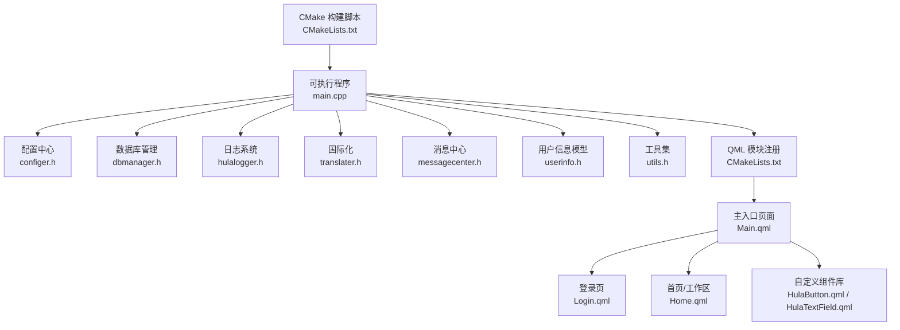
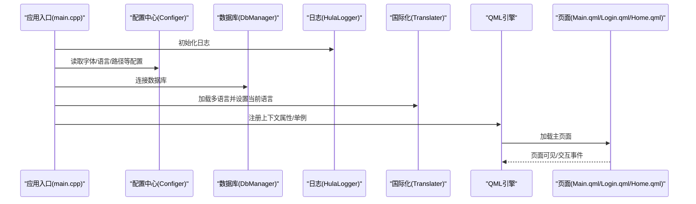
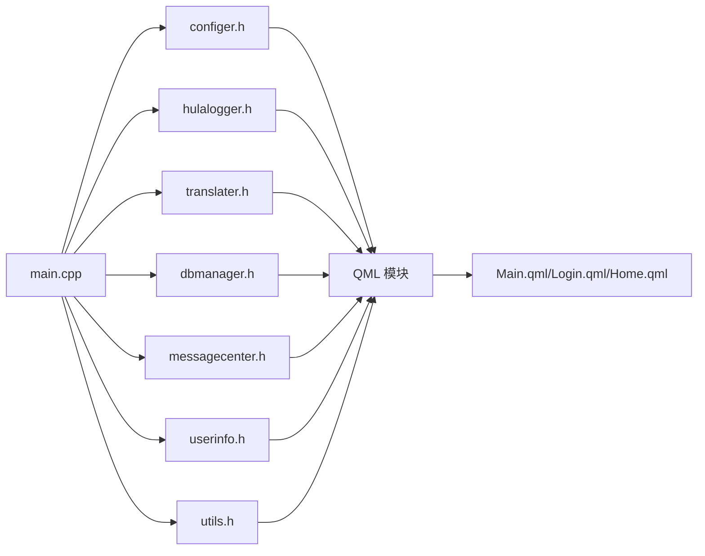

# 代码审查与质量保证

<cite>
**本文引用的文件**
- [README.md](file://README.md)
- [CMakeLists.txt](file://CMakeLists.txt)
- [main.cpp](file://src/main.cpp)
- [common.h](file://src/common.h)
- [basemsgsender.h](file://src/basemsgsender.h)
- [configer.h](file://src/configer.h)
- [dbmanager.h](file://src/dbmanager.h)
- [hulalogger.h](file://src/hulalogger.h)
- [translater.h](file://src/translater.h)
- [messagecenter.h](file://src/messagecenter.h)
- [userinfo.h](file://src/userinfo.h)
- [utils.h](file://src/utils.h)
- [HulaButton.qml](file://src/HulaUI/HulaButton.qml)
- [HulaTextField.qml](file://src/HulaUI/HulaTextField.qml)
- [Main.qml](file://src/QmlUI/Main.qml)
- [Home.qml](file://src/QmlUI/Home.qml)
- [Login.qml](file://src/QmlUI/Login.qml)
</cite>

## 目录
1. [引言](#引言)
2. [项目结构](#项目结构)
3. [核心组件](#核心组件)
4. [架构总览](#架构总览)
5. [详细组件分析](#详细组件分析)
6. [依赖关系分析](#依赖关系分析)
7. [性能考量](#性能考量)
8. [故障排查指南](#故障排查指南)
9. [结论](#结论)
10. [附录](#附录)

## 引言
本指南面向QmlPlugins项目，提供一套完整的代码审查与质量保证流程，覆盖预审、正式审查与复审三个阶段；明确代码质量关键指标（复杂度、重复、安全性、性能）；给出可操作的审查清单；介绍自动化质量检查工具的配置与使用建议；并结合项目实际，制定团队协作规范、分支管理策略与版本控制最佳实践。文档同时提供具体审查案例与改进建议，帮助团队持续提升交付质量。

## 项目结构
QmlPlugins采用“C++后端 + QML前端”的混合架构，C++负责应用入口、配置、数据库、日志、国际化、消息中心与工具集，QML负责界面与交互。CMake统一构建，支持多平台打包与部署。

**图示来源**
- [CMakeLists.txt:28-93](file://CMakeLists.txt#L28-L93)
- [main.cpp:17-96](file://src/main.cpp#L17-L96)
- [configer.h:98-122](file://src/configer.h#L98-L122)
- [dbmanager.h:52-77](file://src/dbmanager.h#L52-L77)
- [hulalogger.h:49-58](file://src/hulalogger.h#L49-L58)
- [translater.h:27-36](file://src/translater.h#L27-L36)
- [messagecenter.h:27-39](file://src/messagecenter.h#L27-L39)
- [userinfo.h:30-38](file://src/userinfo.h#L30-L38)
- [utils.h:21-29](file://src/utils.h#L21-L29)
- [Main.qml:6-40](file://src/QmlUI/Main.qml#L6-L40)
- [Login.qml:9-342](file://src/QmlUI/Login.qml#L9-L342)
- [Home.qml:10-800](file://src/QmlUI/Home.qml#L10-L800)
- [HulaButton.qml:4-81](file://src/HulaUI/HulaButton.qml#L4-L81)
- [HulaTextField.qml:6-45](file://src/HulaUI/HulaTextField.qml#L6-L45)

**章节来源**
- [README.md:36-45](file://README.md#L36-L45)
- [CMakeLists.txt:1-137](file://CMakeLists.txt#L1-L137)
- [main.cpp:17-96](file://src/main.cpp#L17-L96)

## 核心组件
- 应用入口与生命周期：负责单实例、日志初始化、字体与图标、数据库连接、国际化、引擎与页面加载、退出处理。
- 配置中心：提供QML可用的单例配置项，集中管理语言、主题、窗口模式、路径、报表等。
- 数据库管理：封装SQLite访问、事务RAII守卫、查询结果转换、备份/恢复、线程安全与错误传播。
- 日志系统：线程安全、轮转、级别控制、自动清理、QML属性暴露。
- 国际化：多语言文件加载、上下文绑定、信号驱动刷新。
- 消息中心：集中接收与转发系统消息，对接UI展示。
- 用户信息模型：基于QAbstractTableModel的用户数据模型，提供增删改查、登录校验、密码哈希。
- 工具集：目录/文件同步、条件复制、时间戳比较等实用功能。
- 自定义QML组件：按钮、输入框等，统一风格与交互行为。

**章节来源**
- [main.cpp:17-96](file://src/main.cpp#L17-L96)
- [configer.h:98-277](file://src/configer.h#L98-L277)
- [dbmanager.h:37-192](file://src/dbmanager.h#L37-L192)
- [hulalogger.h:49-175](file://src/hulalogger.h#L49-L175)
- [translater.h:27-112](file://src/translater.h#L27-L112)
- [messagecenter.h:27-127](file://src/messagecenter.h#L27-L127)
- [userinfo.h:30-172](file://src/userinfo.h#L30-L172)
- [utils.h:21-82](file://src/utils.h#L21-L82)
- [HulaButton.qml:4-81](file://src/HulaUI/HulaButton.qml#L4-L81)
- [HulaTextField.qml:6-45](file://src/HulaUI/HulaTextField.qml#L6-L45)

## 架构总览
应用启动后，C++层完成环境初始化与资源准备，随后通过CMake注册的QML模块将UI加载到引擎。C++与QML之间通过上下文属性、信号/槽与单例组件进行松耦合通信。

**图示来源**
- [main.cpp:32-58](file://src/main.cpp#L32-L58)
- [configer.h:113-120](file://src/configer.h#L113-L120)
- [dbmanager.h:80-83](file://src/dbmanager.h#L80-L83)
- [hulalogger.h:67-70](file://src/hulalogger.h#L67-L70)
- [translater.h:58-60](file://src/translater.h#L58-L60)
- [Main.qml:6-40](file://src/QmlUI/Main.qml#L6-L40)

## 详细组件分析

### 应用入口与生命周期（main.cpp）
- 单实例检测：通过独立进程监视器确保唯一实例。
- 日志初始化：根据配置设置日志级别。
- 字体与图标：从配置读取字体家族与字号，设置应用字体。
- 数据库连接：启动即建立数据库连接，失败直接退出。
- 国际化：加载语言文件并设置应用显示名。
- 退出处理：监听引擎退出信号，支持关机命令。
- 对象创建失败兜底：对象创建失败时队列化退出。

审查要点
- 单实例策略是否满足部署场景（容器/沙箱）。
- 数据库连接失败的降级策略与重试机制。
- 关机命令在不同平台的安全性与权限控制。
- 引擎对象创建失败的可观测性与日志输出。

**章节来源**
- [main.cpp:17-96](file://src/main.cpp#L17-L96)

### 配置中心（configer.h）
- QML单例：通过QML_ELEMENT与QML_SINGLETON注册，提供丰富的配置项。
- 路径与资源：集中管理图片、语言、数据库、捕获等路径。
- 报表与相机：提供报表模板、标题、医院信息、相机参数等。
- 线程安全：私有实现与单例模式配合，避免并发访问问题。

审查要点
- 配置项命名一致性与分组清晰度。
- 路径拼接与平台差异处理。
- QML属性变更通知是否完整覆盖。

**章节来源**
- [configer.h:98-277](file://src/configer.h#L98-L277)

### 数据库管理（dbmanager.h）
- 事务RAII：TransactionGuard确保异常路径自动回滚。
- 查询与结果：提供查询计数、JSON转换、事务批量更新/追加。
- 线程安全：每个线程持有独立连接，互不干扰。
- 错误传播：线程本地错误缓存与消息结构体传递。

审查要点
- 事务边界与嵌套事务处理。
- 大数据量查询的内存与性能影响。
- Schema缓存与表结构变更的兼容性。

**章节来源**
- [dbmanager.h:37-192](file://src/dbmanager.h#L37-L192)

### 日志系统（hulalogger.h）
- 级别控制：Fatal/Critical/Warning/Info/Debug分级。
- 轮转与清理：按大小与时间轮转，自动清理过期日志。
- 线程安全：文件写入加锁，避免竞争。
- QML集成：属性暴露与信号通知。

审查要点
- 日志级别在不同环境的动态调整。
- 轮转阈值与磁盘空间预警。
- 性能对IO的影响与异步写入可行性。

**章节来源**
- [hulalogger.h:49-175](file://src/hulalogger.h#L49-L175)

### 国际化（translater.h）
- 多语言目录加载与热更新。
- QML上下文绑定与信号驱动刷新。
- 读写锁保护映射表。

审查要点
- 语言切换的UI即时性与一致性。
- 词表缺失时的回退策略。
- 多语言资源的版本与增量更新。

**章节来源**
- [translater.h:27-112](file://src/translater.h#L27-L112)

### 消息中心（messagecenter.h）
- 信号桥接：将各组件的消息汇聚至UI。
- 文件持久化：按日期组织消息文件，支持查询与清理。
- 连接/断开模板：提供类型安全的连接接口。

审查要点
- 消息去重与顺序保证。
- 文件锁与并发写入。
- UI侧消息消费的背压处理。

**章节来源**
- [messagecenter.h:27-127](file://src/messagecenter.h#L27-L127)

### 用户信息模型（userinfo.h）
- 数据模型：基于QAbstractTableModel，支持表格展示与编辑。
- 登录与校验：账号存在性检查、密码验证、登录事件。
- 密码哈希：盐值生成与存储格式约定。

审查要点
- 密码存储与传输安全（建议引入更强的密钥派生）。
- 并发访问与线程安全。
- 数据完整性与约束校验。

**章节来源**
- [userinfo.h:30-172](file://src/userinfo.h#L30-L172)

### 工具集（utils.h）
- 目录/文件同步：条件复制、时间戳比较、删除孤儿文件。
- 目录扫描与更新：批量文件处理。

审查要点
- 同步算法的幂等性与一致性。
- 跨平台路径与权限差异处理。
- 大规模目录同步的性能与进度反馈。

**章节来源**
- [utils.h:21-82](file://src/utils.h#L21-L82)

### 自定义QML组件（HulaButton.qml、HulaTextField.qml）
- HulaButton：状态切换、悬停/按下视觉反馈、图标与文本组合。
- HulaTextField：主题色边框、焦点过渡动画、内边距与字体。

审查要点
- 组件属性与样式分离，便于主题切换。
- 状态机与动画的性能影响。
- 可访问性与键盘导航支持。

**章节来源**
- [HulaButton.qml:4-81](file://src/HulaUI/HulaButton.qml#L4-L81)
- [HulaTextField.qml:6-45](file://src/HulaUI/HulaTextField.qml#L6-L45)

### 页面与导航（Main.qml、Login.qml、Home.qml）
- Main.qml：根据配置决定加载Splash/Login/Main，异步加载与可见性控制。
- Login.qml：用户凭据输入、自动用户名填充、登录校验与错误提示。
- Home.qml：患者列表、编辑器布局、Tab切换、数据模型与交互。

审查要点
- 页面加载顺序与依赖关系。
- 登录流程的错误处理与用户体验。
- 大型页面的渲染性能与懒加载。

**章节来源**
- [Main.qml:6-40](file://src/QmlUI/Main.qml#L6-L40)
- [Login.qml:9-342](file://src/QmlUI/Login.qml#L9-L342)
- [Home.qml:10-800](file://src/QmlUI/Home.qml#L10-L800)

## 依赖关系分析
C++侧组件通过CMake统一注册为QML模块，形成清晰的依赖链：入口 -> 配置/日志/国际化 -> 数据库/消息中心 -> UI组件。QML侧通过Loader按需加载页面，减少启动时的内存占用。

**图示来源**
- [CMakeLists.txt:79-93](file://CMakeLists.txt#L79-L93)
- [main.cpp:17-96](file://src/main.cpp#L17-L96)

**章节来源**
- [CMakeLists.txt:1-137](file://CMakeLists.txt#L1-L137)
- [main.cpp:17-96](file://src/main.cpp#L17-L96)

## 性能考量
- 启动性能
  - 减少Splash/Login加载时长，延迟初始化非关键模块。
  - 使用Loader异步加载页面，避免阻塞主线程。
- 数据库性能
  - 合理使用事务批处理，避免频繁提交。
  - 查询结果分页与索引优化。
- UI性能
  - 控制组件数量与层级深度，避免过度嵌套。
  - 动画与过渡效果适度，关注帧率。
- 日志与I/O
  - 轮转阈值与清理策略平衡磁盘占用与性能。
  - 批量写入与缓冲策略降低IO抖动。

[本节为通用指导，无需列出章节来源]

## 故障排查指南
- 启动失败
  - 检查数据库连接返回码与错误消息。
  - 核对配置文件路径与权限。
- 登录异常
  - 核对账号存在性与密码校验流程。
  - 观察消息中心是否有错误记录。
- 页面不显示
  - 检查Loader的active与source绑定。
  - 确认QML模块URI与版本匹配。
- 日志缺失
  - 检查日志级别与轮转策略。
  - 确认日志目录可写且磁盘空间充足。

**章节来源**
- [main.cpp:46-50](file://src/main.cpp#L46-L50)
- [messagecenter.h:113-117](file://src/messagecenter.h#L113-L117)
- [hulalogger.h:67-70](file://src/hulalogger.h#L67-L70)

## 结论
QmlPlugins在架构上实现了C++与QML的清晰分工，具备良好的可扩展性与可维护性。建议在后续迭代中进一步强化安全与性能基线，完善自动化质量检查流程，并固化代码审查标准与协作规范，以持续提升交付质量与团队效率。

[本节为总结性内容，无需列出章节来源]

## 附录

### 代码审查标准流程
- 预审（提交前）
  - 自检：遵循编码规范、注释完整、边界条件覆盖。
  - 单元测试：新增/修改功能配套测试用例。
  - 静态分析：启用编译器警告、静态分析工具扫描。
- 正式审查（PR阶段）
  - 代码走查：关注复杂度、重复、安全性、性能与可维护性。
  - 评审清单：逐项核对，记录问题与建议。
  - 修复闭环：按评审意见修改并回归测试。
- 复审（合并前）
  - 回归验证：确认问题已修复，无引入新问题。
  - 自动化检查：CI通过、覆盖率达标、格式化一致。

[本节为通用流程说明，无需列出章节来源]

### 代码质量关键指标
- 复杂度
  - 圈复杂度：控制函数/页面逻辑分支不超过阈值。
  - 函数长度：单函数行数与嵌套层级限制。
- 重复代码
  - 识别重复逻辑并抽取公共模块。
  - 统一组件与工具函数，避免分散重复。
- 安全性
  - 输入校验与参数绑定，防止注入与越界。
  - 密码存储与传输加密，最小权限原则。
- 性能
  - IO与网络请求的超时与重试。
  - UI渲染与动画的帧率监控。

[本节为通用指标说明，无需列出章节来源]

### 代码审查清单（示例）
- 功能性
  - 需求覆盖与边界处理。
  - 错误路径与异常处理。
- 可读性
  - 命名规范与注释清晰度。
  - 代码结构与模块职责。
- 可维护性
  - 依赖关系与耦合度。
  - 变更影响面与回归风险。
- 安全性
  - 输入/输出校验与权限控制。
  - 敏感信息处理与日志脱敏。

[本节为通用清单，无需列出章节来源]

### 自动化质量检查工具配置与使用
- 静态分析
  - C/C++：启用编译器警告与静态分析工具（如clang-tidy/Cppcheck）。
  - QML：使用QML语法检查与lint工具。
- 单元测试与覆盖率
  - C++：结合CMake与测试框架，生成覆盖率报告。
  - QML：针对可测试逻辑编写测试用例。
- 代码格式化
  - C++：统一格式化工具（如clang-format）与提交前检查。
  - QML：统一缩进与命名风格。

[本节为通用工具建议，无需列出章节来源]

### 团队协作规范、分支管理策略与版本控制最佳实践
- 分支策略
  - 主干保护：master/main仅允许通过PR合并。
  - 功能分支：按功能/修复创建短期分支，及时合并。
  - 特性开关：大功能采用特性标志控制。
- 提交规范
  - 标准化的提交信息格式，关联Issue与PR。
  - 小步提交，清晰描述变更动机与影响。
- 版本控制
  - 语义化版本：遵循MAJOR.MINOR.PATCH。
  - 标签与发布：稳定版本打标签并附变更摘要。

[本节为通用规范，无需列出章节来源]

### 代码审查具体案例与改进建议
- 案例1：登录页输入校验
  - 问题：账号为空时未清空用户名，导致状态错乱。
  - 建议：在账号输入变化时清空用户名并重置错误提示。
- 案例2：数据库事务
  - 问题：批量插入未使用事务，导致部分失败。
  - 建议：使用事务守卫封装批量操作，失败自动回滚。
- 案例3：日志级别
  - 问题：生产环境日志过多影响性能。
  - 建议：按模块设置日志级别，启用轮转与清理。

[本节为通用案例说明，无需列出章节来源]