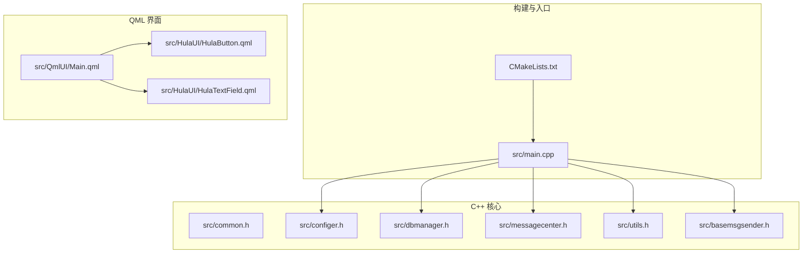
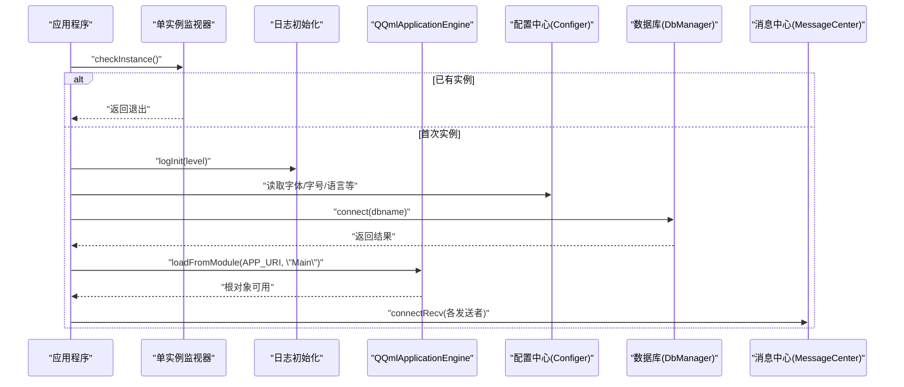
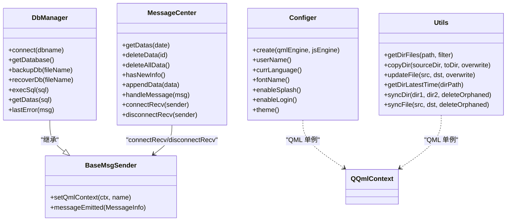

# 代码规范与命名约定

<cite>
**本文引用的文件**
- [README.md](file://README.md)
- [CMakeLists.txt](file://CMakeLists.txt)
- [main.cpp](file://src/main.cpp)
- [common.h](file://src/common.h)
- [basemsgsender.h](file://src/basemsgsender.h)
- [basemsgsender.cpp](file://src/basemsgsender.cpp)
- [utils.h](file://src/utils.h)
- [utils.cpp](file://src/utils.cpp)
- [configer.h](file://src/configer.h)
- [dbmanager.h](file://src/dbmanager.h)
- [messagecenter.h](file://src/messagecenter.h)
- [HulaButton.qml](file://src/HulaUI/HulaButton.qml)
- [HulaTextField.qml](file://src/HulaUI/HulaTextField.qml)
- [Main.qml](file://src/QmlUI/Main.qml)
</cite>

## 目录
1. [简介](#简介)
2. [项目结构](#项目结构)
3. [核心组件](#核心组件)
4. [架构总览](#架构总览)
5. [详细组件分析](#详细组件分析)
6. [依赖关系分析](#依赖关系分析)
7. [性能考虑](#性能考虑)
8. [故障排查指南](#故障排查指南)
9. [结论](#结论)
10. [附录](#附录)

## 简介
本指南面向 QmlPlugins 项目，提供统一的 C++ 与 QML 代码规范与命名约定，涵盖类与成员命名、缩进与格式化、QML 组件命名与属性/信号槽规范、注释标准、风格检查工具与自动化配置建议，并给出正确与错误的示例路径，帮助团队保持一致的代码质量与可维护性。

## 项目结构
项目采用“C++ 核心 + QML 界面”的分层组织方式：
- C++ 层：应用入口、配置、数据库、消息中心、工具类等
- QML 层：界面页面与自定义组件
- 构建系统：CMake + Qt6/QML 模块化打包

**图示来源**
- [CMakeLists.txt:1-137](file://CMakeLists.txt#L1-L137)
- [main.cpp:1-99](file://src/main.cpp#L1-L99)
- [configer.h:1-277](file://src/configer.h#L1-L277)
- [dbmanager.h:1-192](file://src/dbmanager.h#L1-L192)
- [messagecenter.h:1-127](file://src/messagecenter.h#L1-L127)
- [utils.h:1-82](file://src/utils.h#L1-L82)
- [basemsgsender.h:1-38](file://src/basemsgsender.h#L1-L38)
- [Main.qml:1-41](file://src/QmlUI/Main.qml#L1-L41)
- [HulaButton.qml:1-81](file://src/HulaUI/HulaButton.qml#L1-L81)
- [HulaTextField.qml:1-45](file://src/HulaUI/HulaTextField.qml#L1-L45)

**章节来源**
- [README.md:1-50](file://README.md#L1-L50)
- [CMakeLists.txt:1-137](file://CMakeLists.txt#L1-L137)

## 核心组件
- 应用入口与生命周期控制：负责初始化、单实例检测、国际化、主题与字体、数据库连接、引擎加载与事件处理
- 配置中心：提供 QML 单例访问的配置项与变更信号
- 数据库管理：线程安全的连接池、事务守卫、查询与备份/恢复接口
- 消息中心：集中接收与转发系统消息，支持 UI 展示
- 工具类：文件/目录操作、同步与更新策略
- 基类消息发送器：为派生类提供 QML 上下文注册与消息信号发射能力

**章节来源**
- [main.cpp:17-99](file://src/main.cpp#L17-L99)
- [configer.h:98-277](file://src/configer.h#L98-L277)
- [dbmanager.h:37-192](file://src/dbmanager.h#L37-L192)
- [messagecenter.h:27-127](file://src/messagecenter.h#L27-L127)
- [utils.h:21-82](file://src/utils.h#L21-L82)
- [basemsgsender.h:10-38](file://src/basemsgsender.h#L10-L38)

## 架构总览
应用启动流程与组件交互如下：

**图示来源**
- [main.cpp:17-99](file://src/main.cpp#L17-L99)
- [configer.h:98-277](file://src/configer.h#L98-L277)
- [dbmanager.h:52-80](file://src/dbmanager.h#L52-L80)
- [messagecenter.h:89-106](file://src/messagecenter.h#L89-L106)

## 详细组件分析

### C++ 命名规范与格式化
- 类名
  - 遵循大驼峰命名，首字母大写，如 Configer、DbManager、MessageCenter、Utils、BaseMsgSender
  - 位于对应的头文件中，头文件以 .h 结尾，实现文件以 .cpp 结尾
- 函数/方法名
  - 遵循小驼峰命名，如 connect、getDatabase、handleMessage、getDirFiles
  - 成员函数与静态函数保持一致风格；Q_INVOKABLE 导出的接口也遵循小驼峰
- 变量名
  - 私有成员以下划线前缀，如 m_userName、m_dbName、m_lastError
  - 局部变量采用描述性小驼峰，避免单字符
- 常量与宏
  - 宏常量使用全大写加下划线，如 APP_NAME、CFG_FILE、LOG_PATH
  - 宏开关使用全大写，如 WIN_OS、DEPLOY_WIN
- 枚举与结构体
  - 枚举类名与值采用大驼峰，如 ErrorCode、PromptType、DeviceStatus
  - 结构体字段使用小驼峰，如 name、metaType、length
- 命名空间
  - 使用命名空间 Enums 暴露枚举到 QML 元对象系统
- 缩进与格式化
  - 统一使用 4 空格缩进
  - 左花括号不单独占行，右花括号独立一行
  - 关键字后空一格，逗号后空一格
  - 二元运算符两侧保留空格
  - switch/case 结构内部缩进一致
- 注释
  - 文件头注释使用多行块注释，包含版权、作者、联系方式、简述与历史
  - 类/函数/结构体注释使用 Qt 风格的多行注释，@brief/@param/@return 等标签清晰
  - 行内注释简洁明确，避免无意义注释

**章节来源**
- [common.h:1-159](file://src/common.h#L1-L159)
- [configer.h:1-277](file://src/configer.h#L1-L277)
- [dbmanager.h:1-192](file://src/dbmanager.h#L1-L192)
- [messagecenter.h:1-127](file://src/messagecenter.h#L1-L127)
- [utils.h:1-82](file://src/utils.h#L1-L82)
- [basemsgsender.h:1-38](file://src/basemsgsender.h#L1-L38)

### QML 组件命名约定与属性/信号槽规范
- 组件命名
  - 自定义组件文件名采用大驼峰，如 HulaButton.qml、HulaTextField.qml
  - 组件内部 id 建议使用 root 作为根节点标识，便于在 states/PropertyChanges 中引用
- 属性命名
  - 使用小驼峰，如 textColor、iconImage、useState、radius
  - 布尔属性以 is/has/use 前缀更直观，如 useState、useWallPaper
- 信号与槽
  - 信号使用动词短语，如 onLoaded、onClicked
  - 槽函数使用 handleXxx 或 onXxx 形式，便于区分
- 状态与过渡
  - states 中的状态名使用小写单词，如 unchecked、checked
  - transitions 中的属性动画使用属性名，如 border.color、border.width
- Loader 与页面加载
  - 使用 Loader 的 active 控制加载时机，结合 onLoaded 回调触发 showForm 等动作
  - 页面属性如 useSplash、useLogin 控制加载顺序与条件

**章节来源**
- [HulaButton.qml:1-81](file://src/HulaUI/HulaButton.qml#L1-L81)
- [HulaTextField.qml:1-45](file://src/HulaUI/HulaTextField.qml#L1-L45)
- [Main.qml:1-41](file://src/QmlUI/Main.qml#L1-L41)

### 代码注释标准
- 文件头部注释
  - 包含版权、作者、联系方式、创建日期、简述与历史修订
  - 示例参考：common.h、configer.h、utils.h 的头部注释
- 类注释
  - 使用 Qt 风格多行注释，@brief 描述用途，@author/@date 等补充信息
- 函数/方法注释
  - @brief 简述功能
  - @param/@return 详述参数与返回值
  - 对复杂算法或边界条件进行说明
- 行内注释
  - 仅在必要处解释复杂逻辑或特殊处理，避免冗余注释
- QML 注释
  - 使用单行注释 // 解释布局或状态逻辑
  - 对样式与主题相关的属性进行简要说明

**章节来源**
- [common.h:1-159](file://src/common.h#L1-L159)
- [configer.h:1-277](file://src/configer.h#L1-L277)
- [utils.h:1-82](file://src/utils.h#L1-L82)
- [HulaButton.qml:1-81](file://src/HulaUI/HulaButton.qml#L1-L81)
- [HulaTextField.qml:1-45](file://src/HulaUI/HulaTextField.qml#L1-L45)

### 代码风格检查与自动化配置
- 编译器警告
  - MSVC：/W4
  - GCC/Clang：-Wall -Wextra -Wpedantic
- C++ 标准
  - C++20 标准启用
- QML 单例类型声明
  - 通过 set_source_files_properties 标记单例类型，再由 qt_add_qml_module 注册
- CMake 目标
  - 使用 qt_add_executable 与 qt_add_qml_module 组合，自动打包 QML 文件与 C++ 源码
- 建议的自动化检查
  - clang-format：统一 C++ 代码风格
  - cpplint 或 clang-tidy：静态检查与风格校验
  - CMake 集成：在构建阶段输出警告并阻断 CI 失败
  - QML 检查：借助编辑器插件或 ESLint（JS）辅助 QML 语法与命名一致性

**章节来源**
- [CMakeLists.txt:15-20](file://CMakeLists.txt#L15-L20)
- [CMakeLists.txt:7-93](file://CMakeLists.txt#L7-L93)

### 正确与错误示例（以路径代替具体代码）
- C++ 命名与注释
  - 正例：类名 Configer、函数名 connect/getDatabase、私有成员 m_dbName、文件头注释与 @brief/@param/@return
    - 参考：[configer.h:98-277](file://src/configer.h#L98-L277)
    - 参考：[common.h:1-159](file://src/common.h#L1-L159)
  - 错例：类名小写开头、函数名混用风格、缺少注释、宏常量小写
    - 参考：[dbmanager.h:52-80](file://src/dbmanager.h#L52-L80)
- QML 命名与属性
  - 正例：组件 HulaButton.qml、属性 textColor/iconImage、状态 unchecked/checked、Loader.active
    - 参考：[HulaButton.qml:1-81](file://src/HulaUI/HulaButton.qml#L1-L81)
    - 参考：[Main.qml:14-39](file://src/QmlUI/Main.qml#L14-L39)
  - 错例：组件名小驼峰、属性名混用、状态名大小写不一致、未使用 Loader.active 控制
    - 参考：[HulaTextField.qml:1-45](file://src/HulaUI/HulaTextField.qml#L1-L45)

## 依赖关系分析
- 组件耦合
  - main.cpp 依赖 Configer、DbManager、MessageCenter、Utils、SingleAppWatcher
  - DbManager 继承 BaseMsgSender，复用消息机制
  - MessageCenter 与各消息发送者通过信号槽解耦
- 外部依赖
  - Qt6::Quick、Qt6::Sql、Qt6::QuickControls2
  - SQLite3（通过 Qt SQL）
- QML 与 C++ 互操作
  - QML_ELEMENT/QML_SINGLETON 注册 C++ 类型到 QML
  - QQmlContext::setContextProperty 暴露对象到 QML

**图示来源**
- [basemsgsender.h:10-38](file://src/basemsgsender.h#L10-L38)
- [dbmanager.h:52-192](file://src/dbmanager.h#L52-L192)
- [messagecenter.h:27-127](file://src/messagecenter.h#L27-L127)
- [configer.h:98-277](file://src/configer.h#L98-L277)
- [utils.h:21-82](file://src/utils.h#L21-L82)

**章节来源**
- [main.cpp:17-99](file://src/main.cpp#L17-L99)
- [CMakeLists.txt:95-100](file://CMakeLists.txt#L95-L100)

## 性能考虑
- 数据库连接与事务
  - 使用线程本地存储保存连接，减少锁竞争
  - 事务守卫确保异常时自动回滚，避免脏数据
- 文件/目录操作
  - 合理使用 QDir::cleanPath 规范路径，避免重复拷贝
  - 同步策略中按需复制与删除，减少 IO 次数
- QML 渲染
  - 使用 Loader 按需加载页面，降低初始内存占用
  - 状态切换与过渡动画时长合理设置，避免卡顿

**章节来源**
- [dbmanager.h:174-189](file://src/dbmanager.h#L174-L189)
- [utils.cpp:157-324](file://src/utils.cpp#L157-L324)
- [Main.qml:14-39](file://src/QmlUI/Main.qml#L14-L39)

## 故障排查指南
- 数据库连接失败
  - 检查 connect 返回值与错误码，确认 DB_FILE 路径与权限
  - 参考：[main.cpp:46-50](file://src/main.cpp#L46-L50)、[dbmanager.h:80-80](file://src/dbmanager.h#L80-L80)
- 单实例冲突
  - SingleAppWatcher 检测到已有实例会直接退出，确认进程是否残留
  - 参考：[main.cpp:27-30](file://src/main.cpp#L27-L30)
- QML 加载失败
  - objectCreationFailed 时立即退出，检查 QML 文件路径与导入
  - 参考：[main.cpp:87-92](file://src/main.cpp#L87-L92)
- 消息未显示
  - 确认 BaseMsgSender::setQmlContext 已注册到 QQmlContext，MessageCenter::connectRecv 已建立连接
  - 参考：[basemsgsender.cpp:23-26](file://src/basemsgsender.cpp#L23-L26)、[messagecenter.h:89-106](file://src/messagecenter.h#L89-L106)

**章节来源**
- [main.cpp:27-30](file://src/main.cpp#L27-L30)
- [main.cpp:46-50](file://src/main.cpp#L46-L50)
- [main.cpp:87-92](file://src/main.cpp#L87-L92)
- [basemsgsender.cpp:23-26](file://src/basemsgsender.cpp#L23-L26)
- [messagecenter.h:89-106](file://src/messagecenter.h#L89-L106)

## 结论
本指南总结了 QmlPlugins 项目的 C++ 与 QML 代码规范与命名约定，并结合现有代码库提供了可操作的示例路径。建议在团队内推广统一的注释与格式化标准，配合 CMake 与构建系统的警告级别，持续提升代码质量与可维护性。

## 附录
- 术语
  - QML：Qt Modeling Language，用于声明式 UI 开发
  - QML_ELEMENT/QML_SINGLETON：将 C++ 类型注册为 QML 元素与单例
  - TransactionGuard：RAII 事务守卫，确保异常回滚
- 参考
  - 项目 README 与 CMake 配置

**章节来源**
- [README.md:1-50](file://README.md#L1-L50)
- [CMakeLists.txt:1-137](file://CMakeLists.txt#L1-L137)