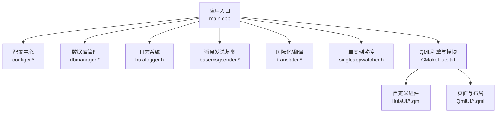
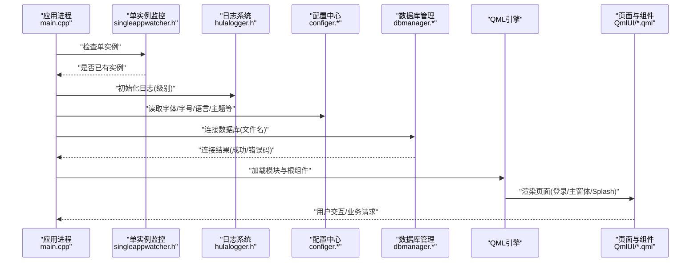
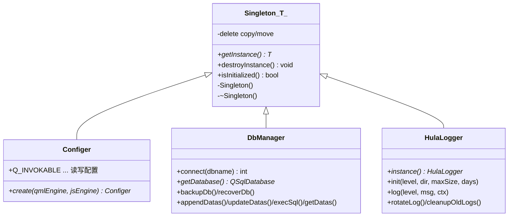
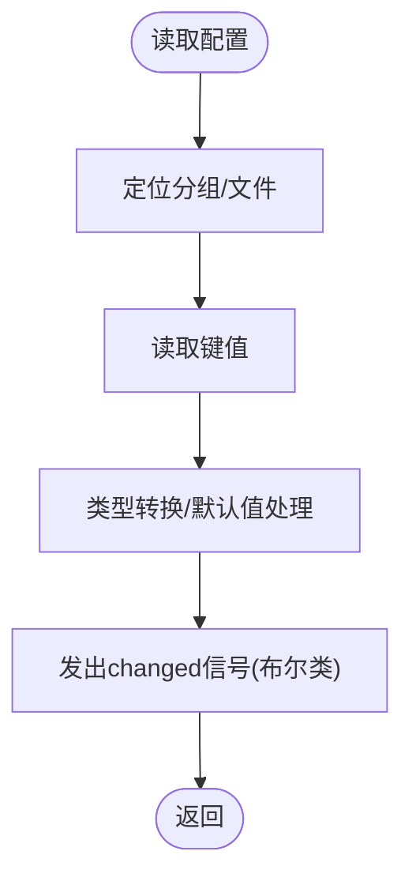
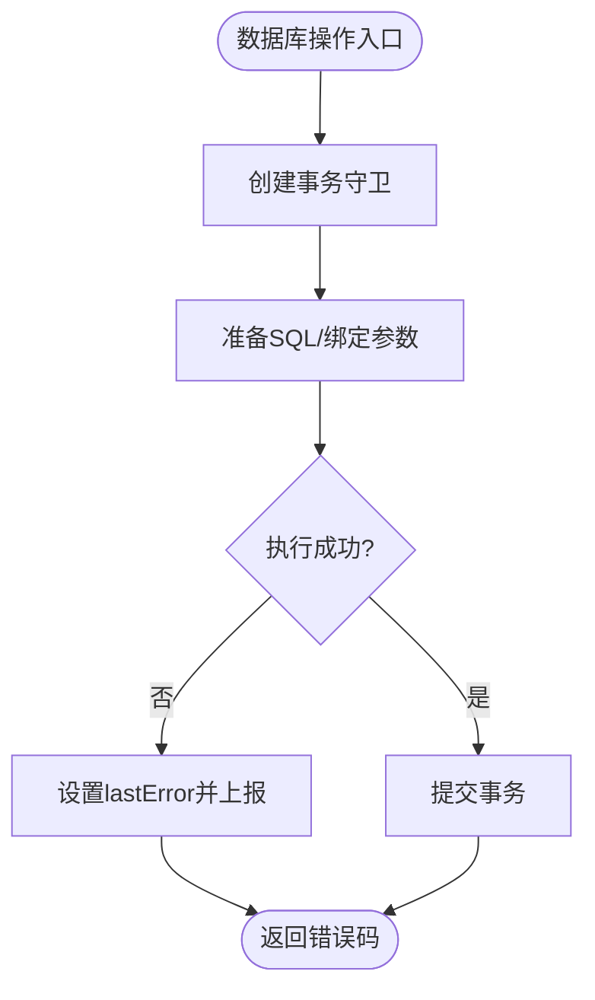
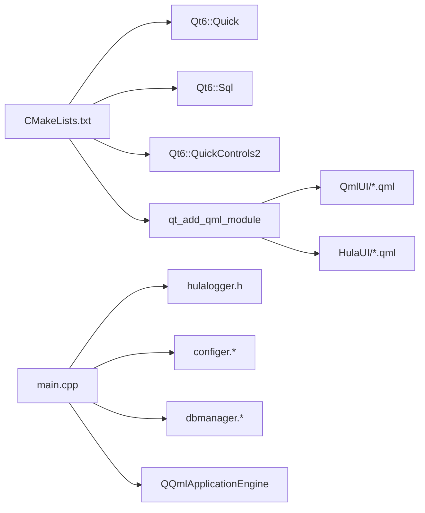

# 开发最佳实践

<cite>
**本文引用的文件**   
- [README.md](file://README.md)
- [CMakeLists.txt](file://CMakeLists.txt)
- [main.cpp](file://src/main.cpp)
- [common.h](file://src/common.h)
- [singleton.h](file://src/singleton.h)
- [configer.h](file://src/configer.h)
- [configer.cpp](file://src/configer.cpp)
- [dbmanager.h](file://src/dbmanager.h)
- [dbmanager.cpp](file://src/dbmanager.cpp)
- [hulalogger.h](file://src/hulalogger.h)
- [HulaButton.qml](file://src/HulaUI/HulaButton.qml)
- [Main.qml](file://src/QmlUI/Main.qml)
- [basemsgsender.h](file://src/basemsgsender.h)
- [basemsgsender.cpp](file://src/basemsgsender.cpp)
- [utils.h](file://src/utils.h)
</cite>

## 目录
1. [简介](#简介)
2. [项目结构](#项目结构)
3. [核心组件](#核心组件)
4. [架构总览](#架构总览)
5. [详细组件分析](#详细组件分析)
6. [依赖关系分析](#依赖关系分析)
7. [性能考虑](#性能考虑)
8. [故障排查指南](#故障排查指南)
9. [结论](#结论)
10. [附录](#附录)

## 简介
本指南面向QmlPlugins项目的开发与维护，聚焦于代码规范、命名约定、注释标准、设计模式与架构原则、错误处理与异常管理、服务降级策略、性能优化与内存管理、以及代码审查与质量保障流程。文档以仓库现有实现为依据，结合Qt6/QML技术栈特性，给出可落地的最佳实践建议。

## 项目结构
项目采用“分层+模块化”组织方式：
- 源代码位于src/，分为C++核心模块与QML界面模块
- C++模块包含配置、数据库、日志、国际化、消息中心、工具等子系统
- QML模块包含页面、主题、自定义组件等
- 构建系统使用CMake，集成Qt6 Quick/Sql/Controls2，并通过qt_add_qml_module打包QML资源

图示来源
- [main.cpp:17-99](file://src/main.cpp#L17-L99)
- [CMakeLists.txt:29-93](file://CMakeLists.txt#L29-L93)

章节来源
- [README.md:36-45](file://README.md#L36-L45)
- [CMakeLists.txt:1-137](file://CMakeLists.txt#L1-L137)

## 核心组件
- 单例模板与便捷宏：提供线程安全、RAII、可销毁的单例基类，适用于配置、数据库、日志等全局服务
- 配置中心：封装QSettings，提供QML可调用的配置项读写接口
- 数据库管理：基于SQLite，提供事务守卫、线程本地连接、模式加载、批量增删改查、备份/恢复
- 日志系统：线程安全、级别控制、文件轮转、过期清理
- 消息发送基类：统一消息事件发射与QML上下文注册
- 自定义QML组件：主题化按钮、工具提示等

章节来源
- [singleton.h:1-81](file://src/singleton.h#L1-L81)
- [configer.h:98-277](file://src/configer.h#L98-L277)
- [configer.cpp:1-421](file://src/configer.cpp#L1-L421)
- [dbmanager.h:31-192](file://src/dbmanager.h#L31-L192)
- [dbmanager.cpp:1-824](file://src/dbmanager.cpp#L1-L824)
- [hulalogger.h:1-175](file://src/hulalogger.h#L1-L175)
- [basemsgsender.h:1-38](file://src/basemsgsender.h#L1-L38)
- [basemsgsender.cpp:1-27](file://src/basemsgsender.cpp#L1-L27)

## 架构总览
应用启动流程与关键交互如下：

图示来源
- [main.cpp:17-99](file://src/main.cpp#L17-L99)
- [hulalogger.h:49-175](file://src/hulalogger.h#L49-L175)
- [configer.h:98-277](file://src/configer.h#L98-L277)
- [dbmanager.h:52-192](file://src/dbmanager.h#L52-L192)
- [Main.qml:6-41](file://src/QmlUI/Main.qml#L6-L41)

## 详细组件分析

### 单例与线程安全
- 使用现代C++20与std::unique_ptr确保生命周期安全
- 使用std::call_once保证首次初始化的原子性
- 禁止拷贝/移动，避免共享状态被意外复制
- 提供destroyInstance便于测试与资源回收

图示来源
- [singleton.h:21-61](file://src/singleton.h#L21-L61)
- [configer.h:98-120](file://src/configer.h#L98-L120)
- [dbmanager.h:52-77](file://src/dbmanager.h#L52-L77)
- [hulalogger.h:49-80](file://src/hulalogger.h#L49-L80)

章节来源
- [singleton.h:1-81](file://src/singleton.h#L1-L81)

### 配置中心（Configer）
- 以QML单例形式暴露配置项，支持读写、信号通知
- 使用QSettings(INI)持久化，分组管理
- 提供路径宏、默认格式、报表模板、相机参数等丰富配置

图示来源
- [configer.cpp:404-419](file://src/configer.cpp#L404-L419)
- [configer.cpp:412-418](file://src/configer.cpp#L412-L418)

章节来源
- [configer.h:98-277](file://src/configer.h#L98-L277)
- [configer.cpp:1-421](file://src/configer.cpp#L1-L421)

### 数据库管理（DbManager）
- 事务守卫：RAII自动回滚，显式commit
- 线程本地连接：以线程ID命名连接，避免并发冲突
- 模式加载：解析PRAGMA table_info，构建表/字段元数据
- 批量操作：insert/update/exec/get/find，统一错误上报

图示来源
- [dbmanager.cpp:16-39](file://src/dbmanager.cpp#L16-L39)
- [dbmanager.cpp:555-576](file://src/dbmanager.cpp#L555-L576)
- [dbmanager.cpp:784-793](file://src/dbmanager.cpp#L784-L793)

章节来源
- [dbmanager.h:31-192](file://src/dbmanager.h#L31-L192)
- [dbmanager.cpp:1-824](file://src/dbmanager.cpp#L1-L824)

### 日志系统（HulaLogger）
- 级别控制：Fatal/Critical/Warning/Info/Debug
- 文件轮转：按大小与日期，自动清理过期日志
- 线程安全：互斥保护文件与实例
- QML集成：通过Q_PROPERTY与信号对外暴露

章节来源
- [hulalogger.h:1-175](file://src/hulalogger.h#L1-L175)

### 消息发送基类（BaseMsgSender）
- 统一发射MessageInfo事件，便于消息中心集中处理
- 支持在QML上下文中注册实例，便于前端消费

章节来源
- [basemsgsender.h:1-38](file://src/basemsgsender.h#L1-L38)
- [basemsgsender.cpp:1-27](file://src/basemsgsender.cpp#L1-L27)

### 自定义QML组件与页面
- HulaButton：主题化按钮，支持图标、悬停、选中态、工具提示
- Main：根据配置选择加载Splash/Login/MainForm，异步/同步Loader策略

章节来源
- [HulaButton.qml:1-81](file://src/HulaUI/HulaButton.qml#L1-L81)
- [Main.qml:6-41](file://src/QmlUI/Main.qml#L6-L41)

## 依赖关系分析
- 构建层面：CMake统一管理Qt模块与QML资源打包，设置编译选项与平台特性
- 运行层面：main.cpp串联日志、配置、数据库、国际化、单实例监控；通过QML引擎加载页面与组件

图示来源
- [CMakeLists.txt:23-100](file://CMakeLists.txt#L23-L100)
- [main.cpp:17-99](file://src/main.cpp#L17-L99)

章节来源
- [CMakeLists.txt:1-137](file://CMakeLists.txt#L1-L137)
- [main.cpp:17-99](file://src/main.cpp#L17-L99)

## 性能考虑
- 数据库
  - WAL模式提升并发写入稳定性，busy_timeout降低“数据库被锁定”风险
  - 事务批处理减少往返次数，避免逐条提交
  - 线程本地连接避免锁竞争
- UI与资源
  - Loader异步加载页面，缩短首屏时间
  - 图标/图片使用文件协议与固定尺寸，减少布局抖动
- 日志
  - 控制级别与轮转阈值，避免IO瓶颈
  - 线程安全写入，必要时合并高频日志
- 构建
  - 并行编译与最小警告级别，提升迭代效率

章节来源
- [dbmanager.cpp:74-85](file://src/dbmanager.cpp#L74-L85)
- [Main.qml:32-39](file://src/QmlUI/Main.qml#L32-L39)
- [hulalogger.h:67-105](file://src/hulalogger.h#L67-L105)
- [CMakeLists.txt:15-20](file://CMakeLists.txt#L15-L20)

## 故障排查指南
- 错误码与提示类型
  - 使用统一ErrorCode与PromptType，区分Toast/Log/Confirmation/Error
  - MessageInfo承载文本、错误码与提示类型，便于前端一致化展示
- 数据库错误
  - lastError按线程存储，setLastError统一上报并发射messageEmitted
  - 备份/恢复失败时保留原文件并回滚，避免数据损坏
- 日志
  - logInit支持外部初始化，rotate/cleanup自动化运维
- QML异常
  - objectCreationFailed时退出，避免崩溃传播

章节来源
- [common.h:23-159](file://src/common.h#L23-L159)
- [dbmanager.cpp:769-793](file://src/dbmanager.cpp#L769-L793)
- [hulalogger.h:67-105](file://src/hulalogger.h#L67-L105)
- [main.cpp:87-92](file://src/main.cpp#L87-L92)

## 结论
本项目在Qt6/QML生态下实现了清晰的分层与模块化：以单例封装全局服务、以配置中心统一参数、以数据库管理抽象数据访问、以日志系统保障可观测性。遵循本文最佳实践，可在保证一致性的同时持续提升可维护性、性能与可靠性。

## 附录

### 代码规范与命名约定
- 类型与文件
  - 类名：大驼峰（如Configer、DbManager、HulaLogger）
  - 文件名：与类同名（如configer.h/cpp、dbmanager.h/cpp）
- 函数与属性
  - 公共接口：首字母小写，动词开头（如connect、getDatabase、init）
  - QML可调用：Q_INVOKABLE，参数与返回值尽量简单
- 常量与宏
  - 宏：全大写加下划线（如CFG_FILE、LOG_PATH）
  - 路径与默认值：集中定义于头文件顶部
- 错误处理
  - 返回统一ErrorCode，必要时携带MessageInfo
  - 关键路径显式判断并设置lastError

章节来源
- [configer.h:24-89](file://src/configer.h#L24-L89)
- [dbmanager.h:52-192](file://src/dbmanager.h#L52-L192)
- [common.h:63-117](file://src/common.h#L63-L117)

### 注释标准
- 头文件：模块说明、作者、联系方式、历史变更摘要
- 枚举与结构体：用途与取值含义
- 公共接口：参数、返回值、异常、线程安全说明
- 复杂算法：前置条件、后置条件、复杂度说明（如有）

章节来源
- [common.h:1-159](file://src/common.h#L1-L159)
- [configer.h:1-17](file://src/configer.h#L1-L17)
- [dbmanager.h:1-30](file://src/dbmanager.h#L1-L30)

### 设计模式与重构策略
- 单例：用于全局服务（配置、数据库、日志），配合Singleton模板
- RAII：事务守卫、线程本地连接、智能指针
- 观察者：BaseMsgSender统一发射消息，前端订阅
- 策略：Loader异步加载页面，按配置切换显示策略
- 重构建议：将重复SQL抽取为私有辅助函数，分离UI与业务逻辑，引入单元测试覆盖关键分支

章节来源
- [singleton.h:21-61](file://src/singleton.h#L21-L61)
- [dbmanager.cpp:427-435](file://src/dbmanager.cpp#L427-L435)
- [basemsgsender.h:27-35](file://src/basemsgsender.h#L27-L35)
- [Main.qml:32-39](file://src/QmlUI/Main.qml#L32-L39)

### 错误处理与异常管理
- 统一错误码与MessageInfo，区分提示类型
- 数据库错误按线程存储，避免竞态
- 关键操作失败时返回错误码并记录日志
- UI层对致命错误进行优雅降级（如禁用功能、显示提示）

章节来源
- [common.h:131-159](file://src/common.h#L131-L159)
- [dbmanager.cpp:769-793](file://src/dbmanager.cpp#L769-L793)

### 服务降级与容错
- 数据库不可用：阻塞关键流程或提示重试
- 日志写入失败：降级到stderr，保证可观测性
- QML加载失败：退出应用，避免半成品界面

章节来源
- [main.cpp:46-50](file://src/main.cpp#L46-L50)
- [hulalogger.h:112-167](file://src/hulalogger.h#L112-L167)
- [main.cpp:87-92](file://src/main.cpp#L87-L92)

### 性能优化与内存管理
- 数据库：WAL、busy_timeout、事务批处理
- UI：Loader异步、固定尺寸、避免频繁重建
- 日志：轮转阈值、线程安全写入
- 内存：智能指针、RAII、单例生命周期管理

章节来源
- [dbmanager.cpp:74-85](file://src/dbmanager.cpp#L74-L85)
- [Main.qml:32-39](file://src/QmlUI/Main.qml#L32-L39)
- [hulalogger.h:112-167](file://src/hulalogger.h#L112-L167)

### 代码审查与质量保证
- 构建与静态检查：启用-Wall -Wextra -Wpedantic，确保跨平台一致性
- 单元测试：针对DbManager关键路径、Configer读写、HulaLogger轮转
- 代码评审：关注错误码使用、线程安全、资源释放、QML上下文注册
- 文档：每个公共接口补充注释，枚举与结构体说明用途

章节来源
- [CMakeLists.txt:15-20](file://CMakeLists.txt#L15-L20)
- [dbmanager.cpp:555-576](file://src/dbmanager.cpp#L555-L576)
- [configer.cpp:404-419](file://src/configer.cpp#L404-L419)
- [hulalogger.h:112-167](file://src/hulalogger.h#L112-L167)