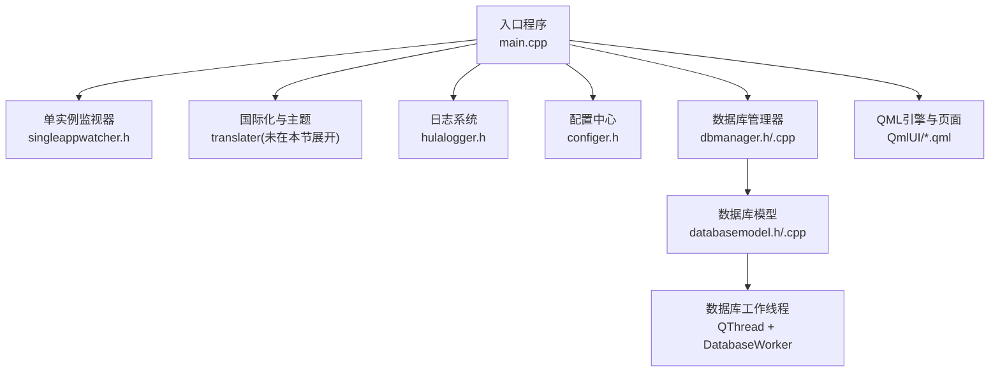
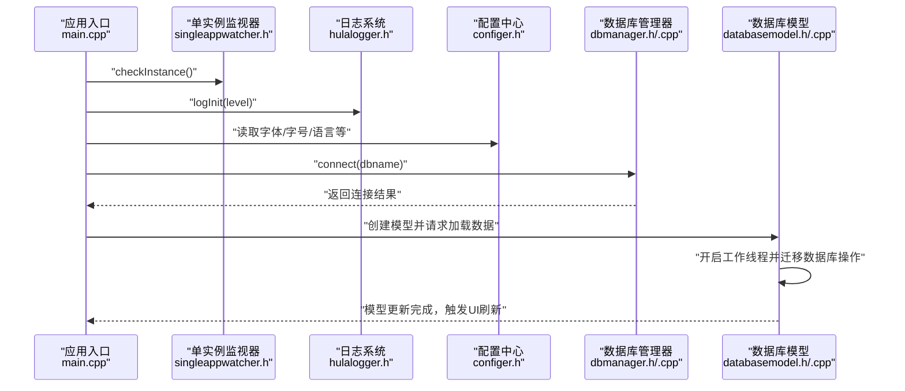
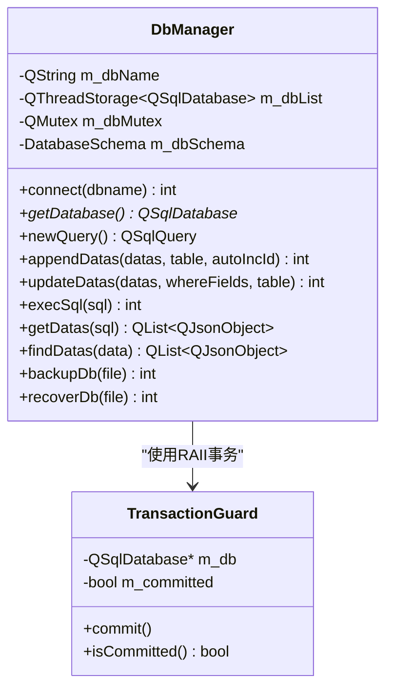
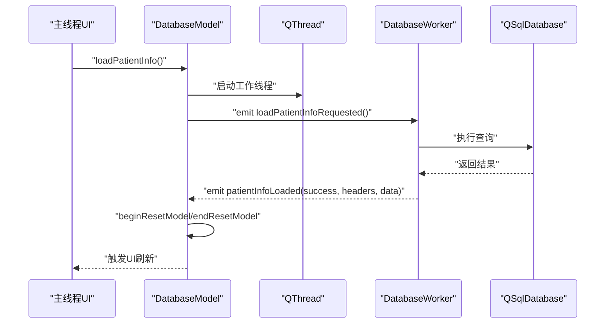
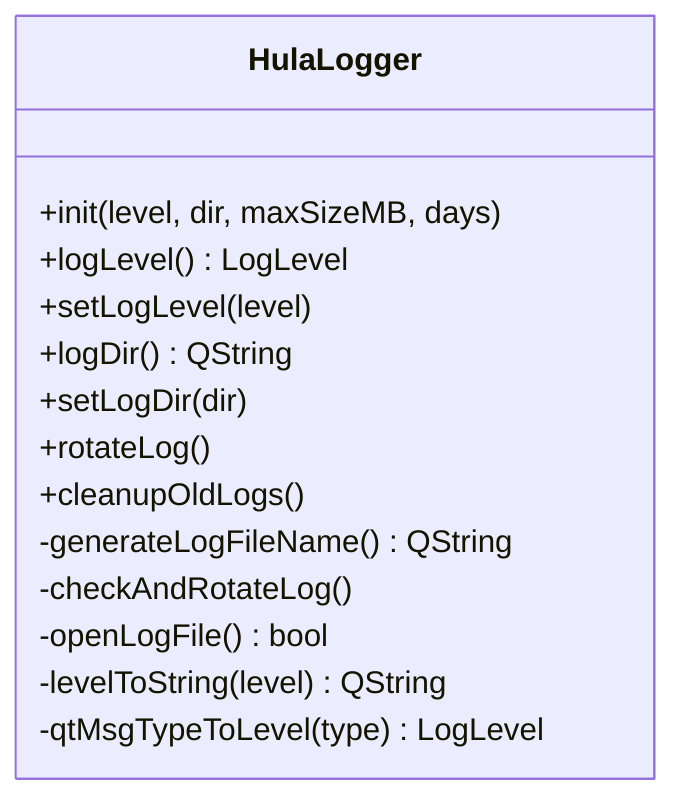
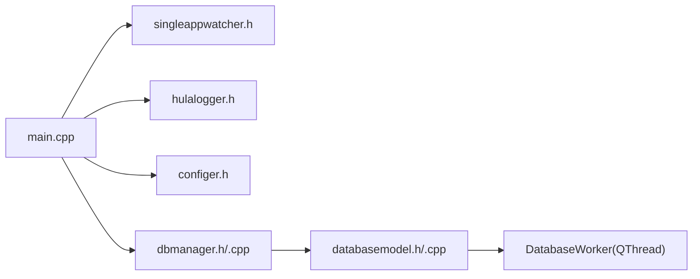

# 性能优化与内存管理

<cite>
**本文引用的文件**
- [main.cpp](file://src/main.cpp)
- [dbmanager.h](file://src/dbmanager.h)
- [dbmanager.cpp](file://src/dbmanager.cpp)
- [databasemodel.h](file://src/databasemodel.h)
- [databasemodel.cpp](file://src/databasemodel.cpp)
- [hulalogger.h](file://src/hulalogger.h)
- [configer.h](file://src/configer.h)
- [singleappwatcher.h](file://src/singleappwatcher.h)
- [common.h](file://src/common.h)
- [utils.h](file://src/utils.h)
</cite>

## 目录
1. [简介](#简介)
2. [项目结构](#项目结构)
3. [核心组件](#核心组件)
4. [架构总览](#架构总览)
5. [详细组件分析](#详细组件分析)
6. [依赖分析](#依赖分析)
7. [性能考虑](#性能考虑)
8. [故障排查指南](#故障排查指南)
9. [结论](#结论)
10. [附录](#附录)

## 简介
本指南聚焦于QmlPlugins项目的性能优化与内存管理，涵盖C++层面的内存管理最佳实践（智能指针、RAII、Qt对象模型与父子关系）、数据库查询优化（索引、批量与事务）、QML渲染性能优化（模型、委托复用与动画）、性能监控与测试策略以及具体优化案例与对比思路。文档基于仓库现有代码进行分析，并提供可落地的改进建议。

## 项目结构
项目采用“入口程序 + C++业务层 + QML界面层”的分层组织方式：
- 入口程序负责应用生命周期、单实例检测、国际化、日志初始化与数据库连接
- 业务层包含数据库管理器、数据库模型与工作线程、日志系统、配置中心、工具类等
- QML界面层由多个UI组件与页面构成，通过上下文属性与单例暴露给QML

图示来源
- [main.cpp:17-99](file://src/main.cpp#L17-L99)
- [singleappwatcher.h:1-62](file://src/singleappwatcher.h#L1-L62)
- [hulalogger.h:49-175](file://src/hulalogger.h#L49-L175)
- [configer.h:98-277](file://src/configer.h#L98-L277)
- [dbmanager.h:52-192](file://src/dbmanager.h#L52-L192)
- [dbmanager.cpp:51-116](file://src/dbmanager.cpp#L51-L116)
- [databasemodel.h:20-97](file://src/databasemodel.h#L20-L97)
- [databasemodel.cpp:181-202](file://src/databasemodel.cpp#L181-L202)

章节来源
- [main.cpp:17-99](file://src/main.cpp#L17-L99)
- [configer.h:98-277](file://src/configer.h#L98-L277)

## 核心组件
- 应用入口与生命周期：单实例检测、国际化、日志初始化、数据库连接、QML引擎加载
- 数据库管理器：线程本地数据库连接、WAL模式、busy_timeout、事务守卫、批量插入/更新、查询结果转换
- 数据库模型与工作线程：将数据库操作迁移到专用线程，主线程只做模型更新与UI刷新
- 日志系统：线程安全、日志轮转、级别控制
- 配置中心：QML可用的单例配置项
- 工具类：文件与目录操作等

章节来源
- [main.cpp:17-99](file://src/main.cpp#L17-L99)
- [dbmanager.h:52-192](file://src/dbmanager.h#L52-L192)
- [dbmanager.cpp:51-116](file://src/dbmanager.cpp#L51-L116)
- [databasemodel.h:20-97](file://src/databasemodel.h#L20-L97)
- [databasemodel.cpp:181-202](file://src/databasemodel.cpp#L181-L202)
- [hulalogger.h:49-175](file://src/hulalogger.h#L49-L175)
- [configer.h:98-277](file://src/configer.h#L98-L277)
- [utils.h:21-82](file://src/utils.h#L21-L82)

## 架构总览
应用启动流程与数据库访问链路如下：

图示来源
- [main.cpp:17-99](file://src/main.cpp#L17-L99)
- [singleappwatcher.h:16-36](file://src/singleappwatcher.h#L16-L36)
- [hulalogger.h:67-70](file://src/hulalogger.h#L67-L70)
- [configer.h:133-146](file://src/configer.h#L133-L146)
- [dbmanager.cpp:51-90](file://src/dbmanager.cpp#L51-L90)
- [databasemodel.cpp:181-202](file://src/databasemodel.cpp#L181-L202)

## 详细组件分析

### 数据库管理器与事务守卫（DbManager/TransactionGuard）
- 线程本地数据库连接：每个线程独立连接，避免锁竞争；连接名称以线程ID区分
- WAL模式与busy_timeout：提升并发写入稳定性，降低“database is locked”概率
- 事务守卫：RAII自动回滚，显式commit确保一致性
- 批量操作：批量插入/更新统一放入事务，减少往返与锁竞争
- 查询结果转换：根据字段元类型选择合适的数据类型，避免字符串转换成本

图示来源
- [dbmanager.h:37-50](file://src/dbmanager.h#L37-L50)
- [dbmanager.h:52-192](file://src/dbmanager.h#L52-L192)
- [dbmanager.cpp:16-40](file://src/dbmanager.cpp#L16-L40)
- [dbmanager.cpp:51-116](file://src/dbmanager.cpp#L51-L116)
- [dbmanager.cpp:500-553](file://src/dbmanager.cpp#L500-L553)
- [dbmanager.cpp:437-498](file://src/dbmanager.cpp#L437-L498)

章节来源
- [dbmanager.h:37-50](file://src/dbmanager.h#L37-L50)
- [dbmanager.h:52-192](file://src/dbmanager.h#L52-L192)
- [dbmanager.cpp:16-40](file://src/dbmanager.cpp#L16-L40)
- [dbmanager.cpp:51-116](file://src/dbmanager.cpp#L51-L116)
- [dbmanager.cpp:500-553](file://src/dbmanager.cpp#L500-L553)
- [dbmanager.cpp:437-498](file://src/dbmanager.cpp#L437-L498)

### 数据库模型与工作线程（DatabaseModel/DatabaseWorker）
- 将数据库操作迁移到专用线程，避免阻塞UI
- 使用QMutex保护共享数据结构，保证线程安全
- 通过信号槽在工作线程与主线程间传递结果，完成后重置模型并触发刷新

图示来源
- [databasemodel.h:20-97](file://src/databasemodel.h#L20-L97)
- [databasemodel.cpp:181-202](file://src/databasemodel.cpp#L181-L202)
- [databasemodel.cpp:286-300](file://src/databasemodel.cpp#L286-L300)

章节来源
- [databasemodel.h:20-97](file://src/databasemodel.h#L20-L97)
- [databasemodel.cpp:181-202](file://src/databasemodel.cpp#L181-L202)
- [databasemodel.cpp:286-300](file://src/databasemodel.cpp#L286-L300)

### 日志系统（HulaLogger）
- 线程安全写入、日志轮转、级别控制、自动清理过期日志
- 通过QMutex保护文件写入，避免并发写冲突
- 支持运行时调整日志级别与目录

图示来源
- [hulalogger.h:49-175](file://src/hulalogger.h#L49-L175)

章节来源
- [hulalogger.h:49-175](file://src/hulalogger.h#L49-L175)

### 配置中心（Configer）
- QML可用的单例配置，提供字体、字号、语言、主题、窗口模式等设置
- 便于在QML侧直接读取与绑定，减少重复逻辑

章节来源
- [configer.h:98-277](file://src/configer.h#L98-L277)

### 工具类（Utils）
- 文件与目录操作工具，支持条件复制、目录同步等
- 可用于资源管理与缓存清理，间接影响I/O性能

章节来源
- [utils.h:21-82](file://src/utils.h#L21-L82)

## 依赖分析
- 入口程序依赖单实例监视器、日志系统、配置中心与数据库管理器
- 数据库管理器依赖Qt SQL模块与线程存储，提供线程安全的数据库访问
- 数据库模型依赖QAbstractTableModel与QThread，通过信号槽解耦UI与数据访问
- 日志系统与配置中心分别服务于调试与运行时配置

图示来源
- [main.cpp:17-99](file://src/main.cpp#L17-L99)
- [singleappwatcher.h:1-62](file://src/singleappwatcher.h#L1-L62)
- [hulalogger.h:49-175](file://src/hulalogger.h#L49-L175)
- [configer.h:98-277](file://src/configer.h#L98-L277)
- [dbmanager.h:52-192](file://src/dbmanager.h#L52-L192)
- [databasemodel.h:20-97](file://src/databasemodel.h#L20-L97)

章节来源
- [main.cpp:17-99](file://src/main.cpp#L17-L99)
- [dbmanager.h:52-192](file://src/dbmanager.h#L52-L192)
- [databasemodel.h:20-97](file://src/databasemodel.h#L20-L97)

## 性能考虑

### C++内存管理最佳实践
- 智能指针与RAII
  - 对需要跨线程或跨作用域的对象，优先使用Qt提供的智能指针容器与对象所有权管理
  - 对临时资源（如QSqlQuery）遵循“尽快创建、尽快释放”的原则，避免长期持有
- Qt对象模型与父子关系
  - 将子对象置于父对象的生命周期内，利用Qt自动清理机制减少泄漏风险
  - 对于跨线程对象，避免不当的父子关系导致析构顺序问题
- 避免不必要的拷贝
  - 使用引用或移动语义传递大对象（如QJsonObject/QJsonArray）
  - 在数据库结果转换中，尽量一次性构建目标结构，减少中间拷贝

### 数据库查询优化
- 索引使用
  - 对频繁出现在WHERE/JOIN中的列建立索引，减少全表扫描
  - 对复合查询条件，评估组合索引的使用效果
- 批量操作
  - 使用事务守卫统一提交，减少事务开销
  - 批量插入/更新时，尽量使用参数化SQL与绑定，避免逐条执行
- 事务处理
  - 将多次写操作合并到单个事务中，显著降低锁竞争与磁盘写入次数
  - 对长时间运行的事务，注意WAL与busy_timeout的配置平衡

### QML渲染性能优化
- 模型优化
  - 使用分页或懒加载，避免一次性加载大量数据
  - 对大数据集，优先使用C++模型并通过信号槽增量更新
- 委托复用
  - 复用委托组件，避免重复创建与销毁
  - 减少委托内的复杂布局计算，尽量使用固定尺寸或缓存测量结果
- 动画性能
  - 控制同时播放的动画数量，避免过度重排
  - 使用位移与缩放等代价较低的动画属性

### 性能监控与测试
- 日志与指标
  - 使用日志系统记录关键路径耗时（如数据库查询、模型更新）
  - 在关键函数前后打点，统计平均耗时与P95/P99延迟
- 测试策略
  - 单元测试：针对数据库批量操作与事务边界进行压力测试
  - 集成测试：模拟真实数据规模，评估UI响应与滚动性能
- 工具建议
  - 使用Qt Creator性能分析器定位CPU与内存热点
  - 使用SQLite分析工具检查慢查询与索引使用情况

### 具体优化案例与对比思路
- 案例一：批量插入性能
  - 优化前：逐条INSERT，无事务包裹
  - 优化后：使用事务守卫与批量绑定，减少锁竞争
  - 对比维度：总耗时、峰值内存、数据库锁等待时间
- 案例二：模型加载性能
  - 优化前：主线程直接执行查询，阻塞UI
  - 优化后：迁移至工作线程，使用信号槽增量更新
  - 对比维度：首帧时间、滚动流畅度、主线程阻塞时长
- 案例三：动画与委托
  - 优化前：大量动态布局与复杂委托
  - 优化后：固定尺寸委托、减少动画数量
  - 对比维度：FPS、丢帧率、内存占用

## 故障排查指南
- 数据库连接失败
  - 检查数据库文件是否存在与可读写
  - 关注WAL与busy_timeout配置，避免并发写入冲突
- 线程安全问题
  - 确认共享数据结构使用QMutex保护
  - 避免在工作线程中直接操作UI对象
- 日志与诊断
  - 启用适当日志级别，定位异常路径
  - 使用日志轮转与过期清理，避免磁盘占用过高

章节来源
- [dbmanager.cpp:51-116](file://src/dbmanager.cpp#L51-L116)
- [databasemodel.cpp:234-256](file://src/databasemodel.cpp#L234-L256)
- [hulalogger.h:67-105](file://src/hulalogger.h#L67-L105)

## 结论
通过对入口程序、数据库管理器、模型与工作线程、日志系统与配置中心的分析，可以看出项目已在多线程与事务方面具备良好基础。进一步的性能优化应围绕“数据库批量与事务、模型与委托的渲染优化、日志与监控体系”展开，并结合实际数据规模进行量化对比，持续迭代。

## 附录
- 错误码与消息结构：用于统一错误上报与诊断
- 单例模式：DbManager、Configer等通过单例提供全局访问
- 平台适配：入口程序对Wayland平台的特殊处理

章节来源
- [common.h:63-159](file://src/common.h#L63-L159)
- [dbmanager.h:74-75](file://src/dbmanager.h#L74-L75)
- [configer.h:108-109](file://src/configer.h#L108-L109)
- [main.cpp:19-20](file://src/main.cpp#L19-L20)