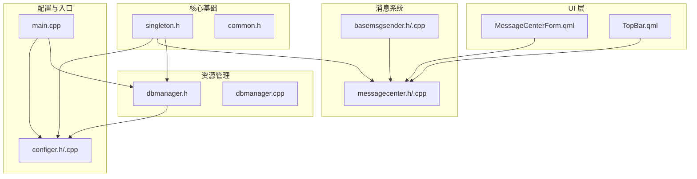
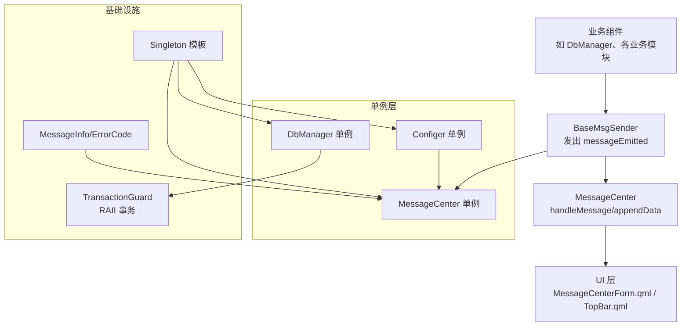
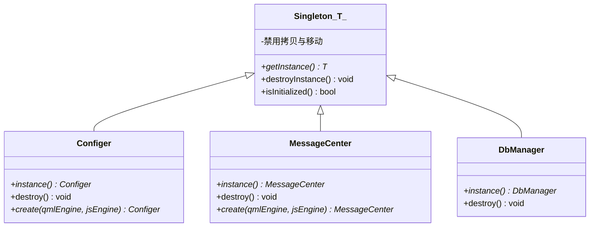
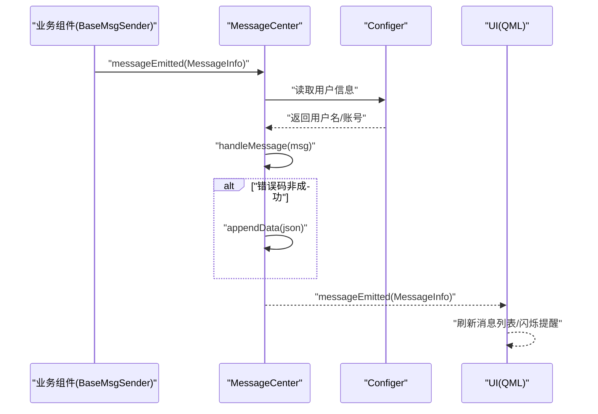
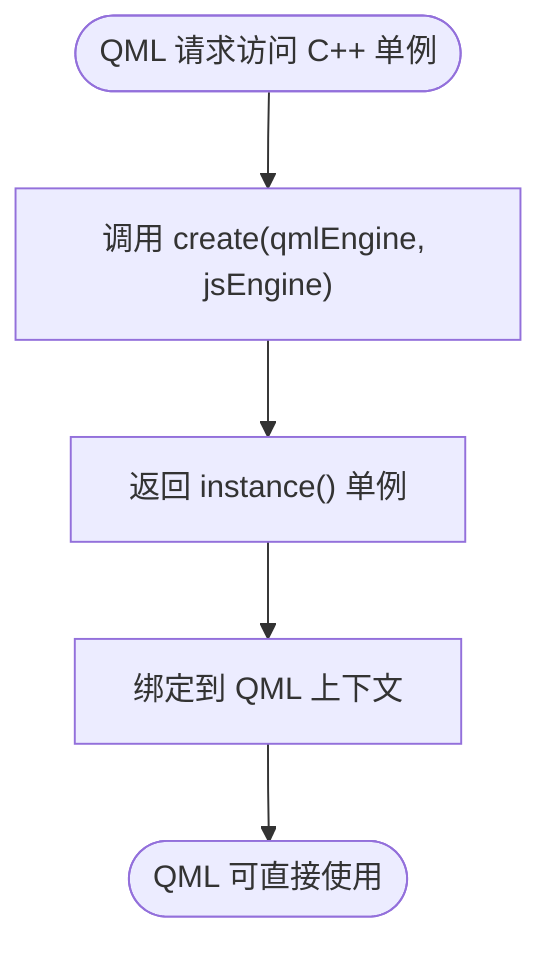
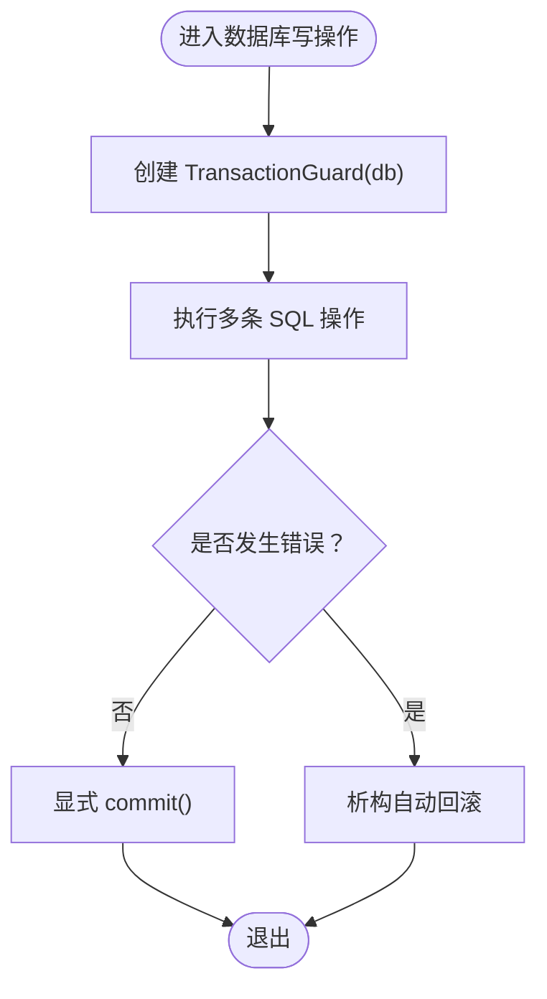
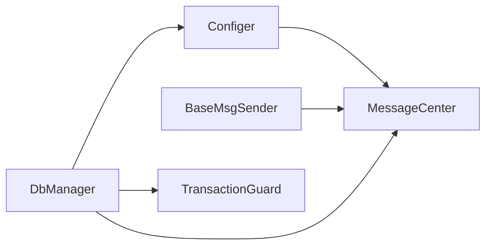

# 设计模式应用

<cite>
**本文引用的文件**
- [singleton.h](file://src/singleton.h)
- [basemsgsender.h](file://src/basemsgsender.h)
- [basemsgsender.cpp](file://src/basemsgsender.cpp)
- [messagecenter.h](file://src/messagecenter.h)
- [messagecenter.cpp](file://src/messagecenter.cpp)
- [dbmanager.h](file://src/dbmanager.h)
- [dbmanager.cpp](file://src/dbmanager.cpp)
- [configer.h](file://src/configer.h)
- [configer.cpp](file://src/configer.cpp)
- [common.h](file://src/common.h)
- [main.cpp](file://src/main.cpp)
- [datadict.cpp](file://src/datadict.cpp)
- [patients.cpp](file://src/patients.cpp)
- [MessageCenterForm.qml](file://src/QmlUI/MessageCenterForm.qml)
- [TopBar.qml](file://src/QmlUI/TopBar.qml)
</cite>

## 目录
1. [引言](#引言)
2. [项目结构](#项目结构)
3. [核心组件](#核心组件)
4. [架构总览](#架构总览)
5. [详细组件分析](#详细组件分析)
6. [依赖关系分析](#依赖关系分析)
7. [性能考量](#性能考量)
8. [故障排查指南](#故障排查指南)
9. [结论](#结论)
10. [附录](#附录)

## 引言
本指南聚焦于 QmlPlugins 项目中设计模式的应用与最佳实践，涵盖以下主题：
- 单例模式：基于现代 C++ 的 Singleton 模板与便捷宏，以及在 Configer、MessageCenter、DbManager 中的具体落地。
- 观察者模式：通过 BaseMsgSender 基类与 MessageCenter 的消息分发机制，实现松耦合的消息传播。
- 工厂模式：在组件创建与注册中的体现（例如 QML 单例的 create 方法）。
- RAII 模式：在资源管理中的应用，重点在于数据库事务的自动回滚保障。

同时给出模式选择原则、适用场景、实现注意事项与具体示例路径，帮助读者快速理解并正确使用这些模式。

## 项目结构
项目采用“按职责分层 + Qt 元对象系统”的组织方式：
- 核心基础：singleton.h、common.h 提供通用工具与枚举。
- 消息系统：basemsgsender.*、messagecenter.* 实现观察者模式与消息中心。
- 资源管理：dbmanager.* 实现数据库连接与事务 RAII。
- 配置与入口：configer.*、main.cpp 提供全局配置与初始化。
- UI 层：QmlUI 下的 QML 文件与 C++ 单例在 QML 中的集成。

图示来源
- [singleton.h:1-81](file://src/singleton.h#L1-L81)
- [common.h:1-159](file://src/common.h#L1-L159)
- [basemsgsender.h:1-38](file://src/basemsgsender.h#L1-L38)
- [basemsgsender.cpp:1-27](file://src/basemsgsender.cpp#L1-L27)
- [messagecenter.h:1-127](file://src/messagecenter.h#L1-L127)
- [messagecenter.cpp:1-118](file://src/messagecenter.cpp#L1-L118)
- [dbmanager.h:1-192](file://src/dbmanager.h#L1-L192)
- [dbmanager.cpp:1-824](file://src/dbmanager.cpp#L1-L824)
- [configer.h:1-277](file://src/configer.h#L1-L277)
- [configer.cpp:1-421](file://src/configer.cpp#L1-L421)
- [main.cpp](file://src/main.cpp)
- [MessageCenterForm.qml:1-221](file://src/QmlUI/MessageCenterForm.qml#L1-L221)
- [TopBar.qml:190-225](file://src/QmlUI/TopBar.qml#L190-L225)

章节来源
- [singleton.h:1-81](file://src/singleton.h#L1-L81)
- [common.h:1-159](file://src/common.h#L1-L159)
- [configer.h:1-277](file://src/configer.h#L1-L277)
- [configer.cpp:1-421](file://src/configer.cpp#L1-L421)
- [basemsgsender.h:1-38](file://src/basemsgsender.h#L1-L38)
- [basemsgsender.cpp:1-27](file://src/basemsgsender.cpp#L1-L27)
- [messagecenter.h:1-127](file://src/messagecenter.h#L1-L127)
- [messagecenter.cpp:1-118](file://src/messagecenter.cpp#L1-L118)
- [dbmanager.h:1-192](file://src/dbmanager.h#L1-L192)
- [dbmanager.cpp:1-824](file://src/dbmanager.cpp#L1-L824)
- [main.cpp](file://src/main.cpp)
- [MessageCenterForm.qml:1-221](file://src/QmlUI/MessageCenterForm.qml#L1-L221)
- [TopBar.qml:190-225](file://src/QmlUI/TopBar.qml#L190-L225)

## 核心组件
- 单例模板与宏：提供线程安全、无异常、可销毁的单例实现，并通过 SINGLETON 宏简化类内暴露。
- 消息中心：集中接收来自各业务组件的消息，持久化并转发至 UI。
- 基类发送者：统一消息发送接口，自动连接/断开消息中心。
- 数据库管理器：封装 SQLite 连接、事务、查询与错误处理，提供线程本地连接池。
- 配置器：全局配置单例，提供 QML 可访问的配置项与 QML 单例创建方法。

章节来源
- [singleton.h:1-81](file://src/singleton.h#L1-L81)
- [messagecenter.h:1-127](file://src/messagecenter.h#L1-L127)
- [messagecenter.cpp:1-118](file://src/messagecenter.cpp#L1-L118)
- [basemsgsender.h:1-38](file://src/basemsgsender.h#L1-L38)
- [basemsgsender.cpp:1-27](file://src/basemsgsender.cpp#L1-L27)
- [dbmanager.h:1-192](file://src/dbmanager.h#L1-L192)
- [dbmanager.cpp:1-824](file://src/dbmanager.cpp#L1-L824)
- [configer.h:1-277](file://src/configer.h#L1-L277)
- [configer.cpp:1-421](file://src/configer.cpp#L1-L421)

## 架构总览
整体采用“单例 + 观察者 + RAII”的组合架构：
- 单例：Configer、MessageCenter、DbManager 通过 SINGLETON 宏暴露统一访问入口。
- 观察者：各业务组件继承 BaseMsgSender，发出 messageEmitted 信号；MessageCenter 作为订阅者集中处理。
- RAII：TransactionGuard 在作用域结束时自动回滚，确保事务一致性。

图示来源
- [singleton.h:1-81](file://src/singleton.h#L1-L81)
- [basemsgsender.h:1-38](file://src/basemsgsender.h#L1-L38)
- [basemsgsender.cpp:1-27](file://src/basemsgsender.cpp#L1-L27)
- [messagecenter.h:1-127](file://src/messagecenter.h#L1-L127)
- [messagecenter.cpp:1-118](file://src/messagecenter.cpp#L1-L118)
- [dbmanager.h:1-192](file://src/dbmanager.h#L1-L192)
- [dbmanager.cpp:1-824](file://src/dbmanager.cpp#L1-L824)
- [configer.h:1-277](file://src/configer.h#L1-L277)
- [common.h:1-159](file://src/common.h#L1-L159)

## 详细组件分析

### 单例模式：Singleton 模板与便捷宏
- 设计要点
  - 使用静态局部变量 + std::unique_ptr 管理生命周期，避免内存泄漏。
  - 编译期约束 T 必须派生自 QObject，确保与 Qt 对象模型兼容。
  - 提供 destroyInstance 与 isInitialized，便于测试与资源回收。
  - 禁止拷贝与移动，防止意外复制。
- 应用位置
  - Configer、MessageCenter、DbManager 三者均通过 SINGLETON 宏暴露 instance()/destroy()。
- 最佳实践
  - 仅在需要全局唯一实例且与 Qt 生命周期结合的场景使用。
  - 避免在单例中持有重型资源；必要时延迟初始化或懒加载。
  - 测试时使用 destroyInstance 清理，避免跨用例污染。

图示来源
- [singleton.h:1-81](file://src/singleton.h#L1-L81)
- [configer.h:104-120](file://src/configer.h#L104-L120)
- [messagecenter.h:34-49](file://src/messagecenter.h#L34-L49)
- [dbmanager.h:74-77](file://src/dbmanager.h#L74-L77)

章节来源
- [singleton.h:1-81](file://src/singleton.h#L1-L81)
- [configer.h:104-120](file://src/configer.h#L104-L120)
- [messagecenter.h:34-49](file://src/messagecenter.h#L34-L49)
- [dbmanager.h:74-77](file://src/dbmanager.h#L74-L77)

### 观察者模式：消息中心与 BaseMsgSender
- 设计原理
  - BaseMsgSender 提供统一的 messageEmitted 信号与 QML 上下文注册能力。
  - MessageCenter 作为订阅者，集中处理消息：持久化到文件、转发给 UI。
  - 通过模板化的 connectRecv/disconnectRecv，在编译期进行类型检查与连接。
- 关键流程
  - 业务组件继承 BaseMsgSender，构造时自动连接消息中心；析构时断开。
  - 发送端发出 messageEmitted，接收端 handleMessage 内部根据错误码决定是否落盘。
  - UI 通过 QML 单例访问 MessageCenter 并展示消息列表。

图示来源
- [basemsgsender.h:1-38](file://src/basemsgsender.h#L1-L38)
- [basemsgsender.cpp:1-27](file://src/basemsgsender.cpp#L1-L27)
- [messagecenter.h:83-106](file://src/messagecenter.h#L83-L106)
- [messagecenter.cpp:101-116](file://src/messagecenter.cpp#L101-L116)
- [configer.h:124-130](file://src/configer.h#L124-L130)
- [MessageCenterForm.qml:215-221](file://src/QmlUI/MessageCenterForm.qml#L215-L221)
- [TopBar.qml:215-219](file://src/QmlUI/TopBar.qml#L215-L219)

章节来源
- [basemsgsender.h:1-38](file://src/basemsgsender.h#L1-L38)
- [basemsgsender.cpp:1-27](file://src/basemsgsender.cpp#L1-L27)
- [messagecenter.h:83-106](file://src/messagecenter.h#L83-L106)
- [messagecenter.cpp:101-116](file://src/messagecenter.cpp#L101-L116)
- [configer.h:124-130](file://src/configer.h#L124-L130)
- [MessageCenterForm.qml:215-221](file://src/QmlUI/MessageCenterForm.qml#L215-L221)
- [TopBar.qml:215-219](file://src/QmlUI/TopBar.qml#L215-L219)

### 工厂模式：组件创建与 QML 单例
- 设计说明
  - Configer 与 MessageCenter 在头文件中提供 create(qmlEngine, jsEngine) 静态方法，返回单例实例，用于 QML 元对象系统的单例注册。
  - 这种“静态工厂 + 单例”的组合，既满足 QML 的创建约定，又保持了全局唯一性。
- 适用场景
  - 需要在 QML 中以单例形式访问 C++ 对象时。
  - 需要遵循 QML 元对象系统对 create 方法签名的要求。

图示来源
- [configer.h:111-120](file://src/configer.h#L111-L120)
- [messagecenter.h:40-49](file://src/messagecenter.h#L40-L49)

章节来源
- [configer.h:111-120](file://src/configer.h#L111-L120)
- [messagecenter.h:40-49](file://src/messagecenter.h#L40-L49)

### RAII 模式：事务守卫与资源管理
- 设计要点
  - TransactionGuard 在构造时开启事务，在析构时若未 commit 则自动回滚，确保异常安全。
  - DbManager 在批量插入/更新/执行 SQL 时使用该守卫，保证原子性。
  - 数据库连接采用 QThreadStorage 为每个线程维护独立连接，配合互斥锁保护共享状态。
- 最佳实践
  - 所有数据库写操作尽量包裹在 TransactionGuard 作用域内。
  - 发生异常时无需手动回滚，析构自动回滚；成功时显式 commit。
  - 注意 WAL 模式与 busy_timeout 的设置，提升并发写入稳定性。

图示来源
- [dbmanager.h:31-50](file://src/dbmanager.h#L31-L50)
- [dbmanager.cpp:14-39](file://src/dbmanager.cpp#L14-L39)
- [dbmanager.cpp:51-90](file://src/dbmanager.cpp#L51-L90)
- [dbmanager.cpp:500-553](file://src/dbmanager.cpp#L500-L553)

章节来源
- [dbmanager.h:31-50](file://src/dbmanager.h#L31-L50)
- [dbmanager.cpp:14-39](file://src/dbmanager.cpp#L14-L39)
- [dbmanager.cpp:51-90](file://src/dbmanager.cpp#L51-L90)
- [dbmanager.cpp:500-553](file://src/dbmanager.cpp#L500-L553)

## 依赖关系分析
- 单例依赖
  - Configer 为全局配置中心，被 MessageCenter 与 DbManager 使用。
  - MessageCenter 为消息中枢，被各业务组件通过 BaseMsgSender 发送信号依赖。
  - DbManager 为数据库访问层，被业务模块（如 datadict、patients）依赖。
- 模块耦合
  - BaseMsgSender 与 MessageCenter 之间为弱耦合：通过信号/槽与模板连接，编译期类型安全。
  - DbManager 与 TransactionGuard 为强 RAII 耦合：事务生命周期由守卫控制。
- 外部依赖
  - Qt 元对象系统（Q_OBJECT、QML_ELEMENT/QML_SINGLETON、Q_INVOKABLE）贯穿全局。
  - SQLite（QSqlDatabase/QSqlQuery）作为底层存储。

图示来源
- [configer.h:1-277](file://src/configer.h#L1-L277)
- [messagecenter.h:1-127](file://src/messagecenter.h#L1-L127)
- [dbmanager.h:1-192](file://src/dbmanager.h#L1-L192)
- [basemsgsender.h:1-38](file://src/basemsgsender.h#L1-L38)

章节来源
- [configer.h:1-277](file://src/configer.h#L1-L277)
- [messagecenter.h:1-127](file://src/messagecenter.h#L1-L127)
- [dbmanager.h:1-192](file://src/dbmanager.h#L1-L192)
- [basemsgsender.h:1-38](file://src/basemsgsender.h#L1-L38)

## 性能考量
- 单例访问
  - getInstance 采用静态局部变量，首次调用后无锁竞争，访问成本低。
- 线程模型
  - DbManager 使用 QThreadStorage 为每个线程缓存连接，减少连接创建开销。
  - 通过互斥锁保护共享状态（如数据库名称、错误映射），避免竞态。
- 事务与并发
  - WAL 模式与 busy_timeout 设置降低锁冲突概率，提高并发写入吞吐。
- I/O 与 UI
  - 消息落盘采用 QSettings INI 格式，按日切分文件；UI 侧按需加载，避免一次性读取过多数据。

## 故障排查指南
- 单例相关
  - 若出现“重复初始化”或“析构顺序问题”，确认是否在测试中调用了 destroyInstance 并后续再次 getInstance。
  - 若编译报错“T 必须派生自 QObject”，请确保类声明 Q_OBJECT 或使用 QML_ELEMENT/QML_SINGLETON。
- 观察者相关
  - 若消息未到达 UI，检查业务组件是否继承 BaseMsgSender 且构造/析构中连接/断开逻辑是否生效。
  - 确认 MessageCenter 的 handleMessage 是否被触发，以及错误码是否为非成功状态才会落盘。
- 数据库相关
  - 若事务未提交导致数据未持久化，检查是否在作用域内显式调用 commit。
  - 若并发写入频繁失败，检查 busy_timeout 与 WAL 模式是否正确启用。
- 配置相关
  - 若 QML 无法访问 Configer/MessageCenter，请确认 create 方法签名与 QML 元对象注册一致。

章节来源
- [singleton.h:28-50](file://src/singleton.h#L28-L50)
- [basemsgsender.cpp:5-21](file://src/basemsgsender.cpp#L5-L21)
- [messagecenter.cpp:101-116](file://src/messagecenter.cpp#L101-L116)
- [dbmanager.cpp:14-39](file://src/dbmanager.cpp#L14-L39)
- [dbmanager.cpp:51-90](file://src/dbmanager.cpp#L51-L90)

## 结论
QmlPlugins 通过“单例 + 观察者 + RAII + 工厂”的组合，构建了清晰、稳定且易于扩展的架构：
- 单例确保全局唯一与易用访问；
- 观察者解耦消息发送与接收；
- RAII 保障数据库事务一致性；
- 工厂方法满足 QML 单例注册规范。

在实际工程中，应坚持“最小暴露、编译期检查、异常安全”的原则，合理划分职责边界，持续优化并发与 I/O 性能。

## 附录
- 模式选择原则
  - 单例：需要全局唯一且与 Qt 生命周期结合的对象。
  - 观察者：组件间需要解耦、异步传播事件。
  - 工厂：满足外部框架（如 QML 元对象系统）的创建约定。
  - RAII：资源获取即初始化，异常安全与可读性优先。
- 适用场景
  - 配置中心、消息中心、数据库访问层适合单例。
  - UI 交互、业务事件、日志上报适合观察者。
  - QML 单例注册、组件创建适合工厂。
  - 数据库连接、文件句柄、网络会话适合 RAII。
- 实现注意事项
  - 单例禁止拷贝与移动，提供显式销毁接口用于测试。
  - 观察者连接使用模板函数，确保编译期类型安全。
  - 事务守卫必须显式 commit，否则自动回滚。
  - QML 单例的 create 方法签名必须严格匹配框架要求。