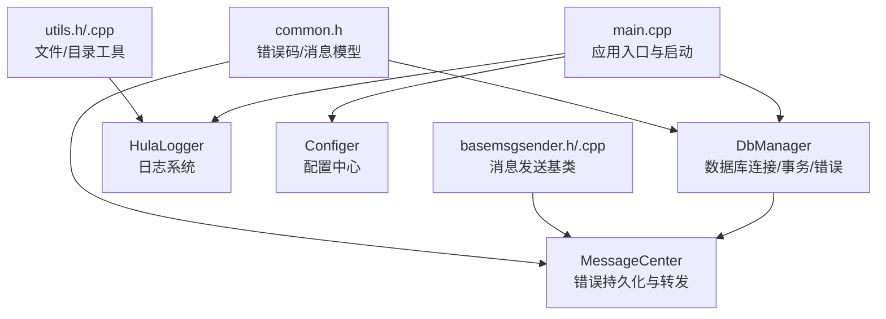
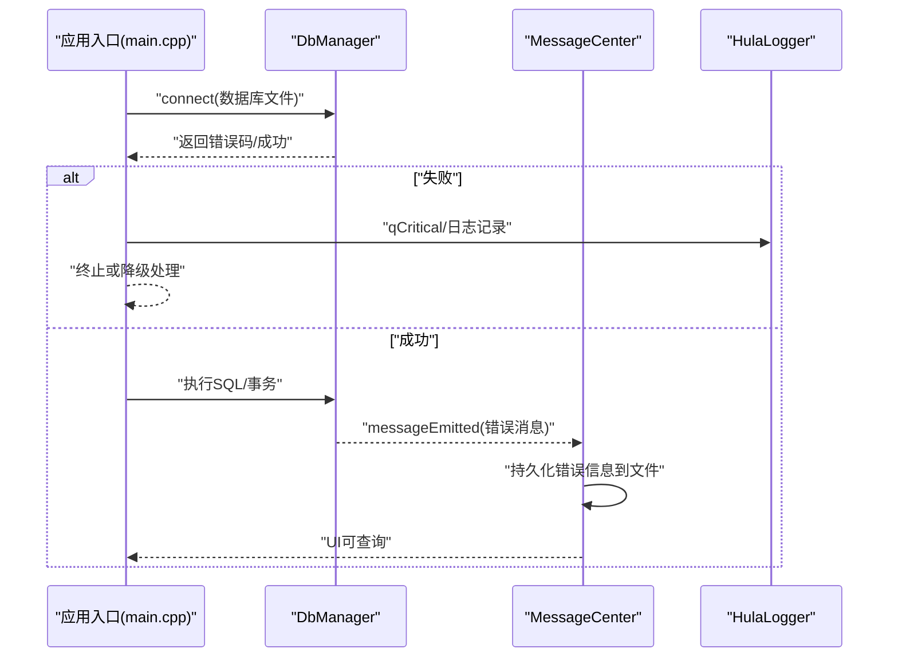
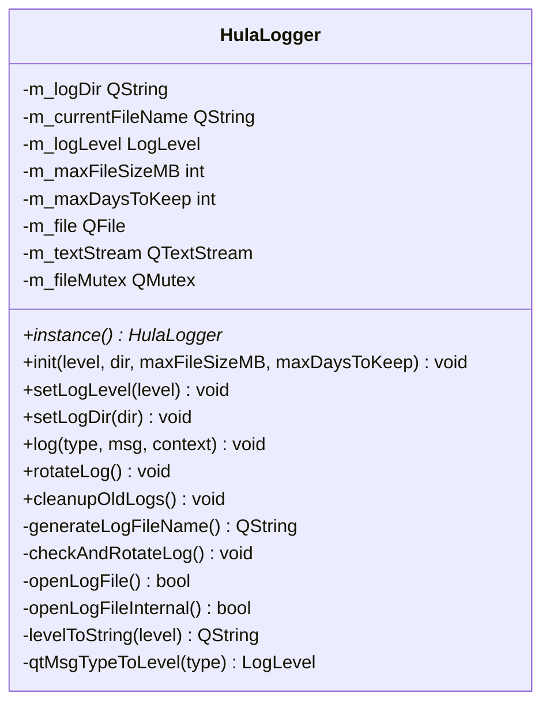
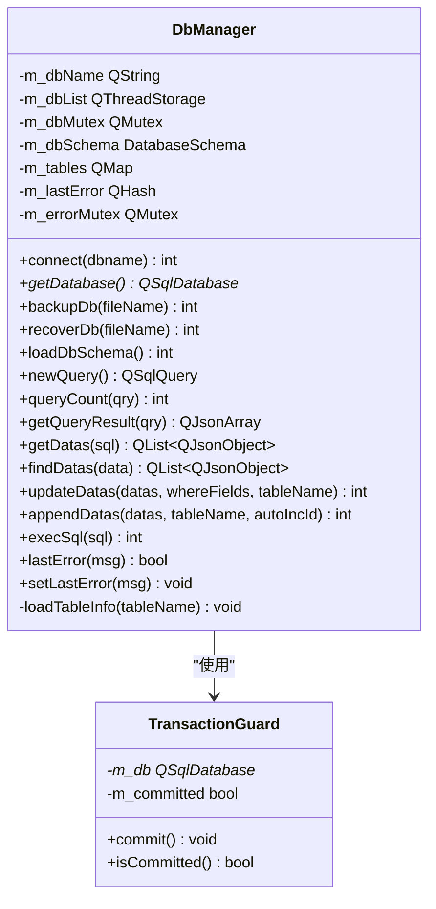
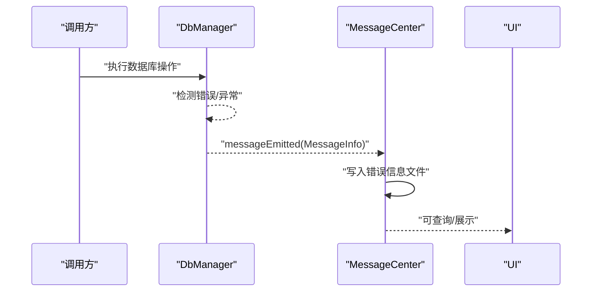
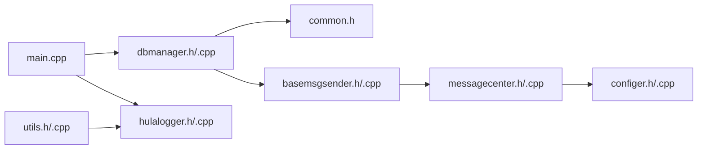

# 错误处理与异常管理

<cite>
**本文引用的文件**
- [main.cpp](file://src/main.cpp)
- [hulalogger.h](file://src/hulalogger.h)
- [hulalogger.cpp](file://src/hulalogger.cpp)
- [dbmanager.h](file://src/dbmanager.h)
- [dbmanager.cpp](file://src/dbmanager.cpp)
- [common.h](file://src/common.h)
- [basemsgsender.h](file://src/basemsgsender.h)
- [basemsgsender.cpp](file://src/basemsgsender.cpp)
- [messagecenter.h](file://src/messagecenter.h)
- [messagecenter.cpp](file://src/messagecenter.cpp)
- [configer.h](file://src/configer.h)
- [configer.cpp](file://src/configer.cpp)
- [utils.h](file://src/utils.h)
- [utils.cpp](file://src/utils.cpp)
</cite>

## 目录
1. [引言](#引言)
2. [项目结构](#项目结构)
3. [核心组件](#核心组件)
4. [架构总览](#架构总览)
5. [详细组件分析](#详细组件分析)
6. [依赖关系分析](#依赖关系分析)
7. [性能考量](#性能考量)
8. [故障排查指南](#故障排查指南)
9. [结论](#结论)
10. [附录](#附录)

## 引言
本指南聚焦于 QmlPlugins 项目的错误处理与异常管理实践，涵盖 C++ 异常安全与 Qt 特有的错误处理模式（返回值检查、信号槽错误处理、数据库错误处理）、日志系统使用、错误传播与恢复策略，并提供可操作的调试技巧与最佳实践。文档以代码为依据，结合架构图与流程图帮助读者快速理解并应用。

## 项目结构
项目采用分层与模块化组织方式：
- 应用入口与生命周期管理：main.cpp
- 日志系统：HulaLogger（单例、线程安全、轮转、级别控制）
- 数据库管理：DbManager（事务守卫、线程本地连接、错误码与消息）
- 错误模型：ErrorCode、MessageInfo、PromptType（统一错误码与提示类型）
- 消息中心：MessageCenter（持久化错误信息、UI 展示桥接）
- 配置中心：Configer（日志级别、语言、主题等配置）
- 工具类：Utils（文件/目录同步与复制，内部使用日志）

图表来源
- [main.cpp:17-99](file://src/main.cpp#L17-L99)
- [dbmanager.h:52-192](file://src/dbmanager.h#L52-L192)
- [hulalogger.h:49-175](file://src/hulalogger.h#L49-L175)
- [configer.h:98-277](file://src/configer.h#L98-L277)
- [basemsgsender.h:10-38](file://src/basemsgsender.h#L10-L38)
- [messagecenter.h:27-127](file://src/messagecenter.h#L27-L127)
- [common.h:50-159](file://src/common.h#L50-L159)
- [utils.h:21-82](file://src/utils.h#L21-L82)

章节来源
- [main.cpp:17-99](file://src/main.cpp#L17-L99)
- [hulalogger.h:49-175](file://src/hulalogger.h#L49-L175)
- [dbmanager.h:52-192](file://src/dbmanager.h#L52-L192)
- [common.h:50-159](file://src/common.h#L50-L159)
- [basemsgsender.h:10-38](file://src/basemsgsender.h#L10-L38)
- [messagecenter.h:27-127](file://src/messagecenter.h#L27-L127)
- [configer.h:98-277](file://src/configer.h#L98-L277)
- [utils.h:21-82](file://src/utils.h#L21-L82)

## 核心组件
- 错误码与消息模型
  - ErrorCode：统一错误码枚举，按模块域划分（参数、数据库、网络、文件、配置、业务、外部依赖）
  - MessageInfo：封装文本、错误码、提示类型
  - PromptType：提示策略（Toast/Log/Confirmation/Error）
- 日志系统 HulaLogger
  - 单例、线程安全、支持日志轮转（按大小/日期）、级别控制、自动清理过期日志
  - 兼容 Qt 消息系统，支持调试/发布模式不同格式
- 数据库管理 DbManager
  - 线程本地数据库连接、事务守卫（RAII 自动回滚）、错误码与消息持久化
  - 支持备份/恢复、Schema 加载、查询与批量操作
- 消息中心 MessageCenter
  - 将非成功错误码的消息持久化到 Ini 文件，供 UI 查询与展示
  - 通过信号槽与各模块解耦
- 基类 BaseMsgSender
  - 统一发出 messageEmitted 信号，便于集中接入消息中心
- 工具类 Utils
  - 文件/目录复制、同步、更新等操作均使用 HulaLogger 记录警告与信息

章节来源
- [common.h:50-159](file://src/common.h#L50-L159)
- [hulalogger.h:25-175](file://src/hulalogger.h#L25-L175)
- [hulalogger.cpp:45-331](file://src/hulalogger.cpp#L45-L331)
- [dbmanager.h:31-192](file://src/dbmanager.h#L31-L192)
- [dbmanager.cpp:51-824](file://src/dbmanager.cpp#L51-L824)
- [messagecenter.h:27-127](file://src/messagecenter.h#L27-L127)
- [messagecenter.cpp:27-118](file://src/messagecenter.cpp#L27-L118)
- [basemsgsender.h:10-38](file://src/basemsgsender.h#L10-L38)
- [basemsgsender.cpp:1-27](file://src/basemsgsender.cpp#L1-L27)
- [utils.cpp:27-408](file://src/utils.cpp#L27-L408)

## 架构总览
整体错误处理与异常管理遵循“返回值检查 + 信号槽 + 日志 + 消息中心”的 Qt 风格模式，配合 HulaLogger 的统一输出与持久化能力，形成闭环。

图表来源
- [main.cpp:46-50](file://src/main.cpp#L46-L50)
- [dbmanager.cpp:51-90](file://src/dbmanager.cpp#L51-L90)
- [dbmanager.cpp:784-793](file://src/dbmanager.cpp#L784-L793)
- [messagecenter.cpp:101-116](file://src/messagecenter.cpp#L101-L116)
- [hulalogger.cpp:118-172](file://src/hulalogger.cpp#L118-L172)

## 详细组件分析

### 日志系统 HulaLogger
- 单例与线程安全
  - 静态实例与互斥锁确保初始化与访问安全
  - 文件写入使用互斥锁，避免竞争
- 日志轮转与清理
  - 按大小与日期轮转；自动清理过期日志
- 级别控制与格式化
  - 可配置日志级别；调试/发布模式输出格式差异
- 与 Qt 消息系统集成
  - 安装消息处理器，拦截 Qt 日志并统一格式化输出

图表来源
- [hulalogger.h:49-175](file://src/hulalogger.h#L49-L175)
- [hulalogger.cpp:23-331](file://src/hulalogger.cpp#L23-L331)

章节来源
- [hulalogger.h:25-175](file://src/hulalogger.h#L25-L175)
- [hulalogger.cpp:45-331](file://src/hulalogger.cpp#L45-L331)

### 数据库管理 DbManager 与事务守卫
- 事务守卫 TransactionGuard
  - 构造开启事务，析构若未提交则自动回滚，显式 commit 提交
- 线程本地连接
  - 使用 QThreadStorage 为每个线程维护独立连接，避免跨线程共享数据库对象
- 错误处理
  - 统一设置 MessageInfo 并通过 messageEmitted 信号广播
  - lastError/ setLastError 提供线程内错误缓存与查询
- 备份/恢复
  - 失败时记录错误码与原因，必要时回滚并清理临时文件

图表来源
- [dbmanager.h:31-192](file://src/dbmanager.h#L31-L192)
- [dbmanager.cpp:14-40](file://src/dbmanager.cpp#L14-L40)

章节来源
- [dbmanager.h:31-192](file://src/dbmanager.h#L31-L192)
- [dbmanager.cpp:51-824](file://src/dbmanager.cpp#L51-L824)

### 错误模型与消息传播
- 错误码与消息
  - ErrorCode：模块化错误码域，便于定位问题域
  - MessageInfo：携带文本、错误码、提示类型
  - PromptType：控制 UI 展示策略（Toast/Confirmation/Error）
- 传播链路
  - DbManager 通过 setLastError 广播 messageEmitted
  - MessageCenter 接收并持久化错误信息
  - UI 可查询当日错误列表

图表来源
- [common.h:50-159](file://src/common.h#L50-L159)
- [dbmanager.cpp:784-793](file://src/dbmanager.cpp#L784-L793)
- [messagecenter.cpp:101-116](file://src/messagecenter.cpp#L101-L116)

章节来源
- [common.h:50-159](file://src/common.h#L50-L159)
- [basemsgsender.h:27-35](file://src/basemsgsender.h#L27-L35)
- [messagecenter.h:89-106](file://src/messagecenter.h#L89-L106)

### 工具类与日志集成
- Utils 在文件/目录复制、同步过程中使用 HulaLogger 记录警告与信息，确保问题可追溯
- 通过统一日志接口，避免重复实现日志逻辑

章节来源
- [utils.h:21-82](file://src/utils.h#L21-L82)
- [utils.cpp:27-408](file://src/utils.cpp#L27-L408)

## 依赖关系分析
- 应用入口依赖数据库与日志初始化，失败时终止并记录
- DbManager 依赖错误模型与消息发送基类，向外广播错误
- MessageCenter 依赖配置中心与数据库（读取错误信息），负责持久化
- HulaLogger 作为基础设施被广泛使用

图表来源
- [main.cpp:17-99](file://src/main.cpp#L17-L99)
- [dbmanager.h:52-192](file://src/dbmanager.h#L52-L192)
- [hulalogger.h:49-175](file://src/hulalogger.h#L49-L175)
- [common.h:50-159](file://src/common.h#L50-L159)
- [basemsgsender.h:10-38](file://src/basemsgsender.h#L10-L38)
- [messagecenter.h:27-127](file://src/messagecenter.h#L27-L127)
- [configer.h:98-277](file://src/configer.h#L98-L277)
- [utils.h:21-82](file://src/utils.h#L21-L82)

章节来源
- [main.cpp:17-99](file://src/main.cpp#L17-L99)
- [dbmanager.h:52-192](file://src/dbmanager.h#L52-L192)
- [hulalogger.h:49-175](file://src/hulalogger.h#L49-L175)
- [common.h:50-159](file://src/common.h#L50-L159)
- [basemsgsender.h:10-38](file://src/basemsgsender.h#L10-L38)
- [messagecenter.h:27-127](file://src/messagecenter.h#L27-L127)
- [configer.h:98-277](file://src/configer.h#L98-L277)
- [utils.h:21-82](file://src/utils.h#L21-L82)

## 性能考量
- 数据库并发与锁
  - WAL 模式与 busy_timeout 配置降低“database is locked”概率，提升并发写入稳定性
- 日志写入
  - 文件写入加锁，建议在高频日志场景下调低级别或减少冗余信息
- 线程本地连接
  - 避免跨线程共享数据库对象，减少锁竞争，提高吞吐

章节来源
- [dbmanager.cpp:74-85](file://src/dbmanager.cpp#L74-L85)
- [hulalogger.cpp:154-164](file://src/hulalogger.cpp#L154-L164)

## 故障排查指南
- 应用启动阶段
  - 数据库连接失败：检查文件路径与权限；查看 qCritical 输出与日志文件
  - 单实例检测：已有实例时直接退出，避免资源冲突
- 数据库操作失败
  - 使用 lastError 查询线程内错误；确认 SQL 语法与表结构；必要时回滚事务
  - 备份/恢复失败：检查源文件存在性与权限；回滚并清理临时文件
- 日志与消息
  - 确认日志级别与目录配置；查看错误信息文件（按日期分隔）；关注 UI 中的错误提示
- 文件/目录操作
  - 使用 Utils 的同步/复制接口，关注日志输出的警告信息，定位具体失败点

章节来源
- [main.cpp:46-50](file://src/main.cpp#L46-L50)
- [dbmanager.cpp:118-223](file://src/dbmanager.cpp#L118-L223)
- [dbmanager.cpp:769-793](file://src/dbmanager.cpp#L769-L793)
- [messagecenter.cpp:27-118](file://src/messagecenter.cpp#L27-L118)
- [utils.cpp:27-408](file://src/utils.cpp#L27-L408)

## 结论
QmlPlugins 采用 Qt 风格的错误处理范式：以返回值检查为主、信号槽传播为辅、日志与消息中心保障可观测性。DbManager 的事务守卫与线程本地连接提升了异常安全性与并发稳定性；HulaLogger 的统一日志与轮转机制为问题诊断提供了坚实基础。结合错误码与提示类型，系统实现了可控的错误传播与用户体验优化。

## 附录

### 错误码与提示类型速览
- 错误码域划分（节选）
  - 参数错误：InvalidParameter、ParameterMissing、ParameterOutOfRange、InvalidFormat
  - 数据库错误：DbOpenFailed、DbBackupFailed、DbRecoverFailed、DbExecuteFailed、DbConnectionLost、DbTableNotFound、DbRecordNotFound、DbDuplicateKey
  - 文件操作：FileNotFound、FileReadFailed、FileWriteFailed、FilePermissionDenied、FileExists、FileSizeExceeded
  - 配置模块：ConfigNotFound、ConfigParseFailed、ConfigInvalid
  - 业务逻辑：BusinessError、InvalidState、OperationNotAllowed、ResourceBusy、QuotaExceeded
  - 外部依赖：ExternalServiceError、AuthenticationFailed、AuthorizationFailed、RateLimitExceeded
- 提示类型
  - Toast：轻量提示，自动消失
  - Log：仅记录，不弹窗
  - Confirmation：确认并记录（模态对话框）
  - Error：错误并记录（模态对话框）

章节来源
- [common.h:63-117](file://src/common.h#L63-L117)
- [common.h:26-31](file://src/common.h#L26-L31)