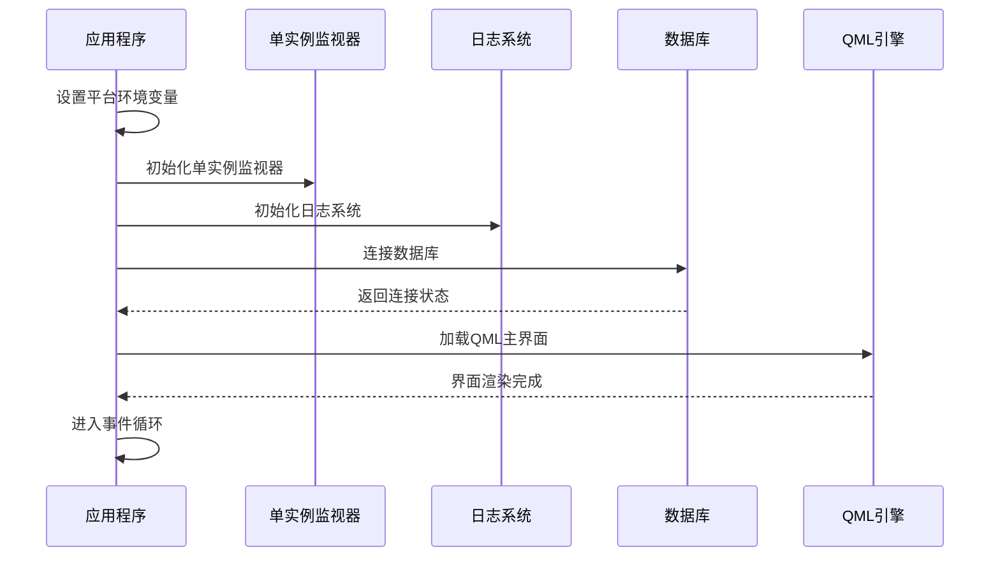
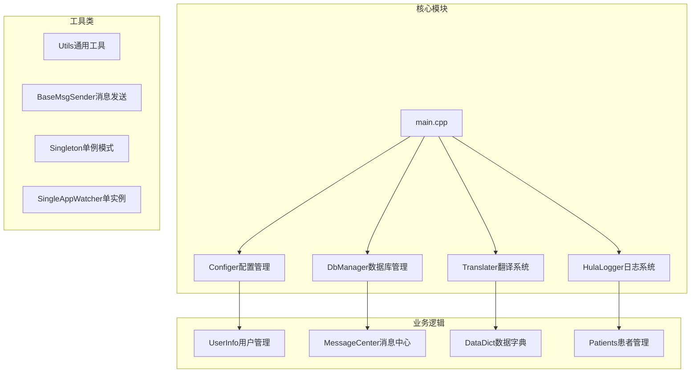
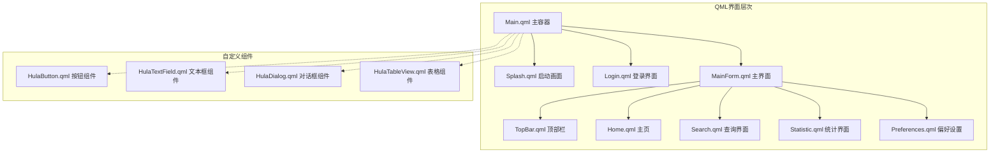
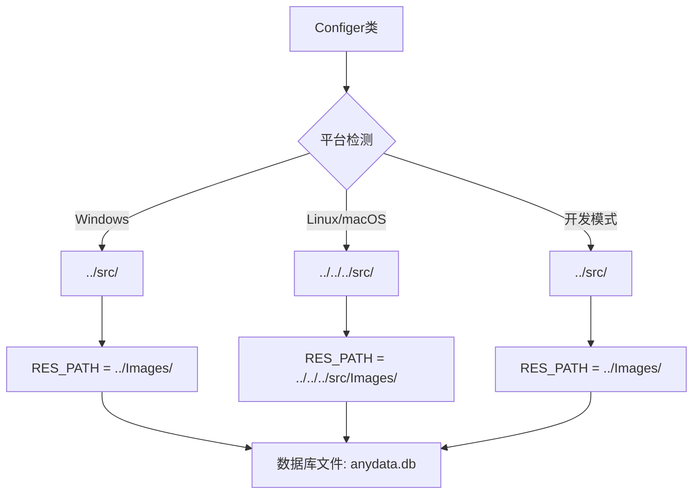
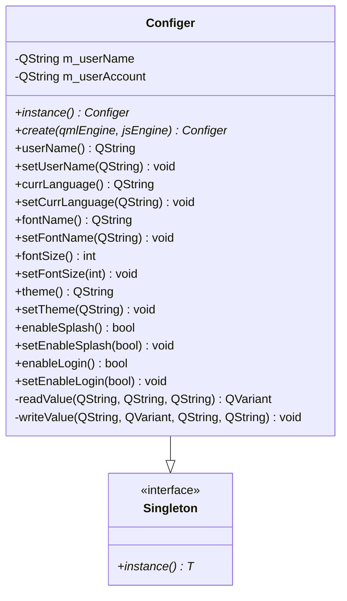
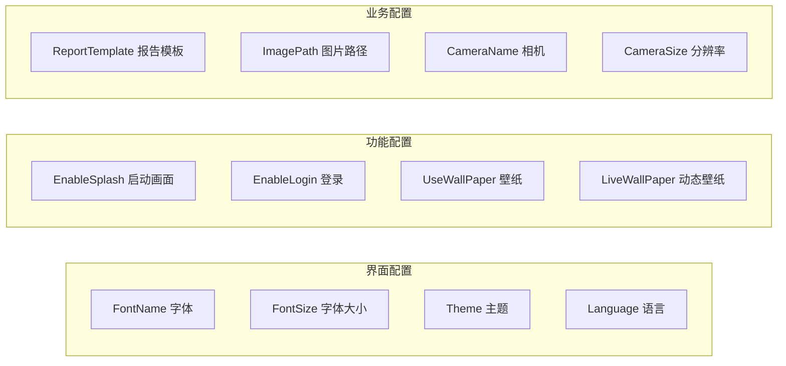
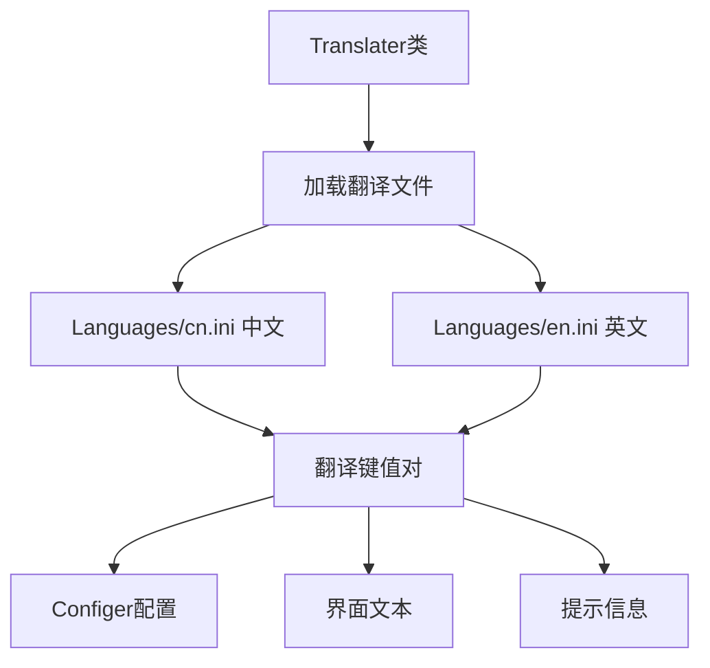
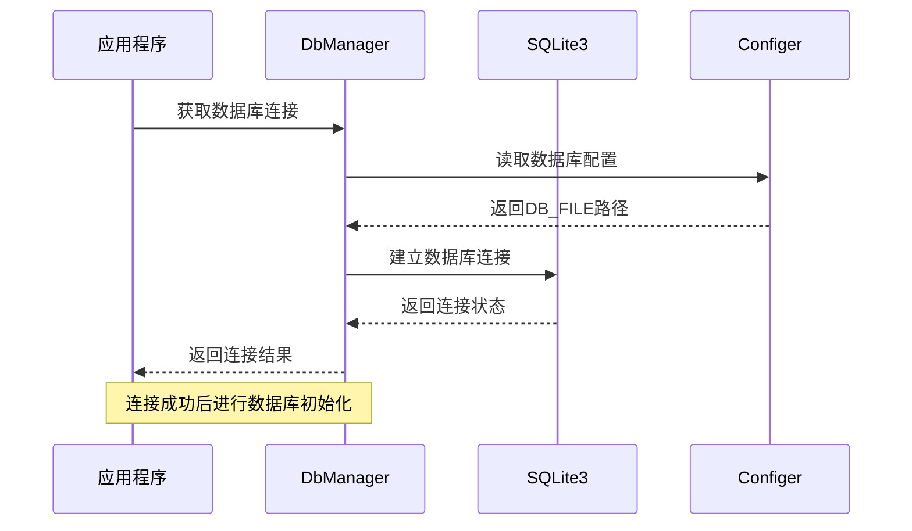
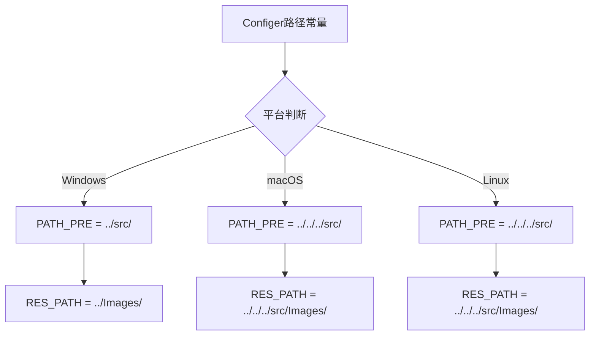

# QmlPlugins项目快速开始指南

<cite>
**本文档引用的文件**
- [README.md](file://README.md)
- [CMakeLists.txt](file://CMakeLists.txt)
- [main.cpp](file://src/main.cpp)
- [Config.ini](file://src/Config.ini)
- [configer.h](file://src/configer.h)
- [configer.cpp](file://src/configer.cpp)
- [resources/Config.ini](file://resources/Config.ini)
- [resources/Languages/cn.ini](file://resources/Languages/cn.ini)
- [resources/Languages/en.ini](file://resources/Languages/en.ini)
- [src/QmlUI/Main.qml](file://src/QmlUI/Main.qml)
- [src/QmlUI/paint.js](file://src/QmlUI/paint.js)
</cite>

## 目录
1. [项目简介](#项目简介)
2. [系统要求](#系统要求)
3. [开发环境搭建](#开发环境搭建)
4. [项目克隆与配置](#项目克隆与配置)
5. [构建与编译](#构建与编译)
6. [运行应用程序](#运行应用程序)
7. [项目结构详解](#项目结构详解)
8. [核心功能模块](#核心功能模块)
9. [跨平台配置](#跨平台配置)
10. [常见问题解决](#常见问题解决)
11. [故障排除指南](#故障排除指南)
12. [总结](#总结)

## 项目简介

QmlPlugins是一个基于Qt6/QML的跨平台医疗报告管理系统。该项目采用现代化的Qt6框架和QML技术栈，提供了完整的医疗报告管理解决方案，包括多语言支持、主题切换、SQLite数据库管理、报告模板管理等功能特性。

### 主要功能特性
- ✅ 多语言支持（中文/英文）
- ✅ 主题切换（深色/浅色/蓝色）
- ✅ SQLite数据库管理
- ✅ 报告模板管理
- ✅ 相机图像采集
- ✅ 用户权限管理
- ✅ 数据字典管理

## 系统要求

在开始开发之前，请确保您的系统满足以下最低要求：

### 基础要求
- **Qt 6.7+** - Qt应用程序框架
- **CMake 3.16+** - 跨平台构建系统
- **C++20 编译器** - 现代C++支持
- **SQLite3** - 数据库引擎

### 推荐配置
- **操作系统**: Windows 10/11, Ubuntu 20.04+, macOS 10.15+
- **内存**: 至少4GB RAM
- **存储空间**: 至少2GB可用空间
- **开发工具**: Visual Studio Code或Qt Creator

## 开发环境搭建

### Windows环境搭建

#### 1. 安装Visual Studio Build Tools
```bash
# 下载并安装Visual Studio Community 2022
# 确保勾选"C++构建工具"工作负载
```

#### 2. 安装Qt 6.7.3
```bash
# 从Qt官网下载Qt 6.7.3
# 选择"自定义安装"
# 确保安装以下组件：
# - MinGW 11.2.6 64-bit (或MSVC 2019 64-bit)
# - Qt 6.7.3
# - Qt Creator
# - CMake Tools
```

#### 3. 安装CMake
```bash
# 从cmake.org下载最新版本
# 选择"Add to PATH"选项
```

#### 4. 验证安装
```cmd
# 打开命令提示符验证安装
qmake --version
cmake --version
gcc --version
```

### Linux环境搭建

#### 1. Ubuntu/Debian系统
```bash
# 更新包列表
sudo apt update

# 安装基础开发工具
sudo apt install build-essential cmake git

# 安装Qt 6.7.3相关包
sudo apt install qt6-base-dev qt6-base-dev-tools \
    qt6-declarative-dev qt6-declarative-dev-tools \
    qt6-sql-dev qt6-sql-sqlite \
    qt6-quickcontrols2-dev

# 安装SQLite开发包
sudo apt install libsqlite3-dev

# 安装CMake
sudo apt install cmake
```

#### 2. CentOS/RHEL/Fedora系统
```bash
# Fedora系统
sudo dnf install gcc gcc-c++ cmake git

# 安装Qt 6.7.3
sudo dnf install qt6-qtbase-devel \
    qt6-qtdeclarative-devel \
    qt6-qtquickcontrols2-devel \
    qt6-qtsql-devel sqlite-devel

# 安装CMake
sudo dnf install cmake
```

#### 3. 验证安装
```bash
# 验证安装
qmake-qt6 --version
cmake --version
g++ --version
```

### macOS环境搭建

#### 1. 安装Xcode Command Line Tools
```bash
# 安装Xcode命令行工具
xcode-select --install
```

#### 2. 使用Homebrew安装依赖
```bash
# 安装Homebrew (如果尚未安装)
/bin/bash -c "$(curl -fsSL https://raw.githubusercontent.com/Homebrew/install/HEAD/install.sh)"

# 安装Qt 6.7.3
brew install qt@6.7

# 安装CMake
brew install cmake

# 安装SQLite
brew install sqlite3
```

#### 3. 验证安装
```bash
# 验证安装
qmake -v
cmake --version
clang++ --version
```

## 项目克隆与配置

### 1. 克隆项目
```bash
# 使用Git克隆项目
git clone https://github.com/your-repository/QmlPlugins.git
cd QmlPlugins
```

### 2. 项目目录结构
```
QmlPlugins/
├── src/                    # 源代码目录
│   ├── QmlUI/             # QML界面文件
│   ├── HulaUI/            # 自定义QML组件
│   ├── Images/            # 图片资源
│   ├── Languages/         # 翻译文件
│   └── *.cpp/.h           # C++源文件
├── bin/                   # 运行时目录
├── resources/             # 资源文件
├── CMakeLists.txt         # 构建配置文件
└── README.md              # 项目文档
```

### 3. 配置文件说明

#### 主配置文件 (resources/Config.ini)
```ini
[default]
EnableLog=1
FontName=Microsoft YaHei
FontSize=18
Language=简体中文
Theme=HulaTheme
EnableSplash=1
EnableLogin=0
UseWallPaper=1
LiveWallPaper=1
```

#### 应用程序入口配置 (src/Config.ini)
```ini
[default]
EnableLog-1=程序运行日志:1, 0
EnableLog=1
FontName=Microsoft YaHei
FontSize=11
Language=简体中文
Theme=Theme
```

## 构建与编译

### 1. 创建构建目录
```bash
# 创建独立的构建目录
mkdir build && cd build
```

### 2. 配置构建系统
```bash
# Release模式构建
cmake .. -DCMAKE_BUILD_TYPE=Release

# Debug模式构建
cmake .. -DCMAKE_BUILD_TYPE=Debug

# 指定Qt安装路径 (Windows)
cmake .. -DCMAKE_PREFIX_PATH="C:/Qt/6.7.3/msvc2019_64"
```

### 3. 执行编译
```bash
# 使用所有CPU核心并行编译
cmake --build . --parallel

# 指定并行任务数
cmake --build . --parallel 4

# 指定编译目标
cmake --build . --target QmlPlugins
```

### 4. 构建选项详解

#### CMake配置选项
```cmake
# 最小CMake版本要求
cmake_minimum_required(VERSION 3.16)

# 项目设置
project(QmlPlugins VERSION 1.0.0 LANGUAGES CXX)

# C++标准设置
set(CMAKE_CXX_STANDARD 20)
set(CMAKE_CXX_STANDARD_REQUIRED ON)

# 输出目录配置
set(CMAKE_RUNTIME_OUTPUT_DIRECTORY ${CMAKE_BINARY_DIR}/../../bin)
set(CMAKE_LIBRARY_OUTPUT_DIRECTORY ${CMAKE_BINARY_DIR}/../../bin)
set(CMAKE_ARCHIVE_OUTPUT_DIRECTORY ${CMAKE_BINARY_DIR}/../../lib)
```

## 运行应用程序

### 1. 启动应用程序
```bash
# Windows
.\bin\QmlPlugins.exe

# Linux/macOS
./bin/QmlPlugins
```

### 2. 命令行参数
```bash
# 基本启动
./bin/QmlPlugins

# 指定配置文件
./bin/QmlPlugins --config=custom.ini

# 调试模式
./bin/QmlPlugins --debug
```

### 3. 应用程序启动流程

#### 主程序初始化


**图表来源**
- [main.cpp:17-99](file://src/main.cpp#L17-L99)

## 项目结构详解

### 1. 源代码组织

#### C++核心模块


**图表来源**
- [CMakeLists.txt:29-53](file://CMakeLists.txt#L29-L53)
- [main.cpp:17-14](file://src/main.cpp#L17-L14)

#### QML界面架构


**图表来源**
- [src/QmlUI/Main.qml:1-41](file://src/QmlUI/Main.qml#L1-L41)

### 2. 资源文件管理

#### 资源目录结构
```
resources/
├── Images/           # 图片资源
├── Languages/        # 翻译文件
├── Splash/          # 启动画面
├── wallpaper/       # 壁纸资源
└── Config.ini       # 应用配置
```

#### 配置文件路径映射


**图表来源**
- [configer.h:35-75](file://src/configer.h#L35-L75)

## 核心功能模块

### 1. 配置管理系统

#### Configer类架构


**图表来源**
- [configer.h:98-277](file://src/configer.h#L98-L277)

#### 配置项分类


**图表来源**
- [configer.cpp:42-251](file://src/configer.cpp#L42-L251)

### 2. 多语言支持系统

#### 翻译文件结构


**图表来源**
- [resources/Languages/cn.ini:1-300](file://resources/Languages/cn.ini#L1-L300)
- [resources/Languages/en.ini:1-298](file://resources/Languages/en.ini#L1-L298)

### 3. 数据库管理系统

#### 数据库连接流程


**图表来源**
- [main.cpp:46-50](file://src/main.cpp#L46-L50)

## 跨平台配置

### 1. 平台特定设置

#### Windows平台配置
```cmake
if(WIN32)
    # 设置Win32 GUI应用程序
    set_target_properties(${APP_NAME} PROPERTIES
        WIN32_EXECUTABLE TRUE
    )
    # 添加Windows资源文件
    target_sources(${APP_NAME} PRIVATE src/ico.rc)
endif()
```

#### Linux平台配置
```cmake
if(UNIX AND NOT APPLE)
    # 修复Qt 6.7+的_Float16问题
    target_compile_options(${APP_NAME} PRIVATE
        -DQT_NO_FLOAT16_OPERATORS
    )
endif()
```

#### macOS平台配置
```cmake
if(APPLE)
    # 设置Bundle应用程序
    set_target_properties(${APP_NAME} PROPERTIES
        MACOSX_BUNDLE_BUNDLE_VERSION "1.0"
        MACOSX_BUNDLE_SHORT_VERSION_STRING "1.0"
        MACOSX_BUNDLE TRUE
    )
endif()
```

### 2. 平台兼容性处理

#### 窗口系统适配
```cpp
// 强制使用XCB协议解决Wayland问题
qputenv("QT_QPA_PLATFORM", "xcb");
```

#### 路径处理差异


**图表来源**
- [configer.h:35-41](file://src/configer.h#L35-L41)

## 常见问题解决

### 1. Qt安装问题

#### 问题: 找不到Qt组件
```bash
# 解决方案: 指定Qt安装路径
cmake .. -DCMAKE_PREFIX_PATH="C:/Qt/6.7.3/mingw_64"

# 或者设置环境变量
export CMAKE_PREFIX_PATH="/usr/local/Qt/6.7.3/gcc_64"
```

#### 问题: CMake找不到Qt
```bash
# 解决方案: 使用Qt提供的CMake工具
/usr/local/Qt/6.7.3/gcc_64/bin/cmake ..

# 或者配置Qt Creator的CMake工具
```

### 2. 编译错误

#### 问题: C++标准不兼容
```bash
# 解决方案: 确保使用C++20编译器
# Visual Studio: 项目属性 -> C/C++ -> 语言 -> C++标准设为C++20
# GCC: 添加 -std=c++20 编译选项
```

#### 问题: SQLite库未找到
```bash
# Linux解决方案
sudo apt install libsqlite3-dev

# macOS解决方案
brew install sqlite3

# Windows解决方案
# 确保SQLite3.dll在PATH中
```

### 3. 运行时问题

#### 问题: 应用程序无法启动
```bash
# 调试启动
./bin/QmlPlugins --verbose

# 检查依赖库
ldd ./bin/QmlPlugins  # Linux
otool -L ./bin/QmlPlugins  # macOS
```

#### 问题: 界面显示异常
```cpp
// 检查字体配置
qDebug() << "Current font:" << app.font().family();
qDebug() << "Font size:" << app.font().pixelSize();

// 检查语言配置
qDebug() << "Current language:" << Configer::instance()->currLanguage();
```

## 故障排除指南

### 1. 构建阶段故障

#### CMake配置失败
```bash
# 清理构建缓存
rm -rf build/*
# 重新配置
cd build && cmake .. -DCMAKE_BUILD_TYPE=Release
```

#### 依赖库缺失
```bash
# 检查Qt组件
qmake-qt6 -query QT_INSTALL_LIBS

# 检查CMake模块
cmake --debug-output
```

### 2. 运行时故障

#### 数据库连接失败
```cpp
// 检查数据库文件路径
qDebug() << "DB file path:" << DB_FILE;
qDebug() << "DB file exists:" << QFile::exists(DB_FILE);

// 检查数据库权限
QFileInfo info(DB_FILE);
qDebug() << "DB permissions:" << info.permissions();
```

#### QML加载失败
```cpp
// 启用QML调试
qputenv("QT_QUICK_LOGGING", "1");

// 检查QML模块注册
qDebug() << "QML module loaded:" << QQmlApplicationEngine::isModuleAvailable("QmlPlugins");
```

### 3. 调试技巧

#### 启用详细日志
```cpp
// 在main.cpp中添加
qputenv("QT_LOGGING_RULES", "qt.qml.loading=true");
qputenv("QT_LOGGING_RULES", "qt.qml.runtime=true");
```

#### 内存泄漏检测
```bash
# 使用Valgrind (Linux)
valgrind --tool=memcheck --leak-check=full ./bin/QmlPlugins

# 使用AddressSanitizer
export ASAN_OPTIONS=detect_leaks=1
./bin/QmlPlugins
```

## 总结

QmlPlugins项目为初学者提供了一个完整的跨平台应用程序开发示例。通过遵循本指南，您应该能够：

### 已完成的任务
- ✅ 成功安装和配置Qt 6.7.3开发环境
- ✅ 完成项目克隆和基本配置
- ✅ 成功构建和编译项目
- ✅ 成功运行应用程序
- ✅ 理解项目架构和核心组件

### 下一步建议
1. **探索源代码**: 深入学习Configer类的设计模式
2. **自定义界面**: 修改QML组件以适应您的需求
3. **扩展功能**: 添加新的业务逻辑模块
4. **测试驱动**: 编写单元测试和集成测试
5. **部署优化**: 配置应用程序打包和分发

### 学习资源
- Qt官方文档: https://doc.qt.io/
- CMake官方文档: https://cmake.org/documentation/
- QML教程: https://doc.qt.io/qt-6/qml-tutorial.html

祝您开发顺利！如有任何问题，请随时查阅项目文档或寻求社区帮助。