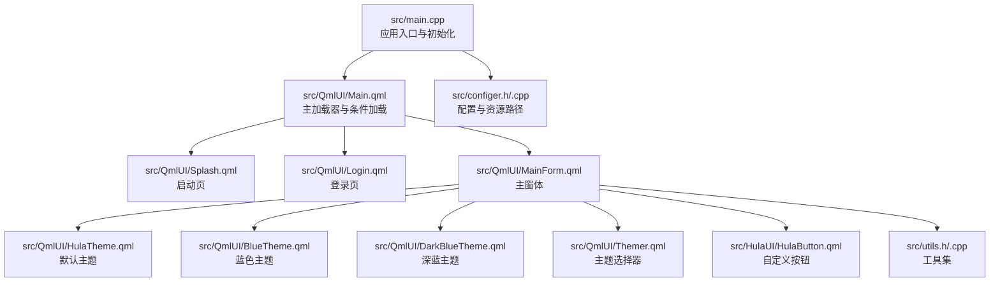
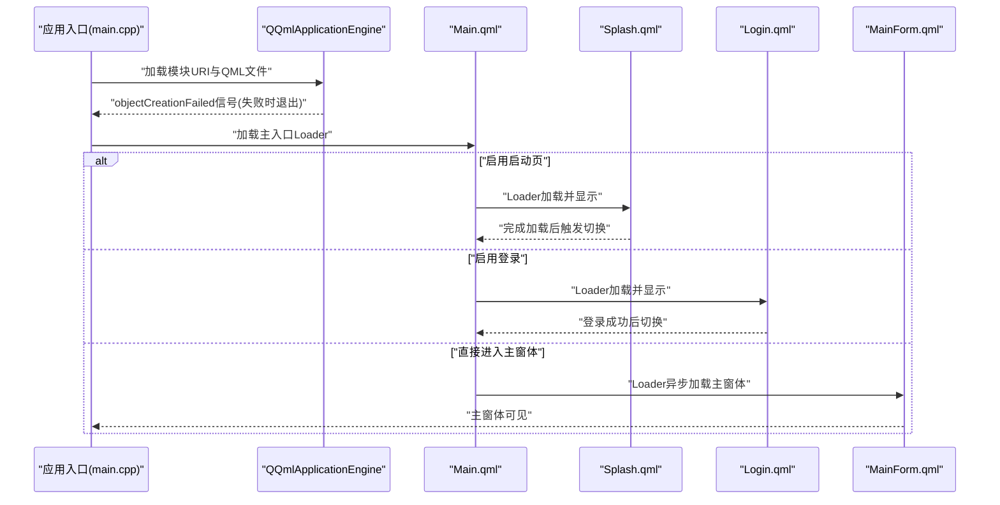
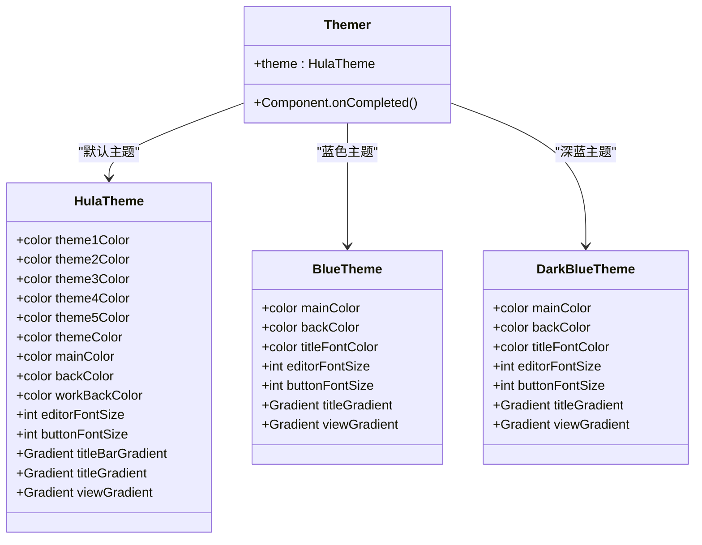
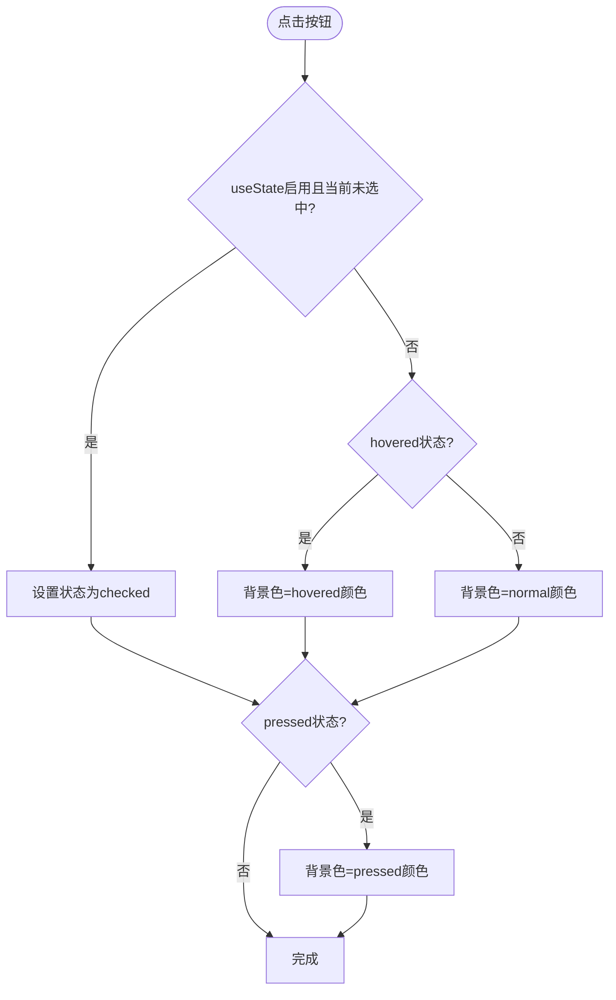
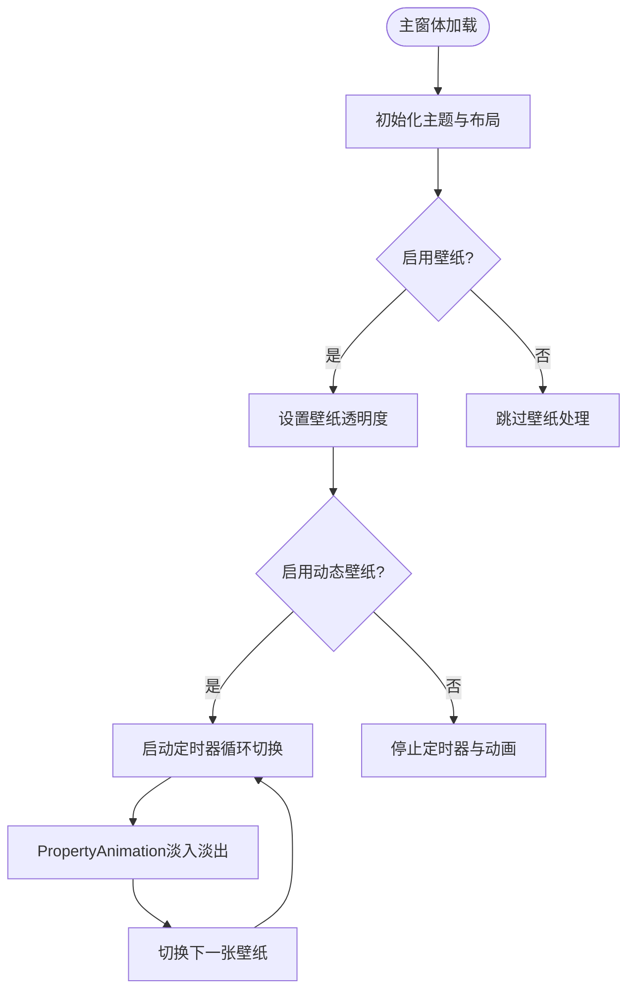
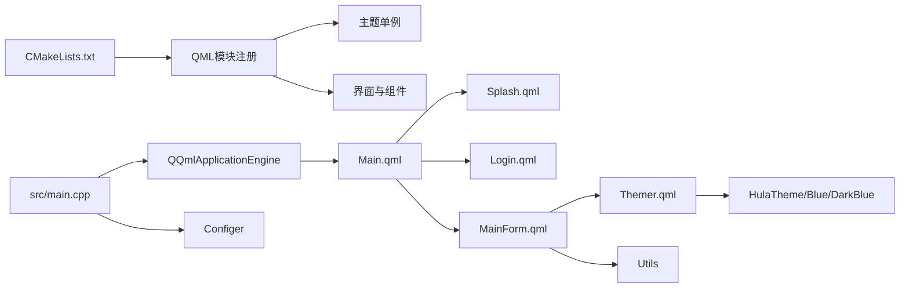

# UI渲染问题

<cite>
**本文引用的文件**
- [src/main.cpp](file://src/main.cpp)
- [CMakeLists.txt](file://CMakeLists.txt)
- [README.md](file://README.md)
- [src/QmlUI/Main.qml](file://src/QmlUI/Main.qml)
- [src/QmlUI/MainForm.qml](file://src/QmlUI/MainForm.qml)
- [src/QmlUI/Splash.qml](file://src/QmlUI/Splash.qml)
- [src/QmlUI/HulaTheme.qml](file://src/QmlUI/HulaTheme.qml)
- [src/QmlUI/Themer.qml](file://src/QmlUI/Themer.qml)
- [src/QmlUI/DarkBlueTheme.qml](file://src/QmlUI/DarkBlueTheme.qml)
- [src/QmlUI/BlueTheme.qml](file://src/QmlUI/BlueTheme.qml)
- [src/HulaUI/HulaButton.qml](file://src/HulaUI/HulaButton.qml)
- [src/configer.h](file://src/configer.h)
- [src/configer.cpp](file://src/configer.cpp)
- [src/utils.h](file://src/utils.h)
- [src/utils.cpp](file://src/utils.cpp)
</cite>

## 目录
1. [简介](#简介)
2. [项目结构](#项目结构)
3. [核心组件](#核心组件)
4. [架构总览](#架构总览)
5. [详细组件分析](#详细组件分析)
6. [依赖关系分析](#依赖关系分析)
7. [性能考量](#性能考量)
8. [故障排除指南](#故障排除指南)
9. [结论](#结论)
10. [附录](#附录)

## 简介
本指南聚焦于QmlPlugins项目的UI渲染问题，覆盖QML组件渲染异常、主题切换失效、字体显示问题、布局错乱、Qt Quick渲染管道问题、资源加载失败、样式冲突与动画异常等常见问题的诊断与解决方法，并提供跨平台UI兼容性建议与调试工具使用要点。

## 项目结构
该项目采用Qt6/QML技术栈，采用模块化组织方式：
- C++入口负责应用初始化、字体设置、多语言、数据库连接与引擎加载
- QML模块包含界面层与自定义组件层
- 主题系统通过单例主题对象与主题选择器统一管理
- 资源路径与配置项由配置器集中提供

图表来源
- [src/main.cpp:17-99](file://src/main.cpp#L17-L99)
- [src/QmlUI/Main.qml:1-41](file://src/QmlUI/Main.qml#L1-L41)
- [src/QmlUI/MainForm.qml:1-488](file://src/QmlUI/MainForm.qml#L1-L488)
- [src/QmlUI/Splash.qml:1-156](file://src/QmlUI/Splash.qml#L1-L156)
- [src/QmlUI/HulaTheme.qml:1-85](file://src/QmlUI/HulaTheme.qml#L1-L85)
- [src/QmlUI/BlueTheme.qml:1-72](file://src/QmlUI/BlueTheme.qml#L1-L72)
- [src/QmlUI/DarkBlueTheme.qml:1-82](file://src/QmlUI/DarkBlueTheme.qml#L1-L82)
- [src/QmlUI/Themer.qml:1-26](file://src/QmlUI/Themer.qml#L1-L26)
- [src/HulaUI/HulaButton.qml:1-81](file://src/HulaUI/HulaButton.qml#L1-L81)
- [src/configer.h:1-277](file://src/configer.h#L1-L277)
- [src/configer.cpp:1-421](file://src/configer.cpp#L1-L421)
- [src/utils.h:1-82](file://src/utils.h#L1-L82)
- [src/utils.cpp:1-408](file://src/utils.cpp#L1-L408)

章节来源
- [README.md:1-50](file://README.md#L1-L50)
- [CMakeLists.txt:1-137](file://CMakeLists.txt#L1-L137)

## 核心组件
- 应用入口与初始化：设置平台环境变量、单实例检测、日志初始化、字体设置、多语言、数据库连接、引擎加载与事件处理
- 主加载器：根据配置决定加载启动页、登录页或主窗体
- 主窗体：框架布局、主题绑定、壁纸与动画、消息提示、定时器与日期时间显示
- 主题系统：默认主题、蓝色主题、深蓝主题与主题选择器
- 自定义组件：自定义按钮，支持图标、文本、悬停与选中态
- 配置系统：提供字体、字号、主题、壁纸、登录/启动页开关等配置项
- 工具集：目录遍历、文件同步与更新等

章节来源
- [src/main.cpp:17-99](file://src/main.cpp#L17-L99)
- [src/QmlUI/Main.qml:1-41](file://src/QmlUI/Main.qml#L1-L41)
- [src/QmlUI/MainForm.qml:1-488](file://src/QmlUI/MainForm.qml#L1-L488)
- [src/QmlUI/HulaTheme.qml:1-85](file://src/QmlUI/HulaTheme.qml#L1-L85)
- [src/QmlUI/Themer.qml:1-26](file://src/QmlUI/Themer.qml#L1-L26)
- [src/QmlUI/DarkBlueTheme.qml:1-82](file://src/QmlUI/DarkBlueTheme.qml#L1-L82)
- [src/QmlUI/BlueTheme.qml:1-72](file://src/QmlUI/BlueTheme.qml#L1-L72)
- [src/HulaUI/HulaButton.qml:1-81](file://src/HulaUI/HulaButton.qml#L1-L81)
- [src/configer.h:98-277](file://src/configer.h#L98-L277)
- [src/configer.cpp:42-421](file://src/configer.cpp#L42-L421)
- [src/utils.h:21-82](file://src/utils.h#L21-L82)
- [src/utils.cpp:12-408](file://src/utils.cpp#L12-L408)

## 架构总览
应用启动流程与UI渲染的关键路径如下：

图表来源
- [src/main.cpp:93-99](file://src/main.cpp#L93-L99)
- [src/QmlUI/Main.qml:14-40](file://src/QmlUI/Main.qml#L14-L40)
- [src/QmlUI/Splash.qml:46-58](file://src/QmlUI/Splash.qml#L46-L58)

章节来源
- [src/main.cpp:17-99](file://src/main.cpp#L17-L99)
- [src/QmlUI/Main.qml:1-41](file://src/QmlUI/Main.qml#L1-L41)
- [src/QmlUI/Splash.qml:1-156](file://src/QmlUI/Splash.qml#L1-L156)

## 详细组件分析

### 主题系统与主题切换
主题系统通过单例主题对象与主题选择器实现：
- 主题对象：提供颜色、渐变、字体大小等属性
- 主题选择器：根据配置选择具体主题
- 主窗体：绑定主题对象的颜色与渐变

图表来源
- [src/QmlUI/HulaTheme.qml:1-85](file://src/QmlUI/HulaTheme.qml#L1-L85)
- [src/QmlUI/BlueTheme.qml:1-72](file://src/QmlUI/BlueTheme.qml#L1-L72)
- [src/QmlUI/DarkBlueTheme.qml:1-82](file://src/QmlUI/DarkBlueTheme.qml#L1-L82)
- [src/QmlUI/Themer.qml:14-24](file://src/QmlUI/Themer.qml#L14-L24)

章节来源
- [src/QmlUI/HulaTheme.qml:1-85](file://src/QmlUI/HulaTheme.qml#L1-L85)
- [src/QmlUI/BlueTheme.qml:1-72](file://src/QmlUI/BlueTheme.qml#L1-L72)
- [src/QmlUI/DarkBlueTheme.qml:1-82](file://src/QmlUI/DarkBlueTheme.qml#L1-L82)
- [src/QmlUI/Themer.qml:1-26](file://src/QmlUI/Themer.qml#L1-L26)
- [src/configer.h:82-90](file://src/configer.h#L82-L90)

### 自定义按钮组件
自定义按钮支持图标、文本、悬停与选中态，状态切换影响背景色与图标透明度。

图表来源
- [src/HulaUI/HulaButton.qml:23-40](file://src/HulaUI/HulaButton.qml#L23-L40)
- [src/HulaUI/HulaButton.qml:42-69](file://src/HulaUI/HulaButton.qml#L42-L69)
- [src/HulaUI/HulaButton.qml:75-80](file://src/HulaUI/HulaButton.qml#L75-L80)

章节来源
- [src/HulaUI/HulaButton.qml:1-81](file://src/HulaUI/HulaButton.qml#L1-L81)

### 主窗体布局与壁纸动画
主窗体采用左右分区布局，左侧导航区域使用主题渐变；壁纸支持动态切换与淡入淡出动画。

图表来源
- [src/QmlUI/MainForm.qml:110-111](file://src/QmlUI/MainForm.qml#L110-L111)
- [src/QmlUI/MainForm.qml:266-323](file://src/QmlUI/MainForm.qml#L266-L323)
- [src/QmlUI/MainForm.qml:332-342](file://src/QmlUI/MainForm.qml#L332-L342)

章节来源
- [src/QmlUI/MainForm.qml:1-488](file://src/QmlUI/MainForm.qml#L1-L488)

## 依赖关系分析
- CMake构建脚本将QML源文件纳入模块，注册单例主题文件，链接Quick、Sql与QuickControls2
- 应用入口通过引擎加载模块URI与主入口，错误时退出
- 主窗体依赖主题系统与工具集，主题选择器依赖配置器

图表来源
- [CMakeLists.txt:79-93](file://CMakeLists.txt#L79-L93)
- [src/main.cpp:93-99](file://src/main.cpp#L93-L99)
- [src/QmlUI/Main.qml:14-40](file://src/QmlUI/Main.qml#L14-L40)
- [src/QmlUI/MainForm.qml:110-111](file://src/QmlUI/MainForm.qml#L110-L111)
- [src/QmlUI/Themer.qml:16-24](file://src/QmlUI/Themer.qml#L16-L24)
- [src/configer.h:108-120](file://src/configer.h#L108-L120)

章节来源
- [CMakeLists.txt:1-137](file://CMakeLists.txt#L1-L137)
- [src/main.cpp:17-99](file://src/main.cpp#L17-L99)
- [src/QmlUI/Main.qml:1-41](file://src/QmlUI/Main.qml#L1-L41)
- [src/QmlUI/MainForm.qml:1-488](file://src/QmlUI/MainForm.qml#L1-L488)
- [src/QmlUI/Themer.qml:1-26](file://src/QmlUI/Themer.qml#L1-L26)
- [src/configer.h:98-120](file://src/configer.h#L98-L120)

## 性能考量
- 异步加载：主窗体Loader启用异步加载以提升启动速度
- 动画优化：壁纸切换使用PropertyAnimation与定时器，避免阻塞主线程
- 资源路径：统一通过配置器与相对路径访问资源，减少硬编码
- 渲染管线：使用渐变与平滑填充，注意在低端设备上的性能表现

章节来源
- [src/QmlUI/Main.qml:32-39](file://src/QmlUI/Main.qml#L32-L39)
- [src/QmlUI/MainForm.qml:274-323](file://src/QmlUI/MainForm.qml#L274-L323)
- [src/configer.h:55-71](file://src/configer.h#L55-L71)

## 故障排除指南

### 一、QML组件渲染异常
常见症状
- 组件不显示、尺寸异常、颜色不生效
- 图标不显示或拉伸失真
- 文本不显示或截断

排查步骤
- 检查组件层级与z序：确认父容器与子元素的anchors与布局关系
- 检查资源路径：确保图标与图片路径正确，使用file:协议与相对路径
- 检查字体与字号：确认全局字体设置与组件字体像素大小
- 检查主题绑定：确认主题颜色与渐变是否正确绑定到组件

定位参考
- 组件背景与图标：查看自定义按钮的background与Image节点
- 图标路径：检查按钮与Logo的source属性
- 字体设置：查看应用入口对QGuiApplication::setFont的调用

章节来源
- [src/HulaUI/HulaButton.qml:42-69](file://src/HulaUI/HulaButton.qml#L42-L69)
- [src/HulaUI/HulaButton.qml:50-59](file://src/HulaUI/HulaButton.qml#L50-L59)
- [src/main.cpp:36-40](file://src/main.cpp#L36-L40)
- [src/QmlUI/Splash.qml:72-78](file://src/QmlUI/Splash.qml#L72-L78)

### 二、主题切换失效
常见症状
- 切换主题后界面颜色不变
- 渐变与字体大小未更新

排查步骤
- 检查主题选择器逻辑：确认根据配置选择了正确的主题对象
- 检查主题对象属性：确认主题对象的颜色与渐变属性存在
- 检查绑定关系：确认主窗体与主题对象的绑定是否生效

定位参考
- 主题选择器：根据配置选择主题对象
- 主题对象：默认主题、蓝色主题、深蓝主题均提供颜色与渐变

章节来源
- [src/QmlUI/Themer.qml:16-24](file://src/QmlUI/Themer.qml#L16-L24)
- [src/QmlUI/HulaTheme.qml:9-35](file://src/QmlUI/HulaTheme.qml#L9-L35)
- [src/QmlUI/BlueTheme.qml:6-33](file://src/QmlUI/BlueTheme.qml#L6-L33)
- [src/QmlUI/DarkBlueTheme.qml:8-35](file://src/QmlUI/DarkBlueTheme.qml#L8-L35)

### 三、字体显示问题
常见症状
- 字体不显示、模糊、大小异常

排查步骤
- 检查全局字体设置：确认应用入口的字体家族与像素大小
- 检查组件字体：确认组件内部font.pixelSize是否覆盖全局设置
- 检查字体文件：确认字体文件存在且可被Qt加载

定位参考
- 全局字体设置：QGuiApplication::setFont
- 组件字体：按钮与标签的font.pixelSize

章节来源
- [src/main.cpp:36-40](file://src/main.cpp#L36-L40)
- [src/HulaUI/HulaButton.qml:64](file://src/HulaUI/HulaButton.qml#L64)
- [src/QmlUI/MainForm.qml:142](file://src/QmlUI/MainForm.qml#L142)

### 四、布局错乱
常见症状
- 导航栏与内容区重叠、间距异常
- 屏幕适配问题

排查步骤
- 检查anchors与margin：确认父容器与子元素的anchors.fill与anchors.margins
- 检查Repeater与StackView：确认导航按钮与页面栈的绑定
- 检查屏幕尺寸：确认窗体尺寸与屏幕可用尺寸的关系

定位参考
- 左侧导航与内容区：leftArea与Item的anchors关系
- 导航按钮：Repeater模型与按钮的anchors与spacing

章节来源
- [src/QmlUI/MainForm.qml:78-101](file://src/QmlUI/MainForm.qml#L78-L101)
- [src/QmlUI/MainForm.qml:120-211](file://src/QmlUI/MainForm.qml#L120-L211)

### 五、Qt Quick渲染管道问题
常见症状
- 界面卡顿、闪烁、动画异常
- 渐变渲染不完整

排查步骤
- 检查动画与定时器：确认PropertyAnimation与Timer的运行状态
- 检查渐变与填充：确认Gradient与fillMode设置
- 检查平台差异：确认Wayland/X11平台下的窗口行为

定位参考
- 壁纸动画：PropertyAnimation与Timer
- 渐变：主题对象与主窗体的Gradient属性
- 平台：强制XCB平台环境变量

章节来源
- [src/QmlUI/MainForm.qml:274-323](file://src/QmlUI/MainForm.qml#L274-L323)
- [src/QmlUI/HulaTheme.qml:38-83](file://src/QmlUI/HulaTheme.qml#L38-L83)
- [src/main.cpp:20](file://src/main.cpp#L20)

### 六、资源加载失败
常见症状
- 图片不显示、启动页Logo缺失
- 动态壁纸目录为空导致动画停止

排查步骤
- 检查资源路径：确认Images、wallpaper等目录存在且路径正确
- 检查过滤器：确认动态壁纸文件类型过滤器与实际文件一致
- 检查file:协议：确认source使用file:协议与相对路径

定位参考
- Logo与启动页图片：file:Images/logo.svg与file:Images/splash.png
- 动态壁纸：Utils.getDirFiles与wallpaper目录

章节来源
- [src/QmlUI/Splash.qml:65](file://src/QmlUI/Splash.qml#L65)
- [src/QmlUI/Splash.qml:77](file://src/QmlUI/Splash.qml#L77)
- [src/QmlUI/MainForm.qml:298-304](file://src/QmlUI/MainForm.qml#L298-L304)
- [src/utils.cpp:12-25](file://src/utils.cpp#L12-L25)

### 七、样式冲突
常见症状
- 按钮悬停与选中态颜色冲突
- 文本与背景对比度不足

排查步骤
- 检查状态与背景：确认按钮states与background颜色映射
- 检查主题颜色：确认主题对象提供的颜色与组件前景色匹配
- 检查Material风格：确认控件风格与主题的一致性

定位参考
- 按钮状态：unchecked/checked与背景色映射
- 主题颜色：主题对象的backColor与buttonBackground

章节来源
- [src/HulaUI/HulaButton.qml:23-40](file://src/HulaUI/HulaButton.qml#L23-L40)
- [src/HulaUI/HulaButton.qml:42-69](file://src/HulaUI/HulaButton.qml#L42-L69)
- [src/QmlUI/HulaTheme.qml:16-31](file://src/QmlUI/HulaTheme.qml#L16-L31)

### 八、动画异常
常见症状
- 动画不播放、播放结束后不关闭
- 壁纸切换闪烁或卡顿

排查步骤
- 检查动画属性：确认from/to/duration/easing设置
- 检查运行状态：确认running与finished回调
- 检查定时器：确认interval与onTriggered逻辑

定位参考
- 启动页动画：NumberAnimation与ProgressBar
- 壁纸动画：PropertyAnimation与Timer

章节来源
- [src/QmlUI/Splash.qml:142-154](file://src/QmlUI/Splash.qml#L142-L154)
- [src/QmlUI/MainForm.qml:274-323](file://src/QmlUI/MainForm.qml#L274-L323)

### 九、跨平台UI兼容性问题
常见症状
- Wayland环境下窗口无法移动
- Linux平台编译警告或运行时问题

排查步骤
- 平台环境变量：强制使用XCB平台
- 平台编译选项：Linux平台添加_no_float16_定义
- 窗口标志：确认FramelessWindowHint在不同平台的行为

定位参考
- 强制XCB：qputenv("QT_QPA_PLATFORM","xcb")
- Linux编译选项：-DQT_NO_FLOAT16_OPERATORS
- 窗口标志：Qt.FramelessWindowHint

章节来源
- [src/main.cpp:20](file://src/main.cpp#L20)
- [CMakeLists.txt:105-107](file://CMakeLists.txt#L105-L107)
- [src/QmlUI/MainForm.qml:16](file://src/QmlUI/MainForm.qml#L16)

### 十、调试工具与日志
- 启动日志：应用入口初始化日志级别
- 组件错误：HulaSnackbar组件创建失败的日志输出
- 配置变更：Configer的changedBool信号用于响应配置变化

定位参考
- 日志初始化：logInit(Configer::instance()->logLevel())
- 组件错误日志：HulaSnackbar组件错误信息
- 配置变更：Connections监听Configer.changedBool

章节来源
- [src/main.cpp:32](file://src/main.cpp#L32)
- [src/QmlUI/MainForm.qml:419-430](file://src/QmlUI/MainForm.qml#L419-L430)
- [src/QmlUI/MainForm.qml:325-330](file://src/QmlUI/MainForm.qml#L325-L330)

## 结论
本指南从应用入口、主题系统、主窗体布局、自定义组件与资源路径等多个维度梳理了UI渲染问题的常见场景与排查路径。通过检查资源路径、主题绑定、动画与定时器、平台环境变量以及日志输出，可快速定位并解决渲染异常、主题切换失效、字体与布局问题。建议在开发过程中结合调试工具与日志输出，持续验证跨平台兼容性与性能表现。

## 附录
- 构建与运行：使用CMake生成构建系统，Release模式编译，运行bin目录下的可执行文件
- 资源目录：Images、Languages、Splash、wallpaper等资源需与QML路径保持一致

章节来源
- [README.md:22-34](file://README.md#L22-L34)
- [CMakeLists.txt:11-13](file://CMakeLists.txt#L11-L13)