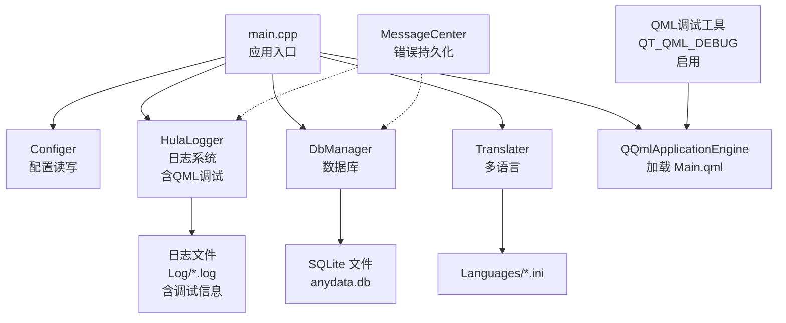
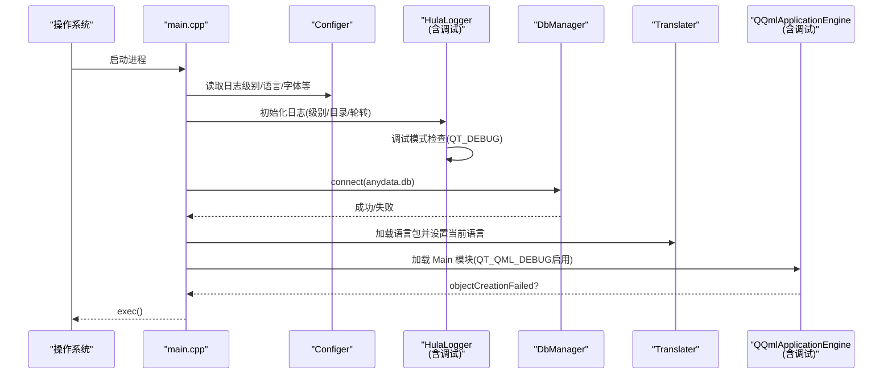
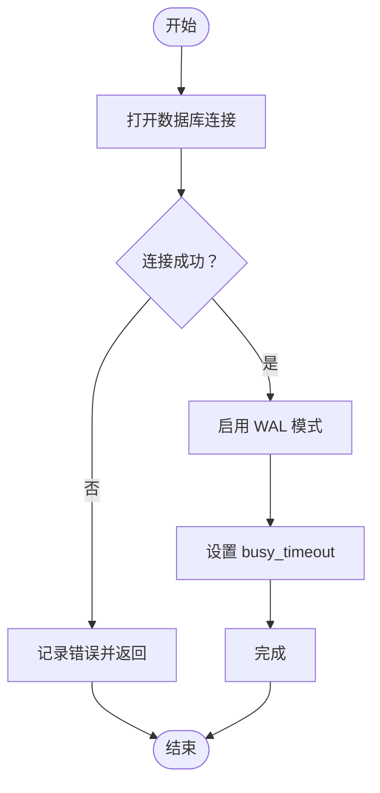
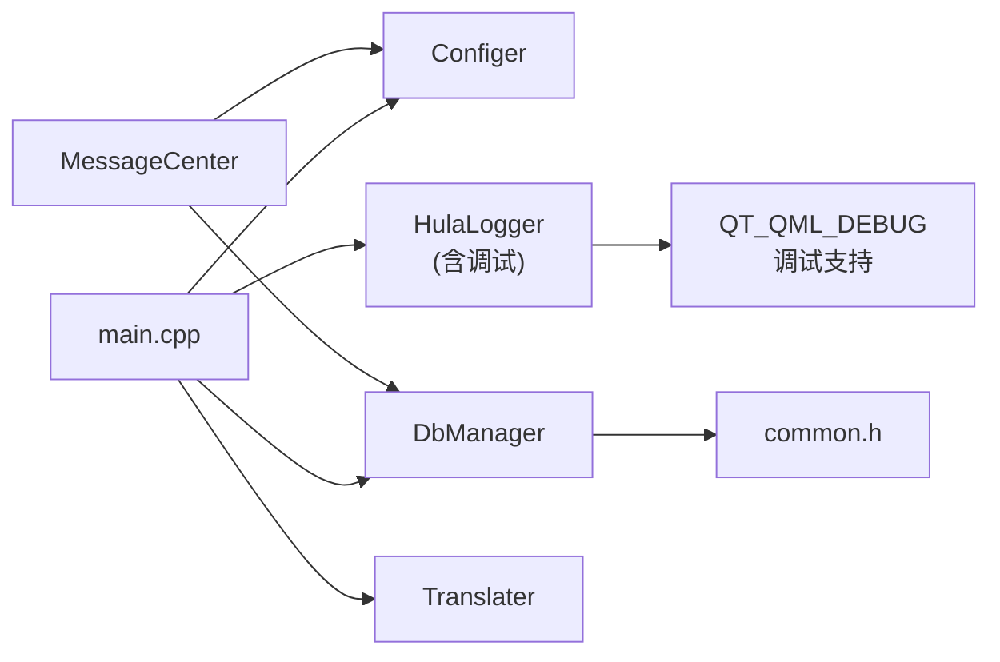

# 故障排除

<cite>
**本文引用的文件**   
- [src/main.cpp](file://src/main.cpp)
- [src/hulalogger.h](file://src/hulalogger.h)
- [src/hulalogger.cpp](file://src/hulalogger.cpp)
- [src/dbmanager.h](file://src/dbmanager.h)
- [src/dbmanager.cpp](file://src/dbmanager.cpp)
- [src/configer.h](file://src/configer.h)
- [src/configer.cpp](file://src/configer.cpp)
- [src/common.h](file://src/common.h)
- [src/messagecenter.h](file://src/messagecenter.h)
- [src/messagecenter.cpp](file://src/messagecenter.cpp)
- [src/basemsgsender.h](file://src/basemsgsender.h)
- [src/translater.h](file://src/translater.h)
- [src/translater.cpp](file://src/translater.cpp)
- [CMakeLists.txt](file://CMakeLists.txt)
- [README.md](file://README.md)
- [bin/Config.ini](file://bin/Config.ini)
- [resources/Config.ini](file://resources/Config.ini)
</cite>

## 目录
1. [简介](#简介)
2. [项目结构](#项目结构)
3. [核心组件](#核心组件)
4. [架构总览](#架构总览)
5. [详细组件分析与排错](#详细组件分析与排错)
6. [依赖关系分析](#依赖关系分析)
7. [性能考虑](#性能考虑)
8. [故障排除指南](#故障排除指南)
9. [结论](#结论)
10. [附录](#附录)

## 简介
本指南聚焦于 QmlPlugins 项目的故障排除，覆盖启动与运行时异常、日志系统使用、数据库连接与事务、国际化与UI渲染、配置与部署、以及性能与监控建议。文档结合源码实现，提供可操作的诊断步骤、错误信息解读与修复方案。特别强调了项目内置的QML调试工具和日志系统，为QML应用崩溃调试提供全面支持。

## 项目结构
- 应用入口与平台适配：main.cpp 负责应用初始化、单实例检测、日志初始化、数据库连接、语言与主题加载、引擎与模块加载。
- 日志系统：HulaLogger 提供线程安全、轮转、级别控制的日志能力，并作为全局消息处理器。
- 配置系统：Configer 通过 QSettings 读写 ini 配置，暴露给 QML 使用。
- 数据库：DbManager 基于 SQLite，提供连接、事务、备份/恢复、查询封装。
- 消息中心：MessageCenter 将错误信息持久化到本地文本文件，供 UI 展示。
- 国际化：Translater 提供多语言加载与运行时重翻译。
- UI 组件与页面：位于 src/HulaUI 与 src/QmlUI，由 main.cpp 加载的 Main 模块驱动。
- **QML调试支持**：项目启用了完整的QML调试功能，包括调试模式下的详细日志输出和错误追踪。

**图表来源**
- [src/main.cpp:17-95](file://src/main.cpp#L17-L95)
- [src/configer.cpp:404-419](file://src/configer.cpp#L404-L419)
- [src/hulalogger.cpp:45-79](file://src/hulalogger.cpp#L45-L79)
- [src/dbmanager.cpp:51-90](file://src/dbmanager.cpp#L51-L90)
- [src/translater.cpp:24-37](file://src/translater.cpp#L24-L37)
- [src/messagecenter.cpp:83-116](file://src/messagecenter.cpp#L83-L116)
- [CMakeLists.txt:127-130](file://CMakeLists.txt#L127-L130)

**章节来源**
- [README.md:1-50](file://README.md#L1-L50)
- [src/main.cpp:17-95](file://src/main.cpp#L17-L95)
- [CMakeLists.txt:127-130](file://CMakeLists.txt#L127-L130)

## 核心组件
- 应用入口与初始化
  - 平台强制 XCB（Wayland 窗口移动问题）
  - 单实例检测
  - 日志初始化（级别来自配置）
  - 字体与图标设置
  - 数据库连接（失败直接退出）
  - 多语言初始化与当前语言设置
  - 引擎加载与对象创建失败兜底
- 日志系统
  - 单例、线程安全、级别过滤、文件轮转、过期清理、消息处理器安装
  - **调试模式增强**：在QT_DEBUG下提供详细文件名、行号、函数名信息
  - **控制台输出**：调试模式下同时输出到控制台，便于实时监控
- 配置系统
  - ini 文件读写、分组、键值存取、QML 可用
- 数据库
  - 线程本地连接、WAL 模式、busy_timeout、事务守卫、Schema 缓存、错误线程隔离
- 消息中心
  - 本地文件持久化（按日期分文件）、错误聚合、UI 通知
- 国际化
  - ini 语言包加载、上下文属性注入、运行时重翻译
- **QML调试支持**
  - 构建时启用QT_QML_DEBUG定义
  - 完整的QML模块注册和元类型支持
  - 调试模式下的详细错误追踪

**章节来源**
- [src/main.cpp:17-95](file://src/main.cpp#L17-L95)
- [src/hulalogger.h:49-175](file://src/hulalogger.h#L49-L175)
- [src/hulalogger.cpp:45-331](file://src/hulalogger.cpp#L45-L331)
- [src/configer.h:98-277](file://src/configer.h#L98-L277)
- [src/configer.cpp:404-419](file://src/configer.cpp#L404-L419)
- [src/dbmanager.h:52-192](file://src/dbmanager.h#L52-L192)
- [src/dbmanager.cpp:51-824](file://src/dbmanager.cpp#L51-L824)
- [src/messagecenter.h:27-127](file://src/messagecenter.h#L27-L127)
- [src/messagecenter.cpp:27-116](file://src/messagecenter.cpp#L27-L116)
- [src/translater.h:27-112](file://src/translater.h#L27-L112)
- [src/translater.cpp:24-146](file://src/translater.cpp#L24-L146)
- [CMakeLists.txt:127-130](file://CMakeLists.txt#L127-L130)

## 架构总览
应用启动流程与关键交互如下：

**图表来源**
- [src/main.cpp:32-95](file://src/main.cpp#L32-L95)
- [src/dbmanager.cpp:51-90](file://src/dbmanager.cpp#L51-L90)
- [src/hulalogger.cpp:45-79](file://src/hulalogger.cpp#L45-L79)
- [src/translater.cpp:24-37](file://src/translater.cpp#L24-L37)
- [CMakeLists.txt:127-130](file://CMakeLists.txt#L127-L130)

## 详细组件分析与排错

### 日志系统（HulaLogger）
- 关键点
  - 全局消息处理器安装，统一拦截 Qt 日志
  - 级别过滤：Debug/Info/Warning/Critical/Fatal
  - 文件轮转：按大小与日期；过期清理
  - 线程安全：互斥锁保护文件与写入
  - QML 可控：日志级别与目录属性
  - **调试模式增强**：在QT_DEBUG下提供详细上下文信息
- 常见问题与排查
  - 无日志输出
    - 检查日志级别是否高于当前设置
    - 检查日志目录是否存在且可写
    - 确认已在入口处调用初始化
  - 日志文件过大
    - 调整轮转阈值或保留天数
  - 控制台与文件不同步
    - 调试/发布模式差异导致格式不同
  - **QML调试信息缺失**
    - 检查构建配置是否启用QT_QML_DEBUG
    - 确认调试模式下std::cout输出正常
- 修复建议
  - 在 Configer 中提高 TraceLevel 或在运行时通过 QML 调整
  - 确保 Log 目录存在且权限正确
  - **在开发环境中确保QT_DEBUG定义正确**

**章节来源**
- [src/hulalogger.h:49-175](file://src/hulalogger.h#L49-L175)
- [src/hulalogger.cpp:45-331](file://src/hulalogger.cpp#L45-L331)
- [src/configer.cpp:42-50](file://src/configer.cpp#L42-L50)

### 配置系统（Configer）
- 关键点
  - ini 文件读写，分组与键值
  - QML 单例注册，提供运行时读写接口
  - 默认路径宏（PATH_PRE、CFG_FILE、LOG_PATH、DB_FILE 等）
- 常见问题与排查
  - 配置读取为空
    - 检查 ini 文件是否存在与分组/键名
    - 确认路径宏与实际部署路径一致
  - 修改无效
    - 确认写入成功（QSettings 提交）
    - 检查 QML 侧是否同步刷新
- 修复建议
  - 使用 QML 侧调用 set* 方法后观察 changed 信号
  - 部署时确保 resources/Config.ini 与 bin/Config.ini 位置正确

**章节来源**
- [src/configer.h:98-277](file://src/configer.h#L98-L277)
- [src/configer.cpp:404-419](file://src/configer.cpp#L404-L419)
- [resources/Config.ini](file://resources/Config.ini)
- [bin/Config.ini](file://bin/Config.ini)

### 数据库（DbManager）
- 关键点
  - 线程本地连接（以线程 ID 命名）
  - WAL 模式 + busy_timeout 防并发锁冲突
  - 事务守卫（RAII）自动回滚
  - Schema 缓存与类型解析
  - 备份/恢复流程与回滚
- 常见问题与排查
  - 数据库打开失败
    - 检查 DB_FILE 路径与权限
    - 查看 lastError 输出与返回码
  - "database is locked"
    - 已启用 busy_timeout，仍失败需检查并发写入策略
  - 备份/恢复失败
    - 检查源文件存在性与目标路径权限
    - 恢复失败会进行回滚，确认回滚文件存在
- 修复建议
  - 在 DbManager::connect 处增加更详细的错误上下文
  - 对高并发写入场景引入队列或重试策略

**图表来源**
- [src/dbmanager.cpp:51-90](file://src/dbmanager.cpp#L51-L90)

**章节来源**
- [src/dbmanager.h:52-192](file://src/dbmanager.h#L52-L192)
- [src/dbmanager.cpp:51-223](file://src/dbmanager.cpp#L51-L223)
- [src/common.h:63-117](file://src/common.h#L63-L117)

### 消息中心（MessageCenter）
- 关键点
  - 以日期为单位的错误信息文件（ErrorInfo/yyyyMMdd.txt）
  - 通过 QSettings INI 格式存储
  - 与各模块的 messageEmitted 信号对接
- 常见问题与排查
  - 无法查看历史错误
    - 检查 ErrorInfo 目录是否存在与权限
    - 确认当日文件名格式正确
  - 新错误未出现
    - 确认发送方已发出 messageEmitted 信号
    - 检查错误码是否为成功
- 修复建议
  - 在 UI 侧定期刷新 getDatas(date)
  - 对异常路径增加日志辅助定位

**章节来源**
- [src/messagecenter.h:27-127](file://src/messagecenter.h#L27-L127)
- [src/messagecenter.cpp:27-116](file://src/messagecenter.cpp#L27-L116)

### 国际化（Translater）
- 关键点
  - ini 语言包加载，内置简体中文优先
  - 运行时重翻译（retranslate）
  - QML 上下文注入
- 常见问题与排查
  - 语言切换无效
    - 确认 ini 文件键值完整
    - 确认 setCurrentLang 后触发 retranslate
- 修复建议
  - 在 QML 侧监听 currentLangChanged 并调用 retranslate

**章节来源**
- [src/translater.h:27-112](file://src/translater.h#L27-L112)
- [src/translater.cpp:24-146](file://src/translater.cpp#L24-L146)

### 应用入口（main.cpp）
- 关键点
  - 强制 XCB 平台
  - 单实例检测
  - 日志初始化
  - 字体/图标设置
  - 数据库连接失败直接退出
  - 引擎对象创建失败兜底
- 常见问题与排查
  - 启动后立即退出
    - 检查单实例检测与数据库连接
  - 界面无字体/图标
    - 检查 Configer 中字体/图标路径
- 修复建议
  - 在日志中增加更多上下文信息
  - 对对象创建失败场景增加 UI 提示

**章节来源**
- [src/main.cpp:17-95](file://src/main.cpp#L17-L95)

### QML调试工具（新增）
- 关键点
  - 构建时启用QT_QML_DEBUG定义
  - 完整的QML模块注册和元类型支持
  - 调试模式下的详细错误追踪
  - 与HulaLogger的集成，提供统一的日志输出
- 常见问题与排查
  - QML调试功能未生效
    - 检查构建配置中的QT_QML_DEBUG定义
    - 确认使用Debug模式构建
  - QML崩溃无详细信息
    - 确认HulaLogger在调试模式下正常工作
    - 检查std::cout输出是否正常
  - QML模块注册失败
    - 检查CMakeLists.txt中的QML模块配置
    - 确认QT_QML_DEBUG元类型文件生成
- 修复建议
  - 在CMakeLists.txt中确保QT_QML_DEBUG定义正确
  - 使用Debug模式进行开发和测试
  - 结合HulaLogger的详细日志进行问题定位

**章节来源**
- [CMakeLists.txt:127-130](file://CMakeLists.txt#L127-L130)
- [src/hulalogger.cpp:135-169](file://src/hulalogger.cpp#L135-L169)

## 依赖关系分析
- 组件耦合
  - main.cpp 依赖 Configer、HulaLogger、DbManager、Translater
  - DbManager 依赖 Configer（数据库路径）、Common（错误码）
  - MessageCenter 依赖 Configer（用户信息）、DbManager（可选）
  - Translater 依赖 QML 上下文
  - **HulaLogger 与 QML调试系统集成**
- 外部依赖
  - Qt6（GUI/QML/Sql/Settings/Translations）
  - SQLite3
  - CMake 3.16+
  - **调试支持**：QT_QML_DEBUG、QT_DEBUG

**图表来源**
- [src/main.cpp:11-13](file://src/main.cpp#L11-L13)
- [src/dbmanager.cpp:1-3](file://src/dbmanager.cpp#L1-L3)
- [src/messagecenter.cpp:1-3](file://src/messagecenter.cpp#L1-L3)
- [CMakeLists.txt:127-130](file://CMakeLists.txt#L127-L130)

**章节来源**
- [README.md:15-28](file://README.md#L15-L28)

## 性能考虑
- 数据库
  - WAL 模式与 busy_timeout 已启用，减少锁竞争
  - 建议对高频写入场景引入批量提交与去抖
- 日志
  - 文件轮转与过期清理降低磁盘占用
  - 建议在高并发场景限制日志级别或采样
  - **调试模式下日志输出可能影响性能，建议仅在开发环境使用**
- UI
  - 多语言重翻译成本较高，建议按需触发
  - 大量 QML 组件时注意内存与渲染开销
  - **QML调试模式下额外的元类型信息可能影响性能**

## 故障排除指南

### 启动与运行时异常
- 现象：应用启动后立即退出
  - 检查单实例检测与数据库连接
  - 查看日志中"Failed to create database connection"等错误
- 现象：界面空白或无字体/图标
  - 检查 Configer 中字体/图标路径
  - 确认资源文件部署正确
- 现象：对象创建失败
  - 观察引擎对象创建失败回调并记录日志
- **现象：QML模块加载失败**
  - 检查QT_QML_DEBUG定义是否正确
  - 确认QML模块注册和元类型文件生成
  - 查看HulaLogger中的详细错误信息

**章节来源**
- [src/main.cpp:24-30](file://src/main.cpp#L24-L30)
- [src/main.cpp:46-50](file://src/main.cpp#L46-L50)
- [src/main.cpp:87-92](file://src/main.cpp#L87-L92)

### 日志系统使用与调试
- 步骤
  - 在入口初始化日志（级别、目录）
  - 在关键路径调用日志接口
  - 查看 Log 目录下按日期轮转的日志文件
  - **在调试模式下利用详细上下文信息进行问题定位**
- 常见问题
  - 日志级别过高导致看不到 Debug
  - 目录不存在或权限不足
  - **调试模式下std::cout输出异常**
- 建议
  - 在开发阶段使用较低级别，生产阶段提高级别
  - 定期清理过期日志，避免磁盘压力
  - **使用Debug模式进行开发和测试，Release模式用于生产部署**

**章节来源**
- [src/hulalogger.cpp:45-79](file://src/hulalogger.cpp#L45-L79)
- [src/hulalogger.cpp:219-239](file://src/hulalogger.cpp#L219-L239)

### 数据库连接与事务
- 连接失败
  - 检查 DB_FILE 路径与权限
  - 查看 lastError 输出与返回码
- 并发写入失败
  - 已启用 busy_timeout，仍失败需优化并发策略
- 备份/恢复
  - 失败会回滚，检查回滚文件是否存在
  - 确认源文件存在与目标路径可写

**章节来源**
- [src/dbmanager.cpp:51-90](file://src/dbmanager.cpp#L51-L90)
- [src/dbmanager.cpp:118-223](file://src/dbmanager.cpp#L118-L223)
- [src/common.h:75-83](file://src/common.h#L75-L83)

### 国际化与UI渲染
- 语言切换无效
  - 确认 ini 文件键值完整
  - 确认 setCurrentLang 后触发 retranslate
- UI 文本未更新
  - 检查 QML 侧是否监听 currentLangChanged
  - 确认 QML 上下文已注入

**章节来源**
- [src/translater.cpp:123-136](file://src/translater.cpp#L123-L136)
- [src/translater.cpp:48-71](file://src/translater.cpp#L48-L71)

### 配置与部署
- 现象：配置读取为空或无效
  - 检查 ini 文件路径与分组/键名
  - 确认写入成功并重启生效
- 现象：资源文件缺失（图片/语言/图标）
  - 确认 resources 与 bin 目录结构
  - 检查打包与部署脚本

**章节来源**
- [src/configer.cpp:404-419](file://src/configer.cpp#L404-L419)
- [README.md:36-45](file://README.md#L36-L45)

### QML应用崩溃调试（新增）
- **QML调试工具启用**
  - 确认构建配置中QT_QML_DEBUG定义正确
  - 使用Debug模式进行开发和测试
  - 检查QML模块注册和元类型文件生成
- **崩溃信息收集**
  - 结合HulaLogger的详细日志输出
  - 利用调试模式下的文件名、行号、函数名信息
  - 查看std::cout的控制台输出
- **常见QML崩溃场景**
  - QML语法错误：检查语法高亮和编译错误
  - 数据绑定问题：验证数据模型和属性连接
  - 内存泄漏：监控内存使用情况
  - 性能问题：分析渲染和JavaScript执行时间
- **调试技巧**
  - 使用Qt Creator的QML调试器
  - 启用QML语义高亮和实时错误检查
  - 利用HulaLogger记录关键执行点
  - 逐步缩小问题范围，从简单到复杂

**章节来源**
- [CMakeLists.txt:127-130](file://CMakeLists.txt#L127-L130)
- [src/hulalogger.cpp:135-169](file://src/hulalogger.cpp#L135-L169)

### 网络通信与UI渲染异常（概念性指导）
- 网络通信
  - 若后续接入网络模块，建议统一错误码与消息结构
  - 使用超时与重试策略，记录请求/响应上下文
- UI 渲染
  - 大量组件时采用虚拟化与懒加载
  - 减少频繁重翻译与样式切换

（本节为概念性内容，不直接分析具体文件）

### 监控指标、告警与预防
- 指标建议
  - 日志级别分布、错误码统计、数据库连接成功率、备份/恢复次数
  - **QML模块加载成功率、调试日志数量**
- 告警机制
  - 通过 MessageCenter 将错误持久化，UI 展示
  - 高频错误触发告警（如 5 分钟内 N 次）
  - **QML异常告警阈值设置**
- 预防措施
  - 启用 WAL 与 busy_timeout
  - 严格参数校验与错误码规范
  - 定期备份数据库与清理日志
  - **开发阶段使用调试模式，生产阶段使用Release模式**

**章节来源**
- [src/messagecenter.cpp:83-116](file://src/messagecenter.cpp#L83-L116)
- [src/dbmanager.cpp:74-85](file://src/dbmanager.cpp#L74-L85)

## 结论
本指南基于源码实现总结了 QmlPlugins 的故障排除流程与最佳实践。通过规范化的日志、配置、数据库与消息中心设计，配合清晰的错误码体系与 QML 集成，可有效提升问题定位与修复效率。**新增的QML调试工具和完善的日志系统为QML应用崩溃调试提供了强有力的支持**。建议在持续集成中加入日志与数据库健康检查，形成闭环运维。**开发阶段充分利用调试工具，生产阶段保持严格的日志管理和错误监控**。

## 附录
- 快速检查清单
  - 日志：级别、目录、轮转、过期清理
  - 配置：ini 文件、分组/键名、写入成功
  - 数据库：路径、权限、WAL、busy_timeout、备份/恢复
  - 国际化：ini 文件、重翻译、QML 注入
  - 启动：单实例、字体/图标、引擎对象创建
  - **QML调试：QT_QML_DEBUG定义、调试模式、详细日志输出**