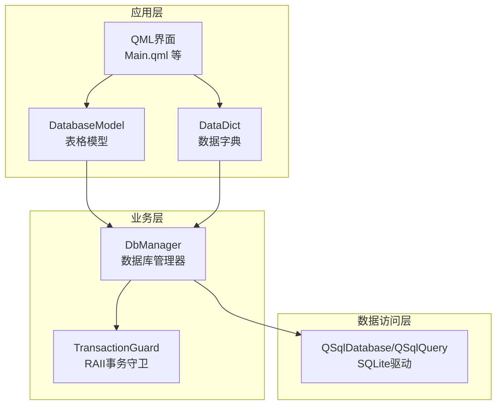
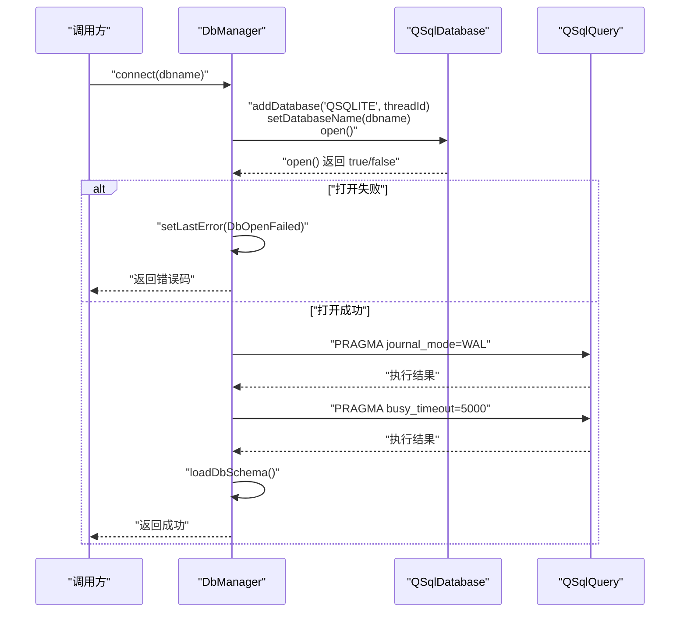
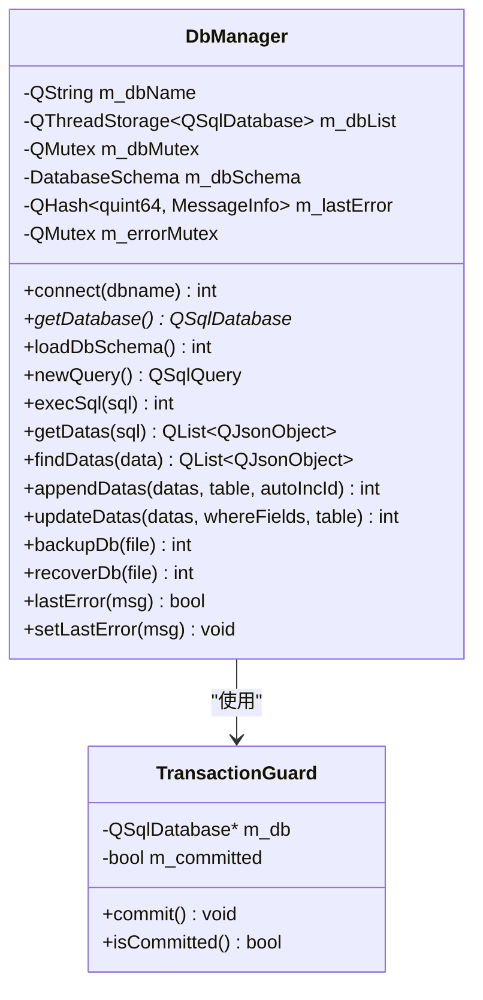
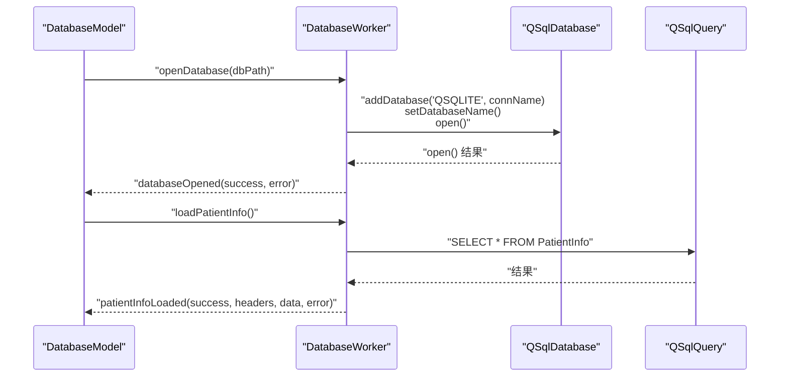
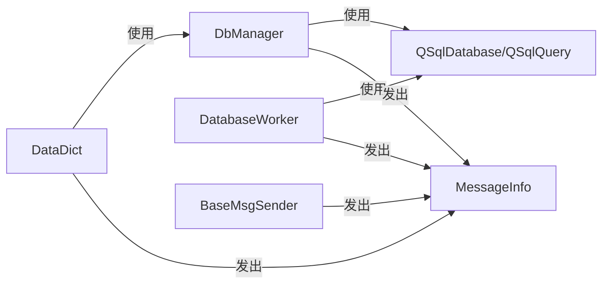

# 数据库连接问题

<cite>
**本文引用的文件**
- [dbmanager.h](file://src/dbmanager.h)
- [dbmanager.cpp](file://src/dbmanager.cpp)
- [databasemodel.h](file://src/databasemodel.h)
- [databasemodel.cpp](file://src/databasemodel.cpp)
- [datadict.h](file://src/datadict.h)
- [datadict.cpp](file://src/datadict.cpp)
- [common.h](file://src/common.h)
- [basemsgsender.h](file://src/basemsgsender.h)
- [basemsgsender.cpp](file://src/basemsgsender.cpp)
- [Config.ini](file://src/Config.ini)
- [Config.ini](file://resources/Config.ini)
- [Config.ini](file://bin/Config.ini)
</cite>

## 目录
1. [简介](#简介)
2. [项目结构](#项目结构)
3. [核心组件](#核心组件)
4. [架构总览](#架构总览)
5. [详细组件分析](#详细组件分析)
6. [依赖关系分析](#依赖关系分析)
7. [性能考虑](#性能考虑)
8. [故障排除指南](#故障排除指南)
9. [结论](#结论)
10. [附录](#附录)

## 简介
本指南聚焦于QmlPlugins项目中的数据库连接问题，围绕SQLite连接失败、数据库文件锁定、权限不足、表结构不匹配等常见问题，提供系统化的诊断与解决步骤；同时覆盖数据库初始化失败、迁移错误、事务回滚问题的排查流程，并给出数据库性能优化建议与连接池配置最佳实践，帮助开发者快速定位并解决问题。

## 项目结构
项目采用Qt/C++实现，数据库访问通过单例DbManager统一管理，配合事务守卫类TransactionGuard确保事务一致性；另有独立的DatabaseModel/DatabaseWorker线程模型用于表格数据展示与增删改查；数据字典模块通过DbManager执行SQL。

图表来源
- [dbmanager.h:52-192](file://src/dbmanager.h#L52-L192)
- [dbmanager.cpp:51-116](file://src/dbmanager.cpp#L51-L116)
- [databasemodel.h:49-97](file://src/databasemodel.h#L49-L97)
- [databasemodel.cpp:181-202](file://src/databasemodel.cpp#L181-L202)
- [datadict.h:30-103](file://src/datadict.h#L30-L103)
- [datadict.cpp:28-85](file://src/datadict.cpp#L28-L85)

章节来源
- [dbmanager.h:52-192](file://src/dbmanager.h#L52-L192)
- [dbmanager.cpp:51-116](file://src/dbmanager.cpp#L51-L116)
- [databasemodel.h:49-97](file://src/databasemodel.h#L49-L97)
- [databasemodel.cpp:181-202](file://src/databasemodel.cpp#L181-L202)
- [datadict.h:30-103](file://src/datadict.h#L30-L103)
- [datadict.cpp:28-85](file://src/datadict.cpp#L28-L85)

## 核心组件
- DbManager：单例数据库管理器，负责SQLite连接、WAL模式启用、busy_timeout设置、表结构缓存、事务封装、错误上报等。
- TransactionGuard：RAII风格的事务守卫，构造时开启事务，析构时若未显式commit则自动回滚，保证事务一致性。
- DatabaseModel/DatabaseWorker：基于线程分离的模型-工作者模式，将数据库操作放在专用线程，主线程只负责UI刷新。
- DataDict：数据字典业务类，通过DbManager执行查询、插入、更新、删除等操作。
- 错误码与消息：统一的ErrorCode与MessageInfo结构，便于跨模块传递错误信息。

章节来源
- [dbmanager.h:37-50](file://src/dbmanager.h#L37-L50)
- [dbmanager.h:52-192](file://src/dbmanager.h#L52-L192)
- [dbmanager.cpp:14-39](file://src/dbmanager.cpp#L14-L39)
- [databasemodel.h:20-47](file://src/databasemodel.h#L20-L47)
- [databasemodel.cpp:16-41](file://src/databasemodel.cpp#L16-L41)
- [datadict.cpp:28-85](file://src/datadict.cpp#L28-L85)
- [common.h:63-117](file://src/common.h#L63-L117)
- [basemsgsender.h:10-35](file://src/basemsgsender.h#L10-L35)

## 架构总览
DbManager以线程局部存储保存每个线程的QSqlDatabase连接，避免跨线程共享连接导致的竞态与崩溃；在连接建立时启用WAL模式与busy_timeout，降低“数据库被锁定”风险；通过loadDbSchema缓存表结构，辅助上层进行字段类型判断与绑定；事务通过TransactionGuard统一管理，减少遗漏提交或回滚的风险。

图表来源
- [dbmanager.cpp:51-90](file://src/dbmanager.cpp#L51-L90)
- [dbmanager.cpp:225-350](file://src/dbmanager.cpp#L225-L350)

章节来源
- [dbmanager.cpp:51-90](file://src/dbmanager.cpp#L51-L90)
- [dbmanager.cpp:225-350](file://src/dbmanager.cpp#L225-L350)

## 详细组件分析

### DbManager：连接、事务与错误处理
- 连接策略：以线程ID命名连接，避免多线程共享连接；连接断开时自动重连。
- WAL与busy_timeout：连接后立即启用WAL模式与busy_timeout，缓解并发写入导致的“数据库被锁定”。
- 表结构缓存：通过PRAGMA sqlite_master与PRAGMA table_info加载表与字段元数据，解析类型、长度、精度、主键、自增、可空等信息。
- 事务封装：TransactionGuard在构造时开启事务，在析构时若未commit则自动回滚，防止资源泄漏与数据不一致。
- 错误上报：lastError按线程隔离存储，setLastError统一记录并发出messageEmitted信号。

图表来源
- [dbmanager.h:52-192](file://src/dbmanager.h#L52-L192)
- [dbmanager.cpp:14-39](file://src/dbmanager.cpp#L14-L39)

章节来源
- [dbmanager.h:52-192](file://src/dbmanager.h#L52-L192)
- [dbmanager.cpp:51-116](file://src/dbmanager.cpp#L51-L116)
- [dbmanager.cpp:225-350](file://src/dbmanager.cpp#L225-L350)
- [dbmanager.cpp:769-793](file://src/dbmanager.cpp#L769-L793)

### DatabaseModel/DatabaseWorker：线程化数据库访问
- DatabaseWorker在独立线程中持有QSqlDatabase连接，避免阻塞UI线程。
- 通过信号槽与DatabaseModel通信，成功/失败均通过信号返回，由模型在主线程更新UI。
- 支持打开数据库、加载数据、插入、更新、删除等操作。

图表来源
- [databasemodel.cpp:16-41](file://src/databasemodel.cpp#L16-L41)
- [databasemodel.cpp:43-81](file://src/databasemodel.cpp#L43-L81)

章节来源
- [databasemodel.h:20-47](file://src/databasemodel.h#L20-L47)
- [databasemodel.cpp:16-41](file://src/databasemodel.cpp#L16-L41)
- [databasemodel.cpp:43-81](file://src/databasemodel.cpp#L43-L81)

### DataDict：基于DbManager的业务操作
- 通过DbManager::newQuery与getDbDatas完成数据查询与转换。
- 封装插入、更新、删除、唯一性校验等常用操作，统一错误上报。

章节来源
- [datadict.cpp:28-85](file://src/datadict.cpp#L28-L85)

## 依赖关系分析
- DbManager依赖Qt SQL模块（QSqlDatabase/QSqlQuery），并使用QThreadStorage保存每线程连接。
- DataDict依赖DbManager进行SQL执行与结果转换。
- DatabaseModel/DatabaseWorker各自维护独立连接，避免与DbManager共享连接。
- 错误码与消息机制通过BaseMsgSender统一发出，便于UI层接收与展示。

图表来源
- [dbmanager.h:17-29](file://src/dbmanager.h#L17-L29)
- [datadict.cpp:19-26](file://src/datadict.cpp#L19-L26)
- [databasemodel.cpp:16-41](file://src/databasemodel.cpp#L16-L41)
- [basemsgsender.h:27-34](file://src/basemsgsender.h#L27-L34)

章节来源
- [dbmanager.h:17-29](file://src/dbmanager.h#L17-L29)
- [datadict.cpp:19-26](file://src/datadict.cpp#L19-L26)
- [databasemodel.cpp:16-41](file://src/databasemodel.cpp#L16-L41)
- [basemsgsender.h:27-34](file://src/basemsgsender.h#L27-L34)

## 性能考虑
- WAL模式：连接后立即启用WAL，提升并发读写能力，降低锁竞争。
- busy_timeout：设置合理的超时时间，避免“数据库被锁定”错误导致的立即失败。
- 表结构缓存：loadDbSchema一次性解析并缓存表/字段元数据，减少重复查询与正则解析成本。
- 事务批处理：批量插入/更新使用TransactionGuard包裹，减少事务开销与日志写入次数。
- 线程分离：DatabaseWorker在独立线程执行数据库操作，避免UI卡顿。

章节来源
- [dbmanager.cpp:74-85](file://src/dbmanager.cpp#L74-L85)
- [dbmanager.cpp:225-350](file://src/dbmanager.cpp#L225-L350)
- [dbmanager.cpp:437-498](file://src/dbmanager.cpp#L437-L498)
- [dbmanager.cpp:500-553](file://src/dbmanager.cpp#L500-L553)
- [databasemodel.cpp:16-41](file://src/databasemodel.cpp#L16-L41)

## 故障排除指南

### 一、SQLite连接失败
- 常见原因
  - 数据库文件路径为空或不可达
  - 权限不足（目录/文件无读写权限）
  - 数据库文件损坏或格式不正确
  - Qt未安装SQLite驱动或插件缺失
- 诊断步骤
  - 检查DbManager::connect传入的数据库名是否有效
  - 检查数据库文件是否存在且可读写
  - 在DbManager::getDatabase中确认连接断开后是否能自动重连
  - 查看setLastError输出的错误文本
- 解决方案
  - 确保数据库文件路径正确且进程对文件与父目录具有读写权限
  - 若使用相对路径，确认工作目录与期望一致
  - 如需外部驱动，确保Qt的SQL插件可用
  - 对于损坏文件，先备份再尝试修复或重建

章节来源
- [dbmanager.cpp:51-90](file://src/dbmanager.cpp#L51-L90)
- [dbmanager.cpp:92-116](file://src/dbmanager.cpp#L92-L116)
- [dbmanager.cpp:784-793](file://src/dbmanager.cpp#L784-L793)

### 二、数据库文件锁定（“database is locked”）
- 原因
  - 多线程并发写入未使用WAL或未设置busy_timeout
  - 长事务未及时提交/回滚
  - 其他进程占用数据库文件
- 诊断步骤
  - 确认连接后已执行PRAGMA journal_mode=WAL
  - 确认已执行PRAGMA busy_timeout=5000
  - 检查是否存在长时间未提交的事务
  - 使用工具检查文件是否被其他进程占用
- 解决方案
  - 确保每次批量写入使用TransactionGuard包裹
  - 合理缩短事务生命周期，及时commit
  - 在高并发场景下保持WAL模式与busy_timeout

章节来源
- [dbmanager.cpp:74-85](file://src/dbmanager.cpp#L74-L85)
- [dbmanager.cpp:14-39](file://src/dbmanager.cpp#L14-L39)
- [dbmanager.cpp:437-498](file://src/dbmanager.cpp#L437-L498)
- [dbmanager.cpp:500-553](file://src/dbmanager.cpp#L500-L553)

### 三、权限不足
- 原因
  - 应用运行用户对数据库文件或所在目录无读写权限
  - 文件被系统保护或只读属性
- 诊断步骤
  - 在命令行使用相同用户尝试读写数据库文件
  - 检查文件权限与属组
- 解决方案
  - 修改文件权限或属组，确保应用账户具备读写权限
  - 将数据库文件放置在应用有权限的目录（如用户目录）

章节来源
- [dbmanager.cpp:118-155](file://src/dbmanager.cpp#L118-L155)
- [dbmanager.cpp:157-223](file://src/dbmanager.cpp#L157-L223)

### 四、表结构不匹配
- 原因
  - 数据库schema变更但未同步更新
  - 代码中对字段类型/长度假设与实际不一致
- 诊断步骤
  - 使用DbManager::loadDbSchema检查缓存的表/字段信息
  - 对比PRAGMA table_info输出与预期
- 解决方案
  - 在schema变更后重新加载或执行迁移脚本
  - 上层逻辑根据m_dbSchema进行类型/长度校验后再绑定

章节来源
- [dbmanager.cpp:225-350](file://src/dbmanager.cpp#L225-L350)

### 五、数据库初始化失败
- 常见表现
  - 启动即报错“Failed to open database”
  - WAL或busy_timeout设置失败
- 诊断步骤
  - 检查connect流程与错误码
  - 确认WAL与busy_timeout执行路径
- 解决方案
  - 修正数据库路径与权限
  - 确保Qt SQL插件可用
  - 若WAL设置失败，检查SQLite版本与驱动兼容性

章节来源
- [dbmanager.cpp:51-90](file://src/dbmanager.cpp#L51-L90)

### 六、迁移错误
- 常见表现
  - 新增/删除字段后查询失败
  - 类型转换异常
- 诊断步骤
  - 通过loadDbSchema核对当前schema
  - 检查迁移脚本是否完整执行
- 解决方案
  - 逐步执行迁移脚本，确保每步成功
  - 迁移后重新loadDbSchema并验证

章节来源
- [dbmanager.cpp:225-350](file://src/dbmanager.cpp#L225-L350)

### 七、事务回滚问题
- 常见表现
  - 批量操作部分成功，部分失败但未回滚
  - 程序退出导致未提交事务
- 诊断步骤
  - 确认使用TransactionGuard包裹批量操作
  - 检查异常路径是否提前返回而未commit
- 解决方案
  - 使用RAII事务守卫，确保异常时自动回滚
  - 在finally/析构中保证事务状态正确

章节来源
- [dbmanager.cpp:14-39](file://src/dbmanager.cpp#L14-L39)
- [dbmanager.cpp:437-498](file://src/dbmanager.cpp#L437-L498)
- [dbmanager.cpp:500-553](file://src/dbmanager.cpp#L500-L553)

### 八、备份与恢复失败
- 常见表现
  - 备份文件为空或复制失败
  - 恢复后无法重新打开数据库
- 诊断步骤
  - 检查源文件是否存在与可读
  - 恢复过程中出现错误时的回滚逻辑
- 解决方案
  - 确保源文件存在且可读
  - 恢复失败时回滚原文件，重新打开连接

章节来源
- [dbmanager.cpp:118-155](file://src/dbmanager.cpp#L118-L155)
- [dbmanager.cpp:157-223](file://src/dbmanager.cpp#L157-L223)

### 九、连接池配置最佳实践
- 现状
  - 项目采用“每线程一个连接”的策略，未使用Qt内置连接池
- 建议
  - 若改为连接池，应确保：
    - 连接池大小与CPU核心数匹配，避免过多上下文切换
    - 为每个线程分配独立连接，避免跨线程共享连接
    - 设置合理的超时与重试策略
    - 对高并发写入启用WAL与busy_timeout
  - 当前实现已通过线程局部存储规避了连接共享问题，可维持现状

章节来源
- [dbmanager.cpp:59-89](file://src/dbmanager.cpp#L59-L89)

## 结论
本指南基于QmlPlugins现有实现，总结了数据库连接问题的典型场景与解决方案。项目通过DbManager统一管理连接、启用WAL与busy_timeout、缓存表结构、使用RAII事务守卫等手段，有效降低了连接失败与“数据库被锁定”的概率。对于权限、迁移、备份恢复等问题，建议结合错误码与lastError输出进行定位，并遵循本文提供的流程逐一排查。

## 附录

### A. 常见错误码与含义
- 数据库模块错误码（1200-1299）
  - DbOpenFailed：数据库打开失败
  - DbBackupFailed：数据库备份失败
  - DbRecoverFailed：数据库恢复失败
  - DbExecuteFailed：数据库执行失败
  - DbConnectionLost：数据库连接丢失
  - DbTableNotFound：表不存在
  - DbRecordNotFound：记录不存在
  - DbDuplicateKey：主键冲突

章节来源
- [common.h:75-84](file://src/common.h#L75-L84)

### B. 关键接口与调用路径参考
- 连接与查询
  - [connect:51-90](file://src/dbmanager.cpp#L51-L90)
  - [getDatabase:92-116](file://src/dbmanager.cpp#L92-L116)
  - [newQuery/execSql/getDatas/findDatas:555-599](file://src/dbmanager.cpp#L555-L599)
- 事务
  - [TransactionGuard:14-39](file://src/dbmanager.cpp#L14-L39)
  - [appendDatas/updateDatas:437-553](file://src/dbmanager.cpp#L437-L553)
- 备份/恢复
  - [backupDb/recoverDb:118-223](file://src/dbmanager.cpp#L118-L223)
- 线程化访问
  - [DatabaseWorker::openDatabase/loadPatientInfo:16-81](file://src/databasemodel.cpp#L16-L81)
- 数据字典
  - [DataDict接口:28-85](file://src/datadict.cpp#L28-L85)