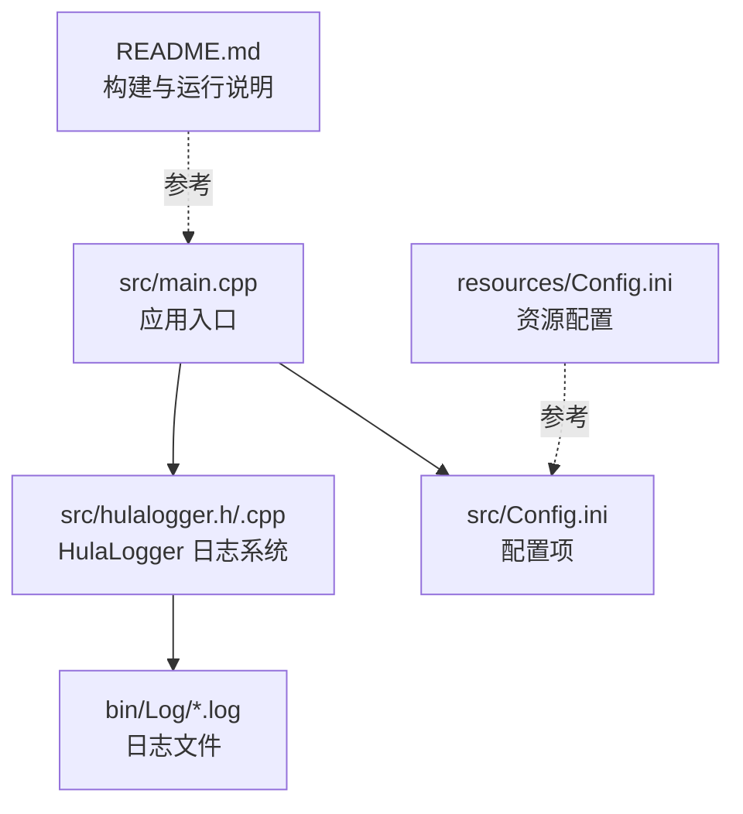
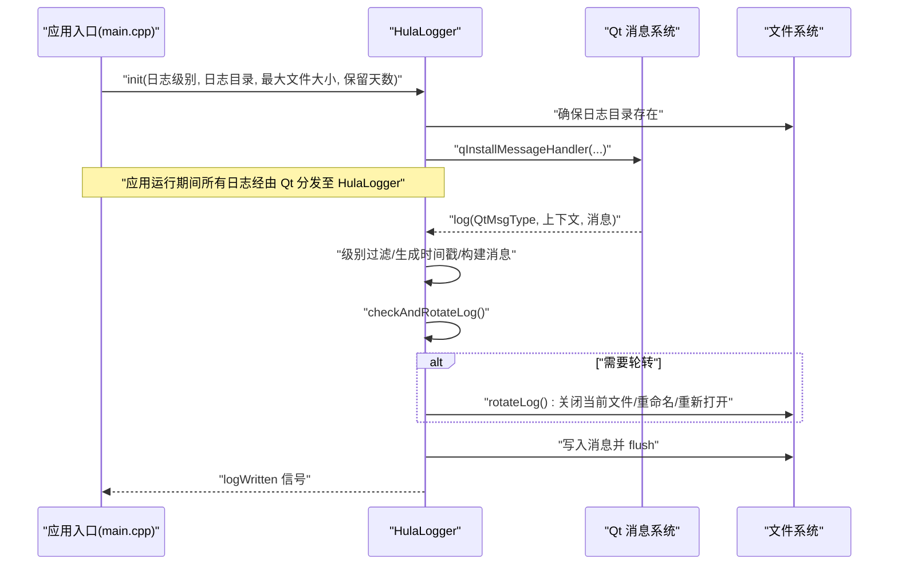
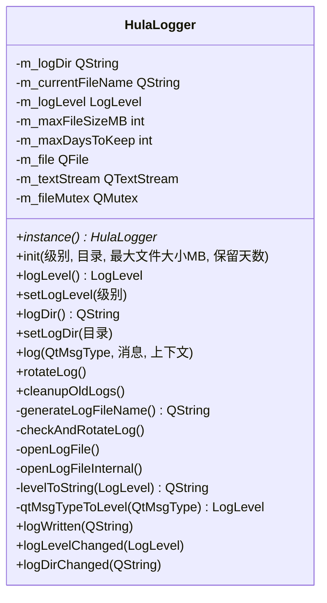
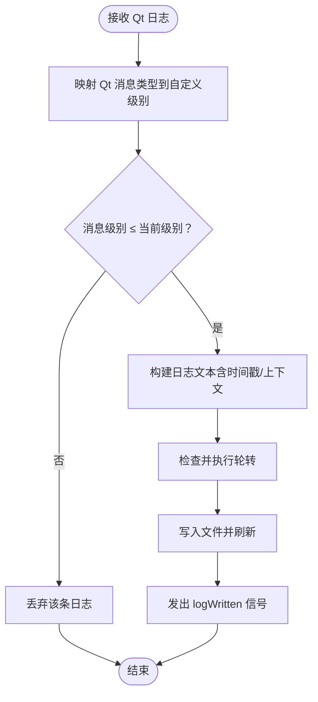
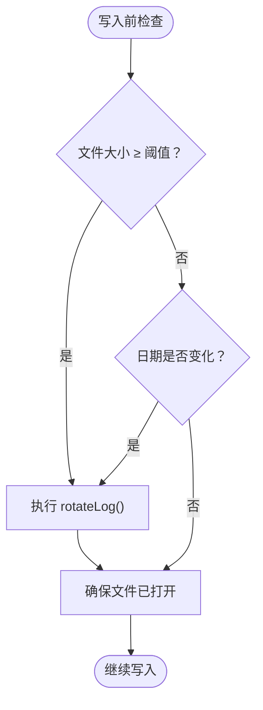
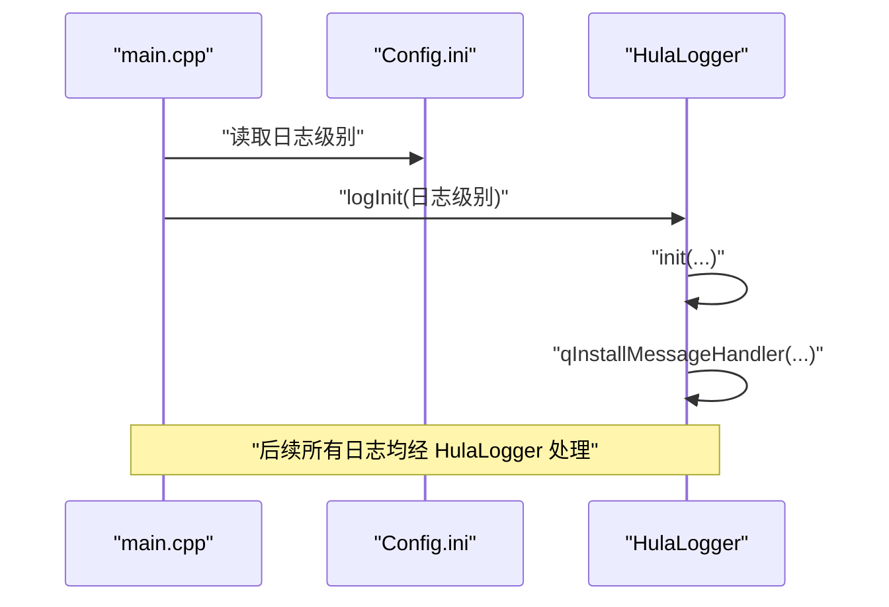
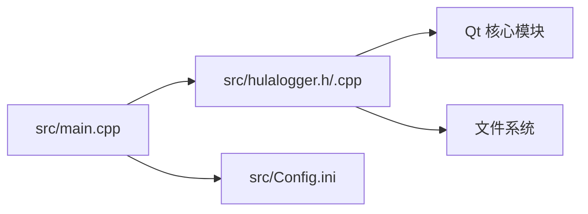

# 日志与调试

<cite>
**本文引用的文件**
- [hulalogger.h](file://src/hulalogger.h)
- [hulalogger.cpp](file://src/hulalogger.cpp)
- [main.cpp](file://src/main.cpp)
- [Config.ini](file://src/Config.ini)
- [Config.ini](file://resources/Config.ini)
- [Config.ini](file://bin/Config.ini)
- [README.md](file://README.md)
</cite>

## 目录
1. [简介](#简介)
2. [项目结构](#项目结构)
3. [核心组件](#核心组件)
4. [架构总览](#架构总览)
5. [详细组件分析](#详细组件分析)
6. [依赖关系分析](#依赖关系分析)
7. [性能考量](#性能考量)
8. [故障排查指南](#故障排查指南)
9. [结论](#结论)
10. [附录](#附录)

## 简介
本指南围绕 QmlPlugins 项目的日志系统与调试工具展开，重点介绍 HulaLogger 日志系统的配置与使用方法、日志级别设置、文件轮转机制、日志分析技巧，并提供断点调试、内存分析、性能监控的实用方法与最佳实践。文档同时覆盖远程调试、生产环境问题定位、日志收集与分析等场景。

## 项目结构
QmlPlugins 是一个基于 Qt6/QML 的跨平台应用，日志系统位于 src 目录下，入口程序负责初始化日志系统；配置项通过 Config.ini 提供，运行时产物位于 bin 目录。

图表来源
- [main.cpp:17-99](file://src/main.cpp#L17-L99)
- [hulalogger.h:49-167](file://src/hulalogger.h#L49-L167)
- [hulalogger.cpp:45-79](file://src/hulalogger.cpp#L45-L79)
- [Config.ini](file://src/Config.ini)
- [README.md:22-34](file://README.md#L22-L34)

章节来源
- [README.md:22-34](file://README.md#L22-L34)
- [main.cpp:17-99](file://src/main.cpp#L17-L99)

## 核心组件
- HulaLogger：提供线程安全的日志写入、日志级别过滤、按大小与日期的自动轮转、过期日志清理、以及与 Qt 消息系统的集成。
- 应用入口：在启动阶段根据配置初始化日志系统，并加载翻译、数据库、主题等资源。

章节来源
- [hulalogger.h:28-34](file://src/hulalogger.h#L28-L34)
- [hulalogger.cpp:45-79](file://src/hulalogger.cpp#L45-L79)
- [main.cpp:32-33](file://src/main.cpp#L32-L33)

## 架构总览
HulaLogger 通过安装 Qt 消息处理器接管所有日志输出，内部以线程互斥保证并发安全，采用“按大小+按日期”的双条件轮转策略，并在每次写入前检查轮转条件。应用启动时调用初始化函数完成日志系统装配。

图表来源
- [main.cpp:32-33](file://src/main.cpp#L32-L33)
- [hulalogger.cpp:75-79](file://src/hulalogger.cpp#L75-L79)
- [hulalogger.cpp:118-172](file://src/hulalogger.cpp#L118-L172)
- [hulalogger.cpp:245-268](file://src/hulalogger.cpp#L245-L268)
- [hulalogger.cpp:174-217](file://src/hulalogger.cpp#L174-L217)

## 详细组件分析

### HulaLogger 类与接口
- 单例模式：通过静态工厂获取实例，避免全局变量。
- 属性与信号：对外暴露日志级别与日志目录属性，支持变更通知；提供日志写入完成信号。
- 日志级别：Fatal/Critical/Warning/Info/Debug，按级别过滤输出。
- 轮转机制：按大小（MB）与日期（当日）触发；手动触发 rotateLog()。
- 过期清理：按保留天数清理旧日志文件。
- 线程安全：内部使用互斥锁保护文件句柄与写入流程。

图表来源
- [hulalogger.h:49-167](file://src/hulalogger.h#L49-L167)
- [hulalogger.cpp:23-35](file://src/hulalogger.cpp#L23-L35)
- [hulalogger.cpp:273-299](file://src/hulalogger.cpp#L273-L299)

章节来源
- [hulalogger.h:28-34](file://src/hulalogger.h#L28-L34)
- [hulalogger.h:49-111](file://src/hulalogger.h#L49-L111)
- [hulalogger.cpp:45-79](file://src/hulalogger.cpp#L45-L79)
- [hulalogger.cpp:118-172](file://src/hulalogger.cpp#L118-L172)
- [hulalogger.cpp:174-217](file://src/hulalogger.cpp#L174-L217)
- [hulalogger.cpp:219-239](file://src/hulalogger.cpp#L219-L239)
- [hulalogger.cpp:245-268](file://src/hulalogger.cpp#L245-L268)
- [hulalogger.cpp:273-299](file://src/hulalogger.cpp#L273-L299)
- [hulalogger.cpp:301-321](file://src/hulalogger.cpp#L301-L321)

### 日志级别与过滤
- 级别顺序：Fatal ≥ Critical ≥ Warning ≥ Info ≥ Debug。
- 过滤策略：仅当消息级别小于等于当前设置级别时才写入。
- Qt 消息映射：将 Qt 的消息类型映射到自定义级别。

图表来源
- [hulalogger.cpp:118-172](file://src/hulalogger.cpp#L118-L172)
- [hulalogger.cpp:312-321](file://src/hulalogger.cpp#L312-L321)

章节来源
- [hulalogger.cpp:124-128](file://src/hulalogger.cpp#L124-L128)
- [hulalogger.cpp:130-148](file://src/hulalogger.cpp#L130-L148)
- [hulalogger.cpp:312-321](file://src/hulalogger.cpp#L312-L321)

### 文件轮转与过期清理
- 轮转条件：文件大小达到阈值或日期发生变化。
- 轮转过程：关闭当前文件 → 重命名现有文件 → 生成新文件 → 打开新文件。
- 过期清理：按保留天数删除旧日志文件。

图表来源
- [hulalogger.cpp:245-268](file://src/hulalogger.cpp#L245-L268)
- [hulalogger.cpp:174-217](file://src/hulalogger.cpp#L174-L217)
- [hulalogger.cpp:219-239](file://src/hulalogger.cpp#L219-L239)

章节来源
- [hulalogger.cpp:174-217](file://src/hulalogger.cpp#L174-L217)
- [hulalogger.cpp:219-239](file://src/hulalogger.cpp#L219-L239)
- [hulalogger.cpp:245-268](file://src/hulalogger.cpp#L245-L268)

### 应用初始化与日志集成
- 应用入口在启动时调用日志初始化函数，传入从配置读取的日志级别。
- 初始化完成后安装 Qt 消息处理器，使所有日志进入 HulaLogger 流程。

图表来源
- [main.cpp:32-33](file://src/main.cpp#L32-L33)
- [hulalogger.cpp:45-79](file://src/hulalogger.cpp#L45-L79)

章节来源
- [main.cpp:32-33](file://src/main.cpp#L32-L33)
- [hulalogger.cpp:45-79](file://src/hulalogger.cpp#L45-L79)

## 依赖关系分析
- HulaLogger 依赖 Qt 的消息系统、文件系统与互斥量，用于线程安全与持久化。
- 应用入口依赖配置模块以决定日志级别，并在启动阶段完成日志系统装配。

图表来源
- [main.cpp:13-14](file://src/main.cpp#L13-L14)
- [hulalogger.h:19-23](file://src/hulalogger.h#L19-L23)
- [hulalogger.cpp:1-15](file://src/hulalogger.cpp#L1-L15)

章节来源
- [main.cpp:13-14](file://src/main.cpp#L13-L14)
- [hulalogger.h:19-23](file://src/hulalogger.h#L19-L23)
- [hulalogger.cpp:1-15](file://src/hulalogger.cpp#L1-L15)

## 性能考量
- 线程安全：使用互斥锁保护文件写入与轮转，避免竞争条件；在轮转过程中释放锁再执行重命名，降低阻塞风险。
- I/O 开销：每次写入后 flush，确保关键信息及时落盘；建议在高吞吐场景适当合并写入或调整刷新频率。
- 轮转成本：轮转涉及文件重命名与重新打开，建议合理设置最大文件大小与保留天数，平衡磁盘占用与轮转频率。
- 调试/发布差异：调试模式包含文件名、行号、函数名等上下文信息，便于定位但会增加字符串拼接开销；发布模式精简格式，减少额外字段。

章节来源
- [hulalogger.cpp:154-164](file://src/hulalogger.cpp#L154-L164)
- [hulalogger.cpp:136-148](file://src/hulalogger.cpp#L136-L148)
- [hulalogger.cpp:245-268](file://src/hulalogger.cpp#L245-L268)

## 故障排查指南
- 日志未生成
  - 检查日志目录是否存在且可写；确认初始化是否成功安装消息处理器。
  - 章节来源
    - [hulalogger.cpp:57-61](file://src/hulalogger.cpp#L57-L61)
    - [hulalogger.cpp:75-79](file://src/hulalogger.cpp#L75-L79)
- 日志级别无效
  - 确认当前日志级别设置是否正确；检查级别映射逻辑。
  - 章节来源
    - [hulalogger.cpp:85-91](file://src/hulalogger.cpp#L85-L91)
    - [hulalogger.cpp:312-321](file://src/hulalogger.cpp#L312-L321)
- 轮转不生效
  - 检查文件大小阈值与日期变化条件；确认轮转函数被调用且文件句柄正确打开。
  - 章节来源
    - [hulalogger.cpp:249-260](file://src/hulalogger.cpp#L249-L260)
    - [hulalogger.cpp:262-267](file://src/hulalogger.cpp#L262-L267)
    - [hulalogger.cpp:174-217](file://src/hulalogger.cpp#L174-L217)
- 过期日志未清理
  - 检查保留天数配置与当前时间；确认清理函数执行路径。
  - 章节来源
    - [hulalogger.cpp:219-239](file://src/hulalogger.cpp#L219-L239)
- 控制台输出异常
  - 在调试模式下，控制台输出使用标准流避免递归；若出现异常，检查标准流重定向或终端权限。
  - 章节来源
    - [hulalogger.cpp:136-148](file://src/hulalogger.cpp#L136-L148)
    - [hulalogger.cpp:283-288](file://src/hulalogger.cpp#L283-L288)

## 结论
HulaLogger 为 QmlPlugins 提供了稳定、可配置、线程安全的日志能力，结合按大小与日期的轮转策略及过期清理机制，能够满足开发与生产的多样化需求。通过合理的日志级别与目录配置、规范的日志分析流程，可显著提升问题定位效率与系统可观测性。

## 附录

### 日志系统配置与使用步骤
- 设置日志级别
  - 在配置文件中设置日志级别，应用启动时读取并传递给初始化函数。
  - 章节来源
    - [main.cpp:32-33](file://src/main.cpp#L32-L33)
    - [hulalogger.cpp:45-48](file://src/hulalogger.cpp#L45-L48)
- 指定日志目录
  - 若未指定目录，系统默认在应用目录下创建 Log 子目录；也可通过属性动态修改。
  - 章节来源
    - [hulalogger.cpp:50-61](file://src/hulalogger.cpp#L50-L61)
    - [hulalogger.cpp:97-116](file://src/hulalogger.cpp#L97-L116)
- 触发轮转与清理
  - 可在运行时手动触发轮转；系统会在写入前自动检查并执行轮转；定期清理过期日志。
  - 章节来源
    - [hulalogger.cpp:100-100](file://src/hulalogger.cpp#L100-L100)
    - [hulalogger.cpp:219-239](file://src/hulalogger.cpp#L219-L239)
    - [hulalogger.cpp:245-268](file://src/hulalogger.cpp#L245-L268)

### 日志分析技巧
- 快速定位：利用调试模式下的文件名、行号、函数名信息缩小范围。
- 时间序列：按时间戳排序，串联事件链路，识别异常峰值与持续性问题。
- 级别筛选：优先关注 Fatal/Critical/Warning，再逐步回溯 Info/Debug。
- 文件切分：按日期与大小切分日志，便于并行分析与归档管理。

### 调试与性能监控
- 断点调试
  - 在关键路径设置断点，观察变量状态与调用栈；注意避免在日志回调中再次触发日志，防止递归。
  - 章节来源
    - [hulalogger.cpp:89-90](file://src/hulalogger.cpp#L89-L90)
    - [hulalogger.cpp:113-115](file://src/hulalogger.cpp#L113-L115)
- 内存分析
  - 使用系统自带工具或第三方工具对进程进行快照对比，关注高频对象与泄漏路径。
- 性能监控
  - 结合日志中的时间戳与关键事件，统计耗时分布，识别热点模块与瓶颈。

### 远程调试与生产环境最佳实践
- 远程调试
  - 在受控环境下开启更高日志级别，配合集中式日志收集与检索工具进行远程分析。
- 生产环境
  - 默认使用较低日志级别，避免过度 I/O；启用过期清理与轮转，控制磁盘占用。
  - 建立标准化日志格式与索引字段，便于自动化分析与告警。
- 日志收集与分析
  - 将日志目录挂载到统一存储；使用日志聚合平台进行实时检索与报表生成。