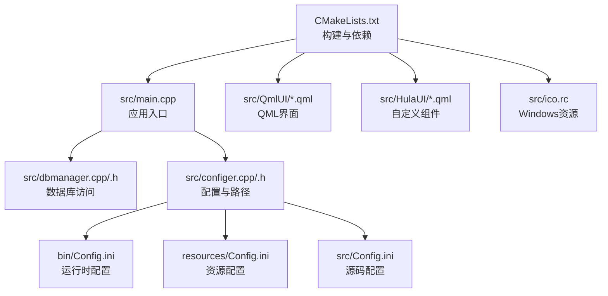
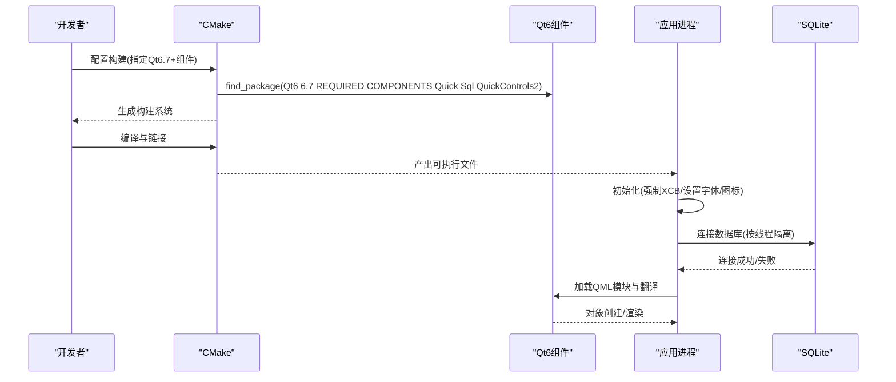
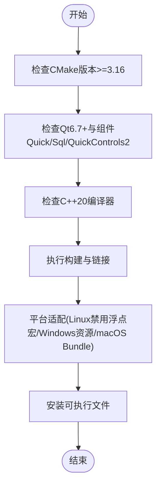
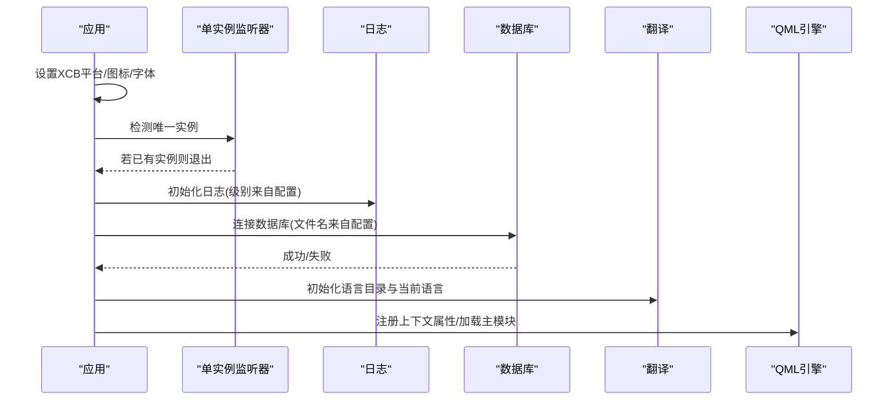
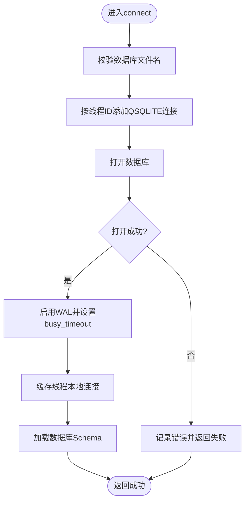
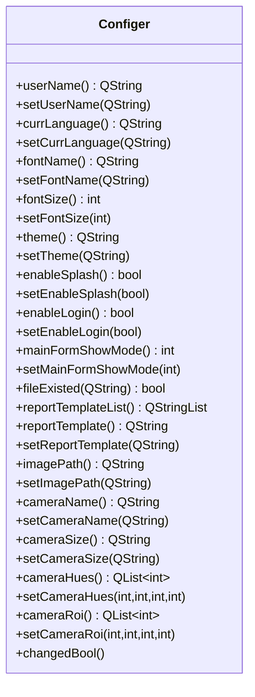
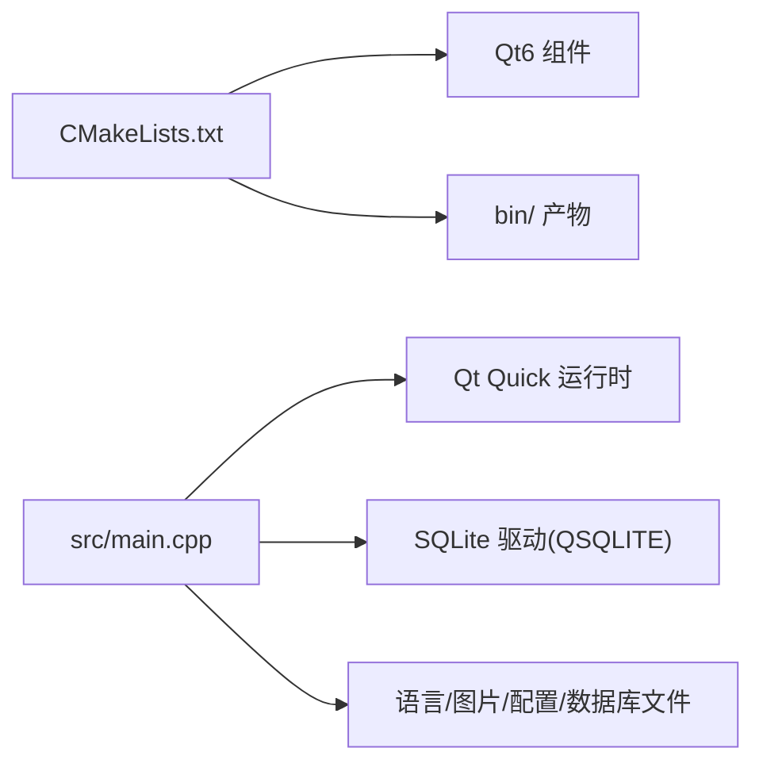

# 环境配置问题

<cite>
**本文引用的文件**
- [CMakeLists.txt](file://CMakeLists.txt)
- [README.md](file://README.md)
- [src/main.cpp](file://src/main.cpp)
- [src/dbmanager.h](file://src/dbmanager.h)
- [src/dbmanager.cpp](file://src/dbmanager.cpp)
- [src/configer.h](file://src/configer.h)
- [src/configer.cpp](file://src/configer.cpp)
- [src/ico.rc](file://src/ico.rc)
- [bin/Config.ini](file://bin/Config.ini)
- [resources/Config.ini](file://resources/Config.ini)
- [src/Config.ini](file://src/Config.ini)
</cite>

## 目录
1. [简介](#简介)
2. [项目结构](#项目结构)
3. [核心组件](#核心组件)
4. [架构总览](#架构总览)
5. [详细组件分析](#详细组件分析)
6. [依赖关系分析](#依赖关系分析)
7. [性能考虑](#性能考虑)
8. [故障排除指南](#故障排除指南)
9. [结论](#结论)
10. [附录](#附录)

## 简介
本指南聚焦于QmlPlugins项目的环境配置问题，覆盖Qt开发环境、CMake构建、依赖库（尤其是SQLite）与路径配置等常见问题。文档提供Windows、Linux、macOS三平台的检查清单与修复建议，并结合项目实际代码与构建脚本，给出可操作的排障步骤。

## 项目结构
该项目采用Qt6/QML跨平台架构，使用CMake进行构建，核心模块包括：
- CMake构建系统：集中于根目录的构建脚本，负责查找Qt组件、打包QML资源、链接库与平台适配。
- 应用入口：主程序负责初始化应用、加载翻译、建立数据库连接、启动QML引擎。
- 数据层：基于Qt SQL的SQLite访问封装，提供连接、事务、备份/恢复、查询等能力。
- 配置层：提供运行期配置读写、路径宏定义与QML单例集成。

图表来源
- [CMakeLists.txt:1-137](file://CMakeLists.txt#L1-L137)
- [src/main.cpp:1-99](file://src/main.cpp#L1-L99)
- [src/dbmanager.cpp:1-824](file://src/dbmanager.cpp#L1-L824)
- [src/configer.cpp:1-421](file://src/configer.cpp#L1-L421)
- [src/ico.rc:1-2](file://src/ico.rc#L1-L2)
- [bin/Config.ini](file://bin/Config.ini)
- [resources/Config.ini](file://resources/Config.ini)
- [src/Config.ini](file://src/Config.ini)

章节来源
- [CMakeLists.txt:1-137](file://CMakeLists.txt#L1-L137)
- [README.md:1-50](file://README.md#L1-L50)

## 核心组件
- 构建系统与工具链
  - CMake版本要求与标准：CMake 3.16+，C++20标准。
  - Qt版本与组件：Qt 6.7+，Quick、Sql、QuickControls2。
  - 输出目录：可执行与库输出至项目根目录下的bin与lib。
- 应用入口与初始化
  - 强制使用XCB平台以规避Wayland窗口问题；加载翻译、字体、图标；建立数据库连接；注册QML模块与上下文属性。
- 数据库管理
  - 使用SQLite驱动，按线程隔离连接，启用WAL与busy_timeout；提供备份/恢复、Schema加载、事务守卫等。
- 配置与路径
  - 通过宏在不同平台与部署形态下解析相对路径，统一资源与配置文件位置；提供QML单例接口。

章节来源
- [CMakeLists.txt:3-26](file://CMakeLists.txt#L3-L26)
- [CMakeLists.txt:22-26](file://CMakeLists.txt#L22-L26)
- [CMakeLists.txt:55-100](file://CMakeLists.txt#L55-L100)
- [src/main.cpp:17-96](file://src/main.cpp#L17-L96)
- [src/dbmanager.cpp:51-90](file://src/dbmanager.cpp#L51-L90)
- [src/configer.h:35-89](file://src/configer.h#L35-L89)

## 架构总览
下图展示从构建到运行的关键流程：CMake查找Qt组件并生成构建产物，应用启动时加载配置与翻译，连接SQLite数据库，随后加载QML模块与主界面。

图表来源
- [CMakeLists.txt:22-26](file://CMakeLists.txt#L22-L26)
- [CMakeLists.txt:95-100](file://CMakeLists.txt#L95-L100)
- [src/main.cpp:17-96](file://src/main.cpp#L17-L96)
- [src/dbmanager.cpp:51-90](file://src/dbmanager.cpp#L51-L90)

## 详细组件分析

### 组件A：CMake构建与平台适配
- 关键点
  - 最低CMake版本与C++20标准；输出目录统一到bin/lib。
  - Qt组件查找与标准项目设置；可执行目标与头文件包含。
  - QML资源收集与模块化打包；链接Quick、Sql、QuickControls2。
  - 平台适配：Linux禁用特定浮点类型宏；Windows设置Win32 GUI与资源文件；macOS设置Bundle属性。
  - 安装规则：安装可执行文件与Bundle。
- 常见问题定位
  - CMake找不到Qt组件：确认Qt6.7+已安装且CMAKE_PREFIX_PATH正确指向Qt安装目录。
  - C++20编译器不满足：确保编译器支持C++20（GCC 10+/Clang 10+/MSVC 2019+）。
  - Linux下_Wayland_窗口异常：强制XCB已在代码中设置，若仍异常需检查运行环境。

图表来源
- [CMakeLists.txt:3-26](file://CMakeLists.txt#L3-L26)
- [CMakeLists.txt:95-126](file://CMakeLists.txt#L95-L126)

章节来源
- [CMakeLists.txt:3-26](file://CMakeLists.txt#L3-L26)
- [CMakeLists.txt:95-126](file://CMakeLists.txt#L95-L126)

### 组件B：应用入口与初始化流程
- 关键点
  - 强制XCB平台以规避Wayland问题；设置应用图标与字体。
  - 单实例检测：通过独立监听器确保唯一实例。
  - 数据库连接：在启动阶段建立SQLite连接，失败直接退出。
  - 翻译与主题：加载语言资源与当前语言；设置应用显示名。
  - QML引擎：注册上下文属性，加载主模块。
- 常见问题定位
  - 数据库连接失败：检查数据库文件路径与权限；确认SQLite驱动可用。
  - 翻译资源缺失：确认语言文件位于预期目录且命名正确。
  - 单实例冲突：已有实例会直接退出，需终止旧实例或更换服务名。

图表来源
- [src/main.cpp:17-96](file://src/main.cpp#L17-L96)
- [src/dbmanager.cpp:51-90](file://src/dbmanager.cpp#L51-L90)
- [src/configer.cpp:42-60](file://src/configer.cpp#L42-L60)

章节来源
- [src/main.cpp:17-96](file://src/main.cpp#L17-L96)

### 组件C：数据库管理与SQLite依赖
- 关键点
  - 按线程创建独立连接，使用线程ID命名避免冲突；连接后启用WAL与busy_timeout。
  - Schema加载：扫描用户表并解析字段类型、长度、精度、主键、自增等。
  - 事务守卫：RAII方式自动开启事务并在析构时回滚未提交事务。
  - 备份/恢复：提供文件级复制备份与恢复，含回滚保护。
- 常见问题定位
  - 打开数据库失败：检查数据库文件是否存在、可读写、路径正确。
  - “database is locked”：WAL与busy_timeout已启用，若仍出现并发写冲突，需优化写入策略或降低并发。
  - 类型解析异常：关注字段类型字符串匹配逻辑，确保SQLite版本与驱动一致。

图表来源
- [src/dbmanager.cpp:51-90](file://src/dbmanager.cpp#L51-L90)
- [src/dbmanager.cpp:225-350](file://src/dbmanager.cpp#L225-L350)

章节来源
- [src/dbmanager.h:52-192](file://src/dbmanager.h#L52-L192)
- [src/dbmanager.cpp:51-90](file://src/dbmanager.cpp#L51-L90)
- [src/dbmanager.cpp:225-350](file://src/dbmanager.cpp#L225-L350)

### 组件D：配置与路径解析
- 关键点
  - 宏定义在不同平台与部署形态下解析相对路径，统一资源、语言、图片、数据库文件位置。
  - 提供QML单例接口，暴露常用配置项（语言、字体、主题、登录/主窗体显示模式等）。
  - 配置文件采用INI格式，分组读写。
- 常见问题定位
  - 路径解析错误：检查PATH_PRE宏在各平台的定义与当前工作目录。
  - 配置文件缺失：确认Config.ini存在于预期路径，或在运行时正确复制到bin目录。
  - QML无法访问配置：确认QML侧已正确导入URI并使用单例。

图表来源
- [src/configer.h:98-277](file://src/configer.h#L98-L277)
- [src/configer.cpp:22-421](file://src/configer.cpp#L22-L421)

章节来源
- [src/configer.h:35-89](file://src/configer.h#L35-L89)
- [src/configer.cpp:404-421](file://src/configer.cpp#L404-L421)

## 依赖关系分析
- 构建期依赖
  - CMake 3.16+、Qt6.7+（Quick、Sql、QuickControls2）、C++20编译器。
- 运行期依赖
  - Qt Quick运行时、SQLite驱动（QSQLITE）、操作系统平台库（Linux XCB、Windows/GTK+、macOS Cocoa）。
- 资源与路径
  - QML资源通过CMake收集并打包；运行时依赖语言、图片、配置、数据库文件的相对路径解析。

图表来源
- [CMakeLists.txt:22-26](file://CMakeLists.txt#L22-L26)
- [CMakeLists.txt:95-100](file://CMakeLists.txt#L95-L100)
- [src/main.cpp:17-96](file://src/main.cpp#L17-L96)

章节来源
- [CMakeLists.txt:22-26](file://CMakeLists.txt#L22-L26)
- [CMakeLists.txt:95-100](file://CMakeLists.txt#L95-L100)
- [src/main.cpp:17-96](file://src/main.cpp#L17-L96)

## 性能考虑
- 并发写入与锁竞争
  - 已启用WAL与busy_timeout，建议进一步减少长事务、批量写入合并、避免高并发写入热点。
- 资源加载
  - QML资源通过CMake打包，避免运行时动态查找；确保资源路径正确，减少IO开销。
- 平台差异
  - Linux使用XCB规避窗口系统问题；Windows/GTK+平台注意图形栈差异导致的性能波动。

## 故障排除指南

### 通用检查清单
- 确认系统满足最低要求
  - CMake 3.16+、C++20编译器、Qt 6.7+、SQLite3。
- 确认构建命令
  - 创建build目录，执行配置与构建命令，确保未遗漏构建类型参数。
- 确认运行目录
  - 启动程序前，确保bin目录存在且包含所需资源与配置文件。

章节来源
- [README.md:15-28](file://README.md#L15-L28)

### Qt版本与组件问题
- 症状
  - CMake提示找不到Qt组件或版本过低。
- 排查步骤
  - 检查Qt安装路径与版本，确保包含Quick、Sql、QuickControls2。
  - 在CMake配置时显式设置CMAKE_PREFIX_PATH指向Qt安装目录。
  - 确认Qt版本不低于6.7。
- 修复建议
  - 重新安装/配置Qt6.7+，确保组件完整；清理构建缓存后重试。

章节来源
- [CMakeLists.txt:22-26](file://CMakeLists.txt#L22-L26)
- [README.md:17-19](file://README.md#L17-L19)

### CMake构建失败
- 症状
  - CMake配置阶段报错，或编译阶段链接失败。
- 排查步骤
  - 检查CMake版本与C++20标准设置。
  - 确认Qt组件查找成功，组件名称拼写正确。
  - 检查平台适配选项（Linux禁用浮点宏、Windows资源、macOS Bundle）。
- 修复建议
  - 升级CMake至3.16+；修正Qt组件名；在Linux上确保编译器支持C++20。

章节来源
- [CMakeLists.txt:3-26](file://CMakeLists.txt#L3-L26)
- [CMakeLists.txt:103-126](file://CMakeLists.txt#L103-L126)

### 依赖库缺失（SQLite）
- 症状
  - 运行时报数据库打开失败、驱动不可用。
- 排查步骤
  - 确认Qt安装包含Sql组件与QSQLITE驱动。
  - 检查数据库文件路径与权限，确保文件存在且可读写。
  - 确认应用启动时的当前工作目录与资源路径一致。
- 修复建议
  - 重新安装/配置Qt，确保Sql与QSQLITE可用；准备数据库文件并放置于预期路径。

章节来源
- [src/dbmanager.cpp:51-90](file://src/dbmanager.cpp#L51-L90)
- [src/configer.h:70-71](file://src/configer.h#L70-L71)

### 路径配置错误
- 症状
  - 语言文件、图片、数据库文件无法找到，或QML资源加载失败。
- 排查步骤
  - 检查PATH_PRE宏在不同平台的定义与当前工作目录的关系。
  - 确认Config.ini存在于预期路径（bin/resources/src），并在运行前复制到bin目录。
  - 确认QML侧资源路径与CMake打包后的相对路径一致。
- 修复建议
  - 在构建后将Config.ini复制到bin目录；调整工作目录或使用绝对路径；修正CMake资源收集逻辑。

章节来源
- [src/configer.h:35-89](file://src/configer.h#L35-L89)
- [bin/Config.ini](file://bin/Config.ini)
- [resources/Config.ini](file://resources/Config.ini)
- [src/Config.ini](file://src/Config.ini)

### Windows平台特有问题
- 症状
  - 程序作为控制台窗口启动、图标未显示。
- 排查步骤
  - 检查Windows平台适配设置（Win32 GUI）与资源文件（ico.rc）。
- 修复建议
  - 确保构建目标设置了WIN32_EXECUTABLE；确保ico.rc存在且包含有效图标。

章节来源
- [CMakeLists.txt:110-117](file://CMakeLists.txt#L110-L117)
- [src/ico.rc:1-2](file://src/ico.rc#L1-L2)

### Linux平台特有问题
- 症状
  - Wayland环境下窗口无法移动或绘制异常。
- 排查步骤
  - 检查应用是否强制XCB平台；确认运行环境支持XCB。
- 修复建议
  - 在启动前设置环境变量或在代码中强制XCB；确保X11/XCB可用。

章节来源
- [src/main.cpp:19-20](file://src/main.cpp#L19-L20)
- [CMakeLists.txt:103-108](file://CMakeLists.txt#L103-L108)

### macOS平台特有问题
- 症状
  - 应用无法以Bundle形式运行或图标不显示。
- 排查步骤
  - 检查Bundle相关属性设置（MACOSX_BUNDLE）。
- 修复建议
  - 确保构建目标设置了Bundle属性；在Xcode中正确配置Info.plist与资源。

章节来源
- [CMakeLists.txt:119-126](file://CMakeLists.txt#L119-L126)

### 数据库连接与并发问题
- 症状
  - 数据库打开失败、频繁“database is locked”。
- 排查步骤
  - 检查数据库文件路径与权限；确认WAL与busy_timeout已启用。
  - 分析是否存在长时间事务或高并发写入。
- 修复建议
  - 优化事务粒度与写入策略；减少并发写入；必要时增加busy_timeout或切换到更合适的并发模型。

章节来源
- [src/dbmanager.cpp:51-90](file://src/dbmanager.cpp#L51-L90)
- [src/dbmanager.cpp:225-350](file://src/dbmanager.cpp#L225-L350)

## 结论
QmlPlugins的环境配置问题主要集中在Qt版本与组件、CMake工具链、SQLite驱动以及路径解析等方面。按照本指南提供的平台化检查清单与修复建议，可快速定位并解决大多数环境配置问题。建议在开发与发布流程中固化以下要点：明确Qt6.7+与C++20要求、确保CMake配置正确、准备好bin目录下的资源与配置文件、在Linux上强制XCB、在Windows/macos上按平台适配构建属性。

## 附录

### 平台化配置检查清单
- Windows
  - CMake与编译器：CMake 3.16+、C++20编译器。
  - Qt：Qt6.7+，包含Quick、Sql、QuickControls2。
  - 平台适配：Win32 GUI、ico.rc资源。
- Linux
  - CMake与编译器：CMake 3.16+、C++20编译器。
  - Qt：Qt6.7+，包含Quick、Sql、QuickControls2。
  - 平台适配：XCB强制、禁用浮点宏。
- macOS
  - CMake与编译器：CMake 3.16+、C++20编译器。
  - Qt：Qt6.7+，包含Quick、Sql、QuickControls2。
  - 平台适配：Bundle属性。

章节来源
- [README.md:15-28](file://README.md#L15-L28)
- [CMakeLists.txt:16-20](file://CMakeLists.txt#L16-L20)
- [CMakeLists.txt:103-126](file://CMakeLists.txt#L103-L126)