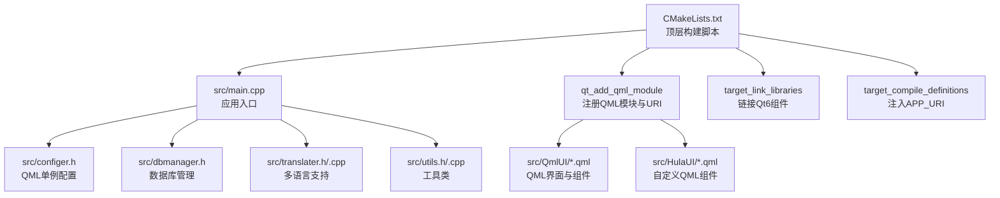
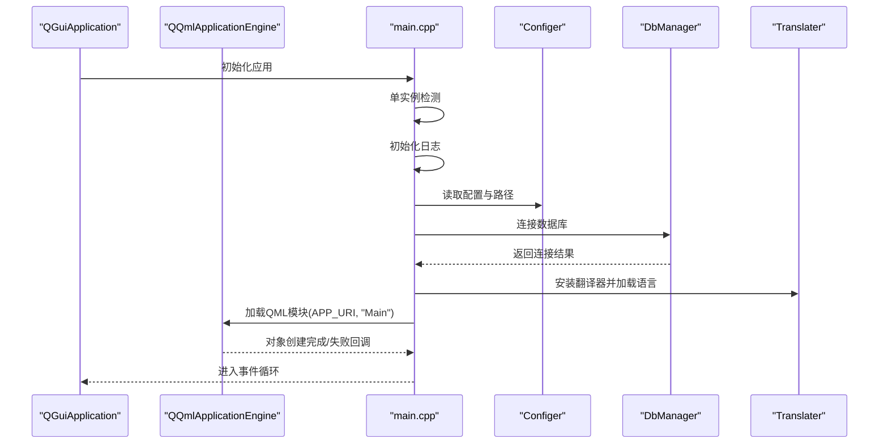
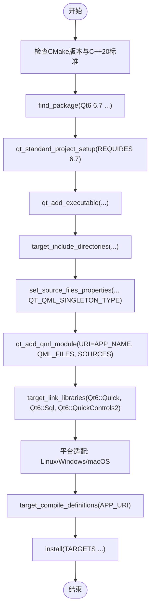
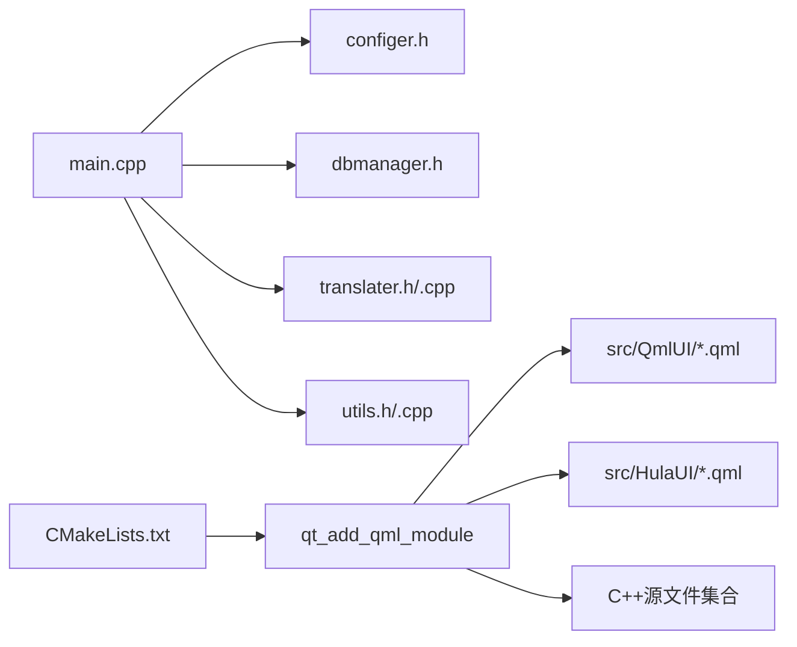

# 编译错误排查

<cite>
**本文引用的文件**
- [CMakeLists.txt](file://CMakeLists.txt)
- [README.md](file://README.md)
- [src/main.cpp](file://src/main.cpp)
- [src/common.h](file://src/common.h)
- [src/configer.h](file://src/configer.h)
- [src/dbmanager.h](file://src/dbmanager.h)
- [src/translater.h](file://src/translater.h)
- [src/translater.cpp](file://src/translater.cpp)
- [src/utils.h](file://src/utils.h)
- [src/utils.cpp](file://src/utils.cpp)
- [src/QmlUI/Main.qml](file://src/QmlUI/Main.qml)
</cite>

## 目录
1. [简介](#简介)
2. [项目结构](#项目结构)
3. [核心组件](#核心组件)
4. [架构总览](#架构总览)
5. [详细组件分析](#详细组件分析)
6. [依赖关系分析](#依赖关系分析)
7. [性能与构建建议](#性能与构建建议)
8. [故障排除指南](#故障排除指南)
9. [结论](#结论)
10. [附录](#附录)

## 简介
本指南面向在构建 QmlPlugins 项目时遇到编译错误的开发者，聚焦以下方面：
- CMake 配置错误与常见陷阱
- Qt 模块导入失败与版本不匹配
- QML 编译错误与资源路径问题
- 头文件包含路径与编译器警告处理
- 链接库配置错误与平台差异
- 不同 IDE（Visual Studio、Qt Creator、CLion）下的诊断方法

本指南以仓库现有配置与源码为依据，提供可落地的排障步骤与图示说明。

## 项目结构
该项目采用 CMake + Qt6/QML 的混合工程，核心要点：
- 使用 CMake 3.16+ 与 C++20 标准
- 通过 qt_standard_project_setup 与 qt_add_qml_module 管理 QML 模块
- 通过 target_link_libraries 链接 Qt6::Quick、Qt6::Sql、Qt6::QuickControls2
- 通过 set_target_properties 针对 Windows/macOS 平台进行打包与 GUI 属性设置
- 通过 target_compile_definitions 注入 APP_URI 宏供 QML 引用

图表来源
- [CMakeLists.txt:22-100](file://CMakeLists.txt#L22-L100)
- [src/main.cpp:17-96](file://src/main.cpp#L17-L96)

章节来源
- [CMakeLists.txt:1-137](file://CMakeLists.txt#L1-L137)
- [README.md:15-35](file://README.md#L15-L35)

## 核心组件
- 应用入口与引擎初始化：负责加载 QML 模块、设置上下文属性、安装翻译器与单实例检测。
- 配置与资源路径：集中于 Configer，提供多语言、资源路径、数据库文件等路径宏。
- 数据库管理：DbManager 提供连接、事务、查询与备份/恢复能力。
- 多语言支持：Translater 负责加载语言文件并安装到 QML 上下文。
- 工具类：Utils 提供目录遍历、复制、同步等实用功能，并注册为 QML 单例。

章节来源
- [src/main.cpp:17-96](file://src/main.cpp#L17-L96)
- [src/configer.h:52-96](file://src/configer.h#L52-L96)
- [src/dbmanager.h:52-192](file://src/dbmanager.h#L52-L192)
- [src/translater.h:43-88](file://src/translater.h#L43-L88)
- [src/translater.cpp:24-57](file://src/translater.cpp#L24-L57)
- [src/utils.h:21-44](file://src/utils.h#L21-L44)

## 架构总览
应用启动流程从 main.cpp 开始，初始化应用、单实例检测、日志、字体、数据库连接，随后加载 QML 模块并进入事件循环。

图表来源
- [src/main.cpp:17-96](file://src/main.cpp#L17-L96)
- [src/configer.h:98-120](file://src/configer.h#L98-L120)
- [src/dbmanager.h:79-84](file://src/dbmanager.h#L79-L84)
- [src/translater.cpp:24-37](file://src/translater.cpp#L24-L37)

## 详细组件分析

### CMake 构建系统
- 版本与标准：要求 CMake 3.16+，C++20；Windows 使用 /W4，其他平台使用 -Wall -Wextra -Wpedantic。
- Qt6 组件：查找 Quick、Sql、QuickControls2；通过 qt_standard_project_setup(REQUIRES 6.7) 固定最低版本。
- 可执行目标：qt_add_executable 注册源文件与头文件；target_include_directories 指定包含路径。
- QML 模块：先 set_source_files_properties 标记单例 QML，再 qt_add_qml_module 注册 URI 与 QML 文件列表；同时将 C++ 源文件加入模块。
- 链接库：target_link_libraries 链接 Qt6::Quick、Qt6::Sql、Qt6::QuickControls2。
- 平台适配：Linux 平台定义 QT_NO_FLOAT16_OPERATORS；Windows 设置 WIN32_EXECUTABLE 并附加资源文件；macOS 设置 Bundle 属性。
- 安装与输出：安装目标、输出目录位于上层 bin/lib。

图表来源
- [CMakeLists.txt:3-26](file://CMakeLists.txt#L3-L26)
- [CMakeLists.txt:28-100](file://CMakeLists.txt#L28-L100)
- [CMakeLists.txt:110-134](file://CMakeLists.txt#L110-L134)

章节来源
- [CMakeLists.txt:1-137](file://CMakeLists.txt#L1-L137)

### QML 模块与 URI
- CMake 中通过 qt_add_qml_module 将 URI 设为应用名，QML 侧通过 import QmlPlugins 1.0 引用。
- 项目中 Main.qml 明确 import 了该 URI，并使用 Loader 动态加载 Splash/Login/MainForm。
- 若出现“模块未找到”或“URI 未注册”，需检查 CMake 中 URI 与 QML import 是否一致，以及 qt_add_qml_module 是否正确注册。

章节来源
- [CMakeLists.txt:80-93](file://CMakeLists.txt#L80-L93)
- [src/QmlUI/Main.qml:1-40](file://src/QmlUI/Main.qml#L1-L40)

### 配置与资源路径
- Configer 提供多语言、资源、数据库等路径宏，例如 LANG_PATH、RES_PATH、DB_FILE 等。
- main.cpp 中通过 Configer 读取当前语言并初始化 Translater，随后安装到 QML 上下文。
- 若出现资源路径错误（如图片、语言文件找不到），优先核对 Configer 宏与实际资源目录结构。

章节来源
- [src/configer.h:52-96](file://src/configer.h#L52-L96)
- [src/main.cpp:54-58](file://src/main.cpp#L54-L58)
- [src/translater.cpp:24-37](file://src/translater.cpp#L24-L37)

### 数据库与错误码
- DbManager 提供连接、事务、查询与备份/恢复接口；错误信息通过 MessageInfo 与 ErrorCode 枚举传递。
- main.cpp 在启动阶段尝试连接数据库，失败会记录日志并退出。
- 若出现数据库相关错误，检查 DB_FILE 路径、SQLite 可用性与权限。

章节来源
- [src/dbmanager.h:79-167](file://src/dbmanager.h#L79-L167)
- [src/common.h:63-117](file://src/common.h#L63-L117)
- [src/main.cpp:46-50](file://src/main.cpp#L46-L50)

### 多语言与工具类
- Translater 支持从目录批量加载语言文件并安装到 QML 上下文；Utils 提供目录与文件操作。
- 若 QML 中字符串未本地化或工具类不可用，检查 Translater.init 调用与 Utils 的 QML 注册。

章节来源
- [src/translater.h:43-88](file://src/translater.h#L43-L88)
- [src/translater.cpp:24-57](file://src/translater.cpp#L24-L57)
- [src/utils.h:21-44](file://src/utils.h#L21-L44)

## 依赖关系分析
- C++ 源文件与 QML 源文件共同构成 QML 模块，CMake 通过 qt_add_qml_module 统一注册。
- 应用入口依赖 Configer、DbManager、Translater、Utils 等模块提供的功能。
- 平台差异通过条件编译与 target_properties 控制，避免跨平台构建问题。

图表来源
- [CMakeLists.txt:79-93](file://CMakeLists.txt#L79-L93)
- [src/main.cpp:17-96](file://src/main.cpp#L17-L96)

章节来源
- [CMakeLists.txt:79-100](file://CMakeLists.txt#L79-L100)
- [src/main.cpp:17-96](file://src/main.cpp#L17-L96)

## 性能与构建建议
- 合理使用并行构建：README 提供并行构建命令，有助于缩短构建时间。
- 谨慎开启编译器警告：MSVC 使用 /W4，其他平台使用 -Wall -Wextra -Wpedantic，便于早期发现潜在问题。
- 平台适配：Linux 定义 QT_NO_FLOAT16_OPERATORS；Windows 设置 WIN32_EXECUTABLE；macOS 设置 Bundle 属性，避免运行期异常。

章节来源
- [README.md:24-28](file://README.md#L24-L28)
- [CMakeLists.txt:16-20](file://CMakeLists.txt#L16-L20)
- [CMakeLists.txt:103-126](file://CMakeLists.txt#L103-L126)

## 故障排除指南

### 1. CMake 配置错误
常见症状
- 找不到 Qt6 组件或版本过低
- 未生成 QML 模块或 URI 未注册
- 链接阶段缺少 Qt 库
- 平台属性设置导致运行时异常

排查步骤
- 确认 Qt6 6.7+ 已安装且 CMake 能找到组件（Quick、Sql、QuickControls2）。
- 确保 qt_add_qml_module 的 URI 与 QML import 一致。
- 确认 target_link_libraries 包含 Qt6::Quick、Qt6::Sql、Qt6::QuickControls2。
- 针对 Linux 平台，确认已定义 QT_NO_FLOAT16_OPERATORS；Windows 设置 WIN32_EXECUTABLE；macOS 设置 Bundle 属性。

章节来源
- [CMakeLists.txt:22-26](file://CMakeLists.txt#L22-L26)
- [CMakeLists.txt:80-100](file://CMakeLists.txt#L80-L100)
- [CMakeLists.txt:103-126](file://CMakeLists.txt#L103-L126)

### 2. Qt 模块导入失败
常见症状
- CMake 报错：找不到 Qt6::Quick/Qt6::Sql/Qt6::QuickControls2
- Qt6 版本与项目要求不匹配（低于 6.7）

排查步骤
- 检查 Qt 安装路径与 CMake 变量（如 CMAKE_PREFIX_PATH）是否指向正确的 Qt6 6.7+ 安装目录。
- 在 CMake 配置阶段增加 -DCMAKE_PREFIX_PATH 指向 Qt 安装根目录。
- 确认 qt_standard_project_setup(REQUIRES 6.7) 与项目 README 的最低版本一致。

章节来源
- [CMakeLists.txt:22-26](file://CMakeLists.txt#L22-L26)
- [README.md:17-19](file://README.md#L17-L19)

### 3. QML 编译错误
常见症状
- “模块未找到”或“URI 未注册”
- Loader 加载的 QML 文件路径错误
- QML 单例类型未正确标记

排查步骤
- 确认 CMake 中 qt_add_qml_module 的 URI 与 QML import 一致（例如 import QmlPlugins 1.0）。
- 确认 set_source_files_properties 正确标记了单例 QML（HulaTheme.qml、DarkBlueTheme.qml、BlueTheme.qml、Themer.qml）。
- 确认 QML 文件路径使用相对路径，且与 CMake 中 QML_SOURCES 的相对路径保持一致。

章节来源
- [CMakeLists.txt:59-65](file://CMakeLists.txt#L59-L65)
- [CMakeLists.txt:80-93](file://CMakeLists.txt#L80-L93)
- [src/QmlUI/Main.qml:1-40](file://src/QmlUI/Main.qml#L1-L40)

### 4. 资源文件链接问题
常见症状
- 图片、语言文件、数据库文件路径错误
- 运行时资源访问失败

排查步骤
- 检查 Configer 中的路径宏（LANG_PATH、RES_PATH、DB_FILE 等）与实际资源目录结构是否一致。
- 确认 main.cpp 中 Translater.init 传入的语言目录路径有效。
- 在不同平台下验证相对路径与部署后路径的一致性。

章节来源
- [src/configer.h:52-96](file://src/configer.h#L52-L96)
- [src/main.cpp:54-58](file://src/main.cpp#L54-L58)
- [src/translater.cpp:24-37](file://src/translater.cpp#L24-L37)

### 5. 头文件包含路径问题
常见症状
- 编译器找不到头文件或包含顺序错误
- target_include_directories 未生效

排查步骤
- 确认 CMake 中已通过 target_include_directories 指定包含 src 目录。
- 确保 C++ 源文件中包含路径与实际文件位置一致。
- 避免在未创建目标前调用 target_include_directories。

章节来源
- [CMakeLists.txt:55](file://CMakeLists.txt#L55)
- [CMakeLists.txt:2](file://CMakeLists.txt#L2)

### 6. 链接库配置错误
常见症状
- 链接阶段报错：找不到 Qt6::Quick/Qt6::Sql/Qt6::QuickControls2
- 运行时报错：缺少 Qt 动态库

排查步骤
- 确认 target_link_libraries 中包含 Qt6::Quick、Qt6::Sql、Qt6::QuickControls2。
- 在 Windows 上确认已设置 WIN32_EXECUTABLE 并附加资源文件（ico.rc）。
- 在 Linux/macOS 上确认 Qt 安装完整且 CMake 能找到对应库。

章节来源
- [CMakeLists.txt:96-100](file://CMakeLists.txt#L96-L100)
- [CMakeLists.txt:110-117](file://CMakeLists.txt#L110-L117)

### 7. 编译器警告处理
常见症状
- 编译器产生大量警告，影响构建稳定性

排查步骤
- Windows 使用 /W4，其他平台使用 -Wall -Wextra -Wpedantic；逐步解决警告，提升代码质量。
- 对第三方或平台特定代码，使用编译器抑制选项或条件编译。

章节来源
- [CMakeLists.txt:16-20](file://CMakeLists.txt#L16-L20)

### 8. 不同 IDE 下的诊断方法

- Visual Studio
  - 使用 CMake 首选项选择合适的 Toolchain（VS 2019/2022），确保 Qt6 与 MSVC 版本兼容。
  - 在配置阶段设置 CMAKE_PREFIX_PATH 指向 Qt 安装目录。
  - 关注 CMake 配置输出与生成日志，定位 find_package 与 qt_standard_project_setup 的问题。

- Qt Creator
  - 选择 Kit 时指定正确的 Qt 版本（6.7+）与 MinGW/MSVC/Clang 工具链。
  - 使用“CMake”模式，确保 CMAKE_PREFIX_PATH 指向 Qt 安装根目录。
  - 利用内置的构建日志查看器定位具体错误行号与文件。

- CLion
  - 在 CMake Settings 中设置 CMAKE_PREFIX_PATH 与 CMAKE_BUILD_TYPE。
  - 使用“Build”菜单查看 CMake 配置与构建日志，关注 Qt 组件查找与模块注册阶段。
  - 如遇平台差异，检查 CMake 条件分支（WIN32/APPLE/UNIX）与 target_properties 设置。

章节来源
- [CMakeLists.txt:22-26](file://CMakeLists.txt#L22-L26)
- [CMakeLists.txt:110-126](file://CMakeLists.txt#L110-L126)

## 结论
QmlPlugins 的编译问题多源于 CMake 配置、Qt 组件版本、QML 模块注册与资源路径四类。遵循本指南的排查步骤，结合不同 IDE 的配置方式，可快速定位并解决问题。建议在团队内统一 CMake 与 Qt 版本，规范资源路径与 QML 模块 URI，以减少重复性错误。

## 附录

### A. 常见错误与对应处理清单
- 找不到 Qt6 组件：检查 CMAKE_PREFIX_PATH 与 Qt 安装路径。
- URI 未注册：确认 CMake 中 URI 与 QML import 一致。
- Loader 路径错误：核对相对路径与 CMake QML_SOURCES。
- 资源路径错误：核对 Configer 宏与实际资源目录。
- 链接失败：确认 target_link_libraries 包含所需组件。
- 平台属性：Linux 定义 QT_NO_FLOAT16_OPERATORS；Windows 设置 WIN32_EXECUTABLE；macOS 设置 Bundle。

章节来源
- [CMakeLists.txt:22-26](file://CMakeLists.txt#L22-L26)
- [CMakeLists.txt:80-100](file://CMakeLists.txt#L80-L100)
- [CMakeLists.txt:103-126](file://CMakeLists.txt#L103-L126)
- [src/configer.h:52-96](file://src/configer.h#L52-L96)
- [src/QmlUI/Main.qml:1-40](file://src/QmlUI/Main.qml#L1-L40)