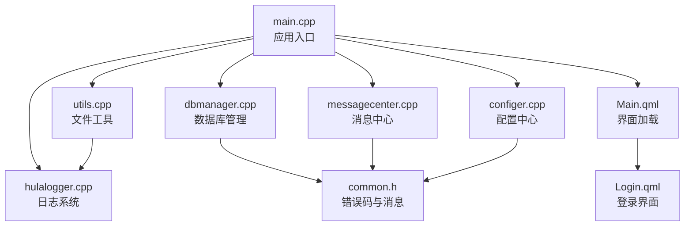
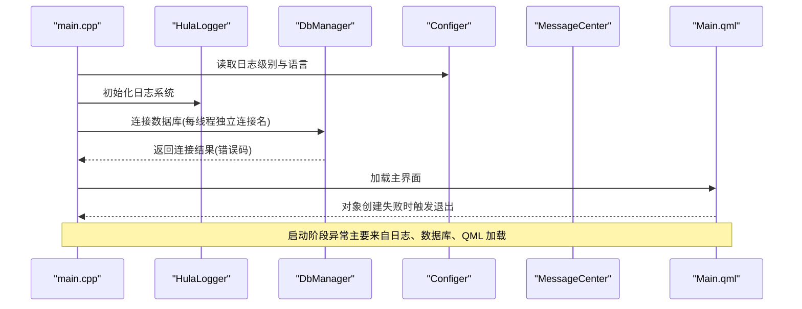
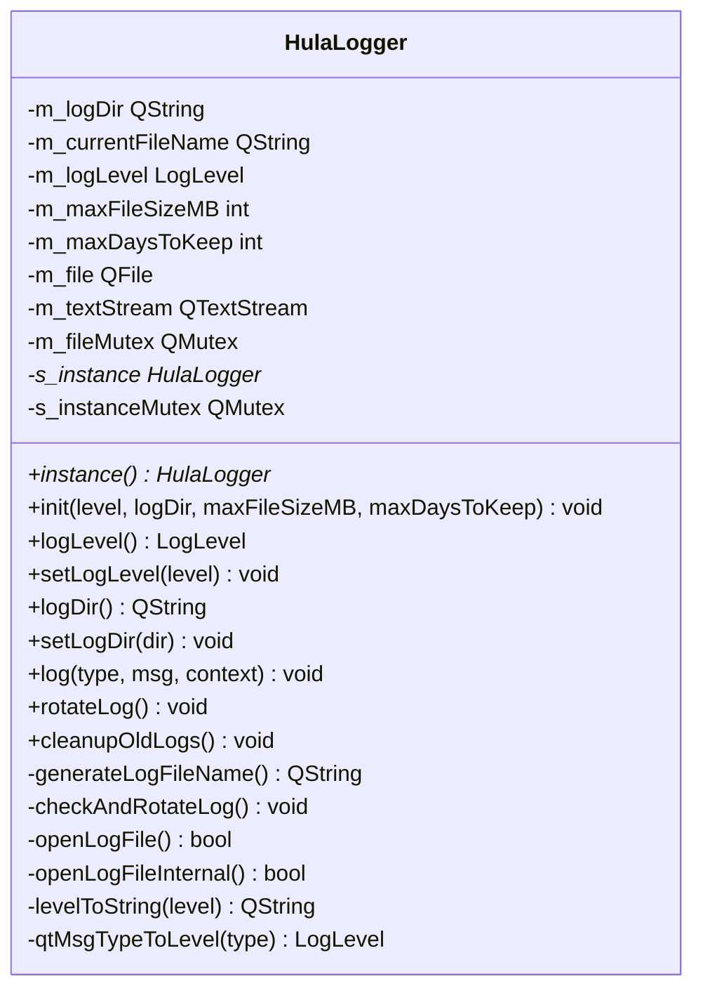
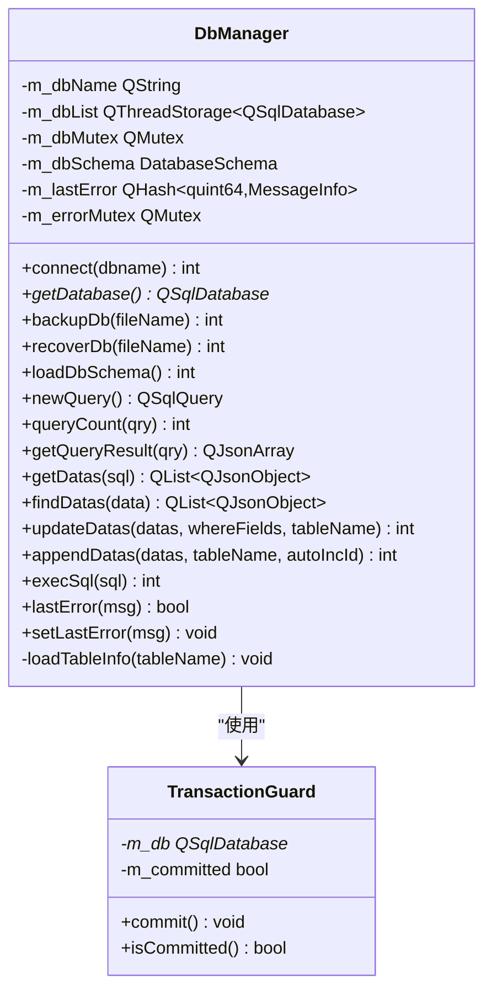
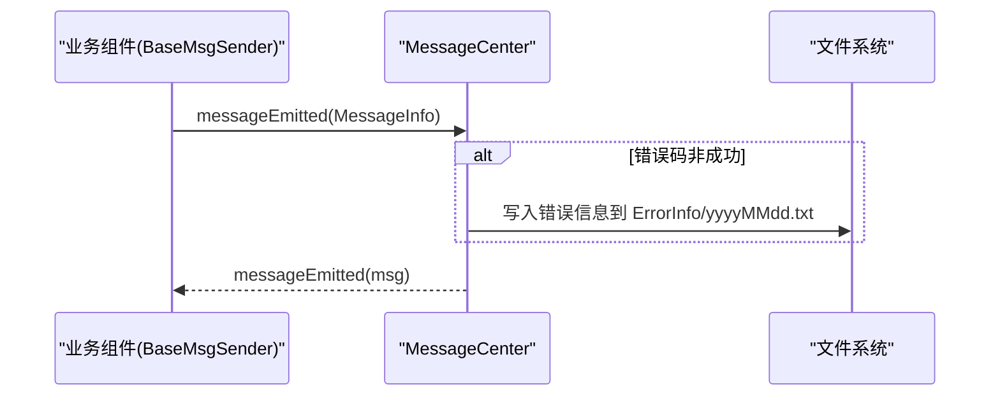
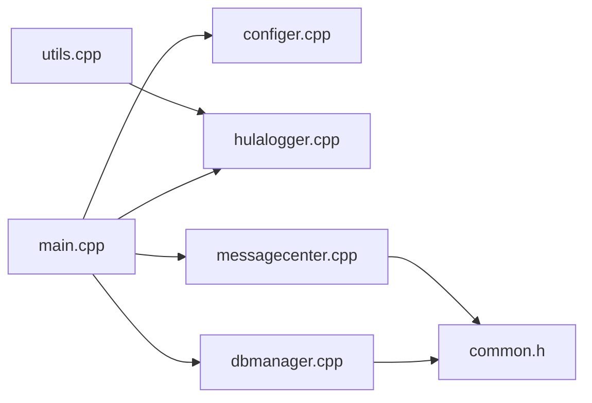
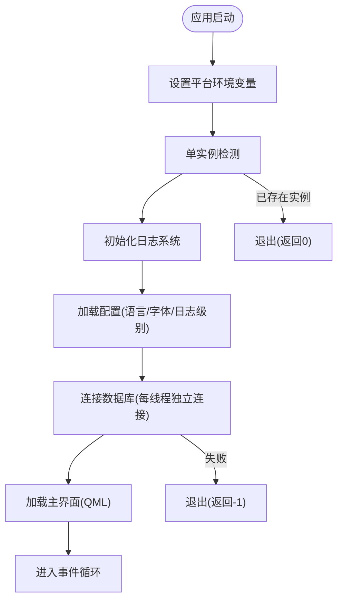

# 运行时异常处理

<cite>
**本文档引用的文件**
- [main.cpp](file://src/main.cpp)
- [hulalogger.h](file://src/hulalogger.h)
- [hulalogger.cpp](file://src/hulalogger.cpp)
- [dbmanager.h](file://src/dbmanager.h)
- [dbmanager.cpp](file://src/dbmanager.cpp)
- [common.h](file://src/common.h)
- [basemsgsender.h](file://src/basemsgsender.h)
- [basemsgsender.cpp](file://src/basemsgsender.cpp)
- [configer.h](file://src/configer.h)
- [configer.cpp](file://src/configer.cpp)
- [messagecenter.h](file://src/messagecenter.h)
- [messagecenter.cpp](file://src/messagecenter.cpp)
- [utils.h](file://src/utils.h)
- [utils.cpp](file://src/utils.cpp)
- [Main.qml](file://src/QmlUI/Main.qml)
- [Login.qml](file://src/QmlUI/Login.qml)
- [README.md](file://README.md)
</cite>

## 目录
1. [简介](#简介)
2. [项目结构](#项目结构)
3. [核心组件](#核心组件)
4. [架构总览](#架构总览)
5. [详细组件分析](#详细组件分析)
6. [依赖关系分析](#依赖关系分析)
7. [性能考量](#性能考量)
8. [故障排除指南](#故障排除指南)
9. [结论](#结论)
10. [附录](#附录)

## 简介
本指南聚焦于 QmlPlugins 项目的运行时异常处理与故障排除，涵盖应用启动失败、崩溃异常、内存泄漏、线程安全问题、日志系统使用、异常堆栈跟踪、调试器技巧，以及常见异常类型（数据库连接异常、文件权限问题、UI 渲染异常）的快速定位与修复方案。文档以代码为依据，结合实际运行流程，帮助开发者高效定位并解决问题。

## 项目结构
项目采用 Qt6/QML 跨平台架构，核心由 C++ 层（业务与基础设施）与 QML 层（界面与交互）构成。关键运行时组件包括：
- 应用入口与生命周期管理
- 日志系统（线程安全、轮转、级别控制）
- 数据库管理（SQLite，事务守卫，连接池策略）
- 配置与消息中心（错误持久化与 UI 通知）
- 文件工具与资源管理
- QML 界面加载与异常传播

**图表来源**
- [main.cpp:17-96](file://src/main.cpp#L17-L96)
- [hulalogger.cpp:17-96](file://src/hulalogger.cpp#L17-L96)
- [dbmanager.cpp:51-90](file://src/dbmanager.cpp#L51-L90)
- [configer.cpp:42-50](file://src/configer.cpp#L42-L50)
- [messagecenter.cpp:101-116](file://src/messagecenter.cpp#L101-L116)
- [utils.cpp:12-76](file://src/utils.cpp#L12-L76)
- [Main.qml:1-41](file://src/QmlUI/Main.qml#L1-L41)
- [Login.qml:1-200](file://src/QmlUI/Login.qml#L1-L200)

**章节来源**
- [README.md:1-50](file://README.md#L1-L50)
- [main.cpp:17-96](file://src/main.cpp#L17-L96)
- [Main.qml:1-41](file://src/QmlUI/Main.qml#L1-L41)

## 核心组件
- 日志系统（HulaLogger）
  - 单例、线程安全、文件轮转、级别过滤、自动清理过期日志
  - 通过 Qt 消息处理器统一拦截并落盘
- 数据库管理（DbManager）
  - 每线程独立连接名，避免并发冲突
  - 事务守卫（RAII）确保异常回滚
  - WAL 模式与 busy_timeout 配置降低锁竞争
- 配置中心（Configer）
  - QML 可直接访问的单例，提供日志级别、语言、主题等配置项
- 消息中心（MessageCenter）
  - 统一接收业务错误，持久化到本地文件，驱动 UI 提示
- 文件工具（Utils）
  - 目录遍历、文件复制/同步、时间戳比较与错误日志记录

**章节来源**
- [hulalogger.h:25-175](file://src/hulalogger.h#L25-L175)
- [hulalogger.cpp:23-172](file://src/hulalogger.cpp#L23-L172)
- [dbmanager.h:31-192](file://src/dbmanager.h#L31-L192)
- [dbmanager.cpp:14-90](file://src/dbmanager.cpp#L14-L90)
- [configer.h:98-277](file://src/configer.h#L98-L277)
- [configer.cpp:42-50](file://src/configer.cpp#L42-L50)
- [messagecenter.h:27-127](file://src/messagecenter.h#L27-L127)
- [messagecenter.cpp:101-116](file://src/messagecenter.cpp#L101-L116)
- [utils.h:21-82](file://src/utils.h#L21-L82)
- [utils.cpp:12-76](file://src/utils.cpp#L12-L76)

## 架构总览
应用启动流程与异常传播路径如下：

**图表来源**
- [main.cpp:32-50](file://src/main.cpp#L32-L50)
- [hulalogger.cpp:45-79](file://src/hulalogger.cpp#L45-L79)
- [dbmanager.cpp:51-90](file://src/dbmanager.cpp#L51-L90)
- [Main.qml:31-41](file://src/QmlUI/Main.qml#L31-L41)

## 详细组件分析

### 日志系统（HulaLogger）
- 单例与线程安全
  - 静态实例与互斥锁保证初始化安全
  - 写入过程使用文件级互斥，避免竞态
- 日志轮转与清理
  - 基于大小与日期的轮转，自动清理过期日志
- 级别控制与消息处理
  - Qt 消息处理器统一拦截，按级别过滤输出
  - 调试/发布模式差异化的上下文信息

**图表来源**
- [hulalogger.h:49-167](file://src/hulalogger.h#L49-L167)
- [hulalogger.cpp:23-331](file://src/hulalogger.cpp#L23-L331)

**章节来源**
- [hulalogger.h:25-175](file://src/hulalogger.h#L25-L175)
- [hulalogger.cpp:23-172](file://src/hulalogger.cpp#L23-L172)

### 数据库管理（DbManager）
- 连接策略
  - 以线程 ID 作为连接名，避免多线程共享连接导致的锁争用
  - 连接断开时自动重连
- 事务与一致性
  - TransactionGuard 构造开启事务，析构未提交则回滚
  - 批量写入使用事务，提升性能与一致性
- 错误传播
  - setLastError 通过 qCritical 输出并发出 messageEmitted 信号
  - 上层通过 lastError 获取当前线程错误

**图表来源**
- [dbmanager.h:31-192](file://src/dbmanager.h#L31-L192)
- [dbmanager.cpp:14-90](file://src/dbmanager.cpp#L14-L90)

**章节来源**
- [dbmanager.h:31-192](file://src/dbmanager.h#L31-L192)
- [dbmanager.cpp:51-90](file://src/dbmanager.cpp#L51-L90)
- [common.h:50-159](file://src/common.h#L50-L159)

### 配置中心与消息中心
- 配置中心（Configer）
  - 提供日志级别、语言、字体、主题等配置项
  - 通过 QML 单例暴露，便于前端直接使用
- 消息中心（MessageCenter）
  - 接收业务错误消息，持久化到本地 Ini 文件
  - 提供查询、删除接口，驱动 UI 提示

**图表来源**
- [basemsgsender.h:10-35](file://src/basemsgsender.h#L10-L35)
- [basemsgsender.cpp:5-27](file://src/basemsgsender.cpp#L5-L27)
- [messagecenter.cpp:101-116](file://src/messagecenter.cpp#L101-L116)

**章节来源**
- [configer.h:98-277](file://src/configer.h#L98-L277)
- [configer.cpp:42-50](file://src/configer.cpp#L42-L50)
- [messagecenter.h:27-127](file://src/messagecenter.h#L27-L127)
- [messagecenter.cpp:27-116](file://src/messagecenter.cpp#L27-L116)

### 文件工具与资源管理
- 目录与文件操作
  - 目录遍历、文件复制/同步、时间戳比较
  - 复制失败时通过日志记录详细错误信息
- 资源路径与部署
  - 配置文件、数据库文件、图片与语言资源路径集中管理

**章节来源**
- [utils.h:21-82](file://src/utils.h#L21-L82)
- [utils.cpp:12-76](file://src/utils.cpp#L12-L76)
- [configer.h:55-75](file://src/configer.h#L55-L75)

## 依赖关系分析
- 启动阶段依赖链
  - main → Configer（读取日志级别）→ HulaLogger（初始化）→ DbManager（连接数据库）→ QML 加载
- 错误传播链
  - 业务组件（DbManager/Utils）→ BaseMsgSender → MessageCenter → UI
- 并发与线程安全
  - DbManager 使用线程存储与互斥；HulaLogger 使用文件级互斥；MessageCenter 使用文件级互斥

**图表来源**
- [main.cpp:32-50](file://src/main.cpp#L32-L50)
- [configer.cpp:42-50](file://src/configer.cpp#L42-L50)
- [hulalogger.cpp:45-79](file://src/hulalogger.cpp#L45-L79)
- [dbmanager.cpp:51-90](file://src/dbmanager.cpp#L51-L90)
- [messagecenter.cpp:101-116](file://src/messagecenter.cpp#L101-L116)
- [utils.cpp:12-76](file://src/utils.cpp#L12-L76)
- [common.h:50-159](file://src/common.h#L50-L159)

**章节来源**
- [main.cpp:32-50](file://src/main.cpp#L32-L50)
- [dbmanager.cpp:51-90](file://src/dbmanager.cpp#L51-L90)
- [hulalogger.cpp:45-79](file://src/hulalogger.cpp#L45-L79)
- [messagecenter.cpp:101-116](file://src/messagecenter.cpp#L101-L116)
- [utils.cpp:12-76](file://src/utils.cpp#L12-L76)

## 性能考量
- 数据库
  - WAL 模式与 busy_timeout 降低锁冲突概率，适合高并发写入场景
  - 事务批量写入减少磁盘 IO
- 日志
  - 文件轮转与过期清理避免日志膨胀
  - 级别过滤减少不必要的写入
- UI
  - QML Loader 异步加载减少首屏阻塞
  - 单例配置与消息中心避免重复创建

[本节为通用指导，无需具体文件分析]

## 故障排除指南

### 一、应用启动失败
- 常见原因
  - 单实例检测：已有实例运行时直接退出
  - 数据库连接失败：数据库文件不可用或权限不足
  - QML 对象创建失败：资源缺失或语法错误
- 诊断步骤
  - 检查日志目录与权限（日志初始化在启动早期进行）
  - 确认数据库文件路径与权限（DB_FILE）
  - 观察 objectCreationFailed 退出行为
- 修复建议
  - 确保日志目录存在且可写
  - 确保数据库文件存在且可读写
  - 修复 QML 资源路径与语法

**章节来源**
- [main.cpp:24-30](file://src/main.cpp#L24-L30)
- [main.cpp:46-50](file://src/main.cpp#L46-L50)
- [main.cpp:87-92](file://src/main.cpp#L87-L92)
- [configer.h:70-71](file://src/configer.h#L70-L71)
- [hulalogger.cpp:45-79](file://src/hulalogger.cpp#L45-L79)

### 二、崩溃异常与堆栈跟踪
- 日志系统
  - 使用 HulaLogger 的 Qt 消息处理器拦截崩溃信息
  - 调试模式下包含文件、行号、函数名，便于定位
- 建议
  - 启用 Debug 级别日志，收集完整上下文
  - 结合系统崩溃转储（Windows dump / Linux core）分析

**章节来源**
- [hulalogger.cpp:76-172](file://src/hulalogger.cpp#L76-L172)

### 三、内存泄漏排查
- 建议
  - 使用 Qt 自带的内存分析工具（qInstallMessageHandler 捕获异常）
  - 关注大对象生命周期（QML Loader、数据库查询结果）
  - 确保 QML 对象与 C++ 对象正确释放（基类析构与 disconnect）

[本节为通用指导，无需具体文件分析]

### 四、线程安全问题
- 数据库
  - 每线程独立连接名，避免共享连接
  - 使用 TransactionGuard 确保事务一致性
- 日志与消息
  - 文件级互斥防止并发写入冲突
- 建议
  - 避免在非主线程直接操作 UI
  - 使用 Qt::QueuedConnection 进行跨线程通信

**章节来源**
- [dbmanager.cpp:59-64](file://src/dbmanager.cpp#L59-L64)
- [dbmanager.cpp:24-30](file://src/dbmanager.cpp#L24-L30)
- [hulalogger.cpp:154-164](file://src/hulalogger.cpp#L154-L164)
- [messagecenter.cpp:29-31](file://src/messagecenter.cpp#L29-L31)

### 五、日志系统使用与调试
- 初始化
  - 启动时根据 Configer.logLevel() 初始化日志级别
  - 日志目录默认位于应用目录下 Log/，可动态变更
- 级别与轮转
  - Debug/Info/Warning/Critical/Fatal 五级
  - 按大小与日期轮转，自动清理过期日志
- 调试技巧
  - 在关键路径调用 log() 记录上下文
  - 使用日志级别过滤无关信息，聚焦问题域

**章节来源**
- [main.cpp:32-32](file://src/main.cpp#L32-L32)
- [configer.cpp:42-50](file://src/configer.cpp#L42-L50)
- [hulalogger.h:67-105](file://src/hulalogger.h#L67-L105)
- [hulalogger.cpp:45-79](file://src/hulalogger.cpp#L45-L79)

### 六、常见异常类型与快速修复

#### 1) 数据库连接异常
- 症状
  - 启动即返回错误码，无法继续
- 诊断
  - 检查数据库文件是否存在与可读写
  - 查看 qCritical 输出的错误文本
- 修复
  - 确保 DB_FILE 路径正确
  - 检查文件权限与磁盘空间
  - 如需恢复，使用 DbManager::recoverDb

**章节来源**
- [main.cpp:46-50](file://src/main.cpp#L46-L50)
- [dbmanager.cpp:51-90](file://src/dbmanager.cpp#L51-L90)
- [dbmanager.cpp:157-223](file://src/dbmanager.cpp#L157-L223)

#### 2) 文件权限问题
- 症状
  - 复制/同步/创建目录失败，日志出现权限相关错误
- 诊断
  - 查看 Utils::copyDir/updateFile/syncDir 的错误日志
- 修复
  - 提升目标目录权限或更换可写路径
  - 确保源文件存在且可读

**章节来源**
- [utils.cpp:67-71](file://src/utils.cpp#L67-L71)
- [utils.cpp:102-106](file://src/utils.cpp#L102-L106)
- [utils.cpp:231-233](file://src/utils.cpp#L231-L233)
- [utils.cpp:297-300](file://src/utils.cpp#L297-L300)

#### 3) UI 渲染异常
- 症状
  - QML 加载失败，应用退出
- 诊断
  - 关注 objectCreationFailed 信号
  - 检查资源路径（Images/Languages/Splash 等）
- 修复
  - 确保资源文件存在于打包路径
  - 使用 Loader 异步加载，避免阻塞

**章节来源**
- [main.cpp:87-92](file://src/main.cpp#L87-L92)
- [Main.qml:14-39](file://src/QmlUI/Main.qml#L14-L39)
- [Login.qml:63-117](file://src/QmlUI/Login.qml#L63-L117)

### 七、调试器使用技巧
- Qt Creator
  - 断点设置在关键业务函数（如 DbManager::connect、Utils::copyDir）
  - 观察线程切换与互斥锁状态
- 日志辅助
  - 在异常分支增加 HulaLogger::log，记录关键变量与调用栈上下文
- QML 调试
  - 使用 QQmlDebug 与 QML 控制台查看属性与信号

[本节为通用指导，无需具体文件分析]

## 结论
QmlPlugins 通过完善的日志系统、线程安全的数据库管理、统一的消息中心与健壮的文件工具，构建了可靠的运行时异常处理体系。遵循本文的诊断与修复流程，可快速定位并解决启动失败、数据库异常、文件权限与 UI 渲染等问题，同时借助日志与调试器技巧，持续优化系统稳定性与可维护性。

## 附录

### A. 关键错误码速查
- 数据库模块：DbOpenFailed、DbBackupFailed、DbRecoverFailed、DbExecuteFailed、DbConnectionLost
- 文件操作：FileNotFound、FileReadFailed、FileWriteFailed、FilePermissionDenied、FileSizeExceeded
- 业务逻辑：BusinessError、InvalidState、OperationNotAllowed、ResourceBusy、QuotaExceeded

**章节来源**
- [common.h:75-117](file://src/common.h#L75-L117)

### B. 启动流程与关键节点

**图表来源**
- [main.cpp:17-96](file://src/main.cpp#L17-L96)
- [configer.cpp:42-50](file://src/configer.cpp#L42-L50)
- [hulalogger.cpp:45-79](file://src/hulalogger.cpp#L45-L79)
- [dbmanager.cpp:51-90](file://src/dbmanager.cpp#L51-L90)