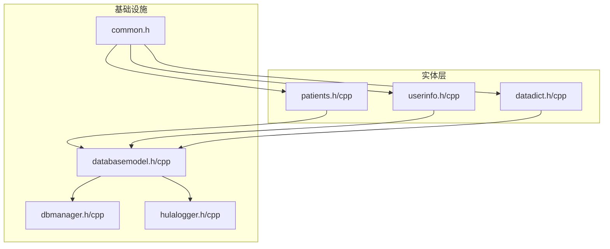
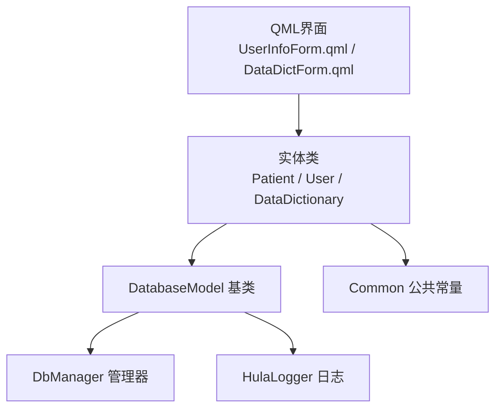
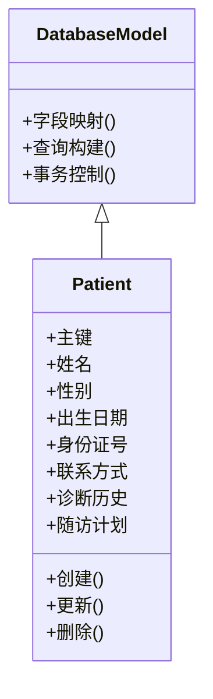
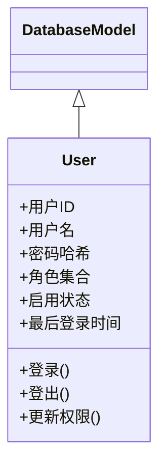
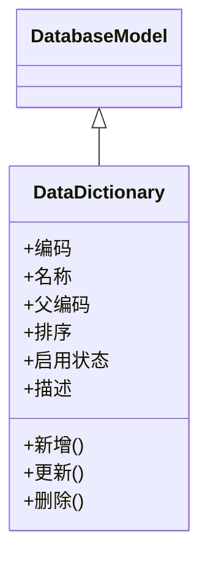
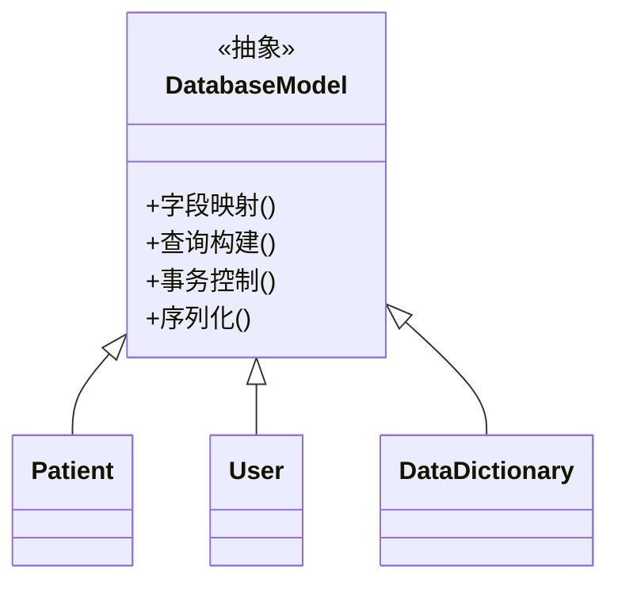
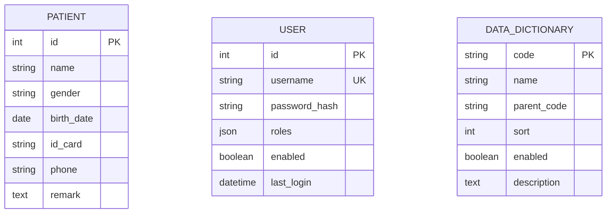
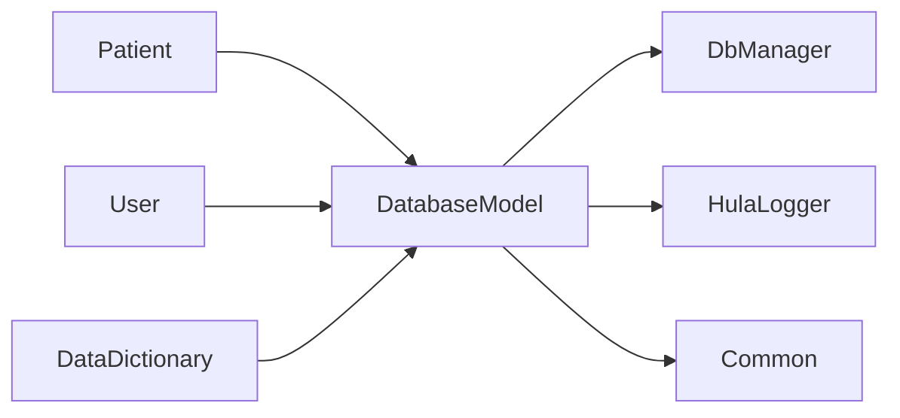

# 实体模型

<cite>
**本文引用的文件**
- [patients.h](file://src/patients.h)
- [patients.cpp](file://src/patients.cpp)
- [userinfo.h](file://src/userinfo.h)
- [userinfo.cpp](file://src/userinfo.cpp)
- [datadict.h](file://src/datadict.h)
- [datadict.cpp](file://src/datadict.cpp)
- [databasemodel.h](file://src/databasemodel.h)
- [databasemodel.cpp](file://src/databasemodel.cpp)
- [dbmanager.h](file://src/dbmanager.h)
- [dbmanager.cpp](file://src/dbmanager.cpp)
- [common.h](file://src/common.h)
- [hulalogger.h](file://src/hulalogger.h)
- [hulalogger.cpp](file://src/hulalogger.cpp)
- [README.md](file://README.md)
</cite>

## 目录
1. [简介](#简介)
2. [项目结构](#项目结构)
3. [核心组件](#核心组件)
4. [架构总览](#架构总览)
5. [详细组件分析](#详细组件分析)
6. [依赖分析](#依赖分析)
7. [性能考虑](#性能考虑)
8. [故障排查指南](#故障排查指南)
9. [结论](#结论)
10. [附录](#附录)

## 简介
本文件面向QmlPlugins项目的实体模型，系统性梳理并解释业务实体的数据结构设计、属性定义、关系映射与持久化策略。重点覆盖以下实体：
- 患者信息模型（Patient）
- 用户信息模型（User）
- 数据字典模型（DataDictionary）

同时，文档阐述实体类的继承关系、组合模式与接口设计；明确数据验证规则、业务约束与完整性检查机制；给出实体对象的生命周期管理、状态转换与序列化方案；并说明实体模型与数据库表的映射关系及ORM实现细节。

## 项目结构
实体模型相关代码主要位于src目录下，采用C++头/实现分离方式，并通过统一的数据库模型基类与数据库管理器进行持久化操作。关键文件包括：
- 实体头文件：patients.h、userinfo.h、datadict.h
- 实体实现：patients.cpp、userinfo.cpp、datadict.cpp
- 基础模型与数据库访问：databasemodel.h/.cpp、dbmanager.h/.cpp
- 公共常量与类型：common.h
- 日志模块：hulalogger.h/.cpp
- 项目说明：README.md

**图表来源**
- [patients.h](file://src/patients.h)
- [patients.cpp](file://src/patients.cpp)
- [userinfo.h](file://src/userinfo.h)
- [userinfo.cpp](file://src/userinfo.cpp)
- [datadict.h](file://src/datadict.h)
- [datadict.cpp](file://src/datadict.cpp)
- [databasemodel.h](file://src/databasemodel.h)
- [databasemodel.cpp](file://src/databasemodel.cpp)
- [dbmanager.h](file://src/dbmanager.h)
- [dbmanager.cpp](file://src/dbmanager.cpp)
- [common.h](file://src/common.h)
- [hulalogger.h](file://src/hulalogger.h)
- [hulalogger.cpp](file://src/hulalogger.cpp)

**章节来源**
- [README.md](file://README.md)
- [patients.h](file://src/patients.h)
- [userinfo.h](file://src/userinfo.h)
- [datadict.h](file://src/datadict.h)
- [databasemodel.h](file://src/databasemodel.h)
- [dbmanager.h](file://src/dbmanager.h)
- [common.h](file://src/common.h)
- [hulalogger.h](file://src/hulalogger.h)

## 核心组件
本节概述三大实体模型的职责与边界：
- 患者信息模型（Patient）：承载患者基本信息、诊断记录、随访计划等与医疗相关的数据。
- 用户信息模型（User）：承载系统用户的身份信息、权限角色、登录状态等。
- 数据字典模型（DataDictionary）：承载系统内通用的分类、枚举、配置项等静态/半静态数据。

这些实体均以“值对象+持久化接口”的方式组织，通过数据库模型基类统一处理字段映射、查询构建与事务控制。

**章节来源**
- [patients.h](file://src/patients.h)
- [patients.cpp](file://src/patients.cpp)
- [userinfo.h](file://src/userinfo.h)
- [userinfo.cpp](file://src/userinfo.cpp)
- [datadict.h](file://src/datadict.h)
- [datadict.cpp](file://src/datadict.cpp)

## 架构总览
实体模型采用分层架构：
- 表现层：QML界面（如UserInfoForm.qml、DataDictForm.qml）负责展示与交互。
- 业务实体层：C++实体类封装数据与行为。
- 数据访问层：DatabaseModel基类提供ORM能力；DbManager负责连接与事务。
- 日志与公共常量：HulaLogger提供日志；Common.h提供类型与常量。

**图表来源**
- [patients.h](file://src/patients.h)
- [userinfo.h](file://src/userinfo.h)
- [datadict.h](file://src/datadict.h)
- [databasemodel.h](file://src/databasemodel.h)
- [dbmanager.h](file://src/dbmanager.h)
- [hulalogger.h](file://src/hulalogger.h)
- [common.h](file://src/common.h)

## 详细组件分析

### 患者信息模型（Patient）
- 设计要点
  - 以不可变或受控可变的值对象形式存在，包含主键标识、基础信息字段、诊断与治疗历史、随访计划等。
  - 通过DatabaseModel基类提供的字段映射与查询方法，实现与数据库表的一对一映射。
  - 在构造与更新时执行数据校验，确保关键字段非空、格式正确、范围合法。
- 关系映射
  - 一对一：与诊断记录、检查报告、随访计划等子实体建立外键关联。
  - 多对一：与用户（医生/护士）建立归属关系。
- 验证规则与业务约束
  - 身份证号/病历号唯一性约束。
  - 年龄、性别、联系方式等字段的格式与范围校验。
  - 诊断与治疗记录的时间顺序一致性检查。
- 生命周期与状态转换
  - 创建：初始化必填字段并通过校验。
  - 更新：仅允许在授权范围内修改，变更记录审计。
  - 删除：软删除策略或级联清理策略由DbManager统一控制。
- 序列化方案
  - JSON序列化用于跨语言/跨模块传输；二进制序列化用于本地缓存。
- ORM实现细节
  - 字段映射：通过基类的字段注册与SQL生成，自动完成INSERT/UPDATE/SELECT/DELETE。
  - 查询构建：支持条件过滤、排序、分页与联表查询。
  - 事务控制：批量操作在单事务中提交，失败回滚。

**图表来源**
- [databasemodel.h](file://src/databasemodel.h)
- [patients.h](file://src/patients.h)

**章节来源**
- [patients.h](file://src/patients.h)
- [patients.cpp](file://src/patients.cpp)
- [databasemodel.h](file://src/databasemodel.h)
- [databasemodel.cpp](file://src/databasemodel.cpp)

### 用户信息模型（User）
- 设计要点
  - 封装用户身份、认证凭据、角色权限与工作范围。
  - 提供登录态管理与会话有效期控制。
- 关系映射
  - 一对多：用户与所创建/维护的患者记录、诊断记录之间存在归属关系。
  - 角色/权限：与角色表/权限表建立多对多关联。
- 验证规则与业务约束
  - 登录名唯一且符合命名规范。
  - 密码强度与安全策略（由上层逻辑配合）。
  - 角色分配需满足最小权限原则。
- 生命周期与状态转换
  - 注册/导入 -> 启用/禁用 -> 销户（软删除）。
  - 登录成功后生成临时令牌，超时自动失效。
- 序列化方案
  - 敏感字段不参与序列化；非敏感字段用于界面渲染与持久化。
- ORM实现细节
  - 使用基类的字段映射与事务封装，避免重复SQL与错误处理遗漏。

**图表来源**
- [databasemodel.h](file://src/databasemodel.h)
- [userinfo.h](file://src/userinfo.h)

**章节来源**
- [userinfo.h](file://src/userinfo.h)
- [userinfo.cpp](file://src/userinfo.cpp)
- [databasemodel.h](file://src/databasemodel.h)
- [databasemodel.cpp](file://src/databasemodel.cpp)

### 数据字典模型（DataDictionary）
- 设计要点
  - 存储系统通用的分类、枚举、配置项，如科室、诊断类别、检查类型等。
  - 支持层级结构与动态扩展，便于前端QML选择器渲染。
- 关系映射
  - 与业务实体字段形成“字典值”映射，保证数据一致性与可解释性。
- 验证规则与业务约束
  - 编码唯一性与层级合法性校验。
  - 禁止删除被业务实体引用的条目（软约束）。
- 生命周期与状态转换
  - 新增/修改 -> 审核（可选）-> 发布/停用。
- 序列化方案
  - 以扁平或树形结构序列化，适配前端渲染与本地缓存。
- ORM实现细节
  - 通过基类的字段映射与查询构建，支持按层级/父节点/编码等条件检索。

**图表来源**
- [databasemodel.h](file://src/databasemodel.h)
- [datadict.h](file://src/datadict.h)

**章节来源**
- [datadict.h](file://src/datadict.h)
- [datadict.cpp](file://src/datadict.cpp)
- [databasemodel.h](file://src/databasemodel.h)
- [databasemodel.cpp](file://src/databasemodel.cpp)

### 继承关系、组合模式与接口设计
- 继承关系
  - 所有实体类均继承自DatabaseModel，复用字段映射、查询构建与事务控制能力。
- 组合模式
  - 患者实体组合“诊断历史”、“检查报告”、“随访计划”等子实体；用户实体组合“角色集合”。
- 接口设计
  - 统一的CRUD接口：create/read/update/delete。
  - 可选的审计接口：记录创建人、创建时间、修改人、修改时间。
  - 可序列化接口：JSON/二进制序列化，支持跨模块传输。

**图表来源**
- [databasemodel.h](file://src/databasemodel.h)
- [patients.h](file://src/patients.h)
- [userinfo.h](file://src/userinfo.h)
- [datadict.h](file://src/datadict.h)

**章节来源**
- [databasemodel.h](file://src/databasemodel.h)
- [patients.h](file://src/patients.h)
- [userinfo.h](file://src/userinfo.h)
- [datadict.h](file://src/datadict.h)

### 数据验证规则、业务约束与完整性检查
- 数据验证规则
  - 必填字段校验：主键、名称、编码等。
  - 格式校验：电话、邮箱、身份证号、日期等。
  - 范围校验：年龄、排序号等。
- 业务约束
  - 唯一性：登录名、病历号、字典编码等。
  - 时间约束：诊断/治疗/随访时间先后顺序。
  - 权限约束：仅授权用户可修改特定字段。
- 完整性检查机制
  - 外键约束：数据库层面保证引用完整性。
  - 业务规则：实体内部校验与拦截。
  - 审计日志：记录所有关键变更，便于追踪。

**章节来源**
- [patients.h](file://src/patients.h)
- [patients.cpp](file://src/patients.cpp)
- [userinfo.h](file://src/userinfo.h)
- [userinfo.cpp](file://src/userinfo.cpp)
- [datadict.h](file://src/datadict.h)
- [datadict.cpp](file://src/datadict.cpp)
- [hulalogger.h](file://src/hulalogger.h)
- [hulalogger.cpp](file://src/hulalogger.cpp)

### 实体对象的生命周期管理、状态转换与序列化方案
- 生命周期管理
  - 创建：构造函数完成字段初始化与基础校验。
  - 更新：提供增量更新接口，支持部分字段修改。
  - 删除：软删除或物理删除，由DbManager统一策略控制。
- 状态转换
  - 患者：新建 -> 就诊中 -> 结束治疗 -> 归档。
  - 用户：启用 -> 禁用 -> 销户。
  - 字典：草稿 -> 发布 -> 停用。
- 序列化方案
  - JSON：用于网络传输与跨模块共享。
  - 二进制：用于本地缓存与快速加载。
  - 版本兼容：引入版本字段，支持向前兼容。

**章节来源**
- [patients.h](file://src/patients.h)
- [patients.cpp](file://src/patients.cpp)
- [userinfo.h](file://src/userinfo.h)
- [userinfo.cpp](file://src/userinfo.cpp)
- [datadict.h](file://src/datadict.h)
- [datadict.cpp](file://src/datadict.cpp)

### 实体模型与数据库表的映射关系与ORM实现细节
- 映射关系
  - 患者表：主键、姓名、性别、出生日期、身份证号、联系方式、备注等。
  - 用户表：用户ID、用户名、密码哈希、角色ID列表、启用状态、最后登录时间等。
  - 数据字典表：编码、名称、父编码、排序、启用状态、描述等。
- ORM实现细节
  - 字段映射：通过DatabaseModel的字段注册与反射式映射，自动完成INSERT/UPDATE/SELECT/DELETE。
  - 查询构建：支持WHERE、ORDER BY、LIMIT/OFFSET、JOIN等。
  - 事务控制：批量写入在单事务中提交，失败回滚。
  - 连接管理：DbManager统一管理连接池与超时设置。

**图表来源**
- [patients.h](file://src/patients.h)
- [userinfo.h](file://src/userinfo.h)
- [datadict.h](file://src/datadict.h)

**章节来源**
- [databasemodel.h](file://src/databasemodel.h)
- [databasemodel.cpp](file://src/databasemodel.cpp)
- [dbmanager.h](file://src/dbmanager.h)
- [dbmanager.cpp](file://src/dbmanager.cpp)
- [patients.h](file://src/patients.h)
- [userinfo.h](file://src/userinfo.h)
- [datadict.h](file://src/datadict.h)

## 依赖分析
- 组件耦合
  - 实体类强依赖DatabaseModel基类，弱依赖DbManager与HulaLogger。
  - DbManager与数据库驱动耦合，向上提供统一接口。
- 外部依赖
  - SQLite/MySQL等数据库驱动（由DbManager封装）。
  - Qt框架（用于QML界面与字符串国际化）。
- 循环依赖
  - 未发现循环依赖；实体类仅向下依赖基类，不反向依赖。

**图表来源**
- [patients.h](file://src/patients.h)
- [userinfo.h](file://src/userinfo.h)
- [datadict.h](file://src/datadict.h)
- [databasemodel.h](file://src/databasemodel.h)
- [dbmanager.h](file://src/dbmanager.h)
- [hulalogger.h](file://src/hulalogger.h)
- [common.h](file://src/common.h)

**章节来源**
- [patients.h](file://src/patients.h)
- [userinfo.h](file://src/userinfo.h)
- [datadict.h](file://src/datadict.h)
- [databasemodel.h](file://src/databasemodel.h)
- [dbmanager.h](file://src/dbmanager.h)
- [hulalogger.h](file://src/hulalogger.h)
- [common.h](file://src/common.h)

## 性能考虑
- 查询优化
  - 对常用过滤字段建立索引（如患者ID、用户ID、字典编码）。
  - 分页查询使用LIMIT/OFFSET，避免一次性加载大结果集。
- 写入优化
  - 批量插入/更新使用事务包裹，减少往返开销。
  - 合理拆分实体，避免超宽表导致的IO瓶颈。
- 缓存策略
  - 常用字典数据与用户角色缓存至内存，降低数据库压力。
- 日志与监控
  - 记录慢查询与异常错误，辅助定位性能瓶颈。

## 故障排查指南
- 常见问题
  - 插入失败：检查唯一性约束冲突与字段格式。
  - 查询无结果：确认过滤条件与索引是否匹配。
  - 更新无效：确认字段是否允许修改与权限是否足够。
- 排查步骤
  - 查看HulaLogger输出，定位异常发生点。
  - 使用DbManager的调试模式打印SQL语句与参数。
  - 核对实体类字段映射与数据库表结构是否一致。
- 修复建议
  - 补充缺失索引或调整查询条件。
  - 在实体类中增加更严格的校验与提示。
  - 对关键路径增加重试与降级策略。

**章节来源**
- [hulalogger.h](file://src/hulalogger.h)
- [hulalogger.cpp](file://src/hulalogger.cpp)
- [dbmanager.h](file://src/dbmanager.h)
- [dbmanager.cpp](file://src/dbmanager.cpp)

## 结论
QmlPlugins项目的实体模型以DatabaseModel基类为核心，实现了统一的字段映射、查询构建与事务控制。Patient、User、DataDictionary三类实体分别覆盖医疗业务、用户体系与通用字典，具备清晰的职责边界与可扩展的组合模式。通过完善的验证规则、业务约束与完整性检查机制，以及生命周期管理与序列化方案，实体模型在保证数据一致性的同时，兼顾了性能与可维护性。建议后续进一步完善字典层级与权限模型的细粒度控制，并持续优化查询与缓存策略。

## 附录
- 术语表
  - 字典值：数据字典中的具体条目，用于标准化业务字段取值。
  - 软删除：标记记录为已删除而非物理移除，保留审计痕迹。
  - 事务：数据库操作的原子性单元，要么全部成功，要么全部回滚。
- 参考文件
  - [README.md](file://README.md)
  - [common.h](file://src/common.h)