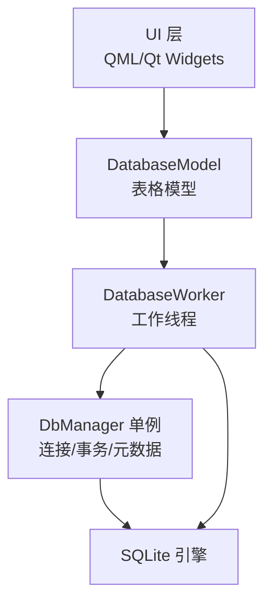
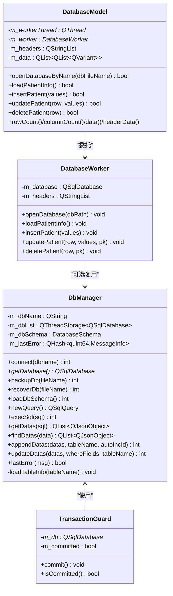
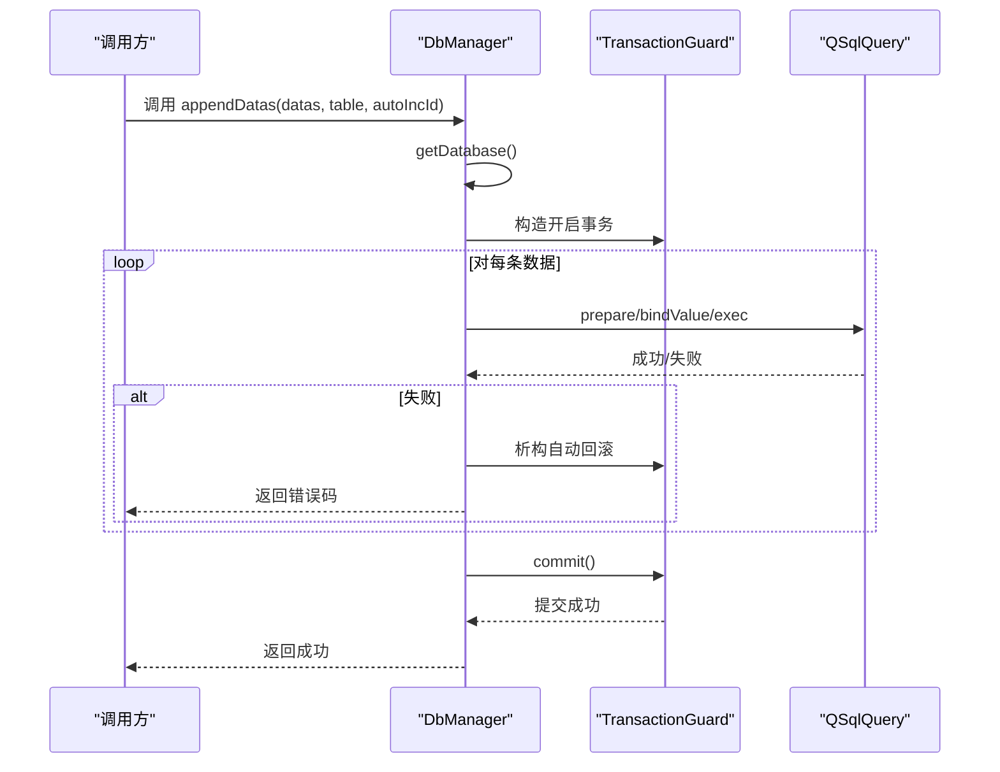
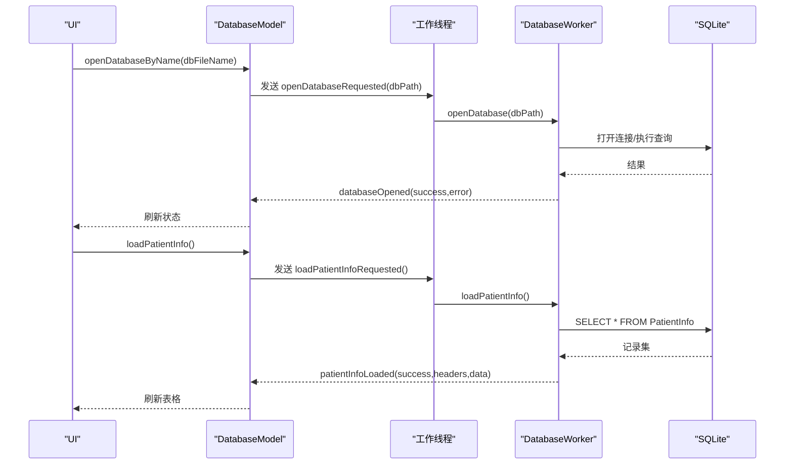
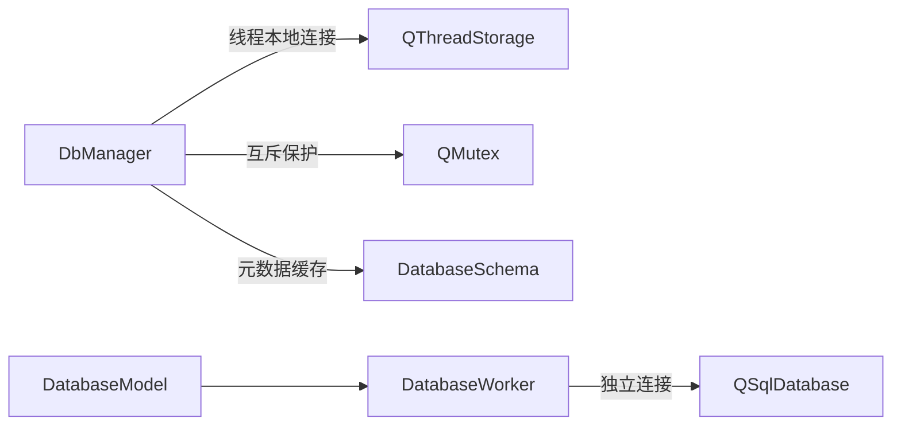

# 数据库架构

<cite>
**本文引用的文件**
- [dbmanager.h](file://src/dbmanager.h)
- [dbmanager.cpp](file://src/dbmanager.cpp)
- [databasemodel.h](file://src/databasemodel.h)
- [databasemodel.cpp](file://src/databasemodel.cpp)
</cite>

## 目录
1. [简介](#简介)
2. [项目结构](#项目结构)
3. [核心组件](#核心组件)
4. [架构总览](#架构总览)
5. [详细组件分析](#详细组件分析)
6. [依赖关系分析](#依赖关系分析)
7. [性能考量](#性能考量)
8. [故障排查指南](#故障排查指南)
9. [结论](#结论)
10. [附录](#附录)

## 简介
本文件系统性梳理 QmlPlugins 项目的数据库架构，覆盖数据库表结构设计原则、字段定义规范与索引策略建议；详述数据库连接管理、事务处理机制与并发控制；给出数据库初始化流程、表创建脚本与数据迁移方案；解释 SQLite 的选择原因、配置参数与性能优化策略；并提供备份、恢复与维护的最佳实践，以及常见数据库操作模式与错误处理机制。

## 项目结构
项目采用分层与职责分离的设计：
- 数据访问层：DbManager 单例负责数据库连接、事务、元数据加载、通用 CRUD 与查询封装。
- 视图模型层：DatabaseModel/DatabaseWorker 将数据库操作与 UI 解耦，通过信号槽在工作线程中执行数据库任务，并将结果回传主线程刷新界面。
- Qt SQL 抽象：统一使用 QSqlDatabase/QSqlQuery/QSqlRecord 等接口，屏蔽底层驱动差异。

图表来源
- [databasemodel.h:49-97](file://src/databasemodel.h#L49-L97)
- [databasemodel.cpp:181-202](file://src/databasemodel.cpp#L181-L202)
- [dbmanager.h:52-192](file://src/dbmanager.h#L52-L192)
- [dbmanager.cpp:51-90](file://src/dbmanager.cpp#L51-L90)

章节来源
- [databasemodel.h:1-97](file://src/databasemodel.h#L1-L97)
- [databasemodel.cpp:1-380](file://src/databasemodel.cpp#L1-L380)
- [dbmanager.h:1-192](file://src/dbmanager.h#L1-L192)
- [dbmanager.cpp:1-824](file://src/dbmanager.cpp#L1-L824)

## 核心组件
- DbManager 单例：提供线程安全的数据库连接、事务守卫、元数据缓存、通用查询与批量写入、备份/恢复等能力。
- DatabaseModel/DatabaseWorker：将数据库操作封装为 QAbstractTableModel，支持异步加载与编辑，内部通过工作线程避免阻塞 UI。
- 事务守卫 TransactionGuard：RAII 包装，构造开启事务，析构自动回滚，显式 commit 提交。

章节来源
- [dbmanager.h:31-192](file://src/dbmanager.h#L31-L192)
- [dbmanager.cpp:14-89](file://src/dbmanager.cpp#L14-L89)
- [databasemodel.h:20-97](file://src/databasemodel.h#L20-L97)
- [databasemodel.cpp:4-41](file://src/databasemodel.cpp#L4-L41)

## 架构总览
DbManager 以单例形式提供全局数据库服务，每个线程持有独立的 SQLite 连接（基于线程 ID 命名），并启用 WAL 模式与忙等待超时，提升并发写入稳定性。DatabaseModel 通过 DatabaseWorker 在专用线程中执行数据库操作，完成后通过信号槽将结果回传主线程刷新模型。

图表来源
- [dbmanager.h:31-192](file://src/dbmanager.h#L31-L192)
- [dbmanager.cpp:14-89](file://src/dbmanager.cpp#L14-L89)
- [databasemodel.h:20-97](file://src/databasemodel.h#L20-L97)
- [databasemodel.cpp:4-41](file://src/databasemodel.cpp#L4-L41)

## 详细组件分析

### DbManager：数据库管理与事务
- 连接管理
  - 每个线程独立连接，连接名为线程 ID，避免跨线程共享连接导致的竞态。
  - 启用 WAL 模式与 busy_timeout=5000，缓解并发写入“database is locked”问题。
  - 断线自动重连：若连接断开，getDatabase 会尝试重新 connect。
- 事务处理
  - TransactionGuard 构造开启事务，析构若未 commit 自动回滚，确保异常路径下的数据一致性。
  - 批量写入（appendDatas/updateDatas/execSql）均在事务内执行，减少提交次数，提高吞吐。
- 元数据与类型解析
  - 通过 sqlite_master 与 PRAGMA table_info 动态加载表结构，解析字段类型、长度、精度、是否主键/自增/可空、默认值等。
  - 支持 INT/INTEGER/AUTOINCREMENT、VARCHAR/TEXT、REAL/FLOAT/DOUBLE/DECIMAL、BOOL/BOOLEAN、DATE/TIME、BLOB 等常见类型映射至 QMetaType。
- 查询与结果转换
  - 提供 getDatas/findDatas/getQueryResult/getDbDatas 等方法，统一错误处理与结果序列化。
  - findDatas 支持基于键名后缀的比较运算符（如 _ge/_le/_gt/_lt/_eq），自动绑定参数。
- 备份与恢复
  - backupDb：直接复制数据库文件实现物理备份。
  - recoverDb：先备份当前数据库，再替换为指定备份文件，失败时回滚原文件并重新打开连接。

图表来源
- [dbmanager.cpp:500-553](file://src/dbmanager.cpp#L500-L553)
- [dbmanager.cpp:437-498](file://src/dbmanager.cpp#L437-L498)
- [dbmanager.cpp:555-576](file://src/dbmanager.cpp#L555-L576)

章节来源
- [dbmanager.h:52-192](file://src/dbmanager.h#L52-L192)
- [dbmanager.cpp:51-90](file://src/dbmanager.cpp#L51-L90)
- [dbmanager.cpp:225-350](file://src/dbmanager.cpp#L225-L350)
- [dbmanager.cpp:437-498](file://src/dbmanager.cpp#L437-L498)
- [dbmanager.cpp:500-553](file://src/dbmanager.cpp#L500-L553)
- [dbmanager.cpp:555-576](file://src/dbmanager.cpp#L555-L576)
- [dbmanager.cpp:118-223](file://src/dbmanager.cpp#L118-L223)

### DatabaseModel/DatabaseWorker：线程化数据访问
- 工作线程隔离
  - DatabaseModel 创建专用 QThread 与 DatabaseWorker，在工作线程中执行数据库操作，避免阻塞 UI。
  - 通过信号槽与主线程通信，加载完成后使用 beginResetModel/endResetModel 刷新视图。
- 表结构与数据加载
  - openDatabase：按线程名创建/获取连接，设置数据库文件路径并打开。
  - loadPatientInfo：查询 PatientInfo 表，提取列头与数据，回传给模型。
- 编辑操作
  - insertPatient/updatePatient/deletePatient：在工作线程中执行 INSERT/UPDATE/DELETE，完成后触发重新加载。
- 并发与同步
  - 使用 QMutex 保护模型内部数据结构（m_headers/m_data），保证多线程读写安全。

图表来源
- [databasemodel.cpp:16-41](file://src/databasemodel.cpp#L16-L41)
- [databasemodel.cpp:43-81](file://src/databasemodel.cpp#L43-L81)
- [databasemodel.cpp:181-202](file://src/databasemodel.cpp#L181-L202)
- [databasemodel.cpp:276-300](file://src/databasemodel.cpp#L276-L300)

章节来源
- [databasemodel.h:20-97](file://src/databasemodel.h#L20-L97)
- [databasemodel.cpp:1-380](file://src/databasemodel.cpp#L1-L380)

### 字段类型与表结构设计原则
- 字段类型映射
  - 整型：INT/INTEGER/AUTOINCREMENT → QMetaType::Int，含自增标识。
  - 文本：VARCHAR/TEXT → QString，解析长度。
  - 浮点/定点：REAL/FLOAT/DOUBLE/DECIMAL → Double，解析精度与标度。
  - 布尔：BOOL/BOOLEAN → Bool。
  - 日期时间：DATE/TIME → QDateTime。
  - 二进制：BLOB → QByteArray。
  - 其他：QVariant。
- 主键与自增
  - 通过 PRAGMA table_info 的 pk 列判断主键；当类型含 AUTOINCREMENT 或 pk>0 时标记为自增。
- 可空性与默认值
  - notnull=false 时 isNullable=true；dflt_value 作为默认值存储。
- 设计建议
  - 为高频查询列建立索引（见“索引策略”）。
  - 使用 TEXT/BLOB 存储大对象，避免过长的 VARCHAR。
  - 数值计算使用 DECIMAL/NUMERIC 以避免浮点误差。
  - 日期时间统一使用 ISO 8601 字符串存储，便于排序与跨平台解析。

章节来源
- [dbmanager.cpp:266-335](file://src/dbmanager.cpp#L266-L335)

### 索引策略
- 建议对以下列建立索引：
  - 主键：默认由 SQLite 为 PRIMARY KEY 自动建立索引。
  - 高频过滤列：WHERE 条件常用列（如用户 ID、状态、创建时间）。
  - 关联外键：JOIN 常用列。
  - 排序列：ORDER BY 常用列。
- 示例（概念性，非代码）：
  - CREATE INDEX idx_user_status ON Users(status);
  - CREATE INDEX idx_patient_created ON PatientInfo(created_time);
- 注意事项
  - 索引提升查询速度但降低写入性能，需权衡。
  - 复合索引顺序应遵循“选择性高在前”的原则。

[本节为通用设计建议，不直接分析具体文件]

### 数据库初始化流程与表创建脚本
- 初始化步骤
  - 应用启动时创建/打开数据库文件（DbManager::connect）。
  - 启用 WAL 模式与 busy_timeout。
  - 执行业务表创建脚本（见下节）。
  - 加载元数据（DbManager::loadDbSchema）。
- 表创建脚本（示例，概念性）
  - 用户表 Users：包含唯一用户名、密码哈希、角色、创建/更新时间等。
  - 病人表 PatientInfo：包含姓名、性别、出生日期、身份证号、联系方式、备注等。
  - 日志表 Logs：包含时间戳、级别、消息、上下文等。
- 迁移方案
  - 版本号字段：在 sqlite_master 中记录 schema_version。
  - 迁移流程：启动时检查版本，按顺序执行升级脚本（新增/修改/重命名列，重建索引等）。
  - 回滚策略：迁移失败时回滚事务并记录错误。

[本节为通用流程与脚本模板说明，不直接分析具体文件]

### SQLite 选择原因、配置参数与性能优化
- 选择原因
  - 无需独立服务进程，部署简单；跨平台兼容性好；ACID 原子性保障强。
- 关键配置
  - WAL 模式：提升并发读写性能，降低锁竞争。
  - busy_timeout：设置超时，避免立即失败导致应用崩溃。
  - page_size/automatic_index：根据数据特征调整页面大小与自动索引策略。
- 性能优化
  - 批量写入：使用事务（TransactionGuard）合并多次提交。
  - 参数化查询：避免字符串拼接，减少 SQL 注入与编译开销。
  - 合理索引：针对高频查询列建立索引。
  - 避免 SELECT *：仅查询必要列，减少 IO 与内存占用。

章节来源
- [dbmanager.cpp:73-85](file://src/dbmanager.cpp#L73-L85)

### 备份、恢复与维护最佳实践
- 备份
  - 物理复制：DbManager::backupDb 直接复制数据库文件，简单可靠。
  - 逻辑导出：可定期导出为 SQL/JSON，便于跨平台迁移。
- 恢复
  - DbManager::recoverDb：先备份当前数据库，再替换为新文件，失败时回滚。
  - 恢复后重新打开连接并校验完整性。
- 维护
  - VACUUM：定期收缩数据库文件，释放碎片空间。
  - ANALYZE：更新统计信息，辅助查询优化器。
  - 监控 WAL 文件：清理旧的 WAL/SHM 文件，避免磁盘占用过大。

章节来源
- [dbmanager.cpp:118-223](file://src/dbmanager.cpp#L118-L223)

### 常见数据库操作模式与错误处理
- 常见模式
  - 查询：prepare + exec + 遍历 record，使用 getDbDatas 统一类型转换。
  - 插入/更新：appendDatas/updateDatas，自动处理自增主键与事务。
  - 删除：通过主键定位，使用 DELETE 语句。
- 错误处理
  - 统一通过 setLastError 记录线程本地错误，lastError 提供读取接口。
  - 事务失败自动回滚，避免部分提交。
  - 连接断开自动重连，减少外部调用方的异常处理负担。

章节来源
- [dbmanager.cpp:578-599](file://src/dbmanager.cpp#L578-L599)
- [dbmanager.cpp:718-767](file://src/dbmanager.cpp#L718-L767)
- [dbmanager.cpp:769-793](file://src/dbmanager.cpp#L769-L793)

## 依赖关系分析
- DbManager 依赖 Qt SQL 模块与 SQLite 驱动，内部使用 QThreadStorage 保存线程本地连接，QMutex 保护共享状态。
- DatabaseModel 依赖 DatabaseWorker，后者持有独立的 QSqlDatabase 连接，避免与 UI 线程耦合。
- 两者均通过信号槽解耦，形成清晰的职责边界。

图表来源
- [dbmanager.h:174-189](file://src/dbmanager.h#L174-L189)
- [databasemodel.h:87-94](file://src/databasemodel.h#L87-L94)

章节来源
- [dbmanager.h:174-189](file://src/dbmanager.h#L174-L189)
- [databasemodel.h:87-94](file://src/databasemodel.h#L87-L94)

## 性能考量
- 并发写入
  - 使用 WAL 模式与 busy_timeout，降低锁冲突概率。
  - 批量写入使用事务，减少提交次数。
- 查询优化
  - 为高频过滤/排序列建立索引。
  - 使用参数化查询，避免重复编译。
- 内存与 IO
  - 仅查询必要列，避免 SELECT *。
  - 大对象使用 BLOB/TEXT，避免过长字符串。
- 维护成本
  - 定期 VACUUM 与 ANALYZE，保持数据库健康状态。

[本节提供通用性能建议，不直接分析具体文件]

## 故障排查指南
- “database is locked”
  - 检查是否启用 WAL 模式与 busy_timeout。
  - 避免在 UI 线程执行长时间查询或写入。
- 连接断开
  - 使用 getDatabase 的自动重连逻辑；若失败，检查数据库文件权限与路径。
- 查询结果为空
  - 确认表名与列名正确；检查 findDatas 的键名后缀是否符合约定。
- 备份/恢复失败
  - 检查源文件是否存在与可写；确认备份文件复制与回滚逻辑。

章节来源
- [dbmanager.cpp:92-116](file://src/dbmanager.cpp#L92-L116)
- [dbmanager.cpp:118-223](file://src/dbmanager.cpp#L118-L223)
- [dbmanager.cpp:601-699](file://src/dbmanager.cpp#L601-L699)

## 结论
QmlPlugins 的数据库架构以 DbManager 单例为核心，结合 WAL 模式、事务守卫与线程本地连接，实现了稳定、高效的数据库访问。DatabaseModel/DatabaseWorker 将数据库操作与 UI 解耦，提升了用户体验与开发效率。配合合理的索引策略与维护流程，可在中小规模应用中获得良好的性能与可靠性。

## 附录
- 关键 API 路径
  - 连接与事务：[connect:51-90](file://src/dbmanager.cpp#L51-L90)、[TransactionGuard:14-39](file://src/dbmanager.cpp#L14-L39)
  - 元数据加载：[loadDbSchema:225-350](file://src/dbmanager.cpp#L225-L350)
  - 批量写入：[appendDatas:500-553](file://src/dbmanager.cpp#L500-L553)、[updateDatas:437-498](file://src/dbmanager.cpp#L437-L498)
  - 查询封装：[getDatas:578-599](file://src/dbmanager.cpp#L578-L599)、[findDatas:601-699](file://src/dbmanager.cpp#L601-L699)
  - 备份/恢复：[backupDb:118-155](file://src/dbmanager.cpp#L118-L155)、[recoverDb:157-223](file://src/dbmanager.cpp#L157-L223)
  - 线程化模型：[DatabaseModel:181-202](file://src/databasemodel.cpp#L181-L202)、[DatabaseWorker:16-41](file://src/databasemodel.cpp#L16-L41)