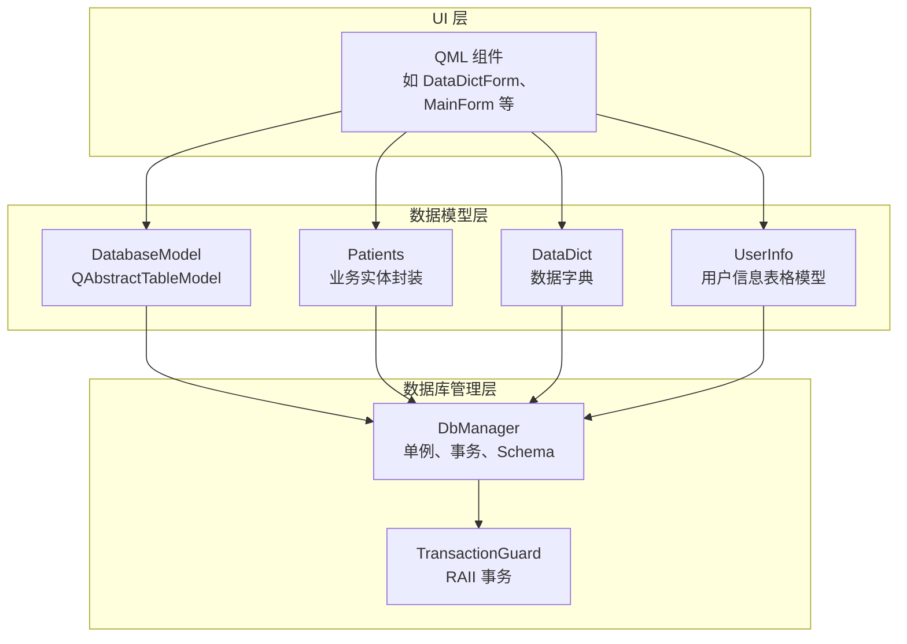
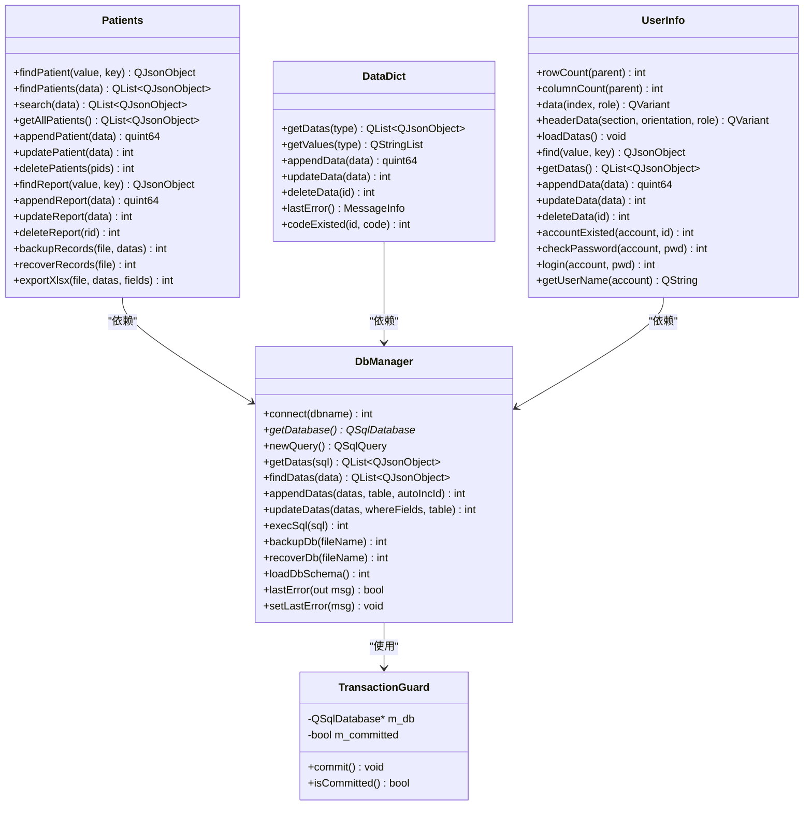
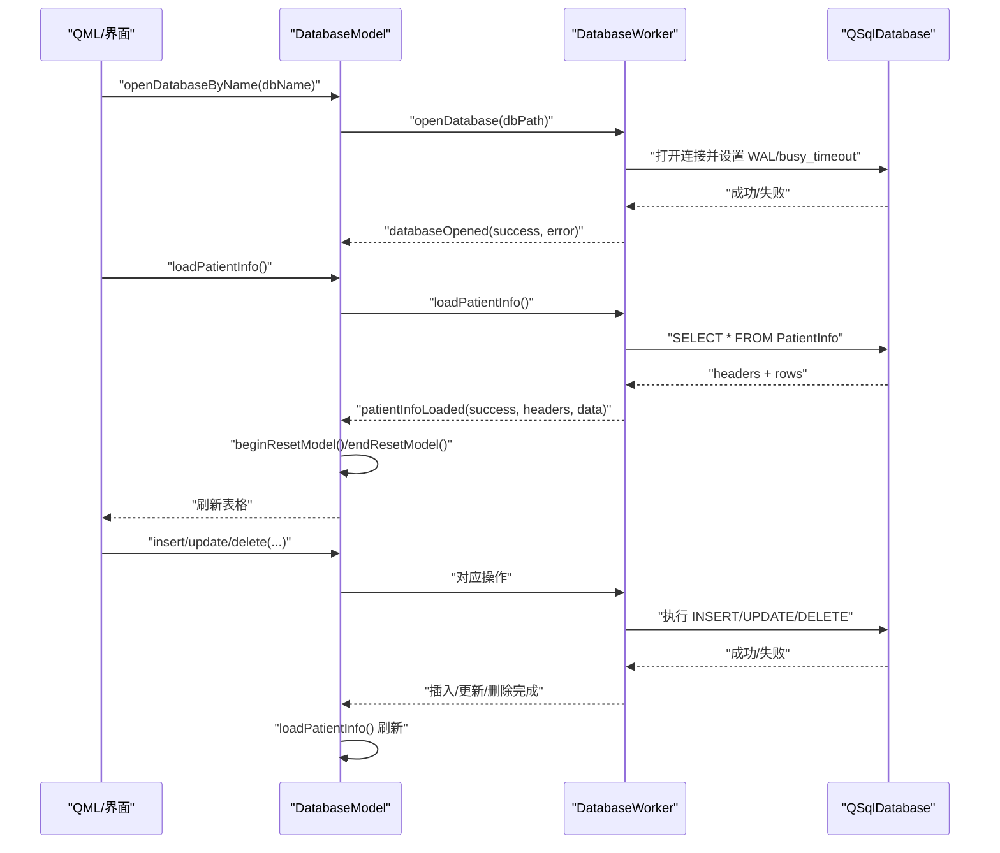
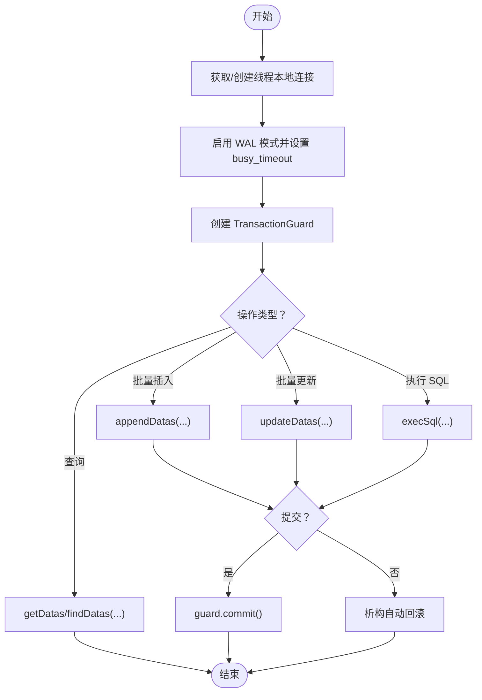
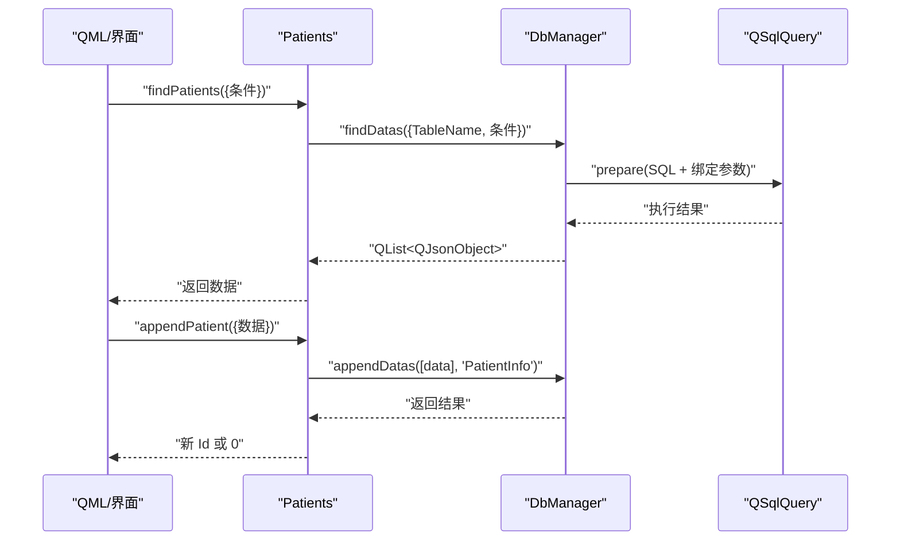
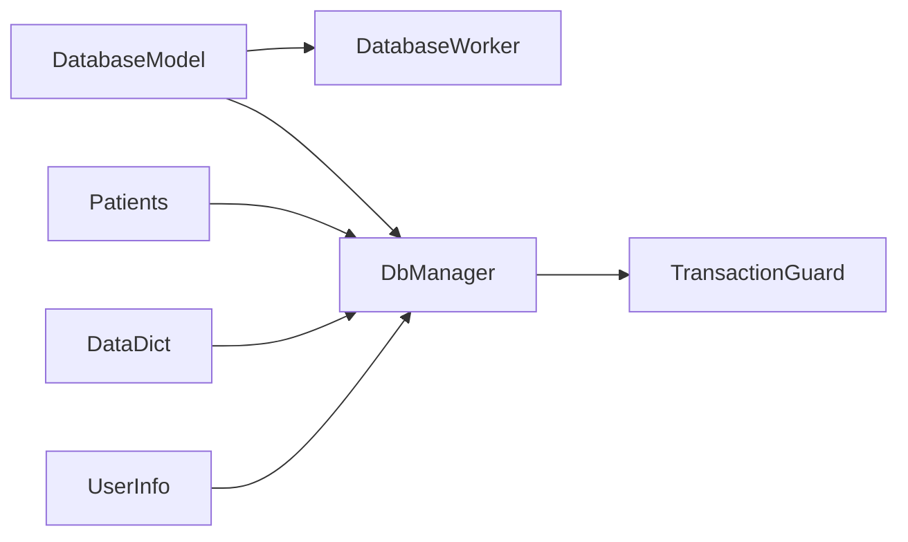

# 数据模型

<cite>
**本文引用的文件**   
- [src/databasemodel.h](file://src/databasemodel.h)
- [src/databasemodel.cpp](file://src/databasemodel.cpp)
- [src/dbmanager.h](file://src/dbmanager.h)
- [src/dbmanager.cpp](file://src/dbmanager.cpp)
- [src/datadict.h](file://src/datadict.h)
- [src/datadict.cpp](file://src/datadict.cpp)
- [src/patients.h](file://src/patients.h)
- [src/patients.cpp](file://src/patients.cpp)
- [src/userinfo.h](file://src/userinfo.h)
- [src/userinfo.cpp](file://src/userinfo.cpp)
- [src/basemsgsender.h](file://src/basemsgsender.h)
- [src/common.h](file://src/common.h)
- [src/singleton.h](file://src/singleton.h)
</cite>

## 目录
1. [简介](#简介)
2. [项目结构](#项目结构)
3. [核心组件](#核心组件)
4. [架构总览](#架构总览)
5. [详细组件分析](#详细组件分析)
6. [依赖分析](#依赖分析)
7. [性能考虑](#性能考虑)
8. [故障排查指南](#故障排查指南)
9. [结论](#结论)
10. [附录](#附录)

## 简介
本文件系统性梳理 QmlPlugins 项目的数据模型与数据库层设计，覆盖以下方面：
- 数据库表结构与字段元数据定义
- 实体关系映射与层次结构
- 数据访问模式、事务处理与并发控制
- 数据验证规则、业务约束与完整性检查
- 与 UI 组件的绑定机制与数据同步策略
- 缓存策略与性能优化建议
- 数据迁移、版本管理与备份恢复方案

## 项目结构
项目采用“UI 层 + 数据模型层 + 数据库管理层”的分层架构。其中：
- UI 层由 QML 组件构成，负责展示与交互
- 数据模型层提供面向 UI 的表格模型与业务实体封装
- 数据库管理层统一管理数据库连接、事务、元数据与备份恢复



**图表来源**
- [src/databasemodel.h:49-94](file://src/databasemodel.h#L49-L94)
- [src/patients.h:24-147](file://src/patients.h#L24-L147)
- [src/datadict.h:30-98](file://src/datadict.h#L30-L98)
- [src/userinfo.h:30-166](file://src/userinfo.h#L30-L166)
- [src/dbmanager.h:52-189](file://src/dbmanager.h#L52-L189)

**章节来源**
- [src/databasemodel.h:1-97](file://src/databasemodel.h#L1-L97)
- [src/dbmanager.h:1-192](file://src/dbmanager.h#L1-L192)

## 核心组件
- DatabaseModel：基于 QAbstractTableModel 的数据模型，负责与数据库线程通信，暴露行/列数据与表头，支持 UI 绑定与刷新
- DbManager：数据库管理器单例，提供连接、事务、Schema 加载、备份/恢复、查询与批量插入/更新等能力
- Patients：业务实体封装，提供患者与报告的查询、新增、更新、删除、导出、备份恢复等接口
- DataDict：数据字典实体，提供按类型查询、新增、更新、删除与重复校验
- UserInfo：用户信息表格模型，提供登录、密码校验、账号唯一性校验等

**章节来源**
- [src/databasemodel.h:49-94](file://src/databasemodel.h#L49-L94)
- [src/dbmanager.h:52-189](file://src/dbmanager.h#L52-L189)
- [src/patients.h:24-147](file://src/patients.h#L24-L147)
- [src/datadict.h:30-98](file://src/datadict.h#L30-L98)
- [src/userinfo.h:30-166](file://src/userinfo.h#L30-L166)

## 架构总览
数据库层采用 SQLite + Qt SQL 框架，DbManager 以线程本地存储维护连接，并启用 WAL 模式与 busy_timeout 降低锁竞争；通过 TransactionGuard 实现 RAII 事务，确保批量操作的一致性。



**图表来源**
- [src/dbmanager.h:52-189](file://src/dbmanager.h#L52-L189)
- [src/dbmanager.cpp:16-39](file://src/dbmanager.cpp#L16-L39)
- [src/patients.h:24-147](file://src/patients.h#L24-L147)
- [src/datadict.h:30-98](file://src/datadict.h#L30-L98)
- [src/userinfo.h:30-166](file://src/userinfo.h#L30-L166)

## 详细组件分析

### DatabaseModel：线程化的表格模型
- 角色与职责
  - 作为 QML 的数据源，提供行/列计数与显示数据
  - 通过独立工作线程执行数据库操作，避免 UI 卡顿
  - 通过信号槽与工作线程通信，加载完成后重置模型并通知 UI 刷新
- 关键点
  - 使用 QThread 与 DatabaseWorker 分离 UI 与数据库线程
  - 使用 QMutex 保护内存中的 headers 与 data
  - 通过 beginResetModel/endResetModel 通知 QML 刷新
- 数据访问模式
  - Q_INVOKABLE 的 openDatabaseByName/loadPatientInfo/insert/update/delete 与内部信号槽对接
  - 插入/更新/删除后触发重新加载，保证 UI 与数据库一致



**图表来源**
- [src/databasemodel.h:20-47](file://src/databasemodel.h#L20-L47)
- [src/databasemodel.cpp:16-179](file://src/databasemodel.cpp#L16-L179)
- [src/databasemodel.cpp:181-330](file://src/databasemodel.cpp#L181-L330)

**章节来源**
- [src/databasemodel.h:49-94](file://src/databasemodel.h#L49-L94)
- [src/databasemodel.cpp:181-380](file://src/databasemodel.cpp#L181-L380)

### DbManager：数据库管理与事务
- 连接与线程安全
  - 使用 QThreadStorage 为每个线程保存独立连接
  - 连接名为线程 ID，避免跨线程共享连接导致的竞态
- 事务与一致性
  - TransactionGuard 在构造时开启事务，在析构时若未显式提交则自动回滚
  - 批量插入/更新/执行 SQL 均在事务内完成，提升一致性与性能
- Schema 与元数据
  - 通过 PRAGMA table_info 动态加载表结构，解析字段类型、长度、精度、主键、自增、可空等
  - 以 DatabaseSchema/FieldInfo 结构缓存元数据，供上层查询与校验使用
- 备份与恢复
  - backupDb：直接复制数据库文件
  - recoverDb：先备份当前数据库，再替换为指定备份文件，失败时回滚



**图表来源**
- [src/dbmanager.cpp:51-90](file://src/dbmanager.cpp#L51-L90)
- [src/dbmanager.cpp:16-39](file://src/dbmanager.cpp#L16-L39)
- [src/dbmanager.cpp:225-350](file://src/dbmanager.cpp#L225-L350)

**章节来源**
- [src/dbmanager.h:52-189](file://src/dbmanager.h#L52-L189)
- [src/dbmanager.cpp:51-350](file://src/dbmanager.cpp#L51-L350)

### Patients：患者与报告实体
- 查询与过滤
  - findPatient/findPatients/search：支持按字段精确查询与带比较符的条件查询
  - 通过 DbManager::findDatas 统一解析 TableName 与比较符，构建参数化 SQL
- 增删改
  - appendPatient/updatePatient/deletePatients：基于事务的批量操作
  - 报告相关：findReport/appendReport/updateReport/deleteReport
- 导出与备份
  - backupRecords/recoverRecords：JSON 序列化/反序列化，支持患者与报告配对
  - exportXlsx：可选 Excel 导出（需编译选项）



**图表来源**
- [src/patients.cpp:57-72](file://src/patients.cpp#L57-L72)
- [src/patients.cpp:81-100](file://src/patients.cpp#L81-L100)
- [src/dbmanager.cpp:601-699](file://src/dbmanager.cpp#L601-L699)

**章节来源**
- [src/patients.h:24-147](file://src/patients.h#L24-L147)
- [src/patients.cpp:57-224](file://src/patients.cpp#L57-L224)

### DataDict：数据字典
- 字典类型枚举：Sex、Dept、Doctor、SpecimenQuality、SpecimenType、Diagnosis
- 常用操作：按类型获取、获取值列表、新增、更新、删除、重复性校验
- 与 DbManager 协作：通过 appendDatas/updateDatas/newQuery 等接口完成 CRUD

**章节来源**
- [src/datadict.h:30-98](file://src/datadict.h#L30-L98)
- [src/datadict.cpp:28-114](file://src/datadict.cpp#L28-L114)

### UserInfo：用户信息表格模型
- 表格模型：继承 QAbstractTableModel，提供 rowCount/columnCount/data/headerData
- 登录与认证：账号唯一性校验、密码哈希与校验、登录事件发出
- 数据持久化：基于 DbManager 的 append/update/delete

**章节来源**
- [src/userinfo.h:30-166](file://src/userinfo.h#L30-L166)
- [src/userinfo.cpp:24-104](file://src/userinfo.cpp#L24-L104)

## 依赖分析
- 组件耦合
  - DatabaseModel 依赖 DatabaseWorker 与 DbManager，形成 UI-模型-数据库三层解耦
  - Patients/DataDict/UserInfo 均依赖 DbManager，统一事务与连接管理
- 外部依赖
  - Qt SQL（QSqlDatabase/QSqlQuery）、SQLite（WAL 模式）
  - 可选 Excel 导出（USE_QXLSX 宏）
- 潜在循环依赖
  - 通过头文件前置与接口分离避免循环包含；DbManager 为单例，避免多实例导致的连接混乱



**图表来源**
- [src/databasemodel.h:87-94](file://src/databasemodel.h#L87-L94)
- [src/dbmanager.h:52-189](file://src/dbmanager.h#L52-L189)

**章节来源**
- [src/databasemodel.h:87-94](file://src/databasemodel.h#L87-L94)
- [src/dbmanager.h:52-189](file://src/dbmanager.h#L52-L189)

## 性能考虑
- 并发与线程
  - DatabaseModel 使用独立线程执行数据库操作，避免阻塞 UI
  - DbManager 使用线程本地连接，减少锁竞争
- 事务批处理
  - appendDatas/updateDatas/execSql 均在事务内执行，减少日志与提交开销
- WAL 与 busy_timeout
  - 启用 WAL 模式提升并发读写；设置 busy_timeout 减少“database is locked”错误
- 查询优化
  - 使用参数化查询与 PRAGMA table_info 缓存元数据，避免重复解析
- UI 刷新
  - beginResetModel/endResetModel 一次性刷新，减少多次重绘

[本节为通用指导，无需具体文件分析]

## 故障排查指南
- 常见错误码
  - 数据库打开失败、执行失败、备份/恢复失败、文件读写失败、参数无效等
- 错误传播
  - DbManager::setLastError 将错误写入线程本地缓存并通过 messageEmitted 信号广播
  - 各实体类通过 messageEmitted 将错误转发至消息中心
- 排查步骤
  - 检查数据库文件是否存在与可读写
  - 确认线程本地连接已建立且未断开
  - 查看事务是否正确提交或回滚
  - 核对参数化查询绑定值与字段类型

**章节来源**
- [src/common.h:63-117](file://src/common.h#L63-L117)
- [src/dbmanager.cpp:784-793](file://src/dbmanager.cpp#L784-L793)
- [src/basemsgsender.h:27-34](file://src/basemsgsender.h#L27-L34)

## 结论
QmlPlugins 的数据模型以 DbManager 为核心，结合 DatabaseModel 的线程化表格模型与 Patients/DataDict/UserInfo 的业务封装，实现了清晰的分层与良好的扩展性。通过事务 RAII、WAL 模式与元数据缓存，兼顾了性能与可靠性；同时，统一的错误码与消息机制提升了可观测性与可维护性。

[本节为总结，无需具体文件分析]

## 附录

### 数据库表结构与字段元数据
- PatientInfo
  - 字段：主键（通常为 Id，自增），其他字段根据实际表结构解析
  - 元数据：通过 PRAGMA table_info 动态加载，包含类型、长度、精度、主键、自增、可空等
- Report
  - 字段：主键（通常为 Id，自增），与 PatientInfo 关联字段（如 ReportId）
  - 元数据：同上
- UserInfo
  - 字段：主键（Id），账号（Account）、密码（Password）、盐值（Salt）、姓名（Name）等
  - 元数据：包含可空性、默认值等
- DataDict
  - 字段：主键（Id），编号（Code）、值（Value）、类型（Type）
  - 元数据：类型枚举映射

**章节来源**
- [src/dbmanager.cpp:225-350](file://src/dbmanager.cpp#L225-L350)
- [src/patients.cpp:165-224](file://src/patients.cpp#L165-L224)
- [src/userinfo.cpp:134-185](file://src/userinfo.cpp#L134-L185)
- [src/datadict.cpp:28-85](file://src/datadict.cpp#L28-L85)

### 实体关系映射
- PatientInfo 与 Report：一对多（一个患者可有多份报告）
- DataDict：独立字典表，按 Type 分类
- UserInfo：用户表，用于登录与权限控制

```mermaid
erDiagram
PATIENTINFO {
int Id PK
string 其他字段...
}
REPORT {
int Id PK
int PatientId FK
string 其他字段...
}
USERINFO {
int Id PK
string Account UK
string Password
string Salt
string Name
}
DATADICT {
int Id PK
string Code
string Value
int Type
}
PATIENTINFO ||--o{ REPORT : "拥有"
```

**图表来源**
- [src/patients.cpp:187-224](file://src/patients.cpp#L187-L224)
- [src/userinfo.cpp:134-185](file://src/userinfo.cpp#L134-L185)
- [src/datadict.cpp:28-85](file://src/datadict.cpp#L28-L85)

### 数据验证规则与业务约束
- 参数校验
  - 空参数、空 SQL、空表名等均返回错误码
- 唯一性约束
  - 账号唯一性校验（accountExisted）
  - DataDict 编号唯一性校验（codeExisted）
- 类型与长度
  - 通过 DbManager 的元数据解析，确保绑定值与字段类型匹配
- 事务一致性
  - 批量操作在事务内完成，失败自动回滚

**章节来源**
- [src/dbmanager.cpp:556-576](file://src/dbmanager.cpp#L556-L576)
- [src/userinfo.cpp:187-210](file://src/userinfo.cpp#L187-L210)
- [src/datadict.cpp:92-114](file://src/datadict.cpp#L92-L114)

### 数据访问模式与缓存策略
- 访问模式
  - 读：newQuery + exec + getDbDatas
  - 写：appendDatas/updateDatas/execSql + 事务
- 缓存策略
  - DbManager 缓存 PRAGMA table_info 元数据
  - DatabaseModel 缓存 headers 与 data，配合 QMutex 保护
- UI 同步
  - DatabaseModel 使用 beginResetModel/endResetModel 通知 QML 刷新

**章节来源**
- [src/dbmanager.cpp:352-406](file://src/dbmanager.cpp#L352-L406)
- [src/databasemodel.cpp:286-300](file://src/databasemodel.cpp#L286-L300)

### 事务处理与并发控制
- RAII 事务
  - TransactionGuard 在构造时开启事务，析构时若未提交则自动回滚
- 并发控制
  - 线程本地连接 + QMutex 保护共享状态
  - WAL 模式 + busy_timeout 降低锁冲突

**章节来源**
- [src/dbmanager.cpp:16-39](file://src/dbmanager.cpp#L16-L39)
- [src/dbmanager.cpp:51-90](file://src/dbmanager.cpp#L51-L90)

### 数据迁移、版本管理与备份恢复
- 备份
  - backupDb：直接复制数据库文件
- 恢复
  - recoverDb：先备份当前数据库，再替换为指定备份文件，失败时回滚
- 记录级备份/恢复
  - Patients::backupRecords/recoverRecords：JSON 序列化患者与报告配对记录

**章节来源**
- [src/dbmanager.cpp:118-223](file://src/dbmanager.cpp#L118-L223)
- [src/patients.cpp:226-331](file://src/patients.cpp#L226-L331)