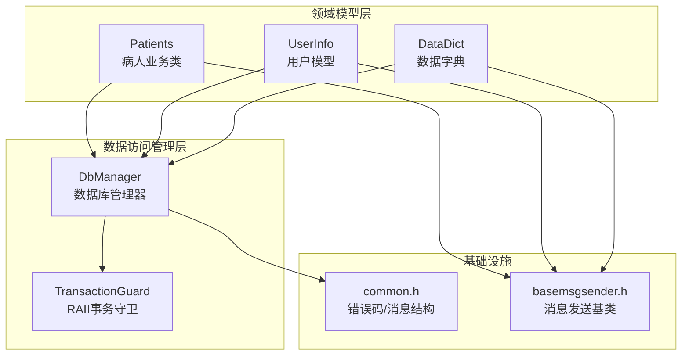
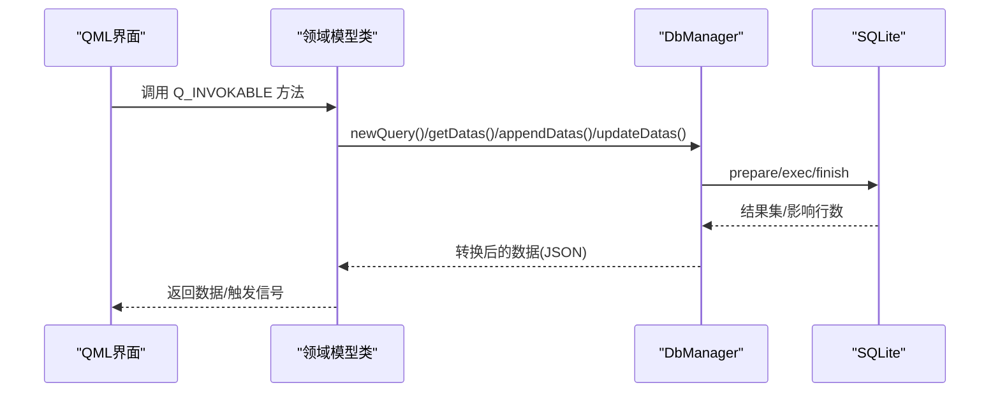
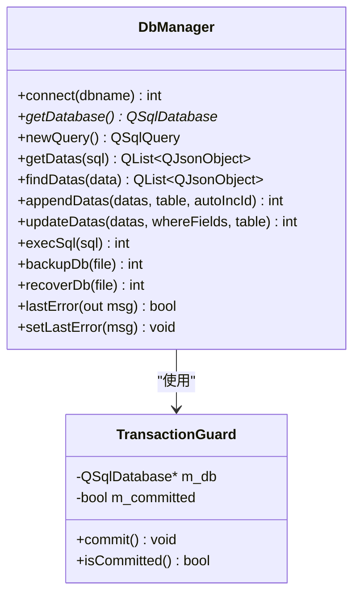
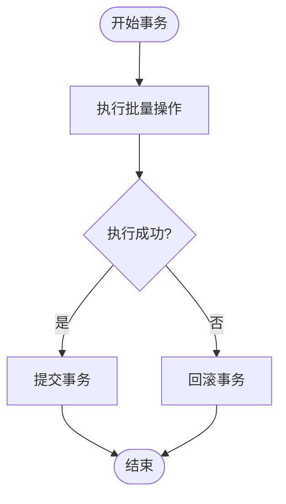
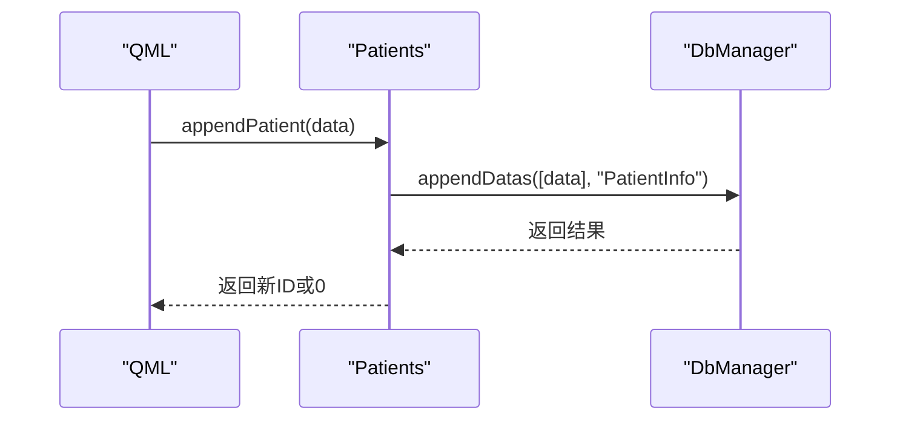
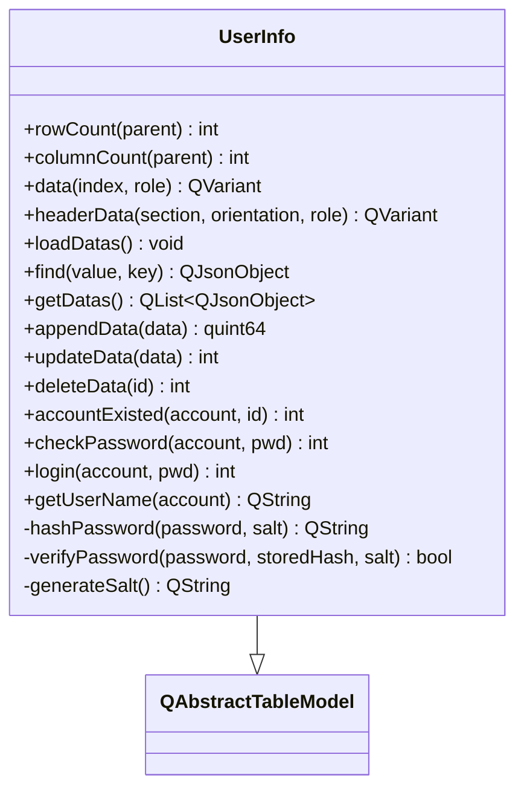
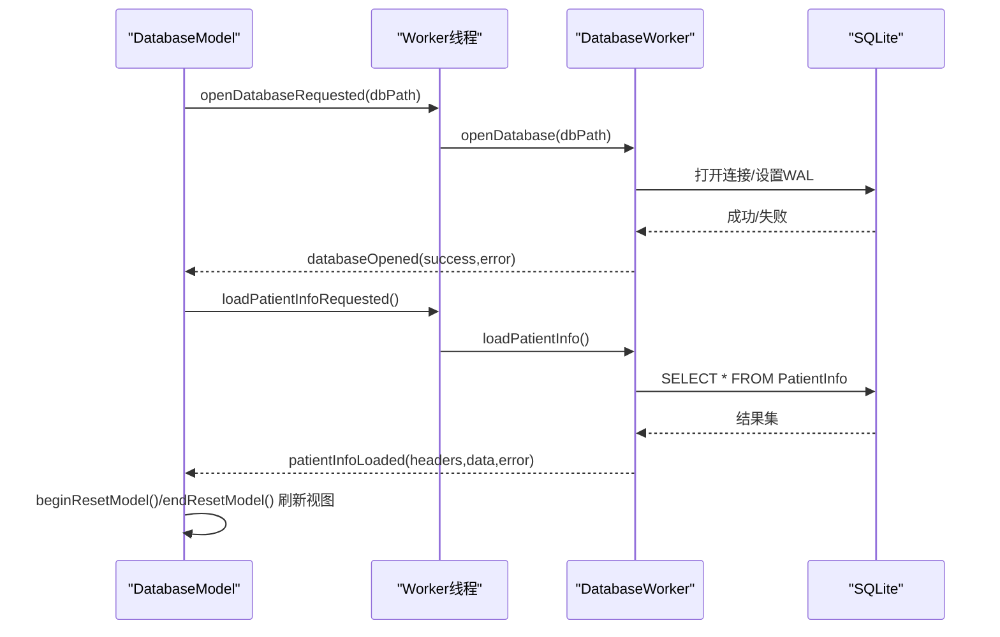
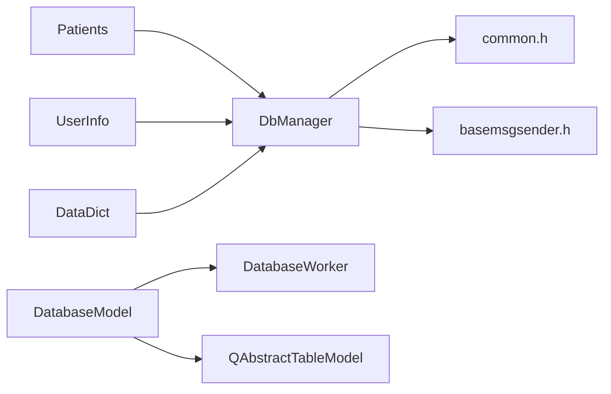

# 数据访问模式

<cite>
**本文引用的文件**
- [databasemodel.h](file://src/databasemodel.h)
- [databasemodel.cpp](file://src/databasemodel.cpp)
- [dbmanager.h](file://src/dbmanager.h)
- [dbmanager.cpp](file://src/dbmanager.cpp)
- [datadict.h](file://src/datadict.h)
- [datadict.cpp](file://src/datadict.cpp)
- [patients.h](file://src/patients.h)
- [patients.cpp](file://src/patients.cpp)
- [userinfo.h](file://src/userinfo.h)
- [userinfo.cpp](file://src/userinfo.cpp)
- [common.h](file://src/common.h)
- [basemsgsender.h](file://src/basemsgsender.h)
</cite>

## 目录
1. [简介](#简介)
2. [项目结构](#项目结构)
3. [核心组件](#核心组件)
4. [架构总览](#架构总览)
5. [组件详解](#组件详解)
6. [依赖关系分析](#依赖关系分析)
7. [性能考量](#性能考量)
8. [故障排查指南](#故障排查指南)
9. [结论](#结论)
10. [附录](#附录)

## 简介
本文件系统性梳理 QmlPlugins 项目的“数据访问模式”，重点覆盖以下方面：
- 数据访问层设计模式与职责分离
- CRUD 操作实现与查询优化策略
- 数据模型基类设计、抽象接口与具体实现
- 缓存策略、批量操作与异步处理机制
- 数据绑定到 QML 组件、实时更新与性能优化
- 错误处理、重试机制与事务管理
- 单元测试策略与质量保证措施

## 项目结构
项目采用“领域模型 + 数据访问管理层”的分层组织方式：
- 领域模型层：面向业务实体的 QML 可见类（如病人、用户、数据字典）
- 数据访问管理层：统一的数据库管理器与线程安全封装（DbManager）
- 通用基础设施：错误码与消息发送基类（common.h、basemsgsender.h）

**图示来源**
- [patients.h:24-147](file://src/patients.h#L24-L147)
- [patients.cpp:30-401](file://src/patients.cpp#L30-L401)
- [userinfo.h:30-166](file://src/userinfo.h#L30-L166)
- [userinfo.cpp:24-297](file://src/userinfo.cpp#L24-L297)
- [datadict.h:30-103](file://src/datadict.h#L30-L103)
- [datadict.cpp:22-115](file://src/datadict.cpp#L22-L115)
- [dbmanager.h:52-191](file://src/dbmanager.h#L52-L191)
- [dbmanager.cpp:43-824](file://src/dbmanager.cpp#L43-L824)
- [common.h:63-157](file://src/common.h#L63-L157)
- [basemsgsender.h:10-38](file://src/basemsgsender.h#L10-L38)

**章节来源**
- [patients.h:14-150](file://src/patients.h#L14-L150)
- [userinfo.h:14-172](file://src/userinfo.h#L14-L172)
- [datadict.h:14-103](file://src/datadict.h#L14-L103)
- [dbmanager.h:14-192](file://src/dbmanager.h#L14-L192)
- [common.h:16-159](file://src/common.h#L16-L159)
- [basemsgsender.h:1-38](file://src/basemsgsender.h#L1-L38)

## 核心组件
- 数据访问管理层（DbManager）：提供线程安全的数据库连接、事务管理、批量插入/更新、查询结果转换、备份/恢复等能力。
- 事务守卫（TransactionGuard）：基于 RAII 的自动事务控制，构造开启事务，析构在未显式提交时自动回滚。
- 领域模型类：
  - Patients：面向病人信息的查询、新增、更新、删除、导出、备份/恢复等。
  - UserInfo：用户信息的表格模型实现与登录校验。
  - DataDict：数据字典的查询、新增、更新、删除与唯一性校验。
- 数据模型基类（DatabaseModel）：提供线程分离的数据库工作线程、信号槽桥接、QAbstractTableModel 接口与互斥保护的数据缓存。

**章节来源**
- [dbmanager.h:37-191](file://src/dbmanager.h#L37-L191)
- [dbmanager.cpp:14-824](file://src/dbmanager.cpp#L14-L824)
- [patients.h:24-147](file://src/patients.h#L24-L147)
- [patients.cpp:30-401](file://src/patients.cpp#L30-L401)
- [userinfo.h:30-166](file://src/userinfo.h#L30-L166)
- [userinfo.cpp:24-297](file://src/userinfo.cpp#L24-L297)
- [datadict.h:30-103](file://src/datadict.h#L30-L103)
- [datadict.cpp:22-115](file://src/datadict.cpp#L22-L115)
- [databasemodel.h:49-97](file://src/databasemodel.h#L49-L97)
- [databasemodel.cpp:181-380](file://src/databasemodel.cpp#L181-L380)

## 架构总览
整体采用“领域类 -> 数据访问层 -> SQLite”的分层架构，并通过 QML 可见的 QAbstractTableModel 或 Q_INVOKABLE 方法暴露数据与操作接口。

**图示来源**
- [patients.cpp:35-100](file://src/patients.cpp#L35-L100)
- [dbmanager.cpp:555-599](file://src/dbmanager.cpp#L555-L599)
- [dbmanager.cpp:500-553](file://src/dbmanager.cpp#L500-L553)
- [dbmanager.cpp:437-498](file://src/dbmanager.cpp#L437-L498)

## 组件详解

### 数据访问管理层（DbManager）
- 线程安全连接管理：每个线程独立持有数据库连接，连接名以线程ID命名，避免跨线程竞争。
- 事务管理：通过 TransactionGuard 提供 RAII 事务控制，确保批量操作原子性。
- 批量操作：支持批量插入 appendDatas 与批量更新 updateDatas，自动去除 where 字段参与 SET 部分。
- 查询结果转换：getQueryResult/getDbDatas 将 QSqlQuery 转为 QJsonArray/QList<QJsonObject>，并按字段类型映射。
- 备份/恢复：提供数据库文件级备份与恢复，恢复失败时自动回滚。
- 错误处理：统一的 MessageInfo 结构与 lastError/messageEmitted 机制，便于上层展示与日志记录。

**图示来源**
- [dbmanager.h:52-191](file://src/dbmanager.h#L52-L191)
- [dbmanager.cpp:14-824](file://src/dbmanager.cpp#L14-L824)

**章节来源**
- [dbmanager.h:52-191](file://src/dbmanager.h#L52-L191)
- [dbmanager.cpp:51-90](file://src/dbmanager.cpp#L51-L90)
- [dbmanager.cpp:118-223](file://src/dbmanager.cpp#L118-L223)
- [dbmanager.cpp:225-350](file://src/dbmanager.cpp#L225-L350)
- [dbmanager.cpp:352-406](file://src/dbmanager.cpp#L352-L406)
- [dbmanager.cpp:437-498](file://src/dbmanager.cpp#L437-L498)
- [dbmanager.cpp:500-553](file://src/dbmanager.cpp#L500-L553)
- [dbmanager.cpp:555-599](file://src/dbmanager.cpp#L555-L599)
- [dbmanager.cpp:601-699](file://src/dbmanager.cpp#L601-L699)
- [dbmanager.cpp:718-767](file://src/dbmanager.cpp#L718-L767)
- [dbmanager.cpp:769-793](file://src/dbmanager.cpp#L769-L793)

### 事务管理与错误处理
- 事务守卫：构造时开启事务，析构时若未 commit 则自动 rollback，避免遗漏提交导致的数据不一致。
- 错误码体系：ErrorCode 枚举覆盖数据库、文件、网络等模块错误；MessageInfo 结构承载错误文本、错误码与提示类型。
- 线程本地错误：lastError 以线程ID为键存储，避免多线程并发下的错误覆盖。

**图示来源**
- [dbmanager.cpp:14-40](file://src/dbmanager.cpp#L14-L40)
- [dbmanager.cpp:769-793](file://src/dbmanager.cpp#L769-L793)

**章节来源**
- [dbmanager.cpp:14-40](file://src/dbmanager.cpp#L14-L40)
- [common.h:63-157](file://src/common.h#L63-L157)

### 领域模型类（Patients）
- 查询：findPatient/findPatients/search/getAllPatients，支持条件查询与全表查询。
- 增删改：appendPatient/updatePatient/deletePatients，内部委托 DbManager 执行。
- 业务功能：备份记录、恢复记录、导出 Excel（条件编译）。
- 错误传播：通过 messageEmitted 信号向消息中心上报错误。

**图示来源**
- [patients.cpp:81-100](file://src/patients.cpp#L81-L100)
- [dbmanager.cpp:500-553](file://src/dbmanager.cpp#L500-L553)

**章节来源**
- [patients.h:24-147](file://src/patients.h#L24-L147)
- [patients.cpp:35-128](file://src/patients.cpp#L35-L128)
- [patients.cpp:151-163](file://src/patients.cpp#L151-L163)
- [patients.cpp:226-331](file://src/patients.cpp#L226-L331)
- [patients.cpp:333-400](file://src/patients.cpp#L333-L400)

### 领域模型类（UserInfo）
- 表格模型：继承 QAbstractTableModel，提供 rowCount/columnCount/data/headerData，支持 QML TableView 直接绑定。
- 数据加载：loadDatas 通过 SQL 查询填充 m_headers 与 m_data，并使用 beginResetModel/endResetModel 通知视图刷新。
- 登录与密码：提供账号密码校验、登录、用户名查询与密码哈希（含盐值）。

**图示来源**
- [userinfo.h:30-166](file://src/userinfo.h#L30-L166)
- [userinfo.cpp:24-104](file://src/userinfo.cpp#L24-L104)
- [userinfo.cpp:255-297](file://src/userinfo.cpp#L255-L297)

**章节来源**
- [userinfo.h:30-166](file://src/userinfo.h#L30-L166)
- [userinfo.cpp:68-104](file://src/userinfo.cpp#L68-L104)
- [userinfo.cpp:106-185](file://src/userinfo.cpp#L106-L185)
- [userinfo.cpp:226-242](file://src/userinfo.cpp#L226-L242)
- [userinfo.cpp:275-297](file://src/userinfo.cpp#L275-L297)

### 领域模型类（DataDict）
- 字典查询：按类型获取键值对列表或纯值列表，供 QML ComboBox 使用。
- 增删改：appendData/updateData/deleteData，内部委托 DbManager。
- 唯一性校验：codeExisted 支持新增与编辑场景的编号唯一性检查。
- 错误上报：通过 messageEmitted 信号上报。

**章节来源**
- [datadict.h:30-103](file://src/datadict.h#L30-L103)
- [datadict.cpp:28-114](file://src/datadict.cpp#L28-L114)

### 数据模型基类（DatabaseModel）
- 线程分离：DatabaseWorker 在独立线程中执行数据库操作，DatabaseModel 通过信号槽与之通信。
- QAbstractTableModel：提供数据读取与表头显示，内部使用 QMutex 保护 m_headers/m_data。
- 异步流程：openDatabase/loadPatientInfo/insert/update/delete 通过 Q_INVOKABLE 触发，最终由 DatabaseWorker 执行 SQL 并回调。

**图示来源**
- [databasemodel.cpp:16-41](file://src/databasemodel.cpp#L16-L41)
- [databasemodel.cpp:43-81](file://src/databasemodel.cpp#L43-L81)
- [databasemodel.cpp:181-202](file://src/databasemodel.cpp#L181-L202)
- [databasemodel.cpp:276-335](file://src/databasemodel.cpp#L276-L335)

**章节来源**
- [databasemodel.h:20-97](file://src/databasemodel.h#L20-L97)
- [databasemodel.cpp:16-179](file://src/databasemodel.cpp#L16-L179)
- [databasemodel.cpp:181-380](file://src/databasemodel.cpp#L181-L380)

## 依赖关系分析
- 领域模型类均依赖 DbManager 提供的统一数据库访问能力，避免重复实现。
- DbManager 依赖 common.h 的错误码体系与 basemsgsender.h 的消息发送机制。
- DatabaseModel 与 DatabaseWorker 之间通过 Qt 信号槽解耦，实现真正的异步与线程隔离。
- UserInfo 作为 QAbstractTableModel，直接与 QML TableView 绑定，减少中间层复杂度。

**图示来源**
- [patients.h:24-147](file://src/patients.h#L24-L147)
- [userinfo.h:30-166](file://src/userinfo.h#L30-L166)
- [datadict.h:30-103](file://src/datadict.h#L30-L103)
- [dbmanager.h:52-191](file://src/dbmanager.h#L52-L191)
- [common.h:63-157](file://src/common.h#L63-L157)
- [basemsgsender.h:10-38](file://src/basemsgsender.h#L10-L38)
- [databasemodel.h:49-97](file://src/databasemodel.h#L49-L97)

**章节来源**
- [patients.cpp:30-401](file://src/patients.cpp#L30-L401)
- [userinfo.cpp:24-297](file://src/userinfo.cpp#L24-L297)
- [datadict.cpp:22-115](file://src/datadict.cpp#L22-L115)
- [dbmanager.cpp:43-824](file://src/dbmanager.cpp#L43-L824)
- [databasemodel.cpp:181-380](file://src/databasemodel.cpp#L181-L380)

## 性能考量
- 线程与连接：DbManager 为每线程维护独立连接，避免锁竞争；DatabaseModel 使用专用 worker 线程执行数据库操作，主线程只负责 UI 刷新。
- WAL 模式与忙等待：DbManager 在连接建立后启用 WAL 模式并设置 busy_timeout，降低并发写入时的“database is locked”概率。
- 批量操作：appendDatas/updateDatas 通过单次 prepare/bind/exec 减少往返次数，配合 TransactionGuard 提升吞吐。
- 查询优化：DbManager::queryCount 通过 seek 恢复游标位置，避免破坏上层遍历；getQueryResult/getDbDatas 按字段类型映射，减少额外转换成本。
- QML 绑定：UserInfo 直接继承 QAbstractTableModel，减少数据复制与中间层开销；DatabaseModel 使用 beginResetModel/endResetModel 一次性刷新，避免频繁小粒度变更。

**章节来源**
- [dbmanager.cpp:51-90](file://src/dbmanager.cpp#L51-L90)
- [dbmanager.cpp:352-406](file://src/dbmanager.cpp#L352-L406)
- [dbmanager.cpp:360-374](file://src/dbmanager.cpp#L360-L374)
- [dbmanager.cpp:437-498](file://src/dbmanager.cpp#L437-L498)
- [dbmanager.cpp:500-553](file://src/dbmanager.cpp#L500-L553)
- [userinfo.cpp:68-104](file://src/userinfo.cpp#L68-L104)
- [databasemodel.cpp:290-296](file://src/databasemodel.cpp#L290-L296)

## 故障排查指南
- 数据库连接失败：检查 DbManager::connect 的返回值与 lastError；确认数据库文件路径与权限。
- 事务未提交：确认批量操作后是否调用 guard.commit()；若异常退出，TransactionGuard 析构会自动回滚。
- 查询无结果：Patients::findPatients/search 依赖 DbManager::findDatas，确认 TableName 与字段名拼写；检查 where 条件与操作符后缀。
- 线程错误：DatabaseModel 与 DatabaseWorker 通过信号槽通信，若 UI 无响应，检查 worker 线程是否启动与信号是否正确连接。
- 错误上报：所有错误通过 messageEmitted 信号上报，可在消息中心查看详细信息。

**章节来源**
- [dbmanager.cpp:51-90](file://src/dbmanager.cpp#L51-L90)
- [dbmanager.cpp:14-40](file://src/dbmanager.cpp#L14-L40)
- [patients.cpp:57-72](file://src/patients.cpp#L57-L72)
- [databasemodel.cpp:181-202](file://src/databasemodel.cpp#L181-L202)
- [basemsgsender.h:27-34](file://src/basemsgsender.h#L27-L34)

## 结论
本项目通过 DbManager 提供统一、线程安全、事务可控的数据访问能力，结合领域模型类实现清晰的业务接口，并以 DatabaseModel 和 UserInfo 实现 QML 友好的数据绑定与实时更新。整体设计兼顾易用性、性能与可维护性，适合中小规模桌面应用的数据访问需求。

## 附录

### 数据绑定到 QML 的最佳实践
- 使用 QAbstractTableModel：UserInfo 直接继承 QAbstractTableModel，QML 中直接绑定 model 属性即可渲染表格。
- 使用 Q_INVOKABLE：Patients/DataDict 暴露 Q_INVOKABLE 方法供 QML 调用，内部通过 DbManager 执行数据库操作。
- 错误与提示：通过 messageEmitted 信号将错误信息传递至上层 UI，统一展示为 Toast/Confirmation/Error。

**章节来源**
- [userinfo.h:30-166](file://src/userinfo.h#L30-L166)
- [patients.h:24-147](file://src/patients.h#L24-L147)
- [datadict.h:30-103](file://src/datadict.h#L30-L103)
- [basemsgsender.h:27-34](file://src/basemsgsender.h#L27-L34)

### 单元测试策略与质量保证
- 单元测试建议：
  - 对 DbManager 的关键方法（connect、appendDatas、updateDatas、findDatas、backupDb/recoverDb）编写独立测试用例，覆盖成功与失败分支。
  - 对 Transactions 进行集成测试：构造批量插入/更新，验证 commit/rollback 行为与一致性。
  - 对 Patients/UserInfo/DataDict 的 Q_INVOKABLE 方法进行行为测试：输入不同参数组合，断言返回值与副作用。
  - 对错误码与消息上报进行回归测试：确保 lastError 与 messageEmitted 正确触发。
- 质量保证措施：
  - 使用静态分析工具（clang-tidy/Qt Creator 静态检查）识别潜在问题。
  - 使用覆盖率工具（gcov/lcov）评估测试覆盖度。
  - 代码审查：重点关注线程安全、资源释放、异常路径与错误处理。

[本节为通用指导，无需特定文件引用]