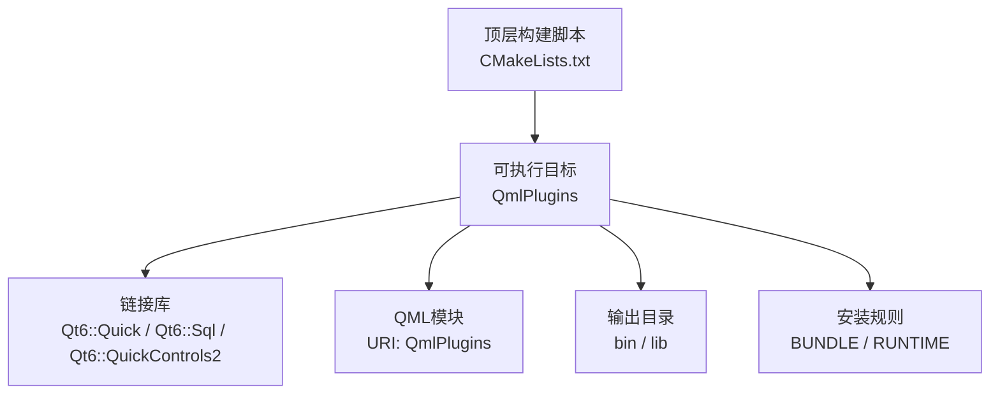
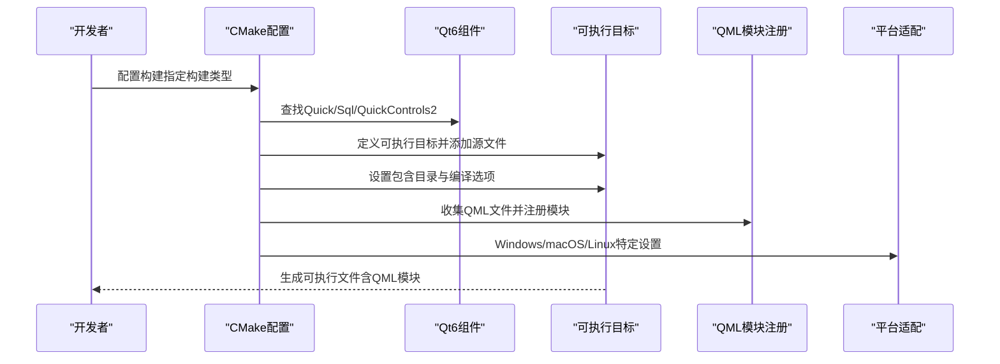
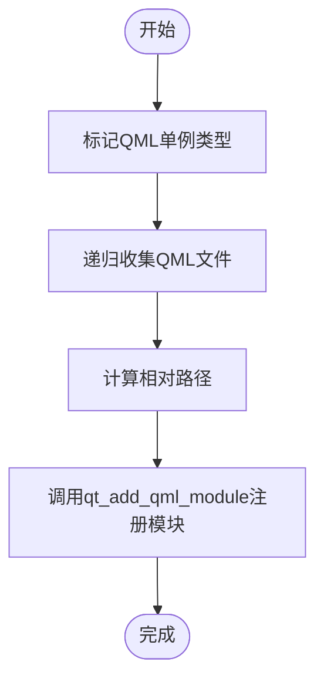
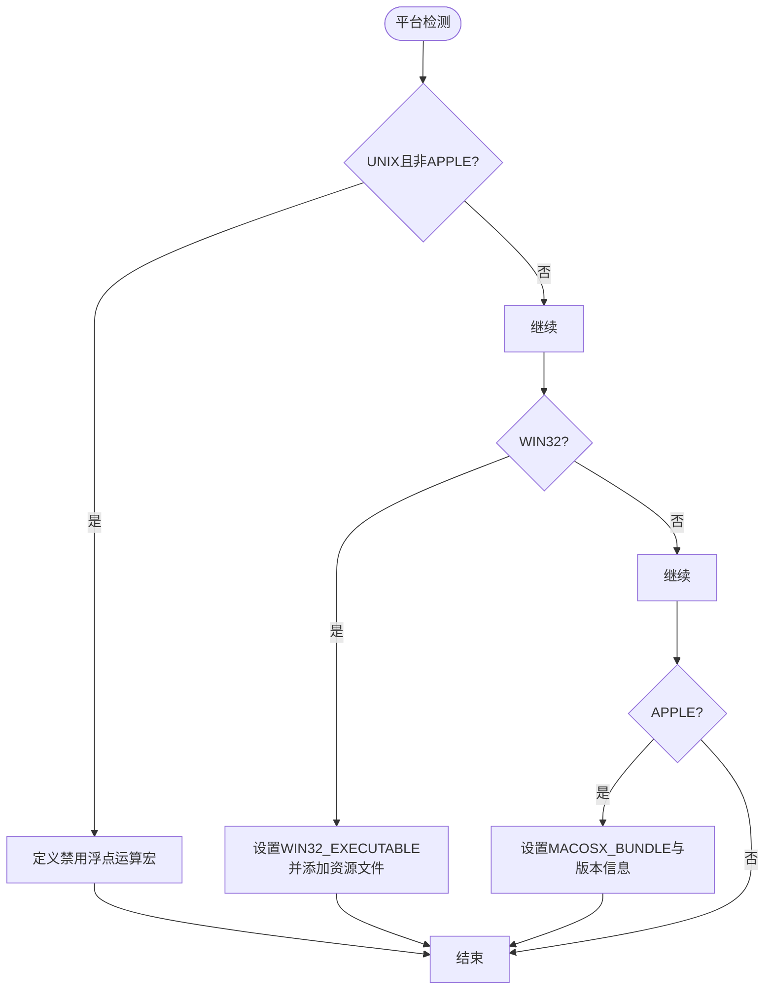
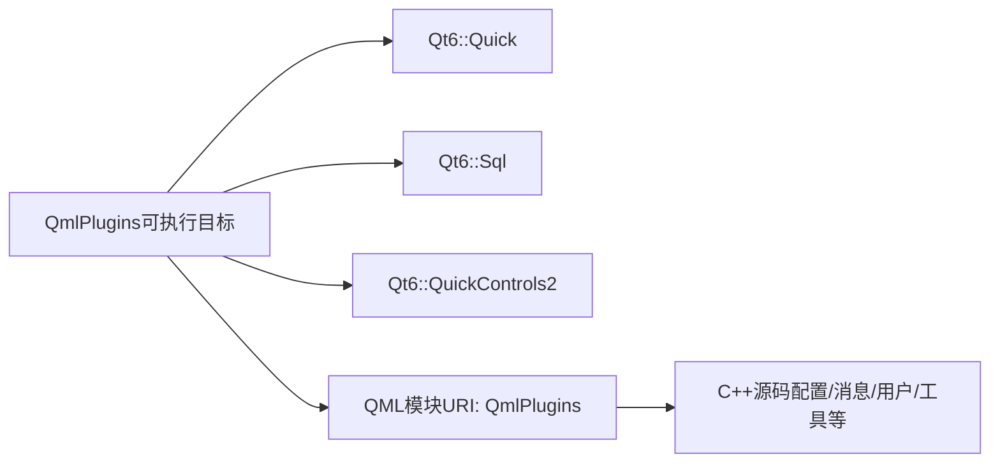

# CMake构建配置

<cite>
**本文引用的文件**
- [CMakeLists.txt](file://CMakeLists.txt)
- [README.md](file://README.md)
- [src/main.cpp](file://src/main.cpp)
- [src/configer.h](file://src/configer.h)
- [src/ico.rc](file://src/ico.rc)
</cite>

## 目录
1. [简介](#简介)
2. [项目结构](#项目结构)
3. [核心组件](#核心组件)
4. [架构总览](#架构总览)
5. [详细组件分析](#详细组件分析)
6. [依赖分析](#依赖分析)
7. [性能考虑](#性能考虑)
8. [故障排查指南](#故障排查指南)
9. [结论](#结论)
10. [附录](#附录)

## 简介
本文件面向QmlPlugins项目的CMake构建配置，系统化解读CMakeLists.txt中的各项设置与流程，涵盖：
- Qt6组件查找与版本约束
- C++20编译标准与编译器警告策略
- 目标平台特定配置（Windows GUI、macOS Bundle、Linux修复）
- QML模块注册与源文件组织
- 依赖链接、输出目录与安装规则
- 构建优化、调试配置与跨平台兼容性

## 项目结构
该项目采用“顶层CMakeLists.txt + 源代码分层”的组织方式：
- 顶层构建脚本负责工具链、Qt组件、目标定义与平台适配
- 源代码按功能域划分：C++业务逻辑、QML界面与自定义组件、国际化与资源
- 运行时产物输出至bin目录，便于打包与部署

**图示来源**
- [CMakeLists.txt:29-53](file://CMakeLists.txt#L29-L53)
- [CMakeLists.txt:96-100](file://CMakeLists.txt#L96-L100)
- [CMakeLists.txt:110-126](file://CMakeLists.txt#L110-L126)
- [CMakeLists.txt:130-134](file://CMakeLists.txt#L130-L134)

**章节来源**
- [CMakeLists.txt:1-137](file://CMakeLists.txt#L1-L137)
- [README.md:36-45](file://README.md#L36-L45)

## 核心组件
- 构建系统与工具链
  - 最低CMake版本与项目声明
  - C++20标准与编译器警告策略
  - 输出目录统一到构建树外的bin/lib
- Qt6组件与标准项目设置
  - 查找Quick、Sql、QuickControls2组件
  - 使用qt_standard_project_setup确保版本一致性
- 目标与源文件组织
  - 定义可执行目标并添加C++源文件
  - include目录与私有头文件纳入编译范围
- QML模块注册
  - 标记部分QML为单例类型
  - 收集QmlUI与HulaUI下的所有QML文件
  - 通过qt_add_qml_module注册模块与C++源码
- 平台适配
  - Windows：Win32 GUI与资源文件
  - macOS：Bundle属性设置
  - Linux：修复浮点运算宏以兼容Qt 6.7+
- 安装与发布
  - 安装可执行文件为BUNDLE与RUNTIME
  - 使用CMAKE_INSTALL_BINDIR作为运行时安装路径

**章节来源**
- [CMakeLists.txt:3-13](file://CMakeLists.txt#L3-L13)
- [CMakeLists.txt:22-26](file://CMakeLists.txt#L22-L26)
- [CMakeLists.txt:29-55](file://CMakeLists.txt#L29-L55)
- [CMakeLists.txt:57-77](file://CMakeLists.txt#L57-L77)
- [CMakeLists.txt:79-93](file://CMakeLists.txt#L79-L93)
- [CMakeLists.txt:102-126](file://CMakeLists.txt#L102-L126)
- [CMakeLists.txt:130-134](file://CMakeLists.txt#L130-L134)

## 架构总览
下图展示从CMake配置到最终可执行文件的关键流程与依赖关系。

**图示来源**
- [CMakeLists.txt:22-26](file://CMakeLists.txt#L22-L26)
- [CMakeLists.txt:29-55](file://CMakeLists.txt#L29-L55)
- [CMakeLists.txt:79-93](file://CMakeLists.txt#L79-L93)
- [CMakeLists.txt:102-126](file://CMakeLists.txt#L102-L126)

## 详细组件分析

### Qt6组件查找与版本约束
- 版本与组件
  - 要求Qt 6.7及以上
  - 必需组件：Quick、Sql、QuickControls2
- 标准项目设置
  - 使用qt_standard_project_setup确保CMake与Qt版本一致

**章节来源**
- [CMakeLists.txt:22-26](file://CMakeLists.txt#L22-L26)

### C++20编译标准与编译器警告
- 编译标准
  - C++20，强制开启且禁用扩展
- 警告策略
  - MSVC：使用/W4
  - GCC/Clang：使用-Wall -Wextra -Wpedantic

**章节来源**
- [CMakeLists.txt:7-20](file://CMakeLists.txt#L7-L20)

### 目标与源文件组织
- 目标定义
  - 通过qt_add_executable添加main.cpp与大量业务源文件
  - 私有包含目录指向src
- 依赖链接
  - 链接Qt6::Quick、Qt6::Sql、Qt6::QuickControls2

**章节来源**
- [CMakeLists.txt:29-55](file://CMakeLists.txt#L29-L55)
- [CMakeLists.txt:96-100](file://CMakeLists.txt#L96-L100)

### QML模块注册流程
- 单例类型标记
  - 对HulaTheme、DarkBlueTheme、BlueTheme、Themer进行单例标记
- QML文件收集
  - 递归收集src/QmlUI与src/HulaUI下的所有QML文件
  - 将绝对路径转换为相对于工程根的相对路径
- 模块注册
  - 使用qt_add_qml_module注册URI为QmlPlugins的模块
  - 指定QML_FILES与SOURCES（包含若干C++源码）

**图示来源**
- [CMakeLists.txt:57-65](file://CMakeLists.txt#L57-L65)
- [CMakeLists.txt:67-77](file://CMakeLists.txt#L67-L77)
- [CMakeLists.txt:79-93](file://CMakeLists.txt#L79-L93)

**章节来源**
- [CMakeLists.txt:57-93](file://CMakeLists.txt#L57-L93)

### 平台特定配置
- Linux（UNIX且非APPLE）
  - 定义宏以禁用某些浮点运算符，修复Qt 6.7+相关问题
- Windows
  - 设置WIN32_EXECUTABLE为GUI应用
  - 添加ico.rc资源文件
- macOS
  - 设置MACOSX_BUNDLE为Bundle，并配置版本信息

**图示来源**
- [CMakeLists.txt:102-126](file://CMakeLists.txt#L102-L126)

**章节来源**
- [CMakeLists.txt:102-126](file://CMakeLists.txt#L102-L126)
- [src/ico.rc:1-2](file://src/ico.rc#L1-L2)

### 输出目录与安装规则
- 输出目录
  - 运行时与库输出到构建树外的bin目录
  - 归档库输出到lib目录
- 安装规则
  - BUNDLE安装到项目根目录
  - RUNTIME安装到CMAKE_INSTALL_BINDIR

**章节来源**
- [CMakeLists.txt:11-13](file://CMakeLists.txt#L11-L13)
- [CMakeLists.txt:130-134](file://CMakeLists.txt#L130-L134)

### QML模块在运行时的使用
- 应用入口加载
  - main.cpp通过APP_URI加载名为Main的QML模块
- 配置与上下文
  - Configer作为QML单例，提供主题、语言、字体等配置项
  - 通过context property向QML暴露APP_PATH等运行时路径

**章节来源**
- [src/main.cpp:93-95](file://src/main.cpp#L93-L95)
- [src/configer.h:98-120](file://src/configer.h#L98-L120)

## 依赖分析
- 内部依赖
  - 可执行目标依赖多个业务模块（数据库、日志、翻译、消息中心等）
  - QML模块依赖若干C++源码以提供数据与服务
- 外部依赖
  - Qt6::Quick、Qt6::Sql、Qt6::QuickControls2
  - SQLite（由Qt Sql驱动间接使用）
- 平台依赖
  - Windows GUI与资源文件
  - macOS Bundle元数据
  - Linux对特定宏的条件编译

**图示来源**
- [CMakeLists.txt:96-100](file://CMakeLists.txt#L96-L100)
- [CMakeLists.txt:79-93](file://CMakeLists.txt#L79-L93)

**章节来源**
- [CMakeLists.txt:96-100](file://CMakeLists.txt#L96-L100)
- [CMakeLists.txt:79-93](file://CMakeLists.txt#L79-L93)

## 性能考虑
- 编译标准与警告
  - C++20与严格警告有助于早期发现潜在性能与安全问题
- 平台修复
  - Linux端宏定义避免不必要的浮点运算开销与编译错误
- 构建类型
  - README建议使用Release构建以获得更优性能

**章节来源**
- [CMakeLists.txt:7-20](file://CMakeLists.txt#L7-L20)
- [CMakeLists.txt:104-107](file://CMakeLists.txt#L104-L107)
- [README.md:24-28](file://README.md#L24-L28)

## 故障排查指南
- Qt组件未找到或版本过低
  - 确认已安装Qt 6.7+，并正确配置Qt套件路径
- Linux下编译失败（与_Float16相关）
  - 确认已应用target_compile_options定义的宏
- Windows下无系统托盘图标或控制台闪烁
  - 确认WIN32_EXECUTABLE已设置为GUI应用，并已添加ico.rc资源
- QML模块加载失败
  - 确认URI与版本号与运行时加载一致；检查QML文件收集逻辑与相对路径
- 安装后无法启动
  - 检查安装路径与CMAKE_INSTALL_BINDIR配置，确认依赖库随包分发

**章节来源**
- [CMakeLists.txt:22-26](file://CMakeLists.txt#L22-L26)
- [CMakeLists.txt:104-107](file://CMakeLists.txt#L104-L107)
- [CMakeLists.txt:110-117](file://CMakeLists.txt#L110-L117)
- [CMakeLists.txt:79-93](file://CMakeLists.txt#L79-L93)
- [CMakeLists.txt:130-134](file://CMakeLists.txt#L130-L134)

## 结论
该CMake配置围绕Qt6/QML应用的构建需求，提供了清晰的组件查找、严格的编译标准、完善的平台适配与可维护的QML模块注册流程。通过统一的输出目录与安装规则，便于跨平台打包与部署。遵循本文档的实践建议，可在不同平台上稳定地构建与运行QmlPlugins。

## 附录
- 构建与运行
  - 构建步骤与运行路径参考README中的说明
- 关键变量与路径
  - APP_NAME、APP_URI、输出目录、安装路径等均在顶层CMake脚本中集中定义

**章节来源**
- [README.md:22-34](file://README.md#L22-L34)
- [CMakeLists.txt:4](file://CMakeLists.txt#L4)
- [CMakeLists.txt:128](file://CMakeLists.txt#L128)
- [CMakeLists.txt:11-13](file://CMakeLists.txt#L11-L13)
- [CMakeLists.txt:130-134](file://CMakeLists.txt#L130-L134)