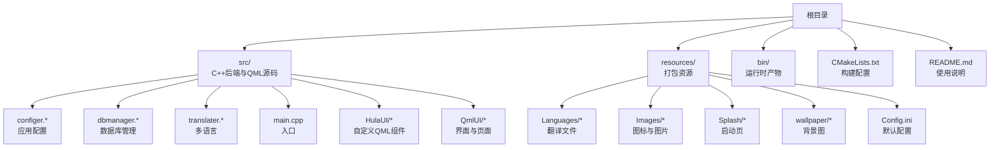
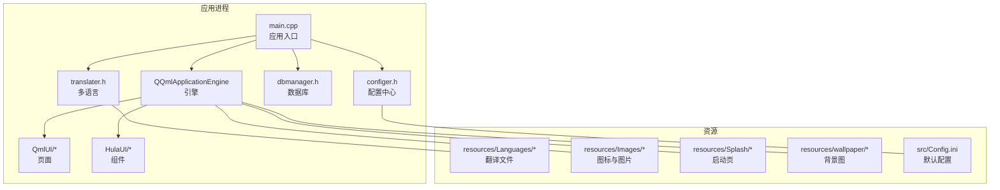
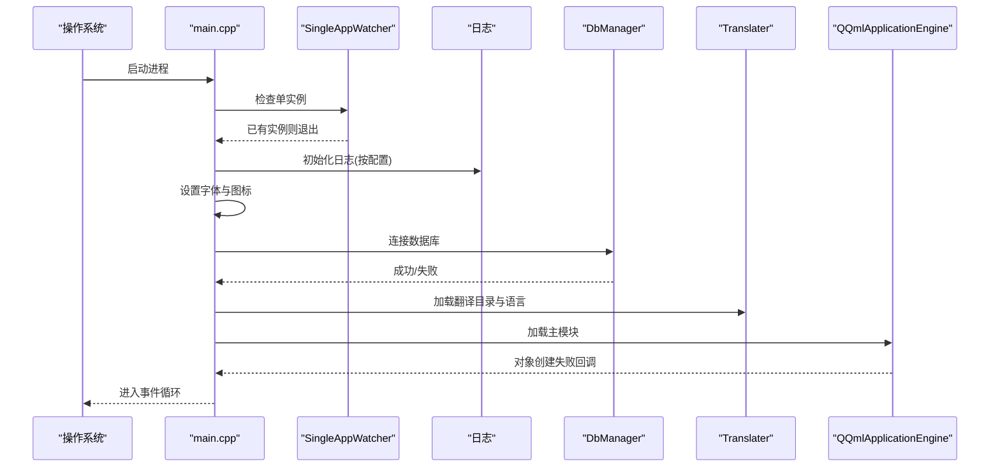
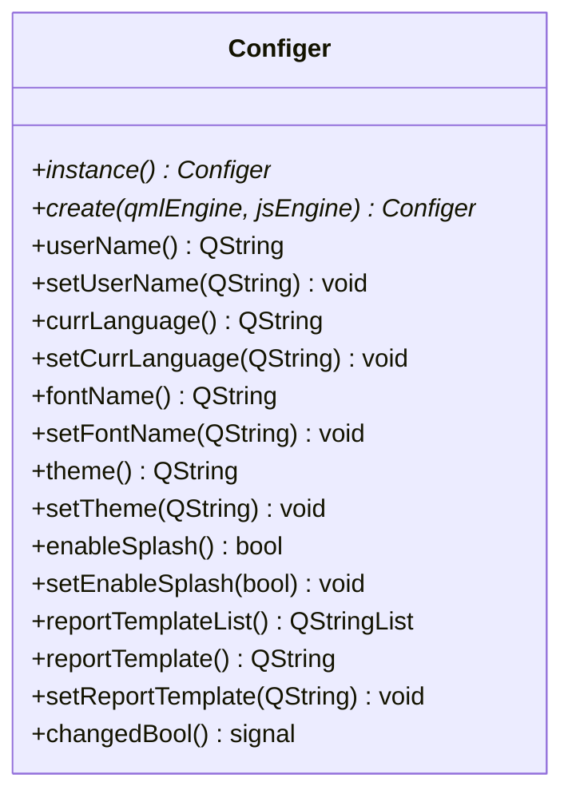
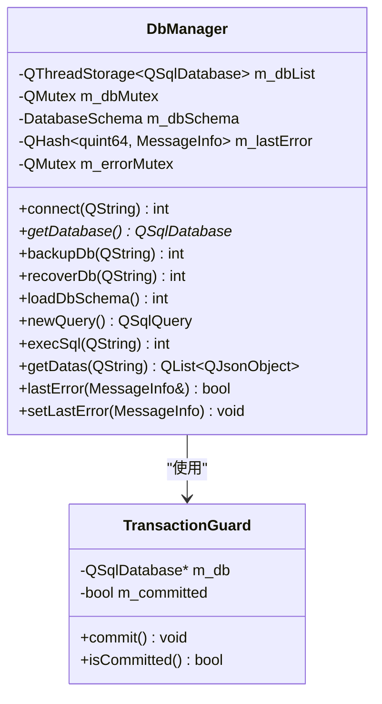
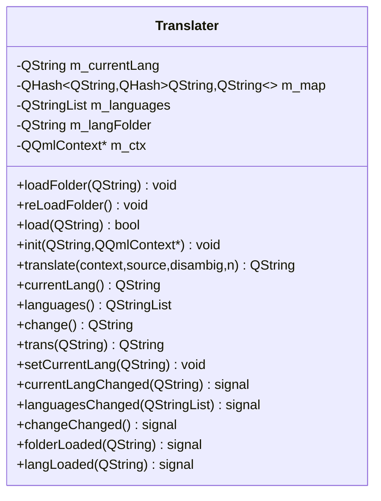
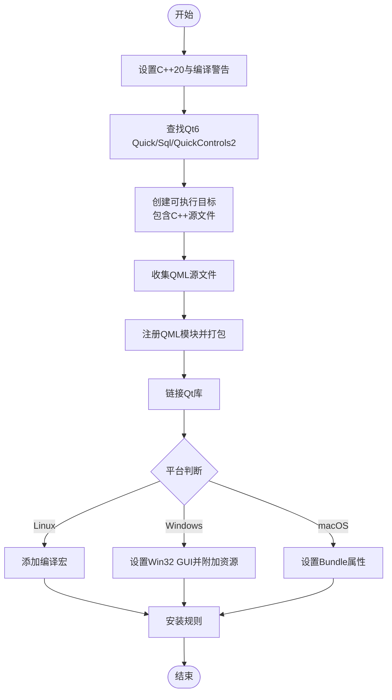
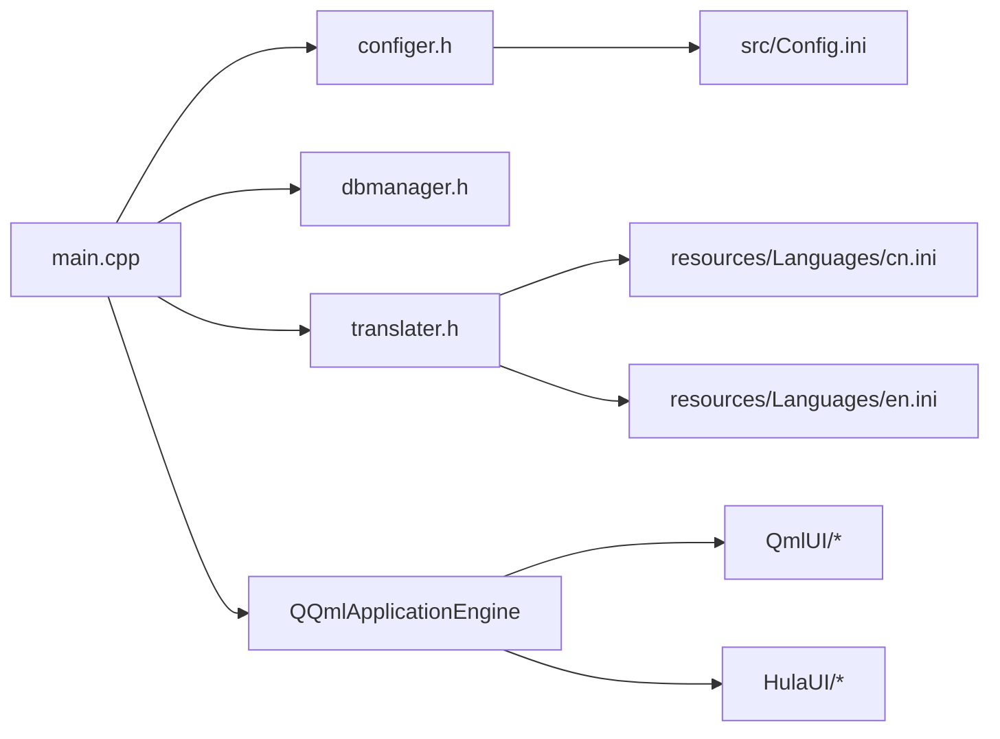

# 开发工作流

<cite>
**本文引用的文件**
- [CMakeLists.txt](file://CMakeLists.txt)
- [README.md](file://README.md)
- [src/main.cpp](file://src/main.cpp)
- [src/Config.ini](file://src/Config.ini)
- [src/configer.h](file://src/configer.h)
- [src/dbmanager.h](file://src/dbmanager.h)
- [src/translater.h](file://src/translater.h)
- [resources/Languages/cn.ini](file://resources/Languages/cn.ini)
- [resources/Languages/en.ini](file://resources/Languages/en.ini)
</cite>

## 目录
1. [简介](#简介)
2. [项目结构](#项目结构)
3. [核心组件](#核心组件)
4. [架构总览](#架构总览)
5. [详细组件分析](#详细组件分析)
6. [依赖关系分析](#依赖关系分析)
7. [性能考虑](#性能考虑)
8. [故障排查指南](#故障排查指南)
9. [结论](#结论)
10. [附录](#附录)

## 简介
本指南面向QmlPlugins项目的开发与发布全流程，覆盖版本控制、分支管理、代码审查与持续集成；开发环境搭建、IDE配置与调试；构建系统使用、增量编译与并行构建优化；自动化测试、代码质量检查与性能分析；以及团队协作、文档维护与知识传承的最佳实践。项目采用C++20与Qt6/QML技术栈，支持多语言、主题切换、SQLite数据库与跨平台部署。

## 项目结构
项目采用“按职责分层”的组织方式：
- 源代码位于 src/，包含C++后端模块（数据库、配置、国际化、消息中心等）与QML前端模块（界面与自定义组件）
- 资源文件位于 resources/ 与 bin/，分别存放打包资源与运行时产物
- 构建脚本位于根目录，使用CMake与Qt6工具链

图表来源
- [CMakeLists.txt:1-137](file://CMakeLists.txt#L1-L137)
- [README.md:36-45](file://README.md#L36-L45)

章节来源
- [CMakeLists.txt:1-137](file://CMakeLists.txt#L1-L137)
- [README.md:1-50](file://README.md#L1-L50)

## 核心组件
- 应用入口与生命周期：负责初始化单实例、日志、字体、数据库连接、多语言与主窗体加载
- 配置中心：集中管理应用配置、主题、语言、字体、数据库路径、相机参数等
- 数据库管理：封装SQLite访问、线程安全连接池、事务守卫、Schema缓存与错误管理
- 多语言：提供QTranslator扩展，支持QML上下文注入与热切换

章节来源
- [src/main.cpp:17-96](file://src/main.cpp#L17-L96)
- [src/configer.h:98-277](file://src/configer.h#L98-L277)
- [src/dbmanager.h:52-192](file://src/dbmanager.h#L52-L192)
- [src/translater.h:27-112](file://src/translater.h#L27-L112)

## 架构总览
应用采用“C++后端 + QML前端”的分层架构。C++侧提供配置、数据库、国际化与消息中心等服务，QML侧负责界面与交互。CMake统一编译，Qt6的Quick/QML模块负责UI渲染与资源打包。

图表来源
- [src/main.cpp:17-96](file://src/main.cpp#L17-L96)
- [src/translater.h:58-58](file://src/translater.h#L58-L58)
- [src/configer.h:56-71](file://src/configer.h#L56-L71)
- [resources/Languages/cn.ini:1-300](file://resources/Languages/cn.ini#L1-L300)
- [resources/Languages/en.ini:1-298](file://resources/Languages/en.ini#L1-L298)

## 详细组件分析

### 应用入口与生命周期（main.cpp）
- 单实例检测：通过独立的监视器对象确保同一时刻仅有一个实例运行
- 日志初始化：根据配置决定日志级别
- 字体与图标：从配置读取字体家族与字号，设置应用字体与图标
- 数据库连接：启动阶段建立数据库连接，失败直接退出
- 多语言：加载翻译目录与当前语言，设置应用显示名
- 激活信号：接收外部激活请求后唤起主窗口
- 退出处理：监听引擎退出信号，支持关机命令在不同平台的执行

图表来源
- [src/main.cpp:24-96](file://src/main.cpp#L24-L96)

章节来源
- [src/main.cpp:17-96](file://src/main.cpp#L17-L96)

### 配置中心（configer.h）
- 单例与QML注册：以QML单例形式暴露给前端，提供丰富的配置项读写接口
- 路径与资源：集中定义QML与Qt侧的资源路径、数据库文件、日志目录等
- 配置项覆盖：包含语言、主题、字体、Splash、登录、壁纸、心跳、报表模板等
- 信号通知：配置变更时发出信号，驱动前端刷新

图表来源
- [src/configer.h:98-277](file://src/configer.h#L98-L277)

章节来源
- [src/configer.h:98-277](file://src/configer.h#L98-L277)

### 数据库管理（dbmanager.h）
- 线程安全：每个线程持有独立的数据库连接，避免并发冲突
- 事务守卫：RAII风格的事务守卫类，构造开启事务，析构未提交自动回滚
- Schema缓存：加载并缓存表结构，提升查询效率
- 错误管理：按线程存储最后错误信息，便于定位问题

图表来源
- [src/dbmanager.h:37-192](file://src/dbmanager.h#L37-L192)

章节来源
- [src/dbmanager.h:52-192](file://src/dbmanager.h#L52-L192)

### 多语言（translater.h）
- QTranslator扩展：提供QML上下文注入、语言切换与热加载能力
- 目录加载：支持从指定目录批量加载翻译文件
- 信号通知：语言切换时发出信号，驱动界面刷新

图表来源
- [src/translater.h:27-112](file://src/translater.h#L27-L112)

章节来源
- [src/translater.h:27-112](file://src/translater.h#L27-L112)

### 构建系统与资源打包（CMakeLists.txt）
- 工具链与标准：要求C++20与Qt6.7+，启用严格编译警告
- 目标输出：可执行文件输出至bin目录，库输出至lib目录
- QML模块：递归收集QML源文件，注册为Qt QML模块并打包
- 平台适配：Linux修复特定编译宏，Windows设置Win32 GUI与资源文件，macOS设置Bundle属性
- 安装规则：定义安装目标与路径

图表来源
- [CMakeLists.txt:16-137](file://CMakeLists.txt#L16-L137)

章节来源
- [CMakeLists.txt:1-137](file://CMakeLists.txt#L1-L137)

### 默认配置（src/Config.ini）
- 默认行为：日志开关、语言、主题、Splash、登录、壁纸、心跳、报表模板等
- 报告模板：支持多套模板的标题、医院名称、颜色、尺寸与Logo配置
- 相机参数：ROI区域、色调、饱和度、亮度等

章节来源
- [src/Config.ini:1-103](file://src/Config.ini#L1-L103)

## 依赖关系分析
- main.cpp 依赖 configer、dbmanager、translater、singleappwatcher 等模块
- QML页面通过 APP_URI 引用 C++ 注册的类型与单例
- CMake 将 QML 源文件打包进 QML 模块，运行时由引擎动态加载

图表来源
- [src/main.cpp:17-96](file://src/main.cpp#L17-L96)
- [src/configer.h:56-71](file://src/configer.h#L56-L71)
- [resources/Languages/cn.ini:1-300](file://resources/Languages/cn.ini#L1-L300)
- [resources/Languages/en.ini:1-298](file://resources/Languages/en.ini#L1-L298)

章节来源
- [src/main.cpp:17-96](file://src/main.cpp#L17-L96)
- [src/configer.h:56-71](file://src/configer.h#L56-L71)
- [resources/Languages/cn.ini:1-300](file://resources/Languages/cn.ini#L1-L300)
- [resources/Languages/en.ini:1-298](file://resources/Languages/en.ini#L1-L298)

## 性能考虑
- 并行构建：使用CMake并行编译以缩短构建时间
- 增量编译：CMake默认支持增量编译，建议在开发阶段保持增量构建
- 数据库访问：利用线程本地连接与Schema缓存减少锁竞争与重复查询
- QML资源：通过CMake打包QML与资源，避免运行时动态扫描带来的开销
- 日志级别：按需调整日志级别，避免在生产环境产生过多I/O

章节来源
- [README.md:24-28](file://README.md#L24-L28)
- [CMakeLists.txt:16-20](file://CMakeLists.txt#L16-L20)
- [src/dbmanager.h:174-188](file://src/dbmanager.h#L174-L188)

## 故障排查指南
- 单实例冲突：若启动后立即退出，检查单实例监视器逻辑与已有实例状态
- 数据库连接失败：查看数据库文件路径与权限，确认连接返回码
- 字体与图标异常：检查配置中的字体家族与图标路径
- 多语言不生效：确认翻译文件目录与当前语言设置，验证QML上下文注入
- 平台差异：Linux需注意编译宏，Windows需确认Win32 GUI与资源文件，macOS需确认Bundle配置

章节来源
- [src/main.cpp:24-50](file://src/main.cpp#L24-L50)
- [src/main.cpp:34-40](file://src/main.cpp#L34-L40)
- [src/translater.h:58-58](file://src/translater.h#L58-L58)
- [CMakeLists.txt:103-126](file://CMakeLists.txt#L103-L126)

## 结论
本指南提供了从开发到发布的完整工作流，结合CMake与Qt6生态，明确了配置、构建、测试、质量与协作的关键实践。建议团队在日常开发中坚持增量构建、严格的代码审查与持续集成，配合完善的文档与知识传承机制，保障项目的长期可维护性与高质量交付。

## 附录

### 版本控制与分支管理
- 分支策略：采用功能分支开发，主分支仅合并稳定功能；hotfix分支用于紧急修复
- 提交规范：遵循“类型: 内容”格式，配合语义化版本号进行发布标注
- 合并与审查：功能完成后发起Pull Request，至少一名同事审查通过后合并

### 代码审查清单
- 代码风格：符合C++20与项目编码规范
- 构建兼容：确保在Windows/Linux/macOS均能通过CMake构建
- 资源路径：检查相对路径与打包规则，避免运行时资源缺失
- 国际化：新增文案需补充中英文翻译文件
- 错误处理：数据库与文件操作需捕获并上报错误

### 持续集成（CI）
- 触发条件：push到主分支与PR时触发
- 步骤建议：拉取依赖 → CMake配置 → 并行构建 → 单元测试 → 代码覆盖率 → 资源打包 → 产物上传
- 平台矩阵：包含Windows、Linux、macOS三套流水线

### 开发环境与IDE配置
- Qt Creator：推荐使用Qt Creator打开工程，自动识别CMake与Qt模块
- CMake参数：建议在构建目录传入构建类型与并行参数
- 调试：断点设置在关键函数（如数据库连接、翻译加载、主窗体显示），观察线程与资源路径

### 构建系统使用技巧
- 清晰的构建输出：使用CMake输出目录统一管理bin与lib
- QML模块化：通过CMake递归收集QML文件并注册为模块，便于运行时加载
- 平台适配：在CMake中区分平台并设置相应属性与资源

### 增量编译与并行构建
- 增量编译：保持默认CMake行为，仅修改受影响文件
- 并行构建：在构建命令中启用并行以提升速度
- 依赖最小化：减少不必要的头文件包含与模板实例化

### 自动化测试与代码质量
- 单元测试：针对configer、dbmanager等模块编写单元测试
- 静态分析：引入Clang-Tidy或类似工具进行静态检查
- 覆盖率：在CI中收集并报告测试覆盖率

### 性能分析
- 启动性能：测量从main到主窗体显示的时间，关注数据库连接与翻译加载
- UI响应：监控QML页面切换与数据绑定的卡顿
- 数据库：分析查询耗时与锁等待，必要时增加索引或优化事务

### 团队协作与知识传承
- 文档：README与模块注释同步更新，形成“需求—设计—实现—测试—发布”的闭环文档
- 知识库：沉淀常见问题与解决方案，定期回顾与分享
- 培训：新成员入职时提供环境搭建与开发流程培训