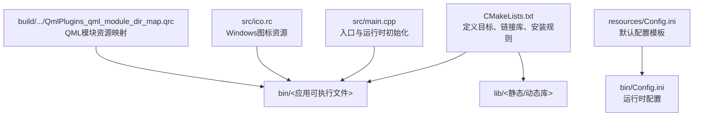
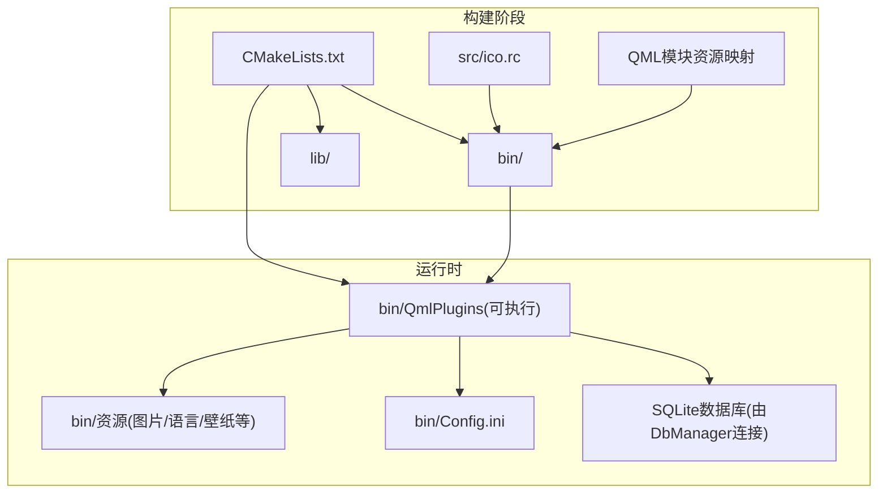
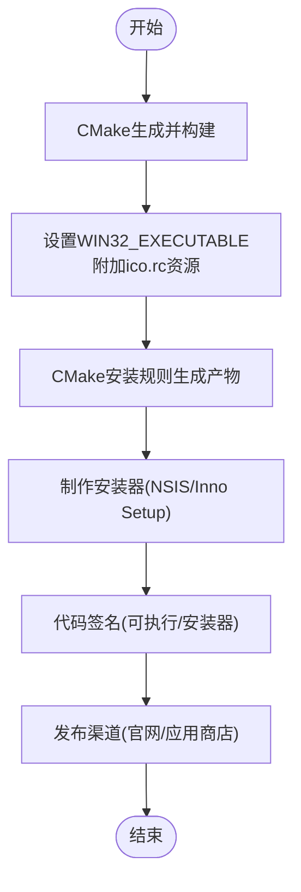
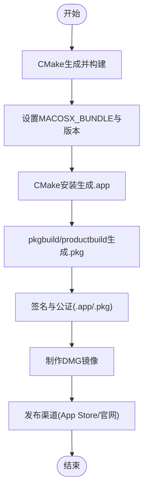
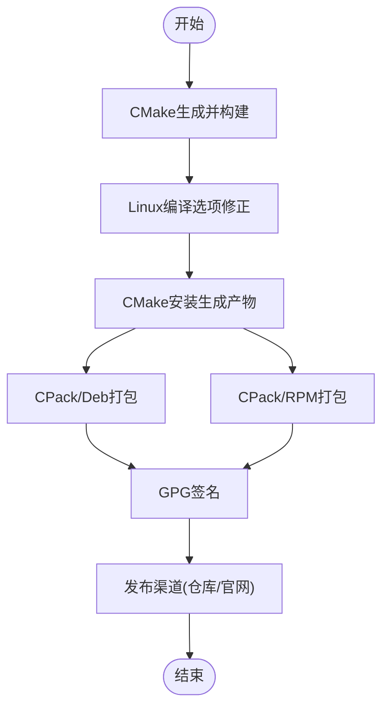
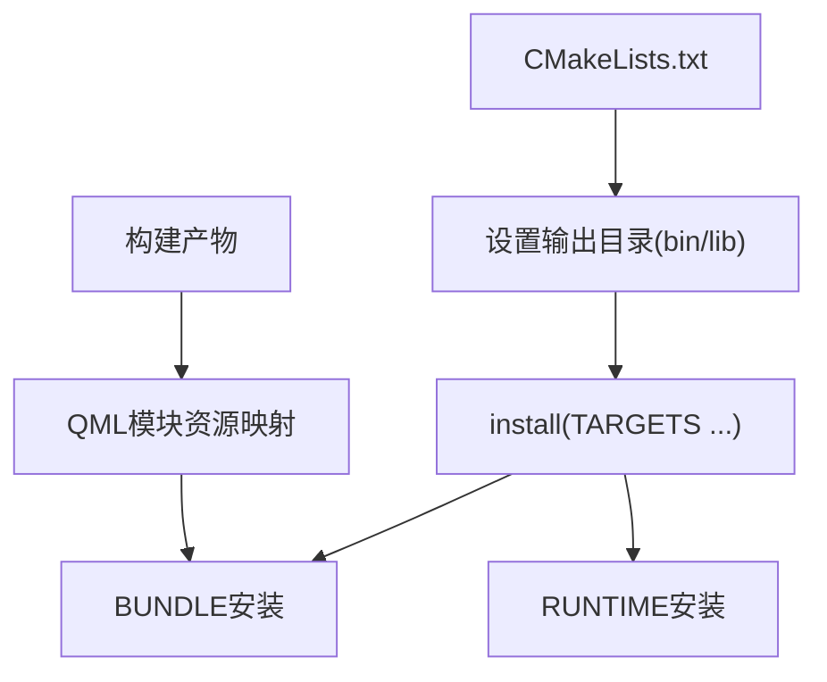
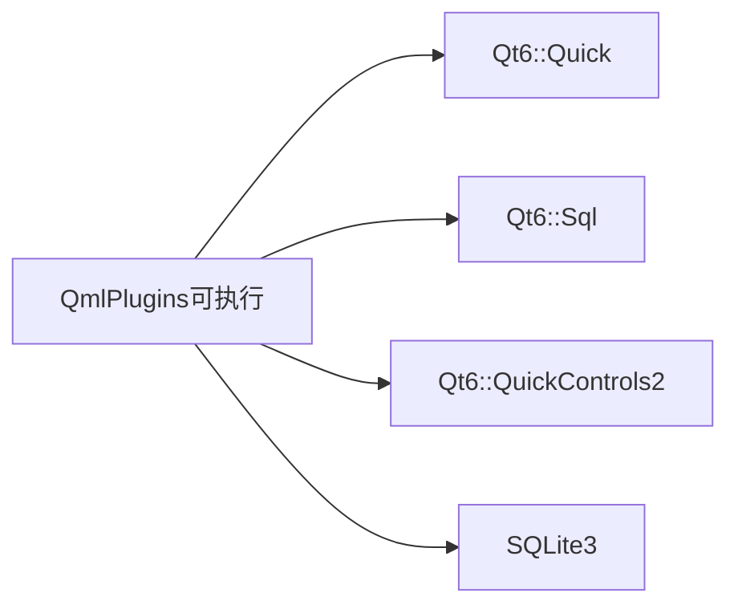
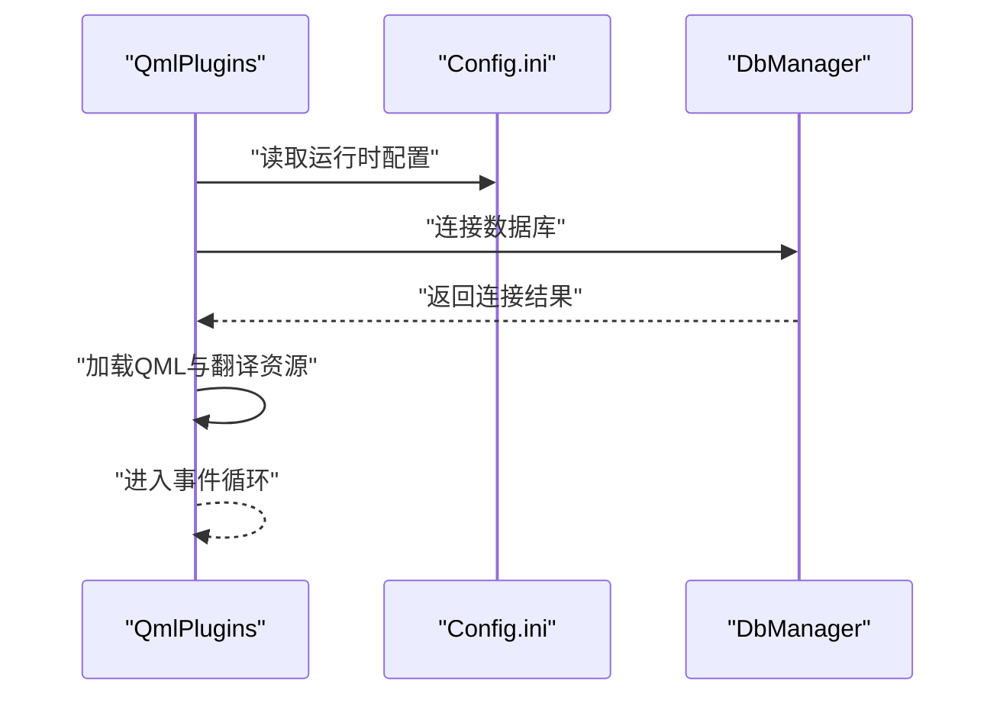
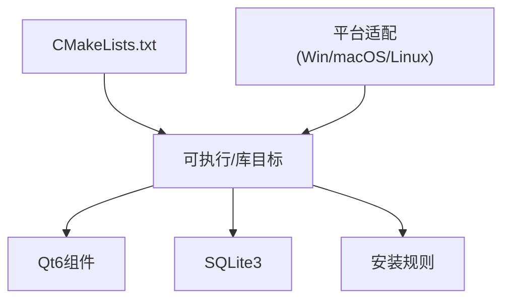

# 打包与分发

<cite>
**本文引用的文件**
- [CMakeLists.txt](file://CMakeLists.txt)
- [README.md](file://README.md)
- [src/main.cpp](file://src/main.cpp)
- [src/ico.rc](file://src/ico.rc)
- [bin/Config.ini](file://bin/Config.ini)
- [resources/Config.ini](file://resources/Config.ini)
- [build/Desktop_Qt_6_7_3-Debug/QmlPlugins/QmlPlugins_qml_module_dir_map.qrc](file://build/Desktop_Qt_6_7_3-Debug/QmlPlugins/QmlPlugins_qml_module_dir_map.qrc)
</cite>

## 目录
1. [简介](#简介)
2. [项目结构](#项目结构)
3. [核心组件](#核心组件)
4. [架构总览](#架构总览)
5. [详细组件分析](#详细组件分析)
6. [依赖关系分析](#依赖关系分析)
7. [性能考虑](#性能考虑)
8. [故障排查指南](#故障排查指南)
9. [结论](#结论)
10. [附录](#附录)

## 简介
本指南面向QmlPlugins项目的打包与分发，覆盖Windows可执行文件、macOS应用程序包以及Linux软件包的制作流程；解释CMake安装规则、目标文件组织与依赖库处理；并提供数字签名、版本管理、自动更新与卸载程序的配置思路，以及发布渠道选择、用户体验优化与常见问题排查建议。

## 项目结构
- 源码位于src/，包含C++后端逻辑与QML前端界面。
- 资源文件位于resources/与bin/，其中bin/为运行时目录，resources/为默认资源模板。
- 构建系统使用CMake，目标在构建目录生成后输出至仓库根目录的bin/与lib/。
- 平台差异化配置：Windows设置Win32 GUI与资源文件，macOS设置Bundle属性，Linux修正编译选项以兼容Qt 6.7+。

**图表来源**
- [CMakeLists.txt:11-134](file://CMakeLists.txt#L11-L134)
- [src/main.cpp:17-96](file://src/main.cpp#L17-L96)
- [resources/Config.ini:1-103](file://resources/Config.ini#L1-L103)
- [bin/Config.ini:1-103](file://bin/Config.ini#L1-L103)
- [src/ico.rc:1-2](file://src/ico.rc#L1-L2)
- [build/Desktop_Qt_6_7_3-Debug/QmlPlugins/QmlPlugins_qml_module_dir_map.qrc:1-7](file://build/Desktop_Qt_6_7_3-Debug/QmlPlugins/QmlPlugins_qml_module_dir_map.qrc#L1-L7)

**章节来源**
- [CMakeLists.txt:11-134](file://CMakeLists.txt#L11-L134)
- [README.md:36-45](file://README.md#L36-L45)

## 核心组件
- CMake构建与安装规则
  - 输出目录：可执行文件与库分别置于根目录bin/与lib/。
  - 安装规则：BUNDLE与RUNTIME目标按约定路径安装。
- 平台适配
  - Windows：Win32 GUI、资源文件ico.rc。
  - macOS：Bundle属性与版本号设置。
  - Linux：编译选项修正以规避特定浮点类型问题。
- 运行时资源与配置
  - QML模块资源映射由构建产物生成。
  - 默认配置模板来自resources/Config.ini，运行时复制到bin/Config.ini。

**章节来源**
- [CMakeLists.txt:11-134](file://CMakeLists.txt#L11-L134)
- [src/ico.rc:1-2](file://src/ico.rc#L1-L2)
- [resources/Config.ini:1-103](file://resources/Config.ini#L1-L103)
- [bin/Config.ini:1-103](file://bin/Config.ini#L1-L103)
- [build/Desktop_Qt_6_7_3-Debug/QmlPlugins/QmlPlugins_qml_module_dir_map.qrc:1-7](file://build/Desktop_Qt_6_7_3-Debug/QmlPlugins/QmlPlugins_qml_module_dir_map.qrc#L1-L7)

## 架构总览
下图展示从源码到最终可分发包的关键路径：CMake配置、平台适配、资源打包、安装规则与运行时加载。

**图表来源**
- [CMakeLists.txt:11-134](file://CMakeLists.txt#L11-L134)
- [src/ico.rc:1-2](file://src/ico.rc#L1-L2)
- [build/Desktop_Qt_6_7_3-Debug/QmlPlugins/QmlPlugins_qml_module_dir_map.qrc:1-7](file://build/Desktop_Qt_6_7_3-Debug/QmlPlugins/QmlPlugins_qml_module_dir_map.qrc#L1-L7)
- [bin/Config.ini:1-103](file://bin/Config.ini#L1-L103)
- [src/main.cpp:46-50](file://src/main.cpp#L46-L50)

## 详细组件分析

### Windows 可执行文件打包
- 目标属性
  - 设置WIN32_EXECUTABLE为GUI应用，避免控制台闪烁。
  - 链接Windows资源文件ico.rc，注入图标。
- 安装与分发
  - 使用CMake安装规则将BUNDLE与RUNTIME安装至约定位置。
  - 推荐配合NSIS或Inno Setup生成安装器，包含运行时依赖（如VC++ Redistributable）与快捷方式。
- 数字签名
  - 在CI中使用代码签名证书对可执行文件与安装器进行时间戳签名，确保Windows SmartScreen与杀毒软件识别。
- 版本管理
  - 在CMake中维护项目VERSION，并在安装器元数据中标注版本；每次发布更新变更日志。
- 自动更新
  - 可在应用内实现基于HTTP的更新检查，下载差分包并重启替换；或使用第三方方案（如Squirrel.Windows）。
- 卸载程序
  - 安装器内置卸载程序，清理注册表项与文件；保留用户配置文件（bin/Config.ini）以提升复用率。

**图表来源**
- [CMakeLists.txt:110-117](file://CMakeLists.txt#L110-L117)
- [src/ico.rc:1-2](file://src/ico.rc#L1-L2)
- [CMakeLists.txt:130-134](file://CMakeLists.txt#L130-L134)

**章节来源**
- [CMakeLists.txt:110-117](file://CMakeLists.txt#L110-L117)
- [CMakeLists.txt:130-134](file://CMakeLists.txt#L130-L134)
- [src/ico.rc:1-2](file://src/ico.rc#L1-L2)

### macOS 应用程序包打包
- 目标属性
  - 设置MACOSX_BUNDLE、版本号与Bundle标志，生成.app包。
- 安装与分发
  - 使用CMake安装规则生成BUNDLE；进一步使用pkgbuild与productbuild制作.pkg安装包。
  - 将.app放入DMG镜像以便分发。
- 数字签名
  - 对.app进行开发者证书签名，必要时启用公证（notarize），以满足Gatekeeper要求。
- 版本管理
  - 在CMake中维护版本，在Info.plist中同步；安装器元数据标注版本。
- 自动更新
  - 使用Sparkle或内置HTTP检查，下载.dmg/.zip并提示安装；或采用App Store分发。
- 卸载程序
  - 提供“移除应用”脚本或在安装器中提供卸载向导，保留用户文档与配置。

**图表来源**
- [CMakeLists.txt:119-126](file://CMakeLists.txt#L119-L126)
- [CMakeLists.txt:130-134](file://CMakeLists.txt#L130-L134)

**章节来源**
- [CMakeLists.txt:119-126](file://CMakeLists.txt#L119-L126)
- [CMakeLists.txt:130-134](file://CMakeLists.txt#L130-L134)

### Linux 软件包打包
- 目标属性
  - Linux平台修正编译选项以兼容Qt 6.7+。
- 安装与分发
  - 使用CMake安装规则生成可执行与库；推荐制作DEB/RPM包。
  - DEB：使用CPack的DEB生成器或dpkg-buildpackage；RPM：使用CPack的RPM生成器或rpmbuild。
- 数字签名
  - 对包进行GPG签名；在仓库中提供签名文件与密钥。
- 版本管理
  - 在CMake中维护版本；包元数据中同步版本与发布说明。
- 自动更新
  - 通过发行版仓库推送更新；或提供应用内更新机制（需注意Linux生态差异）。
- 卸载程序
  - 包管理器负责安装/卸载；提供清理用户配置的可选脚本。

**图表来源**
- [CMakeLists.txt:103-108](file://CMakeLists.txt#L103-L108)
- [CMakeLists.txt:130-134](file://CMakeLists.txt#L130-L134)

**章节来源**
- [CMakeLists.txt:103-108](file://CMakeLists.txt#L103-L108)
- [CMakeLists.txt:130-134](file://CMakeLists.txt#L130-L134)

### CMake安装规则与目标组织
- 输出目录
  - 可执行文件与库统一输出至根目录bin/与lib/，便于打包。
- 安装规则
  - BUNDLE与RUNTIME目标按约定路径安装，确保安装器可定位产物。
- QML模块资源
  - 构建产物包含QML模块资源映射文件，保证运行时QML资源正确加载。

**图表来源**
- [CMakeLists.txt:11-13](file://CMakeLists.txt#L11-L13)
- [CMakeLists.txt:130-134](file://CMakeLists.txt#L130-L134)
- [build/Desktop_Qt_6_7_3-Debug/QmlPlugins/QmlPlugins_qml_module_dir_map.qrc:1-7](file://build/Desktop_Qt_6_7_3-Debug/QmlPlugins/QmlPlugins_qml_module_dir_map.qrc#L1-L7)

**章节来源**
- [CMakeLists.txt:11-13](file://CMakeLists.txt#L11-L13)
- [CMakeLists.txt:130-134](file://CMakeLists.txt#L130-L134)

### 依赖库处理
- Qt组件
  - 通过find_package引入Quick、Sql、QuickControls2；在target_link_libraries中链接。
- SQLite
  - 项目声明依赖SQLite3；确保运行时系统具备相应库或随安装器分发。
- 平台差异
  - Linux修正编译选项；Windows设置Win32 GUI与资源；macOS设置Bundle。

**图表来源**
- [CMakeLists.txt:23](file://CMakeLists.txt#L23)
- [CMakeLists.txt:96-100](file://CMakeLists.txt#L96-L100)

**章节来源**
- [CMakeLists.txt:23](file://CMakeLists.txt#L23)
- [CMakeLists.txt:96-100](file://CMakeLists.txt#L96-L100)

### 运行时配置与资源加载
- 配置文件
  - 默认配置模板来自resources/Config.ini，运行时复制到bin/Config.ini。
- 资源加载
  - 应用启动时加载QML模块与翻译资源，字体与主题由配置驱动。
- 数据库连接
  - 启动阶段建立数据库连接，失败则终止进程并记录日志。

**图表来源**
- [src/main.cpp:46-50](file://src/main.cpp#L46-L50)
- [bin/Config.ini:1-103](file://bin/Config.ini#L1-L103)
- [resources/Config.ini:1-103](file://resources/Config.ini#L1-L103)

**章节来源**
- [src/main.cpp:46-50](file://src/main.cpp#L46-L50)
- [bin/Config.ini:1-103](file://bin/Config.ini#L1-L103)
- [resources/Config.ini:1-103](file://resources/Config.ini#L1-L103)

## 依赖关系分析
- 组件耦合
  - CMake集中定义目标、链接库与安装规则，降低源码与打包逻辑耦合。
  - 平台适配通过条件分支实现，保持单一构建树多平台产出。
- 外部依赖
  - Qt6组件与SQLite3为必须依赖；Windows与macOS安装器需包含运行时依赖。
- 潜在环路
  - 当前未见直接循环依赖；安装规则与平台适配相互独立。

**图表来源**
- [CMakeLists.txt:23](file://CMakeLists.txt#L23)
- [CMakeLists.txt:96-100](file://CMakeLists.txt#L96-L100)
- [CMakeLists.txt:110-126](file://CMakeLists.txt#L110-L126)

**章节来源**
- [CMakeLists.txt:23](file://CMakeLists.txt#L23)
- [CMakeLists.txt:96-100](file://CMakeLists.txt#L96-L100)
- [CMakeLists.txt:110-126](file://CMakeLists.txt#L110-L126)

## 性能考虑
- 构建性能
  - 使用并行构建与增量构建减少重复编译时间。
- 运行时性能
  - 合理组织QML资源与懒加载策略，避免启动时大量资源加载。
- 分发体积
  - 仅包含必需运行时库与资源；对第三方库进行裁剪与去重。

## 故障排查指南
- 启动失败（数据库连接错误）
  - 现象：启动即退出并记录错误日志。
  - 排查：确认数据库文件存在与权限、SQLite3可用性。
- 资源加载异常
  - 现象：界面缺失或主题不生效。
  - 排查：核对bin/Config.ini与QML模块资源映射是否完整。
- Windows控制台闪现
  - 现象：双击可执行出现黑框。
  - 排查：确认已设置WIN32_EXECUTABLE且链接ico.rc。
- macOS Gatekeeper拒绝运行
  - 现象：提示来自未知开发者或无法打开。
  - 排查：重新签名并公证.app与安装包。

**章节来源**
- [src/main.cpp:46-50](file://src/main.cpp#L46-L50)
- [CMakeLists.txt:110-117](file://CMakeLists.txt#L110-L117)
- [build/Desktop_Qt_6_7_3-Debug/QmlPlugins/QmlPlugins_qml_module_dir_map.qrc:1-7](file://build/Desktop_Qt_6_7_3-Debug/QmlPlugins/QmlPlugins_qml_module_dir_map.qrc#L1-L7)

## 结论
通过CMake集中管理构建与安装规则，结合平台差异化配置，QmlPlugins可在Windows、macOS与Linux上稳定产出可分发包。配合数字签名、版本管理与自动更新机制，可显著提升发布质量与用户体验。建议在CI中自动化上述流程，并对安装器与包进行签名与测试。

## 附录
- 发布渠道建议
  - Windows：官网直下+MSIX（可选）、应用商店（可选）。
  - macOS：官网+Mac App Store（可选）。
  - Linux：发行版仓库+官网直下。
- 用户体验优化
  - 安装器提供最小化安装与自定义路径；提供快速启动与开机自启选项。
  - 首次运行引导与帮助入口；清晰的卸载与重置配置选项。
- 常用工具链
  - Windows：NSIS/Inno Setup、SignTool、WiX（可选）。
  - macOS：pkgbuild/productbuild、codesign、notarytool。
  - Linux：CPack、dpkg/rpmbuild、GPG。