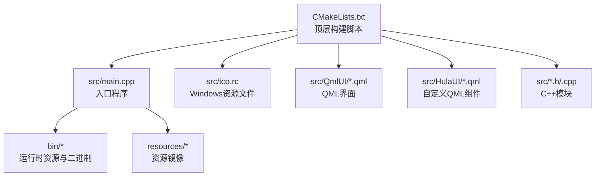
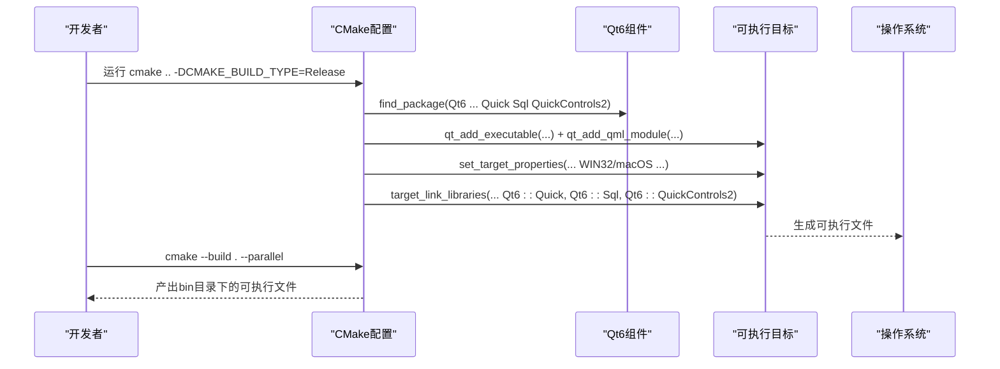
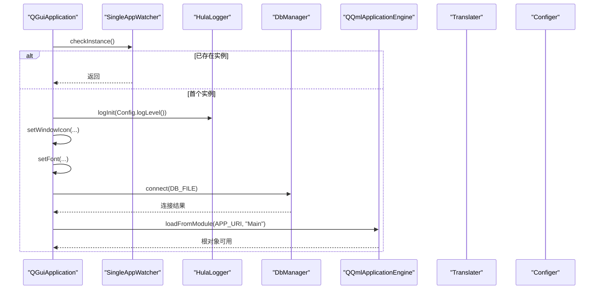
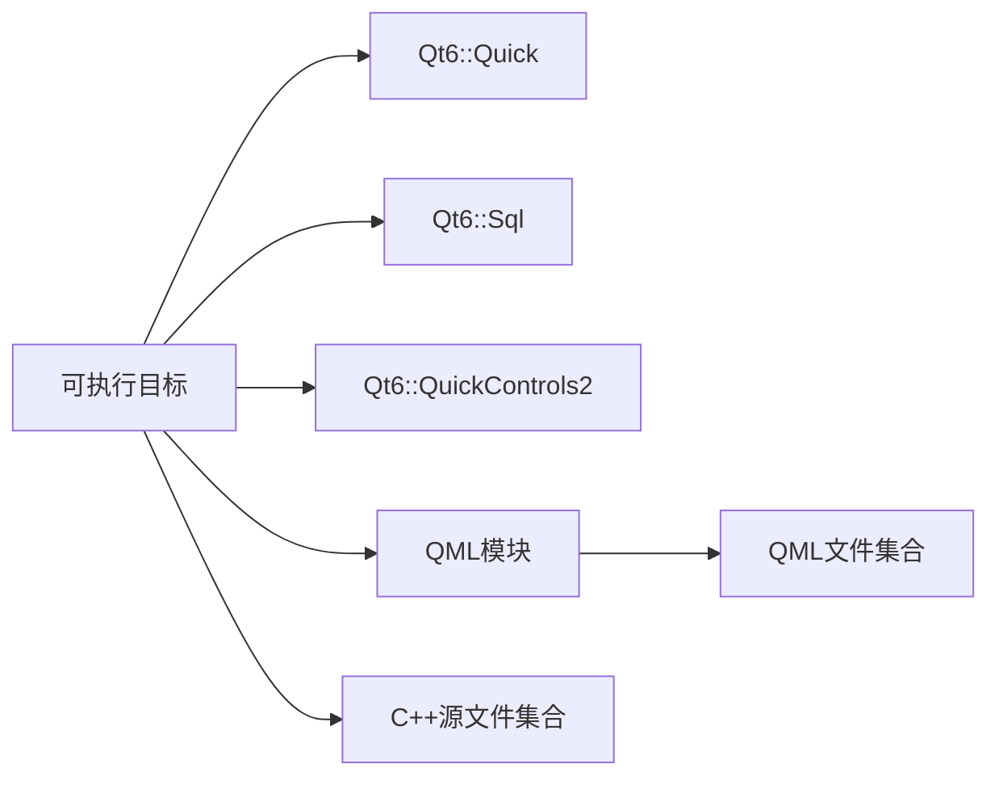

# 构建与部署

<cite>
**本文引用的文件**
- [CMakeLists.txt](file://CMakeLists.txt)
- [README.md](file://README.md)
- [src/main.cpp](file://src/main.cpp)
- [src/ico.rc](file://src/ico.rc)
- [src/Config.ini](file://src/Config.ini)
- [src/configer.h](file://src/configer.h)
- [src/configer.cpp](file://src/configer.cpp)
- [src/hulalogger.cpp](file://src/hulalogger.cpp)
- [src/common.h](file://src/common.h)
</cite>

## 目录
1. [简介](#简介)
2. [项目结构](#项目结构)
3. [核心组件](#核心组件)
4. [架构总览](#架构总览)
5. [详细组件分析](#详细组件分析)
6. [依赖关系分析](#依赖关系分析)
7. [性能考虑](#性能考虑)
8. [故障排查指南](#故障排查指南)
9. [结论](#结论)
10. [附录](#附录)

## 简介
本指南面向QmlPlugins项目的构建与部署，围绕CMake构建系统展开，覆盖跨平台编译配置、编译选项与依赖管理、可执行文件打包与安装、分发策略、持续集成与自动化测试建议、调试与性能分析最佳实践等内容。文档同时结合项目现有配置与源码，给出可落地的实施步骤与注意事项。

## 项目结构
项目采用“源码在src、资源在resources与bin、顶层CMakeLists”的组织方式；CMake负责生成可执行文件并按平台设置属性；运行时资源（图片、语言包、配置）位于bin与resources目录，应用启动时从相对路径加载。

图表来源
- [CMakeLists.txt:29-53](file://CMakeLists.txt#L29-L53)
- [src/main.cpp:17-99](file://src/main.cpp#L17-L99)

章节来源
- [CMakeLists.txt:1-137](file://CMakeLists.txt#L1-L137)
- [README.md:22-45](file://README.md#L22-L45)

## 核心组件
- 构建系统与编译器标准
  - C++20标准、MSVC/Warn级别、Linux平台对浮点运算宏处理。
- Qt模块与链接
  - Quick、Sql、QuickControls2；QML模块注册与单例类型标记。
- 平台适配
  - Windows GUI、macOS Bundle、Linux特定编译选项。
- 安装与输出
  - 可执行文件安装位置与输出目录统一到bin/lib。

章节来源
- [CMakeLists.txt:7-26](file://CMakeLists.txt#L7-L26)
- [CMakeLists.txt:95-100](file://CMakeLists.txt#L95-L100)
- [CMakeLists.txt:102-128](file://CMakeLists.txt#L102-L128)
- [CMakeLists.txt:130-134](file://CMakeLists.txt#L130-L134)

## 架构总览
下图展示从CMake到可执行文件的关键流程：CMake解析顶层脚本，查找Qt组件，创建可执行目标，注册QML模块与单例，按平台设置属性，最终生成可执行文件并进行安装。

图表来源
- [CMakeLists.txt:22-26](file://CMakeLists.txt#L22-L26)
- [CMakeLists.txt:29-53](file://CMakeLists.txt#L29-L53)
- [CMakeLists.txt:80-93](file://CMakeLists.txt#L80-L93)
- [CMakeLists.txt:110-126](file://CMakeLists.txt#L110-L126)
- [CMakeLists.txt:130-134](file://CMakeLists.txt#L130-L134)

## 详细组件分析

### CMake构建系统与编译选项
- 版本与标准
  - 最低CMake版本、C++20标准、禁用扩展。
- 编译器警告
  - MSVC使用/W4；其他平台使用-Wall -Wextra -Wpedantic。
- Qt组件与标准设置
  - 查找Quick、Sql、QuickControls2；使用qt_standard_project_setup确保版本约束。
- 目标与包含目录
  - qt_add_executable聚合源文件；target_include_directories设置src为私有包含路径。
- QML模块与单例
  - set_source_files_properties标记单例类型；qt_add_qml_module注册QML文件与C++源。
- 平台适配
  - Linux修复浮点运算宏；Windows设置Win32 GUI并附加ico.rc；macOS设置Bundle属性。
- 安装规则
  - install将BUNDLE与RUNTIME安装至指定位置。

章节来源
- [CMakeLists.txt:3-9](file://CMakeLists.txt#L3-L9)
- [CMakeLists.txt:15-20](file://CMakeLists.txt#L15-L20)
- [CMakeLists.txt:22-26](file://CMakeLists.txt#L22-L26)
- [CMakeLists.txt:54-55](file://CMakeLists.txt#L54-L55)
- [CMakeLists.txt:57-65](file://CMakeLists.txt#L57-L65)
- [CMakeLists.txt:79-93](file://CMakeLists.txt#L79-L93)
- [CMakeLists.txt:102-126](file://CMakeLists.txt#L102-L126)
- [CMakeLists.txt:130-134](file://CMakeLists.txt#L130-L134)

### 启动流程与运行时资源
- 启动流程要点
  - 强制使用XCB协议以规避Wayland窗口问题；单实例检测；初始化日志；设置字体；加载翻译；连接数据库；加载QML模块。
- 资源路径与配置
  - 配置文件与资源路径由Configer集中管理；运行时从相对路径加载图片、语言包、Splash等。

图表来源
- [src/main.cpp:17-99](file://src/main.cpp#L17-L99)
- [src/configer.h:55-71](file://src/configer.h#L55-L71)
- [src/configer.cpp:42-50](file://src/configer.cpp#L42-L50)

章节来源
- [src/main.cpp:17-99](file://src/main.cpp#L17-L99)
- [src/configer.h:55-71](file://src/configer.h#L55-L71)
- [src/configer.cpp:42-50](file://src/configer.cpp#L42-L50)

### 日志系统与错误码
- 日志系统
  - HulaLogger提供线程安全的日志写入、级别映射与文件打开失败的降级输出。
- 错误码体系
  - 以ErrorCode枚举定义统一错误码区间，便于上层判断与提示。

章节来源
- [src/hulalogger.cpp:270-328](file://src/hulalogger.cpp#L270-L328)
- [src/common.h:63-73](file://src/common.h#L63-L73)

### 平台特定配置与打包
- Windows
  - 设置WIN32_EXECUTABLE为GUI应用；附加ico.rc资源文件；图标资源声明。
- macOS
  - 设置MACOSX_BUNDLE为Bundle应用；设置Bundle版本信息。
- Linux
  - 针对Qt 6.7+的_Float16问题添加编译宏以规避编译错误。

章节来源
- [CMakeLists.txt:110-117](file://CMakeLists.txt#L110-L117)
- [CMakeLists.txt:119-126](file://CMakeLists.txt#L119-L126)
- [CMakeLists.txt:103-108](file://CMakeLists.txt#L103-L108)
- [src/ico.rc:1-2](file://src/ico.rc#L1-L2)

### 安装与分发策略
- 安装目标
  - install将BUNDLE与RUNTIME安装到系统路径，便于打包与部署。
- 分发建议
  - 将bin目录作为分发包根目录，包含可执行文件、资源与配置；macOS建议打包.app；Windows建议生成.exe与必要DLL；Linux建议打包为deb/rpm或便携包。

章节来源
- [CMakeLists.txt:130-134](file://CMakeLists.txt#L130-L134)
- [README.md:36-45](file://README.md#L36-L45)

## 依赖关系分析
- C++模块与QML模块
  - C++源文件通过qt_add_executable与qt_add_qml_module共同构成应用；QML单例类型需在注册QML模块前标记。
- Qt组件依赖
  - Quick、Sql、QuickControls2三者缺一不可；DbManager与Sql模块耦合。
- 平台依赖
  - Linux需处理编译宏；Windows需GUI属性与资源文件；macOS需Bundle属性。

图表来源
- [CMakeLists.txt:95-100](file://CMakeLists.txt#L95-L100)
- [CMakeLists.txt:79-93](file://CMakeLists.txt#L79-L93)

章节来源
- [CMakeLists.txt:79-93](file://CMakeLists.txt#L79-L93)
- [CMakeLists.txt:95-100](file://CMakeLists.txt#L95-L100)

## 性能考虑
- 构建性能
  - 使用--parallel并行构建；合理划分目标与模块，减少不必要的重编译。
- 运行时性能
  - 启动阶段避免阻塞操作；数据库连接与资源加载尽量异步；日志级别按需调整。
- 调试与分析
  - 使用Qt Creator或lldb/gdb进行断点调试；利用日志定位问题；对耗时操作增加统计与告警。

## 故障排查指南
- 构建失败
  - Qt组件未找到：确认Qt6.7+安装与环境变量；检查find_package参数。
  - Linux编译报_Float16错误：确认已添加编译宏。
  - Windows GUI图标不显示：确认ico.rc资源文件已加入target_sources。
- 运行时问题
  - 单实例冲突：确认SingleAppWatcher工作正常。
  - 数据库连接失败：检查DB_FILE路径与权限；查看DbManager返回码。
  - QML加载失败：确认APP_URI与loadFromModule一致；检查QML文件路径与注册顺序。
- 日志与诊断
  - 日志级别：通过Config.ini Log段控制；HulaLogger提供线程安全写入与降级输出。
  - 错误码：参考ErrorCode枚举，快速定位模块与错误类别。

章节来源
- [CMakeLists.txt:22-26](file://CMakeLists.txt#L22-L26)
- [CMakeLists.txt:103-108](file://CMakeLists.txt#L103-L108)
- [CMakeLists.txt:110-117](file://CMakeLists.txt#L110-L117)
- [src/main.cpp:46-50](file://src/main.cpp#L46-L50)
- [src/hulalogger.cpp:270-328](file://src/hulalogger.cpp#L270-L328)
- [src/common.h:63-73](file://src/common.h#L63-L73)

## 结论
本指南基于现有CMake与源码，给出了QmlPlugins的构建与部署路径：明确编译标准与平台差异、规范QML模块注册与单例类型、完善安装与分发策略，并提供调试与性能分析建议。遵循上述流程可稳定地在多平台上生成可运行的可执行文件并交付使用。

## 附录
- 快速构建步骤
  - 创建并进入build目录，执行CMake配置与并行构建。
- 关键配置项
  - CMAKE_BUILD_TYPE、APP_URI、输出目录、平台属性与安装规则。

章节来源
- [README.md:22-28](file://README.md#L22-L28)
- [CMakeLists.txt:11-13](file://CMakeLists.txt#L11-L13)
- [CMakeLists.txt:128-128](file://CMakeLists.txt#L128-L128)