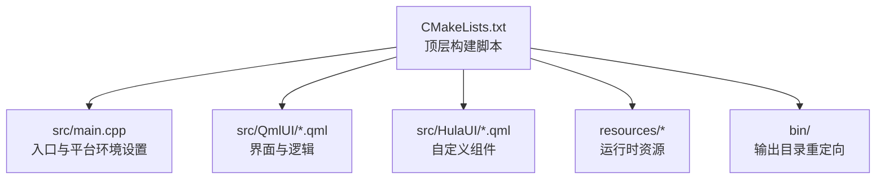
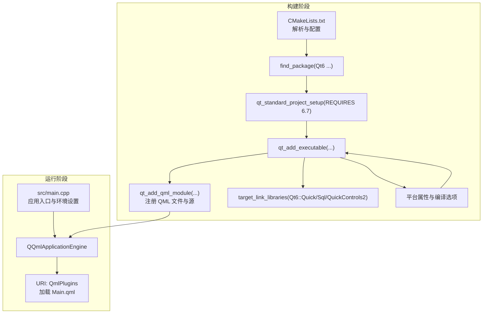
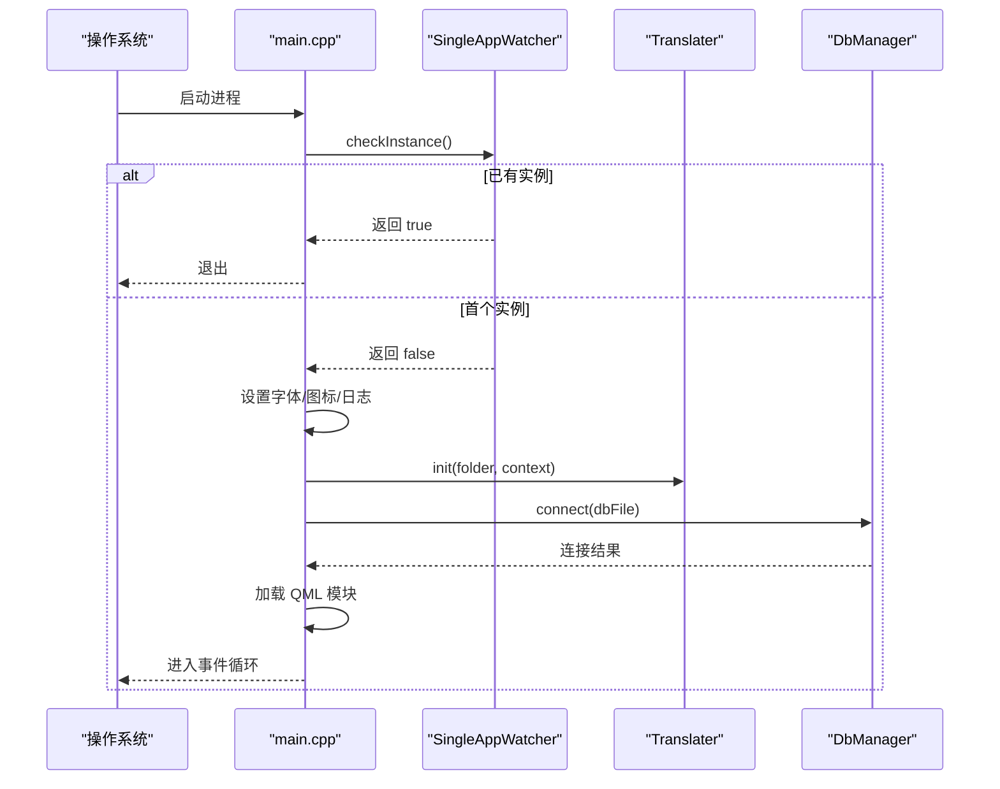
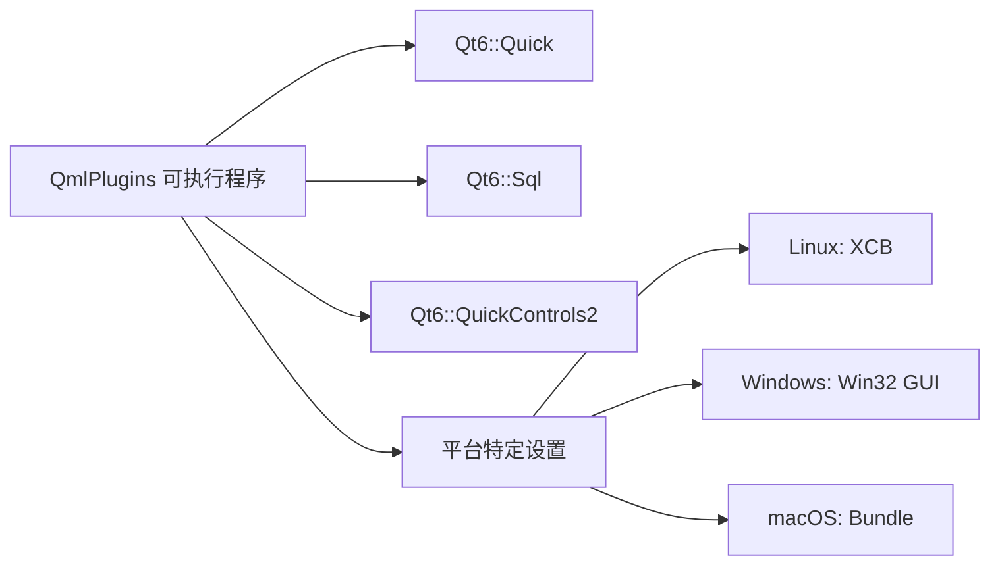

# 跨平台编译

<cite>
**本文引用的文件**
- [CMakeLists.txt](file://CMakeLists.txt)
- [README.md](file://README.md)
- [src/main.cpp](file://src/main.cpp)
- [src/singleappwatcher.h](file://src/singleappwatcher.h)
- [src/translater.h](file://src/translater.h)
- [src/QmlUI/paint.js](file://src/QmlUI/paint.js)
- [src/Config.ini](file://src/Config.ini)
- [resources/Config.ini](file://resources/Config.ini)
</cite>

## 目录
1. [简介](#简介)
2. [项目结构](#项目结构)
3. [核心组件](#核心组件)
4. [架构总览](#架构总览)
5. [详细组件分析](#详细组件分析)
6. [依赖关系分析](#依赖关系分析)
7. [性能考虑](#性能考虑)
8. [故障排查指南](#故障排查指南)
9. [结论](#结论)
10. [附录](#附录)

## 简介
本指南面向使用 CMake 与 Qt6/QML 的开发者，围绕 QmlPlugins 项目提供跨平台（Windows、Linux、macOS）编译的系统化实践说明。内容覆盖：
- 平台差异与特殊处理（编译选项、链接库、资源打包）
- Qt6 兼容性与编译器要求
- 第三方库（SQLite3）集成要点
- 交叉编译、静态/动态链接策略
- 性能优化建议与常见问题排查

## 项目结构
该项目采用 CMake + Qt6/QML 的标准工程布局，源码位于 src/，QML 界面与自定义组件分别置于 src/QmlUI 与 src/HulaUI；资源文件位于 resources/，运行时 bin/ 由 CMake 输出重定向。

图表来源
- [CMakeLists.txt:11-13](file://CMakeLists.txt#L11-L13)
- [CMakeLists.txt:68-77](file://CMakeLists.txt#L68-L77)
- [CMakeLists.txt:110-126](file://CMakeLists.txt#L110-L126)

章节来源
- [CMakeLists.txt:1-137](file://CMakeLists.txt#L1-L137)
- [README.md:36-45](file://README.md#L36-L45)

## 核心组件
- 构建系统与工具链
  - CMake 最低版本要求与 C++20 标准启用
  - Qt6.7+ 组件 Quick、Sql、QuickControls2
  - 平台特定编译选项与目标属性
- 应用入口与平台适配
  - 强制 XCB（Linux/Wayland 问题规避）
  - Windows GUI 与资源文件、macOS Bundle 属性
- 国际化与主题
  - QML 单例类型标记与翻译器初始化
- 数据层
  - SQLite3 连接、WAL 模式与忙等待超时

章节来源
- [CMakeLists.txt:3-9](file://CMakeLists.txt#L3-L9)
- [CMakeLists.txt:22-26](file://CMakeLists.txt#L22-L26)
- [CMakeLists.txt:102-126](file://CMakeLists.txt#L102-L126)
- [src/main.cpp:17-21](file://src/main.cpp#L17-L21)
- [src/main.cpp:54-58](file://src/main.cpp#L54-L58)
- [src/dbmanager.cpp:67-90](file://src/dbmanager.cpp#L67-L90)

## 架构总览
下图展示从构建到运行的关键流程：CMake 解析、Qt6 组件查找、QML 模块注册、平台属性设置、最终生成可执行文件与资源打包。

图表来源
- [CMakeLists.txt:22-26](file://CMakeLists.txt#L22-L26)
- [CMakeLists.txt:29-53](file://CMakeLists.txt#L29-L53)
- [CMakeLists.txt:79-93](file://CMakeLists.txt#L79-L93)
- [CMakeLists.txt:95-100](file://CMakeLists.txt#L95-L100)
- [CMakeLists.txt:102-126](file://CMakeLists.txt#L102-L126)
- [src/main.cpp:42-95](file://src/main.cpp#L42-L95)

## 详细组件分析

### 构建系统与平台适配
- 通用配置
  - C++20 标准、编译器警告级别（MSVC 与 GCC/Clang 差异化）
  - 输出目录重定向至二层目录 bin/ 与 lib/
- Qt6 组件与版本
  - 查找 Quick、Sql、QuickControls2，并要求 Qt6.7+
  - 标准项目设置与 QML 模块注册
- 平台差异
  - Linux：针对 Qt 6.7+ 的 _Float16 问题添加编译宏
  - Windows：Win32 GUI 应用程序属性、附加资源文件
  - macOS：Bundle 属性与版本元数据

章节来源
- [CMakeLists.txt:15-20](file://CMakeLists.txt#L15-L20)
- [CMakeLists.txt:11-13](file://CMakeLists.txt#L11-L13)
- [CMakeLists.txt:22-26](file://CMakeLists.txt#L22-L26)
- [CMakeLists.txt:102-126](file://CMakeLists.txt#L102-L126)

### QML 模块与资源处理
- QML 源收集与相对路径转换
- QML 模块注册（URI、版本、QML 文件、C++ 源）
- QML 单例类型标记（HulaTheme 等）

章节来源
- [CMakeLists.txt:67-77](file://CMakeLists.txt#L67-L77)
- [CMakeLists.txt:79-93](file://CMakeLists.txt#L79-L93)
- [CMakeLists.txt:57-65](file://CMakeLists.txt#L57-L65)

### 应用入口与国际化
- 强制 XCB（Linux/Wayland 问题规避）
- 单实例守护（QLocalServer/Socket）
- 翻译器初始化与上下文注入
- 数据库连接、WAL 模式与忙等待超时

图表来源
- [src/main.cpp:17-30](file://src/main.cpp#L17-L30)
- [src/singleappwatcher.h:16-36](file://src/singleappwatcher.h#L16-L36)
- [src/translater.h:58](file://src/translater.h#L58)
- [src/dbmanager.cpp:67-90](file://src/dbmanager.cpp#L67-L90)

章节来源
- [src/main.cpp:17-21](file://src/main.cpp#L17-L21)
- [src/main.cpp:24-30](file://src/main.cpp#L24-L30)
- [src/main.cpp:54-58](file://src/main.cpp#L54-L58)
- [src/main.cpp:46-50](file://src/main.cpp#L46-L50)
- [src/singleappwatcher.h:16-36](file://src/singleappwatcher.h#L16-L36)
- [src/translater.h:58](file://src/translater.h#L58)

### JavaScript 与画布交互
- QML Canvas 上的绘图逻辑封装为独立 JS 文件，便于跨平台复用
- 提供矩形绘制、选中、拖拽等基础能力

章节来源
- [src/QmlUI/paint.js:1-139](file://src/QmlUI/paint.js#L1-L139)

## 依赖关系分析
- Qt 组件依赖
  - Quick：QML 引擎与渲染
  - Sql：数据库访问
  - QuickControls2：控件库
- 平台依赖
  - Linux：XCB 显示后端
  - Windows：Win32 GUI 与资源文件
  - macOS：Bundle 打包
- 第三方库
  - SQLite3：随 Qt Sql 组件提供

图表来源
- [CMakeLists.txt:95-100](file://CMakeLists.txt#L95-L100)
- [CMakeLists.txt:102-126](file://CMakeLists.txt#L102-L126)

章节来源
- [CMakeLists.txt:22-26](file://CMakeLists.txt#L22-L26)
- [CMakeLists.txt:95-100](file://CMakeLists.txt#L95-L100)
- [CMakeLists.txt:102-126](file://CMakeLists.txt#L102-L126)

## 性能考虑
- 数据库并发与锁
  - 启用 WAL 模式与忙等待超时，降低“数据库被锁定”错误概率，提升并发写入稳定性
- UI 渲染
  - Linux 强制 XCB，避免 Wayland 下窗口移动异常导致的额外重绘与卡顿
- 编译优化
  - Release 构建类型与并行编译参数，缩短构建时间
- 资源加载
  - QML 源文件统一注册，减少运行时扫描成本

章节来源
- [src/dbmanager.cpp:74-85](file://src/dbmanager.cpp#L74-L85)
- [src/main.cpp:17-21](file://src/main.cpp#L17-L21)
- [README.md:24-28](file://README.md#L24-L28)

## 故障排查指南
- 构建失败（Qt 版本或组件缺失）
  - 确认已安装 Qt6.7+，并包含 Quick、Sql、QuickControls2 组件
- Linux 运行异常（Wayland 环境）
  - 强制 XCB 后，若仍出现窗口无法移动或闪烁，检查显示后端与桌面环境兼容性
- 数据库连接失败
  - 关注 WAL 模式开启与 busy_timeout 设置的日志输出
- 单实例机制无效
  - 检查本地套接字命名与权限，确保未被占用
- 国际化资源未生效
  - 确认翻译器初始化与 QML 上下文注入顺序正确

章节来源
- [CMakeLists.txt:22-26](file://CMakeLists.txt#L22-L26)
- [src/main.cpp:17-21](file://src/main.cpp#L17-L21)
- [src/dbmanager.cpp:67-90](file://src/dbmanager.cpp#L67-L90)
- [src/singleappwatcher.h:16-36](file://src/singleappwatcher.h#L16-L36)
- [src/translater.h:58](file://src/translater.h#L58)

## 结论
本项目以 CMake + Qt6 为基础，实现了跨平台的 QML 应用构建与运行。通过平台特定的编译选项与目标属性、QML 模块注册、SQLite 数据库集成以及国际化与单实例控制，形成了稳定可移植的工程骨架。遵循本文的构建步骤与注意事项，可在 Windows、Linux、macOS 上获得一致的开发与发布体验。

## 附录

### 平台编译与环境配置

- 通用要求
  - CMake 3.16+
  - C++20 编译器
  - Qt 6.7+（Quick、Sql、QuickControls2）
  - SQLite3（随 Qt Sql 提供）

- 构建步骤（通用）
  - 创建构建目录并进入
  - 配置构建（Release）
  - 并行编译

- 运行步骤
  - 在 bin/ 目录下启动可执行文件

章节来源
- [README.md:15-28](file://README.md#L15-L28)
- [README.md:30-34](file://README.md#L30-L34)

### 平台差异与特殊处理

- Linux
  - 修复 Qt 6.7+ 的 _Float16 问题
  - 强制 XCB 显示后端
- Windows
  - Win32 GUI 应用程序属性
  - 附加资源文件（ico.rc）
- macOS
  - Bundle 应用程序属性与版本元数据

章节来源
- [CMakeLists.txt:102-126](file://CMakeLists.txt#L102-L126)
- [src/main.cpp:17-21](file://src/main.cpp#L17-L21)
- [src/main.cpp:78-84](file://src/main.cpp#L78-L84)

### Qt6 兼容性与编译器要求
- Qt6.7+：组件查找与标准项目设置
- C++20：标准启用与扩展关闭
- 编译器警告：MSVC 与 GCC/Clang 差异化

章节来源
- [CMakeLists.txt:3-9](file://CMakeLists.txt#L3-L9)
- [CMakeLists.txt:22-26](file://CMakeLists.txt#L22-L26)

### 第三方库集成（SQLite3）
- 通过 Qt6::Sql 链接
- 运行时 WAL 模式与忙等待超时配置

章节来源
- [CMakeLists.txt:95-100](file://CMakeLists.txt#L95-L100)
- [src/dbmanager.cpp:74-85](file://src/dbmanager.cpp#L74-L85)

### 交叉编译、静态/动态链接策略
- 本项目未显式声明静态/动态链接策略，遵循 CMake 默认行为
- 若需静态链接 Qt/SQLite，请在目标平台工具链中启用相应选项，并确保相关库以静态形式提供
- 若需交叉编译，请在 CMake 中配置目标工具链文件与 Qt 交叉编译环境

（本节为通用指导，不涉及具体文件实现）

### 资源文件处理
- QML 源文件自动收集与相对路径注册
- 运行时资源位于 resources/，构建后随应用分发

章节来源
- [CMakeLists.txt:67-77](file://CMakeLists.txt#L67-L77)
- [CMakeLists.txt:79-93](file://CMakeLists.txt#L79-L93)