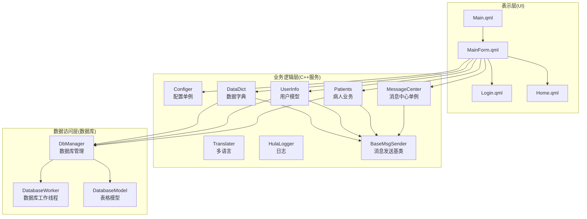
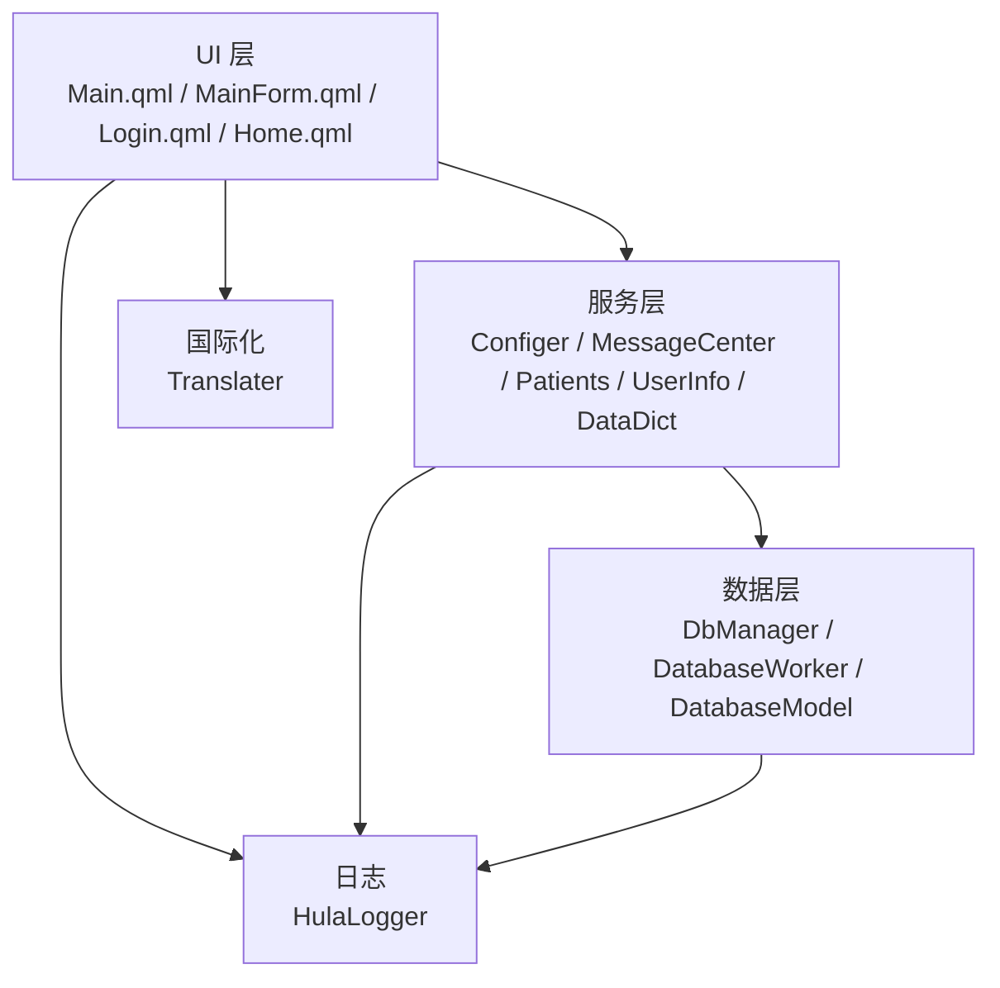
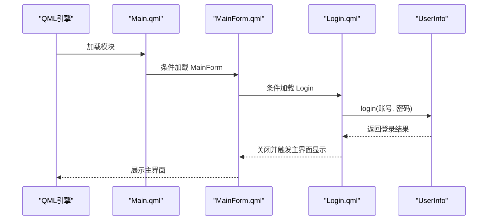
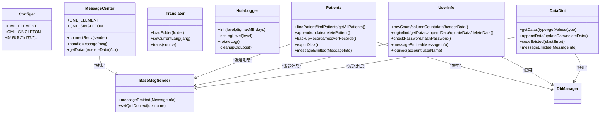
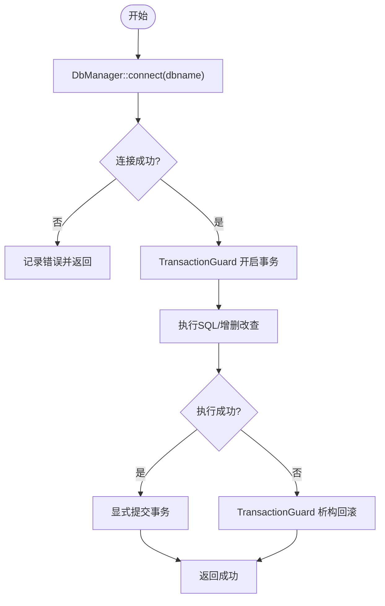
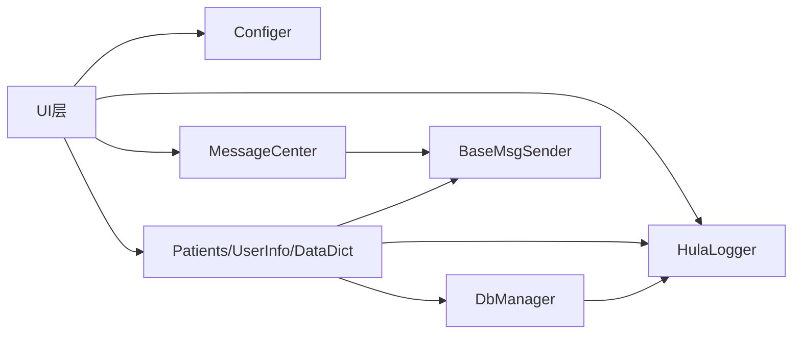
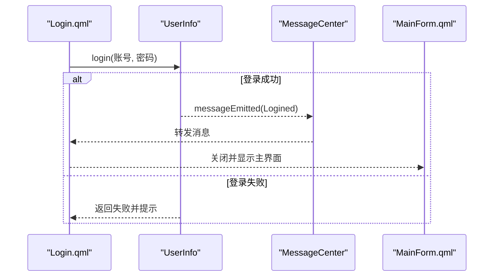

# 分层架构

<cite>
**本文引用的文件**
- [src/main.cpp](file://src/main.cpp)
- [src/dbmanager.h](file://src/dbmanager.h)
- [src/databasemodel.h](file://src/databasemodel.h)
- [src/patients.h](file://src/patients.h)
- [src/userinfo.h](file://src/userinfo.h)
- [src/datadict.h](file://src/datadict.h)
- [src/messagecenter.h](file://src/messagecenter.h)
- [src/configer.h](file://src/configer.h)
- [src/basemsgsender.h](file://src/basemsgsender.h)
- [src/common.h](file://src/common.h)
- [src/translater.h](file://src/translater.h)
- [src/hulalogger.h](file://src/hulalogger.h)
- [src/QmlUI/Main.qml](file://src/QmlUI/Main.qml)
- [src/QmlUI/MainForm.qml](file://src/QmlUI/MainForm.qml)
- [src/QmlUI/Home.qml](file://src/QmlUI/Home.qml)
- [src/QmlUI/Login.qml](file://src/QmlUI/Login.qml)
</cite>

## 目录
1. [引言](#引言)
2. [项目结构](#项目结构)
3. [核心组件](#核心组件)
4. [架构总览](#架构总览)
5. [详细组件分析](#详细组件分析)
6. [依赖分析](#依赖分析)
7. [性能考虑](#性能考虑)
8. [故障排查指南](#故障排查指南)
9. [结论](#结论)
10. [附录](#附录)

## 引言
本文件针对 QmlPlugins 项目进行分层架构文档梳理，明确三层架构设计：表示层（UI 层）、业务逻辑层（C++ 服务层）、数据访问层（数据库层）。文档解释各层职责与边界、层间依赖关系与数据传递方式；阐述 UI 组件组织结构、页面导航机制与状态管理；总结业务逻辑封装、服务层抽象与数据访问统一接口；并给出典型请求处理流程与分层架构图，说明该设计对代码可维护性与可扩展性的贡献。

## 项目结构
项目采用“Qt Quick + C++ 后端”的混合架构：
- 表示层（UI 层）：由 QML 页面与组件构成，负责用户交互、页面导航与状态展示。
- 业务逻辑层（C++ 服务层）：以 QML 可注册的 C++ 类为核心，封装业务规则与跨页面共享的服务能力。
- 数据访问层（数据库层）：统一通过 DbManager 提供数据库连接、事务、查询与备份恢复能力。

**图表来源**
- [src/QmlUI/Main.qml:1-41](file://src/QmlUI/Main.qml#L1-L41)
- [src/QmlUI/MainForm.qml:1-488](file://src/QmlUI/MainForm.qml#L1-L488)
- [src/QmlUI/Login.qml:1-342](file://src/QmlUI/Login.qml#L1-L342)
- [src/QmlUI/Home.qml:1-800](file://src/QmlUI/Home.qml#L1-L800)
- [src/configer.h:98-277](file://src/configer.h#L98-L277)
- [src/messagecenter.h:27-127](file://src/messagecenter.h#L27-L127)
- [src/patients.h:24-150](file://src/patients.h#L24-L150)
- [src/userinfo.h:30-172](file://src/userinfo.h#L30-L172)
- [src/datadict.h:30-103](file://src/datadict.h#L30-L103)
- [src/dbmanager.h:52-192](file://src/dbmanager.h#L52-L192)
- [src/databasemodel.h:20-97](file://src/databasemodel.h#L20-L97)
- [src/basemsgsender.h:10-38](file://src/basemsgsender.h#L10-L38)
- [src/translater.h:27-112](file://src/translater.h#L27-L112)
- [src/hulalogger.h:49-175](file://src/hulalogger.h#L49-L175)

**章节来源**
- [src/main.cpp:17-99](file://src/main.cpp#L17-L99)
- [src/QmlUI/Main.qml:1-41](file://src/QmlUI/Main.qml#L1-L41)
- [src/QmlUI/MainForm.qml:1-488](file://src/QmlUI/MainForm.qml#L1-L488)
- [src/QmlUI/Login.qml:1-342](file://src/QmlUI/Login.qml#L1-L342)
- [src/QmlUI/Home.qml:1-800](file://src/QmlUI/Home.qml#L1-L800)

## 核心组件
- 应用入口与初始化：在应用启动时建立数据库连接、设置字体与图标、初始化国际化与日志、注册上下文属性并加载主模块。
- 配置与主题：Configer 提供全局配置与主题切换，支持多语言、窗口显示模式、壁纸等。
- 消息与日志：MessageCenter 作为消息汇聚与转发中心；HulaLogger 提供线程安全的日志输出与轮转。
- 业务服务：
  - Patients：封装病人信息的增删改查、报告管理、备份恢复、导出等业务。
  - UserInfo：用户登录、认证、密码校验、用户数据模型。
  - DataDict：数据字典（性别、科室、医生、标本类型等）的查询与维护。
- 数据访问：
  - DbManager：统一数据库连接、事务、查询、备份恢复与错误管理。
  - DatabaseWorker/DatabaseModel：线程化的数据库访问与表格模型封装。
- UI 组织：Main.qml 控制 Splash/Login/MainForm 的加载；MainForm.qml 实现主框架、左侧导航、StackView 路由与对话框；Login.qml 实现登录流程；Home.qml 作为首页示例页面。

**章节来源**
- [src/main.cpp:17-99](file://src/main.cpp#L17-L99)
- [src/configer.h:98-277](file://src/configer.h#L98-L277)
- [src/messagecenter.h:27-127](file://src/messagecenter.h#L27-L127)
- [src/hulalogger.h:49-175](file://src/hulalogger.h#L49-L175)
- [src/patients.h:24-150](file://src/patients.h#L24-L150)
- [src/userinfo.h:30-172](file://src/userinfo.h#L30-L172)
- [src/datadict.h:30-103](file://src/datadict.h#L30-L103)
- [src/dbmanager.h:52-192](file://src/dbmanager.h#L52-L192)
- [src/databasemodel.h:20-97](file://src/databasemodel.h#L20-L97)
- [src/QmlUI/Main.qml:1-41](file://src/QmlUI/Main.qml#L1-L41)
- [src/QmlUI/MainForm.qml:1-488](file://src/QmlUI/MainForm.qml#L1-L488)
- [src/QmlUI/Login.qml:1-342](file://src/QmlUI/Login.qml#L1-L342)
- [src/QmlUI/Home.qml:1-800](file://src/QmlUI/Home.qml#L1-L800)

## 架构总览
分层架构以“UI 层 -> 服务层 -> 数据层”自顶向下依赖，数据流从 QML 触发业务调用，经由 C++ 服务层协调 DbManager 完成数据库操作，最终通过信号/回调返回 UI。

**图表来源**
- [src/QmlUI/Main.qml:1-41](file://src/QmlUI/Main.qml#L1-L41)
- [src/QmlUI/MainForm.qml:1-488](file://src/QmlUI/MainForm.qml#L1-L488)
- [src/QmlUI/Login.qml:1-342](file://src/QmlUI/Login.qml#L1-L342)
- [src/QmlUI/Home.qml:1-800](file://src/QmlUI/Home.qml#L1-L800)
- [src/configer.h:98-277](file://src/configer.h#L98-L277)
- [src/messagecenter.h:27-127](file://src/messagecenter.h#L27-L127)
- [src/patients.h:24-150](file://src/patients.h#L24-L150)
- [src/userinfo.h:30-172](file://src/userinfo.h#L30-L172)
- [src/datadict.h:30-103](file://src/datadict.h#L30-L103)
- [src/dbmanager.h:52-192](file://src/dbmanager.h#L52-L192)
- [src/databasemodel.h:20-97](file://src/databasemodel.h#L20-L97)
- [src/translater.h:27-112](file://src/translater.h#L27-L112)
- [src/hulalogger.h:49-175](file://src/hulalogger.h#L49-L175)

## 详细组件分析

### 表示层（UI 层）
- 组织结构
  - Main.qml：根据配置决定加载 Splash、Login 或 MainForm，使用 Loader 动态加载。
  - MainForm.qml：主窗口容器，包含 TopBar、左侧导航按钮组、StackView 路由、壁纸动画与对话框工具函数。
  - Login.qml：登录窗口，绑定用户输入、调用 UserInfo 登录、完成后关闭自身并触发主界面显示。
  - Home.qml：示例页面，演示编辑器、列表、字典联动与日期控件等。
- 页面导航机制
  - 通过 ButtonGroup 与 Repeater 生成导航项，点击后使用 Loader 按需加载页面并由 StackView 替换。
  - 提供 openDialog/openLogin 等工具函数，集中管理对话框生命周期。
- 状态管理
  - 使用 QtObject pageState 管理子页面加载状态；通过属性（如 formShowMode、alpha）驱动外观与行为。
  - 通过 Connections 监听 Configer 的配置变化，动态调整壁纸与透明度等。

**图表来源**
- [src/QmlUI/Main.qml:1-41](file://src/QmlUI/Main.qml#L1-L41)
- [src/QmlUI/MainForm.qml:1-488](file://src/QmlUI/MainForm.qml#L1-L488)
- [src/QmlUI/Login.qml:1-342](file://src/QmlUI/Login.qml#L1-L342)
- [src/userinfo.h:30-172](file://src/userinfo.h#L30-L172)

**章节来源**
- [src/QmlUI/Main.qml:1-41](file://src/QmlUI/Main.qml#L1-L41)
- [src/QmlUI/MainForm.qml:1-488](file://src/QmlUI/MainForm.qml#L1-L488)
- [src/QmlUI/Login.qml:1-342](file://src/QmlUI/Login.qml#L1-L342)
- [src/QmlUI/Home.qml:1-800](file://src/QmlUI/Home.qml#L1-L800)

### 业务逻辑层（C++ 服务层）
- 服务层抽象
  - Configer：全局配置单例，提供主题、语言、窗口模式、报表等配置项。
  - MessageCenter：消息中心单例，集中接收与转发业务消息，支持连接任意发送者。
  - BaseMsgSender：消息发送基类，统一发出 MessageInfo 信号，便于 UI 侧订阅。
  - Translater：多语言管理，提供 QML 属性与翻译方法。
  - HulaLogger：日志系统，支持级别控制、轮转与线程安全。
- 业务封装
  - Patients：封装病人与报告的增删改查、备份恢复、导出 Excel 等业务。
  - UserInfo：用户登录、密码校验、用户数据模型与表格视图。
  - DataDict：数据字典类型与值的查询、新增、更新、删除与去重校验。
- 依赖关系
  - 业务类通过 QML 注册为元素或单例，暴露 Q_INVOKABLE 方法供 QML 调用。
  - 业务类内部通过 DbManager 执行数据库操作，通过 MessageCenter/BaseMsgSender 发送消息。

**图表来源**
- [src/configer.h:98-277](file://src/configer.h#L98-L277)
- [src/messagecenter.h:27-127](file://src/messagecenter.h#L27-L127)
- [src/basemsgsender.h:10-38](file://src/basemsgsender.h#L10-L38)
- [src/translater.h:27-112](file://src/translater.h#L27-L112)
- [src/hulalogger.h:49-175](file://src/hulalogger.h#L49-L175)
- [src/patients.h:24-150](file://src/patients.h#L24-L150)
- [src/userinfo.h:30-172](file://src/userinfo.h#L30-L172)
- [src/datadict.h:30-103](file://src/datadict.h#L30-L103)

**章节来源**
- [src/configer.h:98-277](file://src/configer.h#L98-L277)
- [src/messagecenter.h:27-127](file://src/messagecenter.h#L27-L127)
- [src/basemsgsender.h:10-38](file://src/basemsgsender.h#L10-L38)
- [src/translater.h:27-112](file://src/translater.h#L27-L112)
- [src/hulalogger.h:49-175](file://src/hulalogger.h#L49-L175)
- [src/patients.h:24-150](file://src/patients.h#L24-L150)
- [src/userinfo.h:30-172](file://src/userinfo.h#L30-L172)
- [src/datadict.h:30-103](file://src/datadict.h#L30-L103)

### 数据访问层（数据库层）
- 统一接口
  - DbManager：提供连接、事务守卫、查询计数、结果转换、增删改查、备份恢复、错误管理等统一接口。
  - DatabaseWorker/DatabaseModel：将数据库操作放入独立线程，避免阻塞 UI；通过信号/槽与主线程通信。
- 错误与日志
  - 通过 MessageInfo 结构体与错误码枚举，统一错误类型与提示策略。
  - HulaLogger 提供线程安全日志，便于定位数据库操作问题。
- 事务与并发
  - TransactionGuard 提供 RAII 事务管理，确保异常时自动回滚。
  - 线程本地存储保存数据库连接，避免跨线程共享连接导致的竞态。

**图表来源**
- [src/dbmanager.h:37-50](file://src/dbmanager.h#L37-L50)
- [src/dbmanager.h:52-192](file://src/dbmanager.h#L52-L192)
- [src/databasemodel.h:20-97](file://src/databasemodel.h#L20-L97)
- [src/common.h:131-159](file://src/common.h#L131-L159)

**章节来源**
- [src/dbmanager.h:52-192](file://src/dbmanager.h#L52-L192)
- [src/databasemodel.h:20-97](file://src/databasemodel.h#L20-L97)
- [src/common.h:131-159](file://src/common.h#L131-L159)

## 依赖分析
- UI 层依赖服务层：QML 通过 QML 元素/单例调用 C++ 服务方法。
- 服务层依赖数据层：业务类内部通过 DbManager 访问数据库。
- 服务层之间低耦合：通过消息中心解耦，避免直接相互依赖。
- 配置与国际化：Configer 与 Translater 为全局单例，被 UI 与服务层广泛使用。
- 日志与错误：HulaLogger 与 MessageCenter 为横切关注点，贯穿 UI 与服务层。

**图表来源**
- [src/QmlUI/Main.qml:1-41](file://src/QmlUI/Main.qml#L1-L41)
- [src/configer.h:98-277](file://src/configer.h#L98-L277)
- [src/messagecenter.h:27-127](file://src/messagecenter.h#L27-L127)
- [src/patients.h:24-150](file://src/patients.h#L24-L150)
- [src/userinfo.h:30-172](file://src/userinfo.h#L30-L172)
- [src/datadict.h:30-103](file://src/datadict.h#L30-L103)
- [src/dbmanager.h:52-192](file://src/dbmanager.h#L52-L192)
- [src/basemsgsender.h:10-38](file://src/basemsgsender.h#L10-L38)
- [src/hulalogger.h:49-175](file://src/hulalogger.h#L49-L175)

**章节来源**
- [src/main.cpp:17-99](file://src/main.cpp#L17-L99)
- [src/configer.h:98-277](file://src/configer.h#L98-L277)
- [src/messagecenter.h:27-127](file://src/messagecenter.h#L27-L127)
- [src/patients.h:24-150](file://src/patients.h#L24-L150)
- [src/userinfo.h:30-172](file://src/userinfo.h#L30-L172)
- [src/datadict.h:30-103](file://src/datadict.h#L30-L103)
- [src/dbmanager.h:52-192](file://src/dbmanager.h#L52-L192)
- [src/basemsgsender.h:10-38](file://src/basemsgsender.h#L10-L38)
- [src/hulalogger.h:49-175](file://src/hulalogger.h#L49-L175)

## 性能考虑
- UI 线程不阻塞：数据库操作通过 DatabaseWorker 在独立线程执行，避免卡顿。
- 事务批处理：使用 TransactionGuard 批量提交，减少频繁事务开销。
- 日志分级：HulaLogger 支持级别控制与轮转，避免日志过大影响性能。
- 配置缓存：Configer 作为单例，减少重复读取配置带来的开销。
- 按需加载：Main.qml 使用 Loader 按需加载页面，降低初始内存占用。

## 故障排查指南
- 数据库连接失败
  - 检查 DbManager::connect 返回值与错误码；确认数据库文件路径与权限。
  - 参考错误码定义与 MessageInfo 结构体，定位具体错误类型。
- 登录失败
  - 检查 UserInfo::login 返回值与提示；确认账号存在与密码校验逻辑。
- 消息未显示
  - 确认业务类已通过 BaseMsgSender 发出 messageEmitted 信号；
  - 确认 MessageCenter::connectRecv 已连接对应发送者。
- 日志未输出
  - 检查 HulaLogger::init 参数与日志级别；确认线程安全写入未被阻塞。

**章节来源**
- [src/dbmanager.h:52-192](file://src/dbmanager.h#L52-L192)
- [src/common.h:63-117](file://src/common.h#L63-L117)
- [src/userinfo.h:110-118](file://src/userinfo.h#L110-L118)
- [src/messagecenter.h:89-106](file://src/messagecenter.h#L89-L106)
- [src/basemsgsender.h:27-34](file://src/basemsgsender.h#L27-L34)
- [src/hulalogger.h:67-110](file://src/hulalogger.h#L67-L110)

## 结论
本项目通过清晰的三层架构实现了 UI 与业务/数据的解耦：UI 层专注交互与路由，服务层封装业务规则与消息/日志，数据层提供统一的数据库访问与事务保障。该设计提升了代码可维护性（职责分离、低耦合）、可扩展性（新增页面/业务模块无需改动其他层）与可测试性（服务层可独立单元测试），同时通过线程化数据库访问与日志系统保证了运行时性能与可观测性。

## 附录
- 典型请求处理流程（登录）
  - QML 触发 Login.qml 的登录逻辑；
  - 调用 UserInfo::login 执行认证；
  - 认证成功后关闭登录窗口并显示主界面；
  - 若失败，通过消息中心或 UI 提示错误。

**图表来源**
- [src/QmlUI/Login.qml:1-342](file://src/QmlUI/Login.qml#L1-L342)
- [src/userinfo.h:110-141](file://src/userinfo.h#L110-L141)
- [src/messagecenter.h:108-118](file://src/messagecenter.h#L108-L118)
- [src/QmlUI/MainForm.qml:344-377](file://src/QmlUI/MainForm.qml#L344-L377)