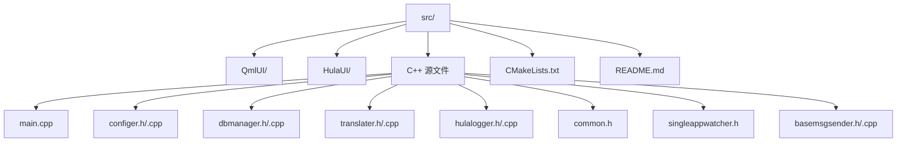
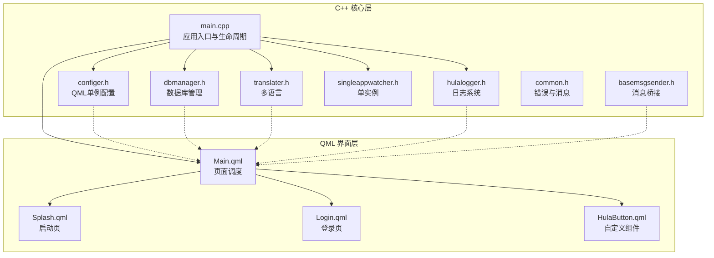
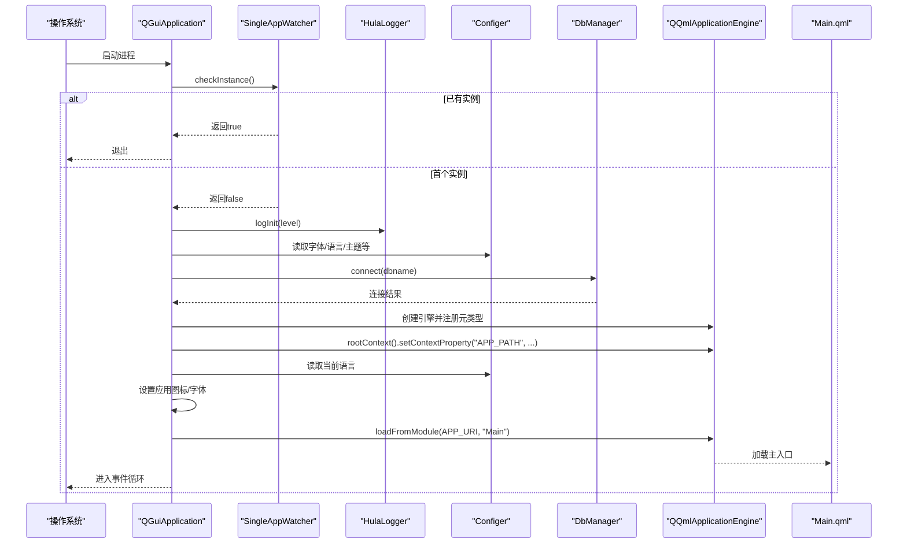
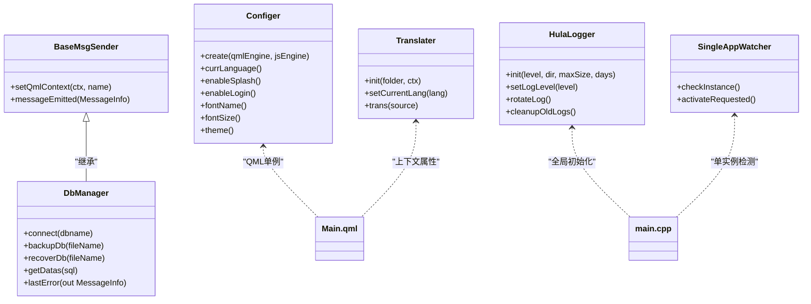
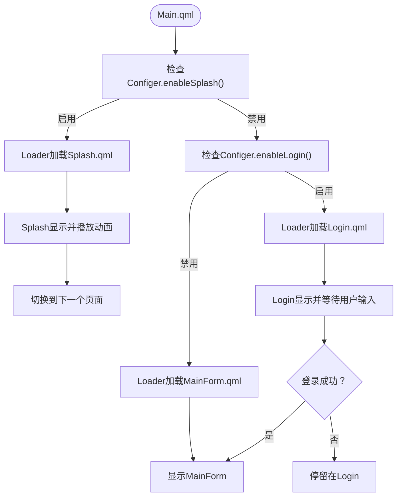
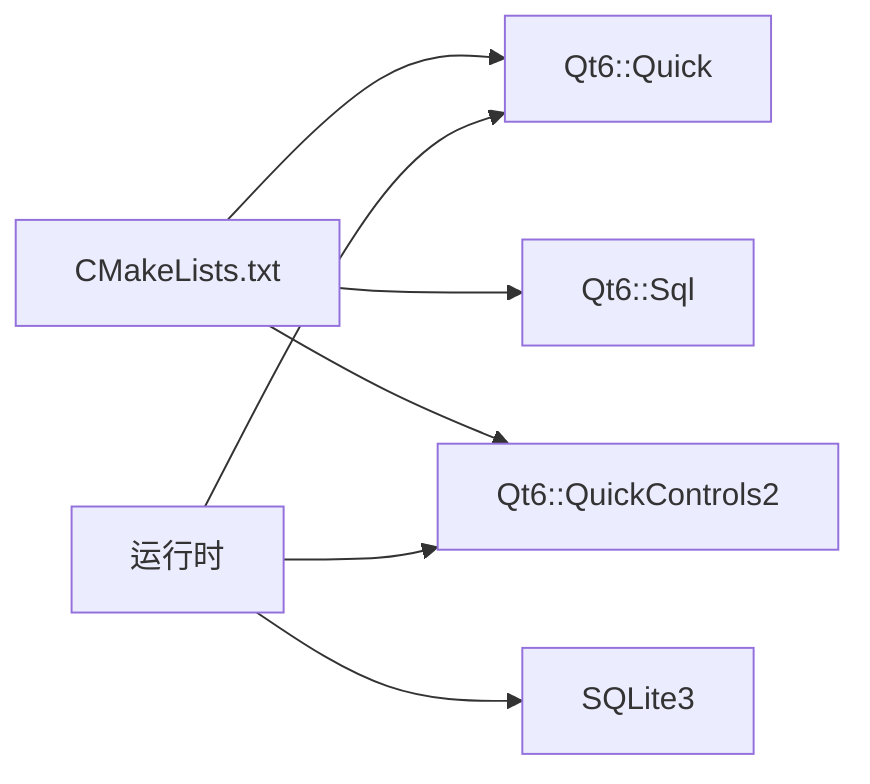

# 整体架构

<cite>
**本文引用的文件**
- [main.cpp](file://src/main.cpp)
- [CMakeLists.txt](file://CMakeLists.txt)
- [README.md](file://README.md)
- [configer.h](file://src/configer.h)
- [dbmanager.h](file://src/dbmanager.h)
- [translater.h](file://src/translater.h)
- [hulalogger.h](file://src/hulalogger.h)
- [common.h](file://src/common.h)
- [Main.qml](file://src/QmlUI/Main.qml)
- [Splash.qml](file://src/QmlUI/Splash.qml)
- [Login.qml](file://src/QmlUI/Login.qml)
- [HulaButton.qml](file://src/HulaUI/HulaButton.qml)
- [singleappwatcher.h](file://src/singleappwatcher.h)
- [basemsgsender.h](file://src/basemsgsender.h)
</cite>

## 目录
1. [引言](#引言)
2. [项目结构](#项目结构)
3. [核心组件](#核心组件)
4. [架构总览](#架构总览)
5. [详细组件分析](#详细组件分析)
6. [依赖分析](#依赖分析)
7. [性能考虑](#性能考虑)
8. [故障排查指南](#故障排查指南)
9. [结论](#结论)
10. [附录](#附录)

## 引言
本项目采用“C++核心 + QML界面”的混合架构，以Qt6/QML为技术栈，构建跨平台的医疗报告管理系统。该架构将业务逻辑与数据访问层置于C++中，界面交互与视觉效果由QML负责，二者通过Qt的元对象系统与上下文桥接实现紧密协作。本文档从系统边界、模块划分、组件职责、启动流程、初始化顺序、QML模块加载机制、C++与QML桥接技术等方面，全面阐述该混合架构的设计理念与实现方式，并给出架构图与流程图帮助读者快速理解。

## 项目结构
项目采用分层与功能域结合的组织方式：
- src/：源代码根目录
  - QmlUI/：应用界面与页面，包含主窗口、登录页、启动页、主题与工具页面等
  - HulaUI/：自定义QML组件库，如按钮、输入框、对话框、表格等
  - 根目录C++源文件：应用入口、配置、数据库、国际化、日志、消息中心、用户信息、工具等
- bin/、resources/：运行时资源与配置文件
- CMakeLists.txt：构建脚本，定义Qt模块、QML模块打包、平台适配与安装规则
- README.md：项目简介、功能特性、系统要求、构建与运行说明



**章节来源**
- [CMakeLists.txt:1-137](file://CMakeLists.txt#L1-L137)
- [README.md:1-50](file://README.md#L1-L50)

## 核心组件
- 应用入口与生命周期
  - main.cpp：应用启动、单实例检测、日志初始化、字体与图标设置、数据库连接、QML引擎初始化与模块加载、事件连接与主循环
- 配置与主题
  - configer.h：QML单例配置类，提供语言、字体、主题、登录/启动页开关、报表模板等配置项的读写接口
- 数据访问
  - dbmanager.h：数据库管理器，封装连接、事务、查询、备份/恢复、错误处理等能力
- 国际化
  - translater.h：多语言翻译器，支持目录加载、语言切换、QML上下文注册
- 日志系统
  - hulalogger.h：线程安全日志系统，支持级别控制、轮转、清理与全局初始化
- 通用错误与消息
  - common.h：错误码、提示类型、设备状态与消息结构体定义
- 单实例守护
  - singleappwatcher.h：基于本地套接字的单实例检测与激活信号转发
- 消息桥接基类
  - basemsgsender.h：向QML上下文注册消息信号的基类，便于业务模块统一发出消息

**章节来源**
- [main.cpp:17-99](file://src/main.cpp#L17-L99)
- [configer.h:98-277](file://src/configer.h#L98-L277)
- [dbmanager.h:52-192](file://src/dbmanager.h#L52-L192)
- [translater.h:27-112](file://src/translater.h#L27-L112)
- [hulalogger.h:49-175](file://src/hulalogger.h#L49-L175)
- [common.h:16-159](file://src/common.h#L16-L159)
- [singleappwatcher.h:9-62](file://src/singleappwatcher.h#L9-L62)
- [basemsgsender.h:10-38](file://src/basemsgsender.h#L10-L38)

## 架构总览
该系统采用“C++核心 + QML界面”的混合架构，核心职责如下：
- C++层：负责应用生命周期、单实例、日志、配置、数据库、国际化、消息桥接等
- QML层：负责界面渲染、动画、布局、主题切换、用户交互与页面导航
- 桥接层：通过QML单例、上下文属性、信号槽与元类型注册实现C++与QML的双向通信



**图表来源**
- [main.cpp:17-99](file://src/main.cpp#L17-L99)
- [configer.h:98-277](file://src/configer.h#L98-L277)
- [dbmanager.h:52-192](file://src/dbmanager.h#L52-L192)
- [translater.h:27-112](file://src/translater.h#L27-L112)
- [hulalogger.h:49-175](file://src/hulalogger.h#L49-L175)
- [Main.qml:1-41](file://src/QmlUI/Main.qml#L1-L41)
- [Splash.qml:1-156](file://src/QmlUI/Splash.qml#L1-L156)
- [Login.qml:1-342](file://src/QmlUI/Login.qml#L1-L342)
- [HulaButton.qml:1-81](file://src/HulaUI/HulaButton.qml#L1-L81)

## 详细组件分析

### 应用启动与初始化流程
应用启动流程遵循严格的初始化顺序，确保关键子系统在QML渲染前就绪：
1. 设置平台环境变量，强制使用XCB以规避Wayland窗口问题
2. 创建QGuiApplication并进行单实例检测；若已有实例，则通过本地套接字发送激活请求并退出
3. 初始化日志系统，读取配置中的日志级别
4. 设置应用图标与字体（从配置读取）
5. 创建QQmlApplicationEngine，注册元类型（消息结构体）
6. 连接数据库（失败则记录错误并退出）
7. 将应用路径注入QML上下文，供界面使用
8. 初始化国际化（加载语言目录、设置当前语言、应用到应用显示名）
9. 连接单实例激活信号与引擎退出信号
10. 从QML模块加载主入口（Main.qml）
11. 进入事件循环



**图表来源**
- [main.cpp:17-99](file://src/main.cpp#L17-L99)
- [singleappwatcher.h:17-36](file://src/singleappwatcher.h#L17-L36)
- [hulalogger.h:67-70](file://src/hulalogger.h#L67-L70)
- [configer.h:113-120](file://src/configer.h#L113-L120)
- [dbmanager.h:80-81](file://src/dbmanager.h#L80-L81)
- [Main.qml:1-41](file://src/QmlUI/Main.qml#L1-L41)

**章节来源**
- [main.cpp:17-99](file://src/main.cpp#L17-L99)
- [singleappwatcher.h:9-62](file://src/singleappwatcher.h#L9-L62)
- [hulalogger.h:49-175](file://src/hulalogger.h#L49-L175)
- [configer.h:98-277](file://src/configer.h#L98-L277)
- [dbmanager.h:52-192](file://src/dbmanager.h#L52-L192)

### QML模块加载机制与URI绑定
- CMake通过qt_add_qml_module将QML源文件打包为QML模块，URI为应用名（APP_URI），版本号为1.0
- QML源文件递归收集src/QmlUI与src/HulaUI目录，作为模块内容
- 在C++侧，main.cpp使用loadFromModule(APP_URI, "Main")加载主入口
- CMake还对部分QML文件标记为单例类型，以便在QML中以单例形式访问

```mermaid
flowchart TD
A["CMakeLists.txt<br/>qt_add_qml_module(...)"] --> B["生成QML模块<br/>URI=APP_URI, 版本=1.0"]
B --> C["main.cpp<br/>engine.loadFromModule(APP_URI, \"Main\")"]
C --> D["Main.qml<br/>Loader加载页面"]
```

**图表来源**
- [CMakeLists.txt:79-93](file://CMakeLists.txt#L79-L93)
- [main.cpp:93-93](file://src/main.cpp#L93-L93)
- [Main.qml:1-41](file://src/QmlUI/Main.qml#L1-L41)

**章节来源**
- [CMakeLists.txt:79-93](file://CMakeLists.txt#L79-L93)
- [main.cpp:93-93](file://src/main.cpp#L93-L93)

### C++与QML桥接技术
- 元类型注册：在main.cpp中注册MessageInfo结构体，使其可在QML中使用
- 上下文属性：将应用路径等运行时信息注入QML上下文，供界面使用
- QML单例：Configer声明为QML单例，提供统一配置访问
- 信号槽：通过信号将业务结果与错误信息传递给QML，实现UI与业务解耦
- 组件封装：自定义组件（如HulaButton.qml）在QML中复用，减少重复逻辑



**图表来源**
- [basemsgsender.h:10-38](file://src/basemsgsender.h#L10-L38)
- [dbmanager.h:52-192](file://src/dbmanager.h#L52-L192)
- [configer.h:98-277](file://src/configer.h#L98-L277)
- [translater.h:27-112](file://src/translater.h#L27-L112)
- [hulalogger.h:49-175](file://src/hulalogger.h#L49-L175)
- [singleappwatcher.h:9-62](file://src/singleappwatcher.h#L9-L62)

**章节来源**
- [main.cpp:44-58](file://src/main.cpp#L44-L58)
- [configer.h:113-120](file://src/configer.h#L113-L120)
- [translater.h:58-58](file://src/translater.h#L58-L58)
- [basemsgsender.h:25-25](file://src/basemsgsender.h#L25-L25)

### 页面加载与导航策略
- Main.qml作为页面调度器，根据配置决定是否显示启动页、登录页或主界面
- 使用Loader异步加载页面，提升首屏体验
- Splash.qml与Login.qml分别负责启动动画与用户登录校验
- HulaButton.qml等自定义组件提供一致的UI风格与交互行为



**图表来源**
- [Main.qml:1-41](file://src/QmlUI/Main.qml#L1-L41)
- [Splash.qml:1-156](file://src/QmlUI/Splash.qml#L1-L156)
- [Login.qml:1-342](file://src/QmlUI/Login.qml#L1-L342)

**章节来源**
- [Main.qml:1-41](file://src/QmlUI/Main.qml#L1-L41)
- [Splash.qml:19-29](file://src/QmlUI/Splash.qml#L19-L29)
- [Login.qml:35-45](file://src/QmlUI/Login.qml#L35-L45)

## 依赖分析
- 构建依赖
  - Qt6::Quick、Qt6::Sql、Qt6::QuickControls2
  - C++20标准、CMake 3.16+、平台适配（Linux修复、Windows GUI、macOS Bundle）
- 运行时依赖
  - SQLite3（数据库）
  - Qt Quick引擎与Controls2控件库
  - 本地套接字（单实例）



**图表来源**
- [CMakeLists.txt:96-100](file://CMakeLists.txt#L96-L100)

**章节来源**
- [CMakeLists.txt:23-100](file://CMakeLists.txt#L23-L100)

## 性能考虑
- 启动阶段的异步加载：通过Loader异步加载页面，降低首屏阻塞
- 单实例检测：避免重复进程占用资源
- 日志轮转与清理：限制日志文件大小与保留天数，防止磁盘膨胀
- 数据库连接与事务：使用线程存储的连接与RAII事务守卫，保证并发安全与一致性
- 字体与图标：集中配置，减少重复IO

[本节为通用建议，无需具体文件引用]

## 故障排查指南
- 数据库连接失败
  - 检查数据库文件路径与权限
  - 关注DbManager::connect返回码与lastError输出
- 启动页/登录页不显示
  - 检查Configer中对应开关与显示模式
  - 确认Loader的active条件与onLoaded回调
- 单实例无法激活已有实例
  - 检查本地套接字服务器名称与连接超时
- 国际化文本未生效
  - 确认Translater.init已调用且语言文件存在
  - 检查QML上下文中的currentLang属性变化信号

**章节来源**
- [dbmanager.h:163-167](file://src/dbmanager.h#L163-L167)
- [Main.qml:14-39](file://src/QmlUI/Main.qml#L14-L39)
- [singleappwatcher.h:17-36](file://src/singleappwatcher.h#L17-L36)
- [translater.h:58-58](file://src/translater.h#L58-L58)

## 结论
本项目采用“C++核心 + QML界面”的混合架构，既发挥C++在系统稳定性、性能与数据处理方面的优势，又利用QML在界面表现力与开发效率上的长处。通过清晰的模块划分、严格的初始化顺序、完善的桥接机制与可扩展的自定义组件体系，系统实现了良好的可维护性与跨平台能力。选择该架构的核心原因在于：快速迭代UI、强健的业务与数据层、稳定的跨平台部署与较低的学习成本。

[本节为总结，无需具体文件引用]

## 附录
- 系统边界
  - 内部：C++核心（配置、数据库、日志、国际化、消息）、QML界面（页面、组件）
  - 外部：SQLite数据库、操作系统（窗口系统、本地套接字）、文件系统（资源与配置）
- 主要模块职责
  - 配置模块：提供全局配置与主题、语言、窗口模式等
  - 数据模块：提供数据库连接、事务、查询、备份/恢复与错误管理
  - 界面模块：提供页面与组件，负责用户交互与视觉呈现
  - 辅助模块：日志、国际化、单实例、消息桥接

[本节为概览，无需具体文件引用]