# 架构设计

<cite>
**本文引用的文件**
- [src/main.cpp](file://src/main.cpp)
- [CMakeLists.txt](file://CMakeLists.txt)
- [README.md](file://README.md)
- [src/common.h](file://src/common.h)
- [src/singleton.h](file://src/singleton.h)
- [src/configer.h](file://src/configer.h)
- [src/dbmanager.h](file://src/dbmanager.h)
- [src/messagecenter.h](file://src/messagecenter.h)
- [src/translater.h](file://src/translater.h)
- [src/hulalogger.h](file://src/hulalogger.h)
- [src/QmlUI/Main.qml](file://src/QmlUI/Main.qml)
- [src/QmlUI/MainForm.qml](file://src/QmlUI/MainForm.qml)
- [src/QmlUI/Home.qml](file://src/QmlUI/Home.qml)
- [src/HulaUI/HulaButton.qml](file://src/HulaUI/HulaButton.qml)
- [src/HulaUI/HulaTextField.qml](file://src/HulaUI/HulaTextField.qml)
</cite>

## 目录
1. [引言](#引言)
2. [项目结构](#项目结构)
3. [核心组件](#核心组件)
4. [架构总览](#架构总览)
5. [详细组件分析](#详细组件分析)
6. [依赖分析](#依赖分析)
7. [性能考量](#性能考量)
8. [故障排查指南](#故障排查指南)
9. [结论](#结论)
10. [附录](#附录)

## 引言
本项目是一个基于 Qt6/QML 的跨平台医疗报告管理系统，采用“C++ 核心 + QML 界面”的混合架构。应用以 C++ 实现业务与数据访问层，通过 QML 构建用户界面与交互体验；同时结合 MVC 设计思想进行分层组织，确保界面与业务逻辑解耦、可扩展与可维护。

## 项目结构
项目采用“按职责分层 + 按功能模块划分”的组织方式：
- src：源代码根目录
  - QmlUI：QML 页面与页面容器
  - HulaUI：自定义 QML 组件
  - 各种 C++ 源文件：配置、数据库、消息中心、国际化、日志、工具等
- bin/resources：运行时资源（图片、语言、壁纸、配置等）

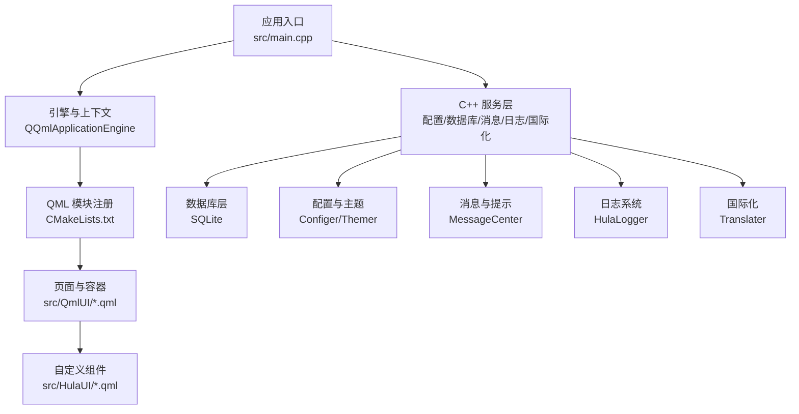

**图表来源**
- [src/main.cpp:17-99](file://src/main.cpp#L17-L99)
- [CMakeLists.txt:79-93](file://CMakeLists.txt#L79-L93)
- [src/QmlUI/Main.qml:1-41](file://src/QmlUI/Main.qml#L1-L41)

**章节来源**
- [README.md:36-45](file://README.md#L36-L45)
- [CMakeLists.txt:23-100](file://CMakeLists.txt#L23-L100)

## 核心组件
- 应用入口与生命周期
  - 初始化平台环境、单实例检测、日志、字体、数据库连接、QML 上下文注入与页面加载
- 配置与主题
  - Configer：全局配置单例，提供主题、语言、窗口模式、壁纸等配置项，并作为 QML 单例暴露给界面
- 数据访问
  - DbManager：数据库单例，封装连接、事务、查询、备份/恢复、错误管理
- 消息与提示
  - MessageCenter：消息中心单例，统一接收与转发系统消息到 UI
- 国际化
  - Translater：多语言翻译器，支持目录加载、语言切换与 QML 上下文绑定
- 日志系统
  - HulaLogger：线程安全日志单例，支持级别控制、轮转与清理
- UI 组件
  - HulaButton、HulaTextField 等自定义组件，封装样式与交互行为

**章节来源**
- [src/main.cpp:17-99](file://src/main.cpp#L17-L99)
- [src/configer.h:98-277](file://src/configer.h#L98-L277)
- [src/dbmanager.h:52-192](file://src/dbmanager.h#L52-L192)
- [src/messagecenter.h:27-127](file://src/messagecenter.h#L27-L127)
- [src/translater.h:27-112](file://src/translater.h#L27-L112)
- [src/hulalogger.h:49-175](file://src/hulalogger.h#L49-L175)
- [src/HulaUI/HulaButton.qml:4-81](file://src/HulaUI/HulaButton.qml#L4-L81)
- [src/HulaUI/HulaTextField.qml:6-45](file://src/HulaUI/HulaTextField.qml#L6-L45)

## 架构总览
整体采用“C++ 核心 + QML 界面”的混合架构，遵循 MVC 思想：
- Model：DbManager、Configer、MessageCenter、HulaLogger 等提供数据与状态
- View：QML 页面与自定义组件构成 UI 层
- Controller：C++ 对象通过 QML 上下文与信号槽协调视图与模型，页面 Loader 与 StackView 控制导航与页面生命周期

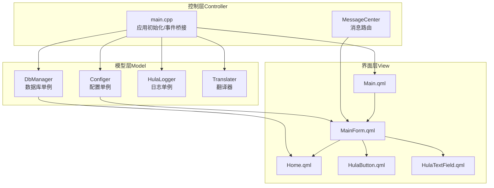

**图表来源**
- [src/QmlUI/Main.qml:6-41](file://src/QmlUI/Main.qml#L6-L41)
- [src/QmlUI/MainForm.qml:9-488](file://src/QmlUI/MainForm.qml#L9-L488)
- [src/QmlUI/Home.qml:10-1042](file://src/QmlUI/Home.qml#L10-L1042)
- [src/HulaUI/HulaButton.qml:4-81](file://src/HulaUI/HulaButton.qml#L4-L81)
- [src/HulaUI/HulaTextField.qml:6-45](file://src/HulaUI/HulaTextField.qml#L6-L45)
- [src/main.cpp:17-99](file://src/main.cpp#L17-L99)
- [src/messagecenter.h:27-127](file://src/messagecenter.h#L27-L127)
- [src/configer.h:98-277](file://src/configer.h#L98-L277)
- [src/dbmanager.h:52-192](file://src/dbmanager.h#L52-L192)
- [src/hulalogger.h:49-175](file://src/hulalogger.h#L49-L175)
- [src/translater.h:27-112](file://src/translater.h#L27-L112)

## 详细组件分析

### 应用入口与生命周期（main.cpp）
- 关键职责
  - 强制平台后端、单实例检测、日志初始化、字体设置、QML 引擎与上下文配置
  - 数据库连接、翻译器初始化、语言切换、页面加载与退出处理
- 控制流
  - 启动 -> 单实例检查 -> 日志初始化 -> 字体设置 -> 引擎创建 -> 注册元类型 -> 数据库连接 -> QML 上下文注入 -> 翻译器初始化 -> 页面加载 -> 事件循环

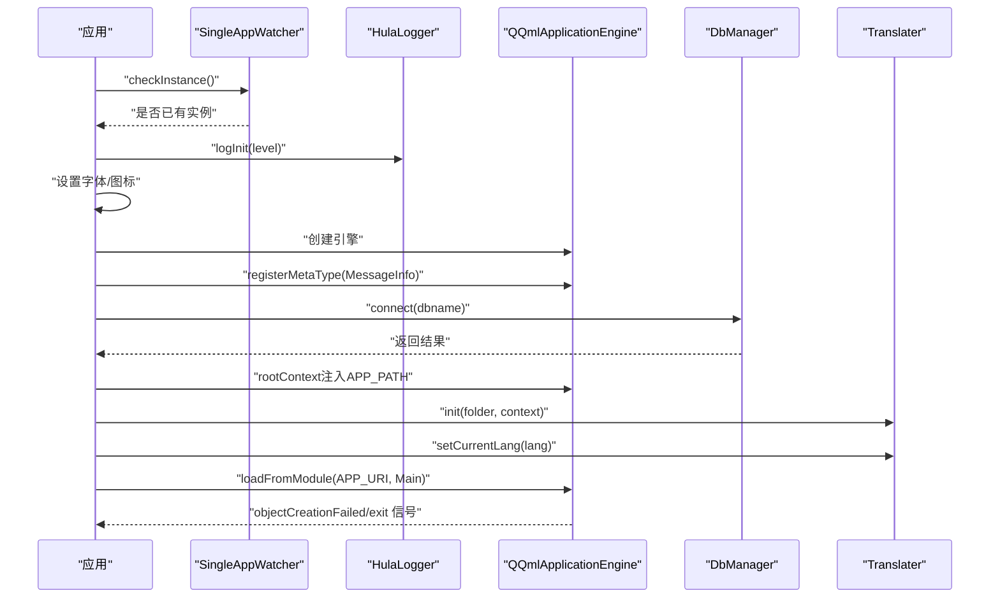

**图表来源**
- [src/main.cpp:17-99](file://src/main.cpp#L17-L99)
- [src/hulalogger.h:54-110](file://src/hulalogger.h#L54-L110)
- [src/dbmanager.h:79-84](file://src/dbmanager.h#L79-L84)
- [src/translater.h:58-77](file://src/translater.h#L58-L77)

**章节来源**
- [src/main.cpp:17-99](file://src/main.cpp#L17-L99)

### 配置与主题（Configer）
- 角色定位：全局配置单例，提供主题、语言、窗口模式、壁纸、报表模板等配置项
- 设计要点
  - QML 单例注册，静态 create 方法用于 QML 获取实例
  - 提供大量 Q_INVOKABLE 配置项，覆盖 UI、行为与业务参数
  - 信号 onChangedBool 用于通知 UI 配置变更

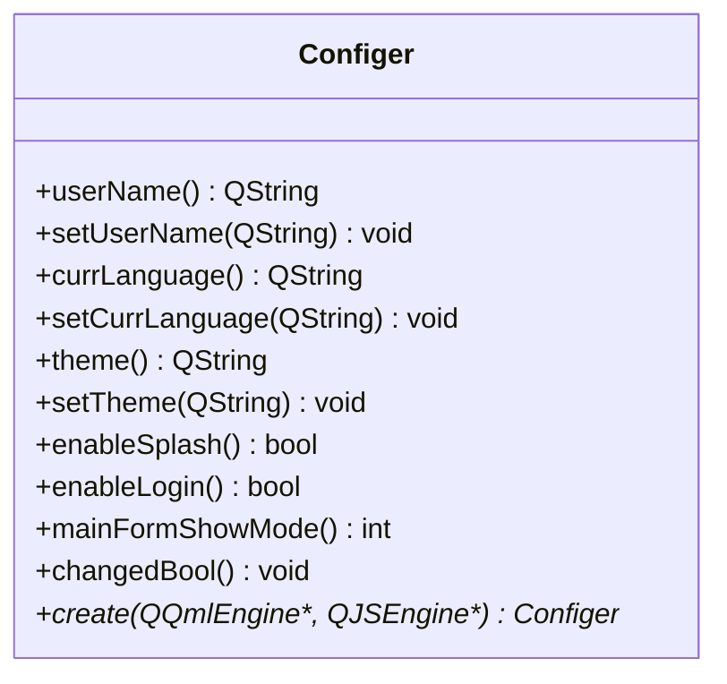

**图表来源**
- [src/configer.h:98-277](file://src/configer.h#L98-L277)

**章节来源**
- [src/configer.h:98-277](file://src/configer.h#L98-L277)

### 数据库管理（DbManager）
- 角色定位：数据库单例，提供连接、事务、查询、备份/恢复、错误管理
- 设计要点
  - TransactionGuard RAII 事务守卫，确保异常回滚
  - 线程本地数据库连接与互斥保护
  - Schema 缓存与字段元信息管理
  - 错误消息与线程安全存储

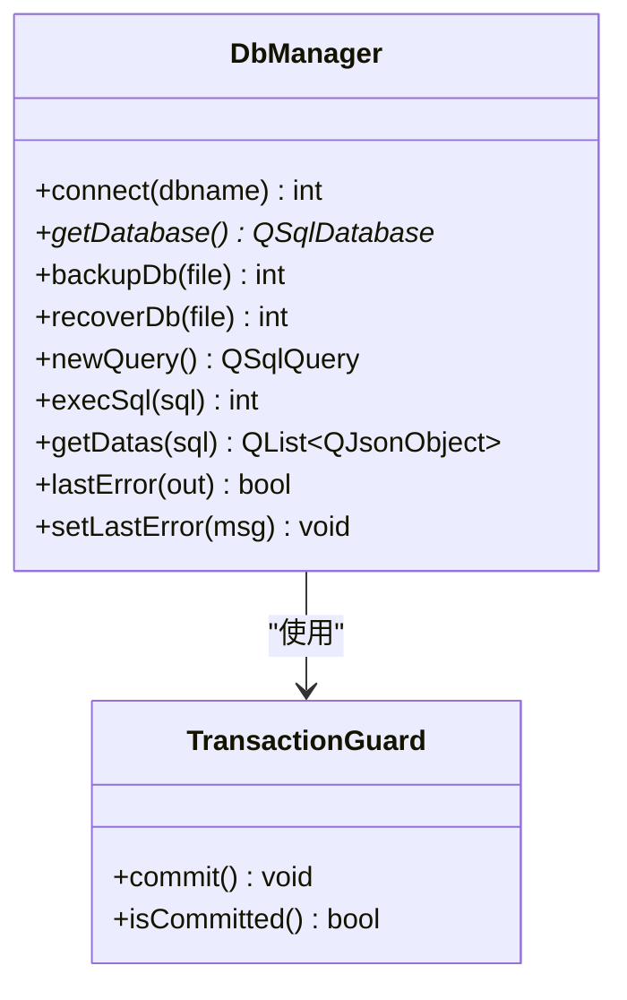

**图表来源**
- [src/dbmanager.h:52-192](file://src/dbmanager.h#L52-L192)

**章节来源**
- [src/dbmanager.h:52-192](file://src/dbmanager.h#L52-L192)

### 消息中心（MessageCenter）
- 角色定位：系统消息统一入口，负责接收来自各业务对象的消息并通过信号转发至 UI
- 设计要点
  - 模板化连接函数 connectRecv/disconnectRecv，编译期类型检查
  - 文件持久化与新消息标记
  - QML 单例注册，提供查询与删除接口

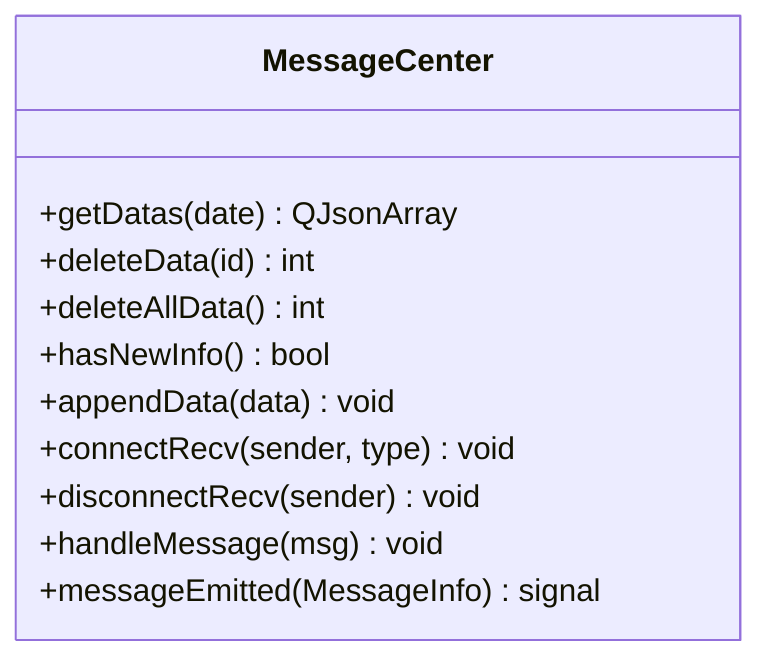

**图表来源**
- [src/messagecenter.h:27-127](file://src/messagecenter.h#L27-L127)

**章节来源**
- [src/messagecenter.h:27-127](file://src/messagecenter.h#L27-L127)

### 国际化（Translater）
- 角色定位：多语言翻译器，支持目录加载、语言切换与 QML 上下文绑定
- 设计要点
  - Q_PROPERTY 暴露 currentLang/languages/change
  - 读写锁保护翻译映射，线程安全
  - 提供 Q_INVOKABLE load/reLoadFolder/init/trans

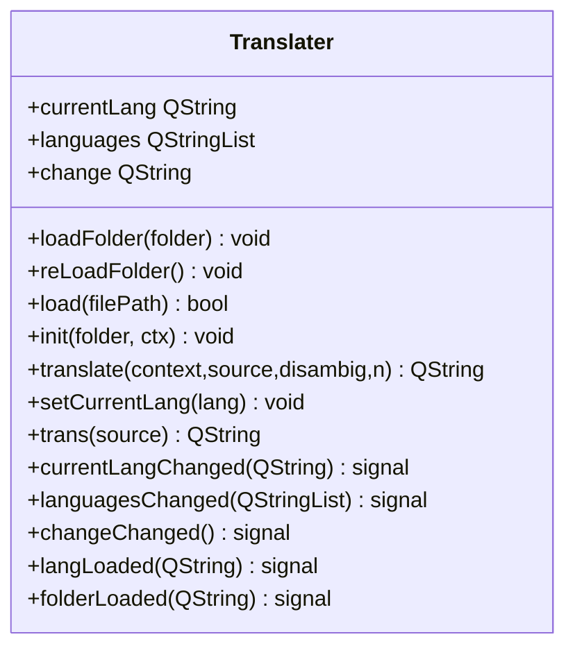

**图表来源**
- [src/translater.h:27-112](file://src/translater.h#L27-L112)

**章节来源**
- [src/translater.h:27-112](file://src/translater.h#L27-L112)

### 日志系统（HulaLogger）
- 角色定位：线程安全日志单例，支持级别控制、轮转与清理
- 设计要点
  - 单例实例与互斥保护
  - 日志轮转（大小/日期）、自动清理过期日志
  - Q_PROPERTY 暴露 logLevel/logDir，信号通知变更

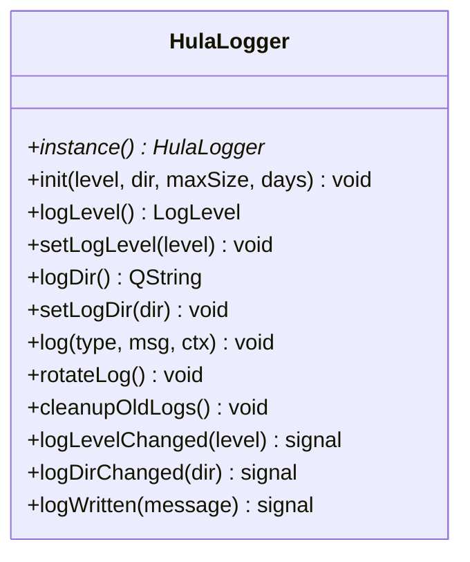

**图表来源**
- [src/hulalogger.h:49-175](file://src/hulalogger.h#L49-L175)

**章节来源**
- [src/hulalogger.h:49-175](file://src/hulalogger.h#L49-L175)

### UI 页面与导航（Main.qml、MainForm.qml、Home.qml）
- Main.qml：根据配置决定加载 Splash/Login/Main 页面，使用 Loader 控制异步加载与显示
- MainForm.qml：主窗口容器，包含顶部栏、左侧菜单、StackView 路由、壁纸与消息提示等
- Home.qml：首页内容页，包含患者列表、编辑区、TabBar 等

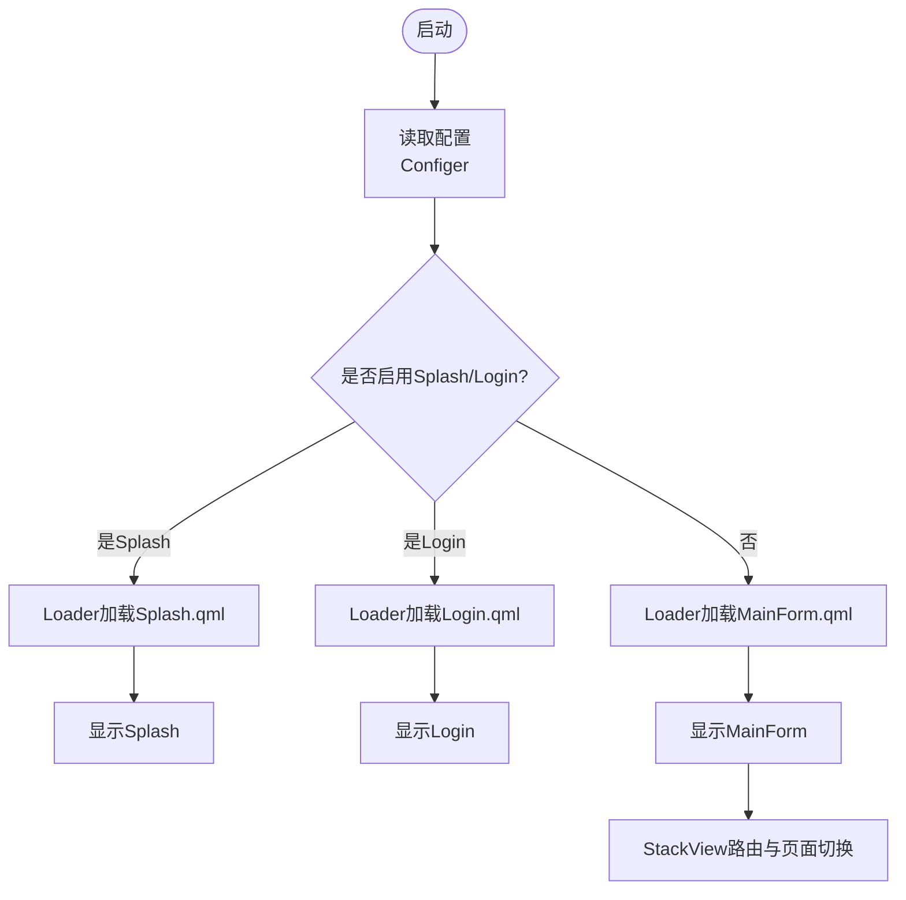

**图表来源**
- [src/QmlUI/Main.qml:6-41](file://src/QmlUI/Main.qml#L6-L41)
- [src/QmlUI/MainForm.qml:35-101](file://src/QmlUI/MainForm.qml#L35-L101)

**章节来源**
- [src/QmlUI/Main.qml:6-41](file://src/QmlUI/Main.qml#L6-L41)
- [src/QmlUI/MainForm.qml:9-488](file://src/QmlUI/MainForm.qml#L9-L488)
- [src/QmlUI/Home.qml:10-1042](file://src/QmlUI/Home.qml#L10-L1042)

### 自定义组件（HulaButton、HulaTextField）
- HulaButton：封装图标、文本、悬停/按下状态与提示气泡
- HulaTextField：封装 Material 风格背景、焦点状态与内边距

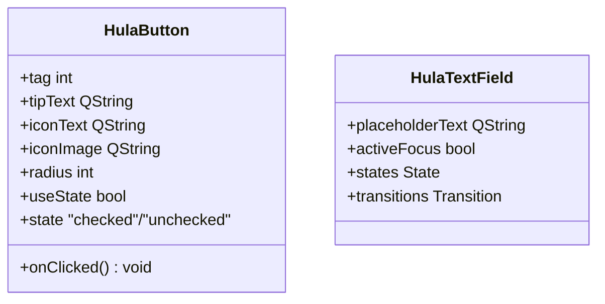

**图表来源**
- [src/HulaUI/HulaButton.qml:4-81](file://src/HulaUI/HulaButton.qml#L4-L81)
- [src/HulaUI/HulaTextField.qml:6-45](file://src/HulaUI/HulaTextField.qml#L6-L45)

**章节来源**
- [src/HulaUI/HulaButton.qml:4-81](file://src/HulaUI/HulaButton.qml#L4-L81)
- [src/HulaUI/HulaTextField.qml:6-45](file://src/HulaUI/HulaTextField.qml#L6-L45)

## 依赖分析
- 构建与模块
  - CMakeLists 定义了 Qt6 Quick/Sql/Controls2 依赖，将 C++ 源文件与 QML 源文件打包为 QML 模块
  - QML 单例类型通过 set_source_files_properties 标记
- 运行时依赖
  - main.cpp 依赖 Configer、DbManager、HulaLogger、Translater
  - 页面依赖 Configer、Themer、Utils、MessageCenter 等

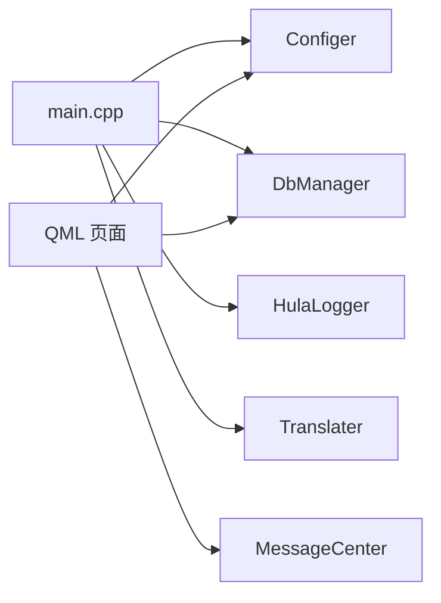

**图表来源**
- [CMakeLists.txt:23-100](file://CMakeLists.txt#L23-L100)
- [src/main.cpp:17-99](file://src/main.cpp#L17-L99)

**章节来源**
- [CMakeLists.txt:23-100](file://CMakeLists.txt#L23-L100)
- [src/main.cpp:17-99](file://src/main.cpp#L17-L99)

## 性能考量
- 单例与线程安全
  - Configer、DbManager、MessageCenter、HulaLogger 均采用单例模式，减少重复初始化成本
  - DbManager 使用线程本地连接与互斥保护，降低锁竞争
- UI 加载与渲染
  - Loader 异步加载页面，减少首屏阻塞
  - 自定义组件统一风格与状态切换，减少重复逻辑
- 日志与诊断
  - HulaLogger 支持轮转与清理，避免日志膨胀影响性能
- 数据访问
  - TransactionGuard 确保事务一致性，避免长事务导致锁等待

## 故障排查指南
- 数据库连接失败
  - 检查 DbManager::connect 返回值与 lastError
  - 确认数据库文件路径与权限
- 页面加载失败
  - 监听 QQmlApplicationEngine::objectCreationFailed 信号
  - 检查 QML 文件路径与模块注册
- 消息未显示
  - 确认消息通过 MessageCenter::connectRecv 正确连接
  - 检查 messageEmitted 信号是否发出
- 国际化不生效
  - 确认 Translater::init 与 setCurrentLang 调用顺序
  - 检查语言文件目录与文件名

**章节来源**
- [src/dbmanager.h:163-167](file://src/dbmanager.h#L163-L167)
- [src/main.cpp:87-92](file://src/main.cpp#L87-L92)
- [src/messagecenter.h:89-106](file://src/messagecenter.h#L89-L106)
- [src/translater.h:58-77](file://src/translater.h#L58-L77)

## 结论
本项目通过“C++ 核心 + QML 界面”的混合架构，结合 MVC 分层与单例、RAII、观察者等设计模式，实现了清晰的职责分离与良好的可扩展性。配置、数据库、消息与日志等核心能力以单例形式提供，既保证了全局一致性，又便于在 QML 中直接使用。UI 通过 Loader 与 StackView 实现灵活导航，自定义组件提升一致性和复用性。建议后续在以下方面持续优化：
- 将业务逻辑进一步抽象为服务层接口，增强单元测试能力
- 引入更细粒度的错误码与统一异常处理机制
- 对热点数据引入缓存策略，优化 UI 响应速度

## 附录
- 技术选型说明
  - Qt6/QML：跨平台 UI 开发，强类型与信号槽机制适合复杂交互
  - SQLite：轻量级嵌入式数据库，满足中小规模数据管理需求
  - C++20：现代 C++ 特性提升代码安全性与可维护性
- 构建与运行
  - 使用 CMake 3.16+ 与 Qt 6.7+，支持多平台部署

**章节来源**
- [README.md:15-34](file://README.md#L15-L34)
- [CMakeLists.txt:3-26](file://CMakeLists.txt#L3-L26)