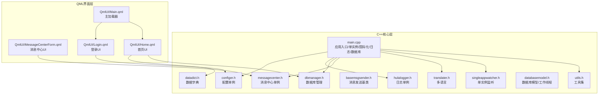
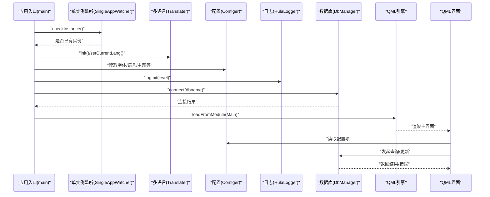
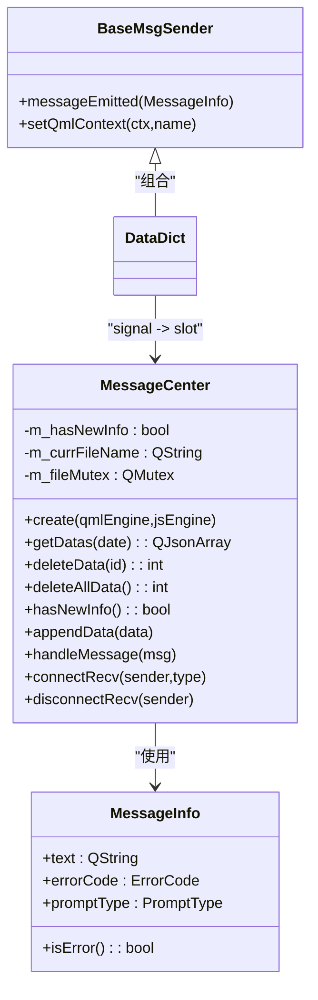
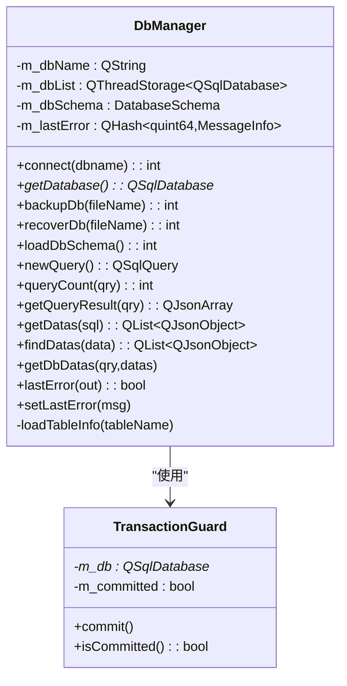
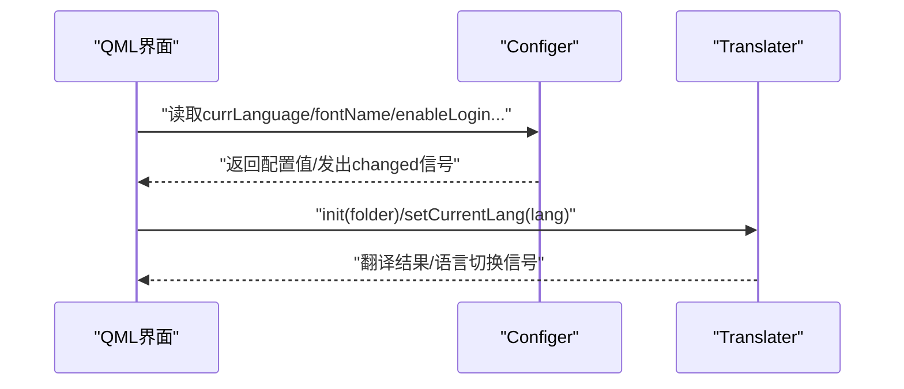
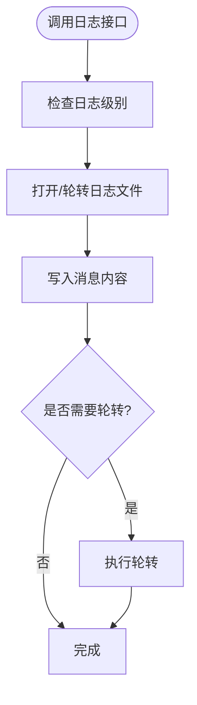
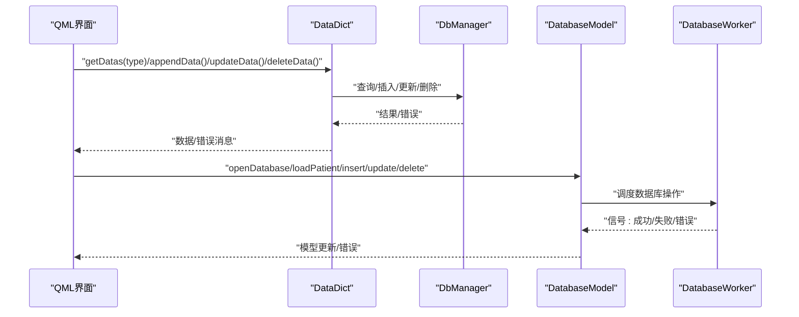
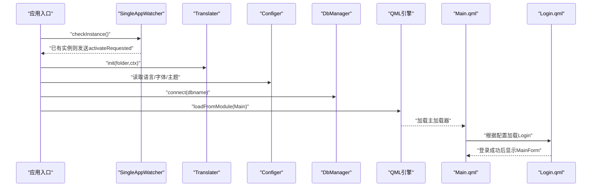
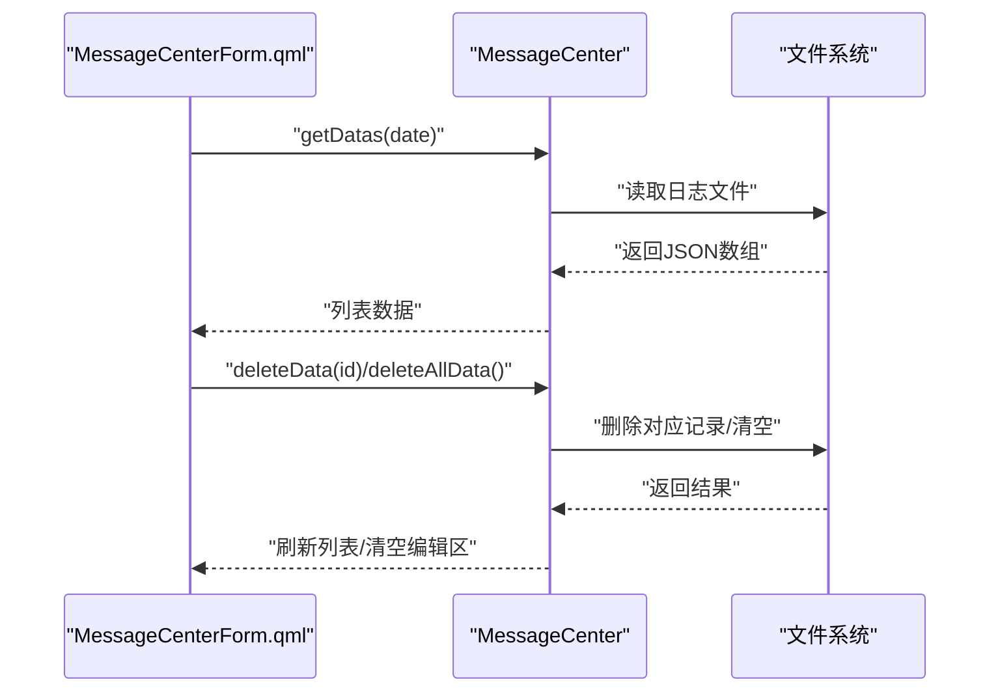
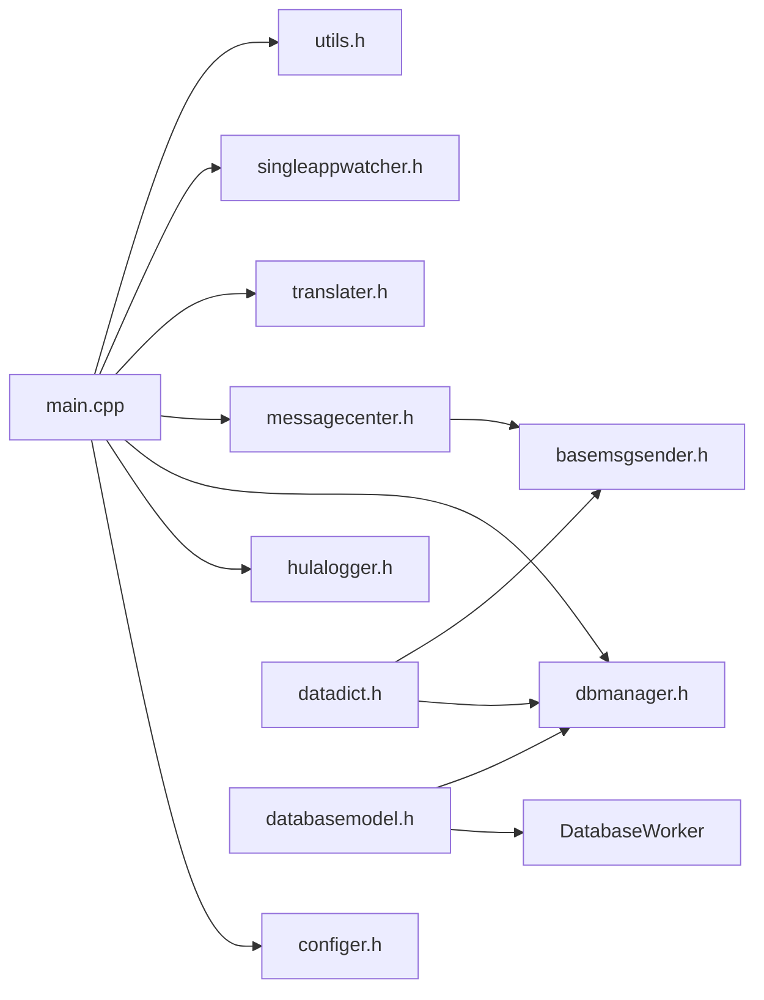

# 组件交互

<cite>
**本文引用的文件**
- [src/main.cpp](file://src/main.cpp)
- [src/messagecenter.h](file://src/messagecenter.h)
- [src/dbmanager.h](file://src/dbmanager.h)
- [src/configer.h](file://src/configer.h)
- [src/basemsgsender.h](file://src/basemsgsender.h)
- [src/hulalogger.h](file://src/hulalogger.h)
- [src/common.h](file://src/common.h)
- [src/translater.h](file://src/translater.h)
- [src/singleappwatcher.h](file://src/singleappwatcher.h)
- [src/utils.h](file://src/utils.h)
- [src/databasemodel.h](file://src/databasemodel.h)
- [src/datadict.h](file://src/datadict.h)
- [src/QmlUI/Main.qml](file://src/QmlUI/Main.qml)
- [src/QmlUI/MessageCenterForm.qml](file://src/QmlUI/MessageCenterForm.qml)
- [src/QmlUI/Home.qml](file://src/QmlUI/Home.qml)
- [src/QmlUI/Login.qml](file://src/QmlUI/Login.qml)
</cite>

## 目录
1. [简介](#简介)
2. [项目结构](#项目结构)
3. [核心组件](#核心组件)
4. [架构总览](#架构总览)
5. [详细组件分析](#详细组件分析)
6. [依赖分析](#依赖分析)
7. [性能考虑](#性能考虑)
8. [故障排查指南](#故障排查指南)
9. [结论](#结论)
10. [附录](#附录)

## 简介
本文件面向QmlPlugins项目的组件交互，系统性梳理C++核心模块与QML界面层之间的数据传递、信号槽连接与事件处理流程；阐述消息中心在组件解耦中的作用与消息传递机制；说明数据库管理、配置管理、日志系统等核心服务的调用关系；并提供数据流与控制流图，展示典型用户操作的完整执行链路，解释异步操作与错误传播机制。

## 项目结构
项目采用“C++核心服务 + QML界面层”的分层架构：
- C++核心层：负责应用启动、单实例控制、国际化、配置、日志、数据库、消息中心、工具集等。
- QML界面层：负责页面加载、用户交互、与C++模块通过QML导出的单例/元素进行数据交换。

**图表来源**
- [src/main.cpp:17-99](file://src/main.cpp#L17-L99)
- [src/configer.h:98-277](file://src/configer.h#L98-L277)
- [src/hulalogger.h:49-175](file://src/hulalogger.h#L49-L175)
- [src/messagecenter.h:27-127](file://src/messagecenter.h#L27-L127)
- [src/dbmanager.h:52-192](file://src/dbmanager.h#L52-L192)
- [src/basemsgsender.h:10-38](file://src/basemsgsender.h#L10-L38)
- [src/translater.h:27-112](file://src/translater.h#L27-L112)
- [src/singleappwatcher.h:9-62](file://src/singleappwatcher.h#L9-L62)
- [src/utils.h:21-82](file://src/utils.h#L21-L82)
- [src/databasemodel.h:20-97](file://src/databasemodel.h#L20-L97)
- [src/datadict.h:30-103](file://src/datadict.h#L30-L103)
- [src/QmlUI/Main.qml:1-41](file://src/QmlUI/Main.qml#L1-L41)
- [src/QmlUI/MessageCenterForm.qml:1-280](file://src/QmlUI/MessageCenterForm.qml#L1-L280)
- [src/QmlUI/Home.qml:1-1042](file://src/QmlUI/Home.qml#L1-L1042)
- [src/QmlUI/Login.qml:1-342](file://src/QmlUI/Login.qml#L1-L342)

**章节来源**
- [src/main.cpp:17-99](file://src/main.cpp#L17-L99)
- [src/QmlUI/Main.qml:1-41](file://src/QmlUI/Main.qml#L1-L41)

## 核心组件
- 应用入口与环境初始化：设置平台、单实例、字体、国际化、日志、数据库连接、上下文属性注册。
- 配置管理（Configer）：提供QML可用的配置读写接口与变更信号，集中管理应用配置。
- 日志系统（HulaLogger）：线程安全、可轮转、级别可控的日志单例。
- 消息中心（MessageCenter）：统一接收各模块消息，持久化到文件，向UI广播。
- 数据库管理（DbManager）：提供数据库连接、查询、事务、备份/恢复、错误记录。
- 基类消息发送（BaseMsgSender）：为业务模块提供统一的消息发射接口。
- 多语言（Translater）：提供QML侧的翻译能力与语言切换。
- 单实例监听（SingleAppWatcher）：跨进程唤醒主实例。
- 工具集（Utils）：目录/文件同步与更新等实用功能。
- 数据库模型（DatabaseModel/DatabaseWorker）：将数据库访问迁移到独立线程，避免UI阻塞。
- 数据字典（DataDict）：提供字典项查询与维护，并通过消息通道上报错误。

**章节来源**
- [src/main.cpp:32-50](file://src/main.cpp#L32-L50)
- [src/configer.h:98-277](file://src/configer.h#L98-L277)
- [src/hulalogger.h:49-175](file://src/hulalogger.h#L49-L175)
- [src/messagecenter.h:27-127](file://src/messagecenter.h#L27-L127)
- [src/dbmanager.h:52-192](file://src/dbmanager.h#L52-L192)
- [src/basemsgsender.h:10-38](file://src/basemsgsender.h#L10-L38)
- [src/translater.h:27-112](file://src/translater.h#L27-L112)
- [src/singleappwatcher.h:9-62](file://src/singleappwatcher.h#L9-L62)
- [src/utils.h:21-82](file://src/utils.h#L21-L82)
- [src/databasemodel.h:20-97](file://src/databasemodel.h#L20-L97)
- [src/datadict.h:30-103](file://src/datadict.h#L30-L103)

## 架构总览
应用启动后，C++层完成环境初始化并向QML注入上下文；QML根据配置决定加载Splash/Login/Main流程；业务模块通过消息通道与消息中心解耦；数据库访问通过专用线程与事务守卫保证一致性与性能。

**图表来源**
- [src/main.cpp:24-99](file://src/main.cpp#L24-L99)
- [src/translater.h:58-72](file://src/translater.h#L58-L72)
- [src/configer.h:113-120](file://src/configer.h#L113-L120)
- [src/hulalogger.h:67-70](file://src/hulalogger.h#L67-L70)
- [src/dbmanager.h:80-81](file://src/dbmanager.h#L80-L81)
- [src/QmlUI/Main.qml:14-39](file://src/QmlUI/Main.qml#L14-L39)

## 详细组件分析

### 消息中心与消息传递机制
消息中心通过模板化的连接接口将任意发送者的消息信号绑定到自身槽函数，实现跨模块解耦。消息以结构体形式携带文本、错误码与提示类型，既可用于UI提示，也可用于日志记录与持久化。

**图表来源**
- [src/basemsgsender.h:10-38](file://src/basemsgsender.h#L10-L38)
- [src/messagecenter.h:27-127](file://src/messagecenter.h#L27-L127)
- [src/common.h:131-154](file://src/common.h#L131-L154)
- [src/datadict.h:90-91](file://src/datadict.h#L90-L91)

**章节来源**
- [src/messagecenter.h:89-106](file://src/messagecenter.h#L89-L106)
- [src/basemsgsender.h:27-34](file://src/basemsgsender.h#L27-L34)
- [src/common.h:131-154](file://src/common.h#L131-L154)

### 数据库管理与事务
数据库管理器提供线程本地连接、查询计数、结果集转换、备份/恢复、错误记录等能力；通过RAII事务守卫确保事务一致性；业务模块通过统一接口访问数据库，避免线程安全问题。

**图表来源**
- [src/dbmanager.h:37-50](file://src/dbmanager.h#L37-L50)
- [src/dbmanager.h:52-192](file://src/dbmanager.h#L52-L192)

**章节来源**
- [src/dbmanager.h:37-50](file://src/dbmanager.h#L37-L50)
- [src/dbmanager.h:168-188](file://src/dbmanager.h#L168-L188)

### 配置管理与国际化
配置单例提供丰富的QML可用属性与信号，界面层可直接读取与绑定；国际化模块负责加载语言文件与翻译，支持动态切换。

**图表来源**
- [src/configer.h:113-120](file://src/configer.h#L113-L120)
- [src/translater.h:58-72](file://src/translater.h#L58-L72)

**章节来源**
- [src/configer.h:136-178](file://src/configer.h#L136-L178)
- [src/translater.h:75-88](file://src/translater.h#L75-L88)

### 日志系统
日志系统提供级别控制、轮转、清理、线程安全写入等能力，支持从C++与QML侧调用。

**图表来源**
- [src/hulalogger.h:95-105](file://src/hulalogger.h#L95-L105)
- [src/hulalogger.h:123-134](file://src/hulalogger.h#L123-L134)

**章节来源**
- [src/hulalogger.h:67-105](file://src/hulalogger.h#L67-L105)

### 数据字典与数据库模型
数据字典提供字典项的增删改查与错误上报；数据库模型通过独立线程与工作对象实现数据库操作的异步化与线程安全。

**图表来源**
- [src/datadict.h:60-91](file://src/datadict.h#L60-L91)
- [src/dbmanager.h:100-167](file://src/dbmanager.h#L100-L167)
- [src/databasemodel.h:20-97](file://src/databasemodel.h#L20-L97)

**章节来源**
- [src/datadict.h:60-91](file://src/datadict.h#L60-L91)
- [src/databasemodel.h:28-84](file://src/databasemodel.h#L28-L84)

### 典型用户操作：登录与主界面加载
该流程展示了QML加载器、配置、登录、主界面显示以及单实例唤醒的完整链路。

**图表来源**
- [src/main.cpp:24-99](file://src/main.cpp#L24-L99)
- [src/QmlUI/Main.qml:14-39](file://src/QmlUI/Main.qml#L14-L39)
- [src/QmlUI/Login.qml:22-45](file://src/QmlUI/Login.qml#L22-L45)

**章节来源**
- [src/main.cpp:61-72](file://src/main.cpp#L61-L72)
- [src/QmlUI/Main.qml:14-39](file://src/QmlUI/Main.qml#L14-L39)
- [src/QmlUI/Login.qml:321-335](file://src/QmlUI/Login.qml#L321-L335)

### 消息中心UI：查询与删除
消息中心界面通过消息中心单例查询当日或指定日期的错误信息，支持逐条删除与全部清空。

**图表来源**
- [src/QmlUI/MessageCenterForm.qml:215-278](file://src/QmlUI/MessageCenterForm.qml#L215-L278)
- [src/messagecenter.h:56-75](file://src/messagecenter.h#L56-L75)
- [src/messagecenter.h:63-69](file://src/messagecenter.h#L63-L69)

**章节来源**
- [src/QmlUI/MessageCenterForm.qml:215-278](file://src/QmlUI/MessageCenterForm.qml#L215-L278)

## 依赖分析
- 组件耦合与内聚：消息中心作为事件中枢，降低模块间耦合；配置、日志、数据库均以单例形式暴露给QML，便于统一管理。
- 直接依赖：
  - DbManager依赖QSql系列与线程存储。
  - MessageCenter依赖配置与文件系统。
  - DataDict依赖DbManager与BaseMsgSender。
  - DatabaseModel依赖DatabaseWorker与线程。
- 外部依赖：Qt框架（Core/Gui/Qml/Sql/Network等）。

**图表来源**
- [src/main.cpp:17-99](file://src/main.cpp#L17-L99)
- [src/dbmanager.h:52-192](file://src/dbmanager.h#L52-L192)
- [src/messagecenter.h:27-127](file://src/messagecenter.h#L27-L127)
- [src/basemsgsender.h:10-38](file://src/basemsgsender.h#L10-L38)
- [src/datadict.h:90-98](file://src/datadict.h#L90-L98)
- [src/databasemodel.h:20-97](file://src/databasemodel.h#L20-L97)

**章节来源**
- [src/main.cpp:44-50](file://src/main.cpp#L44-L50)
- [src/dbmanager.h:168-188](file://src/dbmanager.h#L168-L188)

## 性能考虑
- 线程与异步：数据库操作通过独立线程与工作对象执行，避免UI阻塞；消息中心对文件读写加锁，保障并发安全。
- 事务与一致性：使用RAII事务守卫，确保异常路径也能正确提交或回滚。
- 日志轮转：按大小与时间轮转，避免日志文件过大影响IO性能。
- QML加载策略：主加载器按需异步加载Splash/Login/Main，减少首屏等待。

[本节为通用建议，无需具体文件分析]

## 故障排查指南
- 数据库连接失败：检查连接返回码与错误消息，确认数据库文件路径与权限；必要时通过DbManager的lastError接口获取最近错误。
- 消息中心无数据：确认消息中心文件路径与权限，检查消息发送方是否正确连接至消息中心；验证日期筛选条件。
- 登录失败：核对用户凭据与配置项；查看登录界面提示信息与日志输出。
- 单实例无法唤醒：检查本地套接字服务器名称与连接状态；确认已有实例是否正常运行。

**章节来源**
- [src/main.cpp:46-50](file://src/main.cpp#L46-L50)
- [src/dbmanager.h:163-166](file://src/dbmanager.h#L163-L166)
- [src/messagecenter.h:119-122](file://src/messagecenter.h#L119-L122)
- [src/QmlUI/Login.qml:325-329](file://src/QmlUI/Login.qml#L325-L329)
- [src/singleappwatcher.h:17-36](file://src/singleappwatcher.h#L17-L36)

## 结论
QmlPlugins通过清晰的分层与单例化核心服务，实现了C++与QML的高效协作；消息中心有效解耦了各业务模块；数据库与日志系统提供了稳健的数据与可观测性支撑；异步与事务机制保障了性能与一致性。整体架构具备良好的扩展性与可维护性。

[本节为总结，无需具体文件分析]

## 附录
- 关键数据结构与枚举：MessageInfo、PromptType、DeviceStatus、ErrorCode等，统一了错误与提示的表达方式。
- QML上下文属性：应用路径等通过根上下文注入，便于界面层使用。

**章节来源**
- [src/common.h:131-154](file://src/common.h#L131-L154)
- [src/main.cpp:52](file://src/main.cpp#L52)