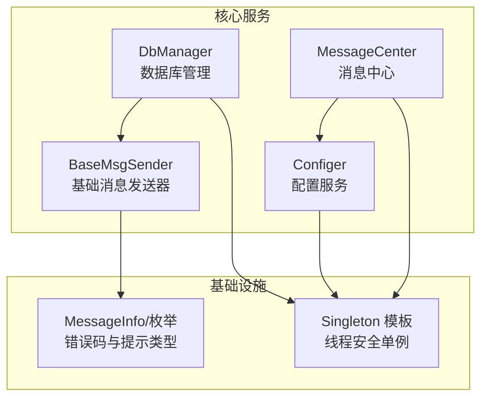
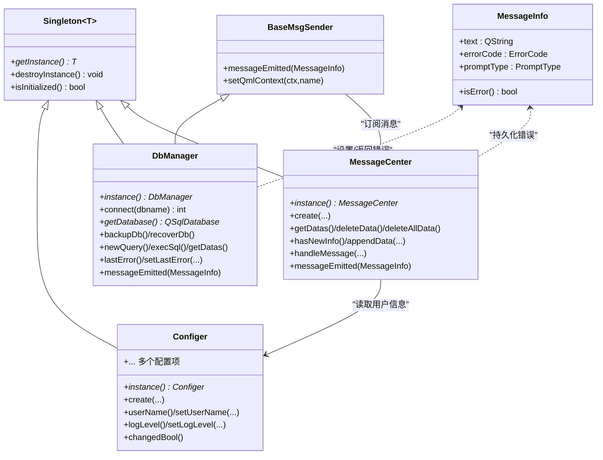
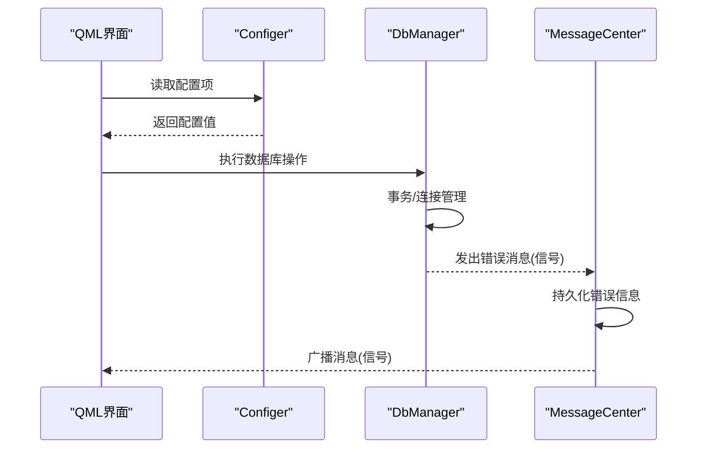
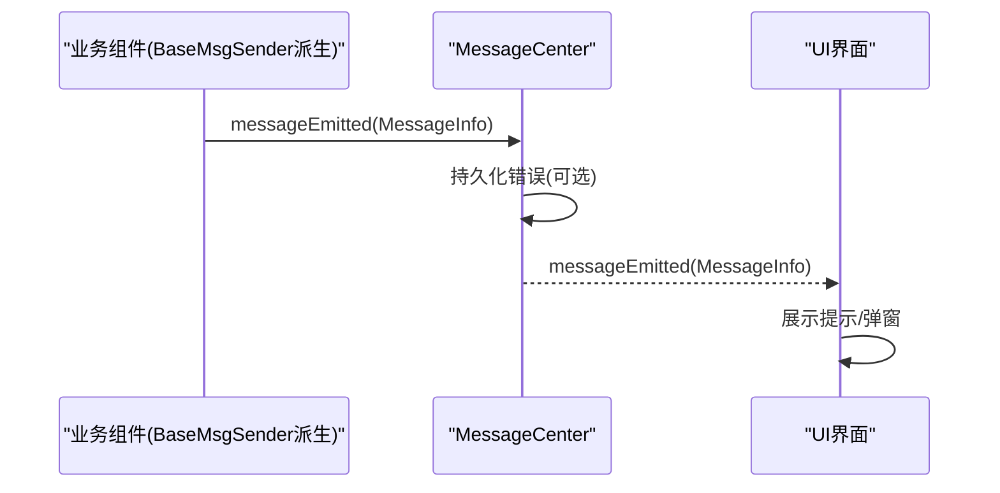
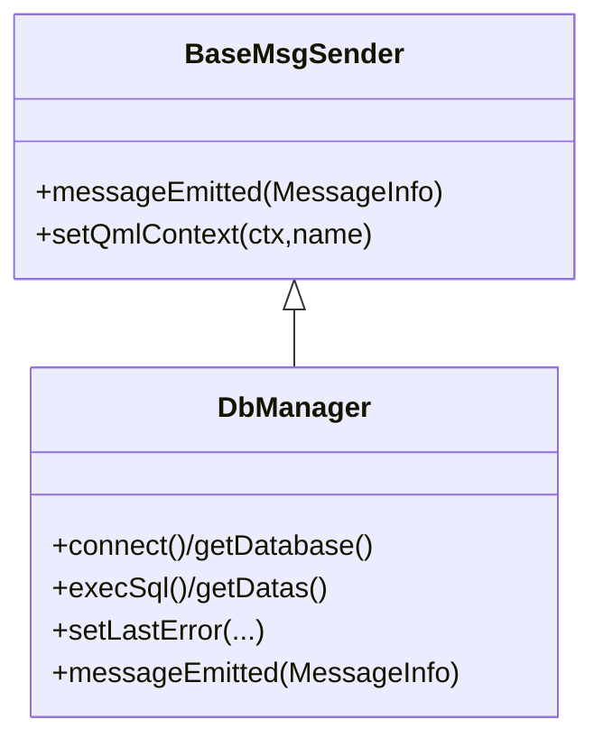
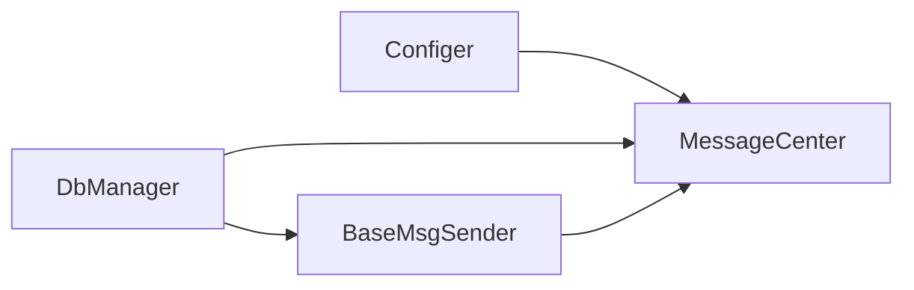

# 设计模式

<cite>
**本文引用的文件**
- [singleton.h](file://src/singleton.h)
- [configer.h](file://src/configer.h)
- [configer.cpp](file://src/configer.cpp)
- [dbmanager.h](file://src/dbmanager.h)
- [dbmanager.cpp](file://src/dbmanager.cpp)
- [messagecenter.h](file://src/messagecenter.h)
- [messagecenter.cpp](file://src/messagecenter.cpp)
- [basemsgsender.h](file://src/basemsgsender.h)
- [basemsgsender.cpp](file://src/basemsgsender.cpp)
- [common.h](file://src/common.h)
</cite>

## 目录
1. [引言](#引言)
2. [项目结构](#项目结构)
3. [核心组件](#核心组件)
4. [架构总览](#架构总览)
5. [详细组件分析](#详细组件分析)
6. [依赖关系分析](#依赖关系分析)
7. [性能考量](#性能考量)
8. [故障排查指南](#故障排查指南)
9. [结论](#结论)

## 引言
本文件聚焦于QmlPlugins项目中设计模式的应用与落地，重点覆盖以下方面：
- 单例模式在Configer、DbManager、MessageCenter等核心服务中的实现与作用
- 观察者模式在消息中心与组件通信中的应用
- 工厂模式在UI组件创建中的使用现状与建议
- 基类设计模式BaseMsgSender的继承体系与多态应用
- 结合具体代码片段路径，解释选择这些模式的原因与带来的好处

## 项目结构
项目采用“按职责分层”的组织方式，核心服务位于src目录，包含配置、数据库、消息中心、基础消息发送器等模块；同时提供大量QML UI组件用于界面交互。

图表来源
- [configer.h:98-277](file://src/configer.h#L98-L277)
- [dbmanager.h:52-192](file://src/dbmanager.h#L52-L192)
- [messagecenter.h:27-127](file://src/messagecenter.h#L27-L127)
- [basemsgsender.h:10-38](file://src/basemsgsender.h#L10-L38)
- [singleton.h:21-81](file://src/singleton.h#L21-L81)
- [common.h:131-159](file://src/common.h#L131-L159)

章节来源
- [configer.h:98-277](file://src/configer.h#L98-L277)
- [dbmanager.h:52-192](file://src/dbmanager.h#L52-L192)
- [messagecenter.h:27-127](file://src/messagecenter.h#L27-L127)
- [basemsgsender.h:10-38](file://src/basemsgsender.h#L10-L38)
- [singleton.h:21-81](file://src/singleton.h#L21-L81)
- [common.h:131-159](file://src/common.h#L131-L159)

## 核心组件
- Configer：全局配置服务，提供应用运行所需的各项配置项访问与持久化能力，注册为QML单例，便于跨界面共享。
- DbManager：数据库管理器，负责SQLite连接、事务、备份/恢复、查询与Schema缓存，继承自BaseMsgSender以统一消息上报机制。
- MessageCenter：消息中心，集中接收来自各组件的消息，过滤并持久化错误信息，向UI广播消息事件。
- BaseMsgSender：基础消息发送器，定义统一的消息信号与上下文注册能力，作为所有业务组件的消息发送基类。
- Singleton：现代C++线程安全单例模板，结合SINGLETON宏简化单例声明与使用。

章节来源
- [configer.h:98-277](file://src/configer.h#L98-L277)
- [dbmanager.h:52-192](file://src/dbmanager.h#L52-L192)
- [messagecenter.h:27-127](file://src/messagecenter.h#L27-L127)
- [basemsgsender.h:10-38](file://src/basemsgsender.h#L10-L38)
- [singleton.h:21-81](file://src/singleton.h#L21-L81)

## 架构总览
整体采用“单例服务 + 观察者消息通道”的架构：
- 单例服务：Configer、DbManager、MessageCenter分别提供配置、数据库、消息三大核心能力
- 观察者通道：BaseMsgSender统一发出消息信号，MessageCenter集中订阅处理，并向UI转发
- 线程安全：DbManager内部使用线程本地存储与互斥锁保障并发安全

图表来源
- [singleton.h:21-81](file://src/singleton.h#L21-L81)
- [configer.h:98-277](file://src/configer.h#L98-L277)
- [dbmanager.h:52-192](file://src/dbmanager.h#L52-L192)
- [messagecenter.h:27-127](file://src/messagecenter.h#L27-L127)
- [basemsgsender.h:10-38](file://src/basemsgsender.h#L10-L38)
- [common.h:131-159](file://src/common.h#L131-L159)

## 详细组件分析

### 单例模式：Configer、DbManager、MessageCenter
- 实现要点
  - 使用Singleton模板与SINGLETON宏，确保线程安全与唯一实例
  - Configer与MessageCenter在头文件中声明QML单例入口，便于在QML侧直接使用
  - DbManager继承BaseMsgSender，复用消息发送能力，同时保持单例特性
- 应用场景
  - Configer：全局配置读写，避免重复初始化与跨界面状态不一致
  - DbManager：数据库连接与事务管理，避免多线程竞争与连接泄漏
  - MessageCenter：集中消息处理与持久化，统一UI提示
- 选择原因与收益
  - 避免重复初始化与资源浪费
  - 统一错误与提示上报通道
  - 简化跨模块调用与依赖注入

图表来源
- [configer.h:113-120](file://src/configer.h#L113-L120)
- [dbmanager.cpp:784-793](file://src/dbmanager.cpp#L784-L793)
- [messagecenter.cpp:101-116](file://src/messagecenter.cpp#L101-L116)

章节来源
- [singleton.h:21-81](file://src/singleton.h#L21-L81)
- [configer.h:98-277](file://src/configer.h#L98-L277)
- [configer.cpp:1-421](file://src/configer.cpp#L1-L421)
- [dbmanager.h:52-192](file://src/dbmanager.h#L52-L192)
- [dbmanager.cpp:1-824](file://src/dbmanager.cpp#L1-L824)
- [messagecenter.h:27-127](file://src/messagecenter.h#L27-L127)
- [messagecenter.cpp:1-118](file://src/messagecenter.cpp#L1-L118)

### 观察者模式：消息中心与组件通信
- 实现要点
  - BaseMsgSender定义统一消息信号，子类只需触发即可
  - MessageCenter提供模板化的connectRecv/disconnectRecv，基于编译期类型检查连接信号与槽
  - DbManager在错误发生时调用setLastError并触发messageEmitted，由MessageCenter统一处理
- 应用场景
  - 组件间解耦：发送方无需关心接收方细节
  - 集中式处理：错误与提示统一进入MessageCenter，按需持久化与UI展示
- 选择原因与收益
  - 降低模块间耦合度
  - 提升可维护性与可扩展性
  - 统一错误与提示策略

图表来源
- [basemsgsender.h:27-35](file://src/basemsgsender.h#L27-L35)
- [messagecenter.h:89-106](file://src/messagecenter.h#L89-L106)
- [messagecenter.cpp:101-116](file://src/messagecenter.cpp#L101-L116)
- [dbmanager.cpp:784-793](file://src/dbmanager.cpp#L784-L793)

章节来源
- [basemsgsender.h:10-38](file://src/basemsgsender.h#L10-L38)
- [basemsgsender.cpp:1-27](file://src/basemsgsender.cpp#L1-L27)
- [messagecenter.h:89-106](file://src/messagecenter.h#L89-L106)
- [messagecenter.cpp:1-118](file://src/messagecenter.cpp#L1-L118)
- [dbmanager.cpp:784-793](file://src/dbmanager.cpp#L784-L793)

### 工厂模式：UI组件创建
- 现状说明
  - 项目提供了丰富的QML UI组件（如HulaButton、HulaTextField、HulaDialog等），但未见显式的“工厂类”或“工厂方法”封装
  - 组件通常通过QML直接导入与实例化，未体现传统面向对象意义的“工厂模式”
- 建议与实践
  - 若需要根据运行时条件动态创建不同类型的UI组件，可在C++侧提供工厂类，导出到QML
  - 或在QML侧使用Loader/Delegate模式实现动态加载与创建，以满足“延迟创建、按需实例化”的工厂思想
- 选择原因与收益
  - 降低UI复杂度与耦合度
  - 提升可扩展性与运行时灵活性

章节来源
- [configer.h:44-75](file://src/configer.h#L44-L75)
- [configer.cpp:330-338](file://src/configer.cpp#L330-L338)

### 基类设计模式：BaseMsgSender继承体系与多态
- 设计要点
  - BaseMsgSender定义统一消息信号与上下文注册能力
  - DbManager继承BaseMsgSender，获得消息发送能力与QML上下文绑定能力
  - 通过虚析构与多态，上层可统一处理多种消息发送器
- 应用场景
  - 统一错误上报与UI提示
  - 组件生命周期内自动注册/注销消息通道
- 选择原因与收益
  - 提升代码复用与一致性
  - 降低重复样板代码

图表来源
- [basemsgsender.h:10-38](file://src/basemsgsender.h#L10-L38)
- [dbmanager.h:52-192](file://src/dbmanager.h#L52-L192)

章节来源
- [basemsgsender.h:10-38](file://src/basemsgsender.h#L10-L38)
- [basemsgsender.cpp:1-27](file://src/basemsgsender.cpp#L1-L27)
- [dbmanager.h:52-192](file://src/dbmanager.h#L52-L192)

### 数据模型与消息结构
- MessageInfo结构体与相关枚举
  - 统一承载文本、错误码、提示类型
  - 通过isError判断是否为错误状态
- 选择原因与收益
  - 统一消息格式，便于跨模块传递与处理
  - 与Qt元对象系统结合，便于QML侧消费

章节来源
- [common.h:131-159](file://src/common.h#L131-L159)

## 依赖关系分析
- Configer与MessageCenter：MessageCenter在处理消息时读取Configer中的用户信息，用于持久化
- DbManager与MessageCenter：DbManager在错误时通过messageEmitted信号上报，由MessageCenter统一处理
- BaseMsgSender与MessageCenter：所有继承BaseMsgSender的组件自动连接到MessageCenter，形成统一消息通道

图表来源
- [messagecenter.cpp:109-111](file://src/messagecenter.cpp#L109-L111)
- [dbmanager.cpp:792-793](file://src/dbmanager.cpp#L792-L793)
- [basemsgsender.cpp:8-10](file://src/basemsgsender.cpp#L8-L10)

章节来源
- [messagecenter.cpp:1-118](file://src/messagecenter.cpp#L1-L118)
- [dbmanager.cpp:1-824](file://src/dbmanager.cpp#L1-L824)
- [basemsgsender.cpp:1-27](file://src/basemsgsender.cpp#L1-L27)

## 性能考量
- 单例与线程安全
  - 使用Singleton模板与std::once_flag保证首次创建的原子性，避免DCLP风险
- 数据库并发
  - DbManager使用QThreadStorage为每个线程维护独立连接，配合QMutex保护共享状态
  - 采用WAL模式与busy_timeout提升并发写入稳定性
- 消息处理
  - MessageCenter使用QMutex保护文件读写，避免并发写入导致的数据损坏
- 建议
  - 对频繁调用的单例接口可考虑缓存热点配置项
  - 对大量错误消息场景，可引入异步队列或批处理写入以降低UI阻塞

## 故障排查指南
- 数据库错误
  - 通过DbManager::lastError获取当前线程的错误信息，结合setLastError统一上报
  - 常见问题：数据库打开失败、执行失败、连接丢失、表不存在等
- 消息中心
  - 检查MessageCenter::handleMessage是否正确触发messageEmitted
  - 确认错误信息持久化文件路径与权限
- 单例初始化
  - 确保SINGLETON宏正确展开，且构造函数私有化
  - 如需测试清理，可调用destroy()释放实例

章节来源
- [dbmanager.cpp:769-793](file://src/dbmanager.cpp#L769-L793)
- [messagecenter.cpp:101-116](file://src/messagecenter.cpp#L101-L116)
- [singleton.h:28-50](file://src/singleton.h#L28-L50)

## 结论
QmlPlugins项目通过单例、观察者与基类设计等模式，构建了清晰、稳定且易于扩展的核心服务与消息通道。单例确保关键服务的唯一性与线程安全；观察者模式实现组件间松耦合的消息传递；基类设计统一了消息发送能力。工厂模式在UI组件层面尚未显式实现，建议后续引入以增强动态创建与扩展能力。整体架构在可维护性与性能之间取得良好平衡，适合在复杂桌面应用中推广与演进。