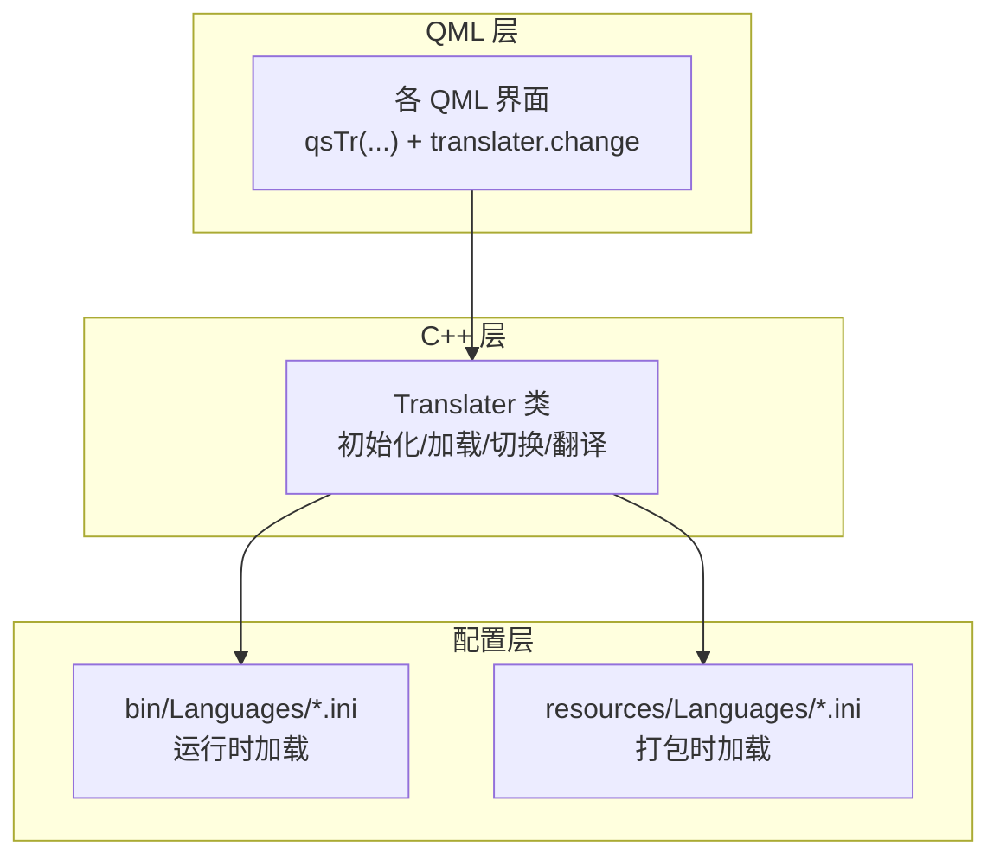
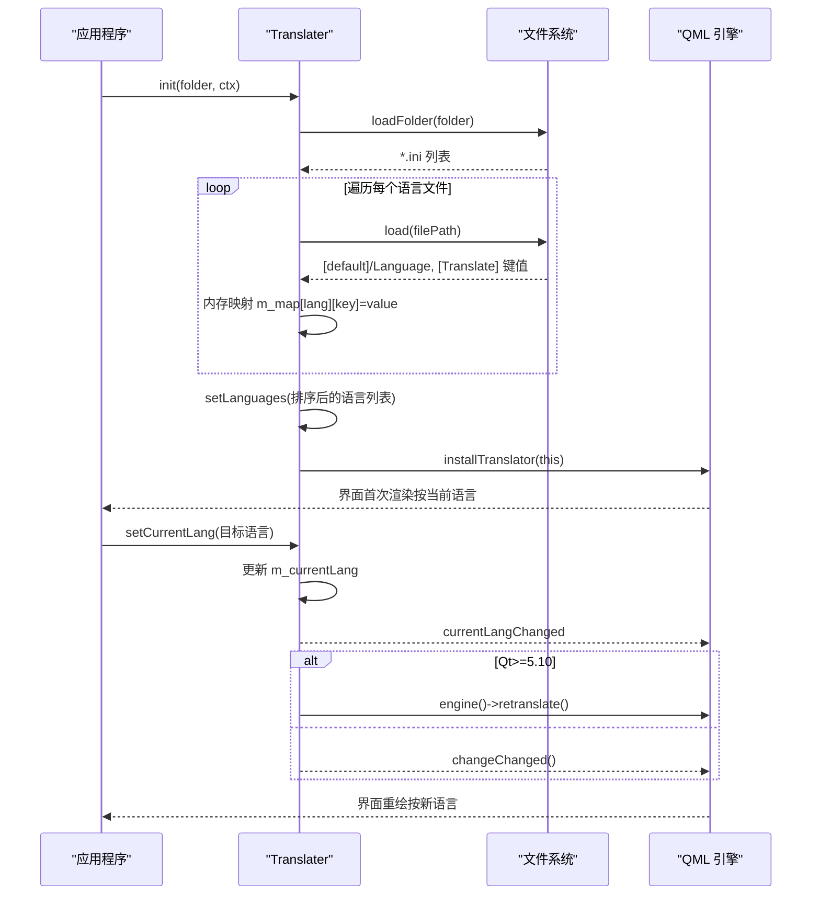
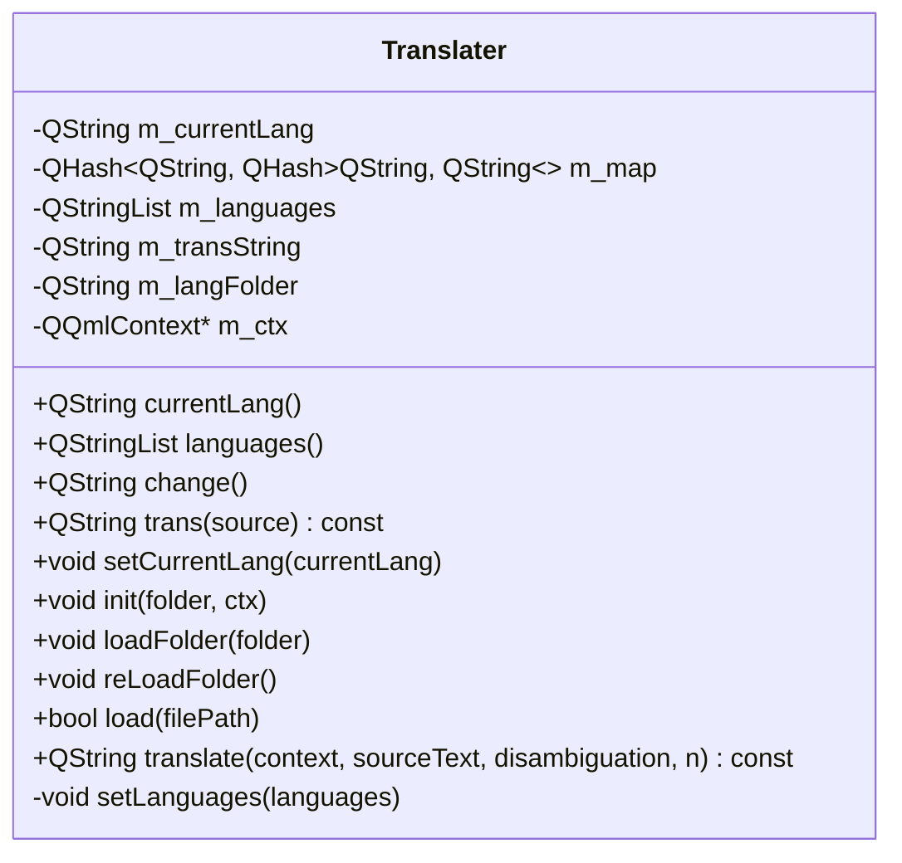
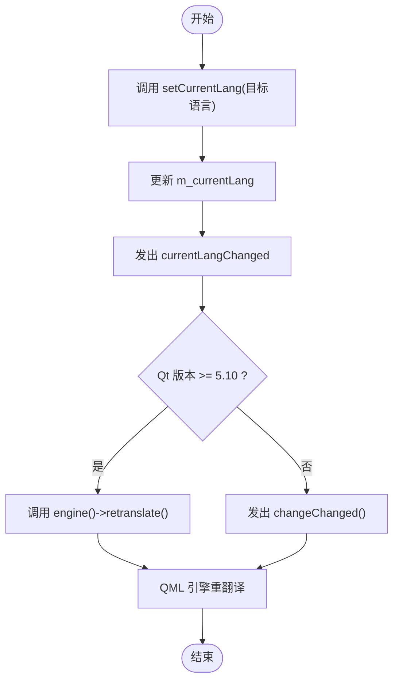
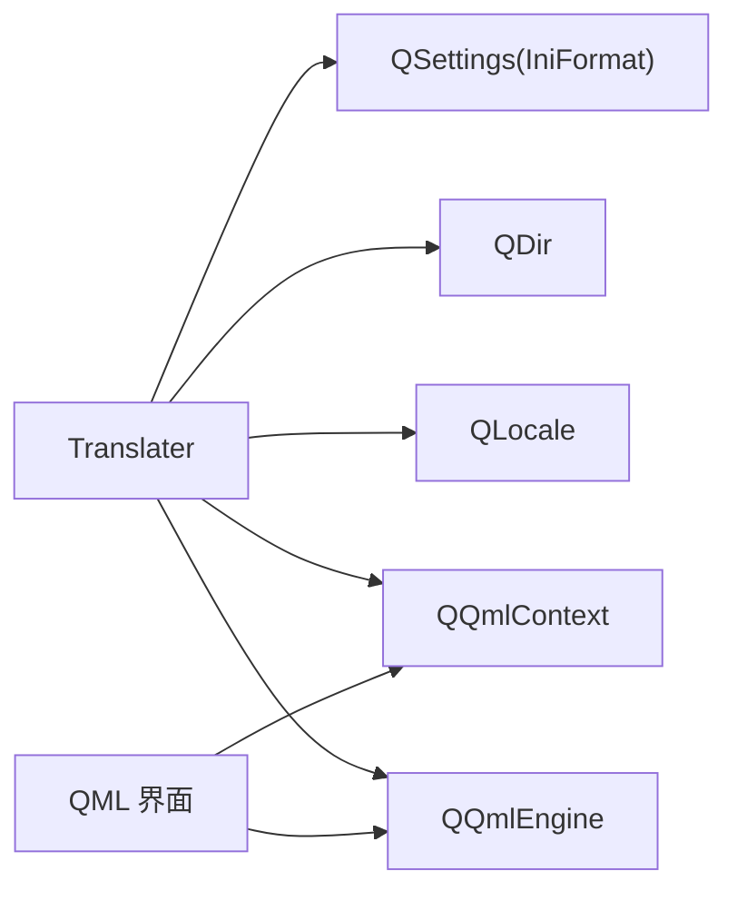

# 国际化模块

<cite>
**本文引用的文件**
- [translater.h](file://src/translater.h)
- [translater.cpp](file://src/translater.cpp)
- [cn.ini（bin）](file://bin/Languages/cn.ini)
- [en.ini（bin）](file://bin/Languages/en.ini)
- [cn.ini（resources）](file://resources/Languages/cn.ini)
- [en.ini（resources）](file://resources/Languages/en.ini)
</cite>

## 目录
1. [简介](#简介)
2. [项目结构](#项目结构)
3. [核心组件](#核心组件)
4. [架构总览](#架构总览)
5. [详细组件分析](#详细组件分析)
6. [依赖分析](#依赖分析)
7. [性能考虑](#性能考虑)
8. [故障排查指南](#故障排查指南)
9. [结论](#结论)
10. [附录](#附录)

## 简介
本文件面向国际化模块的技术文档，聚焦 Translater 类的多语言支持机制、语言切换流程与翻译文件管理。文档将详细说明 INI 格式翻译文件的结构、键值映射关系与占位符替换机制；解释语言检测与区域设置处理、本地化资源加载策略；给出翻译缓存机制、内存优化与性能考量；并提供 API 使用示例（动态语言切换、翻译获取与默认语言回退）。此外，还涵盖翻译文件的组织结构、命名约定与版本管理，以及新增语言支持、翻译质量保证与本地化测试策略。

## 项目结构
国际化模块的核心由以下部分组成：
- C++ 层：Translater 类负责翻译器初始化、语言加载、翻译查询与语言切换通知。
- 配置层：INI 格式的翻译文件，按语言分组存放于 bin 与 resources 两个目录，便于运行时与打包时使用。
- QML 层：通过 qsTr 与 translater.change 的拼接实现动态文本本地化。

图表来源
- [translater.h:27-107](file://src/translater.h#L27-L107)
- [translater.cpp:24-37](file://src/translater.cpp#L24-L37)
- [cn.ini（bin）:1-300](file://bin/Languages/cn.ini#L1-L300)
- [en.ini（bin）:1-298](file://bin/Languages/en.ini#L1-L298)
- [cn.ini（resources）:1-300](file://resources/Languages/cn.ini#L1-L300)
- [en.ini（resources）:1-298](file://resources/Languages/en.ini#L1-L298)

章节来源
- [translater.h:14-112](file://src/translater.h#L14-L112)
- [translater.cpp:19-37](file://src/translater.cpp#L19-L37)

## 核心组件
- Translater 类
  - 继承自 QTranslator，提供 QML 上下文集成、INI 文件加载、语言切换与翻译查询能力。
  - 关键属性：currentLang（当前语言）、languages（可用语言列表）、change（用于触发重翻译的信号）。
  - 关键方法：init、loadFolder、reLoadFolder、load、translate、trans、setCurrentLang。
  - 关键信号：currentLangChanged、languagesChanged、langLoaded、folderLoaded、changeChanged。

章节来源
- [translater.h:27-107](file://src/translater.h#L27-L107)
- [translater.cpp:19-146](file://src/translater.cpp#L19-L146)

## 架构总览
Translater 在应用启动时被初始化，绑定到 QQmlContext，并安装到全局翻译器链中。语言文件以 INI 形式加载至内存哈希表，查询时根据当前语言与键进行快速定位。语言切换通过设置 currentLang 并触发 retranslate 或 changeChanged，使 QML 界面刷新显示。

图表来源
- [translater.cpp:24-37](file://src/translater.cpp#L24-L37)
- [translater.cpp:48-76](file://src/translater.cpp#L48-L76)
- [translater.cpp:78-94](file://src/translater.cpp#L78-L94)
- [translater.cpp:123-136](file://src/translater.cpp#L123-L136)

## 详细组件分析

### Translater 类设计与职责
- 初始化与上下文绑定：init 接收语言目录与 QML 上下文，将自身注册为上下文属性，并安装到应用。
- 目录加载：loadFolder 遍历目录下的所有 .ini 文件，逐个调用 load 进行解析与入库。
- 单文件加载：load 使用 QSettings 以 IniFormat 解析 default.Language 与 Translate 分组，填充内存映射。
- 翻译查询：translate 将调用委托给 trans；trans 根据当前语言与键在 m_map 中查找，未命中则回退原文。
- 语言切换：setCurrentLang 更新当前语言并发出信号；高版本 Qt 触发引擎重翻译，否则发出 changeChanged 供 QML 监听刷新。

图表来源
- [translater.h:27-107](file://src/translater.h#L27-L107)
- [translater.cpp:19-146](file://src/translater.cpp#L19-L146)

章节来源
- [translater.h:27-107](file://src/translater.h#L27-L107)
- [translater.cpp:24-146](file://src/translater.cpp#L24-L146)

### INI 翻译文件结构与键值映射
- 文件结构
  - [default] 分组：包含 Language 字段，标识该文件对应的语言显示名。
  - [Translate] 分组：包含大量键值对，键为统一的逻辑键（如界面模块.控件.语义），值为该语言的翻译文本。
- 键值映射关系
  - 内存结构：QHash<QString, QHash<QString, QString>> m_map
  - 外层键：语言名（来自 default.Language）
  - 内层键：逻辑键（来自 Translate.*）
  - 值：翻译文本
- 占位符替换机制
  - 代码中未发现内置占位符替换逻辑；若需参数化文本，可在上层 QML 或业务侧自行处理（例如使用字符串插值或 Qt 的 tr 函数的可选 n 参数）。

章节来源
- [translater.cpp:78-94](file://src/translater.cpp#L78-L94)
- [cn.ini（bin）:1-300](file://bin/Languages/cn.ini#L1-L300)
- [en.ini（bin）:1-298](file://bin/Languages/en.ini#L1-L298)
- [cn.ini（resources）:1-300](file://resources/Languages/cn.ini#L1-L300)
- [en.ini（resources）:1-298](file://resources/Languages/en.ini#L1-L298)

### 语言检测与区域设置处理
- 语言检测
  - 代码未实现基于系统区域设置的自动检测；当前语言列表来源于目录扫描与 ini 文件的 default.Language。
  - 语言排序策略：将“简体中文”置于首位，其余按字母顺序排列。
- 区域设置处理
  - 代码未显式使用 QLocale 进行区域设置；语言切换通过 setCurrentLang 实现。

章节来源
- [translater.cpp:48-71](file://src/translater.cpp#L48-L71)
- [translater.cpp:138-145](file://src/translater.cpp#L138-L145)

### 本地化资源加载
- 运行时加载：bin/Languages 下的 ini 文件优先用于运行时加载。
- 打包时加载：resources/Languages 下的 ini 文件可用于打包后部署场景。
- 加载流程：loadFolder -> load -> 填充 m_map -> setLanguages -> 发出 folderLoaded/langLoaded 信号。

章节来源
- [translater.cpp:24-37](file://src/translater.cpp#L24-L37)
- [translater.cpp:48-76](file://src/translater.cpp#L48-L76)
- [translater.cpp:78-94](file://src/translater.cpp#L78-L94)

### 翻译缓存机制与并发安全
- 缓存结构：内存中的 m_map 以哈希表存储，查询复杂度近似 O(1)。
- 并发安全：使用 QReadWriteLock 对 m_map 进行读写锁保护，读多写少场景下提升并发性能。
- 重载策略：reLoadFolder 会重新扫描目录并重建映射，确保热更新。

章节来源
- [translater.h:96-98](file://src/translater.h#L96-L98)
- [translater.cpp:85-90](file://src/translater.cpp#L85-L90)
- [translater.cpp:73-76](file://src/translater.cpp#L73-L76)

### API 使用示例（基于现有接口）
- 初始化与上下文绑定
  - 调用 init(folder, ctx)，将 translater 注册为上下文属性，并安装翻译器。
- 动态语言切换
  - 调用 setCurrentLang(目标语言名)，随后根据 Qt 版本触发 retranslate 或监听 changeChanged。
- 翻译获取
  - 在 C++ 中调用 trans(key) 获取翻译；在 QML 中通过 translater.change 与 qsTr(...) 拼接实现动态刷新。
- 默认语言回退
  - 若未找到对应翻译，trans 回退到原文；可通过在 INI 中补齐缺失键值避免回退。

章节来源
- [translater.cpp:24-37](file://src/translater.cpp#L24-L37)
- [translater.cpp:123-136](file://src/translater.cpp#L123-L136)
- [translater.cpp:111-121](file://src/translater.cpp#L111-L121)

### 语言切换流程图

图表来源
- [translater.cpp:123-136](file://src/translater.cpp#L123-L136)

## 依赖分析
- 外部依赖
  - Qt 核心模块：QTranslator、QSettings、QDir、QLocale、QQmlContext、QQmlEngine。
  - Qt GUI/Quick：retranslate 与上下文属性注册。
- 内部耦合
  - Translater 与 QML 通过上下文属性与信号耦合；与文件系统通过 QSettings 交互。
- 潜在循环依赖
  - 未见直接循环依赖；注意避免在 QML 中直接依赖 C++ 层的内部状态。

图表来源
- [translater.cpp:1-15](file://src/translater.cpp#L1-L15)
- [translater.cpp:24-37](file://src/translater.cpp#L24-L37)

章节来源
- [translater.cpp:1-15](file://src/translater.cpp#L1-L15)
- [translater.cpp:24-37](file://src/translater.cpp#L24-L37)

## 性能考虑
- 查询性能
  - 哈希表查询近似 O(1)，适合高频翻译场景。
- 并发性能
  - 读写分离锁减少写入阻塞，提高并发读取效率。
- 内存占用
  - 每个语言的完整键集都会驻留内存；建议按模块拆分 INI 或采用延迟加载策略以降低峰值内存。
- I/O 与初始化
  - 目录扫描与 ini 解析发生在初始化阶段；建议将常用语言文件放置在更快的存储介质上。
- 重翻译成本
  - 重翻译会遍历引擎节点，建议在批量切换语言时合并操作，避免频繁切换。

[本节为通用性能指导，无需特定文件来源]

## 故障排查指南
- 症状：界面未显示目标语言
  - 检查是否正确调用 init 并传入有效目录；确认目录下存在对应语言的 ini 文件。
  - 确认 setCurrentLang 已被调用且发出 currentLangChanged。
- 症状：切换语言后界面未刷新
  - 若 Qt 版本低于 5.10，需监听 changeChanged 并手动触发刷新；否则检查 engine()->retranslate() 是否被调用。
- 症状：翻译缺失回退为原文
  - 检查对应语言的 ini 文件中是否存在 Translate 分组与目标键；必要时补齐键值。
- 症状：语言列表异常
  - 检查 ini 文件 default.Language 是否正确；确认目录中 ini 文件命名规范。

章节来源
- [translater.cpp:24-37](file://src/translater.cpp#L24-L37)
- [translater.cpp:123-136](file://src/translater.cpp#L123-L136)
- [translater.cpp:111-121](file://src/translater.cpp#L111-L121)

## 结论
Translater 提供了简洁高效的本地化方案：以 INI 文件为载体，通过内存哈希表实现快速翻译查询，并结合 Qt 的翻译器机制与 QML 的重翻译能力，实现动态语言切换。建议在大型项目中进一步引入键空间划分、延迟加载与缓存淘汰策略，以优化内存与性能；同时完善语言检测与区域设置处理，提升用户体验。

[本节为总结性内容，无需特定文件来源]

## 附录

### INI 文件组织结构与命名约定
- 目录结构
  - bin/Languages 与 resources/Languages 各自维护一套语言文件，便于运行时与打包时使用。
- 文件命名
  - 建议使用语言代码作为文件名（如 zh.ini、en.ini），并在 [default] 中明确 Language 显示名。
- 分组约定
  - [default]：Language 为该文件的语言显示名。
  - [Translate]：键为统一的逻辑键，值为翻译文本。

章节来源
- [cn.ini（bin）:1-300](file://bin/Languages/cn.ini#L1-L300)
- [en.ini（bin）:1-298](file://bin/Languages/en.ini#L1-L298)
- [cn.ini（resources）:1-300](file://resources/Languages/cn.ini#L1-L300)
- [en.ini（resources）:1-298](file://resources/Languages/en.ini#L1-L298)

### 新增语言支持步骤
- 创建语言文件
  - 在 bin/Languages 与 resources/Languages 下新增对应语言的 ini 文件。
  - 在 [default] 中设置 Language。
  - 在 [Translate] 中补充所有逻辑键的翻译。
- 验证加载
  - 调用 loadFolder 或 reLoadFolder，确认 languages 列表包含新语言。
  - 调用 setCurrentLang 切换语言，验证界面刷新。

章节来源
- [translater.cpp:48-76](file://src/translater.cpp#L48-L76)
- [translater.cpp:78-94](file://src/translater.cpp#L78-L94)
- [translater.cpp:138-145](file://src/translater.cpp#L138-L145)

### 翻译质量保证与本地化测试策略
- 质量保证
  - 统一键命名规范与模块前缀；定期清理冗余键；为易错键建立校验规则。
- 本地化测试
  - 自动化：编写脚本扫描 INI 文件，检测缺失键与重复键。
  - 人工回归：在关键界面执行语言切换测试，检查布局与截断问题。
  - 边界覆盖：测试长文本、特殊字符与空键等边界情况。

[本节为通用实践建议，无需特定文件来源]