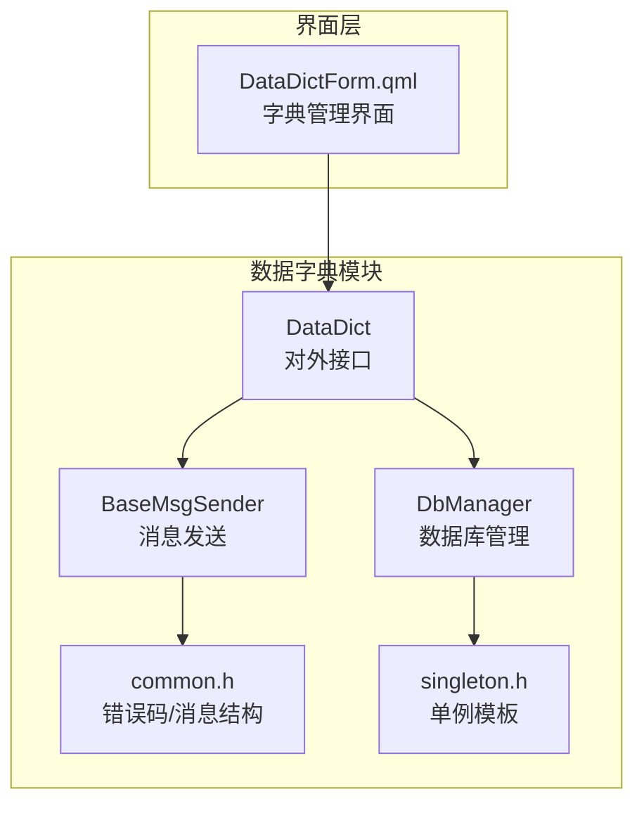
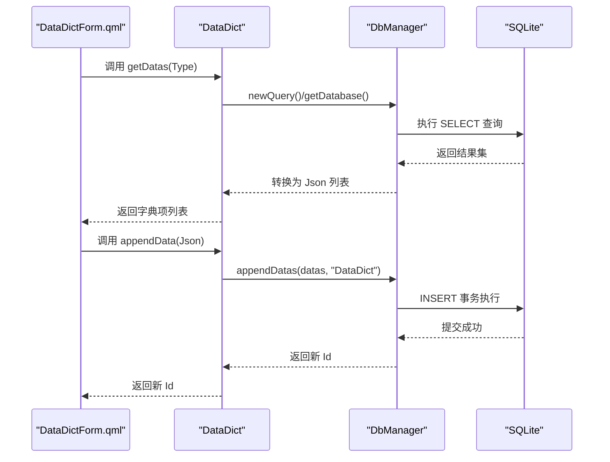
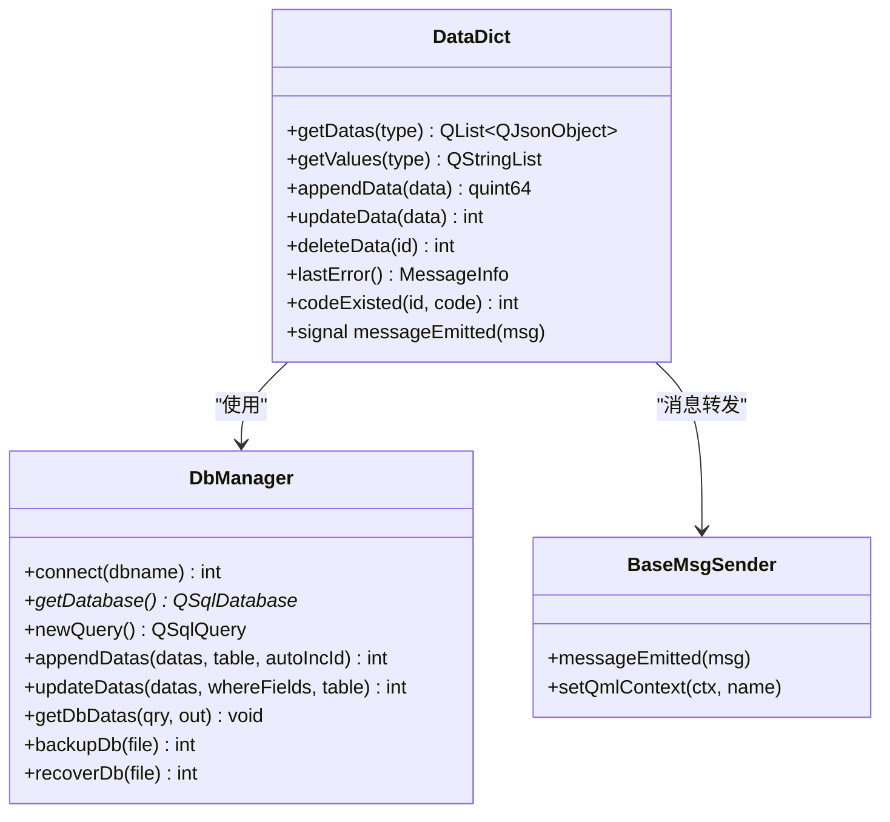
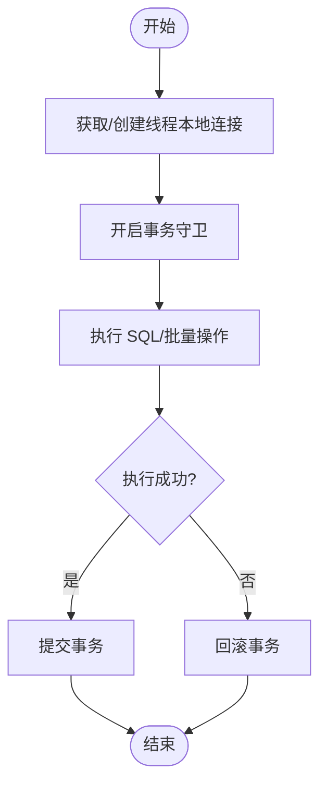
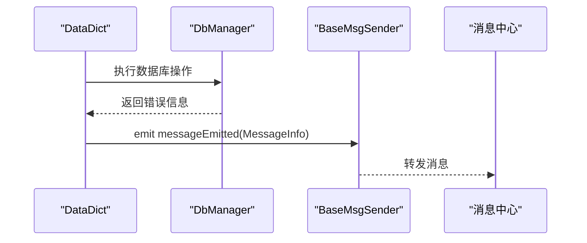
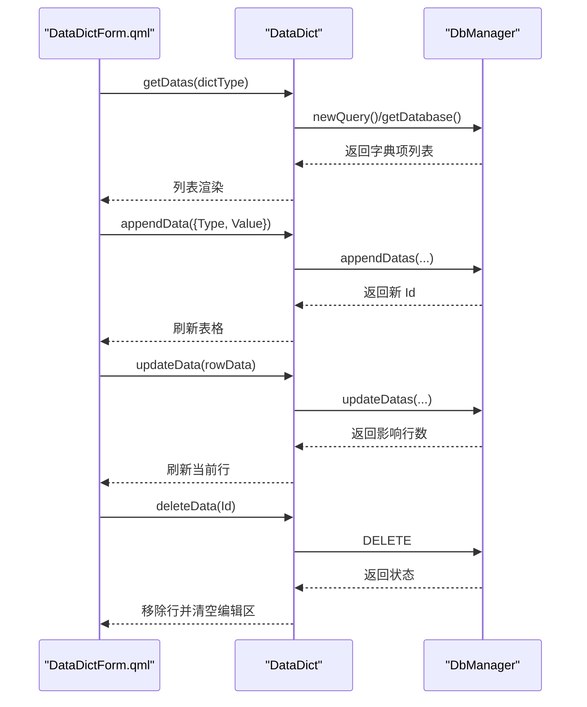
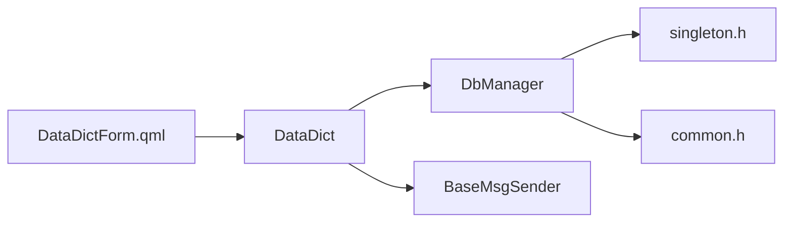

# 数据字典模块

<cite>
**本文档引用的文件**
- [datadict.h](file://src/datadict.h)
- [datadict.cpp](file://src/datadict.cpp)
- [dbmanager.h](file://src/dbmanager.h)
- [dbmanager.cpp](file://src/dbmanager.cpp)
- [basemsgsender.h](file://src/basemsgsender.h)
- [basemsgsender.cpp](file://src/basemsgsender.cpp)
- [common.h](file://src/common.h)
- [singleton.h](file://src/singleton.h)
- [DataDictForm.qml](file://src/QmlUI/DataDictForm.qml)
</cite>

## 目录
1. [简介](#简介)
2. [项目结构](#项目结构)
3. [核心组件](#核心组件)
4. [架构总览](#架构总览)
5. [详细组件分析](#详细组件分析)
6. [依赖关系分析](#依赖关系分析)
7. [性能考虑](#性能考虑)
8. [故障排查指南](#故障排查指南)
9. [结论](#结论)
10. [附录](#附录)

## 简介
本文件为数据字典模块的详细技术文档，围绕 DataDict 类展开，系统阐述其数据字典管理机制、字典项维护与数据标准化流程；深入解析字典结构设计、层级关系管理与关联查询机制；说明增删改查、批量导入导出与数据校验规则；覆盖缓存策略、性能优化与并发访问控制；提供 API 使用示例（字典项查询、分类管理、动态加载）；解释与业务系统的集成方式、版本管理与数据同步机制，并强调安全性、完整性与一致性的保障。

## 项目结构
数据字典模块位于 src 目录下，主要由以下文件构成：
- datadict.h/cpp：对外暴露的 QML 可调用数据字典类，封装 CRUD 与查询逻辑
- dbmanager.h/cpp：数据库管理器，提供连接、事务、查询、备份/恢复等能力
- basemsgsender.h/cpp：消息发送基类，统一向消息中心派发错误/提示信息
- common.h：全局错误码、消息结构体等通用定义
- singleton.h：单例模板，DbManager 使用单例模式确保线程安全
- DataDictForm.qml：QML 界面，演示如何通过 DataDict 进行字典项的增删改查与展示

**图表来源**
- [datadict.h:30-100](file://src/datadict.h#L30-L100)
- [datadict.cpp:22-26](file://src/datadict.cpp#L22-L26)
- [dbmanager.h:52-190](file://src/dbmanager.h#L52-L190)
- [dbmanager.cpp:43-49](file://src/dbmanager.cpp#L43-L49)
- [basemsgsender.h:10-35](file://src/basemsgsender.h#L10-L35)
- [common.h:63-157](file://src/common.h#L63-L157)
- [singleton.h:21-81](file://src/singleton.h#L21-L81)
- [DataDictForm.qml:1-20](file://src/QmlUI/DataDictForm.qml#L1-L20)

**章节来源**
- [datadict.h:14-103](file://src/datadict.h#L14-L103)
- [datadict.cpp:14-115](file://src/datadict.cpp#L14-L115)
- [dbmanager.h:14-192](file://src/dbmanager.h#L14-L192)
- [dbmanager.cpp:1-834](file://src/dbmanager.cpp#L1-L834)
- [basemsgsender.h:1-38](file://src/basemsgsender.h#L1-L38)
- [basemsgsender.cpp:1-27](file://src/basemsgsender.cpp#L1-L27)
- [common.h:1-159](file://src/common.h#L1-L159)
- [singleton.h:1-81](file://src/singleton.h#L1-L81)
- [DataDictForm.qml:1-235](file://src/QmlUI/DataDictForm.qml#L1-L235)

## 核心组件
- DataDict：面向 QML 的数据字典服务类，提供按类型获取字典、新增、更新、删除、唯一性校验与错误信息查询等接口
- DbManager：数据库管理器，负责连接、事务、查询、备份/恢复、Schema 加载与线程本地数据库连接管理
- BaseMsgSender：消息发送基类，统一将错误/提示信息转发至消息中心
- common.h：定义全局错误码、消息结构体与提示类型
- singleton.h：单例模板，DbManager 使用单例确保线程安全与资源复用
- DataDictForm.qml：QML 界面，演示 DataDict 的典型使用方式

**章节来源**
- [datadict.h:30-100](file://src/datadict.h#L30-L100)
- [datadict.cpp:22-115](file://src/datadict.cpp#L22-L115)
- [dbmanager.h:52-190](file://src/dbmanager.h#L52-L190)
- [dbmanager.cpp:51-90](file://src/dbmanager.cpp#L51-L90)
- [basemsgsender.h:10-35](file://src/basemsgsender.h#L10-L35)
- [common.h:63-157](file://src/common.h#L63-L157)
- [singleton.h:21-81](file://src/singleton.h#L21-L81)
- [DataDictForm.qml:10-20](file://src/QmlUI/DataDictForm.qml#L10-L20)

## 架构总览
DataDict 通过 DbManager 访问 SQLite 数据库，遵循“每线程一连接”的设计，结合事务守卫提升批量操作的一致性；错误通过 BaseMsgSender 统一上报，界面通过 QML 与 DataDict 交互。

**图表来源**
- [datadict.cpp:28-41](file://src/datadict.cpp#L28-L41)
- [datadict.cpp:53-62](file://src/datadict.cpp#L53-L62)
- [dbmanager.cpp:510-563](file://src/dbmanager.cpp#L510-L563)
- [dbmanager.cpp:362-368](file://src/dbmanager.cpp#L362-L368)

**章节来源**
- [datadict.cpp:28-62](file://src/datadict.cpp#L28-L62)
- [dbmanager.cpp:510-563](file://src/dbmanager.cpp#L510-L563)
- [dbmanager.cpp:362-368](file://src/dbmanager.cpp#L362-L368)

## 详细组件分析

### DataDict 类分析
DataDict 是数据字典的核心服务类，提供以下能力：
- 类型枚举：DictType 定义了多种字典类型（如性别、送检科室、标本类型等），用于区分不同类别的字典项
- 查询接口：
  - getDatas：按类型返回完整的字典项 Json 列表
  - getValues：按类型返回纯字符串列表，便于 ComboBox 等控件使用
- 维护接口：
  - appendData：新增字典项，返回新生成的 Id
  - updateData：根据 Id 更新字典项
  - deleteData：按 Id 删除字典项
- 校验与错误：
  - codeExisted：检查编号是否已存在（支持排除自身 Id）
  - lastError：返回最后一次错误信息
- 信号与消息：
  - messageEmitted：通过 BaseMsgSender 将错误/提示信息发送到消息中心

**图表来源**
- [datadict.h:30-100](file://src/datadict.h#L30-L100)
- [datadict.cpp:22-115](file://src/datadict.cpp#L22-L115)
- [dbmanager.h:52-190](file://src/dbmanager.h#L52-L190)
- [basemsgsender.h:10-35](file://src/basemsgsender.h#L10-L35)

**章节来源**
- [datadict.h:30-100](file://src/datadict.h#L30-L100)
- [datadict.cpp:22-115](file://src/datadict.cpp#L22-L115)

### DbManager 类分析
DbManager 提供数据库连接、事务、查询、Schema 加载与备份/恢复等能力：
- 连接管理：每线程独立连接，避免锁竞争；自动启用 WAL 模式与 busy_timeout
- 事务：TransactionGuard RAII 守卫，批量插入/更新自动包裹事务，失败自动回滚
- 查询：支持按 SQL 获取 Json 结果、按条件查找、批量插入/更新
- Schema：启动时加载表结构，解析字段类型、长度、精度、主键、自增等信息
- 备份/恢复：提供数据库文件级备份与恢复，带回滚保护

**图表来源**
- [dbmanager.cpp:16-40](file://src/dbmanager.cpp#L16-L40)
- [dbmanager.cpp:510-563](file://src/dbmanager.cpp#L510-L563)
- [dbmanager.cpp:447-508](file://src/dbmanager.cpp#L447-L508)

**章节来源**
- [dbmanager.h:37-50](file://src/dbmanager.h#L37-L50)
- [dbmanager.cpp:51-90](file://src/dbmanager.cpp#L51-L90)
- [dbmanager.cpp:16-40](file://src/dbmanager.cpp#L16-L40)
- [dbmanager.cpp:447-508](file://src/dbmanager.cpp#L447-L508)
- [dbmanager.cpp:510-563](file://src/dbmanager.cpp#L510-L563)

### 消息与错误处理
- BaseMsgSender：统一发出 messageEmitted 信号，供消息中心接收
- common.h：定义 MessageInfo 结构体与 ErrorCode 枚举，规范错误码区间与提示类型
- DataDict：在数据库操作失败时设置 lastError 并通过信号发送

**图表来源**
- [datadict.cpp:34-37](file://src/datadict.cpp#L34-L37)
- [basemsgsender.h:27-34](file://src/basemsgsender.h#L27-L34)
- [common.h:131-157](file://src/common.h#L131-L157)

**章节来源**
- [basemsgsender.cpp:5-26](file://src/basemsgsender.cpp#L5-L26)
- [common.h:63-157](file://src/common.h#L63-L157)
- [datadict.cpp:34-37](file://src/datadict.cpp#L34-L37)

### QML 界面集成与使用示例
DataDictForm.qml 展示了 DataDict 在界面中的典型用法：
- 初始化：onShowForm 时加载指定类型的字典项
- 查询：调用 dataDict.getDatas(dictType) 获取列表
- 新增：构造 Json 对象（含 Type），调用 appendData，插入后刷新表格
- 修改：获取当前行数据，调用 updateData，更新后刷新
- 删除：确认后调用 deleteData，删除成功后移除行并清空编辑区

**图表来源**
- [DataDictForm.qml:152-167](file://src/QmlUI/DataDictForm.qml#L152-L167)
- [DataDictForm.qml:181-197](file://src/QmlUI/DataDictForm.qml#L181-L197)
- [DataDictForm.qml:199-213](file://src/QmlUI/DataDictForm.qml#L199-L213)
- [DataDictForm.qml:215-233](file://src/QmlUI/DataDictForm.qml#L215-L233)
- [datadict.cpp:28-41](file://src/datadict.cpp#L28-L41)
- [datadict.cpp:53-62](file://src/datadict.cpp#L53-L62)
- [datadict.cpp:64-72](file://src/datadict.cpp#L64-L72)
- [datadict.cpp:74-85](file://src/datadict.cpp#L74-L85)

**章节来源**
- [DataDictForm.qml:10-235](file://src/QmlUI/DataDictForm.qml#L10-L235)
- [datadict.cpp:28-85](file://src/datadict.cpp#L28-L85)

## 依赖关系分析
- DataDict 依赖 DbManager 进行数据库操作，依赖 BaseMsgSender 进行消息转发
- DbManager 使用 singleton.h 提供的单例模板，确保线程安全
- common.h 为全局错误码与消息结构体定义，贯穿 DbManager 与 DataDict
- DataDictForm.qml 通过 import DataDict 1.0 与 DataDict 交互

**图表来源**
- [datadict.h:21-26](file://src/datadict.h#L21-L26)
- [dbmanager.h:19-29](file://src/dbmanager.h#L19-L29)
- [singleton.h:21-81](file://src/singleton.h#L21-L81)
- [common.h:63-157](file://src/common.h#L63-L157)
- [DataDictForm.qml:7-8](file://src/QmlUI/DataDictForm.qml#L7-L8)

**章节来源**
- [datadict.h:21-26](file://src/datadict.h#L21-L26)
- [dbmanager.h:19-29](file://src/dbmanager.h#L19-L29)
- [singleton.h:21-81](file://src/singleton.h#L21-L81)
- [common.h:63-157](file://src/common.h#L63-L157)
- [DataDictForm.qml:7-8](file://src/QmlUI/DataDictForm.qml#L7-L8)

## 性能考虑
- 连接模型：每线程独立连接，减少锁竞争，提高并发吞吐
- 事务批处理：appendDatas/updateDatas 使用事务守卫，批量操作原子性更强，减少多次提交开销
- WAL 模式与 busy_timeout：启用 WAL 模式提升并发读写性能，设置 busy_timeout 降低“database is locked”风险
- 查询优化：getDatas 使用参数化查询，避免拼接 SQL；getValues 仅提取 Value 字段，减少传输与转换成本
- 线程安全：DbManager 通过线程存储与互斥保护，避免共享状态竞争

**章节来源**
- [dbmanager.cpp:74-85](file://src/dbmanager.cpp#L74-L85)
- [dbmanager.cpp:447-508](file://src/dbmanager.cpp#L447-L508)
- [dbmanager.cpp:510-563](file://src/dbmanager.cpp#L510-L563)

## 故障排查指南
- 常见错误码
  - DbOpenFailed：数据库打开失败，检查路径与权限
  - DbExecuteFailed：SQL 执行失败，检查语法与表结构
  - DbBackupFailed/DbRecoverFailed：备份/恢复失败，检查文件权限与磁盘空间
- 错误信息获取
  - DataDict.lastError() 返回最近一次错误
  - DbManager.lastError(msg) 按线程获取错误
- 建议排查步骤
  - 确认数据库文件存在且可读写
  - 检查 WAL 模式与 busy_timeout 是否正确配置
  - 观察 messageEmitted 信号是否被消息中心接收
  - 对批量操作使用事务守卫，确保失败回滚

**章节来源**
- [common.h:75-117](file://src/common.h#L75-L117)
- [datadict.cpp:34-37](file://src/datadict.cpp#L34-L37)
- [dbmanager.cpp:780-792](file://src/dbmanager.cpp#L780-L792)

## 结论
数据字典模块以 DataDict 为核心，结合 DbManager 的线程本地连接与事务批处理，提供了稳定、高效的字典项管理能力。通过统一的消息机制与清晰的错误码体系，模块具备良好的可观测性与可维护性。配合 QML 界面，实现了直观的字典项维护体验。建议在生产环境中持续关注并发写入与备份策略，确保数据一致性与可用性。

## 附录

### API 使用示例（基于现有实现）
- 查询某类型字典项
  - QML：调用 dataDict.getDatas(dictType) 获取列表
  - C++：调用 DataDict::getDatas(DictType)
- 新增字典项
  - QML：构造包含 Type 与 Value 的对象，调用 dataDict.appendData(json)
  - C++：调用 DataDict::appendData(json)
- 更新字典项
  - QML：获取当前行数据并调用 dataDict.updateData(json)
  - C++：调用 DataDict::updateData(json)
- 删除字典项
  - QML：传入 Id 调用 dataDict.deleteData(id)
  - C++：调用 DataDict::deleteData(id)
- 校验编号唯一性
  - QML：调用 dataDict.codeExisted(id, code)
  - C++：调用 DataDict::codeExisted(id, code)
- 获取最后一次错误
  - QML：调用 dataDict.lastError()
  - C++：调用 DataDict::lastError()

**章节来源**
- [DataDictForm.qml:152-167](file://src/QmlUI/DataDictForm.qml#L152-L167)
- [DataDictForm.qml:181-197](file://src/QmlUI/DataDictForm.qml#L181-L197)
- [DataDictForm.qml:199-213](file://src/QmlUI/DataDictForm.qml#L199-L213)
- [DataDictForm.qml:215-233](file://src/QmlUI/DataDictForm.qml#L215-L233)
- [datadict.h:59-82](file://src/datadict.h#L59-L82)
- [datadict.cpp:28-85](file://src/datadict.cpp#L28-L85)