# 数据库管理模块

<cite>
**本文档引用的文件**
- [dbmanager.h](file://src/dbmanager.h)
- [dbmanager.cpp](file://src/dbmanager.cpp)
- [databasemodel.h](file://src/databasemodel.h)
- [databasemodel.cpp](file://src/databasemodel.cpp)
- [datadict.h](file://src/datadict.h)
- [datadict.cpp](file://src/datadict.cpp)
- [common.h](file://src/common.h)
- [basemsgsender.h](file://src/basemsgsender.h)
- [singleton.h](file://src/singleton.h)
</cite>

## 更新摘要
**变更内容**
- 更新了DbManager类的架构说明，反映新的loadDbSchema()方法
- 修改了状态码系统从ErrorCode到StatusCode的重命名
- 增强了数据库schema解析和类型检测功能的描述
- 更新了错误处理机制和API使用示例

## 目录
1. [简介](#简介)
2. [项目结构](#项目结构)
3. [核心组件](#核心组件)
4. [架构概览](#架构概览)
5. [详细组件分析](#详细组件分析)
6. [依赖关系分析](#依赖关系分析)
7. [性能考虑](#性能考虑)
8. [故障排除指南](#故障排除指南)
9. [结论](#结论)

## 简介

数据库管理模块是基于Qt框架开发的跨平台数据库管理系统，主要负责SQLite数据库的连接管理、CRUD操作、事务处理和数据字典管理。该模块采用单例模式设计，提供线程安全的数据库访问接口，并实现了完整的错误处理和日志记录机制。

**更新** 模块现已重构，新的loadDbSchema()方法替代了旧的readTableInfo()，提供了增强的数据库schema解析和类型检测功能。

## 项目结构

数据库管理模块位于项目的`src`目录下，主要包含以下核心文件：

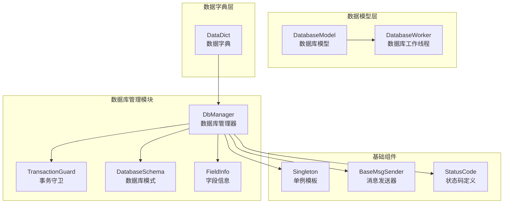

**图表来源**
- [dbmanager.h:52-192](file://src/dbmanager.h#L52-L192)
- [databasemodel.h:49-97](file://src/databasemodel.h#L49-L97)
- [datadict.h:30-103](file://src/datadict.h#L30-L103)

**章节来源**
- [dbmanager.h:1-216](file://src/dbmanager.h#L1-L216)
- [databasemodel.h:1-97](file://src/databasemodel.h#L1-L97)
- [datadict.h:1-103](file://src/datadict.h#L1-L103)

## 核心组件

### DbManager类架构

DbManager是数据库管理模块的核心类，采用单例模式设计，提供完整的数据库管理功能：

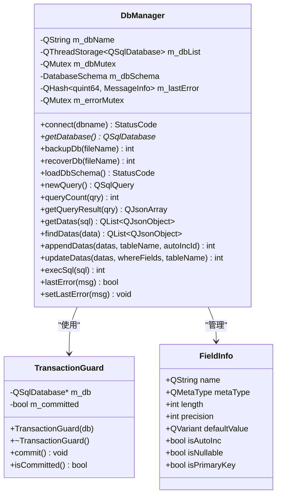

**图表来源**
- [dbmanager.h:52-216](file://src/dbmanager.h#L52-L216)
- [dbmanager.h:37-50](file://src/dbmanager.h#L37-L50)
- [dbmanager.h:62-72](file://src/dbmanager.h#L62-L72)

### 数据库连接管理

DbManager实现了线程本地存储的数据库连接管理机制，确保每个线程都有独立的数据库连接：

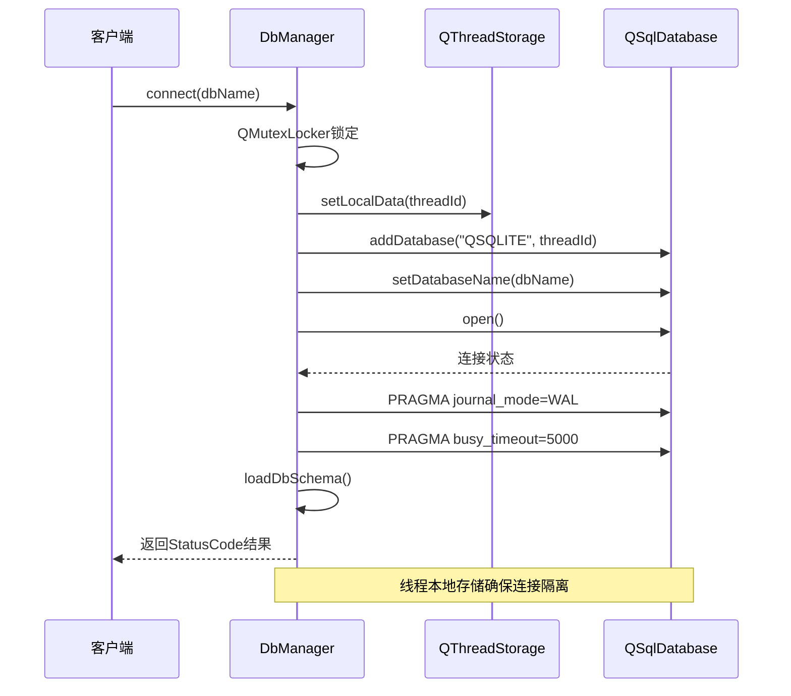

**图表来源**
- [dbmanager.cpp:51-91](file://src/dbmanager.cpp#L51-L91)

**章节来源**
- [dbmanager.h:52-216](file://src/dbmanager.h#L52-L216)
- [dbmanager.cpp:51-117](file://src/dbmanager.cpp#L51-L117)

## 架构概览

数据库管理模块采用分层架构设计，各层职责清晰分离：

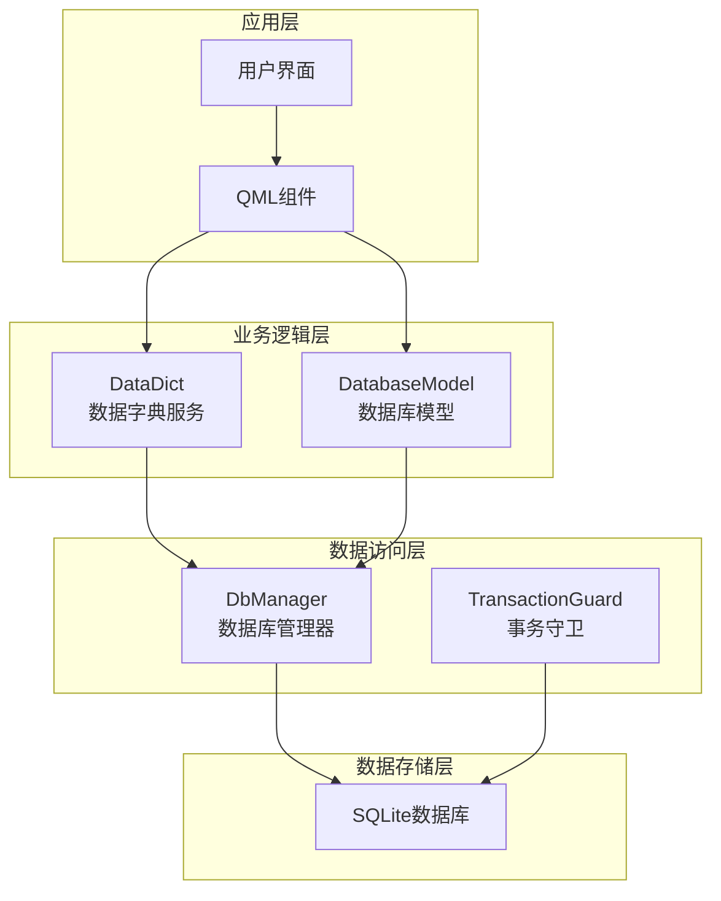

**图表来源**
- [datadict.cpp:22-85](file://src/datadict.cpp#L22-L85)
- [databasemodel.cpp:181-202](file://src/databasemodel.cpp#L181-L202)
- [dbmanager.cpp:43-49](file://src/dbmanager.cpp#L43-L49)

## 详细组件分析

### 事务处理机制

DbManager实现了RAII风格的事务守卫类，确保事务的自动管理和正确提交/回滚：

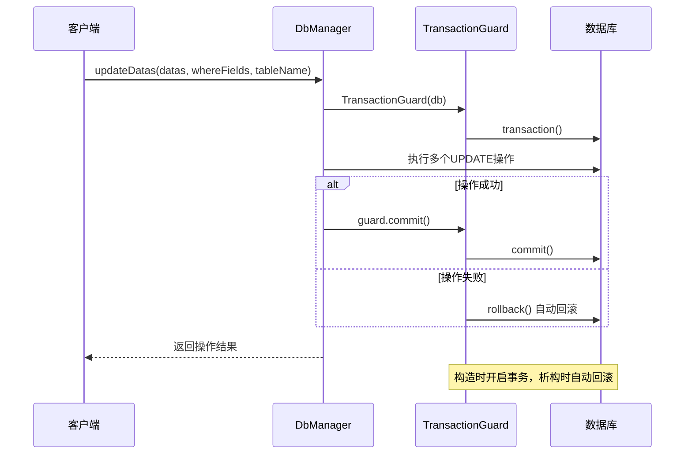

**图表来源**
- [dbmanager.cpp:16-39](file://src/dbmanager.cpp#L16-L39)
- [dbmanager.cpp:480-540](file://src/dbmanager.cpp#L480-L540)

#### 事务守卫类实现

TransactionGuard类提供了自动化的事务管理：

| 方法 | 功能 | 参数 | 返回值 |
|------|------|------|--------|
| 构造函数 | 开启数据库事务 | QSqlDatabase* | 无 |
| 析构函数 | 自动回滚未提交事务 | 无 | 无 |
| commit() | 显式提交事务 | 无 | void |
| isCommitted() | 检查事务是否已提交 | 无 | bool |

**章节来源**
- [dbmanager.h:37-50](file://src/dbmanager.h#L37-L50)
- [dbmanager.cpp:16-39](file://src/dbmanager.cpp#L16-L39)

### 数据库模式管理

**更新** DbManager实现了全新的loadDbSchema()方法，替代了旧的readTableInfo()，提供了增强的数据库模式加载和管理机制：

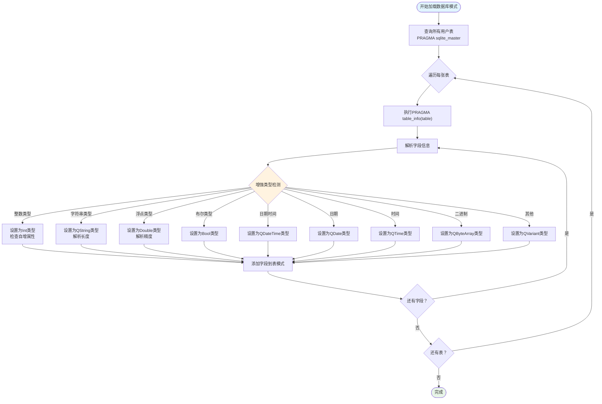

**图表来源**
- [dbmanager.cpp:226-371](file://src/dbmanager.cpp#L226-L371)

#### 字段信息结构

FieldInfo结构体定义了数据库字段的完整元数据：

| 字段名 | 类型 | 描述 | 默认值 |
|--------|------|------|--------|
| name | QString | 字段名称 | 空字符串 |
| metaType | QMetaType | Qt数据类型 | UnknownType |
| length | int | 字段长度 | 0 |
| precision | int | 数值精度 | 0 |
| defaultValue | QVariant | 默认值 | 无 |
| isAutoInc | bool | 是否自增 | false |
| isNullable | bool | 是否允许NULL | true |
| isPrimaryKey | bool | 是否主键 | false |

**章节来源**
- [dbmanager.h:62-72](file://src/dbmanager.h#L62-L72)
- [dbmanager.cpp:287-346](file://src/dbmanager.cpp#L287-L346)

### CRUD操作实现

#### 数据插入操作

DbManager提供了批量数据插入功能，支持自增字段的自动处理：

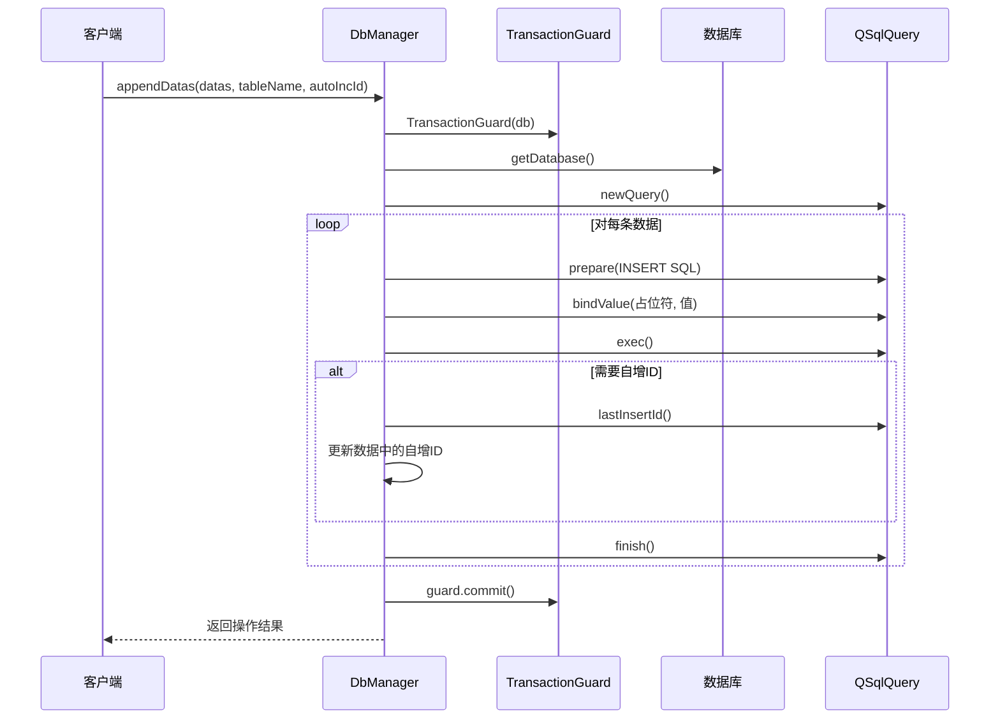

**图表来源**
- [dbmanager.cpp:542-595](file://src/dbmanager.cpp#L542-L595)

#### 数据更新操作

批量数据更新操作支持复杂条件和参数绑定：

| 操作类型 | SQL模板 | 参数绑定 | 使用场景 |
|----------|---------|----------|----------|
| 单表更新 | UPDATE table SET col1=:val1, col2=:val2 WHERE where1=:w_where1 | SET参数:valN WHERE参数:w_whereN | 标准更新操作 |
| 条件更新 | UPDATE table SET col1=:val1 WHERE condition=:condition | 动态条件参数 | 条件筛选更新 |
| 批量更新 | 循环执行多次更新 | 每次循环绑定不同参数 | 大量数据更新 |

**章节来源**
- [dbmanager.cpp:479-540](file://src/dbmanager.cpp#L479-L540)

### 数据查询机制

DbManager提供了多种数据查询方式，支持JSON格式和结构化数据：

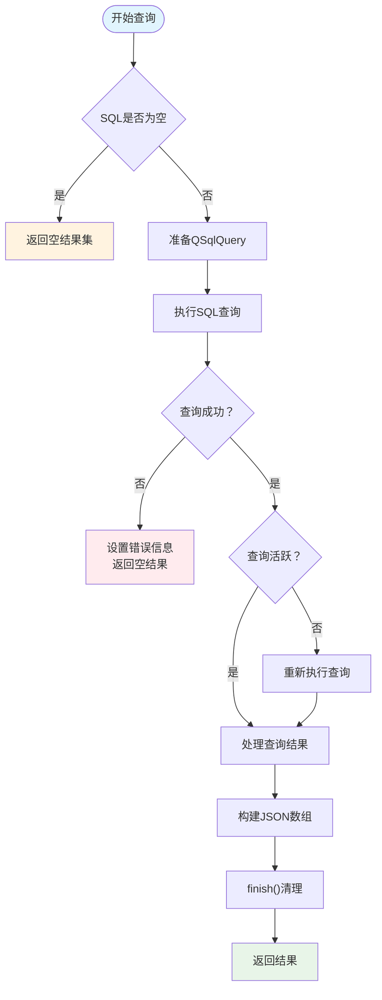

**图表来源**
- [dbmanager.cpp:397-427](file://src/dbmanager.cpp#L397-L427)

#### 结果集处理

DbManager实现了智能的结果集处理机制，支持不同类型数据的正确转换：

| 数据类型 | Qt类型 | 处理方式 | 示例 |
|----------|--------|----------|------|
| 布尔值 | QMetaType::Bool | toBool() | true/false |
| 整数值 | QMetaType::Int/UInt | toInt() | 123 |
| 长整数 | QMetaType::LongLong/ULongLong | toLongLong() | 123456789 |
| 浮点数 | QMetaType::Float/Double | toDouble() | 123.45 |
| 字符串 | QMetaType::QString | toString() | "文本" |
| 日期时间 | QMetaType::QDateTime | QVariant转换 | 2023-01-01 |
| 日期 | QMetaType::QDate | QVariant转换 | 2023-01-01 |
| 时间 | QMetaType::QTime | QVariant转换 | 12:00:00 |

**章节来源**
- [dbmanager.cpp:869-918](file://src/dbmanager.cpp#L869-L918)

### 数据字典管理

DataDict类提供了数据字典的完整CRUD操作：

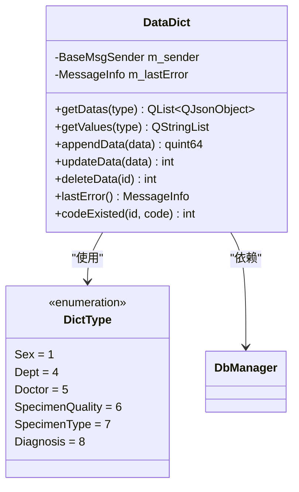

**图表来源**
- [datadict.h:30-103](file://src/datadict.h#L30-L103)
- [datadict.cpp:22-85](file://src/datadict.cpp#L22-L85)

**章节来源**
- [datadict.h:30-103](file://src/datadict.h#L30-L103)
- [datadict.cpp:22-115](file://src/datadict.cpp#L22-L115)

### 数据库模型架构

DatabaseModel和DatabaseWorker实现了线程分离的数据访问模式：

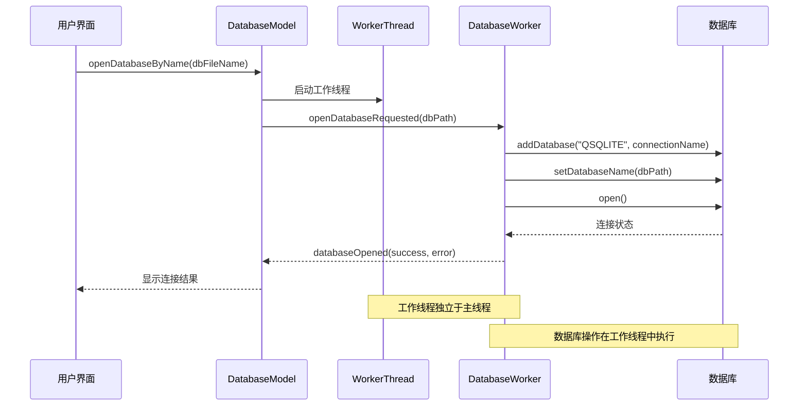

**图表来源**
- [databasemodel.cpp:16-41](file://src/databasemodel.cpp#L16-L41)
- [databasemodel.cpp:181-202](file://src/databasemodel.cpp#L181-L202)

**章节来源**
- [databasemodel.h:20-97](file://src/databasemodel.h#L20-L97)
- [databasemodel.cpp:16-179](file://src/databasemodel.cpp#L16-L179)

## 依赖关系分析

数据库管理模块的依赖关系图：

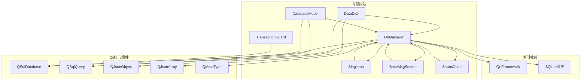

**图表来源**
- [dbmanager.h:17-30](file://src/dbmanager.h#L17-L30)
- [datadict.h:17-21](file://src/datadict.h#L17-L21)
- [databasemodel.h:4-18](file://src/databasemodel.h#L4-L18)

**章节来源**
- [dbmanager.h:17-30](file://src/dbmanager.h#L17-L30)
- [datadict.h:17-21](file://src/datadict.h#L17-L21)
- [databasemodel.h:4-18](file://src/databasemodel.h#L4-L18)

## 性能考虑

### 连接池管理

DbManager采用了线程本地存储的连接管理模式，避免了传统连接池的复杂性：

1. **线程隔离**：每个线程拥有独立的数据库连接，避免锁竞争
2. **自动清理**：线程结束时自动释放数据库连接
3. **连接复用**：同一线程内的多次操作复用同一个连接

### 事务优化

1. **批量操作**：通过TransactionGuard实现批量事务，减少事务开销
2. **原子性保证**：所有批量操作在单个事务中执行，确保数据一致性
3. **自动回滚**：异常情况下自动回滚，避免部分更新

### 查询优化

1. **预编译语句**：使用QSqlQuery.prepare()预编译SQL语句，提高执行效率
2. **参数绑定**：使用绑定变量避免SQL注入，同时提升性能
3. **结果集缓存**：合理使用finish()方法释放查询资源

### SQLite特定优化

1. **WAL模式**：启用Write-Ahead Logging模式，提升并发性能
2. **busy_timeout**：设置5秒超时，避免频繁的锁冲突
3. **PRAGMA优化**：根据需要调整SQLite参数

## 故障排除指南

### 状态码系统

**更新** 状态码系统已从ErrorCode重命名为StatusCode，提供了更清晰的错误分类：

| 状态码 | 错误类型 | 可能原因 | 解决方案 |
|--------|----------|----------|----------|
| Success | 成功 | 操作成功完成 | 无需处理 |
| InvalidParameter | 参数错误 | 参数无效或缺失 | 检查输入参数 |
| DbOpenFailed | 数据库打开失败 | 文件路径错误、权限问题 | 检查文件路径和权限 |
| DbExecuteFailed | SQL执行失败 | SQL语法错误、表不存在 | 检查SQL语句和表结构 |
| DbBackupFailed | 备份失败 | 文件权限不足、磁盘空间不足 | 检查权限和磁盘空间 |
| DbRecoverFailed | 恢复失败 | 源文件损坏、备份文件错误 | 验证备份文件完整性 |
| DbConnectionLost | 连接丢失 | 网络中断、数据库崩溃 | 重新建立连接 |
| DbTableNotFound | 表不存在 | 表名拼写错误、数据库版本问题 | 检查表名和数据库版本 |
| TypeConvFailed | 类型转换失败 | 数据类型不匹配 | 检查字段类型和数据格式 |

### 错误处理机制

DbManager实现了完善的错误处理机制：

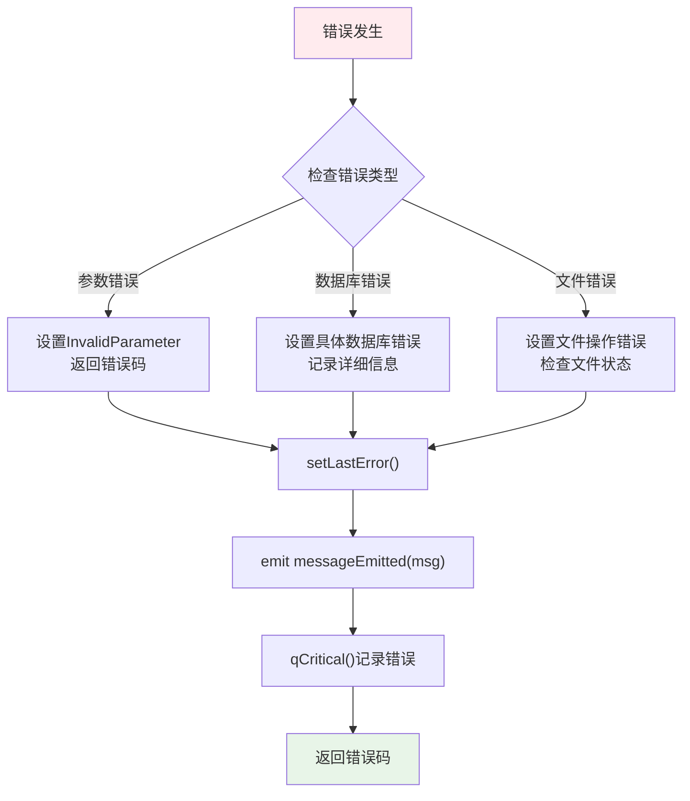

**图表来源**
- [dbmanager.cpp:951-974](file://src/dbmanager.cpp#L951-L974)

### 调试和监控

1. **调试输出**：loadDbSchema()方法包含详细的调试输出
2. **错误追踪**：takeLastError()方法提供线程级别的错误追踪
3. **性能监控**：关键操作包含执行时间统计

**章节来源**
- [common.h:66-124](file://src/common.h#L66-L124)
- [dbmanager.cpp:951-974](file://src/dbmanager.cpp#L951-L974)

## 结论

数据库管理模块是一个设计精良的Qt数据库访问层，经过重构后具有以下特点：

1. **架构清晰**：采用分层设计，职责分离明确
2. **线程安全**：通过线程本地存储确保并发安全
3. **功能完整**：提供完整的CRUD操作和事务管理
4. **错误处理**：完善的错误处理和日志记录机制，使用新的StatusCode系统
5. **性能优化**：针对SQLite进行了专门的性能优化
6. **增强的schema解析**：新的loadDbSchema()方法提供了更强大的数据库模式管理能力

**更新** 该模块现已重构，新的loadDbSchema()方法替代了旧的readTableInfo()，提供了增强的数据库schema解析和类型检测功能，状态码系统也已更新为StatusCode，提供了更清晰的错误分类和处理机制。

该模块为上层应用提供了稳定可靠的数据库访问接口，支持数据字典管理和表格数据操作，是整个应用程序数据层的核心组件。