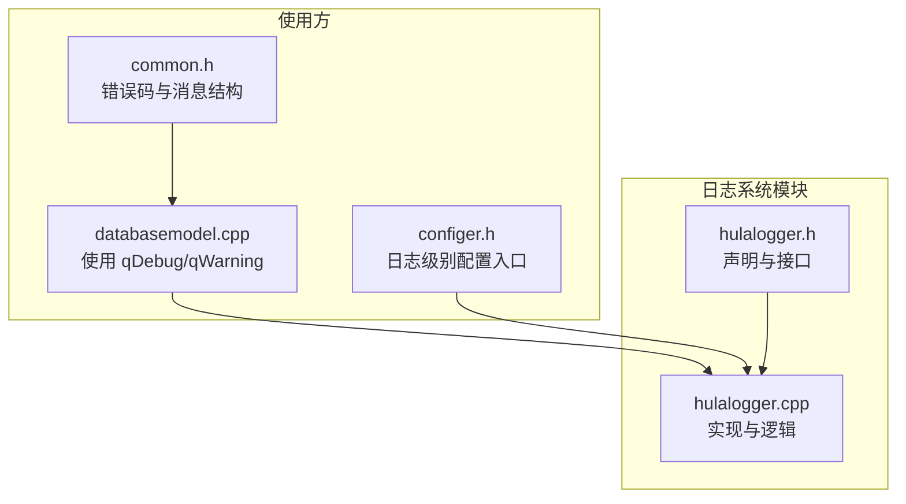
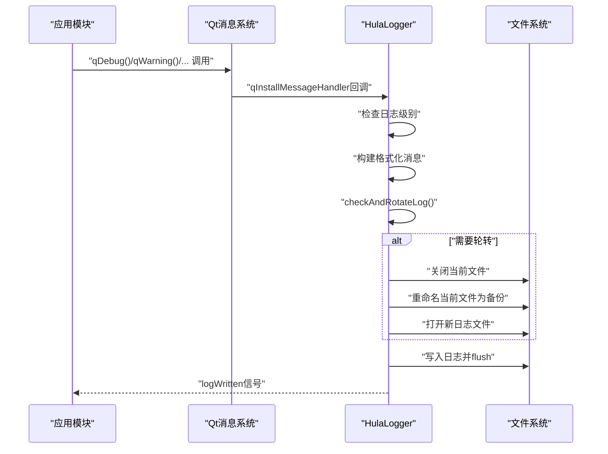
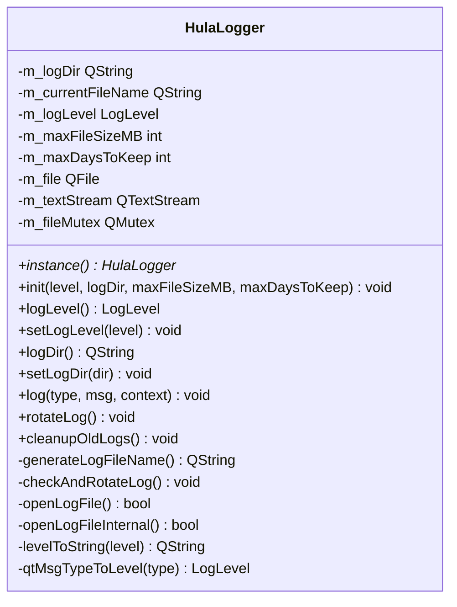
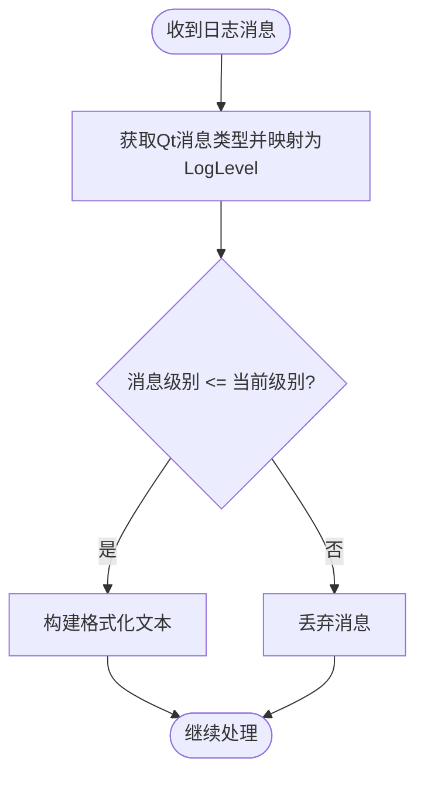
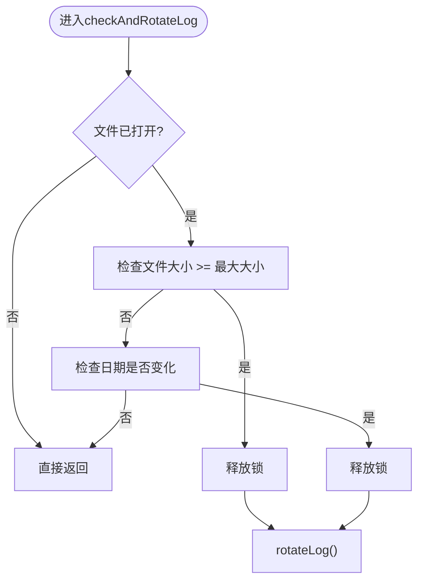
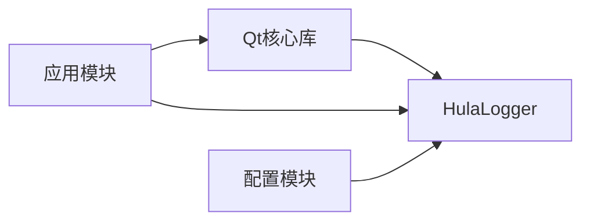

# 日志系统模块

<cite>
**本文档引用的文件**
- [hulalogger.h](file://src/hulalogger.h)
- [hulalogger.cpp](file://src/hulalogger.cpp)
- [common.h](file://src/common.h)
- [configer.h](file://src/configer.h)
- [databasemodel.cpp](file://src/databasemodel.cpp)
- [README.md](file://README.md)
</cite>

## 目录
1. [简介](#简介)
2. [项目结构](#项目结构)
3. [核心组件](#核心组件)
4. [架构概览](#架构概览)
5. [详细组件分析](#详细组件分析)
6. [依赖关系分析](#依赖关系分析)
7. [性能考虑](#性能考虑)
8. [故障排除指南](#故障排除指南)
9. [结论](#结论)
10. [附录](#附录)

## 简介
本文件为日志系统模块的全面技术文档，重点围绕 HulaLogger 类展开，详细说明其日志记录机制、多级别日志处理与文件管理功能。文档涵盖以下关键主题：
- 日志级别定义与过滤机制
- 日志格式化规则与输出目标配置
- 日志轮转机制、文件大小限制与过期清理策略
- 性能优化、线程安全与异步写入建议
- API 使用示例与配置选项
- 生产环境优化与调试模式差异
- 日志分析工具、搜索功能与监控集成方案

该日志系统基于 Qt 框架，采用单例模式、线程安全设计，并通过安装 Qt 消息处理器实现对应用内所有日志输出的统一拦截与处理。

## 项目结构
日志系统位于 src 目录下，核心文件为 hulalogger.h 和 hulalogger.cpp；同时在其他模块中广泛使用 Qt 的 qDebug/qWarning/qDebug 等宏进行日志输出，这些输出最终会被 HulaLogger 统一接管。

图表来源
- [hulalogger.h:1-175](file://src/hulalogger.h#L1-L175)
- [hulalogger.cpp:1-331](file://src/hulalogger.cpp#L1-L331)
- [databasemodel.cpp:33-333](file://src/databasemodel.cpp#L33-L333)
- [configer.h:132-134](file://src/configer.h#L132-L134)
- [common.h:63-117](file://src/common.h#L63-L117)

章节来源
- [README.md:1-50](file://README.md#L1-L50)
- [hulalogger.h:1-175](file://src/hulalogger.h#L1-L175)
- [hulalogger.cpp:1-331](file://src/hulalogger.cpp#L1-L331)

## 核心组件
- HulaLogger：日志系统核心类，提供单例实例、初始化、级别控制、目录配置、日志写入、轮转与过期清理等能力。
- 日志级别枚举 LogLevel：定义 Fatal、Critical、Warning、Info、Debug 五个级别，用于过滤日志输出。
- Qt 消息处理器：通过 qInstallMessageHandler 将所有 Qt 日志输出重定向至 HulaLogger::log。
- 文件管理：负责日志文件的打开、写入、轮转与过期删除，支持按大小与日期的轮转策略。

章节来源
- [hulalogger.h:25-34](file://src/hulalogger.h#L25-L34)
- [hulalogger.h:49-167](file://src/hulalogger.h#L49-L167)
- [hulalogger.cpp:45-79](file://src/hulalogger.cpp#L45-L79)
- [hulalogger.cpp:118-172](file://src/hulalogger.cpp#L118-L172)

## 架构概览
HulaLogger 作为统一日志入口，通过安装 Qt 消息处理器拦截所有日志输出，依据当前日志级别决定是否写入，随后根据文件大小或日期变化触发轮转，并将消息写入当前日志文件。同时提供清理过期日志的能力。

图表来源
- [hulalogger.cpp:75-78](file://src/hulalogger.cpp#L75-L78)
- [hulalogger.cpp:118-172](file://src/hulalogger.cpp#L118-L172)
- [hulalogger.cpp:245-268](file://src/hulalogger.cpp#L245-L268)
- [hulalogger.cpp:174-217](file://src/hulalogger.cpp#L174-L217)

## 详细组件分析

### HulaLogger 类设计与职责
- 单例模式：通过静态 instance() 获取唯一实例，确保全局一致性。
- 线程安全：使用 QMutex 保护文件打开/写入与轮转过程，避免并发冲突。
- 配置项：日志目录、最大文件大小（MB）、保留天数、当前日志级别。
- 信号：logLevelChanged、logDirChanged、logWritten，便于 UI 或上层模块监听。

图表来源
- [hulalogger.h:49-167](file://src/hulalogger.h#L49-L167)

章节来源
- [hulalogger.h:49-167](file://src/hulalogger.h#L49-L167)
- [hulalogger.cpp:23-35](file://src/hulalogger.cpp#L23-L35)

### 日志级别与过滤机制
- 级别枚举：Fatal、Critical、Warning、Info、Debug，数值越小级别越高。
- Qt 消息类型映射：将 QtMsgType 映射为 LogLevel，用于统一过滤。
- 过滤策略：若消息级别高于当前设置，则直接丢弃，避免不必要的 IO。

图表来源
- [hulalogger.cpp:124-128](file://src/hulalogger.cpp#L124-L128)
- [hulalogger.cpp:312-321](file://src/hulalogger.cpp#L312-L321)

章节来源
- [hulalogger.h:25-34](file://src/hulalogger.h#L25-L34)
- [hulalogger.cpp:312-321](file://src/hulalogger.cpp#L312-L321)

### 日志格式化规则
- 调试模式（QT_DEBUG）：包含级别、时间戳、文件名、行号、函数名。
- 发布模式：包含级别与时间戳，简洁明了。
- 时间戳格式：年-月-日 时:分:秒.毫秒。

章节来源
- [hulalogger.cpp:134-148](file://src/hulalogger.cpp#L134-L148)

### 输出目标与消息处理器
- 通过 qInstallMessageHandler 安装全局消息处理器，拦截所有 Qt 日志输出。
- 回调中调用 HulaLogger::instance()->log，完成统一处理。
- 初始化阶段先输出一条控制台信息，避免递归调用。

章节来源
- [hulalogger.cpp:75-78](file://src/hulalogger.cpp#L75-L78)
- [hulalogger.cpp:66-73](file://src/hulalogger.cpp#L66-L73)

### 文件管理与轮转机制
- 按大小轮转：当当前文件大小达到阈值（MB）时触发轮转。
- 按日期轮转：当日志文件日期变化时触发轮转。
- 轮转流程：关闭当前文件 → 查找现有备份最大序号 → 重命名当前文件为最新备份 → 打开新日志文件。
- 备份命名：基于日期的主文件名 + “.” + 序号，例如 20250401.log.1。
- 线程安全：轮转过程中使用 tryLock 避免死锁，必要时释放锁再调用 rotateLog。

图表来源
- [hulalogger.cpp:245-268](file://src/hulalogger.cpp#L245-L268)
- [hulalogger.cpp:174-217](file://src/hulalogger.cpp#L174-L217)

章节来源
- [hulalogger.cpp:241-243](file://src/hulalogger.cpp#L241-L243)
- [hulalogger.cpp:174-217](file://src/hulalogger.cpp#L174-L217)
- [hulalogger.cpp:245-268](file://src/hulalogger.cpp#L245-L268)

### 过期清理策略
- 清理规则：删除超过保留天数且扩展名为 .log 或 .log.* 的文件。
- 触发时机：初始化时自动清理一次，避免历史垃圾文件积累。

章节来源
- [hulalogger.cpp:219-239](file://src/hulalogger.cpp#L219-L239)

### API 使用示例与最佳实践
- 初始化与配置
  - 通过 init(level, logDir, maxFileSizeMB, maxDaysToKeep) 完成初始化。
  - 可通过 setLogLevel 与 setLogDir 动态调整级别与目录。
  - 信号 logWritten 可用于 UI 或外部系统订阅日志事件。
- 在应用各模块中使用 Qt 日志宏
  - 示例：数据库模块使用 qDebug()/qWarning() 输出信息，这些都会被 HulaLogger 统一处理。
- 配置入口
  - 配置模块提供 setLogLevel(int) 接口，可从 UI 或配置文件读取并设置日志级别。

章节来源
- [hulalogger.h:60-110](file://src/hulalogger.h#L60-L110)
- [hulalogger.cpp:45-79](file://src/hulalogger.cpp#L45-L79)
- [databasemodel.cpp:33-333](file://src/databasemodel.cpp#L33-L333)
- [configer.h:132-134](file://src/configer.h#L132-L134)

### 调试模式与生产环境优化
- 调试模式（QT_DEBUG）：输出更详细的上下文信息（文件、行号、函数），便于定位问题。
- 发布模式：输出精简信息，减少冗余字段，降低 IO 压力。
- 控制台输出：调试模式下同时输出到标准控制台，便于本地开发观察。

章节来源
- [hulalogger.cpp:136-148](file://src/hulalogger.cpp#L136-L148)
- [hulalogger.cpp:166-169](file://src/hulalogger.cpp#L166-L169)

## 依赖关系分析
- 对 Qt 的依赖：QFile、QTextStream、QMutex、QDateTime、QDir、QLoggingCategory、qInstallMessageHandler。
- 对应用模块的依赖：通过全局消息处理器间接依赖所有使用 qDebug/qWarning 等宏的模块。
- 对配置模块的依赖：配置模块提供日志级别的设置入口，便于 UI 或配置文件驱动。

图表来源
- [hulalogger.cpp:1-15](file://src/hulalogger.cpp#L1-L15)
- [configer.h:132-134](file://src/configer.h#L132-L134)

章节来源
- [hulalogger.cpp:1-15](file://src/hulalogger.cpp#L1-L15)
- [configer.h:132-134](file://src/configer.h#L132-L134)

## 性能考虑
- 线程安全与锁粒度：使用 QMutex 保护文件操作，避免并发写入冲突；轮转时采用 tryLock 并在必要时释放锁，防止死锁。
- 异步写入建议：当前实现为同步写入，建议在高吞吐场景下引入队列与后台线程，以减少主线程阻塞。
- 缓冲区管理：使用 QTextStream 默认缓冲策略；可根据需要调用 flush 保证及时落盘，但频繁 flush 会影响性能。
- 文件大小与轮转：合理设置 maxFileSizeMB 与 maxDaysToKeep，平衡磁盘占用与查询效率。
- IO 开销：避免在热路径中产生大量日志，结合日志级别过滤减少 IO。

## 故障排除指南
- 无法打开日志文件
  - 现象：控制台输出“Failed to open log file”错误。
  - 原因：权限不足、磁盘空间不足、路径不存在或被占用。
  - 处理：检查日志目录权限与可用空间，确认路径正确并关闭可能占用文件的进程。
- 日志轮转失败
  - 现象：轮转后新文件未创建或旧文件未重命名。
  - 原因：文件被其他进程占用、磁盘只读、权限不足。
  - 处理：释放文件占用、检查磁盘权限与状态。
- 过期清理未生效
  - 现象：超过保留天数的日志未被删除。
  - 原因：目录不存在、文件名匹配规则不符。
  - 处理：确认日志目录存在且文件扩展名符合 *.log 或 *.log.*。
- 递归调用导致死循环
  - 现象：使用 qDebug() 导致日志系统自身被再次触发。
  - 处理：避免在日志处理逻辑中使用 qDebug()，改用 std::cout/std::cerr 输出诊断信息。

章节来源
- [hulalogger.cpp:283-288](file://src/hulalogger.cpp#L283-L288)
- [hulalogger.cpp:90-90](file://src/hulalogger.cpp#L90-L90)
- [hulalogger.cpp:114-114](file://src/hulalogger.cpp#L114-L114)
- [hulalogger.cpp:234-237](file://src/hulalogger.cpp#L234-L237)

## 结论
HulaLogger 提供了稳定、线程安全的日志基础设施，具备完善的轮转与清理机制，能够满足开发与生产的双重需求。通过合理的配置与使用，可在保证可观测性的同时兼顾性能与可靠性。建议在生产环境中结合异步写入与缓冲策略进一步提升吞吐能力，并配合监控与日志分析工具实现自动化运维。

## 附录

### 日志级别与对应 Qt 消息类型
- Fatal ↔ QtFatalMsg
- Critical ↔ QtCriticalMsg
- Warning ↔ QtWarningMsg
- Info ↔ QtInfoMsg
- Debug ↔ QtDebugMsg

章节来源
- [hulalogger.cpp:312-321](file://src/hulalogger.cpp#L312-L321)

### 配置选项一览
- 日志级别：Fatal/Critical/Warning/Info/Debug
- 日志目录：默认为应用目录下的 Log 文件夹，可通过 setLogDir 动态修改
- 单个文件最大大小：单位 MB，默认 10MB
- 日志保留天数：默认 30 天

章节来源
- [hulalogger.h:60-70](file://src/hulalogger.h#L60-L70)
- [hulalogger.cpp:45-48](file://src/hulalogger.cpp#L45-L48)

### 日志分析与监控集成建议
- 日志分析工具：使用正则表达式提取级别、时间戳与上下文信息，结合日志聚合平台（如 ELK/Fluentd）进行集中存储与检索。
- 搜索功能：基于时间范围、级别、关键字（如文件名、函数名）进行过滤查询。
- 监控集成：订阅 logWritten 信号，将关键错误（Critical/Fatal）实时上报至监控系统，触发告警。

章节来源
- [hulalogger.h:107-110](file://src/hulalogger.h#L107-L110)