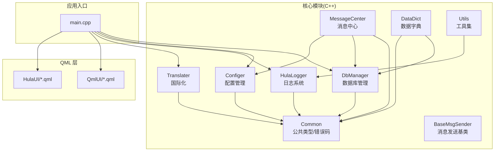
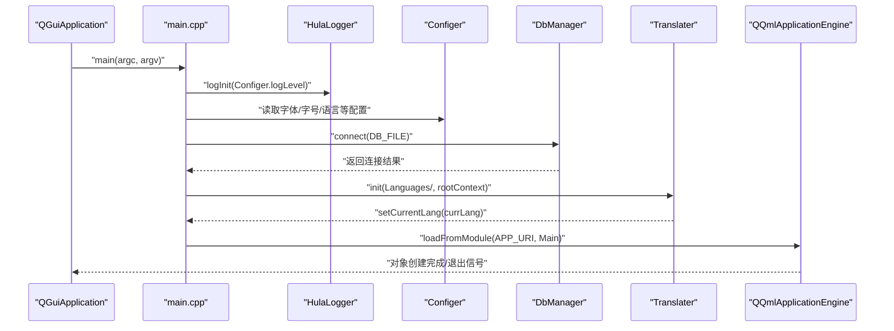
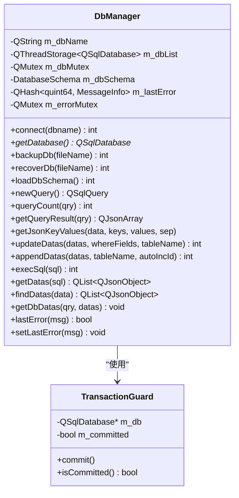
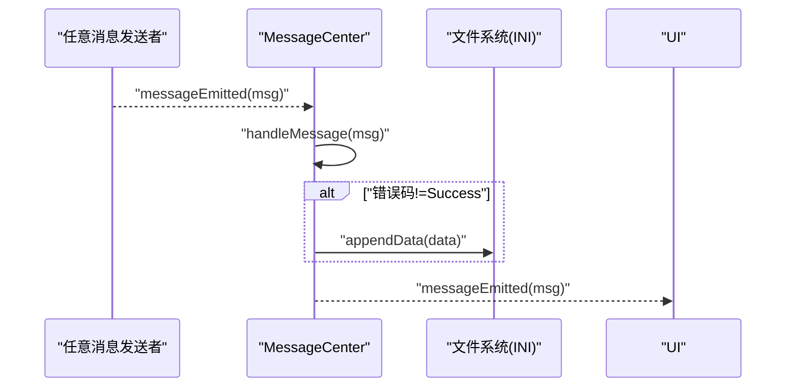
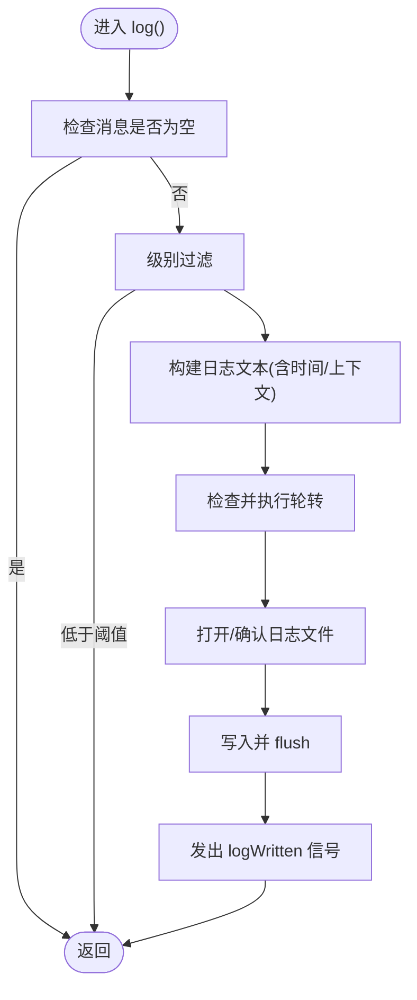
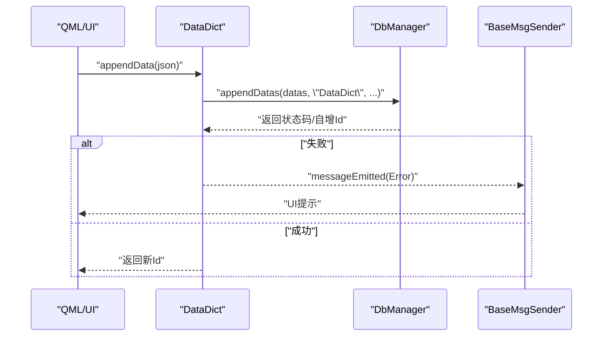
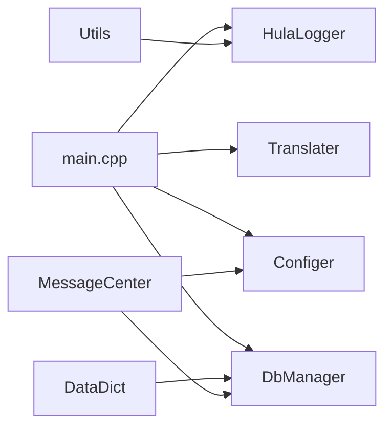

# 核心模块

<cite>
**本文引用的文件**
- [dbmanager.h](file://src/dbmanager.h)
- [dbmanager.cpp](file://src/dbmanager.cpp)
- [configer.h](file://src/configer.h)
- [configer.cpp](file://src/configer.cpp)
- [messagecenter.h](file://src/messagecenter.h)
- [messagecenter.cpp](file://src/messagecenter.cpp)
- [hulalogger.h](file://src/hulalogger.h)
- [hulalogger.cpp](file://src/hulalogger.cpp)
- [datadict.h](file://src/datadict.h)
- [datadict.cpp](file://src/datadict.cpp)
- [translater.h](file://src/translater.h)
- [translater.cpp](file://src/translater.cpp)
- [basemsgsender.h](file://src/basemsgsender.h)
- [common.h](file://src/common.h)
- [utils.h](file://src/utils.h)
- [utils.cpp](file://src/utils.cpp)
- [main.cpp](file://src/main.cpp)
- [README.md](file://README.md)
</cite>

## 目录
1. [简介](#简介)
2. [项目结构](#项目结构)
3. [核心组件](#核心组件)
4. [架构总览](#架构总览)
5. [详细组件分析](#详细组件分析)
6. [依赖分析](#依赖分析)
7. [性能考虑](#性能考虑)
8. [故障排查指南](#故障排查指南)
9. [结论](#结论)
10. [附录](#附录)

## 简介
本文件针对 QmlPlugins 项目的 C++ 核心模块进行系统化文档说明，涵盖数据库管理、配置管理、消息中心、日志系统、国际化、用户与数据字典等模块。文档从设计目的、实现原理、API 接口、数据交互模式、错误处理机制等方面展开，并结合实际代码文件定位，提供模块间依赖关系图、调用序列图与流程图，帮助开发者快速理解与正确使用和扩展这些模块。

## 项目结构
项目采用 Qt6/QML 跨平台架构，核心 C++ 模块位于 src 目录，包含数据库、配置、消息、日志、国际化、工具与入口程序等模块；QML 界面与自定义组件位于 src/QmlUI 与 src/HulaUI；资源文件（图片、语言、配置、启动画面等）位于 resources 与 bin 目录。

图表来源
- [main.cpp:17-99](file://src/main.cpp#L17-L99)
- [dbmanager.h:52-192](file://src/dbmanager.h#L52-L192)
- [configer.h:98-277](file://src/configer.h#L98-L277)
- [messagecenter.h:27-127](file://src/messagecenter.h#L27-L127)
- [hulalogger.h:49-175](file://src/hulalogger.h#L49-L175)
- [translater.h:27-112](file://src/translater.h#L27-L112)
- [datadict.h:30-103](file://src/datadict.h#L30-L103)
- [utils.h:21-82](file://src/utils.h#L21-L82)
- [common.h:19-159](file://src/common.h#L19-L159)
- [basemsgsender.h:10-38](file://src/basemsgsender.h#L10-L38)

章节来源
- [README.md:1-50](file://README.md#L1-L50)
- [main.cpp:17-99](file://src/main.cpp#L17-L99)

## 核心组件
本节对各核心模块进行概览性介绍，包括职责边界、关键能力与典型使用场景。

- 数据库管理（DbManager）
  - 单例线程安全数据库访问，SQLite 驱动，WAL 模式与 busy_timeout 配置，提供事务守卫、备份/恢复、Schema 缓存、JSON 结果转换等能力。
- 配置管理（Configer）
  - QML 可访问的单例配置类，INI 文件读写，集中管理应用配置项（语言、主题、窗口模式、相机参数、报表模板等）。
- 消息中心（MessageCenter）
  - 基于文件的错误信息收集与分发，统一接收来自系统组件的消息并转发至 UI；提供查询、删除、新增与“今日是否有新信息”判断。
- 日志系统（HulaLogger）
  - 面向对象的日志系统，支持级别控制、线程安全、日志轮转（按大小/日期）、过期清理、QML 属性绑定与信号通知。
- 国际化（Translater）
  - 基于 QTranslator 的多语言加载与切换，INI 语言文件解析，QML 上下文注册，动态重翻译。
- 数据字典（DataDict）
  - 面向业务的数据字典 CRUD，基于 DbManager 的通用插入/更新/删除封装，提供类型枚举与 QML 友好接口。
- 工具集（Utils）
  - 目录/文件操作工具，含复制、条件更新、目录同步、获取最新修改时间等，集成日志记录。
- 消息与错误码（BaseMsgSender、Common）
  - 统一消息发射信号与错误码/提示类型枚举，贯穿各模块以保证一致的错误处理与 UI 提示。

章节来源
- [dbmanager.h:52-192](file://src/dbmanager.h#L52-L192)
- [configer.h:98-277](file://src/configer.h#L98-L277)
- [messagecenter.h:27-127](file://src/messagecenter.h#L27-L127)
- [hulalogger.h:49-175](file://src/hulalogger.h#L49-L175)
- [translater.h:27-112](file://src/translater.h#L27-L112)
- [datadict.h:30-103](file://src/datadict.h#L30-L103)
- [utils.h:21-82](file://src/utils.h#L21-L82)
- [basemsgsender.h:10-38](file://src/basemsgsender.h#L10-L38)
- [common.h:19-159](file://src/common.h#L19-L159)

## 架构总览
下图展示应用启动到模块初始化的关键流程，以及模块之间的耦合关系与消息流向。

图表来源
- [main.cpp:32-58](file://src/main.cpp#L32-L58)
- [hulalogger.cpp:45-79](file://src/hulalogger.cpp#L45-L79)
- [configer.cpp:42-60](file://src/configer.cpp#L42-L60)
- [dbmanager.cpp:51-90](file://src/dbmanager.cpp#L51-L90)
- [translater.cpp:24-37](file://src/translater.cpp#L24-L37)

## 详细组件分析

### 数据库管理（DbManager）
- 设计目的
  - 提供线程安全、事务保障、Schema 缓存与统一错误处理的数据库访问层，屏蔽 SQLite 细节，向上提供 QML 友好的数据接口。
- 关键实现
  - 线程本地数据库连接（QThreadStorage），WAL 模式与 busy_timeout，事务守卫（RAII），Schema 缓存（PRAGMA table_info），JSON 结果转换。
  - 提供备份/恢复、批量插入/更新、通用 SQL 执行、条件查询（findDatas）等接口。
- API 与使用要点
  - 连接与获取：connect()/getDatabase()
  - 事务：TransactionGuard（构造开启，析构回滚，commit 提交）
  - 备份/恢复：backupDb()/recoverDb()
  - 查询：newQuery()/getDatas()/findDatas()/queryCount()/getQueryResult()
  - 写入：appendDatas()/updateDatas()/execSql()
  - 错误：lastError()/setLastError()，并发出 messageEmitted 信号
- 错误处理与最佳实践
  - 所有数据库操作均通过 DbManager 统一错误上报，避免分散的 qCritical。
  - 使用事务守卫确保批量写入一致性；对可能失败的 SQL 统一检查返回值。
  - Schema 缓存减少重复 PRAGMA 查询，提高性能。
- 依赖关系
  - 依赖 common.h 的错误码与消息结构体；依赖 configer.h 的 DB_FILE 宏；依赖 singleton.h（通过 SINGLETON 宏）。

图表来源
- [dbmanager.h:37-192](file://src/dbmanager.h#L37-L192)
- [dbmanager.cpp:14-49](file://src/dbmanager.cpp#L14-L49)

章节来源
- [dbmanager.h:52-192](file://src/dbmanager.h#L52-L192)
- [dbmanager.cpp:51-90](file://src/dbmanager.cpp#L51-L90)
- [dbmanager.cpp:118-223](file://src/dbmanager.cpp#L118-L223)
- [dbmanager.cpp:225-351](file://src/dbmanager.cpp#L225-L351)
- [dbmanager.cpp:353-407](file://src/dbmanager.cpp#L353-L407)
- [dbmanager.cpp:438-554](file://src/dbmanager.cpp#L438-L554)
- [dbmanager.cpp:556-600](file://src/dbmanager.cpp#L556-L600)
- [dbmanager.cpp:602-700](file://src/dbmanager.cpp#L602-L700)
- [dbmanager.cpp:719-768](file://src/dbmanager.cpp#L719-L768)
- [dbmanager.cpp:770-794](file://src/dbmanager.cpp#L770-L794)

### 配置管理（Configer）
- 设计目的
  - 为应用提供集中化的配置读写能力，支持 INI 文件、分组与键值管理，暴露 QML 单例接口。
- 关键实现
  - QML_ELEMENT/QML_SINGLETON 注册；readValue()/writeValue() 封装 QSettings；大量 getter/setter 对外提供配置项。
  - 路径宏（LANG_PATH、RES_PATH、DB_FILE、CFG_FILE 等）统一资源定位。
- API 与使用要点
  - 用户相关：userName()/setUserName()、userAccount()/setUserAccount()
  - 视图与界面：theme()/setTheme()、enableSplash()/setEnableSplash()、mainFormShowMode()/setMainFormShowMode() 等
  - 语言与字体：currLanguage()/setCurrLanguage()、fontName()/setFontName()、fontSize()/setFontSize()
  - 相机与报表：cameraName()/setCameraName()、reportTemplateList()、reportTemplate()/setReportTemplate() 等
- 错误处理与最佳实践
  - 所有读写通过 QSettings INI 格式，注意分组与键名一致性；对布尔值以 0/1 存储。
  - 配置变更可通过信号通知（如 changedBool）驱动 UI 更新。
- 依赖关系
  - 依赖 common.h 的宏定义（如 DATE_FMT、TIME_FMT）；依赖 singleton.h（通过 SINGLETON 宏）。

章节来源
- [configer.h:98-277](file://src/configer.h#L98-L277)
- [configer.cpp:42-421](file://src/configer.cpp#L42-L421)

### 消息中心（MessageCenter）
- 设计目的
  - 统一收集系统错误信息，按日期文件存储，提供查询、删除与“是否有新信息”的判断，并将消息转发给 UI。
- 关键实现
  - 基于 QSettings 的 Ini 文件存储（ErrorInfo/yyyyMMdd.txt），线程安全（QMutex）。
  - handleMessage() 在收到非成功错误码时写入文件并发出 messageEmitted 信号。
  - 提供 getDatas()/deleteData()/deleteAllData()/hasNewInfo()/appendData()。
- API 与使用要点
  - connectRecv()/disconnectRecv() 模板方法用于连接任意具备 messageEmitted 信号的对象。
  - 日期参数为空时默认当天；支持按 Id 删除与清空当日。
- 错误处理与最佳实践
  - 仅在错误码非成功时落盘，避免冗余日志；使用互斥锁保证并发安全。
- 依赖关系
  - 依赖 common.h 的错误码与时间格式宏；依赖 DbManager（间接）用于统一消息发射；依赖 Configer 获取用户信息。

图表来源
- [messagecenter.h:89-118](file://src/messagecenter.h#L89-L118)
- [messagecenter.cpp:101-118](file://src/messagecenter.cpp#L101-L118)

章节来源
- [messagecenter.h:27-127](file://src/messagecenter.h#L27-L127)
- [messagecenter.cpp:27-118](file://src/messagecenter.cpp#L27-L118)

### 日志系统（HulaLogger）
- 设计目的
  - 替代全局日志函数，提供线程安全、可轮转、可清理、可配置级别的日志系统，支持 QML 属性绑定与信号通知。
- 关键实现
  - 单例（静态实例+互斥锁），支持 init() 初始化级别、目录、文件大小与保留天数。
  - 自动轮转（按大小与日期），过期清理，QTextStream 写入，qInstallMessageHandler 接管 Qt 日志。
  - Q_PROPERTY 暴露 logLevel/logDir，信号 logLevelChanged/logDirChanged/logWritten。
- API 与使用要点
  - init()/setLogLevel()/setLogDir()/rotateLog()/cleanupOldLogs()
  - log() 内部根据级别过滤与写入，线程安全。
- 错误处理与最佳实践
  - 文件打开失败通过标准错误输出，避免递归调用；轮转时避免死锁。
- 依赖关系
  - 依赖 common.h 的日志级别枚举；依赖 QGuiApplication 获取应用目录。

图表来源
- [hulalogger.cpp:118-172](file://src/hulalogger.cpp#L118-L172)
- [hulalogger.cpp:245-268](file://src/hulalogger.cpp#L245-L268)
- [hulalogger.cpp:296-299](file://src/hulalogger.cpp#L296-L299)

章节来源
- [hulalogger.h:49-175](file://src/hulalogger.h#L49-L175)
- [hulalogger.cpp:45-79](file://src/hulalogger.cpp#L45-L79)
- [hulalogger.cpp:118-172](file://src/hulalogger.cpp#L118-L172)
- [hulalogger.cpp:174-217](file://src/hulalogger.cpp#L174-L217)
- [hulalogger.cpp:219-239](file://src/hulalogger.cpp#L219-L239)
- [hulalogger.cpp:245-268](file://src/hulalogger.cpp#L245-L268)
- [hulalogger.cpp:296-299](file://src/hulalogger.cpp#L296-L299)

### 国际化（Translater）
- 设计目的
  - 提供多语言加载与切换能力，INI 语言文件解析，QML 上下文注册，动态重翻译。
- 关键实现
  - loadFolder()/load()/reLoadFolder() 加载语言文件；setCurrentLang() 切换语言并触发重翻译。
  - Q_PROPERTY 暴露 currentLang/languages/change，信号 currentLangChanged/languagesChanged/langLoaded/folderLoaded。
- API 与使用要点
  - init(folder, ctx) 安装翻译器并注册到 QML；trans() 提供便捷翻译接口。
- 错误处理与最佳实践
  - 语言列表排序将“简体中文”置于首位；读写锁保护翻译表并发访问。
- 依赖关系
  - 依赖 QSettings/QLocale/QQmlContext/QJson 等 Qt 组件。

章节来源
- [translater.h:27-112](file://src/translater.h#L27-L112)
- [translater.cpp:24-146](file://src/translater.cpp#L24-L146)

### 数据字典（DataDict）
- 设计目的
  - 为业务提供数据字典的增删改查能力，统一错误上报并通过消息中心对外广播。
- 关键实现
  - 通过 DbManager 的通用接口实现 CRUD；提供 DictType 枚举与 QML 友好接口（getDatas/getValues/appendData/updateData/deleteData/codeExisted）。
  - 内部聚合 BaseMsgSender 以转发消息。
- API 与使用要点
  - getDatas()/getValues() 返回 Json/字符串列表；appendData()/updateData()/deleteData() 返回状态码；lastError() 返回最后一次错误。
- 错误处理与最佳实践
  - 所有数据库错误通过 MessageInfo 统一上报；对重复键/不存在记录等场景进行明确返回。
- 依赖关系
  - 依赖 DbManager 与 common.h 的错误码；依赖 BaseMsgSender 进行消息转发。

图表来源
- [datadict.cpp:53-62](file://src/datadict.cpp#L53-L62)
- [datadict.cpp:28-41](file://src/datadict.cpp#L28-L41)
- [basemsgsender.h:27-35](file://src/basemsgsender.h#L27-L35)

章节来源
- [datadict.h:30-103](file://src/datadict.h#L30-L103)
- [datadict.cpp:22-115](file://src/datadict.cpp#L22-L115)
- [basemsgsender.h:10-38](file://src/basemsgsender.h#L10-L38)

### 工具集（Utils）
- 设计目的
  - 提供目录/文件操作的常用工具，统一日志记录，便于资源同步与部署。
- 关键实现
  - getDirFiles()/copyDir()/updateFile()/getDirLatestTime()/syncDir()/syncFile()。
  - 大量使用 HulaLogger 记录操作过程与失败原因。
- API 与使用要点
  - 支持条件复制（基于时间戳）、目录同步（可选择删除孤儿文件）、获取目录最新修改时间。
- 错误处理与最佳实践
  - 对文件/目录不存在、权限不足等情况进行日志记录与返回值判定。
- 依赖关系
  - 依赖 HulaLogger 与 Qt 文件系统组件。

章节来源
- [utils.h:21-82](file://src/utils.h#L21-L82)
- [utils.cpp:12-408](file://src/utils.cpp#L12-L408)

## 依赖分析
- 模块内聚与耦合
  - DbManager 为核心数据访问层，被 DataDict、MessageCenter 等模块广泛依赖；Configer 为配置中心，被 main.cpp、Translater、HulaLogger 等使用。
  - MessageCenter 与 DbManager 通过消息机制解耦，避免直接耦合。
  - HulaLogger 通过 qInstallMessageHandler 接管全局日志，与其他模块松耦合。
- 外部依赖
  - Qt6（QML、Sql、Core、Gui、Quick）、SQLite3 驱动。
- 潜在循环依赖
  - 未发现直接循环依赖；DbManager 与 DataDict 之间为单向依赖（DataDict -> DbManager）。

图表来源
- [main.cpp:32-58](file://src/main.cpp#L32-L58)
- [datadict.cpp:22-26](file://src/datadict.cpp#L22-L26)
- [messagecenter.cpp:1-12](file://src/messagecenter.cpp#L1-L12)

章节来源
- [main.cpp:17-99](file://src/main.cpp#L17-L99)
- [datadict.cpp:22-26](file://src/datadict.cpp#L22-L26)
- [messagecenter.cpp:1-12](file://src/messagecenter.cpp#L1-L12)

## 性能考虑
- 数据库层
  - 使用 WAL 模式与 busy_timeout 减少并发写入冲突；Schema 缓存避免重复 PRAGMA 查询；事务守卫批量写入提升吞吐。
- 日志层
  - 文件轮转与过期清理降低磁盘占用；线程安全写入避免阻塞；级别过滤减少不必要的 IO。
- 国际化与配置
  - 语言文件一次性加载到内存 Hash 表，读取时使用读写锁保护；配置项通过 QSettings INI 格式缓存，减少磁盘访问。
- 工具集
  - 目录同步采用“比较时间戳+必要复制”的策略，避免无谓 IO。

## 故障排查指南
- 数据库连接失败
  - 检查 DB_FILE 路径与权限；查看 DbManager::connect 返回值与 lastError；确认 SQLite 驱动可用。
- 备份/恢复失败
  - 检查源数据库文件是否存在与可读写；查看 backupDb()/recoverDb() 返回值与错误信息。
- 日志无法写入
  - 检查日志目录可写；确认轮转与过期清理未删除当前文件；查看 HulaLogger::openLogFileInternal 返回值。
- 国际化不生效
  - 确认语言文件格式正确（INI）且包含 Translate 分组；检查 Translater::loadFolder() 是否加载成功；确认 setCurrentLang() 已调用。
- 消息中心无数据
  - 检查日期文件是否存在；确认 MessageCenter::handleMessage() 是否被触发；查看 Configer 用户信息是否正确。

章节来源
- [dbmanager.cpp:51-90](file://src/dbmanager.cpp#L51-L90)
- [dbmanager.cpp:118-223](file://src/dbmanager.cpp#L118-L223)
- [hulalogger.cpp:273-291](file://src/hulalogger.cpp#L273-L291)
- [translater.cpp:48-71](file://src/translater.cpp#L48-L71)
- [messagecenter.cpp:101-118](file://src/messagecenter.cpp#L101-L118)

## 结论
QmlPlugins 的核心模块围绕“统一错误与消息、集中配置、可靠数据库、可扩展日志与国际化”展开，采用单例与 QML 元素注册的方式降低使用复杂度，通过事务守卫、Schema 缓存、日志轮转与文件同步等机制提升稳定性与性能。建议在扩展新功能时遵循现有错误码与消息机制，优先使用 DbManager 与 HulaLogger，确保一致性与可维护性。

## 附录
- 常用宏与路径
  - DB_FILE、CFG_FILE、LANG_PATH、RES_PATH、LOG_PATH 等由 Configer.h 定义，用于统一资源定位。
- 错误码与提示类型
  - ErrorCode、PromptType、MessageInfo 定义于 common.h，贯穿各模块统一错误处理。

章节来源
- [configer.h:55-89](file://src/configer.h#L55-L89)
- [common.h:63-159](file://src/common.h#L63-L159)