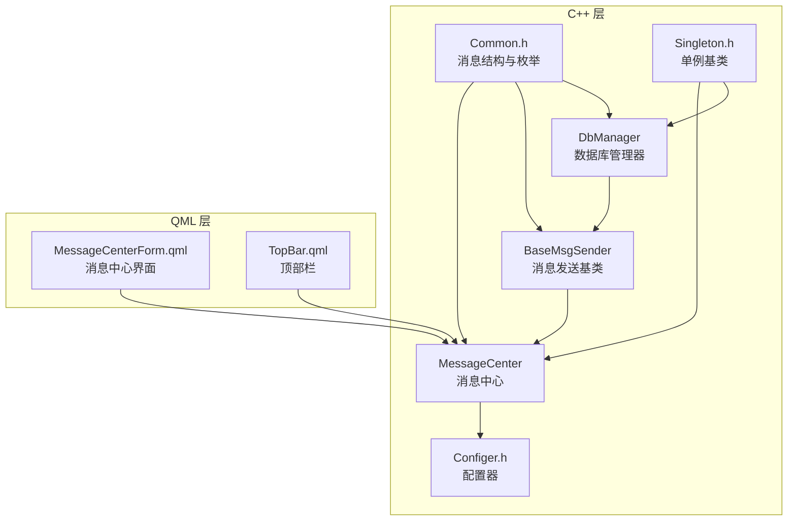
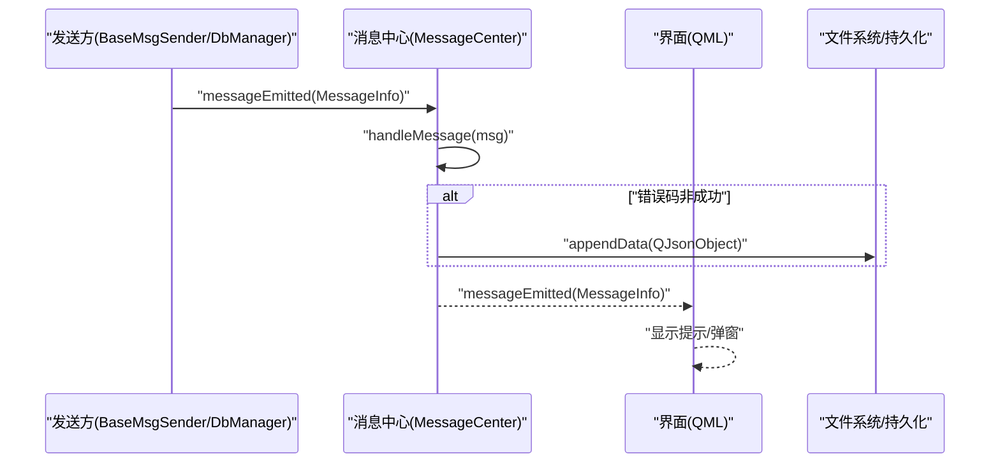
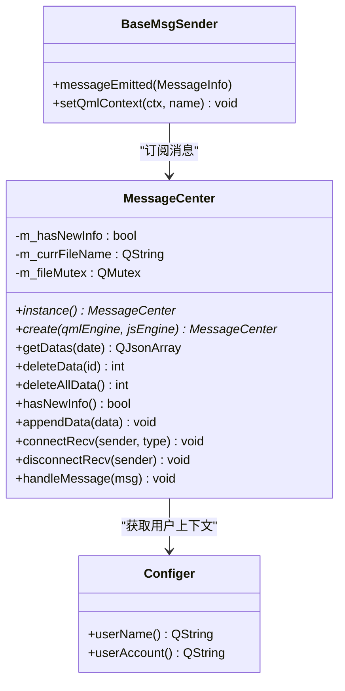
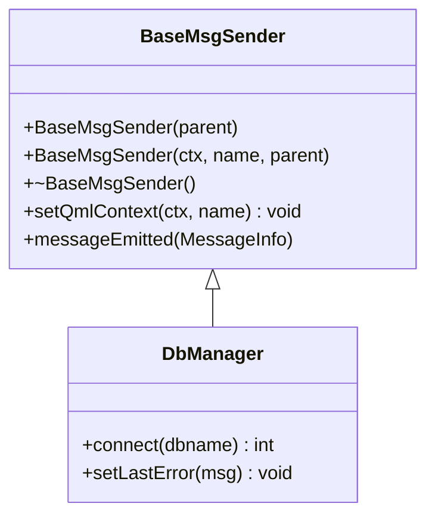
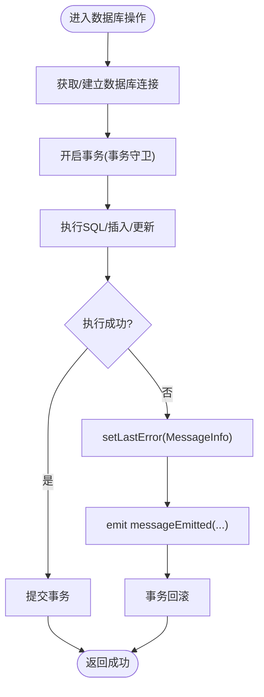
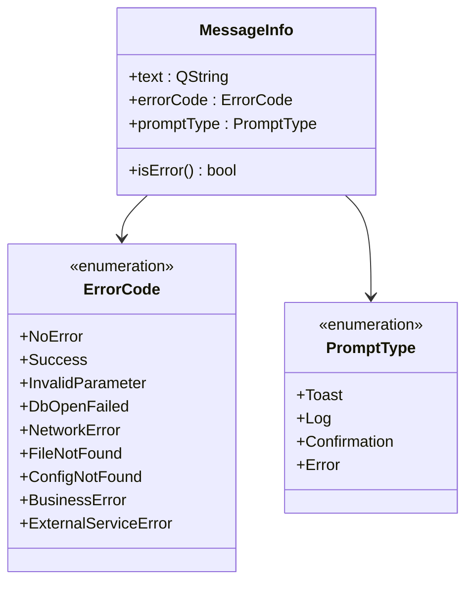
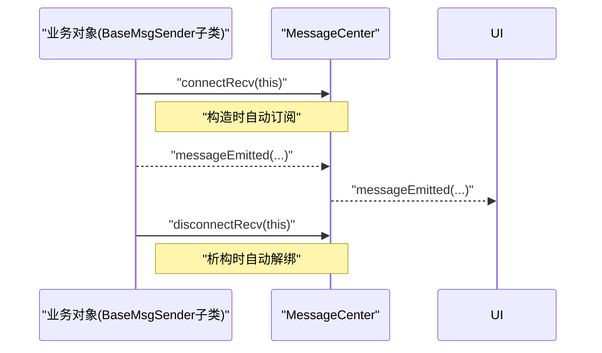
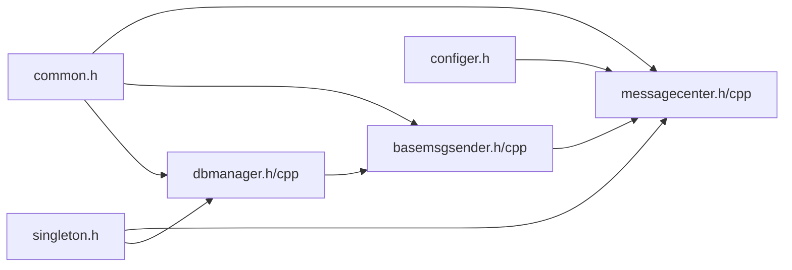

# 消息中心模块

<cite>
**本文引用的文件**
- [messagecenter.h](file://src/messagecenter.h)
- [messagecenter.cpp](file://src/messagecenter.cpp)
- [basemsgsender.h](file://src/basemsgsender.h)
- [basemsgsender.cpp](file://src/basemsgsender.cpp)
- [common.h](file://src/common.h)
- [singleton.h](file://src/singleton.h)
- [dbmanager.h](file://src/dbmanager.h)
- [dbmanager.cpp](file://src/dbmanager.cpp)
- [configer.h](file://src/configer.h)
- [MessageCenterForm.qml](file://src/QmlUI/MessageCenterForm.qml)
- [TopBar.qml](file://src/QmlUI/TopBar.qml)
</cite>

## 目录
1. [简介](#简介)
2. [项目结构](#项目结构)
3. [核心组件](#核心组件)
4. [架构总览](#架构总览)
5. [详细组件分析](#详细组件分析)
6. [依赖关系分析](#依赖关系分析)
7. [性能考量](#性能考量)
8. [故障排查指南](#故障排查指南)
9. [结论](#结论)
10. [附录](#附录)

## 简介
本文件面向消息中心模块，系统性阐述消息发布订阅机制、事件处理流程与组件间通信模式；深入解析BaseMsgSender基类的设计理念、消息路由与异步处理策略；说明消息类型分类、消息负载格式与序列化机制；给出消息优先级管理、消息队列处理与内存管理策略；提供API使用示例（消息发送、接收、订阅、取消订阅）；解释消息中心生命周期管理、性能监控与调试工具；并覆盖消息可靠性保证、重连机制与故障恢复策略。

## 项目结构
消息中心模块位于src目录，关键文件包括：
- 消息中心类：messagecenter.h/.cpp
- 基类：basemsgsender.h/.cpp
- 公共类型与消息结构：common.h
- 单例基类：singleton.h
- 数据库管理器（演示消息发送方）：dbmanager.h/.cpp
- 配置器（提供用户上下文）：configer.h
- QML界面：MessageCenterForm.qml、TopBar.qml

**图表来源**
- [messagecenter.h:27-124](file://src/messagecenter.h#L27-L124)
- [basemsgsender.h:10-35](file://src/basemsgsender.h#L10-L35)
- [dbmanager.h:52-189](file://src/dbmanager.h#L52-L189)
- [common.h:131-156](file://src/common.h#L131-L156)
- [singleton.h:21-80](file://src/singleton.h#L21-L80)
- [configer.h:98-274](file://src/configer.h#L98-L274)
- [MessageCenterForm.qml:1-280](file://src/QmlUI/MessageCenterForm.qml#L1-L280)
- [TopBar.qml:52-57](file://src/QmlUI/TopBar.qml#L52-L57)

**章节来源**
- [messagecenter.h:14-127](file://src/messagecenter.h#L14-L127)
- [basemsgsender.h:1-38](file://src/basemsgsender.h#L1-L38)
- [common.h:16-159](file://src/common.h#L16-L159)
- [singleton.h:1-81](file://src/singleton.h#L1-L81)
- [dbmanager.h:14-192](file://src/dbmanager.h#L14-L192)
- [configer.h:14-277](file://src/configer.h#L14-L277)
- [MessageCenterForm.qml:1-280](file://src/QmlUI/MessageCenterForm.qml#L1-L280)
- [TopBar.qml:52-87](file://src/QmlUI/TopBar.qml#L52-L87)

## 核心组件
- MessageCenter：消息中心，负责接收来自各发送方的消息，按错误码过滤并持久化错误信息，同时向UI层广播消息。
- BaseMsgSender：消息发送基类，统一发出messageEmitted信号，供MessageCenter订阅。
- DbManager：继承BaseMsgSender的典型发送方，负责数据库操作并在错误时上报消息。
- Common：定义消息结构MessageInfo、错误码枚举ErrorCode、提示类型PromptType等。
- Singleton：提供线程安全的单例模板，确保MessageCenter与DbManager等全局唯一。
- Configer：提供用户上下文（用户名、账号），用于消息持久化时附加用户信息。
- QML界面：MessageCenterForm.qml展示历史错误，TopBar.qml订阅消息并即时呈现。

**章节来源**
- [messagecenter.h:27-124](file://src/messagecenter.h#L27-L124)
- [basemsgsender.h:10-35](file://src/basemsgsender.h#L10-L35)
- [dbmanager.h:52-189](file://src/dbmanager.h#L52-L189)
- [common.h:131-156](file://src/common.h#L131-L156)
- [singleton.h:21-80](file://src/singleton.h#L21-L80)
- [configer.h:98-274](file://src/configer.h#L98-L274)
- [MessageCenterForm.qml:1-280](file://src/QmlUI/MessageCenterForm.qml#L1-L280)
- [TopBar.qml:52-57](file://src/QmlUI/TopBar.qml#L52-L57)

## 架构总览
消息中心采用“发布-订阅”模式：各业务模块通过继承BaseMsgSender发出messageEmitted信号；MessageCenter以单例形式订阅这些信号，并根据消息内容进行持久化与UI广播。DbManager作为典型发送方，封装数据库操作并在异常时设置最后错误并触发消息上报。

**图表来源**
- [messagecenter.cpp:101-116](file://src/messagecenter.cpp#L101-L116)
- [basemsgsender.h:27-34](file://src/basemsgsender.h#L27-L34)
- [dbmanager.cpp:784-793](file://src/dbmanager.cpp#L784-L793)
- [MessageCenterForm.qml:215-231](file://src/QmlUI/MessageCenterForm.qml#L215-L231)
- [TopBar.qml:52-57](file://src/QmlUI/TopBar.qml#L52-L57)

## 详细组件分析

### MessageCenter 组件分析
- 单例与QML集成：通过SINGLETON宏与QML_SINGLETON注册为QML单例，支持create工厂方法。
- 订阅机制：connectRecv/disconnectRecv模板方法以函数指针语法连接任意SenderType::messageEmitted到handleMessage。
- 消息处理：handleMessage根据错误码判断是否持久化，随后转发messageEmitted给UI。
- 文件持久化：基于QSettings的INI格式按日期分文件存储错误信息，提供查询、删除、清空等API。
- 并发控制：使用QMutex保护文件访问，确保多线程安全。

**图表来源**
- [messagecenter.h:27-124](file://src/messagecenter.h#L27-L124)
- [messagecenter.cpp:15-118](file://src/messagecenter.cpp#L15-L118)
- [basemsgsender.h:10-35](file://src/basemsgsender.h#L10-L35)
- [configer.h:98-274](file://src/configer.h#L98-L274)

**章节来源**
- [messagecenter.h:33-124](file://src/messagecenter.h#L33-L124)
- [messagecenter.cpp:15-118](file://src/messagecenter.cpp#L15-L118)

### BaseMsgSender 组件分析
- 设计理念：统一消息发送接口，屏蔽具体发送细节；构造时自动订阅MessageCenter，析构时自动解绑。
- QML集成：setQmlContext将实例注入QML上下文，便于前端直接调用。
- 信号定义：messageEmitted携带MessageInfo，供上层业务模块使用。

**图表来源**
- [basemsgsender.h:10-35](file://src/basemsgsender.h#L10-L35)
- [basemsgsender.cpp:5-26](file://src/basemsgsender.cpp#L5-L26)
- [dbmanager.h:52-189](file://src/dbmanager.h#L52-L189)

**章节来源**
- [basemsgsender.h:10-35](file://src/basemsgsender.h#L10-L35)
- [basemsgsender.cpp:5-26](file://src/basemsgsender.cpp#L5-L26)

### DbManager 组件分析
- 继承BaseMsgSender：具备统一消息发送能力。
- 数据库连接：每个线程独立连接，使用线程ID命名避免冲突；开启WAL模式与busy_timeout提升并发稳定性。
- 事务管理：TransactionGuard确保RAII风格的事务开启/回滚。
- 错误上报：lastError/setLastError提供线程本地的错误缓存，并在设置时触发messageEmitted，实现异步通知。

**图表来源**
- [dbmanager.cpp:16-39](file://src/dbmanager.cpp#L16-L39)
- [dbmanager.cpp:51-116](file://src/dbmanager.cpp#L51-L116)
- [dbmanager.cpp:784-793](file://src/dbmanager.cpp#L784-L793)

**章节来源**
- [dbmanager.h:52-189](file://src/dbmanager.h#L52-L189)
- [dbmanager.cpp:14-824](file://src/dbmanager.cpp#L14-L824)

### 消息类型与负载格式
- 消息结构：MessageInfo包含文本、错误码、提示类型三要素。
- 错误码：ErrorCode枚举按模块划分区间，便于分类统计与定位。
- 提示类型：PromptType区分Toast、Log、Confirmation、Error四类，决定UI呈现方式。
- 序列化：消息通过Qt元对象系统传递，无需额外序列化；持久化时使用QJsonObject/QSettings INI格式。

**图表来源**
- [common.h:131-156](file://src/common.h#L131-L156)
- [common.h:63-117](file://src/common.h#L63-L117)
- [common.h:26-31](file://src/common.h#L26-L31)

**章节来源**
- [common.h:131-156](file://src/common.h#L131-L156)
- [common.h:63-117](file://src/common.h#L63-L117)
- [common.h:26-31](file://src/common.h#L26-L31)

### 生命周期与订阅管理
- 单例生命周期：通过Singleton模板提供线程安全的单例实例，支持销毁与状态查询。
- 订阅生命周期：BaseMsgSender在构造时自动connectRecv，在析构时自动disconnectRecv，避免遗漏解绑。
- QML生命周期：MessageCenter作为QML单例，随应用启动初始化；UI通过Connections或context property使用。

**图表来源**
- [basemsgsender.cpp:8-21](file://src/basemsgsender.cpp#L8-L21)
- [messagecenter.h:89-106](file://src/messagecenter.h#L89-L106)
- [singleton.h:28-50](file://src/singleton.h#L28-L50)

**章节来源**
- [singleton.h:21-80](file://src/singleton.h#L21-L80)
- [basemsgsender.cpp:5-26](file://src/basemsgsender.cpp#L5-L26)
- [messagecenter.h:89-106](file://src/messagecenter.h#L89-L106)

### API 使用示例
以下示例以“路径+行号”形式指引，避免直接粘贴代码：

- 发送消息（业务模块继承BaseMsgSender并发出信号）
  - 参考：[basemsgsender.h:27-34](file://src/basemsgsender.h#L27-L34)
- 订阅消息（由发送方自动完成，也可手动调用connectRecv/disconnectRecv）
  - 参考：[messagecenter.h:89-106](file://src/messagecenter.h#L89-L106)
- 接收消息（UI侧通过Connections监听）
  - 参考：[TopBar.qml:52-57](file://src/QmlUI/TopBar.qml#L52-L57)
- 查询历史错误（QML侧调用）
  - 参考：[MessageCenterForm.qml:215-231](file://src/QmlUI/MessageCenterForm.qml#L215-L231)
- 删除某条错误（QML侧调用）
  - 参考：[MessageCenterForm.qml:245-263](file://src/QmlUI/MessageCenterForm.qml#L245-L263)
- 清空当日错误（QML侧调用）
  - 参考：[MessageCenterForm.qml:265-278](file://src/QmlUI/MessageCenterForm.qml#L265-L278)

**章节来源**
- [basemsgsender.h:27-34](file://src/basemsgsender.h#L27-L34)
- [messagecenter.h:89-106](file://src/messagecenter.h#L89-L106)
- [TopBar.qml:52-57](file://src/QmlUI/TopBar.qml#L52-L57)
- [MessageCenterForm.qml:215-278](file://src/QmlUI/MessageCenterForm.qml#L215-L278)

## 依赖关系分析
- 组件耦合：MessageCenter依赖Configer获取用户上下文；DbManager依赖BaseMsgSender统一消息通道；Common为跨模块共享的类型定义。
- 外部依赖：Qt核心、SQL模块、QML引擎；DbManager依赖SQLite驱动。
- 潜在循环：当前无直接循环依赖；注意避免在MessageCenter中反向依赖发送方。

**图表来源**
- [common.h:131-156](file://src/common.h#L131-L156)
- [messagecenter.h:17-24](file://src/messagecenter.h#L17-L24)
- [basemsgsender.h:4-7](file://src/basemsgsender.h#L4-L7)
- [dbmanager.h:19-21](file://src/dbmanager.h#L19-L21)
- [configer.h:17-21](file://src/configer.h#L17-L21)
- [singleton.h:21-30](file://src/singleton.h#L21-L30)

**章节来源**
- [messagecenter.h:17-24](file://src/messagecenter.h#L17-L24)
- [basemsgsender.h:4-7](file://src/basemsgsender.h#L4-L7)
- [dbmanager.h:19-21](file://src/dbmanager.h#L19-L21)
- [common.h:131-156](file://src/common.h#L131-L156)
- [configer.h:17-21](file://src/configer.h#L17-L21)
- [singleton.h:21-30](file://src/singleton.h#L21-L30)

## 性能考量
- 线程模型：DbManager为每线程维护独立连接，减少锁竞争；WAL模式与busy_timeout降低“database is locked”概率。
- 并发安全：MessageCenter对文件访问加互斥锁；DbManager对lastError使用线程本地存储与互斥保护。
- 异步通知：消息通过Qt信号槽异步传播，避免阻塞业务线程。
- I/O优化：按日期分文件存储错误，避免单文件过大；查询时按组排序，便于快速定位。

**章节来源**
- [dbmanager.cpp:51-116](file://src/dbmanager.cpp#L51-L116)
- [messagecenter.cpp:29-98](file://src/messagecenter.cpp#L29-L98)

## 故障排查指南
- 数据库连接失败
  - 现象：connect返回错误码，lastError被设置。
  - 排查：确认数据库文件路径、权限；检查WAL模式与busy_timeout设置。
  - 参考：[dbmanager.cpp:51-90](file://src/dbmanager.cpp#L51-L90)
- 数据库操作失败
  - 现象：execSql/updateDatas/appendDatas返回错误码，lastError被设置。
  - 排查：检查SQL语法、表结构、参数绑定；确认事务守卫是否正确提交/回滚。
  - 参考：[dbmanager.cpp:555-576](file://src/dbmanager.cpp#L555-L576)
- 消息未到达UI
  - 现象：业务侧已发出messageEmitted，但界面无响应。
  - 排查：确认发送方已自动订阅或手动connectRecv；确认UI侧Connections目标为MessageCenter且回调正确。
  - 参考：[basemsgsender.cpp:8-10](file://src/basemsgsender.cpp#L8-L10)
  - 参考：[TopBar.qml:52-57](file://src/QmlUI/TopBar.qml#L52-L57)
- 错误信息未持久化
  - 现象：错误发生但历史记录为空。
  - 排查：确认handleMessage中错误码判断逻辑；检查文件路径与权限。
  - 参考：[messagecenter.cpp:101-116](file://src/messagecenter.cpp#L101-L116)

**章节来源**
- [dbmanager.cpp:51-90](file://src/dbmanager.cpp#L51-L90)
- [dbmanager.cpp:555-576](file://src/dbmanager.cpp#L555-L576)
- [basemsgsender.cpp:8-10](file://src/basemsgsender.cpp#L8-L10)
- [TopBar.qml:52-57](file://src/QmlUI/TopBar.qml#L52-L57)
- [messagecenter.cpp:101-116](file://src/messagecenter.cpp#L101-L116)

## 结论
消息中心模块通过BaseMsgSender统一消息出口、MessageCenter集中处理与持久化、DbManager等发送方提供可靠数据通道，形成清晰的发布-订阅架构。配合Singleton单例、线程本地错误缓存与互斥保护，实现了高内聚、低耦合、可扩展的消息体系。建议在后续迭代中引入消息优先级与队列策略，增强大规模并发下的吞吐与稳定性。

## 附录

### 消息可靠性与恢复策略
- 可靠性保障
  - 错误码过滤：仅非成功错误码写入持久化，避免噪声干扰。
  - 异步通知：信号槽异步传播，降低阻塞风险。
  - 事务一致性：DbManager使用事务守卫，失败自动回滚。
- 重连与恢复
  - 数据库连接断开时，getDatabase会尝试重新连接；失败时设置lastError并上报。
  - 建议在UI层增加重试按钮或自动重连逻辑（当前未内置）。
- 故障恢复
  - 备份/恢复：DbManager提供backupDb/recoverDb，失败时设置lastError并回滚。
  - 建议在恢复后刷新MessageCenter视图，确保数据一致性。

**章节来源**
- [messagecenter.cpp:101-116](file://src/messagecenter.cpp#L101-L116)
- [dbmanager.cpp:92-116](file://src/dbmanager.cpp#L92-L116)
- [dbmanager.cpp:118-223](file://src/dbmanager.cpp#L118-L223)