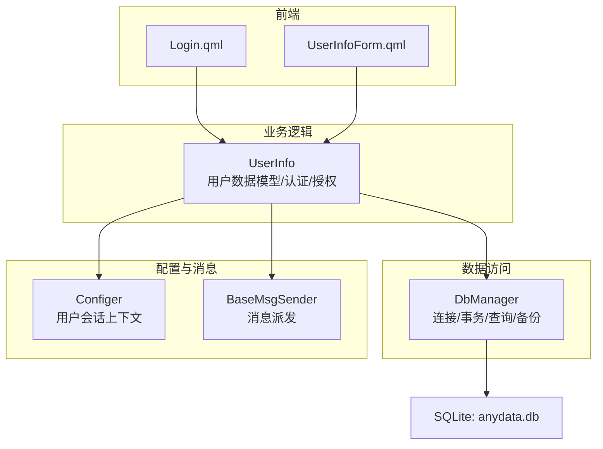
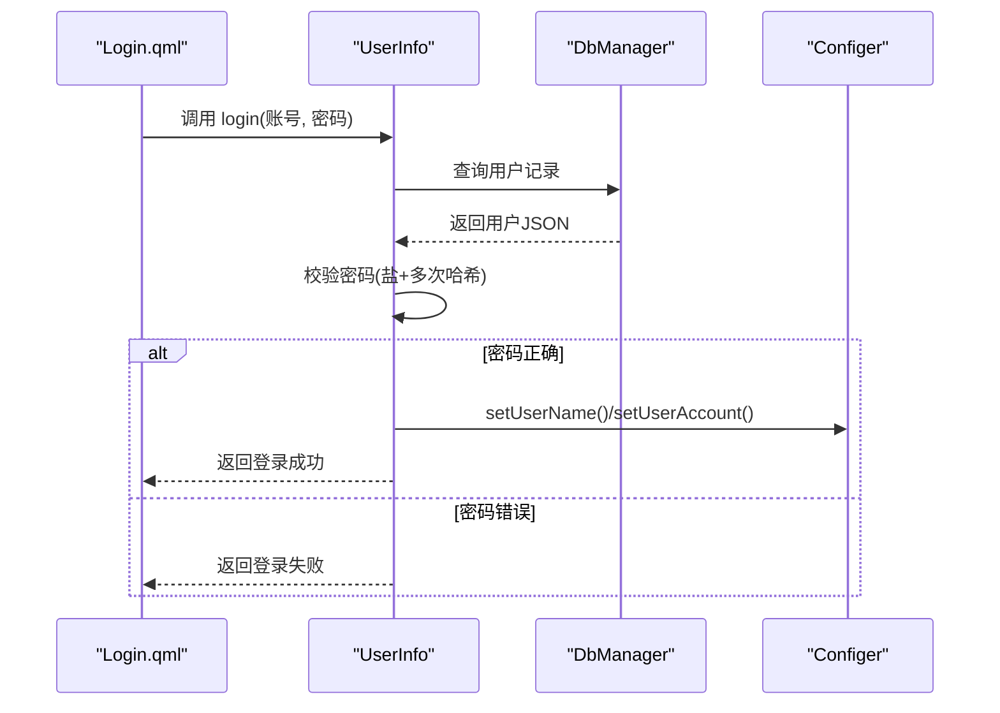
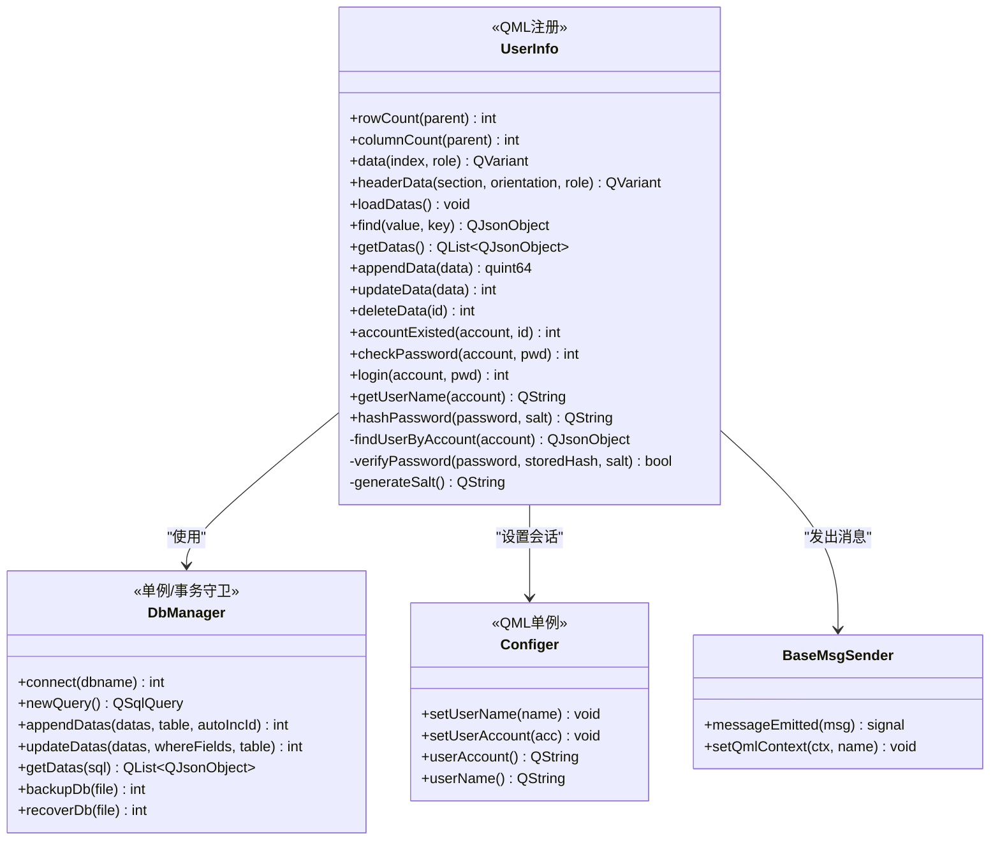
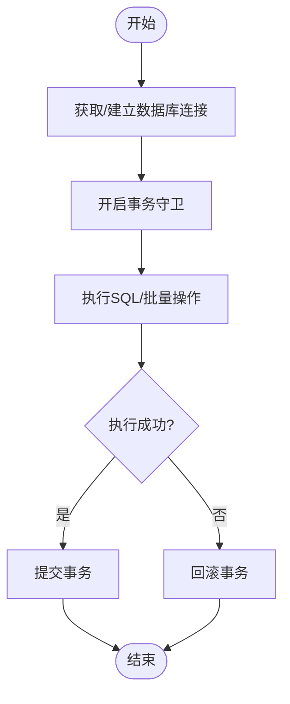
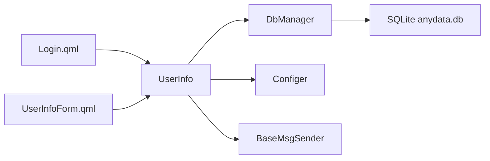
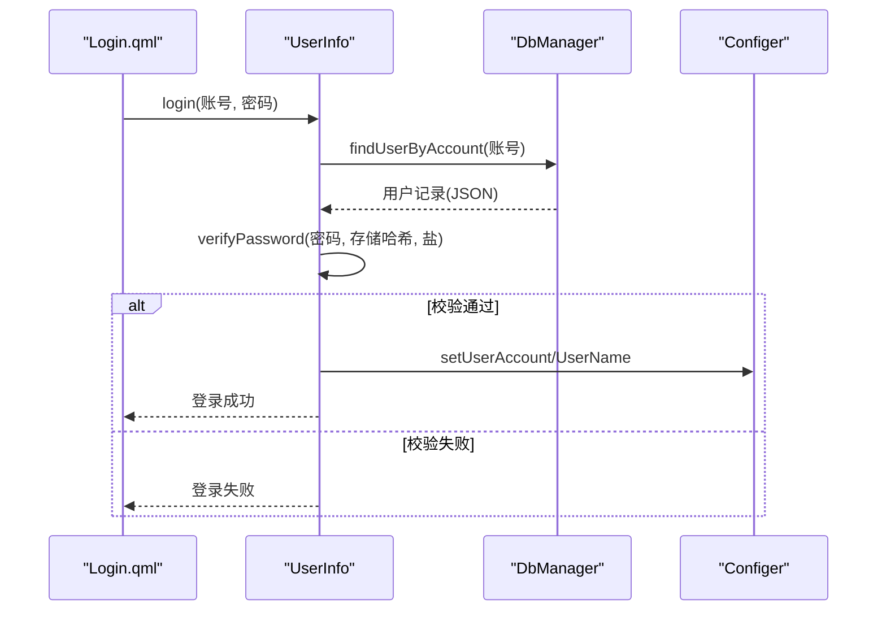

# 用户管理模块

<cite>
**本文引用的文件**   
- [userinfo.h](file://src/userinfo.h)
- [userinfo.cpp](file://src/userinfo.cpp)
- [dbmanager.h](file://src/dbmanager.h)
- [dbmanager.cpp](file://src/dbmanager.cpp)
- [configer.h](file://src/configer.h)
- [configer.cpp](file://src/configer.cpp)
- [basemsgsender.h](file://src/basemsgsender.h)
- [basemsgsender.cpp](file://src/basemsgsender.cpp)
- [Login.qml](file://src/QmlUI/Login.qml)
- [UserInfoForm.qml](file://src/QmlUI/UserInfoForm.qml)
</cite>

## 目录
1. [简介](#简介)
2. [项目结构](#项目结构)
3. [核心组件](#核心组件)
4. [架构总览](#架构总览)
5. [详细组件分析](#详细组件分析)
6. [依赖关系分析](#依赖关系分析)
7. [性能与安全考量](#性能与安全考量)
8. [故障排查指南](#故障排查指南)
9. [结论](#结论)
10. [附录：API使用示例与规范](#附录api使用示例与规范)

## 简介
本文件面向“用户管理模块”的技术文档，围绕 UserInfo 类展开，系统性说明其在用户数据管理、权限控制、会话管理、认证流程、密码加密与安全策略方面的实现；同时结合数据库层、配置层与前端交互层，给出数据结构、字段定义、验证规则、角色与权限分配、访问控制、状态管理、会话超时与安全注销流程，以及数据保护、隐私合规与审计日志建议。

## 项目结构
用户管理模块主要由以下层次构成：
- 前端交互层（QML）：登录界面与用户信息编辑界面负责用户输入与展示。
- 业务逻辑层（C++）：UserInfo 类封装用户数据模型与认证/授权相关操作。
- 数据访问层（C++）：DbManager 封装数据库连接、事务、查询与备份/恢复。
- 配置与消息层（C++）：Configer 提供用户会话上下文（账号/用户名），BaseMsgSender 提供统一消息派发能力。
- 数据库（SQLite）：anydata.db 中的用户表承载用户数据。

**图表来源**
- [Login.qml:1-342](file://src/QmlUI/Login.qml#L1-L342)
- [UserInfoForm.qml:1-397](file://src/QmlUI/UserInfoForm.qml#L1-L397)
- [userinfo.h:30-172](file://src/userinfo.h#L30-L172)
- [userinfo.cpp:1-297](file://src/userinfo.cpp#L1-L297)
- [dbmanager.h:52-192](file://src/dbmanager.h#L52-L192)
- [dbmanager.cpp:1-834](file://src/dbmanager.cpp#L1-L834)
- [configer.h:98-277](file://src/configer.h#L98-L277)
- [configer.cpp:1-421](file://src/configer.cpp#L1-L421)
- [basemsgsender.h:10-38](file://src/basemsgsender.h#L10-L38)
- [basemsgsender.cpp:1-27](file://src/basemsgsender.cpp#L1-L27)

**章节来源**
- [Login.qml:1-342](file://src/QmlUI/Login.qml#L1-L342)
- [UserInfoForm.qml:1-397](file://src/QmlUI/UserInfoForm.qml#L1-L397)
- [userinfo.h:30-172](file://src/userinfo.h#L30-L172)
- [userinfo.cpp:1-297](file://src/userinfo.cpp#L1-L297)
- [dbmanager.h:52-192](file://src/dbmanager.h#L52-L192)
- [dbmanager.cpp:1-834](file://src/dbmanager.cpp#L1-L834)
- [configer.h:98-277](file://src/configer.h#L98-L277)
- [configer.cpp:1-421](file://src/configer.cpp#L1-L421)
- [basemsgsender.h:10-38](file://src/basemsgsender.h#L10-L38)
- [basemsgsender.cpp:1-27](file://src/basemsgsender.cpp#L1-L27)

## 核心组件
- UserInfo：提供用户数据模型（QAbstractTableModel）、用户查询、新增/更新/删除、账号唯一性校验、密码校验与登录、用户名查询、密码哈希与盐值生成等。
- DbManager：提供数据库连接、事务守卫、查询/插入/更新/删除、备份/恢复、Schema缓存与线程安全。
- Configer：提供用户会话上下文（当前账号、用户名）与应用配置项。
- BaseMsgSender：统一消息派发接口，便于与消息中心对接。

**章节来源**
- [userinfo.h:30-172](file://src/userinfo.h#L30-L172)
- [userinfo.cpp:1-297](file://src/userinfo.cpp#L1-L297)
- [dbmanager.h:52-192](file://src/dbmanager.h#L52-L192)
- [dbmanager.cpp:1-834](file://src/dbmanager.cpp#L1-L834)
- [configer.h:98-277](file://src/configer.h#L98-L277)
- [configer.cpp:1-421](file://src/configer.cpp#L1-L421)
- [basemsgsender.h:10-38](file://src/basemsgsender.h#L10-L38)
- [basemsgsender.cpp:1-27](file://src/basemsgsender.cpp#L1-L27)

## 架构总览
用户管理模块采用分层架构：
- 前端通过 QML 调用 UserInfo 的 Q_INVOKABLE 接口；
- UserInfo 通过 DbManager 访问 SQLite；
- 登录成功后，UserInfo 通过 Configer 写入当前用户上下文；
- 所有数据库操作在 DbManager 的事务守卫下执行，确保一致性；
- BaseMsgSender 统一发出错误/提示消息。

**图表来源**
- [Login.qml:320-340](file://src/QmlUI/Login.qml#L320-L340)
- [userinfo.cpp:226-242](file://src/userinfo.cpp#L226-L242)
- [dbmanager.cpp:362-368](file://src/dbmanager.cpp#L362-L368)
- [configer.cpp:22-40](file://src/configer.cpp#L22-L40)

**章节来源**
- [Login.qml:320-340](file://src/QmlUI/Login.qml#L320-L340)
- [userinfo.cpp:226-242](file://src/userinfo.cpp#L226-L242)
- [dbmanager.cpp:362-368](file://src/dbmanager.cpp#L362-L368)
- [configer.cpp:22-40](file://src/configer.cpp#L22-L40)

## 详细组件分析

### UserInfo 类（用户数据模型与认证）
- 数据模型
  - 继承 QAbstractTableModel，支持表格展示与列头数据；
  - 内部维护表头列表与二维数据行，提供线程安全的读取与刷新。
- 用户数据操作
  - 加载：从 UserInfo 表读取全部记录；
  - 查询：按字段值查找用户；
  - 新增/更新/删除：通过 DbManager 的批量插入/更新/删除实现；
  - 账号唯一性：支持带排除 ID 的重复检测；
- 认证与会话
  - 密码校验：基于数据库中存储的盐值与哈希；
  - 登录：校验通过后设置 Configer 的当前用户上下文并发出登录信号；
  - 用户名查询：根据账号查询对应用户名。
- 安全与加密
  - 密码哈希：使用数据库内盐值，对明文密码进行 SHA-256 迭代增强（固定迭代次数）；
  - 盐值生成：使用 UUID 生成全局唯一盐值。

**图表来源**
- [userinfo.h:30-172](file://src/userinfo.h#L30-L172)
- [userinfo.cpp:1-297](file://src/userinfo.cpp#L1-L297)
- [dbmanager.h:52-192](file://src/dbmanager.h#L52-L192)
- [configer.h:98-277](file://src/configer.h#L98-L277)
- [basemsgsender.h:10-38](file://src/basemsgsender.h#L10-L38)

**章节来源**
- [userinfo.h:30-172](file://src/userinfo.h#L30-L172)
- [userinfo.cpp:24-104](file://src/userinfo.cpp#L24-L104)
- [userinfo.cpp:106-210](file://src/userinfo.cpp#L106-L210)
- [userinfo.cpp:226-251](file://src/userinfo.cpp#L226-L251)
- [userinfo.cpp:255-297](file://src/userinfo.cpp#L255-L297)

### 数据库层（DbManager）
- 连接与线程安全
  - 按线程存储数据库连接，避免跨线程共享连接；
  - WAL 模式与忙等待超时，提升并发写入稳定性。
- 事务与一致性
  - TransactionGuard 自动开启事务并在析构时回滚，显式 commit 提交；
  - 批量插入/更新在事务内执行，保证原子性。
- 查询与序列化
  - 支持 SQL 查询、结果转 JSON、条件查询（含比较运算符解析）；
  - Schema 缓存，解析字段类型、长度、精度、主键、自增等。
- 备份与恢复
  - 支持数据库文件复制备份与恢复，失败时回滚并发出错误消息。

**图表来源**
- [dbmanager.cpp:14-40](file://src/dbmanager.cpp#L14-L40)
- [dbmanager.cpp:51-90](file://src/dbmanager.cpp#L51-L90)
- [dbmanager.cpp:447-508](file://src/dbmanager.cpp#L447-L508)
- [dbmanager.cpp:510-563](file://src/dbmanager.cpp#L510-L563)

**章节来源**
- [dbmanager.h:37-50](file://src/dbmanager.h#L37-L50)
- [dbmanager.cpp:51-90](file://src/dbmanager.cpp#L51-L90)
- [dbmanager.cpp:447-508](file://src/dbmanager.cpp#L447-L508)
- [dbmanager.cpp:510-563](file://src/dbmanager.cpp#L510-L563)
- [dbmanager.cpp:118-223](file://src/dbmanager.cpp#L118-L223)

### 配置与消息层（Configer/BaseMsgSender）
- Configer
  - 提供当前用户账号与用户名的内存缓存与持久化读写；
  - 以 QML 单例形式暴露，供前端直接读取当前用户上下文。
- BaseMsgSender
  - 统一消息信号，便于与消息中心对接；
  - UserInfo 通过该机制向消息中心发送错误/提示信息。

**章节来源**
- [configer.h:98-277](file://src/configer.h#L98-L277)
- [configer.cpp:22-40](file://src/configer.cpp#L22-L40)
- [basemsgsender.h:10-38](file://src/basemsgsender.h#L10-L38)
- [basemsgsender.cpp:1-27](file://src/basemsgsender.cpp#L1-L27)

### 前端交互（Login.qml/UserInfoForm.qml）
- Login.qml
  - 输入账号/密码，调用 UserInfo.login；
  - 登录成功后隐藏登录窗体并显示主窗体。
- UserInfoForm.qml
  - 展示用户列表（仅管理员可见）；
  - 支持新增/保存/删除用户，保存时进行账号唯一性与密码校验；
  - 保存新密码时要求重复输入确认。

**章节来源**
- [Login.qml:320-340](file://src/QmlUI/Login.qml#L320-L340)
- [UserInfoForm.qml:240-262](file://src/QmlUI/UserInfoForm.qml#L240-L262)
- [UserInfoForm.qml:285-374](file://src/QmlUI/UserInfoForm.qml#L285-L374)
- [UserInfoForm.qml:376-395](file://src/QmlUI/UserInfoForm.qml#L376-L395)

## 依赖关系分析
- UserInfo 依赖 DbManager 进行数据持久化，依赖 Configer 写入会话上下文，依赖 BaseMsgSender 发出消息；
- DbManager 依赖 SQLite 驱动与线程存储，内部维护 Schema 缓存；
- 前端 QML 通过 QML 注册与单例机制直接调用 UserInfo/Configer。

**图表来源**
- [Login.qml:54-56](file://src/QmlUI/Login.qml#L54-L56)
- [UserInfoForm.qml:7-7](file://src/QmlUI/UserInfoForm.qml#L7-L7)
- [userinfo.h:30-40](file://src/userinfo.h#L30-L40)
- [dbmanager.h:52-54](file://src/dbmanager.h#L52-L54)
- [configer.h:98-102](file://src/configer.h#L98-L102)
- [basemsgsender.h:10-12](file://src/basemsgsender.h#L10-L12)

**章节来源**
- [Login.qml:54-56](file://src/QmlUI/Login.qml#L54-L56)
- [UserInfoForm.qml:7-7](file://src/QmlUI/UserInfoForm.qml#L7-L7)
- [userinfo.h:30-40](file://src/userinfo.h#L30-L40)
- [dbmanager.h:52-54](file://src/dbmanager.h#L52-L54)
- [configer.h:98-102](file://src/configer.h#L98-L102)
- [basemsgsender.h:10-12](file://src/basemsgsender.h#L10-L12)

## 性能与安全考量
- 性能
  - 使用线程本地数据库连接与 WAL 模式，降低锁竞争；
  - 事务批量写入，减少磁盘写放大；
  - 表格模型数据缓存，避免频繁查询。
- 安全
  - 密码使用“盐+多次哈希”策略，增强抗彩虹表能力；
  - 登录成功后仅在内存中维护当前用户上下文，不持久化敏感信息；
  - 前端输入校验与后端重复性校验双重保障。
- 隐私与合规
  - 用户数据存储在本地 SQLite 文件中，建议配合文件系统权限与最小化采集原则；
  - 建议在生产环境启用只读/最小权限访问数据库文件。
- 审计与日志
  - 可通过 BaseMsgSender 将关键事件（登录、新增/更新/删除用户）上报至消息中心，便于后续接入审计系统。

[本节为通用指导，无需具体文件引用]

## 故障排查指南
- 登录失败
  - 检查账号是否存在与密码是否正确；
  - 关注 DbManager 的 lastError 输出与 UserInfo 发出的消息。
- 数据库连接失败
  - 检查数据库文件路径与权限；
  - 关注 DbManager::connect 的错误码与日志。
- 并发写入冲突
  - 确认 WAL 模式与 busy_timeout 设置；
  - 避免在 UI 线程长时间阻塞数据库操作。
- 备份/恢复异常
  - 确认源文件存在且有足够权限；
  - 恢复失败会自动回滚，需检查日志。

**章节来源**
- [dbmanager.cpp:51-90](file://src/dbmanager.cpp#L51-L90)
- [dbmanager.cpp:118-223](file://src/dbmanager.cpp#L118-L223)
- [dbmanager.cpp:779-803](file://src/dbmanager.cpp#L779-L803)
- [basemsgsender.cpp:1-27](file://src/basemsgsender.cpp#L1-L27)

## 结论
用户管理模块通过 UserInfo 将前端交互、数据访问与会话管理有机结合，采用 SQLite 与事务保证一致性，使用“盐+多次哈希”强化密码安全，并通过 Configer 提供轻量会话上下文。整体架构清晰、职责明确，具备良好的扩展性与安全性基础。建议在生产环境中进一步完善审计日志、会话超时与安全注销流程，并加强文件系统与网络传输层面的安全防护。

[本节为总结，无需具体文件引用]

## 附录：API使用示例与规范

### 用户数据结构与字段定义
- 用户表（UserInfo）字段（来源于 DbManager 的 Schema 缓存与查询）
  - Id：整型，主键，自增；
  - Account：字符串，唯一性约束（由业务层校验）；
  - Name：字符串；
  - Password：字符串，存储“盐+哈希”；
  - Salt：字符串，存储盐值；
  - Type：整型，0=普通用户，1=管理员（前端用于控制界面权限）。

**章节来源**
- [dbmanager.cpp:225-360](file://src/dbmanager.cpp#L225-L360)
- [dbmanager.cpp:588-609](file://src/dbmanager.cpp#L588-L609)
- [UserInfoForm.qml:56-59](file://src/QmlUI/UserInfoForm.qml#L56-L59)

### 认证流程与密码加密
- 登录流程
  - 前端调用 UserInfo.login(账号, 密码)；
  - 后端查询用户记录，校验密码（盐+多次哈希），成功则设置 Configer 的当前用户并发出登录信号。
- 密码加密
  - 新增/更新用户时，若提供明文密码，则使用数据库内盐值进行哈希；
  - 若未提供盐值，将自动生成 UUID 作为盐值。

**图表来源**
- [Login.qml:320-340](file://src/QmlUI/Login.qml#L320-L340)
- [userinfo.cpp:226-242](file://src/userinfo.cpp#L226-L242)
- [userinfo.cpp:255-291](file://src/userinfo.cpp#L255-L291)
- [configer.cpp:22-40](file://src/configer.cpp#L22-L40)

**章节来源**
- [Login.qml:320-340](file://src/QmlUI/Login.qml#L320-L340)
- [userinfo.cpp:226-242](file://src/userinfo.cpp#L226-L242)
- [userinfo.cpp:275-291](file://src/userinfo.cpp#L275-L291)
- [configer.cpp:22-40](file://src/configer.cpp#L22-L40)

### 权限控制与角色管理
- 角色
  - Type=0：普通用户；
  - Type=1：管理员。
- 权限
  - 管理员可见并可编辑用户列表；
  - 普通用户仅可查看自身信息并修改密码（需旧密码校验）。

**章节来源**
- [UserInfoForm.qml:11-11](file://src/QmlUI/UserInfoForm.qml#L11-L11)
- [UserInfoForm.qml:55-59](file://src/QmlUI/UserInfoForm.qml#L55-L59)
- [UserInfoForm.qml:240-262](file://src/QmlUI/UserInfoForm.qml#L240-L262)
- [UserInfoForm.qml:313-354](file://src/QmlUI/UserInfoForm.qml#L313-L354)

### 会话管理与安全注销
- 登录成功后，UserInfo 通过 Configer 写入当前用户账号与用户名；
- 前端可通过读取 Configer.userAccount()/userName() 获取当前用户；
- 注销流程建议：清空 Configer 的用户上下文并关闭当前窗口，前端不再持有敏感状态。

**章节来源**
- [userinfo.cpp:236-238](file://src/userinfo.cpp#L236-L238)
- [configer.cpp:22-40](file://src/configer.cpp#L22-L40)
- [Login.qml:331-335](file://src/QmlUI/Login.qml#L331-L335)

### 数据保护、隐私合规与审计日志
- 数据保护
  - 本地 SQLite 文件建议限制访问权限；
  - 密码字段仅存储哈希与盐值，不保留明文。
- 隐私合规
  - 最小化采集原则，仅存储必要字段；
  - 用户删除请求应彻底清除相关记录。
- 审计日志
  - 建议通过 BaseMsgSender 将登录、新增/更新/删除用户等事件上报至消息中心，后续接入审计系统。

**章节来源**
- [basemsgsender.h:27-34](file://src/basemsgsender.h#L27-L34)
- [basemsgsender.cpp:1-27](file://src/basemsgsender.cpp#L1-L27)

### API使用示例（路径指引）
- 用户注册
  - 前端：UserInfoForm.qml 中点击“保存”，构造包含 Name/Account/Password/Type 的 JSON，调用 userInfo.appendData；
  - 后端：UserInfo::appendData 自动补全 Salt 并对 Password 哈希，再通过 DbManager::appendDatas 写入。
- 用户登录
  - 前端：Login.qml 中点击“登录”，调用 userInfo.login；
  - 后端：UserInfo::login 校验密码并通过 Configer 写入会话。
- 更新用户信息
  - 前端：选择行后点击“保存”，调用 userInfo.updateData；
  - 后端：若提供新密码则自动哈希并更新。
- 权限检查
  - 前端：读取 Configer.userAccount() 与用户列表 Type 字段判断是否管理员。

**章节来源**
- [UserInfoForm.qml:313-374](file://src/QmlUI/UserInfoForm.qml#L313-L374)
- [userinfo.cpp:134-152](file://src/userinfo.cpp#L134-L152)
- [userinfo.cpp:154-171](file://src/userinfo.cpp#L154-L171)
- [Login.qml:320-340](file://src/QmlUI/Login.qml#L320-L340)
- [configer.cpp:22-40](file://src/configer.cpp#L22-L40)