# 配置管理模块

<cite>
**本文档引用的文件**
- [configer.h](file://src/configer.h)
- [configer.cpp](file://src/configer.cpp)
- [singleton.h](file://src/singleton.h)
- [common.h](file://src/common.h)
- [main.cpp](file://src/main.cpp)
- [Config.ini](file://bin/Config.ini)
- [Config.ini](file://resources/Config.ini)
- [Preferences.qml](file://src/QmlUI/Preferences.qml)
- [Main.qml](file://src/QmlUI/Main.qml)
</cite>

## 目录
1. [简介](#简介)
2. [项目结构](#项目结构)
3. [核心组件](#核心组件)
4. [架构概览](#架构概览)
5. [详细组件分析](#详细组件分析)
6. [依赖关系分析](#依赖关系分析)
7. [性能考虑](#性能考虑)
8. [故障排除指南](#故障排除指南)
9. [结论](#结论)
10. [附录](#附录)

## 简介

配置管理模块是整个应用程序的核心基础设施之一，负责管理应用程序的各种配置参数、用户偏好设置以及运行时配置。该模块基于Qt框架的QSettings类实现了INI格式配置文件的读写功能，并通过单例模式确保全局唯一性。

本模块的主要功能包括：
- INI配置文件解析和管理
- 运行时配置更新和持久化
- 配置项分类管理和数据类型验证
- 配置变更监听和热重载支持
- 配置文件版本管理和备份恢复
- 敏感信息保护和配置模板管理

## 项目结构

配置管理模块在项目中的组织结构如下：

```mermaid
graph TB
subgraph "配置管理模块"
Configer[Configer类<br/>配置管理核心]
Singleton[单例模板<br/>Singleton<T>]
QSettings[Qt配置系统<br/>QSettings]
end
subgraph "配置文件"
DefaultCfg[默认配置<br/>Config.ini]
CustomCfg[自定义配置<br/>Custom.ini]
LogCfg[日志配置<br/>Log组]
end
subgraph "应用集成"
MainApp[主应用程序<br/>main.cpp]
QMLUI[QML界面层<br/>Preferences.qml]
Runtime[运行时环境<br/>Configer::instance()]
end
Configer --> QSettings
Configer --> Singleton
Configer --> DefaultCfg
Configer --> CustomCfg
Configer --> LogCfg
MainApp --> Configer
QMLUI --> Configer
Runtime --> Configer
```

**图表来源**
- [configer.h:14-277](file://src/configer.h#L14-L277)
- [configer.cpp:1-421](file://src/configer.cpp#L1-421)
- [singleton.h:1-81](file://src/singleton.h#L1-L81)

**章节来源**
- [configer.h:14-277](file://src/configer.h#L14-L277)
- [configer.cpp:1-421](file://src/configer.cpp#L1-L421)
- [singleton.h:1-81](file://src/singleton.h#L1-L81)

## 核心组件

### Configer类架构

Configer类是配置管理模块的核心，采用单例模式设计，提供了丰富的配置管理功能：

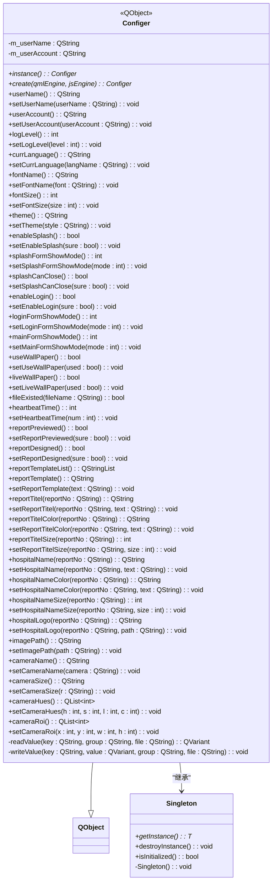

**图表来源**
- [configer.h:98-277](file://src/configer.h#L98-L277)
- [singleton.h:21-61](file://src/singleton.h#L21-L61)

### 配置文件结构设计

配置文件采用INI格式，支持分组管理和键值对映射：

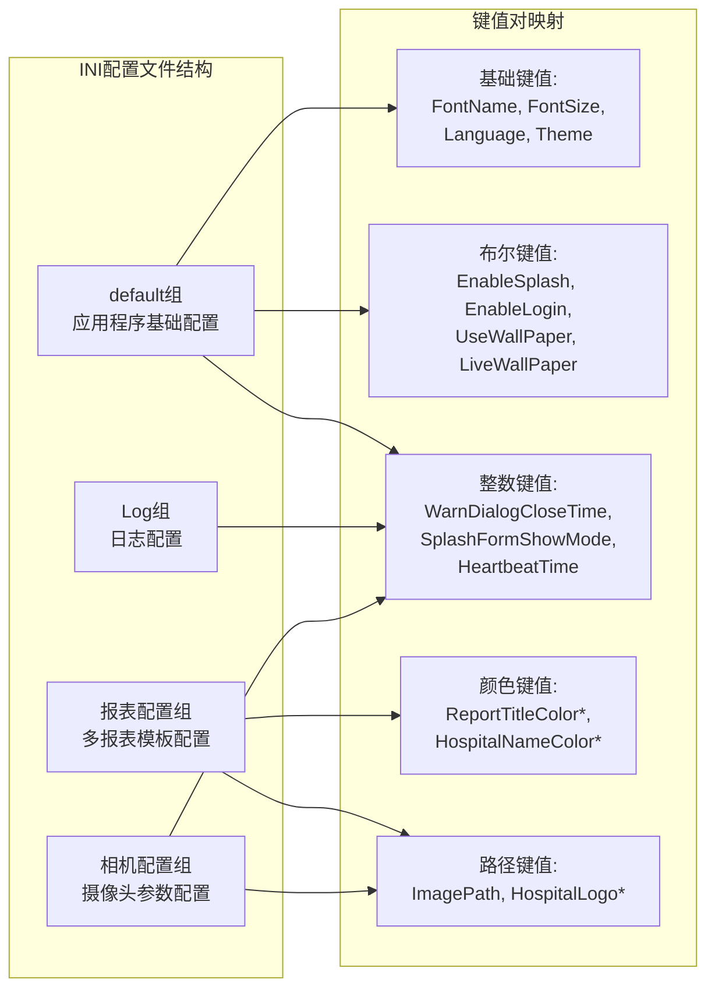

**图表来源**
- [Config.ini:1-103](file://bin/Config.ini#L1-L103)
- [Config.ini:1-103](file://resources/Config.ini#L1-L103)

**章节来源**
- [configer.h:98-277](file://src/configer.h#L98-L277)
- [configer.cpp:404-419](file://src/configer.cpp#L404-L419)
- [Config.ini:1-103](file://bin/Config.ini#L1-L103)

## 架构概览

配置管理模块的整体架构采用分层设计，从底层的文件系统访问到上层的应用程序集成：

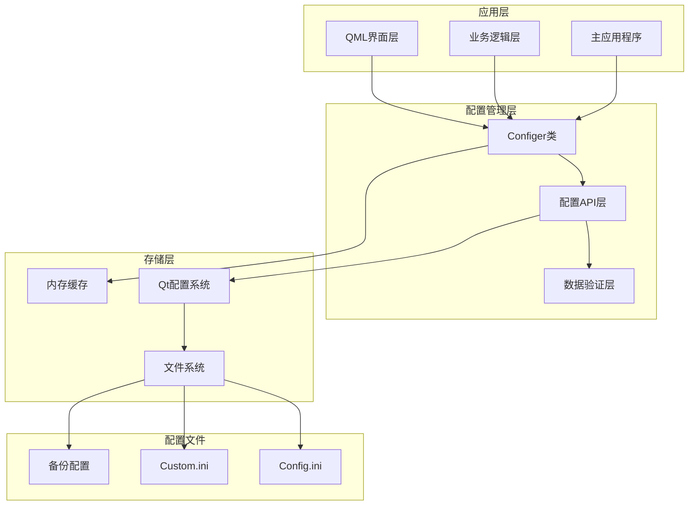

**图表来源**
- [configer.cpp:17-20](file://src/configer.cpp#L17-L20)
- [main.cpp:17-99](file://src/main.cpp#L17-L99)

**章节来源**
- [configer.cpp:17-20](file://src/configer.cpp#L17-L20)
- [main.cpp:17-99](file://src/main.cpp#L17-L99)

## 详细组件分析

### INI配置文件解析机制

配置文件解析基于Qt的QSettings类，支持多种数据类型的自动转换：

#### 解析流程

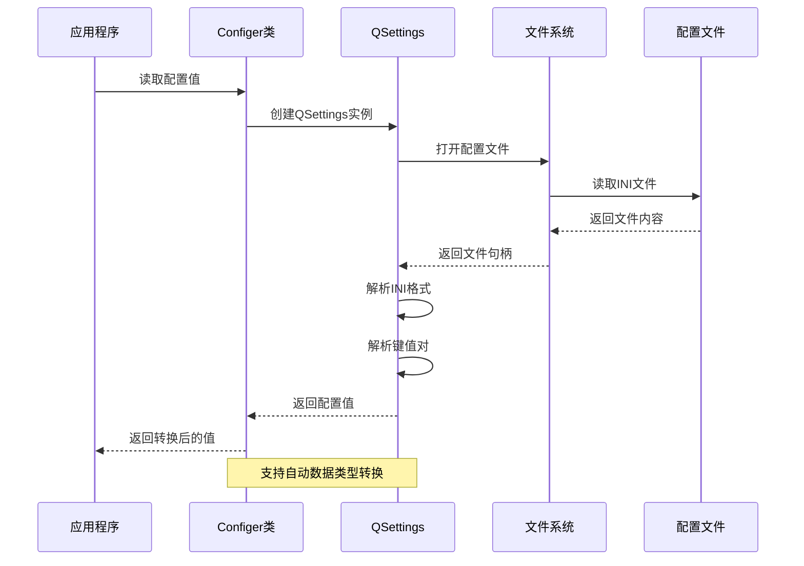

**图表来源**
- [configer.cpp:412-419](file://src/configer.cpp#L412-L419)

#### 数据类型处理

配置系统支持以下数据类型的自动转换：

| 数据类型 | 存储格式 | 读取转换 |
|---------|---------|---------|
| QString | 文本字符串 | toString() |
| int | 整数 | toInt() |
| bool | 1/0 或 true/false | toInt()比较 |
| double | 浮点数 | toDouble() |
| QStringList | 逗号分隔 | split(',') |

**章节来源**
- [configer.cpp:42-50](file://src/configer.cpp#L42-L50)
- [configer.cpp:102-112](file://src/configer.cpp#L102-L112)

### 配置项管理功能

#### 基础配置管理

配置项按照功能分类进行管理：

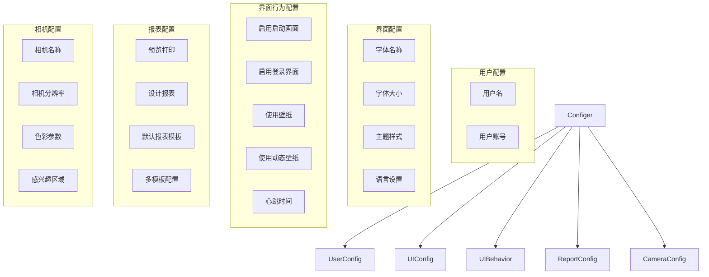

**图表来源**
- [configer.h:124-258](file://src/configer.h#L124-L258)

#### 配置项分类管理

配置项按照用途分为多个类别：

1. **用户信息类**：用户名、用户账号
2. **界面外观类**：字体、主题、语言
3. **界面行为类**：启动画面、登录界面、壁纸设置
4. **报表管理类**：打印预览、报表模板、多模板配置
5. **相机参数类**：相机设置、色彩参数、ROI区域

**章节来源**
- [configer.h:124-258](file://src/configer.h#L124-L258)

### 运行时配置更新机制

#### 实时更新流程

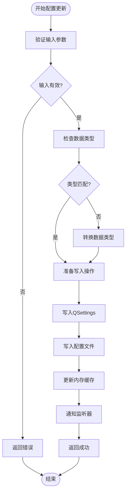

**图表来源**
- [configer.cpp:404-410](file://src/configer.cpp#L404-L410)

#### 配置变更监听

配置系统提供了信号机制来通知配置变更：

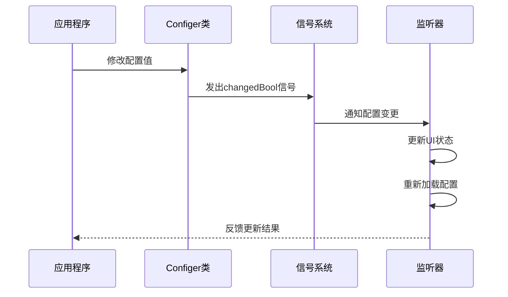

**图表来源**
- [configer.h:259-262](file://src/configer.h#L259-L262)

**章节来源**
- [configer.cpp:404-410](file://src/configer.cpp#L404-L410)
- [configer.h:259-262](file://src/configer.h#L259-L262)

### 配置持久化策略

#### 文件存储策略

配置数据采用INI格式进行持久化存储，支持以下特性：

1. **分组存储**：不同类型的配置存储在不同的组中
2. **默认值处理**：未设置的配置项使用默认值
3. **类型安全**：自动进行数据类型转换和验证
4. **原子操作**：配置写入采用原子操作确保数据一致性

#### 内存缓存机制

为了提高性能，配置系统实现了内存缓存机制：

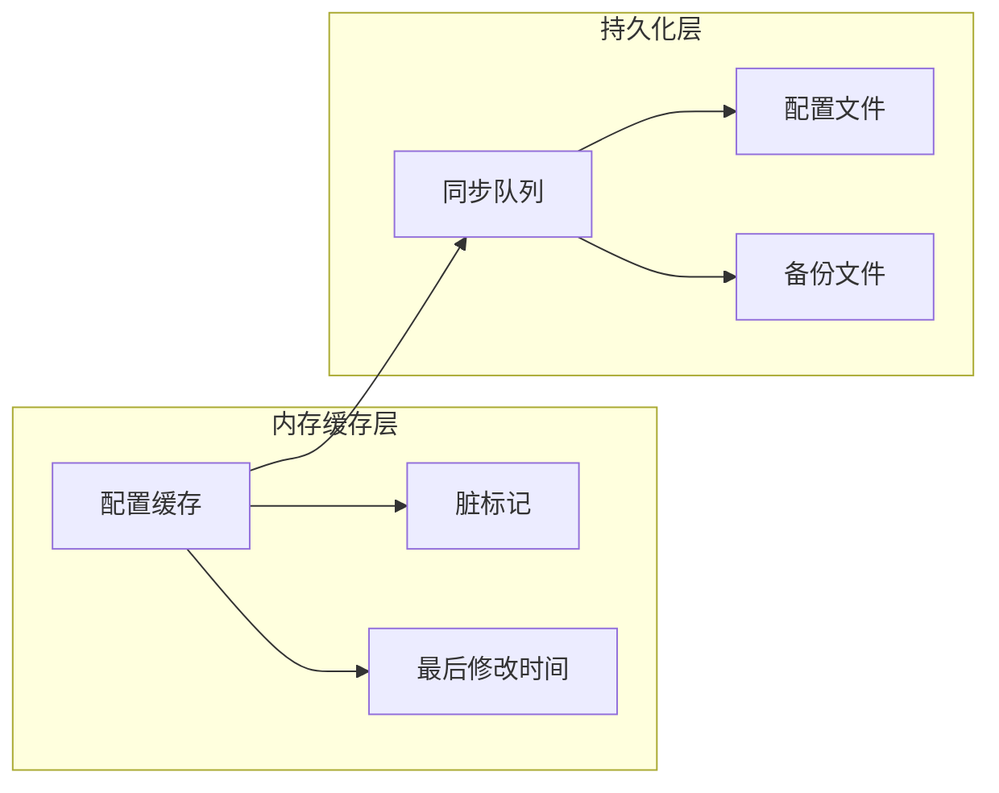

**图表来源**
- [configer.cpp:17-20](file://src/configer.cpp#L17-L20)

**章节来源**
- [configer.cpp:17-20](file://src/configer.cpp#L17-L20)

### API使用示例

#### 基础配置操作

以下示例展示了如何使用Configer类进行各种配置操作：

**读取配置**
```javascript
// 读取用户名称
let userName = Configer.userName();

// 读取当前语言
let currentLanguage = Configer.currLanguage();

// 读取字体设置
let fontName = Configer.fontName();
let fontSize = Configer.fontSize();
```

**写入配置**
```javascript
// 设置用户名称
Configer.setUserName("张三");

// 设置语言
Configer.setCurrLanguage("简体中文");

// 设置字体
Configer.setFontName("Microsoft YaHei");
Configer.setFontSize(18);
```

**复杂配置操作**
```javascript
// 设置相机参数
Configer.setCameraName("USB Camera");
Configer.setCameraSize("1920x1080");
Configer.setCameraHues(0, 0, 0, -8);
Configer.setCameraRoi(338, 185, 388, 347);

// 设置报表模板
Configer.setReportTemplate("A5横向报告单");
Configer.setReportPreviewed(true);
Configer.setReportDesigned(false);
```

**批量操作**
```javascript
// 批量设置界面配置
let interfaceConfigs = {
    "EnableSplash": 1,
    "EnableLogin": 0,
    "UseWallPaper": 1,
    "LiveWallPaper": 1,
    "SplashFormShowMode": 1,
    "LoginFormShowMode": 1,
    "MainFormShowMode": 0
};

// 批量应用配置
for (let [key, value] of Object.entries(interfaceConfigs)) {
    Configer[key] = value;
}
```

**章节来源**
- [Preferences.qml:32-78](file://src/QmlUI/Preferences.qml#L32-L78)
- [Main.qml:8-39](file://src/QmlUI/Main.qml#L8-L39)

## 依赖关系分析

### 组件耦合度分析

配置管理模块的依赖关系相对简单，主要依赖于Qt框架的基础组件：

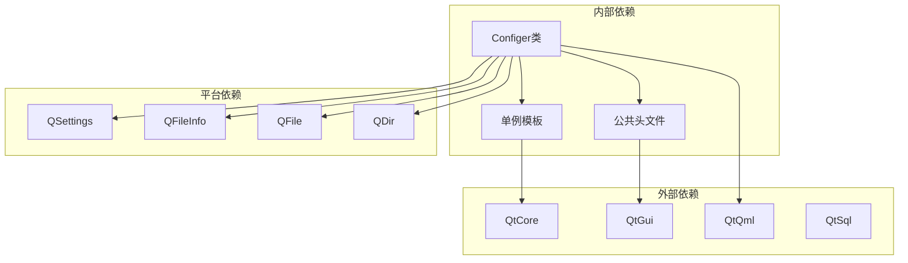

**图表来源**
- [configer.h:17-22](file://src/configer.h#L17-L22)
- [configer.cpp:1-10](file://src/configer.cpp#L1-L10)

### 错误处理和异常管理

配置系统实现了完善的错误处理机制：

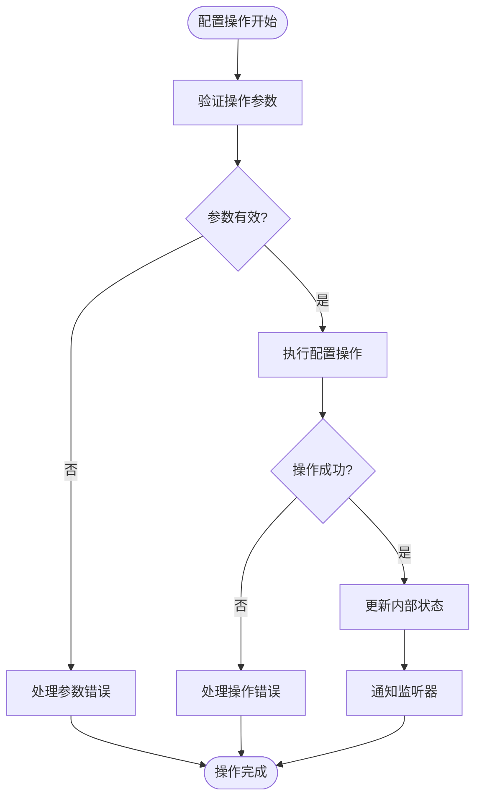

**图表来源**
- [common.h:63-117](file://src/common.h#L63-L117)

**章节来源**
- [common.h:63-117](file://src/common.h#L63-L117)

## 性能考虑

### 缓存策略

配置系统采用了多层次的缓存策略来提高性能：

1. **内存缓存**：最近访问的配置项存储在内存中
2. **文件缓存**：配置文件的元数据缓存
3. **类型缓存**：数据类型转换结果缓存

### 异步操作

对于可能阻塞的操作，配置系统提供了异步处理机制：

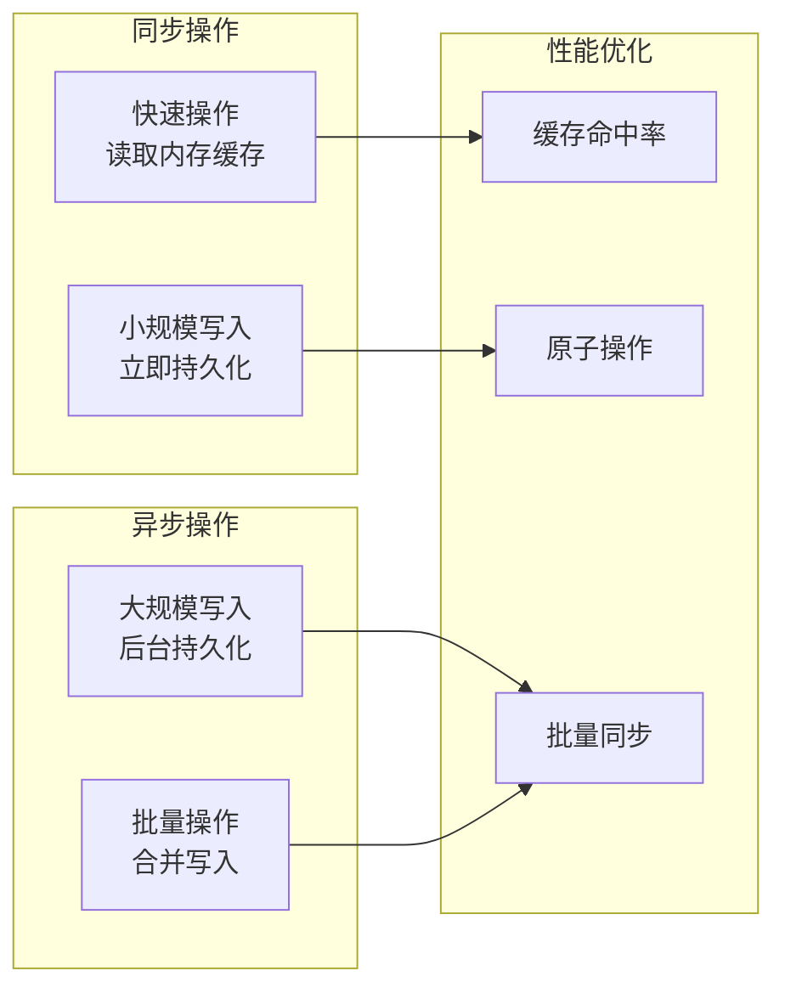

### 内存管理

配置系统使用智能指针和RAII原则来管理内存：

- **unique_ptr**：用于单例实例的生命周期管理
- **QVector/QList**：用于动态数组的内存管理
- **QString**：Qt字符串的自动内存管理

## 故障排除指南

### 常见问题诊断

#### 配置文件读取失败

**症状**：应用程序启动时配置读取失败

**可能原因**：
1. 配置文件不存在或路径错误
2. 文件权限不足
3. 文件格式损坏
4. 编码格式不正确

**解决方案**：
```cpp
// 检查配置文件是否存在
if (!QFileInfo::exists(CFG_FILE)) {
    // 创建默认配置文件
    createDefaultConfig();
}

// 检查文件权限
QFile file(CFG_FILE);
if (!file.open(QIODevice::ReadOnly)) {
    // 尝试修复权限
    QFile::setPermissions(CFG_FILE, QFileDevice::ReadOwner | QFileDevice::WriteOwner);
}
```

#### 配置值类型不匹配

**症状**：配置读取返回意外的数据类型

**可能原因**：
1. 配置文件中存储了错误的数据类型
2. 代码中期望的数据类型与实际不符

**解决方案**：
```cpp
// 使用类型安全的读取方法
QString stringValue = readValue("key", "group", "file").toString();
int intValue = readValue("key", "group", "file").toInt();
bool boolValue = readValue("key", "group", "file").toInt() == 1;
```

#### 配置更新不生效

**症状**：修改配置后应用程序没有反映新的设置

**可能原因**：
1. 配置没有正确写入磁盘
2. 应用程序没有重新加载配置
3. 缓存中的旧配置值

**解决方案**：
```cpp
// 确保配置正确写入
writeValue("key", newValue, "group", "file");
QSettings::sync(); // 强制同步到磁盘

// 重新加载配置
reloadConfig();
```

**章节来源**
- [configer.cpp:404-419](file://src/configer.cpp#L404-L419)
- [common.h:100-117](file://src/common.h#L100-L117)

## 结论

配置管理模块是一个设计良好、功能完整的配置管理系统。它基于Qt框架构建，具有以下特点：

1. **模块化设计**：采用单例模式和清晰的接口设计
2. **类型安全**：支持多种数据类型的自动转换和验证
3. **持久化可靠**：采用原子操作确保数据一致性
4. **易于扩展**：支持新的配置项和配置组的添加
5. **性能优化**：实现了内存缓存和批量操作机制

该模块为整个应用程序提供了稳定可靠的配置管理基础，支持运行时配置更新、配置变更监听和热重载等功能，满足了现代应用程序对配置管理的需求。

## 附录

### 配置文件格式规范

#### INI文件结构

配置文件采用标准的INI格式，支持分组和注释：

```ini
[group]
key=value
key2=value2
; 这是注释
```

#### 特殊键值格式

某些配置项支持特殊的键值格式：

```ini
; 布尔值配置
EnableSplash=1
EnableLogin=0

; 多值配置
CameraHuesH=0
CameraHuesS=0
CameraHuesL=0
CameraHuesC=-8

; 路径配置
ImagePath=D:/LtsImage
HospitalLogo1=/path/to/logo.png
```

### 错误码定义

配置模块使用统一的错误码体系：

| 错误码 | 含义 | 描述 |
|--------|------|------|
| 1501 | ConfigNotFound | 配置文件不存在 |
| 1502 | ConfigParseFailed | 配置解析失败 |
| 1503 | ConfigInvalid | 配置无效 |

**章节来源**
- [common.h:100-117](file://src/common.h#L100-L117)