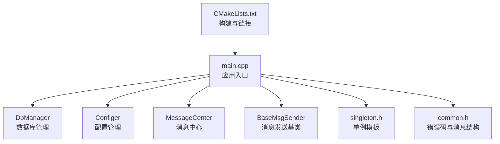
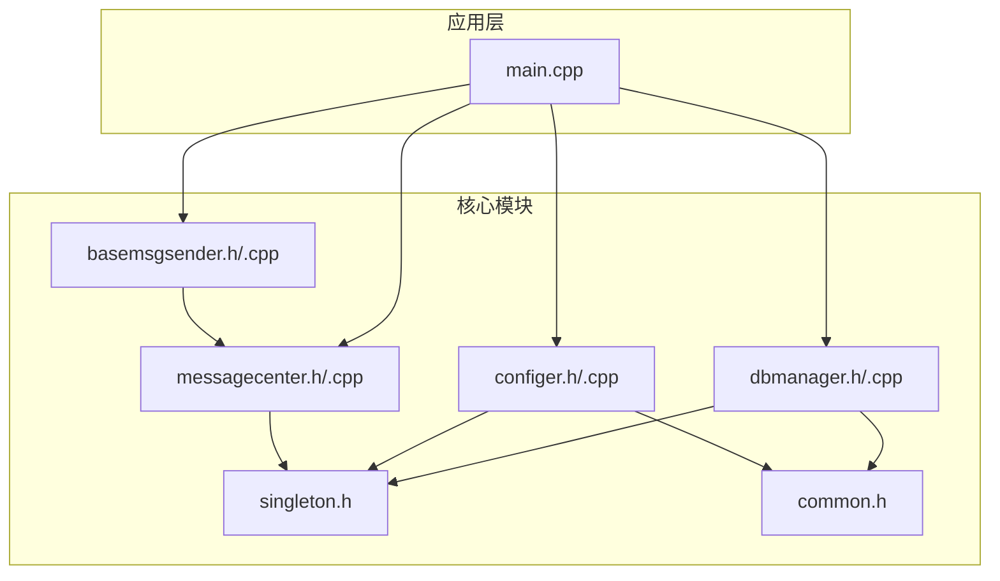
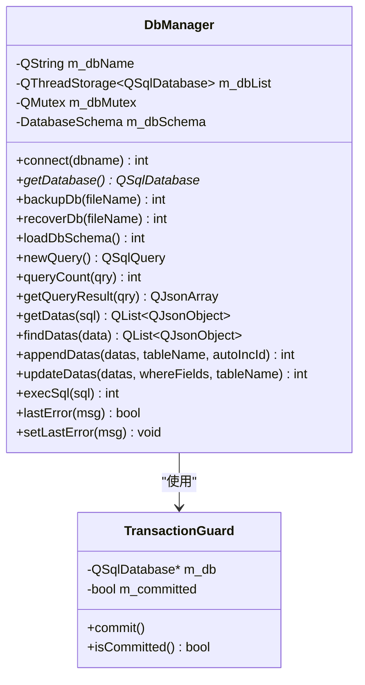
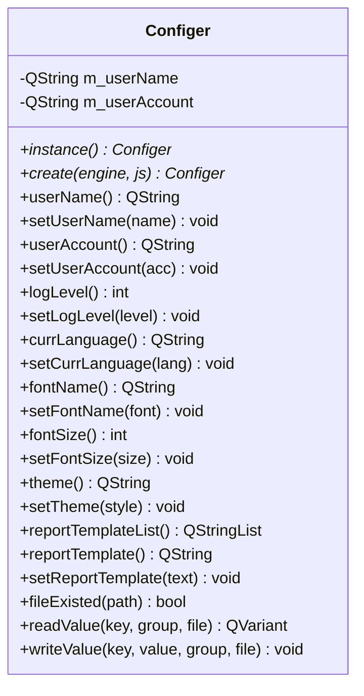
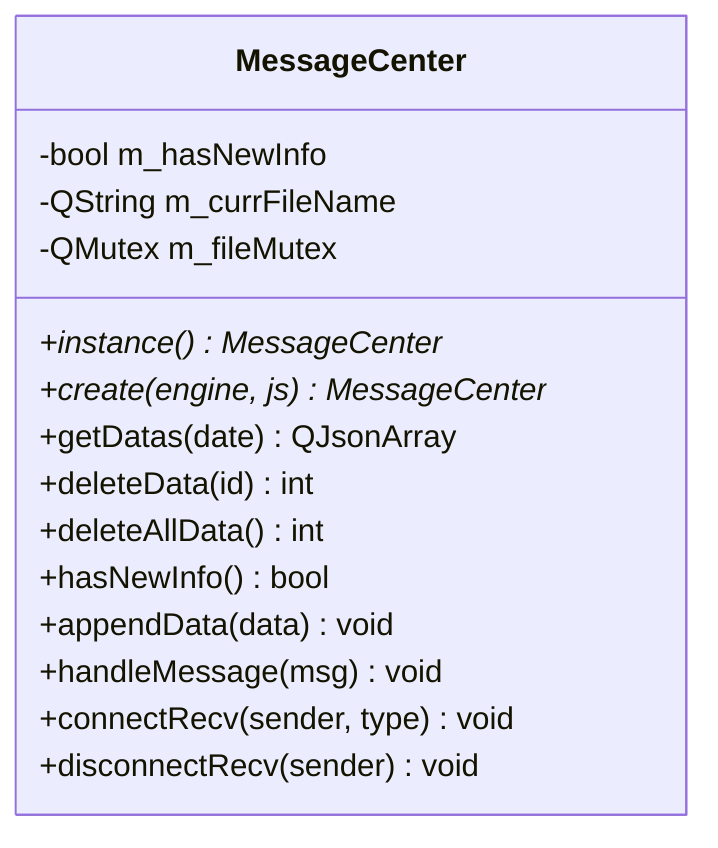
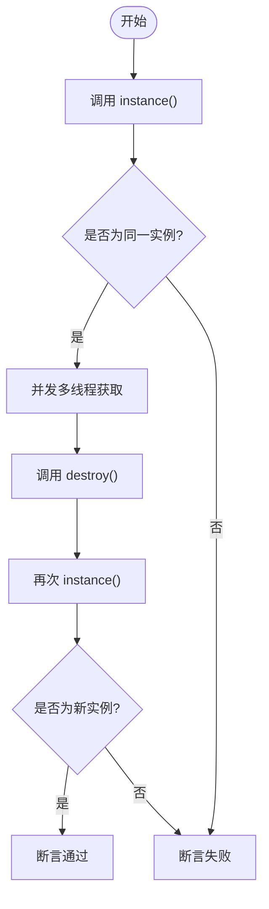
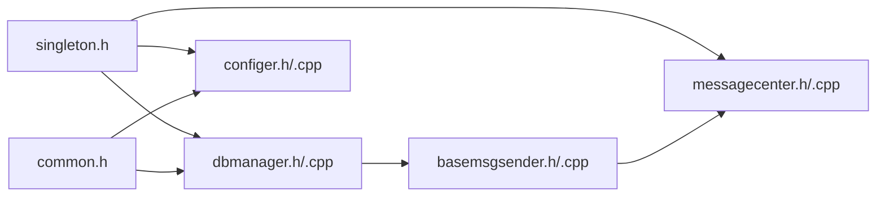

# 单元测试

<cite>
**本文引用的文件**
- [CMakeLists.txt](file://CMakeLists.txt)
- [main.cpp](file://src/main.cpp)
- [singleton.h](file://src/singleton.h)
- [common.h](file://src/common.h)
- [basemsgsender.h](file://src/basemsgsender.h)
- [basemsgsender.cpp](file://src/basemsgsender.cpp)
- [dbmanager.h](file://src/dbmanager.h)
- [dbmanager.cpp](file://src/dbmanager.cpp)
- [configer.h](file://src/configer.h)
- [configer.cpp](file://src/configer.cpp)
- [messagecenter.h](file://src/messagecenter.h)
- [messagecenter.cpp](file://src/messagecenter.cpp)
</cite>

## 目录
1. [引言](#引言)
2. [项目结构](#项目结构)
3. [核心组件](#核心组件)
4. [架构总览](#架构总览)
5. [详细组件分析](#详细组件分析)
6. [依赖分析](#依赖分析)
7. [性能考虑](#性能考虑)
8. [故障排查指南](#故障排查指南)
9. [结论](#结论)
10. [附录](#附录)

## 引言
本文件面向QmlPlugins项目的C++核心模块，系统化地阐述单元测试的概念与实践方法，重点覆盖DbManager、Configer、MessageCenter等关键类的测试策略，并给出测试用例设计原则、断言方法、测试数据准备策略、Mock对象的创建与使用、单例模式测试要点，以及测试覆盖率建议。目标是帮助开发者以最小成本构建高可靠性的测试体系。

## 项目结构
QmlPlugins采用Qt6 + CMake工程组织，核心C++模块位于src目录，包含数据库访问、配置管理、消息中心、基础消息发送器、单例模板等。CMakeLists集中管理构建、链接与安装流程；入口程序负责初始化应用、注册元类型、建立数据库连接、加载翻译与QML。

图示来源
- [CMakeLists.txt:1-137](file://CMakeLists.txt#L1-L137)
- [main.cpp:1-99](file://src/main.cpp#L1-L99)

章节来源
- [CMakeLists.txt:1-137](file://CMakeLists.txt#L1-L137)
- [main.cpp:17-50](file://src/main.cpp#L17-L50)

## 核心组件
- 单例模板：提供线程安全、无异常、可显式销毁的单例实现，便于测试时重置状态。
- 错误码与消息结构：统一错误码与消息结构，便于断言与日志一致性。
- 基础消息发送器：统一连接消息中心，便于测试消息链路。
- 数据库管理器：封装SQLite连接、事务、Schema加载、增删改查、备份/恢复等。
- 配置管理器：基于QSettings的INI读写，提供大量QML可用的配置项。
- 消息中心：基于文件的错误信息持久化与转发，提供连接上游消息源的能力。

章节来源
- [singleton.h:1-81](file://src/singleton.h#L1-L81)
- [common.h:50-159](file://src/common.h#L50-L159)
- [basemsgsender.h:10-38](file://src/basemsgsender.h#L10-L38)
- [dbmanager.h:52-192](file://src/dbmanager.h#L52-L192)
- [configer.h:98-277](file://src/configer.h#L98-L277)
- [messagecenter.h:27-127](file://src/messagecenter.h#L27-L127)

## 架构总览
下图展示应用启动时与核心模块的交互关系，以及测试阶段可替换的关键点（如数据库连接、配置文件、消息链路）。

图示来源
- [main.cpp:32-50](file://src/main.cpp#L32-L50)
- [dbmanager.cpp:43-50](file://src/dbmanager.cpp#L43-L50)
- [configer.cpp:17-20](file://src/configer.cpp#L17-L20)
- [messagecenter.cpp:15-25](file://src/messagecenter.cpp#L15-L25)

## 详细组件分析

### DbManager 单元测试
DbManager是数据库访问的核心，测试应覆盖：
- 连接管理：空数据库名、连接失败、WAL与busy_timeout设置、断线重连。
- Schema加载：表与字段信息解析、类型识别、主键/自增/可空判断。
- 事务：TransactionGuard的RAII行为、commit/rollback。
- 增删改查：参数绑定、占位符、错误处理、lastError。
- 备份/恢复：文件存在性、拷贝/删除、回滚机制。
- 线程安全：多线程下的连接隔离与互斥保护。

测试策略与断言
- 使用临时SQLite文件进行端到端测试，避免污染生产环境。
- 对错误路径断言错误码与lastError消息，确保异常分支覆盖。
- 使用Mock或桩函数模拟QSqlDatabase/QSqlQuery的失败场景，验证异常处理。
- 验证WAL与busy_timeout设置对并发写入的影响，断言“database is locked”不再出现。

图示来源
- [dbmanager.h:37-50](file://src/dbmanager.h#L37-L50)
- [dbmanager.h:52-192](file://src/dbmanager.h#L52-L192)

章节来源
- [dbmanager.cpp:51-90](file://src/dbmanager.cpp#L51-L90)
- [dbmanager.cpp:118-223](file://src/dbmanager.cpp#L118-L223)
- [dbmanager.cpp:225-350](file://src/dbmanager.cpp#L225-L350)
- [dbmanager.cpp:437-498](file://src/dbmanager.cpp#L437-L498)
- [dbmanager.cpp:500-553](file://src/dbmanager.cpp#L500-L553)
- [dbmanager.cpp:555-576](file://src/dbmanager.cpp#L555-L576)
- [dbmanager.cpp:578-599](file://src/dbmanager.cpp#L578-L599)
- [dbmanager.cpp:601-699](file://src/dbmanager.cpp#L601-L699)
- [dbmanager.cpp:769-793](file://src/dbmanager.cpp#L769-L793)

### Configer 单元测试
Configer提供大量QML可用的配置项，测试应关注：
- 读写一致性：键值读取与写入，分组与文件路径。
- 类型转换：整型/布尔/字符串的正确转换与默认值。
- QML单例：create方法返回同一实例，避免重复初始化。
- 文件存在性：fileExisted的路径判断。
- 报表模板：扫描.lrxml文件列表与默认模板读写。

测试策略与断言
- 使用临时INI文件进行隔离测试，断言读写前后一致。
- 针对布尔值的1/0映射进行边界测试。
- 通过SINGLETON宏与instance()方法验证单例唯一性。
- 对路径拼接与相对路径进行跨平台断言。

图示来源
- [configer.h:98-277](file://src/configer.h#L98-L277)
- [configer.cpp:22-40](file://src/configer.cpp#L22-L40)
- [configer.cpp:404-419](file://src/configer.cpp#L404-L419)

章节来源
- [configer.cpp:22-40](file://src/configer.cpp#L22-L40)
- [configer.cpp:42-50](file://src/configer.cpp#L42-L50)
- [configer.cpp:52-60](file://src/configer.cpp#L52-L60)
- [configer.cpp:231-251](file://src/configer.cpp#L231-L251)
- [configer.cpp:404-419](file://src/configer.cpp#L404-L419)

### MessageCenter 单元测试
MessageCenter负责错误信息的持久化与转发，测试应覆盖：
- 文件读写：按日期生成INI文件，分组与键值写入。
- 删除与清空：按ID删除、清空当日。
- 新信息标记：hasNewInfo状态变化。
- 消息接收：handleMessage对非成功错误码的保存与转发。
- 线程安全：多线程下的互斥保护。

测试策略与断言
- 使用临时目录模拟ErrorInfo，断言文件内容与JSON结构。
- 针对空日期与默认日期进行断言。
- 断言消息转发至messageEmitted信号。
- 验证连接/断开上游消息源的正确性。

图示来源
- [messagecenter.h:27-127](file://src/messagecenter.h#L27-L127)
- [messagecenter.cpp:27-99](file://src/messagecenter.cpp#L27-L99)

章节来源
- [messagecenter.cpp:27-59](file://src/messagecenter.cpp#L27-L59)
- [messagecenter.cpp:61-76](file://src/messagecenter.cpp#L61-L76)
- [messagecenter.cpp:78-81](file://src/messagecenter.cpp#L78-L81)
- [messagecenter.cpp:83-99](file://src/messagecenter.cpp#L83-L99)
- [messagecenter.cpp:101-116](file://src/messagecenter.cpp#L101-L116)

### 单例模式测试
单例测试的关键在于：
- 唯一性：多次instance()返回同一指针。
- 线程安全：多线程同时获取实例不产生竞争。
- 可销毁：destroy()后再次获取应重建实例。
- 与Qt对象生命周期：确保QObject派生类的单例在应用生命周期内正确管理。

测试策略与断言
- 使用singleton.h提供的instance()/destroy()/isInitialized()进行断言。
- 在测试夹具中先destroy()再instance()，确保每次测试独立。
- 结合DbManager/Configer/MessageCenter的SINGLETON宏验证。

图示来源
- [singleton.h:28-50](file://src/singleton.h#L28-L50)

章节来源
- [singleton.h:28-50](file://src/singleton.h#L28-L50)
- [dbmanager.h:75](file://src/dbmanager.h#L75)
- [configer.h:109](file://src/configer.h#L109)
- [messagecenter.h:38](file://src/messagecenter.h#L38)

### 测试用例设计原则
- 单一职责：每个测试只验证一个功能点或一条分支。
- 可重复性：测试数据与环境隔离，避免副作用。
- 可维护性：测试命名清晰，断言明确，便于回归。
- 覆盖关键路径：构造/析构、异常分支、边界条件、并发场景。

### 断言方法
- 条件断言：断言返回值、错误码、布尔标志。
- 状态断言：断言内部状态（如lastError、hasNewInfo）。
- 文件断言：断言INI文件内容与结构。
- 信号断言：断言消息中心发出的messageEmitted信号。

### 测试数据准备策略
- 临时文件：使用QTemporaryDir/QTemporaryFile创建隔离的数据库与配置文件。
- Mock对象：对QSqlDatabase/QSqlQuery进行Mock，模拟失败场景。
- 固定种子：对随机性相关的逻辑使用固定种子或禁用随机性。

### Mock对象的创建与使用
- 使用Qt测试框架的QSignalSpy/QTest模拟信号与槽。
- 对外部依赖（如QSettings、QSqlDatabase）进行接口抽象或使用测试替身。
- 对文件系统操作使用QTemporaryDir，避免真实磁盘IO。

## 依赖分析
DbManager/Configer/MessageCenter均依赖单例模板与错误码体系；DbManager还依赖BaseMsgSender的消息转发能力。下图展示模块间的依赖关系。

图示来源
- [dbmanager.h:19-21](file://src/dbmanager.h#L19-L21)
- [configer.h:17](file://src/configer.h#L17)
- [messagecenter.h:17-19](file://src/messagecenter.h#L17-L19)
- [basemsgsender.h:4-7](file://src/basemsgsender.h#L4-L7)
- [common.h:50-159](file://src/common.h#L50-L159)

章节来源
- [dbmanager.h:19-21](file://src/dbmanager.h#L19-L21)
- [configer.h:17](file://src/configer.h#L17)
- [messagecenter.h:17-19](file://src/messagecenter.h#L17-L19)
- [basemsgsender.h:4-7](file://src/basemsgsender.h#L4-L7)
- [common.h:50-159](file://src/common.h#L50-L159)

## 性能考虑
- 测试并发：对多线程场景进行压力测试，验证互斥与事务的性能影响。
- I/O隔离：使用内存文件系统或临时目录，减少磁盘I/O对测试的影响。
- 数据规模：对大批量插入/查询进行基准测试，评估事务与索引策略。

## 故障排查指南
- 数据库连接失败：检查数据库文件路径、权限与WAL设置；断言错误码与lastError消息。
- 配置读写异常：确认INI文件路径与分组；断言读写一致性。
- 消息未转发：检查BaseMsgSender的连接与disconnect时机；断言messageEmitted信号。
- 单例状态异常：使用destroy()重置实例；断言isInitialized()与instance()一致性。

章节来源
- [dbmanager.cpp:51-90](file://src/dbmanager.cpp#L51-L90)
- [dbmanager.cpp:769-793](file://src/dbmanager.cpp#L769-L793)
- [configer.cpp:404-419](file://src/configer.cpp#L404-L419)
- [messagecenter.cpp:101-116](file://src/messagecenter.cpp#L101-L116)
- [basemsgsender.cpp:5-21](file://src/basemsgsender.cpp#L5-L21)

## 结论
通过对DbManager、Configer、MessageCenter等核心模块的系统化测试设计，结合单例模式与错误码体系，可以有效提升代码质量与稳定性。建议以隔离环境与Mock对象为基础，覆盖关键路径与异常分支，并持续改进测试覆盖率与执行效率。

## 附录
- 测试覆盖率建议
  - 关键模块（DbManager/Configer/MessageCenter）达到80%以上行覆盖率与分支覆盖率。
  - 对异常路径与并发场景进行专项测试，确保鲁棒性。
- 构建与运行
  - 使用CMake构建测试目标，链接Qt6::Test与Qt6::Sql。
  - 在CI中集成测试执行与覆盖率报告生成。

章节来源
- [CMakeLists.txt:22-26](file://CMakeLists.txt#L22-L26)
- [CMakeLists.txt:95-100](file://CMakeLists.txt#L95-L100)