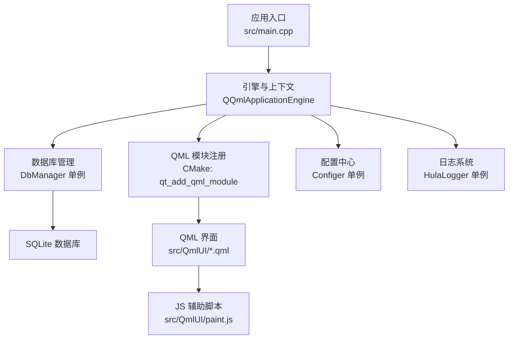
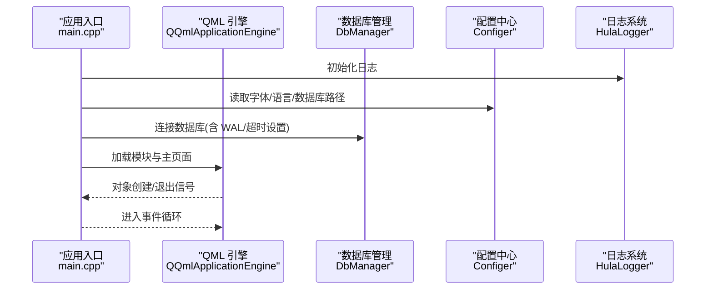
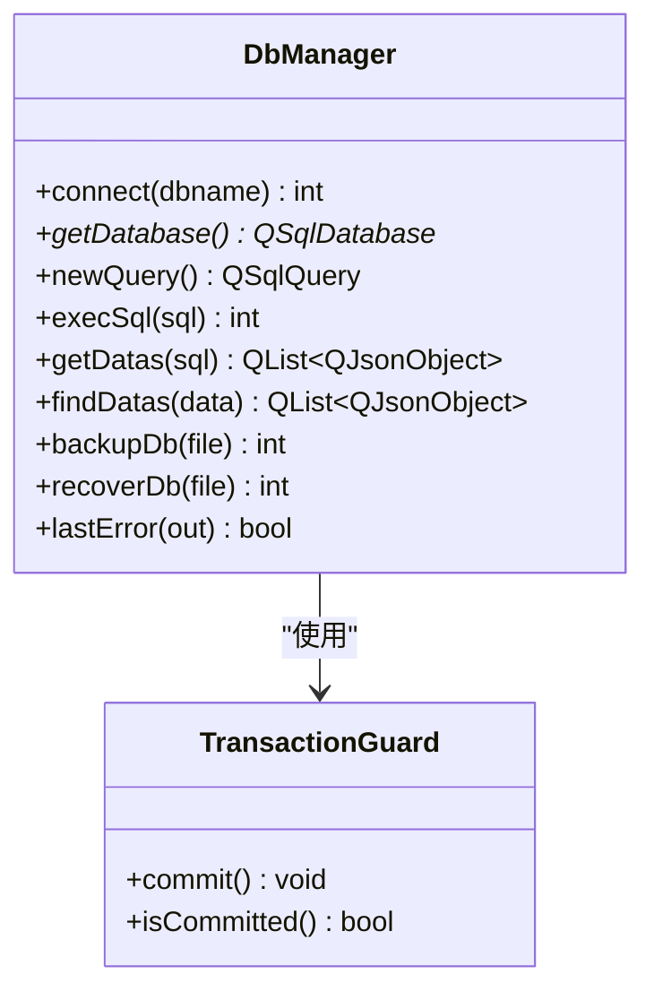
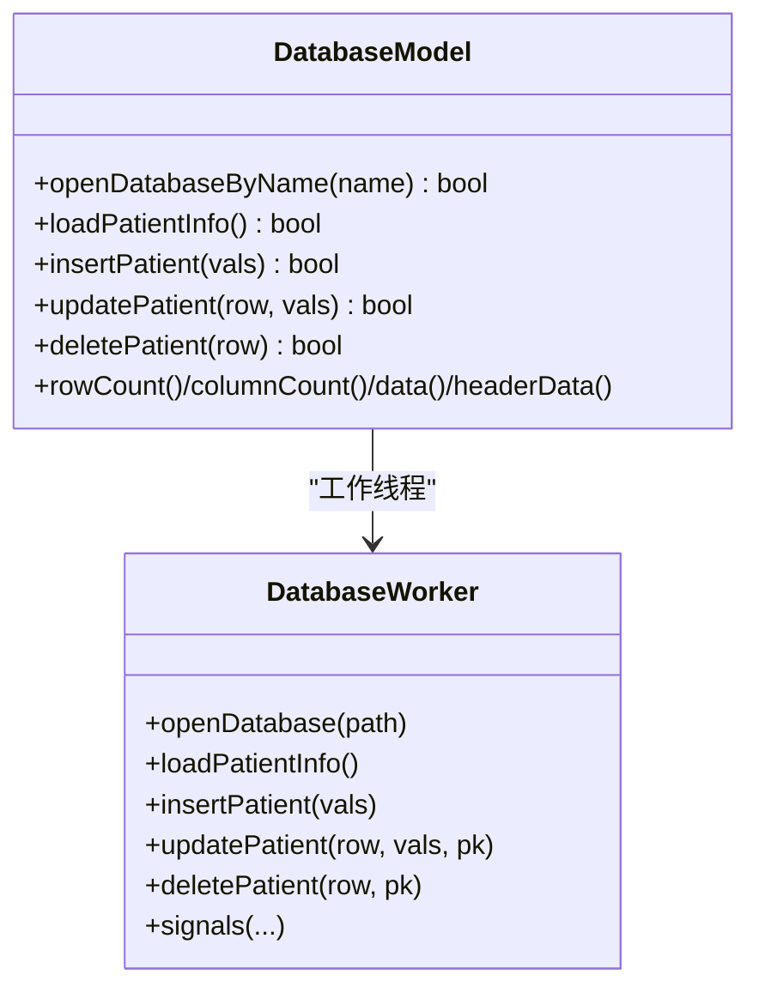
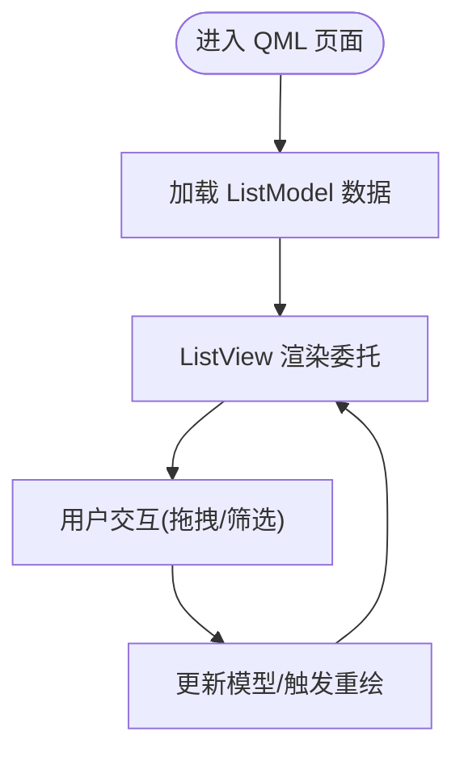
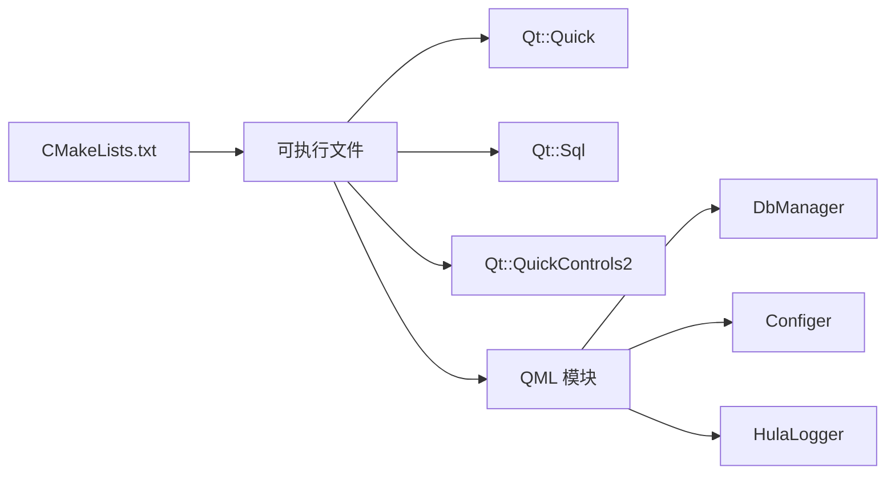

# 性能测试

<cite>
**本文引用的文件**
- [README.md](file://README.md)
- [CMakeLists.txt](file://CMakeLists.txt)
- [src/main.cpp](file://src/main.cpp)
- [src/dbmanager.h](file://src/dbmanager.h)
- [src/dbmanager.cpp](file://src/dbmanager.cpp)
- [src/databasemodel.h](file://src/databasemodel.h)
- [src/databasemodel.cpp](file://src/databasemodel.cpp)
- [src/hulalogger.h](file://src/hulalogger.h)
- [src/configer.h](file://src/configer.h)
- [src/common.h](file://src/common.h)
- [src/QmlUI/paint.js](file://src/QmlUI/paint.js)
- [src/QmlUI/TestTable.qml](file://src/QmlUI/TestTable.qml)
</cite>

## 目录
1. [引言](#引言)
2. [项目结构](#项目结构)
3. [核心组件](#核心组件)
4. [架构总览](#架构总览)
5. [详细组件分析](#详细组件分析)
6. [依赖关系分析](#依赖关系分析)
7. [性能考虑](#性能考虑)
8. [故障排查指南](#故障排查指南)
9. [结论](#结论)
10. [附录](#附录)

## 引言
本文件为 QmlPlugins 项目的性能测试与优化指南，聚焦于响应时间、内存使用、CPU 占用与数据库查询性能等关键指标，提供基准测试（负载/压力/并发）的实施步骤、性能监控工具使用建议、优化策略以及性能回归测试的自动化方案。文档同时结合项目现有代码结构，给出可落地的测试流程与观测点。

## 项目结构
QmlPlugins 是基于 Qt6/QML 的跨平台应用，采用 CMake 构建，核心由 C++ 层（DbManager、Configer、Logger 等）与 QML 层（界面与交互）组成，并通过 SQLite 进行本地数据持久化。构建与运行方式见根目录说明与 CMake 配置。

图示来源
- [src/main.cpp:17-96](file://src/main.cpp#L17-L96)
- [CMakeLists.txt:80-93](file://CMakeLists.txt#L80-L93)

章节来源
- [README.md:22-34](file://README.md#L22-L34)
- [CMakeLists.txt:23-100](file://CMakeLists.txt#L23-L100)

## 核心组件
- 应用入口与生命周期：负责平台环境设置、单实例检测、日志初始化、QML 引擎加载与事件循环。
- 数据库层（DbManager）：提供线程本地数据库连接、事务守卫、查询封装、错误上报与 WAL/busy_timeout 优化。
- 数据模型层（DatabaseModel）：基于 QAbstractTableModel 与 Worker 线程，分离 UI 与数据库操作。
- 配置中心（Configer）：提供运行时配置项（字体、语言、主题、数据库路径等）。
- 日志系统（HulaLogger）：线程安全、支持轮转与清理，便于性能问题定位。
- QML 与 JS：界面交互与简单绘图逻辑，涉及渲染与 JS 计算开销。

章节来源
- [src/main.cpp:17-96](file://src/main.cpp#L17-L96)
- [src/dbmanager.h:52-191](file://src/dbmanager.h#L52-L191)
- [src/dbmanager.cpp:67-90](file://src/dbmanager.cpp#L67-L90)
- [src/databasemodel.h:49-96](file://src/databasemodel.h#L49-L96)
- [src/configer.h:98-277](file://src/configer.h#L98-L277)
- [src/hulalogger.h:49-175](file://src/hulalogger.h#L49-L175)

## 架构总览
下图展示应用启动到 QML 加载的关键流程，以及数据库与日志在其中的作用。

图示来源
- [src/main.cpp:32-50](file://src/main.cpp#L32-L50)
- [src/dbmanager.cpp:67-90](file://src/dbmanager.cpp#L67-L90)
- [CMakeLists.txt:80-93](file://CMakeLists.txt#L80-L93)

## 详细组件分析

### 数据库层（DbManager）性能要点
- 线程本地连接：每个工作线程持有独立 QSqlDatabase 实例，减少锁竞争。
- 事务守卫：RAII 事务守卫确保未显式提交时自动回滚，降低一致性风险。
- WAL 模式与 busy_timeout：提升并发读写稳定性，降低“database is locked”概率。
- 查询结果转换：统一 JSON 结果序列化，注意大数据量时的内存占用与拷贝成本。

图示来源
- [src/dbmanager.h:52-191](file://src/dbmanager.h#L52-L191)

章节来源
- [src/dbmanager.h:52-191](file://src/dbmanager.h#L52-L191)
- [src/dbmanager.cpp:67-90](file://src/dbmanager.cpp#L67-L90)
- [src/dbmanager.cpp:352-406](file://src/dbmanager.cpp#L352-L406)

### 数据模型层（DatabaseModel）性能要点
- 线程分离：数据库操作在独立线程中进行，避免阻塞 UI。
- 信号槽解耦：通过信号通知 UI 更新，降低耦合度。
- 数据缓存：内存中维护表头与数据，频繁读取无需重复查询。

图示来源
- [src/databasemodel.h:49-96](file://src/databasemodel.h#L49-L96)

章节来源
- [src/databasemodel.h:20-47](file://src/databasemodel.h#L20-L47)
- [src/databasemodel.cpp:10-44](file://src/databasemodel.cpp#L10-L44)

### QML 与 JS 交互性能要点
- TestTable.qml 使用 ListView + ListModel，适合中等规模数据展示；需关注项数增长对渲染的影响。
- paint.js 提供简单矩形绘制与拖拽逻辑，计算量小但需避免频繁重绘与不必要的上下文操作。

图示来源
- [src/QmlUI/TestTable.qml:26-134](file://src/QmlUI/TestTable.qml#L26-L134)
- [src/QmlUI/paint.js:69-89](file://src/QmlUI/paint.js#L69-L89)

章节来源
- [src/QmlUI/TestTable.qml:1-136](file://src/QmlUI/TestTable.qml#L1-136)
- [src/QmlUI/paint.js:1-139](file://src/QmlUI/paint.js#L1-L139)

## 依赖关系分析
- 构建与链接：CMake 将 C++ 源码与 QML 源码打包为 QML 模块，链接 Qt Quick、Sql、QuickControls2。
- 运行时依赖：SQLite3、Qt6.7+、C++20 编译器。
- 组件耦合：DbManager 与 DatabaseModel 通过线程与信号解耦；Configer 与 Logger 作为全局单例被广泛使用。

图示来源
- [CMakeLists.txt:23-100](file://CMakeLists.txt#L23-L100)

章节来源
- [CMakeLists.txt:23-100](file://CMakeLists.txt#L23-L100)

## 性能考虑

### 测试指标定义
- 响应时间
  - UI 响应：从用户点击到界面可见变化的时间（如列表筛选、弹窗关闭计时）。
  - 数据查询：单次 SQL 执行耗时（含 prepare/exec/finish）。
- 内存使用
  - 应用进程常驻内存、峰值内存、大列表渲染时的临时内存。
- CPU 占用
  - UI 线程与数据库线程的 CPU 分担，JS 计算密集场景（如绘制）。
- 数据库查询性能
  - 连接建立、WAL/超时配置有效性、批量插入/更新的吞吐与延迟。

### 基准测试实施方法
- 负载测试
  - 场景：模拟日常使用（登录、打开主界面、浏览表格、切换主题、语言）。
  - 指标：平均/第95百分位响应时间、内存曲线、CPU 分布。
  - 工具：系统自带性能分析器（Windows Performance Analyzer/Linux perf）、Qt 性能分析器。
- 压力测试
  - 场景：大量数据导入/导出、高频切换主题/语言、持续打开/关闭窗口。
  - 指标：崩溃率、卡顿次数、内存泄漏、数据库锁等待次数。
- 并发测试
  - 场景：多线程并发查询/更新、UI 与数据库线程同时高负载。
  - 指标：死锁/锁等待时间、事务回滚率、查询超时比例。

### 性能监控工具使用
- Qt 性能分析器
  - 使用 Qt Creator 的 Profiler 插件，观察 UI 线程与 Worker 线程的热点函数、调用栈。
- 系统监控工具
  - Windows：任务管理器/资源监视器、WPA。
  - Linux：top/htop、perf、valgrind/callgrind、massif。
  - macOS：Activity Monitor、Instruments。
- 日志与统计
  - 启用 HulaLogger 至 Debug 级别，记录关键路径耗时与错误码，结合 Configer 的日志开关进行快速定位。

章节来源
- [src/hulalogger.h:49-175](file://src/hulalogger.h#L49-L175)
- [src/configer.h:133-134](file://src/configer.h#L133-L134)

### 性能优化建议
- 数据库侧
  - 使用 WAL 模式与合理的 busy_timeout，避免写入阻塞。
  - 大查询分页或懒加载，减少一次性 JSON 序列化开销。
  - 批量插入/更新使用事务（TransactionGuard）包裹，降低事务切换成本。
- UI 侧
  - ListView 与委托尽量轻量化，避免深层嵌套与昂贵的表达式计算。
  - 控制图片尺寸与数量，避免过度重绘。
- 线程与锁
  - 保持 UI 线程无阻塞；将数据库与文件 IO 放入 Worker 线程。
  - 减少共享数据的临界区范围，必要时使用细粒度锁。
- 日志与诊断
  - 生产环境适度降低日志级别，避免 I/O 影响；测试环境开启详细日志以定位瓶颈。

章节来源
- [src/dbmanager.cpp:67-90](file://src/dbmanager.cpp#L67-L90)
- [src/dbmanager.cpp:352-406](file://src/dbmanager.cpp#L352-L406)
- [src/databasemodel.h:49-96](file://src/databasemodel.h#L49-L96)

### 性能回归测试自动化方案
- CI 集成
  - 在 CI 中增加性能基线任务：构建 Release 版本，运行一组固定场景（如“打开主界面”、“加载表格”、“数据库查询”）。
- 指标收集
  - 使用系统性能分析器导出 CSV/JSON 指标（CPU/内存/响应时间），并与历史基线对比。
- 报告与阈值
  - 设定阈值（如响应时间上升超过 10% 视为回归），失败即阻断合并。
- 可重复性
  - 固定硬件环境或使用容器化，避免环境漂移导致误报。

## 故障排查指南
- 数据库连接失败/锁超时
  - 检查 WAL 模式与 busy_timeout 是否生效；确认并发写入策略。
- 查询缓慢
  - 使用 HulaLogger 记录关键 SQL 执行时间；检查是否存在全表扫描或未命中索引。
- UI 卡顿
  - 使用 Qt Profiler 检查 UI 线程热点；简化委托、减少重绘区域。
- 内存增长
  - 关注大列表渲染与临时对象创建；使用 valgrind massif 检测泄漏。

章节来源
- [src/dbmanager.cpp:67-90](file://src/dbmanager.cpp#L67-L90)
- [src/dbmanager.cpp:588-599](file://src/dbmanager.cpp#L588-L599)
- [src/hulalogger.h:49-175](file://src/hulalogger.h#L49-L175)

## 结论
通过对数据库层、数据模型层、QML/JS 交互与系统工具的综合运用，QmlPlugins 可以建立完善的性能测试体系。建议以“负载-压力-并发”为主线，结合日志与系统分析器，持续监控关键指标并纳入 CI 回归，确保在功能演进过程中维持稳定的用户体验。

## 附录
- 构建与运行
  - 使用 Release 构建类型以获得更接近真实环境的性能表现。
- 常用观测点
  - 应用启动到首帧显示、主界面打开耗时、表格加载与滚动、数据库查询耗时、日志错误码分布。

章节来源
- [README.md:22-34](file://README.md#L22-L34)
- [CMakeLists.txt:23-100](file://CMakeLists.txt#L23-L100)