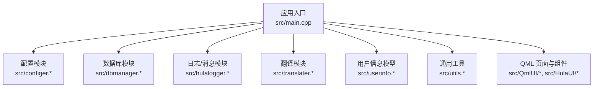
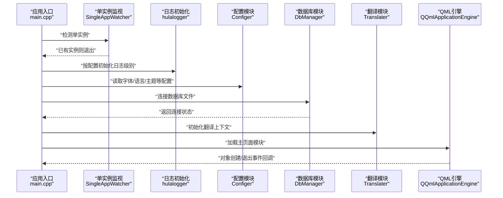
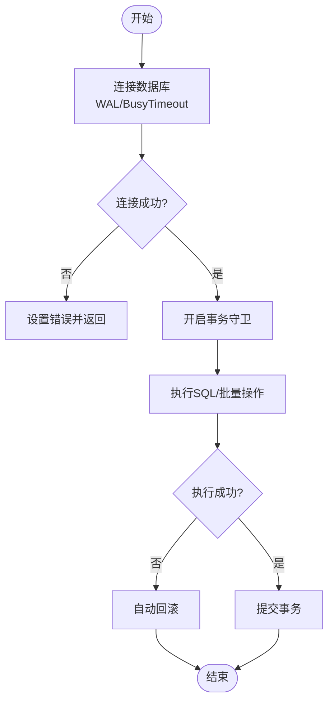
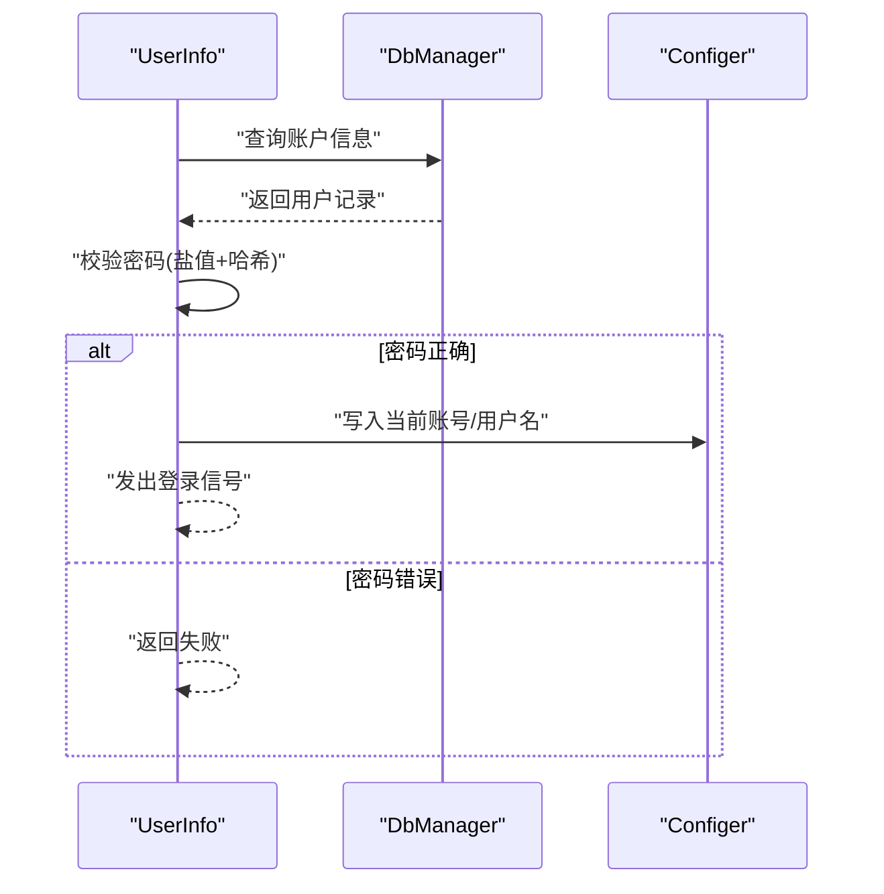
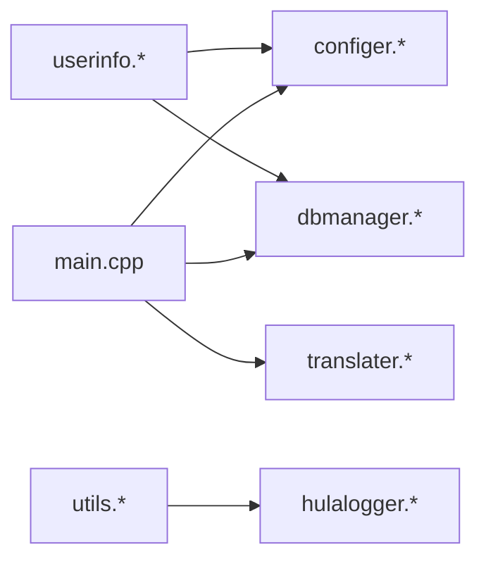

# 测试策略

<cite>
**本文引用的文件**
- [README.md](file://README.md)
- [CMakeLists.txt](file://CMakeLists.txt)
- [main.cpp](file://src/main.cpp)
- [configer.h](file://src/configer.h)
- [configer.cpp](file://src/configer.cpp)
- [dbmanager.h](file://src/dbmanager.h)
- [dbmanager.cpp](file://src/dbmanager.cpp)
- [utils.h](file://src/utils.h)
- [utils.cpp](file://src/utils.cpp)
- [userinfo.h](file://src/userinfo.h)
- [userinfo.cpp](file://src/userinfo.cpp)
- [Search.qml](file://src/QmlUI/Search.qml)
- [Home.qml](file://src/QmlUI/Home.qml)
- [Statistic.qml](file://src/QmlUI/Statistic.qml)
</cite>

## 目录
1. [引言](#引言)
2. [项目结构](#项目结构)
3. [核心组件](#核心组件)
4. [架构总览](#架构总览)
5. [详细组件分析](#详细组件分析)
6. [依赖关系分析](#依赖关系分析)
7. [性能考虑](#性能考虑)
8. [故障排查指南](#故障排查指南)
9. [结论](#结论)
10. [附录](#附录)

## 引言
本测试策略面向基于 Qt6/QML 的跨平台医疗报告管理系统 QmlPlugins，旨在建立一套系统化、可落地的测试体系，覆盖单元测试、集成测试、端到端测试与自动化流程；同时给出性能测试、压力测试、兼容性测试的实施方案，并总结测试数据管理、模拟对象、测试环境配置的最佳实践，以及代码质量检查与持续测试的工具链建议。

## 项目结构
项目采用 C++/Qt6 + QML 的混合架构，核心业务逻辑以 C++ 实现并通过 QML 单例/元素暴露给前端界面。构建系统使用 CMake，目标是跨平台运行（Windows/Linux/macOS）。关键目录与职责如下：
- src：源代码根目录
  - src/QmlUI：QML 界面与页面
  - src/HulaUI：自定义 QML 组件
  - src/*：C++ 业务模块（配置、数据库、工具、用户信息等）
- bin：运行时产物与资源
- resources：打包/部署期资源

图表来源
- [main.cpp:17-99](file://src/main.cpp#L17-L99)
- [CMakeLists.txt:29-53](file://CMakeLists.txt#L29-L53)

章节来源
- [README.md:1-50](file://README.md#L1-L50)
- [CMakeLists.txt:1-137](file://CMakeLists.txt#L1-L137)

## 核心组件
- 配置模块（Configer）：提供应用配置读写、主题、语言、字体、报表模板、相机参数等能力，以 QML 单例形式暴露。
- 数据库模块（DbManager）：封装 SQLite 访问、事务守卫、备份/恢复、查询结果转换、线程安全连接池等。
- 工具模块（Utils）：提供目录/文件操作、目录同步、文件更新等通用能力。
- 用户信息模块（UserInfo）：基于 QAbstractTableModel 的用户数据模型，提供登录、密码校验、增删改查等。
- QML 页面与组件：Home、Search、Statistic 等页面中包含 ComboBox 等交互控件，用于测试 UI 行为与数据绑定。

章节来源
- [configer.h:98-277](file://src/configer.h#L98-L277)
- [configer.cpp:1-421](file://src/configer.cpp#L1-L421)
- [dbmanager.h:52-192](file://src/dbmanager.h#L52-L192)
- [dbmanager.cpp:1-824](file://src/dbmanager.cpp#L1-L824)
- [utils.h:21-82](file://src/utils.h#L21-L82)
- [utils.cpp:1-408](file://src/utils.cpp#L1-L408)
- [userinfo.h:30-172](file://src/userinfo.h#L30-L172)
- [userinfo.cpp:1-297](file://src/userinfo.cpp#L1-L297)

## 架构总览
下图展示应用启动到数据库连接、配置初始化、QML 加载的关键流程，以及各模块间的耦合关系。

图表来源
- [main.cpp:17-99](file://src/main.cpp#L17-L99)
- [configer.h:98-277](file://src/configer.h#L98-L277)
- [dbmanager.h:52-192](file://src/dbmanager.h#L52-L192)

## 详细组件分析

### 配置模块（Configer）测试策略
- 单元测试要点
  - 配置读写：验证 INI 文件读取/写入、分组与键值解析、默认值处理。
  - QML 单例行为：验证 QML 中对配置项的访问、变更信号触发。
  - 路径与资源：验证资源路径宏在不同平台下的正确性。
- 集成测试要点
  - 启动阶段：验证应用启动时配置加载顺序与默认值生效。
  - 多语言：验证语言切换后 UI 文本变化。
- 测试数据管理
  - 使用临时 INI 文件隔离测试，避免污染真实配置。
  - 为不同平台准备路径前缀的测试桩。
- 模拟对象
  - Mock QSettings 以控制读写行为。
  - Mock QQmlEngine/JS 引擎以验证单例创建。
- 覆盖率要求
  - 关键分支：INI 读取/写入、分组处理、键值类型转换。
  - 场景：空值、非法值、缺失键、异常文件权限。

章节来源
- [configer.h:98-277](file://src/configer.h#L98-L277)
- [configer.cpp:1-421](file://src/configer.cpp#L1-L421)

### 数据库模块（DbManager）测试策略
- 单元测试要点
  - 连接管理：多线程连接、连接断开重连、WAL 模式与 busy_timeout。
  - 事务：TransactionGuard 的自动回滚与显式提交。
  - 查询与更新：参数绑定、批量插入/更新、错误码传播。
  - 备份/恢复：文件存在性、原子性、回滚保护。
- 集成测试要点
  - 启动连接：应用启动时数据库连接与模式设置。
  - 模型交互：UserInfo 与 DbManager 的协作。
- 性能与压力测试
  - 并发写入：多线程批量插入/更新，观察 busy_timeout 效果。
  - 大数据量查询：分页/游标策略、内存占用。
- 测试数据管理
  - 使用内存数据库（:memory:）或独立 .db 文件，测试前后清理。
  - 为事务/备份场景准备快照与回滚脚本。
- 模拟对象
  - Mock QSqlDatabase/QSqlQuery 以注入错误与延迟。
  - Mock QThreadStorage 以模拟线程上下文。
- 覆盖率要求
  - 分支：连接成功/失败、事务提交/回滚、备份/恢复路径。
  - 场景：空 SQL、无效表名、参数绑定失败、文件 IO 失败。

图表来源
- [dbmanager.cpp:14-40](file://src/dbmanager.cpp#L14-L40)
- [dbmanager.cpp:51-90](file://src/dbmanager.cpp#L51-L90)

章节来源
- [dbmanager.h:52-192](file://src/dbmanager.h#L52-L192)
- [dbmanager.cpp:1-824](file://src/dbmanager.cpp#L1-L824)

### 工具模块（Utils）测试策略
- 单元测试要点
  - 目录/文件操作：复制、更新、同步、删除孤儿文件。
  - 时间戳比较：目录最新时间计算、文件更新判断。
  - 跨平台路径：cleanPath、分隔符处理。
- 集成测试要点
  - 与日志模块协作：失败时的日志输出。
- 测试数据管理
  - 使用临时目录树，测试前构建、测试后清理。
- 模拟对象
  - Mock QFile/QDir 以注入失败场景。
- 覆盖率要求
  - 分支：源/目标存在与否、覆盖策略、删除孤儿开关。
  - 场景：权限不足、磁盘空间不足、路径非法。

章节来源
- [utils.h:21-82](file://src/utils.h#L21-L82)
- [utils.cpp:1-408](file://src/utils.cpp#L1-L408)

### 用户信息模块（UserInfo）测试策略
- 单元测试要点
  - 登录与密码校验：盐值生成、SHA256 迭代哈希、明文比对。
  - 数据模型：行/列计数、数据读取、表头读取。
  - CRUD：新增（含盐值与密码哈希）、更新（可选密码重算）、删除。
  - 唯一性约束：账号重复性检查。
- 集成测试要点
  - 与 DbManager 协作：查询、插入、更新、删除的链路。
  - 与 Configer 协作：登录成功后写入当前用户信息。
- 测试数据管理
  - 使用最小 UserInfo 表结构，准备若干测试用户数据。
- 模拟对象
  - Mock DbManager 以注入查询/更新结果。
  - Mock Configer 以验证登录后的状态写入。
- 覆盖率要求
  - 分支：账号存在/不存在、密码正确/错误、盐值缺失/存在。
  - 场景：空密码、重复账号、数据库错误。

图表来源
- [userinfo.cpp:226-242](file://src/userinfo.cpp#L226-L242)
- [configer.cpp:320-338](file://src/configer.cpp#L320-L338)

章节来源
- [userinfo.h:30-172](file://src/userinfo.h#L30-L172)
- [userinfo.cpp:1-297](file://src/userinfo.cpp#L1-L297)

### QML 页面与组件测试策略
- 单元测试要点（QML）
  - 控件行为：ComboBox 下拉加载数据、文本输入、选择变更。
  - 数据绑定：模型 getUsers() 结果与 UI 绑定。
  - 国际化：文本随 translater.change 切换。
- 集成测试要点（端到端）
  - 页面导航：从 Home/Statistic 到 Search 的跳转与数据传递。
  - 与后端协作：ComboBox 与 UserInfo/DbManager 的联动。
- 测试数据管理
  - 准备最小化用户数据集，确保 ComboBox 有选项。
- 模拟对象
  - Mock Qml 注入模型数据，避免真实数据库依赖。
- 覆盖率要求
  - 分支：下拉可见/隐藏、模型为空/非空、语言切换。
  - 场景：网络/数据库不可用时的降级 UI。

章节来源
- [Search.qml:339-363](file://src/QmlUI/Search.qml#L339-L363)
- [Home.qml:623-649](file://src/QmlUI/Home.qml#L623-L649)
- [Statistic.qml:333-357](file://src/QmlUI/Statistic.qml#L333-L357)

## 依赖关系分析
- 组件内聚与耦合
  - DbManager 为核心依赖点，UserInfo、Configer、Utils 等模块均与其交互。
  - Configer 与 Translater 在启动阶段被 main.cpp 依赖。
- 外部依赖
  - Qt6::Quick、Qt6::Sql、Qt6::QuickControls2。
  - SQLite3。
- 循环依赖
  - 未发现直接循环；UserInfo 通过 DbManager 间接依赖 Configer，但 Configer 为纯配置，无反向依赖。

图表来源
- [CMakeLists.txt:96-100](file://CMakeLists.txt#L96-L100)
- [main.cpp:17-99](file://src/main.cpp#L17-L99)

章节来源
- [CMakeLists.txt:1-137](file://CMakeLists.txt#L1-L137)
- [main.cpp:17-99](file://src/main.cpp#L17-L99)

## 性能考虑
- 数据库性能
  - WAL 模式与 busy_timeout 已启用，建议在压力测试中验证高并发写入下的锁竞争与回退策略。
  - 对大数据量查询使用 LIMIT/OFFSET 或分页模型。
- UI 性能
  - ComboBox 下拉时按需加载模型数据，避免一次性加载大量用户。
  - 文本渲染与国际化切换应避免频繁重建对象。
- 资源与内存
  - 临时文件与数据库文件在测试后及时清理，防止磁盘与内存泄漏。
- 压力测试建议
  - 并发用户登录/查询，统计平均响应时间与错误率。
  - 大文件复制/同步场景，监控磁盘 IO 与 CPU 占用。

## 故障排查指南
- 数据库连接失败
  - 检查数据库文件路径与权限，确认 WAL 模式与 busy_timeout 设置。
  - 观察错误码与 lastError 输出，定位具体失败阶段。
- 登录失败
  - 核对账号是否存在、密码哈希与盐值是否匹配。
  - 检查 Configer 中当前用户信息写入是否成功。
- QML 控件无数据
  - 确认模型数据源 getUsers() 是否返回有效数据。
  - 检查 translater.change 是否触发了文本刷新。

章节来源
- [dbmanager.cpp:51-90](file://src/dbmanager.cpp#L51-L90)
- [userinfo.cpp:212-242](file://src/userinfo.cpp#L212-L242)

## 结论
本测试策略围绕配置、数据库、工具、用户信息与 QML 页面五大模块，给出了从单元到端到端的测试方案与覆盖率要求，并结合性能、压力与兼容性测试提出实施建议。通过模拟对象与测试数据管理，可在不依赖真实外部资源的情况下稳定推进测试工作流。

## 附录

### 测试框架与工具链建议
- 单元测试
  - GoogleTest（C++）、Qt Test（Qt 类型单元测试）
- 集成/端到端测试
  - Qt Quick Test（QML UI 测试）、Selenium/Appium（跨平台 UI 自动化）
- 性能与压力测试
  - Qt Concurrent/线程池、自定义基准测试、第三方压测工具
- 静态分析与代码质量
  - Clang-Tidy、PVS-Studio、SonarQube（CI 集成）
- 自动化测试流程
  - CMake + CTest + CI（GitHub Actions/GitLab CI），按平台矩阵执行测试套件

### 测试覆盖率要求（示例）
- 关键模块覆盖率
  - Configer：≥80%
  - DbManager：≥85%
  - Utils：≥75%
  - UserInfo：≥80%
  - QML 页面：≥70%