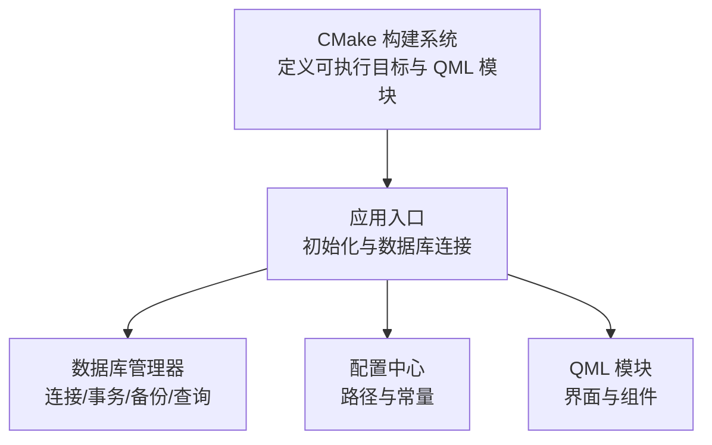
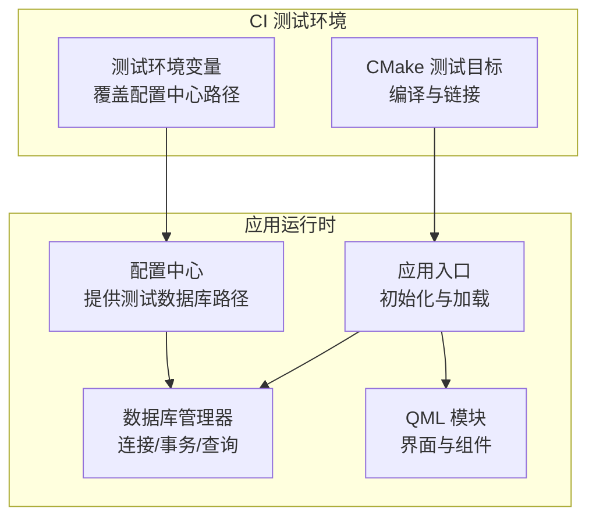
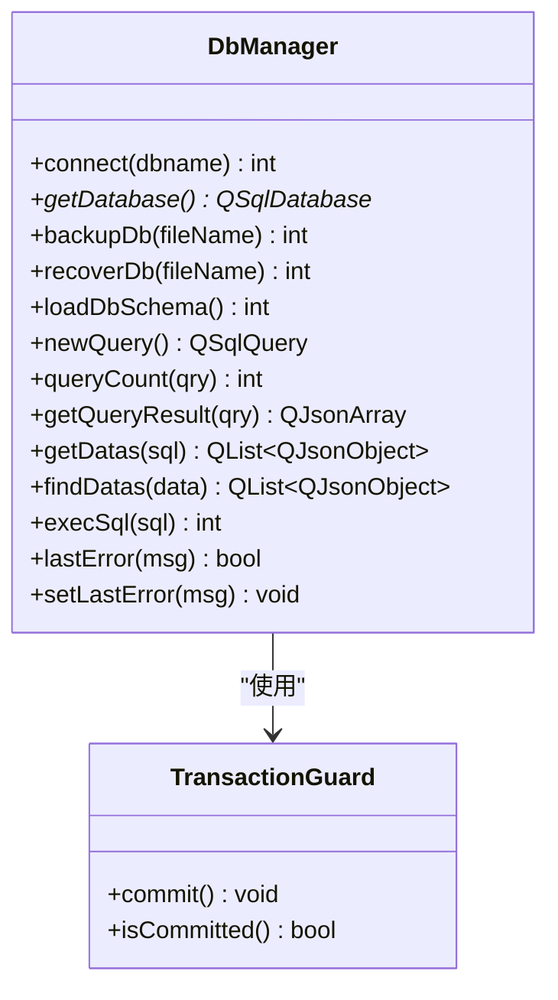
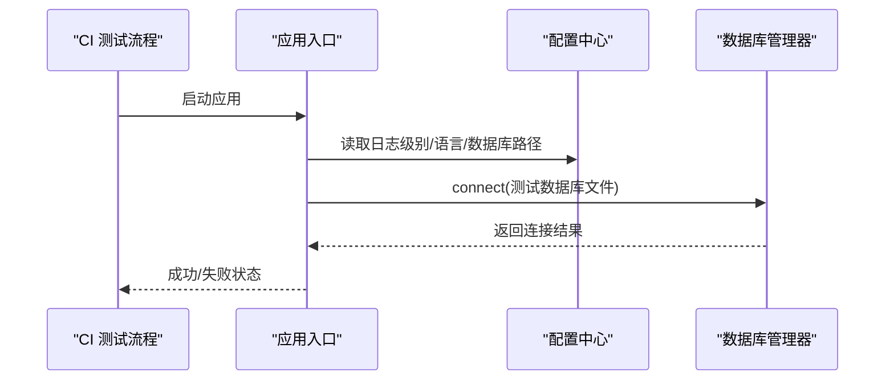
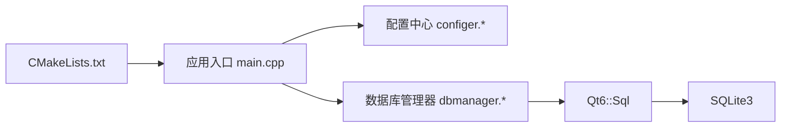

# 自动化测试

<cite>
**本文引用的文件**
- [CMakeLists.txt](file://CMakeLists.txt)
- [README.md](file://README.md)
- [src/main.cpp](file://src/main.cpp)
- [src/dbmanager.h](file://src/dbmanager.h)
- [src/dbmanager.cpp](file://src/dbmanager.cpp)
- [src/configer.h](file://src/configer.h)
- [src/configer.cpp](file://src/configer.cpp)
</cite>

## 目录
1. [简介](#简介)
2. [项目结构](#项目结构)
3. [核心组件](#核心组件)
4. [架构总览](#架构总览)
5. [详细组件分析](#详细组件分析)
6. [依赖分析](#依赖分析)
7. [性能考虑](#性能考虑)
8. [故障排查指南](#故障排查指南)
9. [结论](#结论)
10. [附录](#附录)

## 简介
本文件面向 QmlPlugins 项目的自动化测试与持续集成/持续测试实践，聚焦以下目标：
- 在现有 CMake 构建系统中集成测试目标与自动化执行流程
- 提供测试环境配置指南，包括测试数据库设置、模拟服务与测试数据管理
- 介绍测试报告生成与结果分析方法
- 推荐代码质量检查工具（静态分析与代码覆盖率）的集成方案与使用建议

项目基于 Qt6/QML，采用 SQLite 作为本地数据库，具备良好的模块化结构，便于在 CI 环境中进行单元测试与集成测试。

## 项目结构
QmlPlugins 的关键测试相关位置与职责概览：
- 构建与入口
  - CMake 构建脚本定义了可执行目标与 QML 模块注册，便于在 CI 中统一编译与运行
  - 应用入口负责初始化数据库连接、国际化与主窗体加载
- 数据层
  - 数据库管理器封装了连接、事务、备份/恢复、查询与错误处理逻辑
  - 配置中心提供应用路径、数据库文件路径等常量，便于测试时替换
- UI 层
  - QML 界面与自定义组件位于 src/QmlUI 与 src/HulaUI，可用于端到端测试

图表来源
- [CMakeLists.txt:29-93](file://CMakeLists.txt#L29-L93)
- [src/main.cpp:17-95](file://src/main.cpp#L17-L95)
- [src/dbmanager.h:52-191](file://src/dbmanager.h#L52-L191)
- [src/configer.h:70-72](file://src/configer.h#L70-L72)

章节来源
- [CMakeLists.txt:1-137](file://CMakeLists.txt#L1-L137)
- [README.md:1-50](file://README.md#L1-L50)
- [src/main.cpp:17-95](file://src/main.cpp#L17-L95)

## 核心组件
- 应用入口与数据库初始化
  - 应用启动时强制平台协议、初始化日志、设置字体、加载 QML 模块，并建立数据库连接；连接失败会记录严重错误并退出
- 数据库管理器
  - 提供线程安全的数据库连接获取、事务守卫、备份/恢复、Schema 加载、通用查询与错误上报
- 配置中心
  - 提供数据库文件路径常量与多处资源路径常量，便于测试时替换为临时文件与测试目录

章节来源
- [src/main.cpp:46-50](file://src/main.cpp#L46-L50)
- [src/dbmanager.h:52-191](file://src/dbmanager.h#L52-L191)
- [src/dbmanager.cpp:51-90](file://src/dbmanager.cpp#L51-L90)
- [src/configer.h:70-72](file://src/configer.h#L70-L72)

## 架构总览
下图展示了测试视角下的关键交互：CI 构建阶段编译应用与测试目标，测试阶段通过配置中心提供的路径常量指向测试数据库与测试资源，数据库管理器负责连接与事务控制，应用入口负责加载 QML 并触发业务逻辑。

图表来源
- [CMakeLists.txt:29-93](file://CMakeLists.txt#L29-L93)
- [src/main.cpp:46-50](file://src/main.cpp#L46-L50)
- [src/configer.h:70-72](file://src/configer.h#L70-L72)
- [src/dbmanager.h:52-191](file://src/dbmanager.h#L52-L191)

## 详细组件分析

### 数据库管理器测试策略
- 连接与事务
  - 使用线程存储的连接与互斥保护，确保并发安全；建议在测试中为每个用例准备独立的临时数据库文件，避免并发干扰
  - 事务守卫类在析构时自动回滚，有助于测试隔离
- 备份与恢复
  - 提供备份与恢复接口，测试可利用该能力在用例间快速重置状态
- 查询与错误处理
  - 提供通用查询与错误上报机制，测试可通过错误码与消息判断异常路径

图表来源
- [src/dbmanager.h:37-191](file://src/dbmanager.h#L37-L191)
- [src/dbmanager.cpp:14-40](file://src/dbmanager.cpp#L14-L40)

章节来源
- [src/dbmanager.h:52-191](file://src/dbmanager.h#L52-L191)
- [src/dbmanager.cpp:51-90](file://src/dbmanager.cpp#L51-L90)
- [src/dbmanager.cpp:118-223](file://src/dbmanager.cpp#L118-L223)
- [src/dbmanager.cpp:225-350](file://src/dbmanager.cpp#L225-L350)
- [src/dbmanager.cpp:352-406](file://src/dbmanager.cpp#L352-L406)
- [src/dbmanager.cpp:437-553](file://src/dbmanager.cpp#L437-L553)
- [src/dbmanager.cpp:555-576](file://src/dbmanager.cpp#L555-L576)
- [src/dbmanager.cpp:578-699](file://src/dbmanager.cpp#L578-L699)
- [src/dbmanager.cpp:769-793](file://src/dbmanager.cpp#L769-L793)

### 应用入口与测试执行流程
- 启动阶段
  - 初始化日志、设置字体、加载翻译与 QML 模块
  - 建立数据库连接，失败则记录严重错误并退出
- 测试执行建议
  - 在 CI 中以非交互方式运行，避免阻塞
  - 将数据库文件与资源路径指向测试专用目录，确保可重复性与隔离性

图表来源
- [src/main.cpp:32-50](file://src/main.cpp#L32-L50)
- [src/configer.h:42-72](file://src/configer.h#L42-L72)
- [src/dbmanager.cpp:51-90](file://src/dbmanager.cpp#L51-L90)

章节来源
- [src/main.cpp:17-95](file://src/main.cpp#L17-L95)
- [src/configer.cpp:42-50](file://src/configer.cpp#L42-L50)

### 测试数据管理与模拟服务
- 测试数据库
  - 使用配置中心提供的数据库文件常量，测试时替换为临时文件，用例结束后清理
- 测试数据准备
  - 可通过数据库管理器的批量插入与事务保证一致性
- 模拟服务
  - 对于外部依赖（如网络、摄像头），可在测试中注入桩或替身，隔离真实依赖

章节来源
- [src/configer.h:70-72](file://src/configer.h#L70-L72)
- [src/dbmanager.cpp:500-553](file://src/dbmanager.cpp#L500-L553)

### 测试报告与结果分析
- 建议在 CI 中收集以下信息：
  - 构建日志与测试日志
  - 数据库备份/恢复过程的输出
  - 关键错误码与错误消息
- 结果分析
  - 统计成功/失败用例数量，定位失败原因（连接失败、查询异常、备份失败等）

章节来源
- [src/dbmanager.cpp:118-223](file://src/dbmanager.cpp#L118-L223)
- [src/dbmanager.cpp:769-793](file://src/dbmanager.cpp#L769-L793)

## 依赖分析
- 构建与运行时依赖
  - Qt6::Quick、Qt6::Sql、Qt6::QuickControls2
  - SQLite3
- 组件耦合
  - 应用入口依赖配置中心与数据库管理器
  - 数据库管理器依赖 Qt SQL 与 SQLite

图表来源
- [CMakeLists.txt:96-100](file://CMakeLists.txt#L96-L100)
- [src/main.cpp:12-14](file://src/main.cpp#L12-L14)
- [src/dbmanager.cpp:1-12](file://src/dbmanager.cpp#L1-L12)

章节来源
- [CMakeLists.txt:23-26](file://CMakeLists.txt#L23-L26)
- [CMakeLists.txt:96-100](file://CMakeLists.txt#L96-L100)
- [src/main.cpp:12-14](file://src/main.cpp#L12-L14)

## 性能考虑
- 并发与锁
  - 数据库连接使用线程存储与互斥保护，测试中应避免过多并发写入导致忙等超时
- 事务批处理
  - 使用事务守卫合并多次写入，减少提交次数，提升测试效率
- 资源隔离
  - 每个测试用例使用独立数据库文件，避免共享状态带来的性能与稳定性问题

章节来源
- [src/dbmanager.cpp:51-90](file://src/dbmanager.cpp#L51-L90)
- [src/dbmanager.cpp:437-498](file://src/dbmanager.cpp#L437-L498)

## 故障排查指南
- 数据库连接失败
  - 检查数据库文件路径与权限，确认 WAL 模式与忙等超时设置
- 备份/恢复失败
  - 确认源文件存在与目标路径可写，注意恢复失败时的回滚逻辑
- 查询异常
  - 检查 SQL 语法与绑定参数，关注错误码与错误消息
- 应用启动失败
  - 关注日志级别与翻译文件加载，确保数据库连接成功

章节来源
- [src/main.cpp:46-50](file://src/main.cpp#L46-L50)
- [src/dbmanager.cpp:118-223](file://src/dbmanager.cpp#L118-L223)
- [src/dbmanager.cpp:769-793](file://src/dbmanager.cpp#L769-L793)

## 结论
QmlPlugins 已具备良好的测试基础：清晰的构建系统、可注入的配置中心与健壮的数据库管理器。结合本文的测试策略与 CI 集成建议，可在不侵入主业务的前提下，建立稳定可靠的自动化测试体系。

## 附录

### CMake 测试集成与自动化执行建议
- 在 CMake 中新增测试目标
  - 使用 add_executable/add_test/cmake --build --target test 在 CI 中统一编译与执行
- 测试环境变量
  - 通过 -DTEST_DB_PATH 等选项覆盖配置中心中的数据库路径常量，确保测试隔离
- CI 流水线
  - 构建 → 单元测试 → 集成测试 → 代码质量检查 → 报告归档

章节来源
- [CMakeLists.txt:29-93](file://CMakeLists.txt#L29-L93)
- [src/configer.h:70-72](file://src/configer.h#L70-L72)

### 代码质量检查工具集成建议
- 静态分析
  - 使用 clang-tidy 或类似工具对 C++ 源码进行静态检查，重点关注 C++20 特性与 Qt 相关规则
- 代码覆盖率
  - 在测试目标中启用覆盖率编译选项，生成覆盖率报告并与 CI 报告集成
- 文档与规范
  - 建议在 CI 中增加文档生成与规范检查步骤，确保测试与文档同步维护

[本节为通用实践建议，无需具体文件引用]