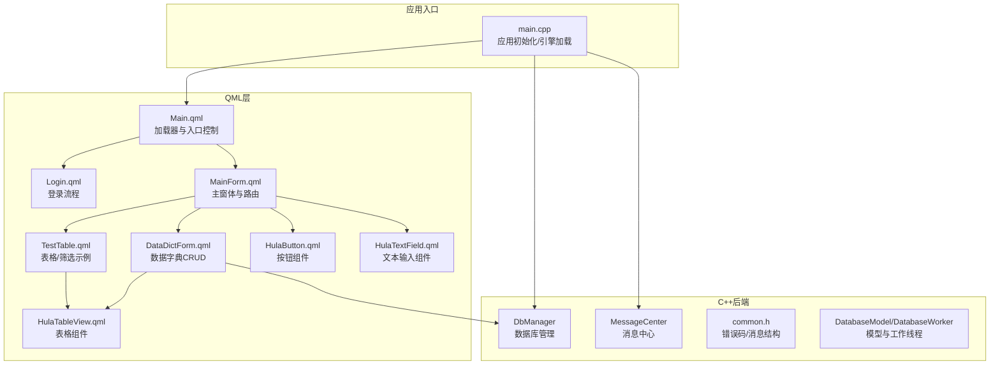
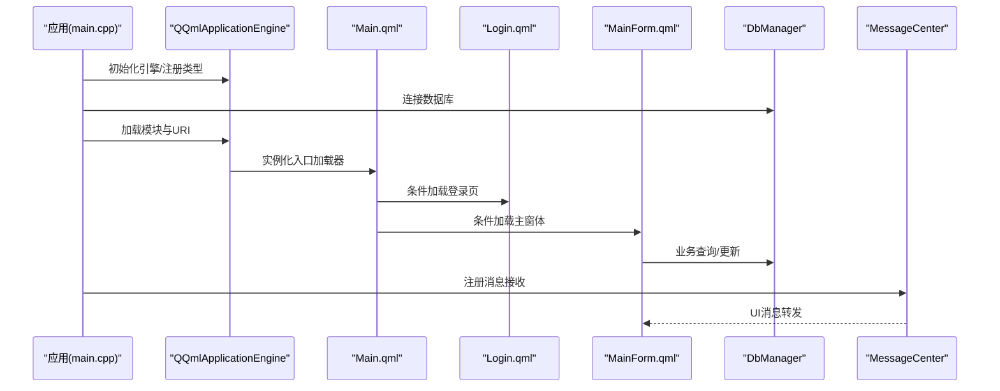
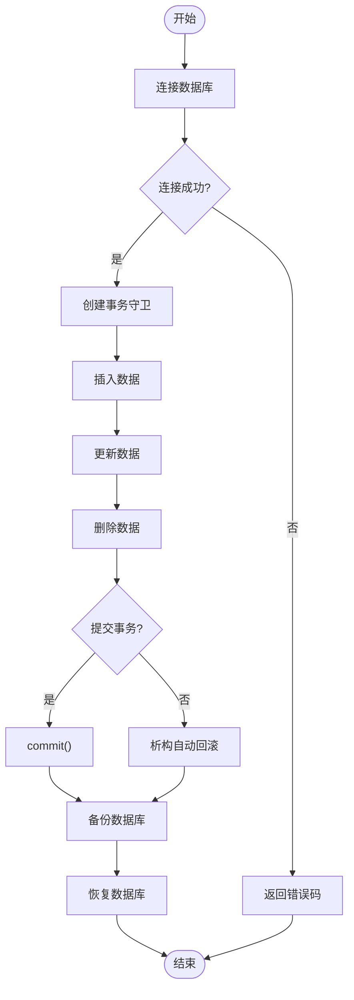
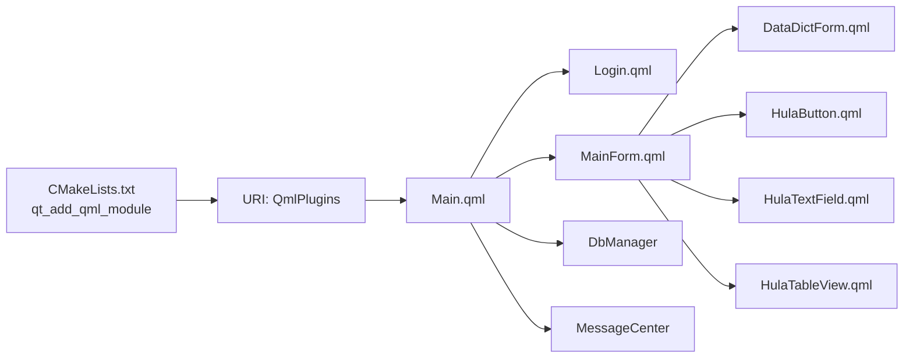

# 集成测试

<cite>
**本文引用的文件**
- [README.md](file://README.md)
- [CMakeLists.txt](file://CMakeLists.txt)
- [main.cpp](file://src/main.cpp)
- [dbmanager.h](file://src/dbmanager.h)
- [databasemodel.h](file://src/databasemodel.h)
- [common.h](file://src/common.h)
- [Main.qml](file://src/QmlUI/Main.qml)
- [Login.qml](file://src/QmlUI/Login.qml)
- [MainForm.qml](file://src/QmlUI/MainForm.qml)
- [DataDictForm.qml](file://src/QmlUI/DataDictForm.qml)
- [TestTable.qml](file://src/QmlUI/TestTable.qml)
- [HulaButton.qml](file://src/HulaUI/HulaButton.qml)
- [HulaTextField.qml](file://src/HulaUI/HulaTextField.qml)
- [HulaTableView.qml](file://src/HulaUI/HulaTableView.qml)
- [messagecenter.h](file://src/messagecenter.h)
</cite>

## 目录
1. [简介](#简介)
2. [项目结构](#项目结构)
3. [核心组件](#核心组件)
4. [架构总览](#架构总览)
5. [详细组件分析](#详细组件分析)
6. [依赖关系分析](#依赖关系分析)
7. [性能考量](#性能考量)
8. [故障排查指南](#故障排查指南)
9. [结论](#结论)
10. [附录](#附录)

## 简介
本文件面向QmlPlugins项目，提供一套完整的集成测试方案，覆盖以下方面：
- QML组件与C++后端的集成测试：包括组件间通信、数据绑定验证、事件处理验证
- UI组件的集成测试：重点针对HulaUI组件库与QmlUI页面的协同工作
- 数据库集成测试：涵盖CRUD操作与事务处理验证
- 端到端测试流程设计与测试环境搭建指南

## 项目结构
项目采用Qt6/QML技术栈，C++后端通过Qt的QML模块机制暴露给QML使用；前端由QmlUI页面与HulaUI组件构成。

图表来源
- [main.cpp:17-99](file://src/main.cpp#L17-L99)
- [CMakeLists.txt:79-93](file://CMakeLists.txt#L79-L93)
- [Main.qml:1-41](file://src/QmlUI/Main.qml#L1-L41)
- [Login.qml:1-342](file://src/QmlUI/Login.qml#L1-L342)
- [MainForm.qml:1-488](file://src/QmlUI/MainForm.qml#L1-L488)
- [DataDictForm.qml:1-235](file://src/QmlUI/DataDictForm.qml#L1-L235)
- [TestTable.qml:1-136](file://src/QmlUI/TestTable.qml#L1-L136)
- [HulaButton.qml:1-81](file://src/HulaUI/HulaButton.qml#L1-L81)
- [HulaTextField.qml:1-45](file://src/HulaUI/HulaTextField.qml#L1-L45)
- [HulaTableView.qml:1-415](file://src/HulaUI/HulaTableView.qml#L1-L415)
- [dbmanager.h:52-192](file://src/dbmanager.h#L52-L192)
- [databasemodel.h:49-97](file://src/databasemodel.h#L49-L97)
- [common.h:63-159](file://src/common.h#L63-L159)

章节来源
- [README.md:1-50](file://README.md#L1-L50)
- [CMakeLists.txt:1-137](file://CMakeLists.txt#L1-L137)
- [main.cpp:17-99](file://src/main.cpp#L17-L99)

## 核心组件
- 应用入口与引擎：负责初始化应用、单实例检测、日志、字体、翻译、数据库连接，并加载QML模块与主页面
- 数据库管理：提供连接、查询、增删改、备份/恢复、事务守卫等能力
- 消息中心：集中接收与转发系统消息至UI
- UI页面与组件：Main.qml作为加载器入口，Login.qml负责登录流程，MainForm.qml承载主窗体与路由，DataDictForm.qml演示CRUD，HulaUI组件提供统一风格的交互控件

章节来源
- [main.cpp:17-99](file://src/main.cpp#L17-L99)
- [dbmanager.h:52-192](file://src/dbmanager.h#L52-L192)
- [messagecenter.h:27-127](file://src/messagecenter.h#L27-L127)
- [Main.qml:1-41](file://src/QmlUI/Main.qml#L1-L41)
- [Login.qml:1-342](file://src/QmlUI/Login.qml#L1-L342)
- [MainForm.qml:1-488](file://src/QmlUI/MainForm.qml#L1-L488)
- [DataDictForm.qml:1-235](file://src/QmlUI/DataDictForm.qml#L1-L235)
- [HulaButton.qml:1-81](file://src/HulaUI/HulaButton.qml#L1-L81)
- [HulaTextField.qml:1-45](file://src/HulaUI/HulaTextField.qml#L1-L45)
- [HulaTableView.qml:1-415](file://src/HulaUI/HulaTableView.qml#L1-L415)

## 架构总览
下图展示从应用启动到页面渲染、数据库访问与消息分发的关键路径。

图表来源
- [main.cpp:46-93](file://src/main.cpp#L46-L93)
- [Main.qml:14-39](file://src/QmlUI/Main.qml#L14-L39)
- [Login.qml:35-45](file://src/QmlUI/Login.qml#L35-L45)
- [MainForm.qml:42-60](file://src/QmlUI/MainForm.qml#L42-L60)
- [dbmanager.h:80-141](file://src/dbmanager.h#L80-L141)
- [messagecenter.h:89-117](file://src/messagecenter.h#L89-L117)

## 详细组件分析

### 组件间通信与数据绑定测试
- 目标：验证QML页面与C++后端之间的属性传递、信号槽连通性、数据绑定一致性
- 测试要点
  - 登录流程：UserId输入变化驱动用户名联动显示，密码校验触发登录结果
  - 主窗体路由：左侧导航按钮点击后StackView替换页面，顶部时间同步
  - 数据字典：表格双击选择回调、新增/修改/删除后的模型更新与提示
  - HulaUI组件：按钮点击状态切换、文本框焦点样式与主题色绑定
- 测试场景建议
  - 输入UserId为空/非空/不存在，验证用户名字段与提示状态
  - 登录凭据正确/错误，验证提示与关闭行为
  - 主窗体定时器触发，验证日期时间标签更新
  - 数据字典编辑区与表格联动，验证当前行选择与视图更新
  - HulaButton的useState与状态切换，HulaTextField的主题边框与焦点动画

章节来源
- [Login.qml:159-172](file://src/QmlUI/Login.qml#L159-L172)
- [Login.qml:321-335](file://src/QmlUI/Login.qml#L321-L335)
- [MainForm.qml:182-186](file://src/QmlUI/MainForm.qml#L182-L186)
- [MainForm.qml:432-460](file://src/QmlUI/MainForm.qml#L432-L460)
- [DataDictForm.qml:135-150](file://src/QmlUI/DataDictForm.qml#L135-L150)
- [DataDictForm.qml:181-213](file://src/QmlUI/DataDictForm.qml#L181-L213)
- [HulaButton.qml:23-38](file://src/HulaUI/HulaButton.qml#L23-L38)
- [HulaTextField.qml:21-37](file://src/HulaUI/HulaTextField.qml#L21-L37)

### 事件处理测试
- 目标：验证鼠标/键盘事件、定时器、加载器异步加载等事件链路
- 测试要点
  - 鼠标点击/双击：表格单元格点击与双击事件、按钮点击状态切换
  - 键盘事件：回车键在输入框间的焦点流转
  - 定时器：主窗体每秒更新时间标签
  - 异步加载：Loader的异步加载与onLoaded回调
- 测试场景建议
  - 表格点击/双击，验证信号触发与当前行选择
  - 按钮useState为true/false时的状态切换
  - 键盘上下键在输入框间移动焦点
  - Loader加载完成后触发showForm

章节来源
- [HulaTableView.qml:134-142](file://src/HulaUI/HulaTableView.qml#L134-L142)
- [HulaButton.qml:75-79](file://src/HulaUI/HulaButton.qml#L75-L79)
- [Login.qml:174-176](file://src/QmlUI/Login.qml#L174-L176)
- [MainForm.qml:432-460](file://src/QmlUI/MainForm.qml#L432-L460)
- [Main.qml:14-39](file://src/QmlUI/Main.qml#L14-L39)

### 数据库集成测试（CRUD与事务）
- 目标：验证数据库连接、查询、插入、更新、删除、备份/恢复与事务一致性
- 关键接口
  - 连接与查询：connect、newQuery、getDatas、execSql
  - CRUD：appendDatas、updateDatas、findDatas
  - 事务：TransactionGuard（RAII事务守卫）
  - 备份/恢复：backupDb、recoverDb
- 测试场景建议
  - 连接：成功/失败路径（错误码验证）
  - 查询：空结果/多记录，验证计数与JSON转换
  - 插入：新增一条记录，回填自增ID
  - 更新：按where字段更新，验证返回值
  - 删除：按条件删除，验证影响行数
  - 事务：开启事务后提交/回滚，验证一致性
  - 备份/恢复：生成备份文件，恢复后验证数据一致性

图表来源
- [dbmanager.h:80-141](file://src/dbmanager.h#L80-L141)
- [dbmanager.h:37-50](file://src/dbmanager.h#L37-L50)
- [common.h:75-84](file://src/common.h#L75-L84)

章节来源
- [dbmanager.h:52-192](file://src/dbmanager.h#L52-L192)
- [common.h:63-159](file://src/common.h#L63-L159)

### UI组件与页面协同测试（HulaUI + QmlUI）
- 目标：验证HulaUI组件在不同页面中的表现与MainForm的协作
- 测试要点
  - HulaButton：useState启用时的checked/unchecked状态切换
  - HulaTextField：与Themer主题联动的边框与焦点动画
  - HulaTableView：列宽调整、行选择、编辑委托、滚动条与表头联动
  - DataDictForm：与DataDict模块的CRUD交互、表格与编辑区联动
  - MainForm：打开对话框、消息提示、壁纸切换与定时器
- 测试场景建议
  - 在DataDictForm中新增/修改/删除，验证表格与编辑区同步
  - 切换HulaButton状态，验证背景色与图标透明度
  - 修改HulaTextField焦点，验证边框颜色与动画
  - 调整HulaTableView列宽，验证布局重算与可见列计算

章节来源
- [HulaButton.qml:23-38](file://src/HulaUI/HulaButton.qml#L23-L38)
- [HulaTextField.qml:21-37](file://src/HulaUI/HulaTextField.qml#L21-L37)
- [HulaTableView.qml:98-108](file://src/HulaUI/HulaTableView.qml#L98-L108)
- [HulaTableView.qml:359-372](file://src/HulaUI/HulaTableView.qml#L359-L372)
- [DataDictForm.qml:105-150](file://src/QmlUI/DataDictForm.qml#L105-L150)
- [MainForm.qml:378-404](file://src/QmlUI/MainForm.qml#L378-L404)

## 依赖关系分析
- C++后端通过CMake的qt_add_qml_module暴露给QML使用，URI为应用名
- 页面间通过Loader与StackView进行解耦加载与路由
- 组件库HulaUI以独立QML模块形式提供，供各页面复用
- 数据库访问通过DbManager单例与事务守卫保证线程安全与一致性

图表来源
- [CMakeLists.txt:79-93](file://CMakeLists.txt#L79-L93)
- [Main.qml:1-41](file://src/QmlUI/Main.qml#L1-L41)
- [Login.qml:1-342](file://src/QmlUI/Login.qml#L1-L342)
- [MainForm.qml:1-488](file://src/QmlUI/MainForm.qml#L1-L488)
- [DataDictForm.qml:1-235](file://src/QmlUI/DataDictForm.qml#L1-L235)
- [HulaButton.qml:1-81](file://src/HulaUI/HulaButton.qml#L1-L81)
- [HulaTextField.qml:1-45](file://src/HulaUI/HulaTextField.qml#L1-L45)
- [HulaTableView.qml:1-415](file://src/HulaUI/HulaTableView.qml#L1-L415)

章节来源
- [CMakeLists.txt:1-137](file://CMakeLists.txt#L1-L137)
- [Main.qml:1-41](file://src/QmlUI/Main.qml#L1-L41)

## 性能考量
- 数据库线程模型：DbManager使用线程存储的QSqlDatabase，配合互斥锁与事务守卫，避免跨线程访问
- UI线程与模型：DatabaseModel通过Worker线程执行耗时数据库操作，避免阻塞UI
- 组件渲染：HulaTableView使用委托与重用机制，减少频繁创建销毁
- 建议
  - 对高频查询与批量更新使用事务封装
  - 控制Loader异步加载数量，避免同时实例化过多页面
  - 合理使用定时器，避免过密触发

章节来源
- [dbmanager.h:174-189](file://src/dbmanager.h#L174-L189)
- [databasemodel.h:20-47](file://src/databasemodel.h#L20-L47)
- [HulaTableView.qml:89-92](file://src/HulaUI/HulaTableView.qml#L89-L92)

## 故障排查指南
- 数据库连接失败
  - 检查错误码与lastError消息，确认数据库文件路径与权限
  - 验证backupDb/recoverDb流程是否可用
- 登录流程异常
  - 校验UserId输入与用户名联动逻辑，确认凭据校验与提示
- UI组件无响应
  - 检查useState与hoverEnabled配置，确认事件捕获与accepted标志
- 消息未显示
  - 确认MessageCenter的消息转发信号与槽连接
- 数据不一致
  - 使用TransactionGuard确保事务提交/回滚

章节来源
- [dbmanager.h:163-167](file://src/dbmanager.h#L163-L167)
- [common.h:75-84](file://src/common.h#L75-L84)
- [Login.qml:321-335](file://src/QmlUI/Login.qml#L321-L335)
- [HulaButton.qml:21-21](file://src/HulaUI/HulaButton.qml#L21-L21)
- [messagecenter.h:89-117](file://src/messagecenter.h#L89-L117)

## 结论
本集成测试文档围绕QML与C++后端的协同、UI组件与页面的联动、数据库CRUD与事务处理，以及端到端流程提供了系统化的测试策略与实施建议。通过上述测试场景与流程，可有效保障系统的稳定性与用户体验。

## 附录

### 端到端测试流程设计
- 场景一：登录与主窗体加载
  - 步骤：启动应用 → 显示登录页 → 输入凭据 → 登录成功 → 加载主窗体 → 验证路由与时间显示
  - 关注点：Loader异步加载、路由替换、定时器更新
- 场景二：数据字典CRUD
  - 步骤：打开数据字典对话框 → 新增记录 → 选中行 → 修改内容 → 删除确认
  - 关注点：表格与编辑区联动、消息提示、模型更新
- 场景三：数据库事务与备份恢复
  - 步骤：开启事务 → 插入/更新/删除 → 提交或回滚 → 备份 → 恢复
  - 关注点：事务一致性、备份文件完整性、恢复后数据一致性

章节来源
- [Main.qml:14-39](file://src/QmlUI/Main.qml#L14-L39)
- [Login.qml:321-335](file://src/QmlUI/Login.qml#L321-L335)
- [MainForm.qml:182-186](file://src/QmlUI/MainForm.qml#L182-L186)
- [DataDictForm.qml:181-233](file://src/QmlUI/DataDictForm.qml#L181-L233)
- [dbmanager.h:80-141](file://src/dbmanager.h#L80-L141)

### 测试环境搭建指南
- 环境要求
  - Qt 6.7+、CMake 3.16+、C++20编译器、SQLite3
- 构建与运行
  - 创建构建目录并生成工程
  - 编译并运行可执行文件
- 资源准备
  - 准备Images、Languages、wallpaper等资源目录
  - 确保数据库文件存在且可访问
- 测试执行
  - 使用自动化框架（如Qt测试框架）对关键页面与组件进行脚本化验证
  - 对数据库操作进行隔离测试，使用临时数据库文件

章节来源
- [README.md:15-34](file://README.md#L15-L34)
- [main.cpp:46-50](file://src/main.cpp#L46-L50)