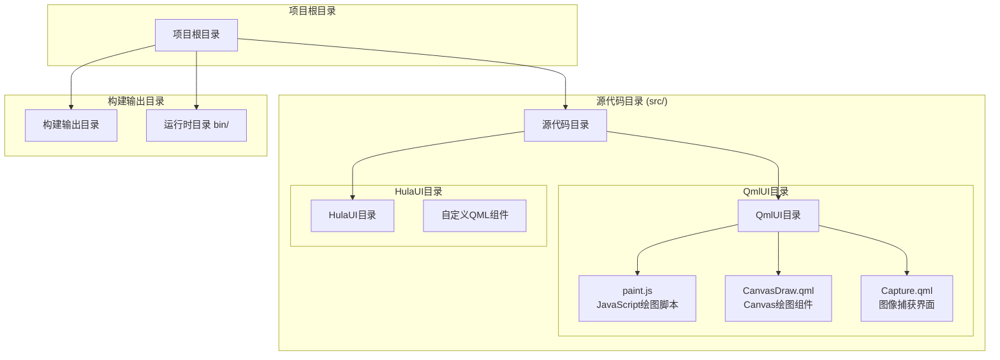
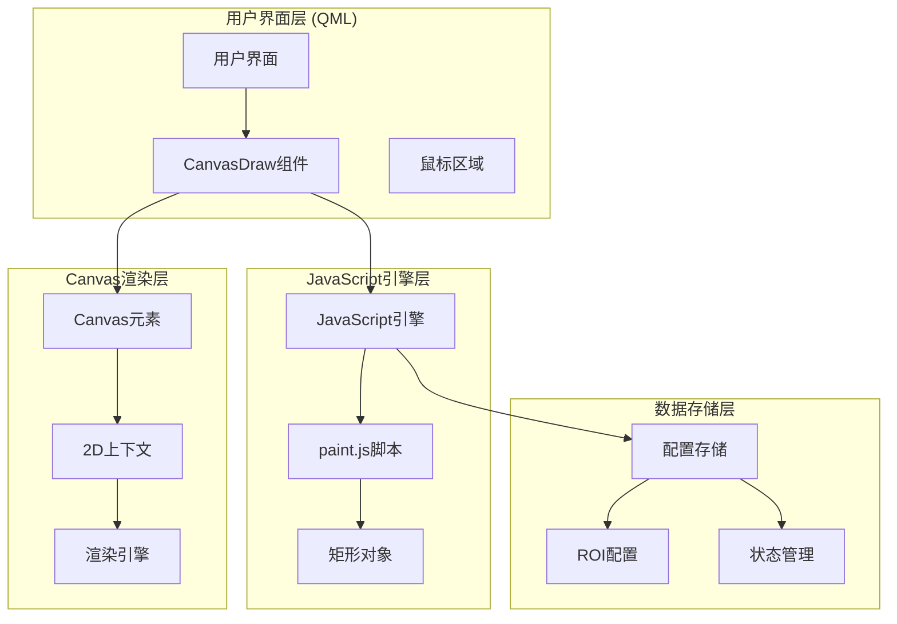
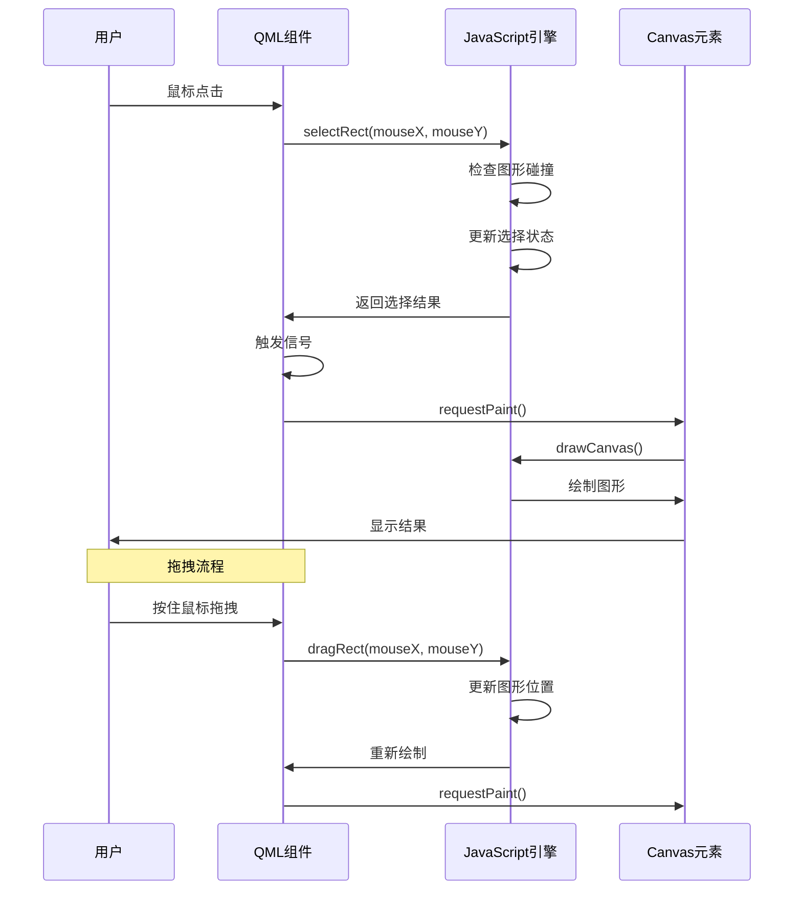
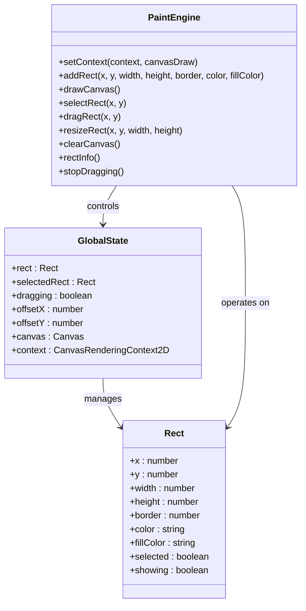
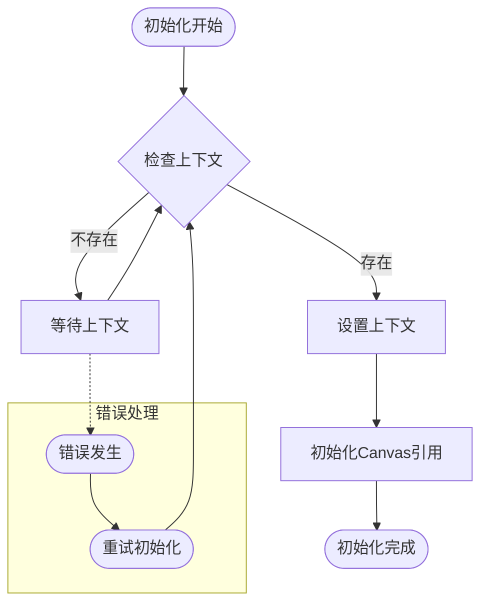
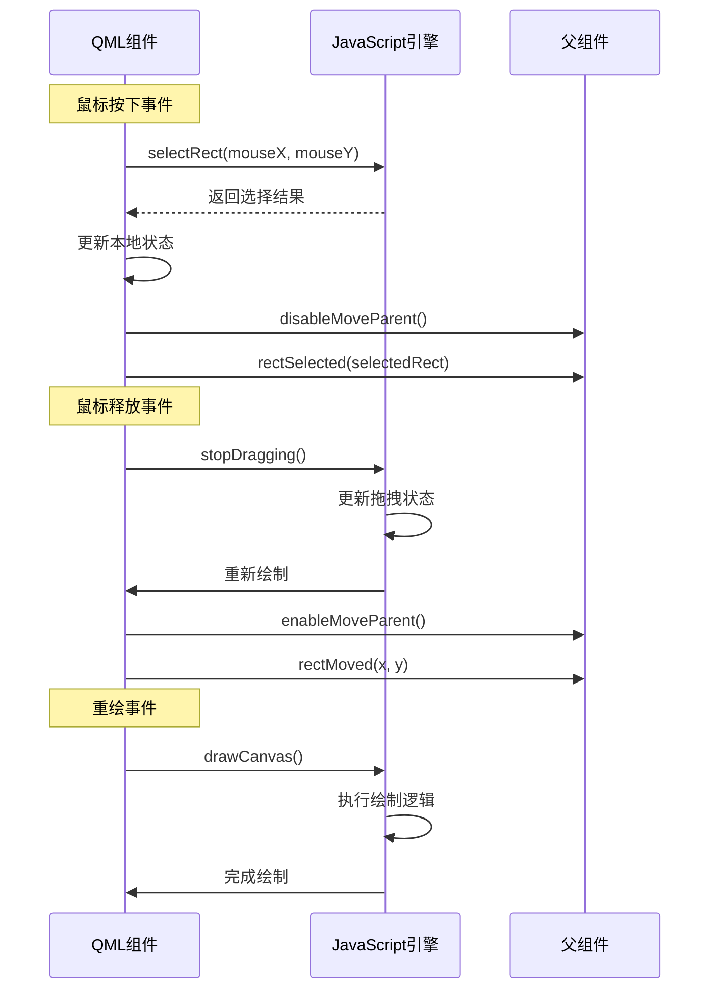
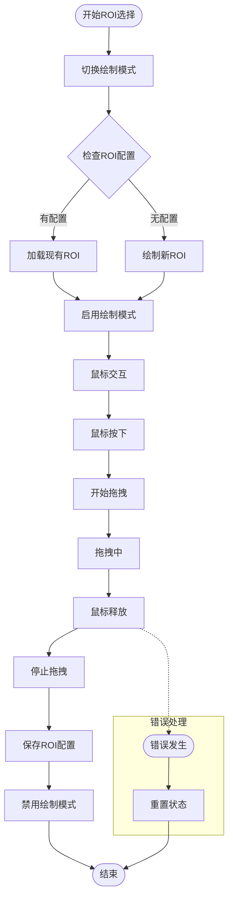
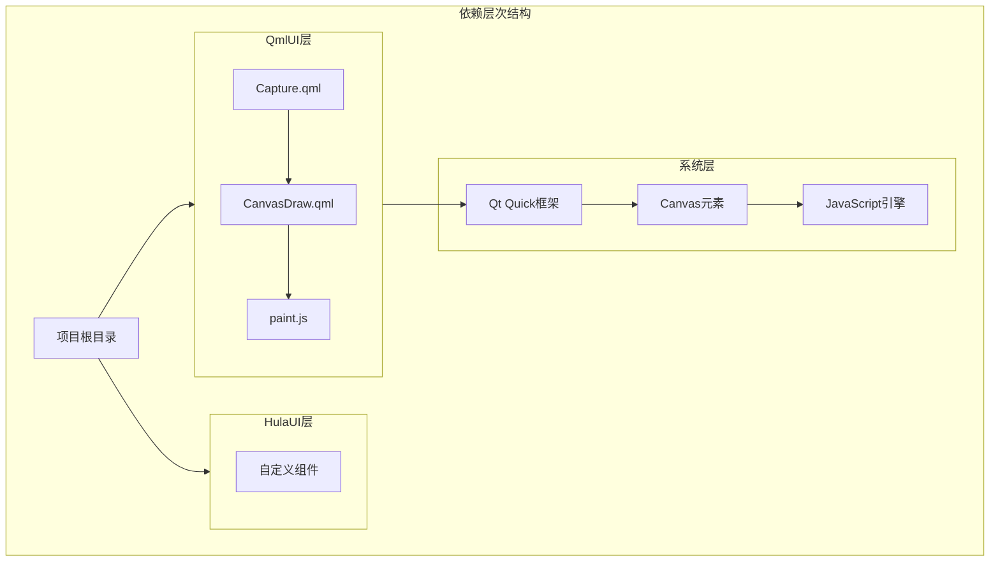
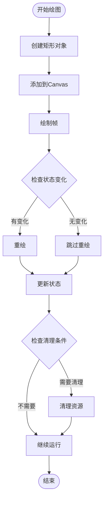

# JavaScript脚本集成

<cite>
**本文档引用的文件**
- [paint.js](file://src/QmlUI/paint.js)
- [CanvasDraw.qml](file://src/QmlUI/CanvasDraw.qml)
- [Capture.qml](file://src/QmlUI/Capture.qml)
- [README.md](file://README.md)
</cite>

## 目录
1. [简介](#简介)
2. [项目结构](#项目结构)
3. [核心组件](#核心组件)
4. [架构概览](#架构概览)
5. [详细组件分析](#详细组件分析)
6. [依赖关系分析](#依赖关系分析)
7. [性能考虑](#性能考虑)
8. [故障排除指南](#故障排除指南)
9. [结论](#结论)

## 简介

QmlPlugins项目中的JavaScript脚本集成功能是一个重要的技术特性，它展示了如何在Qt Quick应用程序中有效集成JavaScript代码来增强Canvas绘图功能。本文档深入分析了`paint.js`文件的功能实现，详细解释了JavaScript与QML的集成方式、调用机制和数据交换方法，并提供了完整的架构分析和最佳实践指导。

该系统的核心价值在于通过JavaScript模块化Canvas绘图逻辑，实现了可复用的绘图组件，支持矩形绘制、拖拽操作、选择功能等高级交互特性，为医疗报告管理系统提供了强大的图像标注能力。

## 项目结构

QmlPlugins项目采用模块化的文件组织结构，JavaScript脚本集成功能主要分布在以下目录中：

**图表来源**
- [README.md:36-45](file://README.md#L36-L45)

**章节来源**
- [README.md:36-45](file://README.md#L36-L45)

## 核心组件

### JavaScript绘图引擎 (paint.js)

JavaScript绘图引擎是整个系统的核心，负责管理Canvas状态和执行绘图操作。该引擎提供了完整的图形生命周期管理，包括图形创建、渲染、交互和清理。

#### 主要功能模块

1. **全局状态管理**
   - 图形实例管理：维护当前绘制的矩形对象
   - 选择状态跟踪：管理选中图形的状态
   - 拖拽控制：协调拖拽操作的生命周期

2. **绘图上下文初始化**
   - Canvas上下文设置：建立JavaScript与Canvas的连接
   - 上下文参数传递：确保绘图操作的正确性

3. **图形操作接口**
   - 创建和删除图形：支持动态图形管理
   - 几何变换：提供缩放、移动等几何操作
   - 选择检测：实现精确的点击选择功能

**章节来源**
- [paint.js:1-139](file://src/QmlUI/paint.js#L1-L139)

### Canvas绘图组件 (CanvasDraw.qml)

CanvasDraw组件是QML层的JavaScript集成接口，负责协调JavaScript绘图引擎与QML用户界面的交互。

#### 关键特性

1. **信号和槽机制**
   - 图形选择通知：向父组件报告图形选择状态
   - 位置变更事件：监听图形移动并更新配置
   - 鼠标事件处理：实现完整的鼠标交互

2. **生命周期管理**
   - 上下文初始化：在Canvas可用时设置JavaScript上下文
   - 重绘请求：通过requestPaint()优化重绘性能
   - 资源清理：确保JavaScript资源的正确释放

3. **用户交互集成**
   - 鼠标区域：提供完整的鼠标事件响应
   - 拖拽支持：实现平滑的图形拖拽体验
   - 状态同步：保持QML和JavaScript状态的一致性

**章节来源**
- [CanvasDraw.qml:1-103](file://src/QmlUI/CanvasDraw.qml#L1-L103)

### 实际应用场景 (Capture.qml)

Capture界面展示了CanvasDraw组件在实际医疗图像处理场景中的应用，体现了JavaScript集成的强大功能。

#### 应用特点

1. **图像标注功能**
   - ROI区域选择：支持用户手动选择感兴趣区域
   - 实时预览：提供实时的标注反馈
   - 配置持久化：保存用户的标注设置

2. **工作流程集成**
   - 相机控制：与相机组件无缝集成
   - 图像处理：结合图像特效组件
   - 报告生成：支持后续的报告制作流程

**章节来源**
- [Capture.qml:164-167](file://src/QmlUI/Capture.qml#L164-L167)

## 架构概览

### 整体架构设计

**图表来源**
- [CanvasDraw.qml:3](file://src/QmlUI/CanvasDraw.qml#L3)
- [paint.js:10](file://src/QmlUI/paint.js#L10)

### 数据流架构

**图表来源**
- [CanvasDraw.qml:59-99](file://src/QmlUI/CanvasDraw.qml#L59-L99)
- [paint.js:91-138](file://src/QmlUI/paint.js#L91-L138)

## 详细组件分析

### JavaScript绘图引擎深度解析

#### 全局状态管理机制

JavaScript引擎通过一组全局变量实现状态管理，这种设计虽然简单直接，但在小型应用中具有良好的可维护性。

**图表来源**
- [paint.js:1-26](file://src/QmlUI/paint.js#L1-L26)
- [paint.js:16](file://src/QmlUI/paint.js#L16)

#### 绘图上下文初始化流程

上下文初始化是JavaScript与Canvas集成的关键环节，确保绘图操作能够在正确的环境中执行。

**图表来源**
- [paint.js:10](file://src/QmlUI/paint.js#L10)
- [paint.js:51](file://src/QmlUI/paint.js#L51)

**章节来源**
- [paint.js:1-139](file://src/QmlUI/paint.js#L1-L139)

### CanvasDraw组件集成机制

#### 信号和槽的双向通信

CanvasDraw组件通过信号和槽机制实现了与JavaScript引擎的双向通信，这是QML与JavaScript集成的核心模式。

**图表来源**
- [CanvasDraw.qml:59-82](file://src/QmlUI/CanvasDraw.qml#L59-L82)
- [paint.js:91-122](file://src/QmlUI/paint.js#L91-L122)

#### 重绘优化策略

CanvasDraw组件采用了高效的重绘优化策略，通过requestPaint()方法避免不必要的重绘操作。

**章节来源**
- [CanvasDraw.qml:17-49](file://src/QmlUI/CanvasDraw.qml#L17-L49)

### 实际应用案例分析

#### ROI区域选择功能

Capture界面展示了CanvasDraw组件在医疗图像处理中的实际应用，ROI（Region of Interest）区域选择是该功能的核心。

**图表来源**
- [Capture.qml:266-290](file://src/QmlUI/Capture.qml#L266-L290)
- [CanvasDraw.qml:9-15](file://src/QmlUI/CanvasDraw.qml#L9-L15)

**章节来源**
- [Capture.qml:164-290](file://src/QmlUI/Capture.qml#L164-L290)

## 依赖关系分析

### 模块间依赖关系

**图表来源**
- [CanvasDraw.qml:1-3](file://src/QmlUI/CanvasDraw.qml#L1-L3)
- [Capture.qml:7](file://src/QmlUI/Capture.qml#L7)

### JavaScript集成点分析

JavaScript脚本在项目中的集成点主要集中在以下几个关键位置：

1. **CanvasDraw组件导入**：通过import语句直接引入JavaScript模块
2. **上下文初始化**：在Canvas可用时建立JavaScript上下文连接
3. **事件处理桥接**：将QML事件转换为JavaScript函数调用
4. **状态同步**：保持QML和JavaScript状态的一致性

**章节来源**
- [CanvasDraw.qml:3](file://src/QmlUI/CanvasDraw.qml#L3)
- [CanvasDraw.qml:51](file://src/QmlUI/CanvasDraw.qml#L51)

## 性能考虑

### 绘图性能优化

JavaScript绘图引擎采用了多项性能优化策略来确保流畅的用户体验：

1. **增量重绘**：仅在必要时重新绘制Canvas内容
2. **状态缓存**：避免重复计算图形属性
3. **事件节流**：限制高频事件的处理频率
4. **内存管理**：及时清理不再使用的图形对象

### 内存管理策略

**图表来源**
- [paint.js:69-89](file://src/QmlUI/paint.js#L69-L89)
- [paint.js:61-67](file://src/QmlUI/paint.js#L61-L67)

### 最佳实践建议

1. **状态管理**：合理使用全局变量管理状态，避免内存泄漏
2. **事件处理**：在适当的时机触发requestPaint()以优化性能
3. **错误处理**：实现完善的错误处理机制，确保系统的稳定性
4. **资源清理**：及时清理不再使用的图形对象和事件监听器

## 故障排除指南

### 常见问题及解决方案

#### JavaScript上下文初始化失败

**问题描述**：JavaScript引擎无法正确初始化Canvas上下文

**可能原因**：
- Canvas元素尚未准备好
- JavaScript模块加载失败
- 上下文参数传递错误

**解决方法**：
1. 确保在Canvas的onAvailableChanged信号中初始化上下文
2. 检查JavaScript文件的路径和语法
3. 验证传入的CanvasDraw对象的有效性

#### 图形选择功能异常

**问题描述**：鼠标点击无法正确选择图形

**可能原因**：
- 碰撞检测算法错误
- 坐标系统不匹配
- 选择状态管理问题

**解决方法**：
1. 检查selectRect函数中的坐标计算
2. 验证图形边界检测逻辑
3. 确保选择状态的正确更新

#### 拖拽功能失效

**问题描述**：图形无法拖拽或拖拽不流畅

**可能原因**：
- 拖拽状态管理错误
- 偏移量计算问题
- 重绘性能不足

**解决方法**：
1. 检查dragRect函数中的位置更新逻辑
2. 验证offsetX和offsetY的计算准确性
3. 优化重绘性能，减少不必要的绘制操作

### 调试技巧

1. **日志记录**：在关键函数中添加console.log()输出
2. **状态检查**：定期检查全局变量的状态一致性
3. **性能监控**：使用Qt的性能分析工具监控重绘频率
4. **单元测试**：为关键函数编写简单的测试用例

**章节来源**
- [paint.js:91-138](file://src/QmlUI/paint.js#L91-L138)
- [CanvasDraw.qml:59-99](file://src/QmlUI/CanvasDraw.qml#L59-L99)

## 结论

QmlPlugins项目的JavaScript脚本集成功能展现了现代Qt Quick应用开发的最佳实践。通过将绘图逻辑从QML中分离到JavaScript模块，实现了更好的代码组织和可维护性。

该系统的主要优势包括：

1. **模块化设计**：JavaScript引擎独立于QML界面，便于测试和维护
2. **性能优化**：通过增量重绘和状态缓存确保流畅的用户体验
3. **扩展性强**：易于添加新的图形类型和交互功能
4. **集成简便**：通过标准的QML导入机制实现无缝集成

未来可以考虑的改进方向：
- 实现更复杂的图形类型支持
- 添加图形变换和特效功能
- 优化内存使用和性能表现
- 增强错误处理和调试能力

这个JavaScript集成方案为类似的应用程序提供了宝贵的参考，展示了如何在Qt环境中有效利用JavaScript的强大功能来增强用户界面的交互性和功能性。