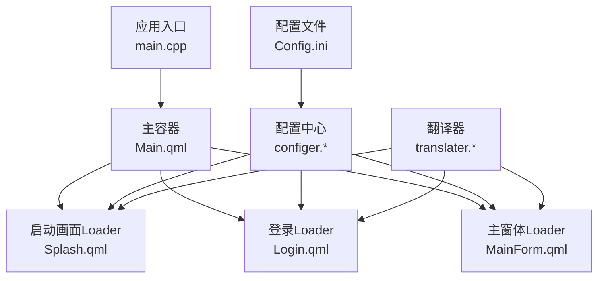
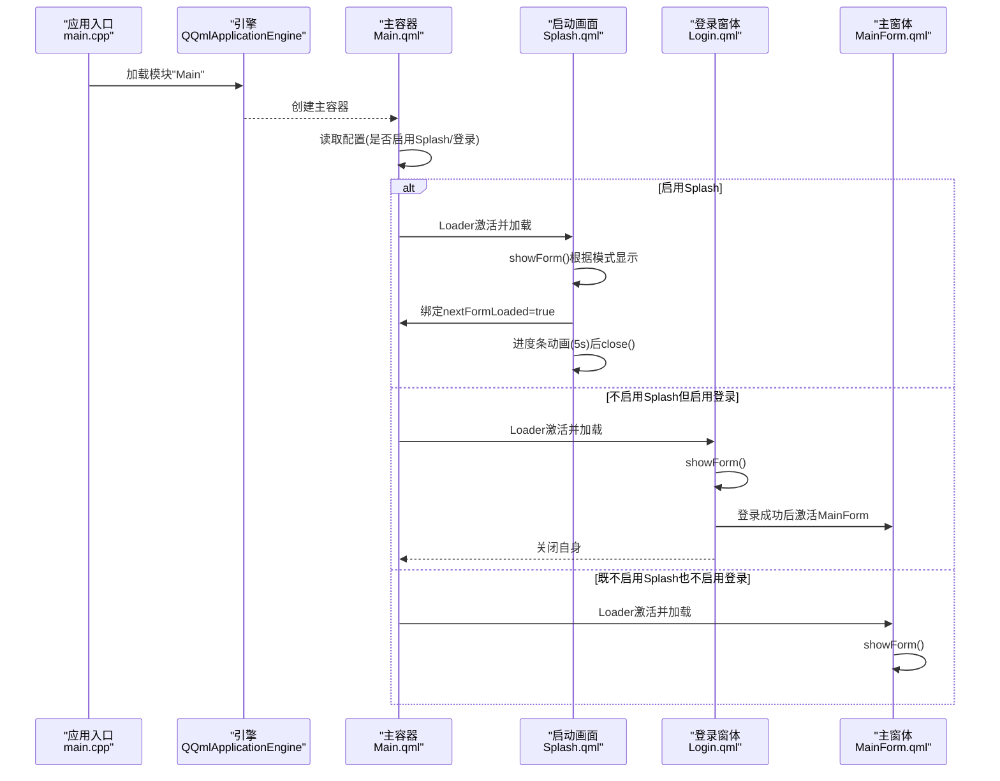
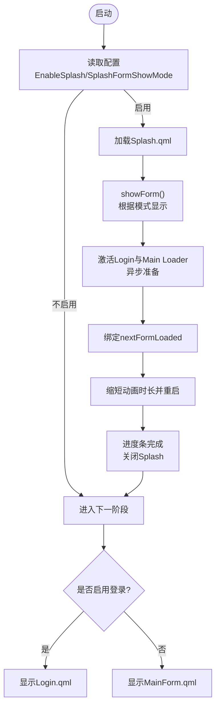
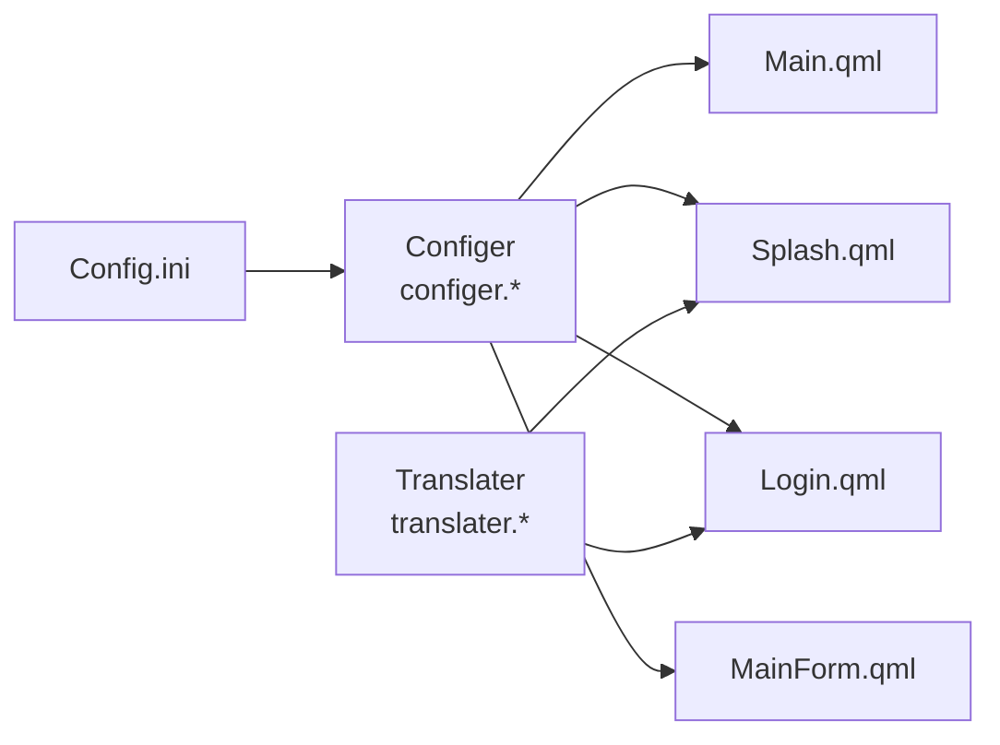

# 启动画面管理

<cite>
**本文引用的文件**
- [Splash.qml](file://src/QmlUI/Splash.qml)
- [Main.qml](file://src/QmlUI/Main.qml)
- [Login.qml](file://src/QmlUI/Login.qml)
- [MainForm.qml](file://src/QmlUI/MainForm.qml)
- [main.cpp](file://src/main.cpp)
- [configer.h](file://src/configer.h)
- [configer.cpp](file://src/configer.cpp)
- [Config.ini（源）](file://src/Config.ini)
- [Config.ini（bin）](file://bin/Config.ini)
- [Config.ini（resources）](file://resources/Config.ini)
- [cn.ini](file://bin/Languages/cn.ini)
- [translater.h](file://src/translater.h)
- [translater.cpp](file://src/translater.cpp)
</cite>

## 目录
1. [简介](#简介)
2. [项目结构](#项目结构)
3. [核心组件](#核心组件)
4. [架构总览](#架构总览)
5. [详细组件分析](#详细组件分析)
6. [依赖关系分析](#依赖关系分析)
7. [性能考虑](#性能考虑)
8. [故障排查指南](#故障排查指南)
9. [结论](#结论)
10. [附录](#附录)

## 简介
本文件面向QmlPlugins项目的“启动画面管理”，系统性阐述Splash目录的组织方式、启动画面的显示逻辑、加载顺序与用户体验优化策略；说明配置参数、显示时长与过渡效果；介绍启动画面与主界面的切换机制、状态管理与错误处理；并给出设计规范、尺寸建议与视觉效果建议。同时提供可定位的代码片段路径，帮助开发者快速实现与调整。

## 项目结构
启动画面相关的关键文件分布如下：
- QML侧入口与加载控制：Main.qml
- 启动画面窗体：Splash.qml
- 登录窗体（可选）：Login.qml
- 主窗体（可选）：MainForm.qml
- 应用入口与初始化：main.cpp
- 配置中心：configer.h / configer.cpp
- 配置文件：Config.ini（源码、bin、resources）
- 多语言：cn.ini
- 翻译器：translater.h / translater.cpp

图表来源
- [main.cpp:93](file://src/main.cpp#L93)
- [Main.qml:14-39](file://src/QmlUI/Main.qml#L14-L39)
- [Splash.qml:7-58](file://src/QmlUI/Splash.qml#L7-L58)
- [Login.qml:9-33](file://src/QmlUI/Login.qml#L9-L33)
- [MainForm.qml:9-53](file://src/QmlUI/MainForm.qml#L9-L53)
- [configer.h:98-120](file://src/configer.h#L98-L120)
- [configer.cpp:102-122](file://src/configer.cpp#L102-L122)
- [Config.ini（bin）:10-16](file://bin/Config.ini#L10-L16)

章节来源
- [main.cpp:93](file://src/main.cpp#L93)
- [Main.qml:14-39](file://src/QmlUI/Main.qml#L14-L39)

## 核心组件
- 启动画面窗体（Splash.qml）
  - 属性：显示模式、是否启用登录、下一个窗体是否加载完成、渲染标记、图像列表
  - 行为：根据配置决定显示模式；在可见变化时触发加载与显示；进度条动画完成后关闭
  - 视觉：背景图、Logo与品牌文案、标语文本、底部进度条
- 主容器（Main.qml）
  - 统一调度：根据配置决定是否加载Splash、Login或MainForm
  - 异步加载：当启用Splash或Login时，MainForm异步加载以提升首屏体验
  - 生命周期：在加载完成后调用对应窗体的showForm
- 登录窗体（Login.qml）
  - 可选流程：当启用登录时，Splash结束后显示登录窗体
  - 切换：登录成功后激活MainForm并关闭自身
- 主窗体（MainForm.qml）
  - 可选流程：当既不启用Splash也不启用Login时直接显示
  - 状态清理：在可见时清空Splash与Login的Loader来源，避免重复加载
- 配置中心（configer.*）
  - 提供：是否启用Splash、Splash显示模式、是否启用Login、各窗体显示模式等
  - 读取：从Config.ini读取键值，支持布尔与整型映射
- 配置文件（Config.ini）
  - 关键项：EnableSplash、SplashFormShowMode、EnableLogin、LoginFormShowMode、MainFormShowMode
- 翻译器（translater.*）
  - 提供：品牌名、标语、登录标题等文案的本地化
  - 集成：Splash与Login通过qsTr与translater.change进行文本翻译

章节来源
- [Splash.qml:7-58](file://src/QmlUI/Splash.qml#L7-L58)
- [Main.qml:14-39](file://src/QmlUI/Main.qml#L14-L39)
- [Login.qml:9-33](file://src/QmlUI/Login.qml#L9-L33)
- [MainForm.qml:9-60](file://src/QmlUI/MainForm.qml#L9-L60)
- [configer.h:104-120](file://src/configer.h#L104-L120)
- [configer.cpp:102-122](file://src/configer.cpp#L102-L122)
- [Config.ini（bin）:10-16](file://bin/Config.ini#L10-L16)
- [translater.h:31-34](file://src/translater.h#L31-L34)
- [translater.cpp:106-111](file://src/translater.cpp#L106-L111)

## 架构总览
启动画面管理采用“配置驱动 + Loader异步加载”的架构，确保首屏快速可用且可按需切换至登录或主界面。

图表来源
- [main.cpp:93](file://src/main.cpp#L93)
- [Main.qml:14-39](file://src/QmlUI/Main.qml#L14-L39)
- [Splash.qml:46-58](file://src/QmlUI/Splash.qml#L46-L58)
- [Login.qml:22-33](file://src/QmlUI/Login.qml#L22-L33)
- [MainForm.qml:42-53](file://src/QmlUI/MainForm.qml#L42-L53)

## 详细组件分析

### 启动画面（Splash.qml）
- 显示逻辑
  - 根据配置决定显示模式（普通/最大化/全屏），在showForm中应用
  - 可见时激活Login与Main的Loader，以便后台异步准备
  - 绑定nextFormLoaded，一旦Main的item可用即缩短动画时长并重启
  - 进度条动画时长为5秒，完成后自动关闭
- 用户体验优化
  - 异步加载：MainForm在Splash/Login启用时异步加载，减少阻塞
  - 渐变进度条：线性缓动，视觉平滑
  - 无边框窗体：营造沉浸式启动体验
- 视觉元素
  - 背景图、Logo、品牌名、标语、进度条
- 切换机制
  - 由Main容器统一调度，Splash结束后自动关闭，随后由Main决定下一步显示

图表来源
- [Splash.qml:19-58](file://src/QmlUI/Splash.qml#L19-L58)
- [Splash.qml:142-154](file://src/QmlUI/Splash.qml#L142-L154)
- [Main.qml:14-39](file://src/QmlUI/Main.qml#L14-L39)

章节来源
- [Splash.qml:7-58](file://src/QmlUI/Splash.qml#L7-L58)
- [Splash.qml:142-154](file://src/QmlUI/Splash.qml#L142-L154)
- [Main.qml:14-39](file://src/QmlUI/Main.qml#L14-L39)

### 主容器（Main.qml）
- 统一入口：根据配置决定加载Splash、Login或MainForm
- 异步策略：当启用Splash或Login时，MainForm异步加载，提升首屏速度
- 生命周期：在加载完成后调用对应窗体的showForm

章节来源
- [Main.qml:8-39](file://src/QmlUI/Main.qml#L8-L39)

### 登录窗体（Login.qml）
- 可选流程：当启用登录时，Splash结束后显示登录窗体
- 切换机制：登录成功后激活MainForm并关闭自身
- 视觉：左侧配图、右侧登录表单、阴影与圆角背景

章节来源
- [Login.qml:9-33](file://src/QmlUI/Login.qml#L9-L33)
- [Login.qml:321-336](file://src/QmlUI/Login.qml#L321-L336)

### 主窗体（MainForm.qml）
- 可选流程：当既不启用Splash也不启用Login时直接显示
- 状态清理：在可见时清空Splash与Login的Loader来源，避免重复加载
- 背景墙纸：可选动态墙纸与透明度动画

章节来源
- [MainForm.qml:9-60](file://src/QmlUI/MainForm.qml#L9-L60)
- [MainForm.qml:266-342](file://src/QmlUI/MainForm.qml#L266-L342)

### 配置中心（configer.*）
- 提供：是否启用Splash、Splash显示模式、是否启用Login、各窗体显示模式等
- 读取：从Config.ini读取键值，支持布尔与整型映射

章节来源
- [configer.h:104-120](file://src/configer.h#L104-L120)
- [configer.cpp:102-122](file://src/configer.cpp#L102-L122)

### 配置文件（Config.ini）
- 关键项：EnableSplash、SplashFormShowMode、EnableLogin、LoginFormShowMode、MainFormShowMode
- 示例路径：bin/Config.ini、resources/Config.ini、src/Config.ini

章节来源
- [Config.ini（bin）:10-16](file://bin/Config.ini#L10-L16)
- [Config.ini（resources）:10-16](file://resources/Config.ini#L10-L16)
- [Config.ini（源）:10-16](file://src/Config.ini#L10-L16)

### 翻译器（translater.*）
- 提供：品牌名、标语、登录标题等文案的本地化
- 集成：Splash与Login通过qsTr与translater.change进行文本翻译

章节来源
- [translater.h:31-34](file://src/translater.h#L31-L34)
- [translater.cpp:106-111](file://src/translater.cpp#L106-L111)
- [cn.ini:53-54](file://bin/Languages/cn.ini#L53-L54)

## 依赖关系分析
- Main.qml依赖Configer读取开关与显示模式
- Splash.qml依赖Configer与Main的Loader状态
- Login.qml依赖Configer与Main的Loader状态
- MainForm.qml依赖Configer与Main的Loader状态
- 翻译器为Splash与Login提供本地化文本

图表来源
- [configer.h:98-120](file://src/configer.h#L98-L120)
- [Main.qml:8](file://src/QmlUI/Main.qml#L8)
- [Splash.qml:9](file://src/QmlUI/Splash.qml#L9)
- [Login.qml:11](file://src/QmlUI/Login.qml#L11)
- [MainForm.qml:11](file://src/QmlUI/MainForm.qml#L11)
- [translater.h:31-34](file://src/translater.h#L31-L34)
- [Config.ini（bin）:10-16](file://bin/Config.ini#L10-L16)

章节来源
- [configer.h:98-120](file://src/configer.h#L98-L120)
- [Main.qml:8](file://src/QmlUI/Main.qml#L8)
- [Splash.qml:9](file://src/QmlUI/Splash.qml#L9)
- [Login.qml:11](file://src/QmlUI/Login.qml#L11)
- [MainForm.qml:11](file://src/QmlUI/MainForm.qml#L11)
- [translater.h:31-34](file://src/translater.h#L31-L34)
- [Config.ini（bin）:10-16](file://bin/Config.ini#L10-L16)

## 性能考虑
- 异步加载：MainForm在Splash/Login启用时异步加载，降低首屏阻塞
- 动画时长：启动画面进度条默认5秒，可在启动完成后缩短动画时长以提升感知速度
- 资源路径：确保Images与Splash目录下的资源路径正确，避免IO阻塞
- 窗口模式：最大化/全屏模式可能带来额外绘制成本，建议按实际需求选择

## 故障排查指南
- 启动画面不显示
  - 检查配置：EnableSplash是否为1
  - 检查路径：Images/splash.png与Images/logo.svg是否存在
  - 检查Loader：Main.qml中Splash的Loader是否被激活
- 登录窗体不出现
  - 检查配置：EnableLogin是否为1
  - 检查切换逻辑：Login.qml中登录成功后是否激活MainForm
- 主窗体不显示
  - 检查配置：是否同时禁用了Splash与Login
  - 检查Loader：Main.qml中MainForm的Loader是否被激活
- 文案未本地化
  - 检查翻译器：translater是否正确初始化并设置上下文
  - 检查语言文件：cn.ini中对应键值是否存在

章节来源
- [Config.ini（bin）:10-16](file://bin/Config.ini#L10-L16)
- [Main.qml:14-39](file://src/QmlUI/Main.qml#L14-L39)
- [Login.qml:321-336](file://src/QmlUI/Login.qml#L321-L336)
- [translater.cpp:24-37](file://src/translater.cpp#L24-L37)

## 结论
QmlPlugins的启动画面管理通过“配置驱动 + Loader异步加载”实现了灵活可控的启动流程。Splash作为统一入口，结合Login与MainForm形成完整的用户引导链路。通过合理配置显示模式、动画时长与资源路径，可在保证性能的同时提供良好的用户体验。

## 附录

### 启动画面配置参数与含义
- EnableSplash：是否启用启动画面（1=启用，0=禁用）
- SplashFormShowMode：启动画面显示模式（0=普通，1=最大化，2=全屏）
- EnableLogin：是否启用登录（1=启用，0=禁用）
- LoginFormShowMode：登录窗体显示模式（0=普通，1=最大化，2=全屏）
- MainFormShowMode：主窗体显示模式（0=普通，1=最大化，2=全屏）

章节来源
- [Config.ini（bin）:10-16](file://bin/Config.ini#L10-L16)
- [configer.cpp:102-122](file://src/configer.cpp#L102-L122)

### 启动画面显示时长与过渡效果
- 默认进度条动画时长：5秒
- 启动完成后过渡动画时长：300ms
- 缓动类型：线性

章节来源
- [Splash.qml:142-154](file://src/QmlUI/Splash.qml#L142-L154)
- [Splash.qml:38-44](file://src/QmlUI/Splash.qml#L38-L44)

### 启动画面与主界面的切换机制
- Splash结束后自动关闭，由Main根据配置决定下一步显示
- Login成功后激活MainForm并关闭自身
- MainForm在可见时清理Splash与Login的Loader来源

章节来源
- [Splash.qml:51-58](file://src/QmlUI/Splash.qml#L51-L58)
- [Login.qml:321-336](file://src/QmlUI/Login.qml#L321-L336)
- [MainForm.qml:55-60](file://src/QmlUI/MainForm.qml#L55-L60)

### 设计规范与视觉建议
- 尺寸建议：1568x864（像素），适配主流桌面分辨率
- 背景图：Images/splash.png，建议使用高分辨率与渐变色背景
- Logo与标语：Images/logo.svg，品牌名与标语来自翻译文件
- 进度条：底部居中，宽度与Logo行一致，渐变色增强视觉层次
- 窗口模式：优先使用“最大化”以覆盖全屏体验，兼顾性能与兼容性

章节来源
- [Splash.qml:12-13](file://src/QmlUI/Splash.qml#L12-L13)
- [Splash.qml:60-95](file://src/QmlUI/Splash.qml#L60-L95)
- [Splash.qml:97-140](file://src/QmlUI/Splash.qml#L97-L140)

### 代码示例路径（实现与配置）
- 启动画面窗体：[Splash.qml](file://src/QmlUI/Splash.qml)
- 主容器加载逻辑：[Main.qml](file://src/QmlUI/Main.qml)
- 登录窗体切换：[Login.qml](file://src/QmlUI/Login.qml)
- 主窗体显示：[MainForm.qml](file://src/QmlUI/MainForm.qml)
- 配置中心接口：[configer.h](file://src/configer.h), [configer.cpp](file://src/configer.cpp)
- 配置文件示例：[Config.ini（bin）](file://bin/Config.ini), [Config.ini（resources）](file://resources/Config.ini), [Config.ini（源）](file://src/Config.ini)
- 翻译器集成：[translater.h](file://src/translater.h), [translater.cpp](file://src/translater.cpp)