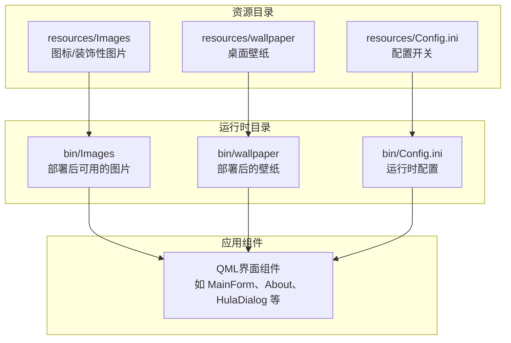
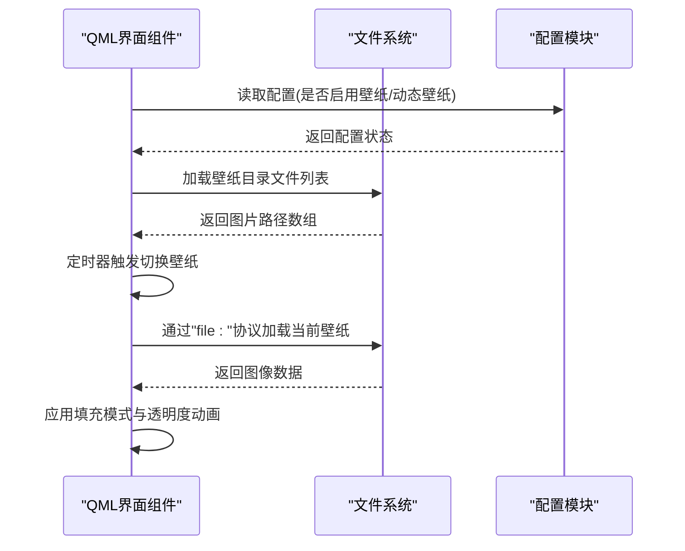
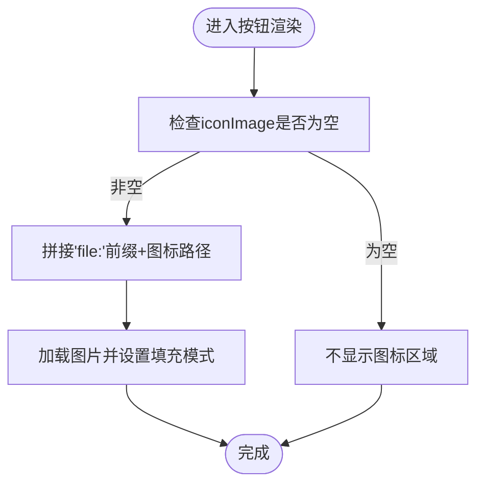
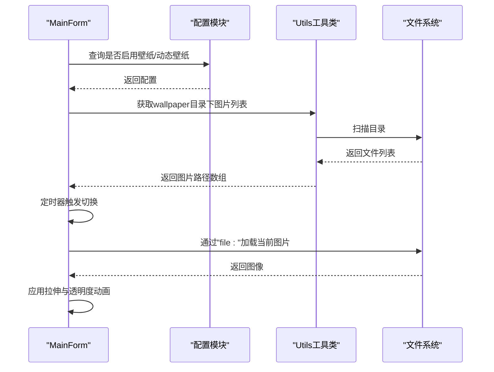
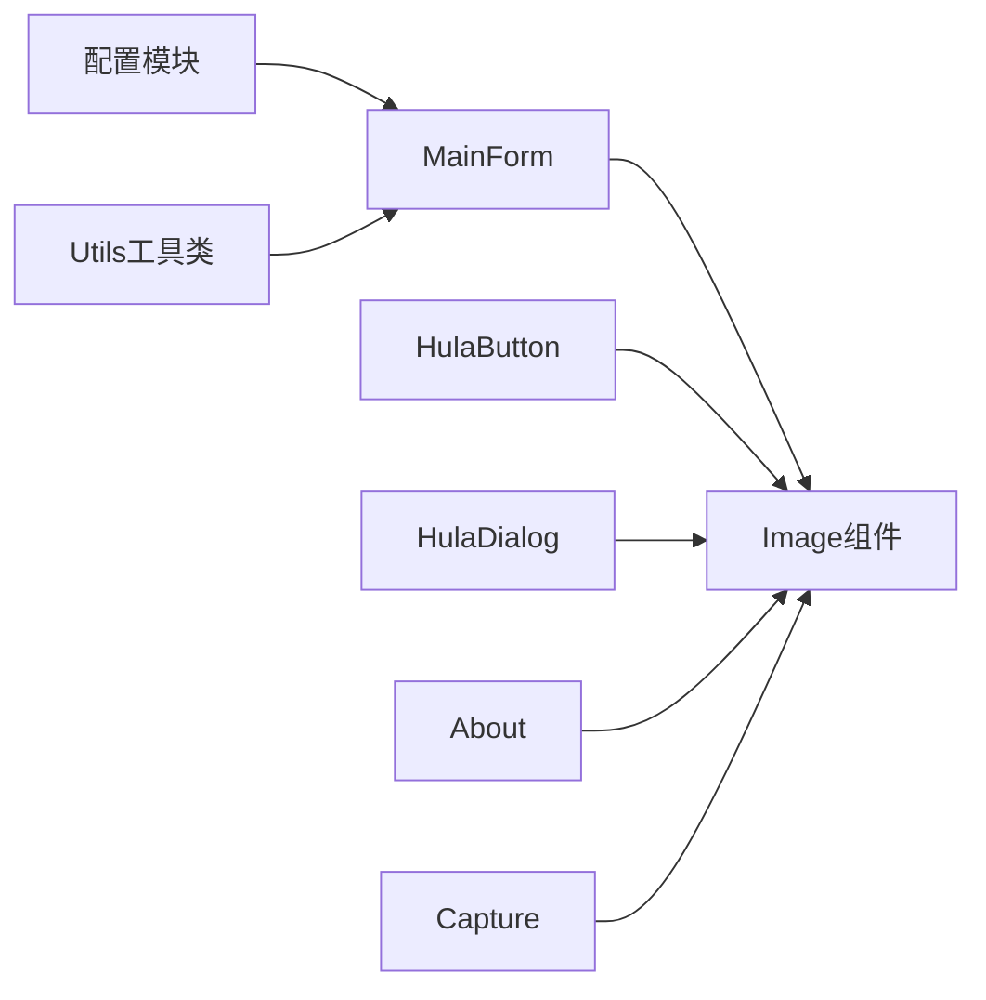

# 图片资源管理

<cite>
**本文档引用的文件**
- [HulaButton.qml](file://src/HulaUI/HulaButton.qml)
- [HulaDialog.qml](file://src/HulaUI/HulaDialog.qml)
- [About.qml](file://src/QmlUI/About.qml)
- [MainForm.qml](file://src/QmlUI/MainForm.qml)
- [Capture.qml](file://src/QmlUI/Capture.qml)
- [utils.h](file://src/utils.h)
- [Config.ini](file://resources/Config.ini)
- [Config.ini](file://bin/Config.ini)
</cite>

## 目录
1. [简介](#简介)
2. [项目结构](#项目结构)
3. [核心组件](#核心组件)
4. [架构总览](#架构总览)
5. [详细组件分析](#详细组件分析)
6. [依赖关系分析](#依赖关系分析)
7. [性能考虑](#性能考虑)
8. [故障排查指南](#故障排查指南)
9. [结论](#结论)
10. [附录](#附录)

## 简介
本文件面向QmlPlugins项目的图片资源管理，系统性阐述resources/Images与bin/Images目录的组织结构、图片文件命名规范、在QML组件中的引用方式、加载机制与性能优化策略，并给出图标、背景、装饰性图片等不同类型资源的使用场景与最佳实践。同时提供图片压缩、格式转换与缓存策略建议，并通过HulaUI组件的实际用法展示如何正确使用图片资源。

## 项目结构
QmlPlugins的图片资源主要分布在以下位置：
- 资源目录：resources/Images、resources/wallpaper
- 运行时目录：bin/Images、bin/wallpaper
- 配置文件：resources/Config.ini、bin/Config.ini（控制壁纸启用与路径）

**图表来源**
- [Config.ini](file://resources/Config.ini)
- [Config.ini](file://bin/Config.ini)

**章节来源**
- [Config.ini](file://resources/Config.ini)
- [Config.ini](file://bin/Config.ini)

## 核心组件
- 图片引用与加载
  - 文件协议：通过“file:”前缀从本地文件系统加载图片，例如“file:Images/logo.png”、“file:Images/close.svg”。
  - 动态路径拼接：在运行时根据配置或业务逻辑动态拼接图片路径。
  - 图像填充模式：常用 PreserveAspectFit 保持比例；背景图常用 Stretch 拉伸铺满。
- 壁纸系统
  - 通过配置项控制是否启用壁纸与是否为动态壁纸。
  - 使用定时器轮播壁纸目录下的多张图片，实现Live Wallpaper效果。
- 图标与装饰性图片
  - 图标通常采用矢量SVG以保证清晰度与小体积。
  - 装饰性图片用于界面美化，注意尺寸与分辨率匹配设备DPR。

**章节来源**
- [About.qml](file://src/QmlUI/About.qml)
- [HulaDialog.qml](file://src/HulaUI/HulaDialog.qml)
- [MainForm.qml](file://src/QmlUI/MainForm.qml)

## 架构总览
图片资源在QmlPlugins中的调用链路如下：

**图表来源**
- [MainForm.qml](file://src/QmlUI/MainForm.qml)
- [utils.h](file://src/utils.h)

## 详细组件分析

### 组件一：图标按钮（HulaButton）
- 功能要点
  - 支持通过属性设置图标路径，若未设置则不显示图标区域。
  - 图标加载采用“file:”协议拼接完整路径。
  - 图像填充模式为 PreserveAspectFit，确保图标按比例缩放。
- 典型用法
  - 在需要图标的按钮中设置 iconImage 属性为“Images/xxx.svg”，并在Image元素中绑定该属性。
- 性能建议
  - SVG矢量图标可避免高DPI下的模糊，且文件体积较小。
  - 合理控制图标尺寸，避免过大导致解码开销。

**图表来源**
- [HulaButton.qml](file://src/HulaUI/HulaButton.qml)

**章节来源**
- [HulaButton.qml](file://src/HulaUI/HulaButton.qml)

### 组件二：对话框（HulaDialog）
- 功能要点
  - 关闭按钮使用“Images/close.svg”作为图标资源。
  - 通过设置Image的source为空字符串实现关闭时的清理。
- 最佳实践
  - 对于频繁切换的图标，建议统一放置在Images目录，便于维护与缓存复用。

**章节来源**
- [HulaDialog.qml](file://src/HulaUI/HulaDialog.qml)

### 组件三：关于页面（About）
- 功能要点
  - 使用Image组件加载“Images/logo.png”作为应用Logo。
  - 设置填充模式为 PreserveAspectFit，保证Logo清晰显示。
- 命名规范
  - Logo文件命名为 logo.png，语义明确，便于识别。

**章节来源**
- [About.qml](file://src/QmlUI/About.qml)

### 组件四：主窗体壁纸（MainForm）
- 功能要点
  - 通过配置项控制是否启用壁纸与动态壁纸。
  - 使用定时器周期性读取wallpaper目录下的图片列表，实现轮播。
  - 图片加载采用“file:”协议，填充模式为 Stretch，透明度由PropertyAnimation渐变。
  - 利用工具类Utils的目录扫描能力获取图片列表。
- 性能与体验
  - 动态壁纸切换频率需平衡流畅度与CPU/GPU占用。
  - 建议对图片进行预处理，统一尺寸与格式，减少解码差异带来的闪烁。

**图表来源**
- [MainForm.qml](file://src/QmlUI/MainForm.qml)
- [utils.h](file://src/utils.h)

**章节来源**
- [MainForm.qml](file://src/QmlUI/MainForm.qml)
- [utils.h](file://src/utils.h)

### 组件五：图片采集与展示（Capture）
- 功能要点
  - 通过自定义imageProvider机制加载相机捕获的图片，使用随机数参数避免缓存命中导致的刷新问题。
  - GridView中展示历史图片，删除按钮使用“Images/delete.svg”图标。
  - 图片加载采用 PreserveAspectFit，确保缩略图清晰。
- 缓存策略
  - 通过附加查询参数强制刷新，避免旧缓存影响显示。
  - 对于大量图片，建议分页或懒加载，降低内存压力。

**章节来源**
- [Capture.qml](file://src/QmlUI/Capture.qml)

## 依赖关系分析
- 组件耦合
  - MainForm依赖配置模块与Utils工具类，耦合点集中在壁纸启用判断与目录扫描。
  - HulaButton与HulaDialog依赖资源目录中的图标文件，耦合点为硬编码的相对路径。
- 外部依赖
  - 文件系统访问：所有图片加载均通过“file:”协议访问本地文件。
  - QML Image组件：负责解码与渲染，填充模式影响最终显示效果。

**图表来源**
- [MainForm.qml](file://src/QmlUI/MainForm.qml)
- [utils.h](file://src/utils.h)

**章节来源**
- [MainForm.qml](file://src/QmlUI/MainForm.qml)
- [utils.h](file://src/utils.h)

## 性能考虑
- 图片格式选择
  - 图标优先使用SVG，保证清晰度与小体积；背景图可使用JPEG/PNG，注意压缩比与质量平衡。
- 尺寸与DPR适配
  - 提供多倍率资源（如1x/2x/3x），根据设备DPR自动选择，避免运行时缩放带来的模糊与性能损耗。
- 解码与缓存
  - 合理设置fillMode，避免不必要的重采样。
  - 对频繁使用的图标与小图，利用QML缓存机制；对大图或动态壁纸，谨慎使用缓存，必要时通过附加参数强制刷新。
- 渲染优化
  - 背景图使用Stretch时注意分辨率匹配，避免过度拉伸。
  - 动态壁纸切换频率应平滑，避免卡顿。

## 故障排查指南
- 图片无法显示
  - 检查路径是否正确拼接“file:”前缀与相对路径。
  - 确认资源已随安装包部署到bin目录对应位置。
- 壁纸不轮播
  - 检查配置项是否启用动态壁纸。
  - 确认wallpaper目录存在且包含有效图片文件。
- 图标模糊
  - 使用SVG矢量图标或提供更高分辨率的位图资源。
  - 调整Image的fillMode与尺寸，避免运行时缩放。
- 性能异常
  - 减少同时加载的大图数量，采用懒加载或分页。
  - 对高频刷新的图片添加随机参数避免缓存干扰。

**章节来源**
- [MainForm.qml](file://src/QmlUI/MainForm.qml)
- [About.qml](file://src/QmlUI/About.qml)
- [HulaDialog.qml](file://src/HulaUI/HulaDialog.qml)
- [Capture.qml](file://src/QmlUI/Capture.qml)

## 结论
QmlPlugins的图片资源管理遵循“资源集中、路径清晰、按需加载”的原则。通过合理选择图片格式、尺寸与填充模式，并结合配置驱动的壁纸系统与工具类辅助，可在保证视觉效果的同时提升性能与可维护性。建议在后续迭代中进一步完善资源打包流程与缓存策略，确保跨平台一致性。

## 附录
- 目录与命名规范建议
  - resources/Images：存放图标与装饰性图片，推荐SVG为主，PNG/JPEG为辅。
  - resources/wallpaper：存放桌面壁纸，建议统一格式与分辨率。
  - bin目录：部署后与resources目录保持一致的层级结构。
- 开发与运维建议
  - 在构建脚本中加入图片压缩与格式转换步骤，统一输出质量与体积。
  - 对动态壁纸与缩略图建立缓存策略，结合版本号或时间戳避免陈旧缓存。
  - 对外发布前进行全量路径校验，确保所有“file:”引用均指向实际存在的资源。